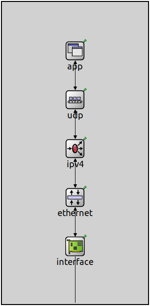
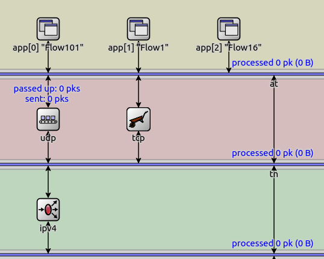

:orphan:

.. _dg:cha:tags

Communicating with Tags
=======================

Overview
--------

Modules often exchange information by sending packets along with supplementary
data, referred to as tags. A tag is usually a small data structure that focuses
on a single parameterization aspect of a protocol. Tags can be attached to the
whole packet, known as packet tags, or to specific parts of the packet, known
as region tags. Tags are implemented as data container C++ classes and they are
usually generated by the OMNeT++ MSG compiler. These are the primary types of
tags:

 - *requests* carry information from higher layers to lower layers (e.g. :cpp:`MacAddressReq`).
 - *indications* carry information from lower layers to higher layers (e.g. :cpp:`InterfaceInd`).
 - *plain tags* contain some meta-information (e.g. :cpp:`PacketProtocolTag`).
 - *base classes* must not be attached to packets (e.g. :cpp:`TagBase`).

For example, a request tag that specifies the source and destination MAC address
could be implemented in an MSG file as follows:

.. literalinclude:: lib/Snippets.msg
   :language: msg
   :start-after: !TagDefinitionExeample
   :end-before: !End
   :name: Tag definition example

The following list gives a short description of several often used packet tags:

 - :cpp:`PacketProtcolTag` specifies the protocol of the packet's contents
 - :cpp:`DispatchProtocolReq` specifies the receiver protocol module inside the network node
 - :cpp:`EncapsulationProcotolReq` specifies the requested protocol header encapsulation order
 - :cpp:`SocketReq` specifies the application socket
 - :cpp:`L4PortReq` specifies the source and destination ports
 - :cpp:`L3AddressReq` specifies source and destination network addresses
 - :cpp:`InterfaceReq` specifies the outgoing network interface
 - :cpp:`NextHopAddressReq` specifies the next hop address for packet routing
 - :cpp:`VlanReq` specifies the virtual LAN identifier of IEEE 802.1Q
 - :cpp:`PcpReq` specifies the priority code point of IEEE 802.1Q
 - :cpp:`StreamReq` specifies the TSN stream identifier inside the network node
 - :cpp:`MacAddressReq` specifies source and destination MAC addresses
 - :cpp:`Ieee80211ModeReq` specifies the IEEE 802.11 PHY mode
 - :cpp:`Ieee80211ChannelReq` specifies the IEEE 802.11 channel
 - :cpp:`SignalPowerReq` specifies transmit signal power

All request tags have their indication counterparts. For example, there are
indications such as :cpp:`SocketInd`, :cpp:`InterfaceInd`, :cpp:`StreamInd`.
The requests are usually attached to outgoing packets, the indications are
usually attached to incoming packets.

The following list gives a short description of several often used region tags:

 - :cpp:`IdentityTag` uniquely identifies individual bits in the network over
   the lifetime of the whole simulation
 - :cpp:`CreationTimeTag` specifies the creation time of data regions for
   lifetime measurements
 - :cpp:`FlowTag` specifies the packet flows of data regions for various flow
   specific measurements 
 - :cpp:`PacketEventTag` carries information about queueing, processing,
   transmission, etc. events that happened to data regions

.. _dg:sec:tags:protocol-layers:

Communicating Through Protocol Layers
-------------------------------------

Tags can pass through protocol modules, and they can reach far beyond the module
that initially attached them, in both downward and upward directions. Typically,
tags are removed at the point where they are processed, usually being transformed
into header fields within a packet, or used for some protocol specific decisions.
Protocols have the liberty to disregard any tags at their discretion based on
their configuration and state.

Both packet tags and region tags remain unchanged for many operations that protocol
modules carry out with packets. For example, when packets are enqueued/dequeued,
encapsulated/decapsulated, cloned, buffered, or stored for later reuse, the tags
remain unchanged.

.. _dg:sec:tags:packet-protocol:

Specifying the Protocol of a Packet
-----------------------------------

The most important packet tag is the :cpp:`PacketProtocolTag`. It specifies the
outermost protocol of the packet. This tag should always be present, because the
packet protocol cannot be correctly determined just by looking at the raw data.
In contrast, the inner protocol headers in the packet can be usually recursively
identified by protocol fields such as the protocol ID field of the IPv4 header.
The :cpp:`PacketProtocolTag` is used among others for dissecting the packet
along the protocol headers, or for printing the packet as a human readable
string to help interpreting its contents.

Normally a packet is transformed from one protocol to another in a single step,
so the packet protocol tag either specifies the protocol before the operation
or the protocol after the operation. For example, the :ned:`Udp` protocol module
encapsulates the outgoing packet using a :cpp:`UdpHeader`. The packet protocol
is set to an application specific protocol before the UDP encapsulation and it's
set to UDP protocol after the encapsulation.

Sometimes, protocol implementations themselves are split up into several smaller
modules. For example, the modular Ethernet implementation uses a separate module
for the insertion of the Ethernet MAC header and the Ethernet FCS. This module
structure implies that the packet can be seen between the modules as a partially
built Ethernet MAC protocol packet. In such a case the packet protocol tag can
only specify the inner protocol that is being encapsulated into an Ethernet MAC
frame.

.. _dg:sec:tags:dispatching-packets:

Dispatching Packets to Protocol Modules
---------------------------------------

Inside a network node, protocol modules interact with one another by sending
:cpp:`Packet` or :cpp:`Message` objects. INET is very flexible in terms of what
structure the protocol modules can be connected. Protocols can be connected
directly to each other, or they can be connected through one or more
:ned:`MessageDispatcher` modules. This flexibility allows for the creation of
both simple and complex network node architectures.

How to Connect Protocol Modules
~~~~~~~~~~~~~~~~~~~~~~~~~~~~~~~

Simple network nodes can be constructed, for example, using a linear protocol
stack, where protocol modules are directly connected to one another without
using message dispatcher modules.

   Simple network node structure in the IDE

More complex network nodes can be created by grouping protocols into layers and
connecting them through :ned:`MessageDispatcher` modules, which facilitates
many-to-one and many-to-many relationships among the protocols of the layers.

   Complex network node structure in Qtenv

It's also possible to use message dispatcher modules hierarchically within
multiple levels of nested compound modules. Ultimately, one could even connect
all protocols to a single central message dispatcher module. There is an important
limitation though, only one instance of a given protocol module can be connected
to a message dispatcher.

To support the packet dispatching mechanism, certain additional requirements
must be met in C++ code:

 - protocols must be registered using :fun:`registerProtocol`
 - packets must have :cpp:`DispatchProtocolReq` tags attached

Registering Protocols
~~~~~~~~~~~~~~~~~~~~~

Protocol modules must call the :fun:`registerProtocol` function from the :fun:`initialize` method to inform connected :ned:`MessageDispatcher`
modules of their presence. The following code fragment demonstrates this for the
IPv4 protocol implementation:

.. literalinclude:: lib/Snippets.cc
   :language: cpp
   :start-after: !ProtocolRegistrationExample
   :end-before: !End
   :name: Protocol registration example

Registering the protocols allows the dispatcher modules to learn which gates
the protocol modules are connected to. The same protocol is not allowed to be
registered in the same message dispatcher using different gates, because that
would make the dispatching mechanism ambiguous.

Sending Packets with Dispatch Request
~~~~~~~~~~~~~~~~~~~~~~~~~~~~~~~~~~~~~

Packets and messages must have the :cpp:`DispatchProtocolReq` tag attached to
them in order for the message dispatcher modules to correctly dispatch them to
the intended recipient within the network node. The following example shows how
a MAC protocol could send up a packet to the :ned:`Ipv4` protocol module without
actually knowing where that module is connected in the network node architecture:

.. literalinclude:: lib/Snippets.cc
   :language: cpp
   :start-after: !PacketDispatchingExample
   :end-before: !End
   :name: Packet dispatching example

The :cpp:`DispatchProtocolReq` tag specifies both the intended recipient protocol
and the requested service primitive. The service primitive, similarly to OSI
terminology, can be one of:

 - :cpp:`SP_REQUEST` for service requests from layer N+1 to layer N
 - :cpp:`SP_CONFIRM` for service confirmations from layer N to layer N+1
 - :cpp:`SP_INDICATION` for protocol indications from layer N to layer N+1
 - :cpp:`SP_RESPONSE` for protocol response from layer N+1 to layer N

Currently, INET modules only use the :cpp:`SP_REQUEST` and :cpp:`SP_INDICATION`
service primitives, the other two are only present for completeness. The request
service primitive is used when a higher layer protocol module (e.g. :ned:`Tcp`)
wants to deliver a packet to a lower layer protocol module (e.g. :ned:`Ipv4`).
Similarly, the :cpp:`SP_INDICATION` service primitive is used when a lower layer
protocol module (e.g. :ned:`Ethernet`) wants to deliver a packet to a higher layer
protocol module (e.g. :ned:`Ipv4`).

Determining the Next Protocol
-----------------------------

A protocol module has several options for determining which protocol to forward
a packet to. The list below shows some possibilities:

 - The next protocol can be hard-coded in C++. For example, the UDP protocol is
   hard-coded in C++ in the :cpp:`UdpSocket` class, and similarly other protocols
   are also hard-coded in other protocol specific sockets.

 - The next protocol can be specified by a module parameter, as is the case of
   a network interface module specifying its expected protocol. The :ned:`Ipv4`
   module uses this information to dispatch a packet to the expected protocol
   of the selected route's network interface.

 - The next protocol can be dependent on module state. For example, the TSN
   stream encoder module forwards packets that match the TSN stream mapping to
   the 802.1 Q-TAG protocol for encapsulation.

 - The next protocol can be determined by a packet header field. For example,
   the :ned:`Ipv4` module uses the IP protocol ID header field from the 
   :cpp:`Ipv4Header` to look up the next protocol as shown below:

   .. literalinclude:: lib/Snippets.cc
      :language: cpp
      :start-after: !NextProtocolExample
      :end-before: !End
      :name: Next protocol example

 - The next protocol can be determined by some packet meta-data. For example,
   the :ned:`Tcp` module uses the type of the destination address from the
   :cpp:`L3AddressReq` tag to determine if the packet should be sent to the
   :ned:`Ipv4` or :ned:`Ipv6` module.

 - The next protocol can be indirectly specified by a protocol encapsulation
   request. For example, other modules may have attached an :cpp:`EncapsulationProtocolReq`
   to the packet in an earlier stage of the packet processing.

.. _dg:sec:tags:encapsulation-order:

Controlling the Packet Encapsulation Order
------------------------------------------

A packet typically contains multiple protocol-specific headers, such as TCP, IP,
Ethernet, and sometimes additional optional headers like 802.1Q, 802.1R, 802.1AE,
and others. The order of packet headers is determined by the order in which the
packet reaches the relevant protocol modules for encapsulation.

The encapsulation process may need to be different for each packet. For example,
an application may need to send a packet to a specific VLAN. In this case, the
application should attach a :cpp:`VlanReq` tag to the packet with the desired
VLAN ID. However, it cannot directly send the packet to the relevant 802.1Q
protocol module, because the packet may need to be delivered to the UDP protocol
first. To achieve the desired protocol encapsulation order, the application should
also attach an :cpp:`EncapsulationProtocolReq` tag specifying that the packet
should ultimately be delivered to the 802.1Q protocol for encapsulation. The
underlying protocol modules will use this information to determine when the
802.1Q encapsulation should take place.

The :cpp:`EncapsulationProtocolReq` generally outlines the sequence of protocol
modules that a packet should be delivered to for further encapsulation. Additional
tags attached to the packet are used as additional parameters for the requested
processing steps. The attached encapsulation request may be changed several times
during packet processing, new protocols may be added, already added protocols
may be removed, and so on.

For example, the IP protocol determines the outgoing interface using the routing
table and the destination address. The selected network interface specifies the
expected protocol that the packet should have in order for the interface module
to operate properly. The specified protocol is appended to the end of the requested
encapsulation protocols of the packet, because it should be the last encapsulation
before the packet reaches the network interface. For example, if the IP module
selects an Ethernet network interface, then it appends the Ethernet MAC protocol
to the :cpp:`EncapsulationProtocolReq`, and the packet is ultimately encapsulated
into an :cpp:`EthernetMacHeader` before reaching the network interface module.

.. _dg:sec:tags:inbound-packets-to-outbound:

Transforming Inbound Packets to Outbound
----------------------------------------

As part of the forwarding process of Ethernet switches, an inbound packet is
transformed into an outbound packet. This process is carried out by default in
the :ned:`PacketDirectionReverser` module. The transformation is more like a
policy and it can be replaced by the user with other modules. The default module
doesn't change the packet contents except for removing the already popped front
and back parts, but it changes the attached packet tags significantly.

The inbound packet usually contains a few tags such as :cpp:`PacketProtocolTag`
and :cpp:`DirectionTag`, and it also contains several indications such as the
:cpp:`InterfaceInd`, :cpp:`MacAddressInd`, :cpp:`VlandInd`, :cpp:`PcpInd`,
:cpp:`EncapsulationProtocolInd` and so on. The transformation keeps only the
:cpp:`PacketProtocolTag`, it removes all attached indications, and attaches a
set of requests so that the packet will be encapsulated in the same protocol
headers, and it will be sent out on the same interface as it came in.

Of course, this is just the start of the processing of the outbound packet.
During the several steps that follows any of the attached requests can be
replaced with new ones potentially ultimately resulting in the packet to be
handled in a completely different way.
