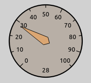
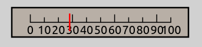
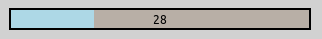
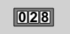
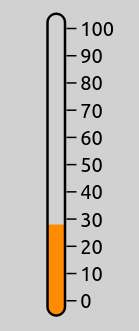
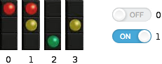
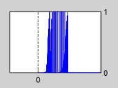

.. _ug:cha:instrument-figures:

Instrument Figures
==================

.. _ug:sec:instruments:overview:

Overview
--------

In complex simulations, there are usually several statistics that are vital
for understanding what is happening inside the network. Although statistics
can also be found and read in Qtenv's object inspector panel, it is often more
convenient to directly display them on the top-level canvas in a graphical form.
INET supports such visualization in the form of inspector figures
that display various gauges and meters. This chapter covers the usage
of instrument figures.

Instrument Types
----------------

Some of the instrument figure types available in INET are the following:

- *gauge:* A circular gauge similar to a speedometer or pressure indicator.

- *linearGauge:* A horizontal linear gauge similar to a VU meter.

- *progressMeter:* A horizontal progress bar.

- *counter:* An integer counter.

- *thermometer:* A vertical meter visually similar to a real-life thermometer.

- *indexedImage:* A figure that displays one of several images: the first image for the value 0, the second image for the value of 1, and so on.

- *plot:* An XY chart that plots a statistic in the function of time.

Using Instrument Figures
------------------------

Instrument figures visualize statistics derived from signals emitted by
modules in the network. This statistic is declared in the NED file, with
the ``@statistic`` property. The property's ``source`` attribute is an
expression that specifies which signals to use from which modules, and
the mathematical operations on it, to derive the statistic. The
``record`` attribute specifies where the values of the statistic is
recorded into. In the case of instrument figures, this is set to
``figure``, i.e. ``record=figure``. The ``targetFigure`` attribute
selects which figure should display the statistic.

The instrument figure itself is specified in the NED file with the
``@figure`` property. The property's ``type`` attribute selects
the type of the instrument figure (``gauge``, ``thermometer``, etc.),
and the property's index (i.e. the figure name) should match the
name given in the statistic's ``targetFigure`` attribute.

Here is an example NED file:

.. code-block:: none

   @statistic[numRcvdPk](source=count(client.app[0].rcvdPk); record=figure; targetFigure=counter);
   @figure[numRcvdPkCounter](type=counter; pos=413,327; label="Packets received"; decimalPlaces=4);

This creates a figure named ``numRcvdPkCounter``, which displays a counter.
The statistic ``numRcvdPk`` counts the packets received by the ``client`` host's
first application, and records it in the ``numRcvdPkCounter`` figure.

Instrument Figure Attributes
----------------------------

Instrument figures have various attributes that customize their
position, size, appearance, label text and font, minimum and maximum
values, and so on. The following list shows the attributes recognized
by the various figure types (a similar list can be produced by running
INET with the ``-h figures`` command-line option):

``counter``:
   ``type``, ``visible``, ``zIndex``, ``tooltip``, ``tags``, ``transform``, ``backgroundColor``, ``decimalPlaces``, ``digitBackgroundColor``, ``digitBorderColor``, ``digitFont``, ``digitColor``, ``label``, ``labelFont``, ``labelColor``, ``initialValue``, ``pos``, ``anchor``, ``labelOffset``
``gauge``:
   ``type``, ``visible``, ``zIndex``, ``tooltip``, ``tags``, ``transform``, ``backgroundColor``, ``needleColor``, ``label``, ``labelFont``, ``labelColor``, ``minValue``, ``maxValue``, ``tickSize``, ``colorStrip``, ``initialValue``, ``pos``, ``size``, ``anchor``, ``bounds``, ``labelOffset``
``indexedImage``:
   ``type``, ``visible``, ``zIndex``, ``tooltip``, ``tags``, ``transform``, ``images``, ``tintAmount``, ``tintColor``, ``opacity``, ``interpolation``, ``label``, ``labelFont``, ``labelColor``, ``labelOffset``, ``initialValue``, ``pos``, ``size``, ``anchor``, ``bounds``
``indicatorLabel``:
   ``type``, ``visible``, ``zIndex``, ``tooltip``, ``tags``, ``transform``, ``pos``, ``anchor``, ``text``, ``font``, ``color``, ``opacity``, ``halo``, ``textFormat``, ``initialValue``
``indicatorText``:
   ``type``, ``visible``, ``zIndex``, ``tooltip``, ``tags``, ``transform``, ``pos``, ``anchor``, ``text``, ``font``, ``color``, ``opacity``, ``halo``, ``textFormat``, ``initialValue``
``linearGauge``:
   ``type``, ``visible``, ``zIndex``, ``tooltip``, ``tags``, ``transform``, ``backgroundColor``, ``needleColor``, ``label``, ``labelFont``, ``labelColor``, ``minValue``, ``maxValue``, ``tickSize``, ``cornerRadius``, ``initialValue``, ``pos``, ``size``, ``anchor``, ``bounds``, ``labelOffset``
``plot``:
   ``type``, ``visible``, ``zIndex``, ``tooltip``, ``tags``, ``transform``, ``valueTickSize``, ``timeWindow``, ``timeTickSize``, ``lineColor``, ``minValue``, ``maxValue``, ``backgroundColor``, ``label``, ``labelOffset``, ``labelColor``, ``labelFont``, ``numberSizeFactor``, ``pos``, ``size``, ``anchor``, ``bounds``
``progressMeter``:
   ``type``, ``visible``, ``zIndex``, ``tooltip``, ``tags``, ``transform``, ``backgroundColor``, ``stripColor``, ``cornerRadius``, ``borderWidth``, ``minValue``, ``maxValue``, ``text``, ``textFont``, ``textColor``, ``label``, ``labelOffset``, ``labelFont``, ``labelColor``, ``initialValue``, ``pos``, ``size``, ``anchor``, ``bounds``
``thermometer``:
   ``type``, ``visible``, ``zIndex``, ``tooltip``, ``tags``, ``transform``, ``mercuryColor``, ``label``, ``labelFont``, ``labelColor``, ``minValue``, ``maxValue``, ``tickSize``, ``initialValue``, ``pos``, ``size``, ``anchor``, ``bounds``, ``labelOffset``
