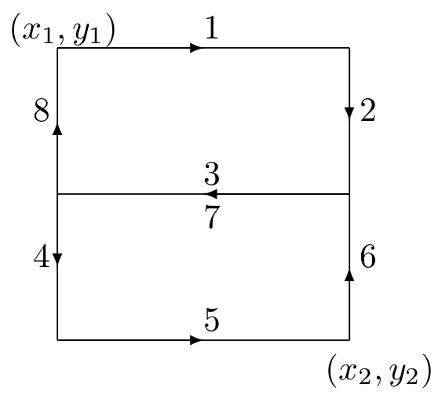

.. role:: raw-latex(raw)
   :format: latex
..

.. _ug:cha:mobility:

Node Mobility
=============

.. _ug:sec:mobility:overview:

Overview
--------

In order to simulate ad-hoc wireless networks, it is important to model
the motion of mobile network nodes. Received signal strength, signal
interference, and channel occupancy depend on the distances between
nodes. The selected mobility models can significantly influence the
results of the simulation (e.g. via packet loss rates).

A mobility model describes position and orientation over time in a 3D
Euclidean coordinate system. Its main purpose is to provide position,
velocity and acceleration, and also angular position, angular velocity,
and angular acceleration data as three-dimensional quantities at the
current simulation time.

In INET, a mobility model is most often an OMNeT++ simple module
implementing the motion as a C++ algorithm. Although most models have a
few common parameters (e.g. for initial positioning), they always come
with their own set of parameters. Some models support geographic
positioning to ease the configuration of map based scenarios.

Mobility models be *single* or *group* mobility models. Single mobility
models describe the motion of entities independent of each other. Group
mobility models provide such a motion where group members are dependent
on each other.

Mobility models can also be categorized as *trace-based*,
*deterministic*, *stochastic*, and *combining* models.

Using Mobility Models
~~~~~~~~~~~~~~~~~~~~~

In order for a mobility model to actually have an effect on the motion
of a network node, the mobility model needs to be included as a
submodule in the compound module of the network node. By default, a
transceiver antenna within a network node uses the same mobility model
as the node itself, but that is completely optional. For example, it is
possible to model a vehicle facing forward while moving on a road that
contains multiple transceiver antennas at different relative locations
with different orientations.

The Scene
~~~~~~~~~

Many mobility models allow the user to define a cubic volume that the
node can not leave. The volume is configured by setting the
:par:`constraintAreaX`, :par:`constraintAreaY`, :par:`constraintAreaZ`,
:par:`constraintAreaWidth`, :par:`constraintAreaHeight` and
:par:`constraintAreaDepth` parameters.

If the :par:`initFromDisplayString` parameter, the initial position is
taken from the display string. Otherwise, the position can be given in
the :par:`initialX`, :par:`initialY` and :par:`initialZ` parameters. If
neither of these parameters are given, a random initial position is
choosen within the contraint area.

When the node reaches the boundary of the constraint area, the mobility
component has to prevent the node to exit. Many mobility models offer
the following policies:

-  reflect of the wall

-  reappear at the opposite edge (torus area)

-  placed at a randomly chosen position of the area

-  stop the simulation with an error

.. _ug:sec:mobility:built-in-mobility-models:

Built-In Mobility Models
------------------------

.. _ug:sec:mobility:list-of-mobility-models:

List of Mobility Models
~~~~~~~~~~~~~~~~~~~~~~~

The following, potentially list contains the mobility models available
in INET. Nearly all of these models als single mobility models; group
mobility can be implemented e.g. with combining other mobility models.

Stationary
^^^^^^^^^^

Stationary models only define position (and orientation), but no motion.

-  :ned:`StationaryMobility` provides deterministic and random
   positioning.

-  :ned:`StaticGridMobility` places several mobility models in a
   rectangular grid.

-  :ned:`StaticConcentricMobility` places several models in a set of
   concentric circles.

Deterministic
^^^^^^^^^^^^^

Deterministic mobility models use non-random mathematical models for
describing motion.

-  :ned:`LinearMobility` moves linearly with a constant speed or
   constant acceleration.

-  :ned:`CircleMobility` moves around a circle parallel to the XY plane
   with constant speed.

-  :ned:`RectangleMobility` moves around a rectangular area parallel to
   the XY plane with constant speed.

-  :ned:`TractorMobility` moves similarly to a tractor on a field with a
   number of rows.

-  :ned:`VehicleMobility` moves similarly to a vehicle along a path
   especially turning around corners.

-  :ned:`TurtleMobility` moves according to an XML script written in a
   simple yet expressive LOGO-like programming language.

-  :ned:`FacingMobility` orients towards the position of another
   mobility model.

Trace-Based
^^^^^^^^^^^

Trace-based mobility models replay recorded motion as observed in real
life.

-  :ned:`BonnMotionMobility` replays trace files of the BonnMotion
   scenario generator.

-  :ned:`Ns2MotionMobility` replays files of the CMU’s scenario
   generator used in ns2.

-  :ned:`AnsimMobility` replays XML trace files of the ANSim (Ad-Hoc
   Network Simulation) tool.

Stochastic
^^^^^^^^^^

Stochastic or random mobility models use mathematical models involving
random numbers.

-  :ned:`RandomWaypointMobility` moves to random destination with random
   speed.

-  :ned:`GaussMarkovMobility` uses one parameter to vary the degree of
   randomness from linear to Brown motion.

-  :ned:`MassMobility` moves similarly to a mass with inertia and
   momentum.

-  :ned:`ChiangMobility` uses a probabilistic transition matrix to
   change the motion state.

Combining
^^^^^^^^^

Combining mobility models are not mobility models per se, but instead,
they allow more complex motions to be formed from simpler ones via
superposition and other ways.

-  :ned:`SuperpositioningMobility` model combines several other mobility
   models by summing them up. It allows creating group mobility by
   sharing a mobility model in each group member, separating initial
   positioning from positioning during the simulation, and separating
   positioning from orientation.

-  :ned:`AttachedMobility` models a mobility that is attached to another
   one at a given offset. Position, velocity and acceleration are all
   affected by the respective quantites and also the orientation of the
   referenced mobility.

.. _ug:sec:mobility:more-information-on-some-mobility-models:

More Information on Some Mobility Models
~~~~~~~~~~~~~~~~~~~~~~~~~~~~~~~~~~~~~~~~

TractorMobility
^^^^^^^^^^^^^^^

Moves a tractor through a field with a certain amount of rows. The
following figure illustrates the movement of the tractor when the
:par:`rowCount` parameter is 2. The trajectory follows the segments in
``1,2,3,4,5,6,7,8,1,2,3...`` order. The area is configured by the
:par:`x1`, :par:`y1`, :par:`x2`, :par:`y2` parameters.

.. PDF version f image:
   \setlength{\unitlength}{0.5mm}
   (80,80) (40,72):math:`1` (10,70)(1,0)30 (10,70)(1,0)60 (72,55):math:`2`
   (70,70)(0,-1)15 (70,70)(0,-1)30 (40,42):math:`3` (70,40)(-1,0)30
   (70,40)(-1,0)60 (5,25):math:`4` (10,40)(0,-1)15 (10,40)(0,-1)30
   (40,12):math:`5` (10,10)(1,0)30 (10,10)(1,0)60 (72,25):math:`6`
   (70,10)(0,1)15 (70,10)(0,1)30 (40, 33)\ :math:`7` (5,55):math:`8`
   (10,40)(0,1)15 (10,40)(0,1)30 (0,72):math:`(x_1,y_1)`
   (65,2):math:`(x_2,y_2)`

RandomWaypointMobility
^^^^^^^^^^^^^^^^^^^^^^

In the Random Waypoint mobility model the nodes move in line segments.
For each line segment, a random destination position (distributed
uniformly over the scene) and a random speed is chosen. You can
define a speed as a variate from which a new value will be drawn for
each line segment; it is customary to specify it as
``uniform(minSpeed, maxSpeed)``. When the node reaches the target
position, it waits for the time :par:`waitTime` which can also be
defined as a variate. After this time the the algorithm calculates a new
random position, etc.

GaussMarkovMobility
^^^^^^^^^^^^^^^^^^^

The Gauss-Markov model contains a tuning parameter that control the
randomness in the movement of the node. Let the magnitude and direction
of speed of the node at the :math:`n`\ th time step be :math:`s_n` and
:math:`d_n`. The next speed and direction are computed as

.. math:: s_{n+1} = \alpha s_n + (1 - \alpha) \bar{s} + \sqrt{(1-\alpha^2)} s_{x_n}

.. math:: d_{n+1} = \alpha s_n + (1 - \alpha) \bar{d} + \sqrt{(1-\alpha^2)} d_{x_n}

where :math:`\bar{s}` and :math:`\bar{d}` are constants representing the
mean value of speed and direction as :math:`n \to \infty`; and
:math:`s_{x_n}` and :math:`d_{x_n}` are random variables with Gaussian
distribution.

Totally random walk (Brownian motion) is obtained by setting
:math:`\alpha=0`, while :math:`\alpha=1` results a linear motion.

To ensure that the node does not remain at the boundary of the
constraint area for a long time, the mean value of the direction
(:math:`\bar{d}`) modified as the node enters the margin area. For
example at the right edge of the area it is set to 180 degrees, so the
new direction is away from the edge.

MassMobility
^^^^^^^^^^^^

This is a random mobility model for a mobile host with a mass. It is the
one used in :raw-latex:`\cite{Perkins99optimizedsmooth}`.

   "An MH moves within the room according to the following pattern. It
   moves along a straight line for a certain period of time before it
   makes a turn. This moving period is a random number, normally
   distributed with average of 5 seconds and standard deviation of 0.1
   second. When it makes a turn, the new direction (angle) in which it
   will move is a normally distributed random number with average equal
   to the previous direction and standard deviation of 30 degrees. Its
   speed is also a normally distributed random number, with a controlled
   average, ranging from 0.1 to 0.45 (unit/sec), and standard deviation
   of 0.01 (unit/sec). A new such random number is picked as its speed
   when it makes a turn. This pattern of mobility is intended to model
   node movement during which the nodes have momentum, and thus do not
   start, stop, or turn abruptly. When it hits a wall, it reflects off
   the wall at the same angle; in our simulated world, there is little
   other choice."

This implementation can be parameterized a bit more, via the
:par:`changeInterval`, :par:`changeAngleBy` and :par:`changeSpeedBy`
parameters. The parameters described above correspond to the following
settings:

-  changeInterval = normal(5, 0.1)

-  changeAngleBy = normal(0, 30)

-  speed = normal(avgSpeed, 0.01)

ChiangMobility
^^^^^^^^^^^^^^

Implements Chiang’s random walk movement model
(:raw-latex:`\cite{Chiang98wirelessnetwork}`). In this model, the state
of the mobile node in each direction (x and y) can be:

-  0: the node stays in its current position

-  1: the node moves forward

-  2: the node moves backward

The :math:`(i,j)` element of the state transition matrix determines the
probability that the state changes from :math:`i` to :math:`j`:

.. math::

   \left(
   \begin{array}{ccc}
     0 & 0.5 & 0.5 \\
     0.3 & 0.7 & 0 \\
     0.3 & 0 & 0.7
   \end{array}
   \right)

.. _ug:sec:mobility:replaying-trace-files:

Replaying trace files
~~~~~~~~~~~~~~~~~~~~~

BonnMotionMobility
^^^^^^^^^^^^^^^^^^

Uses the native file format of `BonnMotion <http://bonnmotion.net>`__.

The file is a plain text file, where every line describes the motion of
one host. A line consists of one or more (t, x, y) triplets of real
numbers, like:

::

   t1 x1 y1 t2 x2 y2 t3 x3 y3 t4 x4 y4 ...

The meaning is that the given node gets to :math:`(xk,yk)` at
:math:`tk`. There’s no separate notation for wait, so x and y
coordinates will be repeated there.

Ns2MotionMobility
^^^^^^^^^^^^^^^^^

Nodes are moving according to the trace files used in NS2. The trace
file has this format:

::

   # '#' starts a comment, ends at the end of line
   $node_(<id>) set X_ <x> # sets x coordinate of the node identified by <id>
   $node_(<id>) set Y_ <y> # sets y coordinate of the node identified by <id>
   $node_(<id>) set Z_ <z> # sets z coordinate (ignored)
   $ns at $time "$node_(<id>) setdest <x> <y> <speed>" # at $time start moving
   towards <x>,<y> with <speed>

The :ned:`Ns2MotionMobility` module has the following parameters:

-  :par:`traceFile` the Ns2 trace file

-  :par:`nodeId` node identifier in the trace file; -1 gets substituted
   by parent module’s index

-  :par:`scrollX`, :par:`scrollY` user specified translation of the
   coordinates

ANSimMobility
^^^^^^^^^^^^^

It reads trace files of the `ANSim <http://www.ansim.info>`__ Tool. The
nodes are moving along linear segments described by an XML trace file
conforming to this DTD:

.. code-block:: xml

   <!ELEMENT mobility (position_change*)>
   <!ELEMENT position_change (node_id, start_time, end_time, destination)>
   <!ELEMENT node_id (#PCDATA)>
   <!ELEMENT start_time (#PCDATA)>
   <!ELEMENT end_time (#PCDATA)>
   <!ELEMENT destination (xpos, ypos)>
   <!ELEMENT xpos (#PCDATA)>
   <!ELEMENT ypos (#PCDATA)>

Parameters of the module:

-  :par:`ansimTrace` the trace file

-  :par:`nodeId` the ``node_id`` of this node, -1 gets substituted to
   parent module’s index

.. note::

   The :ned:`AnsimMobility` module processes only the ``position_change``
   elements and it ignores the ``start_time`` attribute. It starts the move
   on the next segment immediately.

.. _ug:sec:mobility:turtlemobility:

TurtleMobility
~~~~~~~~~~~~~~

The :ned:`TurtleMobility` module can be parametrized by a script file
containing LOGO-style movement commands in XML format. The content of
the XML file should conform to the DTD in the
:file:`TurtleMobility.dtd` file in the source tree.

The file contains ``movement`` elements, each describing a
trajectory. The ``id`` attribute of the ``movement`` element can
be used to refer the movement from the ini file using the syntax:

.. code-block:: ini

   **.mobility.turtleScript = xmldoc("turtle.xml", "movements//movement[@id='1']")

The motion of the node is composed of uniform linear segments. The
``movement`` elements may contain the the following commands as
elements (names in parens are recognized attribute names):

-  ``repeat(n)`` repeats its content n times, or indefinitely if the
   ``n`` attribute is omitted.

-  ``set(x,y,speed,angle,borderPolicy)`` modifies the state of the
   node. ``borderPolicy`` can be ``reflect``, ``wrap``,
   ``placerandomly`` or ``error``.

-  ``forward(d,t)`` moves the node for ``t`` time or to the
   ``d`` distance with the current speed. If both ``d`` and
   ``t`` is given, then the current speed is ignored.

-  ``turn(angle)`` increase the angle of the node by ``angle``
   degrees.

-  ``moveto(x,y,t)`` moves to point ``(x,y)`` in the given time.
   If :math:`t` is not specified, it is computed from the current speed.

-  ``moveby(x,y,t)`` moves by offset ``(x,y)`` in the given time.
   If :math:`t` is not specified, it is computed from the current speed.

-  ``wait(t)`` waits for the specified amount of time.

Attribute values must be given without physical units, distances are
assumed to be given as meters, time intervals in seconds and speeds in
meter per seconds. Attibutes can contain expressions that are evaluated
each time the command is executed. The limits of the constraint area can
be referenced as ``$MINX``, ``$MAXX``, ``$MINY``, and ``$MAXY``. Random
number distibutions generate a new random number when evaluated, so the
script can describe random as well as deterministic scenarios.

To illustrate the usage of the module, we show how some mobility models
can be implemented as scripts.

RectangleMobility:

.. code-block:: xml

   <movement>
       <set x="$MINX" y="$MINY" angle="0" speed="10"/>
       <repeat>
           <repeat n="2">
               <forward d="$MAXX-$MINX"/>
               <turn angle="90"/>
               <forward d="$MAXY-$MINY"/>
               <turn angle="90"/>
           </repeat>
       </repeat>
   </movement>

Random Waypoint:

.. code-block:: xml

   <movement>
       <repeat>
           <set speed="uniform(20,60)"/>
           <moveto x="uniform($MINX,$MAXX)" y="uniform($MINY,$MAXY)"/>
           <wait t="uniform(5,10)">
       </repeat>
   </movement>

MassMobility:

.. code-block:: xml

   <movement>
       <repeat>
           <set speed="uniform(10,20)"/>
           <turn angle="uniform(-30,30)"/>
           <forward t="uniform(0.1,1)"/>
       </repeat>
   </movement>
