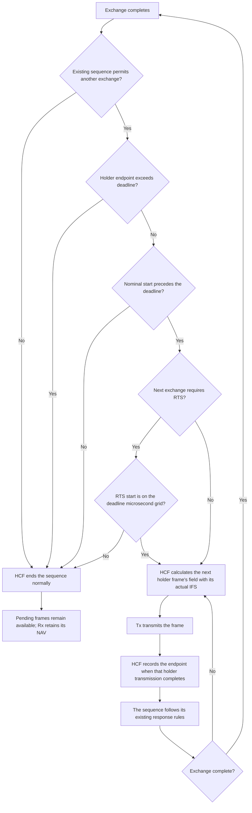

# TXOP multiple protection plan summary for human review

> **Kind:** reference · **Status:** draft · **Seal:** none · **Owns:** — · **Stands on:** [ieee80211-txop-multiple-protection.md](ieee80211-txop-multiple-protection.md)

Source: [ieee80211-txop-multiple-protection.md](ieee80211-txop-multiple-protection.md), revision 19, dated 2026-10-07. The design uses source inspection and IEEE Std 802.11-2024 evidence. Implementation is complete. The full plan records executed verification and its limits.

## Intended result and scope

**The plan adds selectable multiple protection to the existing frame transmission path.** Before this feature, HCF, the hybrid coordination function, rejects multiple protection. The plan changes reservation fields and continuation decisions before later holder transmissions. **It does not repair complete exchange admission or guarantee the complete TXOP duration.** The current admission policy can start a 120 µs exchange when only 100 µs remains.

A transmission opportunity (TXOP) gives a station the right to start frame exchange sequences within a time interval. The holder is the station that owns the TXOP. Multiple protection uses Duration/ID to reserve medium time for that sequence. Other stations use the field to set their network allocation vector (NAV), which records a reservation of the medium.

Enhanced distributed channel access (EDCA) gives access categories different channel access parameters. Each access category retains its selected protection class for the TXOP. **The `protectionMechanism` parameter accepts `single` or `multiple`; single protection remains the default.** Invalid protection values cause an initialization error.

Nominal timing uses the mode set's short interframe space (SIFS) unchanged after the first transmission step. The first step adds no interframe space.

The scope covers current data, management, group traffic, optional request to send/clear to send (RTS/CTS), and immediate Basic Block Ack exchanges. Block Ack reports reception status for multiple MAC frames; a Block acknowledgment request (BAR) requests that response. Existing conventional fragments and A-MSDU also use the calculation when the sequence selects them. An A-MSDU combines multiple service data units within one MAC frame.

Details: [scope](ieee80211-txop-multiple-protection.md#1-intended-behavior-and-scope) and [protection selector](ieee80211-txop-multiple-protection.md#41-select-the-protection-class).

## How the holder calculates the reservation

**For a positive TXOP limit, the plan selects the standard's upper duration bound.** This choice avoids an estimate of every queued frame. For a zero limit, the first field estimates only the exchange that the current sequence selects.

The calculation uses the projected start of the PHY protocol data unit (PPDU), one PHY transmission with its overhead. This start includes the actual interframe space (IFS), the interval before transmission. A raw field value is the calculated duration before conversion to whole microseconds.

For a later frame with a positive limit, the existing holder reservation sets the lower bound; the TXOP deadline sets the upper bound. **Multiple protection stops before another exchange requires a raw field that cannot satisfy both bounds.**

| Condition | Selected raw Duration/ID value |
| --- | --- |
| Zero limit; no holder reservation time remains. | Estimated complete exchange cost minus current PPDU airtime. |
| Zero limit; holder reservation time remains. | Holder reservation time left minus current PPDU airtime, clamped to zero. |
| Positive limit; no holder endpoint exists. | Configured TXOP limit minus current PPDU airtime. |
| Positive limit; a holder endpoint exists, including an expired endpoint. | TXOP budget left minus current PPDU airtime. |

In the last case, the lower bound is holder reservation time left minus current PPDU airtime.

HCF coordinates transmission through the existing frame sequence. It compares the raw bounds before conversion to whole microseconds. It subtracts airtime once and clamps negative fields to zero. It applies ceiling: conversion upward to the next whole microsecond when the result has a fractional part. A holder value above 32,767 µs causes an error before transmission. Conversion precedes the frame copy and frame check sequence calculation.

For example, a hypothetical first DATA PPDU takes 200 µs within a 1,024 µs TXOP. Its field reserves another 824 µs, with an endpoint at 1,024 µs.

The production regression uses a 384 µs limit. Its second RTS starts at 304 µs and reserves the deadline. Protected DATA starts at 432 µs, after that reservation expires. HCF gives DATA a zero field with nominal timing. It does not advertise another full-limit reservation. Complete exchange admission remains outside scope.

Details: [four duration cases and conversion](ieee80211-txop-multiple-protection.md#3-duration-arithmetic).

## Nominal timing and normal stops

Fractional propagation delay can place a later frame start between whole microseconds. Mandatory field ceiling can extend the advertised reservation beyond the TXOP deadline. Short interframe space (SIFS) separates immediate responses and frames within an exchange. The holder retains nominal SIFS.

The hypothetical example uses a 1,024 µs limit, 100 µs DATA, 44 µs ACK, and 16 µs SIFS. Propagation takes 0.2 µs each way. DATA #1 starts at zero and advertises 924 µs. Its reservation ends at 1,024 µs. ACK confirms reception of DATA.

| Frame | Start | Duration/ID | Reservation endpoint | Result |
| --- | ---: | ---: | ---: | --- |
| DATA #1 | 0 µs | 924 µs | 1,024 µs | HCF continues. |
| DATA #2 | 176.4 µs | 748 µs | 1,024.4 µs | HCF stops before DATA #3. |

DATA #2 has a raw field of 747.6 µs. Ceiling gives 748 µs and extends the endpoint by 0.4 µs. After ACK #2, HCF stops because another raw field cannot satisfy both duration bounds. Pending DATA remains available for another TXOP. The stop causes no transmission failure or retry increment.

HCF also rejects a later exchange whose nominal start reaches or exceeds the deadline. For example, ACK at 160 µs leaves 4 µs in a 164 µs TXOP. The next 16 µs SIFS places DATA at 176 µs. HCF stops before that exchange.

A later RTS must start on the deadline's microsecond grid because its legacy airtime is integral. In the fractional example, a required RTS would start at 176.4 µs. HCF stops before RTS, so its protected DATA cannot require an illegal raw field. HCF retains BAR precedence when BAR must precede DATA.

Details: [nominal timing and normal stops](ieee80211-txop-multiple-protection.md#31-nominal-timing-and-normal-stop).

## Component responsibilities and normal completion

`TxopProcedure` retains the selected protection class and one absolute holder endpoint, `reservationEnd`. HCF selects ACK policy and PHY mode before calculation. HCF uses the same actual IFS for calculation and transmission through Tx.

At holder transmission completion, HCF records the maximum of the previous endpoint and completion time plus transmitted duration. This update precedes sequence advancement. `TxopProcedure` clears it at TXOP start and end. This per-category value is not complete TXNAV, the standard's transmitted reservation timer shared by all EDCA access functions.

Rx separately retains a shared NAV from local transmissions and received reservations. **TXOP completion clears the holder endpoint but does not clear Rx's NAV.** Rx retains the reservation until expiry; received traffic can extend its NAV beyond the holder endpoint. For example, the 200 µs group transmission ends its TXOP, but its unused 824 µs reservation continues to block access.

The diagram shows normal continuation under positive-limit multiple protection after an exchange completes. Existing sequence selection and time checks also apply. HCF calculates a field and records an endpoint for each holder frame within the next exchange.

For example, an RTS/CTS/DATA/ACK exchange contains two holder transmissions: RTS and DATA. HCF records an endpoint after each transmission. The received CTS and ACK do not update the holder endpoint.

The checks do not interrupt an active exchange or omit required responses. **Normal completion adds no transmission failure or retry increment.** BAR keeps precedence over DATA. The new checks add no queue extraction; the checks add no rate query, timer, or event.

Details: [endpoint ownership](ieee80211-txop-multiple-protection.md#42-retain-one-holder-endpoint) and [HCF calculation](ieee80211-txop-multiple-protection.md#43-calculate-directly-in-hcf).

## Recipient responses and compatibility

Before this change, Tx extended the recipient's own NAV after CTS, ACK, or Basic Block Ack transmission. A long response duration could therefore make the CTS policy refuse another RTS from the same holder.

The independent recipient NAV fix supplies a required `updateLocalNav` argument to both `ITx::transmitFrame()` overloads. **HCF and DCF holder callers pass `true`; recipient response callers pass `false`.** Tx retains the completed frame's choice across its completion callback.

For example, a recipient completes CTS and ACK without a local NAV update from those responses. It can respond to the next RTS if no received reservation blocks it.

HCF clamps negative CTS, ACK, and immediate Basic Block Ack fields to zero after existing response subtraction. It applies ceiling before transmission. For example, a negative Block Ack result becomes zero; 31.2 µs becomes 32 µs. DCF response conversion remains unchanged.

The NAV change also affects default single protection and DCF. **Custom C++ implementations and callers must adapt; the same implementation commit includes migration instructions and WHATSNEW.**

Details: [explicit NAV choice and migration](ieee80211-txop-multiple-protection.md#45-separate-recipient-responses-from-the-local-nav-update) and [response conversion](ieee80211-txop-multiple-protection.md#46-convert-response-fields-at-their-transmission-boundary).

## Reservation costs and estimate limits

- **Unused reservations persist because the plan adds no CF-End.** A positive-limit group exchange sends one group frame without ACK or repetition. The 200 µs group example leaves its entire 824 µs reservation unused. Other stations and the holder's other access categories remain blocked until expiry.
- A zero limit permits the selected exchange only. A selected fragment reserves that fragment and its response, not the entire fragment set. Another unrelated unit needs another grant.
- Zero-limit RTS calculations estimate modes without retention. A later DATA mode can differ, and rate queries can change rate-control state even if CTS fails. The plan preserves those query effects. **The estimate does not guarantee protection through the actual response.**

For example, the plan's hypothetical slower-DATA case uses a complete 96-byte MPDU, which is one MAC frame. RTS, CTS, and ACK use 6 Mbps, with zero propagation delay. A deterministic rate-control test double supplies a 9 Mbps DATA mode for the RTS estimate and a 6 Mbps mode for actual transmission. The reservation ends at 296 µs, but ACK ends at 340 µs, which is 44 µs later. This case demonstrates the estimate's limit; it does not claim that AARF decreases the rate during a successful RTS/CTS exchange. AARF is the adaptive rate controller used in the plan's separate rate-query cases.

Details: [reservation costs](ieee80211-txop-multiple-protection.md#1-intended-behavior-and-scope) and [zero-limit estimates](ieee80211-txop-multiple-protection.md#44-estimate-the-zero-limit-exchange).

## Conditions for timing and ownership

- The timing reference scope uses whole-microsecond positive limits, integer-airtime initial PPDUs, and legacy RTS modes with integer airtime. Fractional initial or RTS airtime needs separate treatment for multi-step exchanges.
- The ownership proof requires effective AIFSN of at least 1. AIFSN specifies the slot count that supplements SIFS before EDCA contention. Normal EDCA independently requires at least 1 for access points (APs) and 2 for non-AP stations. The plan excludes smaller effective values and adds no general parameter validation.

Details: [timing conditions](ieee80211-txop-multiple-protection.md#31-nominal-timing-and-normal-stop) and [ownership conditions](ieee80211-txop-multiple-protection.md#42-retain-one-holder-endpoint).

## Procedures outside scope

- Full shared TXNAV, strict TXNAV continuation, overrun repair, prepared exchanges, queue snapshots, retained mode plans, and request cancellation remain outside scope.
- New fragmentation, A-MPDU, Compressed Block Ack, CTS-to-self, dual CTS, CF-End, PIFS recovery, and TXOP sharing remain outside scope.
- The proposal adds no reverse direction, beamforming, S1G procedures, or multi-user exchanges.
- General rate selection, recipient response timing, and MAC lifecycle repair remain outside scope.

Current MAC stop and crash handlers are empty. **A new grant clears the holder endpoint, but the plan does not establish safe MAC stop/start behavior.**

Details: [excluded procedures](ieee80211-txop-multiple-protection.md#1-intended-behavior-and-scope) and [lifecycle limits](ieee80211-txop-multiple-protection.md#6-acceptance-and-lifecycle-limits).

## Implementation order and required evidence

The independent [recipient NAV fix](ieee80211-recipient-nav.md) supplies the Tx contract and HCF/DCF caller choices before this feature. Its tests check repeated RTS, received NAV refusal, holder updates, and callback choice replacement. Its commit also owns the migration instructions and all 24 causal fingerprint rows.

1. HCF converts response fields before transmission. Tests cover negative and fractional response values under single protection.
2. HCF supplies isolated duration arithmetic before its production caller. Direct tests check the equations, conversion, range errors, and field bytes.
3. `TxopProcedure`, HCF, and HcfFs add selection, endpoint state, zero-limit estimates, and nominal stop checks. HCF calls the prepared arithmetic.
4. User documentation explains nominal timing, estimate limits, unused reservations, and support conditions.

The nominal feature includes deadline checks and the expired-reservation calculation. Direct tests cover both boundaries.

Unit and module cases use seed 0 and fixed inputs, except for declared rate-control cases. Module cases use production components. They check fields, serialized bytes, transmission starts, channel grants, endpoint cleanup, and NAV expiry. Group tests inspect the holder endpoint before cleanup and Rx's reservation separately afterward.

**Acceptance requires nominal timing, arithmetic boundaries, normal refusal without false retries, failure recovery, and comparison with the recorded master baseline.** Debug and release builds, architecture checks, and selected Wi-Fi fingerprint comparisons support publication. Candidate fingerprint rows are not verified passes; baseline updates require their stated cause, scope, and approval.

Details: [implementation steps and tests](ieee80211-txop-multiple-protection.md#5-implementation-steps-and-tests) and [acceptance](ieee80211-txop-multiple-protection.md#6-acceptance-and-lifecycle-limits).
