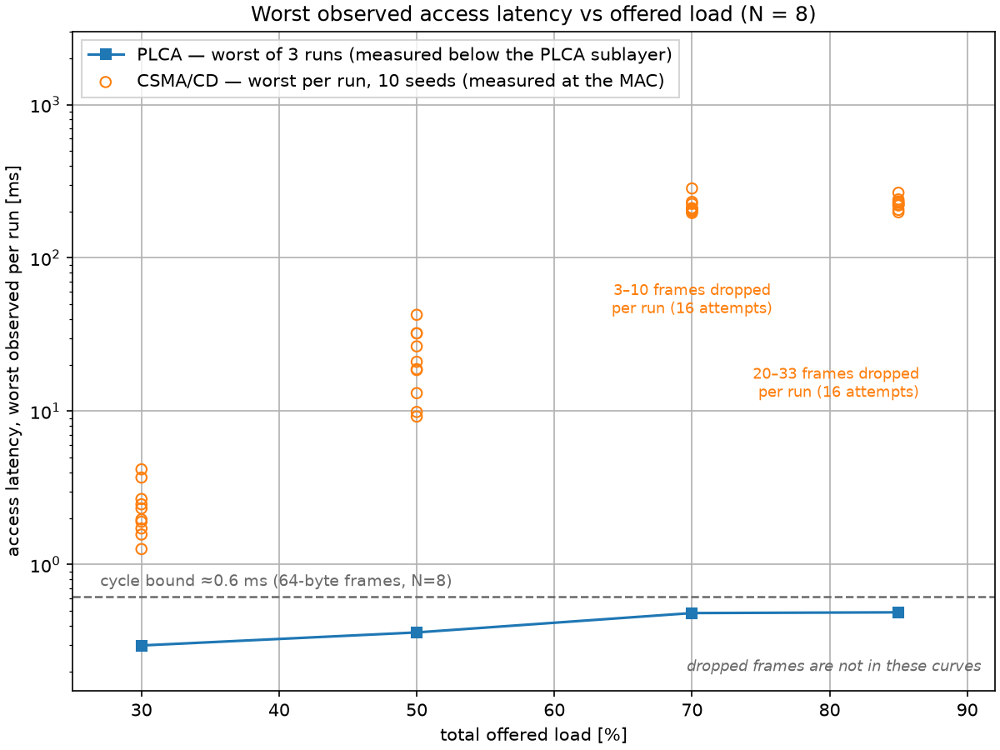
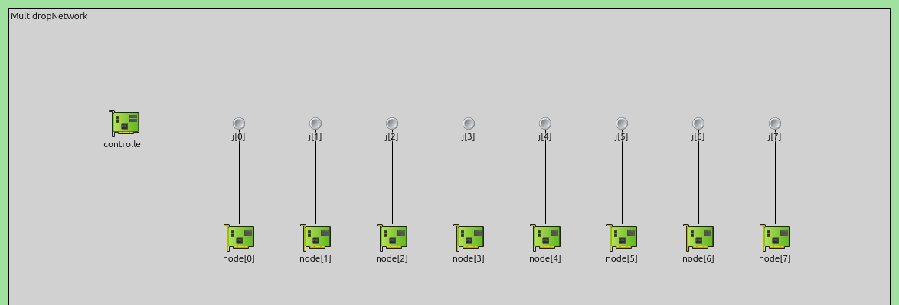
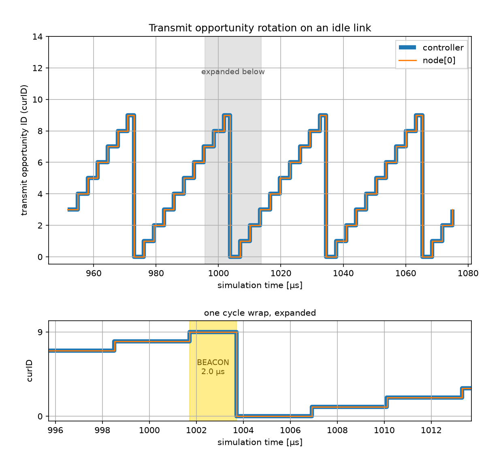
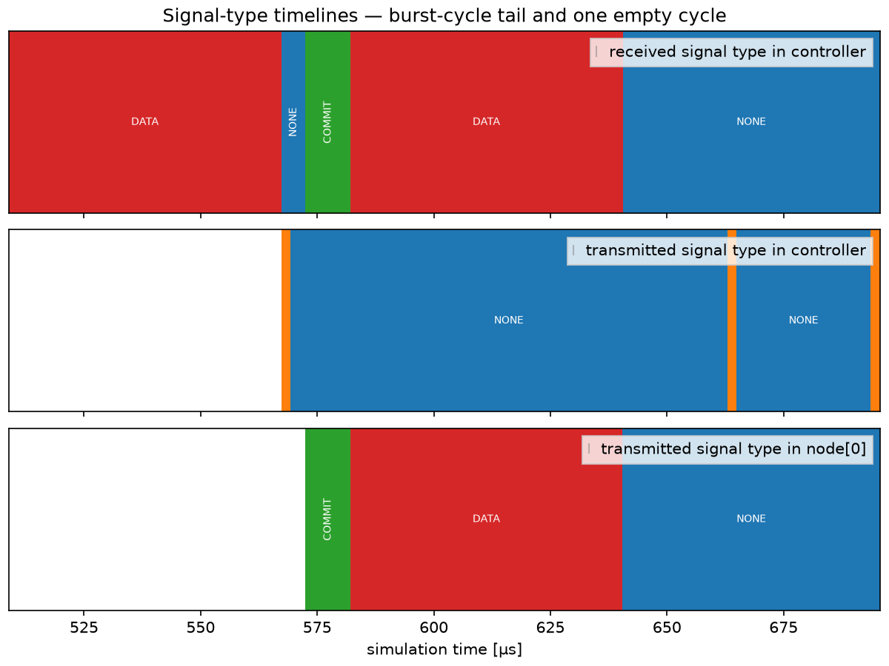
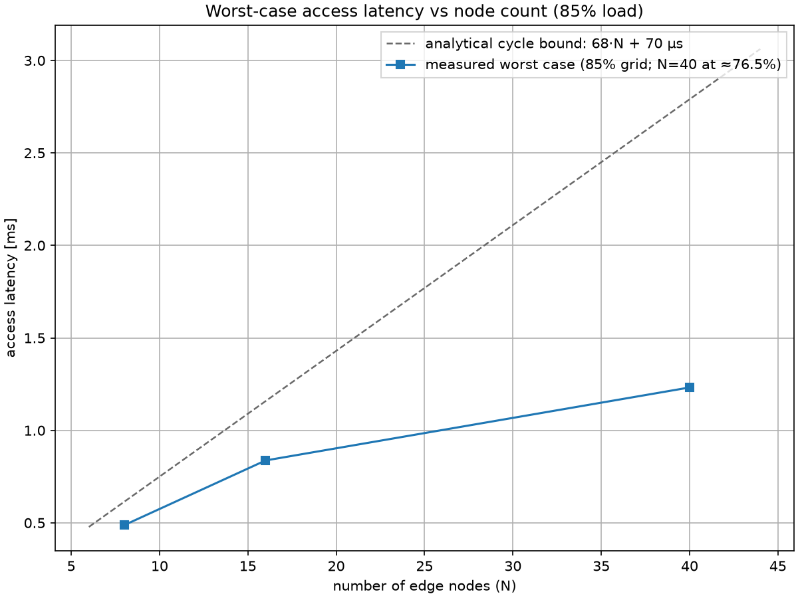
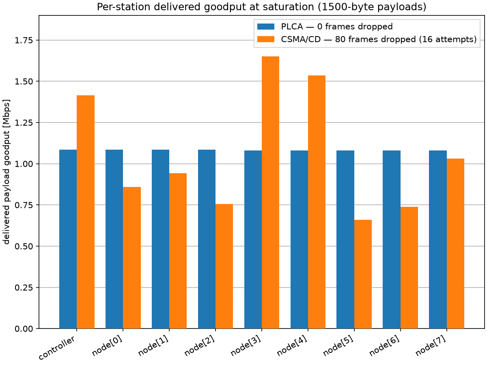

10BASE-T1S Multidrop Ethernet with PLCA
=======================================

Goals
-----

Automotive and industrial networks are beginning to replace CAN and similar
fieldbuses with
10BASE-T1S, a 10 Mbps Ethernet that connects up to a few dozen nodes to one
unshielded twisted pair. On a shared wire, classic Ethernet arbitration by
collision gives random, unbounded waiting times — unacceptable for control
traffic. Physical Layer Collision Avoidance (PLCA) removes the collisions and
makes the worst case predictable.

This showcase measures that difference on one segment: PLCA keeps worst-case
medium access latency under an analytical bound, while the same hardware
running plain CSMA/CD (Carrier Sense Multiple Access with Collision Detection)
shows a collision-driven latency tail orders of magnitude longer that ends in
frame drops — delivery is no longer guaranteed.

| Verified with INET version: ``4.7``
| Source files location: `inet/showcases/ethernet/tenbaset1s <https://github.com/inet-framework/inet/tree/master/showcases/ethernet/tenbaset1s>`__

.. TODO: confirm the release version number that contains commits e342d04b0e,
   1bc2af2784, 5e0d2fce22 before publishing; also applies to the opp_env
   version below.

.. admonition:: In one minute

   - Physical Layer Collision Avoidance (PLCA) rotates a single transmit
     opportunity through the nodes of a 10BASE-T1S multidrop segment, so
     frames never collide on the wire — and the longest possible wait is one
     full rotation.
   - Measured on 8 edge nodes plus the controller (9 stations) with 64-byte
     frames: PLCA worst-case access latency is bounded — 488 µs at the top
     load point, under the 614 µs bound at every load. Plain CSMA/CD is
     unbounded:
     ≥~180 ms in a 2 s run at 70–85% load, with 3–10 (70%) and 20–33 (85%)
     retry-limit drops per 2 s — frames discarded after 16 failed attempts.
   - At saturation both protocols fill the wire, but PLCA delivers
     per-station shares equal to within one frame, with zero drops; CSMA/CD's
     luckiest station sends 1.6–6.7× more than its unluckiest, and 75–81
     frames per 2 s are dropped.
   - One configuration line switches the same interface between the two modes.
   - The page: the network, the one-line switch, the PLCA cycle up close, then
     latency, scaling, and fairness results.

Access latency here is measured from a frame's first transmission attempt
until the transmission that succeeds begins — time queued behind earlier
frames is not counted. The chart below shows its measured worst case per
protocol, per offered load:

..
   FIGURE RECIPE (redo via the "inet-showcase-charts" skill)
   type:    chart (matplotlib)
   anf:     TenBaseT1S.anf   chart "Access latency vs offered load"
   inputs:  results/PlcaLatency-*.sca, results/CsmaCdLatency-*.sca (histogram summary max
            fields; no vectors needed)
   shows:   worst observed access latency per run vs total offered load, N=8:
            PLCA (plca vantage, worst of 3 runs per load) bounded under the dashed 614 us
            cycle bound; CSMA/CD (mac vantage, per-run maxima, 10 seeds/load) growing to
            ~0.2-0.3 s, with measured retry-limit drop annotations at 70% and 85%.
   anchors: PLCA maxima 0.23-0.49 ms, all under the bound, monotone in load;
            CSMA/CD maxima 1.3-4.2 ms @30%, 9-43 ms @50%, 196-284 ms @70%, 198-266 ms @85%
            (all-station per-run maxima - the chart pools controller + edge MACs);
            drops 3-10/seed @70%, 20-33/seed @85% (recomputed from scalars at render time).
            If any of these move materially, the scenario or recording changed - re-derive.
   export:  opp_charttool imageexport TenBaseT1S.anf -n "Access latency vs offered load"
            -f png --dpi 150 -d doc/media   (8x6 in -> 1200x900 px)
   stamp:   captured 2026-08-14, INET topic/gy/tenbaset1s-showcase @ 5e0d2fce22 + showcase
            dir, OMNeT++ 6.4.0aipre2 (omnetpp-dev)

**PLCA's worst-case access latency stays bounded under the ≈0.6 ms cycle bound
for 64-byte frames at N=8 at every load, while CSMA/CD's observed maxima reach
≥~180 ms in a 2 s run, keep growing with observation time, and frames start to
be dropped.**

The vertical axis is logarithmic — each gridline is 10×. The dashed line is
the analytical cycle bound, derived below. The annotations at 70% and 85% give
the measured drop counts: those frames were never delivered and are not in
these curves. Plotted maxima cover delivered frames within the 2 s run and
grow with observation time — the true worst case is unbounded; PLCA is stable
at every load. The unbounded quantity is the delay of a diverging queue.

About 10BASE-T1S and PLCA
-------------------------

10BASE-T1S (IEEE 802.3cg-2019) is the short-reach member of the single-pair
Ethernet family. Its multidrop mode connects up to at least 8 nodes — a floor,
not a cap — to one twisted pair of up to at least 25 m: a shared bus the
standard calls a mixing segment. It targets the sensor/actuator edge of
vehicles and machines, where it is positioned to take over roles held by CAN,
LIN, and FlexRay, using ordinary Ethernet frames. Do not confuse it with 10BASE-T1L, the long-reach,
point-to-point sibling.

On a shared wire, plain CSMA/CD access is random: colliding nodes back off for
random times, so waiting times have no upper limit. PLCA avoids this. It
rotates a single transmit opportunity through the node IDs in fixed order;
node 0 — often called the PLCA coordinator (OPEN Alliance) — sends a short
beacon signal to start each cycle. A node with a frame ready transmits in its
own opportunity; a node with nothing to send yields it after a few
microseconds. The Ethernet MAC itself is unchanged: PLCA is a thin sublayer
below it that simply delays the MAC until the node's opportunity arrives.
Unlike CAN, the rotation carries no frame priorities — every node waits its
turn, whatever the message.

The Network
-----------

..
   FIGURE RECIPE (redo via the "omnetpp-mcp-sim" skill)
   type:     canvas
   config:   CycleAnatomy   # omnetpp.ini
   seed:     default (r 0)
   shows:    one 10BASE-T1S mixing segment - controller + 8 edge nodes on a
             daisy-chained WireJunction bus (N=8 operating point)
   anchor:   initial state (t=0, before run). Structural self-check: controller,
             j[0..7], node[0..7]; if the module set/links differ, the NED changed.
   capture:  get_canvas_image, module_path=MultidropNetwork, area=all_elements,
             margin=10; cropped to 1174x400 (empty bottom band removed)
   stamp:    captured 2026-08-14, INET @ 5e0d2fce22 + showcase, OMNeT++ 6.4.0aipre2

**Nine nodes — 8 edge nodes and the controller — share one pair; the same
hardware runs PLCA or plain CSMA/CD by one configuration line.**

The network is one mixing segment: N edge nodes and one zonal controller. In a
real design the controller bridges this segment to the vehicle backbone; that
side is not modeled here. All nodes are :ned:`EthernetPlcaHost` — a host whose
applications exchange raw Ethernet frames through an interface with a PLCA
sublayer. The pair itself is a chain of :ned:`WireJunction` modules connected
by :ned:`EthernetMultidropLink` cables: 1 m of trunk between neighbors, 10 cm
stubs — spacing that real harnesses use.

The convention used throughout: N counts the edge nodes; the controller is
PLCA node 0, so a cycle has N+1 transmit opportunities. The network file
assigns the two mandatory PLCA parameters accordingly:

.. literalinclude:: ../MultidropNetwork.ned
   :language: ned
   :start-at: controller: <> like IEthernetNetworkNode {
   :end-before: j[numNodes]: WireJunction {

PLCA vs CSMA/CD in One Line
---------------------------

Every configuration inherits one of two abstract base sections. The CSMA/CD
variant differs in a single line, which removes the ``plca`` submodule — the
MAC, PHY, queue, and cable are identical:

.. literalinclude:: ../omnetpp.ini
   :language: ini
   :start-at: **.plca.typename
   :end-at: **.plca.typename

The PLCA base section pins ``max_bc = 0`` — burst (several frames per
opportunity) off, which is the default — because the in-tree example
configurations enable bursting, and bursting changes the bound arithmetic
below.

In the latency configurations, every edge node sends 64-byte frames (the
ini's ``packetLength = 46B`` payload plus 18 bytes of header and check
sequence) to the controller cyclically, and the controller sends frames back
at a quarter of that volume. Each production interval is jittered ±10% so the nodes drift out
of phase, and each node starts at a random offset. Offered load L counts
total wire occupancy, both directions. The per-node period at N=8:

===================== ========= ========= ======== ========
Offered load L        30%       50%       70%      85%
===================== ========= ========= ======== ========
Period per node       2.267 ms  1.360 ms  971 µs   800 µs
===================== ========= ========= ======== ========

In the period formula behind this table, 68 µs is one fully busy 64-byte
transmit opportunity — 680 bit times, the frame plus its gap — and the factor
1.25 accounts for uplink plus the quarter-volume downlink. The top loads
match Ford's bench-tested aggregate regime; designed operating points
typically sit well below the tested top loads.

The PLCA Cycle Up Close
-----------------------

Every PLCA node keeps a counter, ``curID``, that tracks which node ID owns the
current transmit opportunity. Watching it during a run shows the rotation
directly:

..
   FIGURE RECIPE (redo via the "inet-showcase-charts" skill)
   type:    chart (matplotlib)
   anf:     TenBaseT1S.anf   chart "Transmit opportunity rotation"
   inputs:  results/CycleAnatomy-*.vec (plca.curID vectors, controller + node[0])
   shows:   two panels. Upper: curID staircase over ~4 idle cycles (window 950-1075 us),
            IDs 0..8 in fixed order, stepping past the last ID to 9, then the node-0
            BEACON resets all counters; the grey band marks the cycle wrap that the
            lower panel expands. Lower: that one cycle wrap, with the measured 2.0 us
            BEACON shaded gold. Grey = "expanded below", gold = the beacon; the two
            shadings are deliberately different colours so they are not equated.
            The controller is drawn as a wide blue band with node[0] on top, so both
            curves are visible where they coincide (they always do).
   anchors: idle-TO dwell 3.2 us; empty cycle 30.8 us; BEACON 2.0 us (all measured in this
            window at G4). If the staircase shape or these dwells change, the PLCA timing
            model changed - re-derive.
   export:  opp_charttool imageexport TenBaseT1S.anf -n "Transmit opportunity rotation"
            -f png --dpi 150 -d doc/media   (8x7.5 in -> 1200x1125 px)
   stamp:   captured 2026-08-14, INET topic/gy/tenbaset1s-showcase @ 5e0d2fce22 + showcase
            dir, OMNeT++ 6.4.0aipre2 (omnetpp-dev). Layout revised 2026-08-17: the beacon
            zoom moved from an inset to a lower panel, same data. The superseded
            single-panel rendering is kept at doc/media/unused/to-rotation.png.

**The transmit opportunity rotates through every node ID in fixed order;
node 0's beacon starts each cycle.**

The controller and node[0] curves coincide — their sampled values never differ
in this run, only nanosecond propagation offsets separate them — so all nodes
count in lockstep. That is why the thin orange line rides exactly on the wide
blue controller band everywhere. Each staircase tops out at 9: every node steps
past the last ID, and on node 0 passing the node count triggers the next
beacon, which resets all counters — the counters also start at 9 before the
first beacon (not shown; it lies outside the plotted window). The lower panel
expands the grey-marked cycle wrap from the upper panel, and shades node 0's
beacon (measured duration 2.00 µs).

..
   FIGURE RECIPE (redo via the "inet-showcase-charts" skill)
   type:    chart (matplotlib)
   anf:     TenBaseT1S.anf   chart "Transmit opportunity timelines"
   inputs:  results/CycleAnatomy-*.vec (phy signal-type lanes: controller received = the
            bus, controller transmitted = beacons, node[0] transmitted); chart form follows
            examples/ethernet/TenBaseT1S worstcase/bestcase .anf (plot_vectors_separate +
            enum strips); window 505-700 us = tail of the busy start-up cycle + one
            empty cycle
   shows:   last DATA of the busy start-up cycle, BEACON, the controller's own 3.2 us
            yielded TO,
            node[0] COMMIT+DATA, seven 3.2 us yields, then a whole 30.8 us empty cycle -
            idle slots cost microseconds, not frame times.
   anchors: BEACON 2.0 us at cycle start (controller lane); busy TO = 680 BT = 68.0 us
            total (observed here as COMMIT 9.6 us + DATA 58.4 us; the stretched COMMIT
            is start-up alignment against the preceding beacon/yield - do not chase a
            ~71 us figure); yielded TO 3.2 us. Measured at G4; if the lane grammar
            changes, the PLCA FSM or scenario changed - re-derive.
   export:  opp_charttool imageexport TenBaseT1S.anf -n "Transmit opportunity timelines"
            -f png --dpi 150 -d doc/media   (8x6 in -> 1200x900 px)
   stamp:   captured 2026-08-14, INET topic/gy/tenbaset1s-showcase @ 5e0d2fce22 + showcase
            dir, OMNeT++ 6.4.0aipre2 (omnetpp-dev)

**A node with nothing to send yields its opportunity after 3.2 µs — idle
slots cost microseconds, not frame times.**

The three lanes are a bus view: the top lane is everything the controller
receives — effectively the bus itself; the middle lane is what the controller
transmits (its beacons and frames); the bottom lane is what node[0] transmits.
The thin slivers in the controller's transmit lane are the 2 µs beacons. A
COMMIT is the short claim signal a node sends at the start of its opportunity
while its frame is still on the way. Yielded opportunities appear as 3.2 µs
silences; a fully idle cycle takes 30.8 µs (measured).

.. admonition:: Details — the cycle arithmetic, term by term

   The arithmetic comes from the standard's own cycle structure, with two
   INET accounting details: a 1 ns gap after the beacon at the start of each
   cycle, and the end-of-stream
   delimiter counted in the frame's wire time. That delimiter costs one
   octet-time per the standard's own line encoding — it is not a simulator
   quirk.

   - A busy transmit opportunity costs the frame on the wire (preamble +
     frame + delimiter; 584 bit times at 64 B) plus one 96-bit interpacket
     gap: 680 bit times. It does not also pay the opportunity timer — the
     COMMIT stops the other nodes' timers and covers the sender's own gap.
   - An idle opportunity costs the 32 bit-time opportunity timer; the beacon
     costs 20 bit times.
   - Worst case = one fully busy cycle. At N=8, 64 B:
     20 + 9 × 680 = 6140 bit times = **614 µs**. In general:
     68 µs × (N+1) + 2 µs (equivalently written 68·N + 70 µs).
   - At N=8 with 64 B frames, every node is guaranteed a transmit opportunity
     at least every ≈0.61 ms — a 10 ms control loop fits with >15× margin; at
     1518 B the guarantee is ≈11.1 ms, so budget the largest frame on the
     segment.
   - Counting only MAC frame bits, the fully busy cycle carries 75.0% (64 B)
     or 98.6% (1518 B) of the wire — the "useful bits" view.

Access Latency Under Load
-------------------------

The hero chart above compares the two protocols on the same load grid. A PLCA
frame waits at most one fully busy cycle — the dashed 614 µs line. The
measured PLCA maximum grows toward the bound with load and never exceeds it:
228–296 µs at 30% load, 484–488 µs (79% of the bound) at 85%. The bound
scales with the largest frame any node may send — ≈11.1 ms at 1518 B.

CSMA/CD tells the opposite story: its maxima are already 1.3–4.2 ms at 30%
load and 9–43 ms at 50%; past its stability limit they diverge, as the chart
above shows, and stations discard frames after exhausting their 16
transmission attempts. The two latency configurations set the load grid, the
jittered traffic, and the seeded repetitions:

.. literalinclude:: ../omnetpp.ini
   :language: ini
   :start-at: [Config PlcaLatency]
   :end-before: [Config Scale40Plca]

.. admonition:: Fine print — what the latency statistic measures

   - The clock starts at the frame's first transmission attempt and stops
     when the transmission that succeeds begins. A head-of-queue frame's
     initial wait for a busy medium — up to ~70 µs here — is excluded; even
     adding it, PLCA stays under the 614 µs bound.
   - PLCA runs are measured below the PLCA sublayer, CSMA/CD runs at the MAC.
     On PLCA runs the two vantage points recorded identical maxima in all 25
     runs, so the comparison is not an artifact of where we measure.
   - The CSMA/CD curves are censored: dropped frames never transmit, so the
     worst frames are missing from the delivered-frame statistics.
   - The MAC still reports collisions on PLCA runs — these are local signals
     that pace the MAC; nothing collides on the wire.
   - End-to-end delay is stable through 50% load on both sides. The ~53–55%
     ceiling at 64 bytes is the payload fraction, set by framing overhead
     common to both protocols: a plain CSMA/CD 64-byte frame occupies 576 bit
     times on the wire plus its 96-bit interpacket gap, capping payload at
     54.1% of the wire (measured: CSMA/CD 53.0–53.3%, PLCA 53.9%) — it is not
     a collision loss.
   - The divergence at 70% has a different cause: under contention, CSMA/CD's
     delivered share of wire occupancy tops out at ≈68% (measured), and the
     loss concentrates on unlucky stations through capture. Its queues
     diverge at 70% and 85%, while PLCA's stay shallow at every load.
   - PLCA shows the worst of 3 runs per load where CSMA/CD shows 10: PLCA is
     near-deterministic — its repetitions differ only in traffic jitter —
     while CSMA/CD's random backoff needs more seeds.
   - The standard's own backoff schedule ends after 16 attempts, ≈366 ms of
     cumulative backoff at worst — the tail is long, but ends in a drop, not
     in delivery.
   - PLCA's fairness is per transmit opportunity: stations get exactly equal
     frame counts only when they send equal-size frames — a station sending
     1518-byte frames gets ~21× the wire time of a 64-byte neighbor.

Scaling with Node Count
-----------------------

..
   FIGURE RECIPE (redo via the "inet-showcase-charts" skill)
   type:    chart (matplotlib)
   anf:     TenBaseT1S.anf   chart "Worst-case latency vs node count"
   inputs:  results/PlcaLatency-*.sca (N=8,16 at load=85), results/Scale40Plca-*.sca
            (N=40 at 85% load; histogram summary max fields)
   shows:   measured worst-case access latency (plca vantage, worst over ALL stations -
            controller included - and runs) at N = 8/16/40 under the affine analytical
            cycle bound; the N=40 config runs its downlink halved, total offered load
            ~76.5% (not the 85% grid value)
            bound(N) = 68*N + 70 us (beacon 20 BT + (N+1) x 680 BT busy TOs).
   anchors: measured 0.488 / 0.837 / 1.232 ms at N = 8/16/40 (all-station maxima; the
            N=40 all-station max is the controller's 1232.0 us, edge-only 1215.9) -
            monotone, under the bound at every N (79% / 72% / 44% of it). If a point
            crosses the bound or the monotonicity breaks, the model or scenario
            changed - re-derive.
   export:  opp_charttool imageexport TenBaseT1S.anf -n "Worst-case latency vs node count"
            -f png --dpi 150 -d doc/media   (8x6 in -> 1200x900 px)
   stamp:   captured 2026-08-14, INET topic/gy/tenbaset1s-showcase @ 5e0d2fce22 + showcase
            dir, OMNeT++ 6.4.0aipre2 (omnetpp-dev)

**The measured worst case stays under the linearly growing bound from 8
through 40 nodes — sizing a segment is arithmetic.**

Measured maxima at 85% load: 488 µs (N=8), 837 µs (N=16), and 1232 µs at
N=40, worst over all 41 stations — 40 nodes being the envelope that ODVA
(the industrial-automation standards body behind EtherNet/IP) and shipping
transceivers specify for in-cabinet use — against bounds of 614 µs, 1.158 ms,
and 2.79 ms. The 40-node point sits at 44.2% of its bound: with 41
de-synchronized stations, a
fully busy rotation is statistically unreachable — the bound is a guarantee,
not the operating point.

Two practical notes. With burst off, the controller can serve at most one
downlink frame per cycle — size downlink-heavy zones accordingly. The 40-node
configuration therefore runs its downlink halved, one frame per 32 ms per
node, putting its total offered load at ≈76.5% rather than the grid's 85%;
the bound comparison is unaffected, because the bound does not depend on
load. And node counts beyond ~8 are an electrical qualification exercise on
real cabling (node spacing, stub capacitance); the simulation models the
protocol, not the analog limits.

Delivery at Saturation
----------------------

What happens when every station always has a frame to send? Both protocols
fill the wire (configurations ``PlcaUtilization`` and ``CsmaCdUtilization``):
PLCA delivers 9.744 Mbps of application goodput at 1518-byte frames and
CSMA/CD delivers 9.56–9.59 Mbps — about 98% of PLCA's. With maximum-size
frames the per-frame overhead is small, which is why nearly all of the
10 Mbps arrives as payload; contrast the ~54% payload ceiling at 64 bytes.
The difference is who gets to send, and what gets lost. The chart shows
delivered goodput per station:

..
   FIGURE RECIPE (redo via the "inet-showcase-charts" skill)
   type:    chart (matplotlib)
   anf:     TenBaseT1S.anf   chart "Per-station delivered goodput at saturation"
   inputs:  results/PlcaUtilization-payloadLength=1500-#0.sca,
            results/CsmaCdUtilization-payloadLength=1500-#0.sca (per-station successful
            transmissions = mac packetPendingDelay:count; drop counts alongside)
   shows:   per-station delivered payload goodput at saturation, 1500-byte payloads,
            seed #0 of each side: PLCA exactly equal shares and zero drops; CSMA/CD
            unequal shares (capture effect) plus retry-limit drops. Aggregate parity
            (CSMA/CD ~98% of PLCA) is stated in the page sentence, not the chart.
   anchors: PLCA bars all 1.08 Mbps (180-181 frames); CSMA/CD bars spread (seed #0 ratio
            2.5x, across seeds 1.6-6.7x); drop annotation measured from the same runs
            (PLCA 0, CSMA/CD ~80 per 2 s). If shares equalize on the CSMA/CD side or PLCA
            spreads, the scenario changed - re-derive.
   export:  opp_charttool imageexport TenBaseT1S.anf
            -n "Per-station delivered goodput at saturation" -f png --dpi 150 -d doc/media
   stamp:   captured 2026-08-14, INET topic/gy/tenbaset1s-showcase @ 5e0d2fce22 + showcase
            dir, OMNeT++ 6.4.0aipre2 (omnetpp-dev)

**At saturation both protocols fill the wire — what PLCA buys is not
throughput but guaranteed, fair delivery: zero drops and per-station shares
equal to within one frame, where CSMA/CD dropped 75–81 frames per 2 s and its
luckiest station transmitted 1.6–6.7× more than its unluckiest.**

The chart shows seed #0; across all ten CSMA/CD seeds the luckiest-to-
unluckiest ratio ranges from 1.6× to 6.7×. PLCA's stations differ by at most
one frame — 180 vs 181, a ratio of 1.0056 — because the 2 s window cuts
mid-cycle; the mechanism itself is exactly fair, one opportunity per node per
cycle.
The saturation runs use maximum-size (1518-byte) frames, because the
analytical utilization anchor is computed for them; a 64-byte variant shows
the overhead tax. PLCA's measured bus utilization matches the cycle
arithmetic exactly — 99.2% at 1518-byte frames, 85.6% at 64-byte frames. The
utilization statistic counts DATA-signal presence only, preamble and
delimiter included; beacons, COMMIT signals, and interpacket gaps are
excluded — it is DATA time divided by total time.

Limitations
-----------

.. admonition:: Fine print — what the model leaves out

   - PLCA and plain-CSMA/CD stations cannot share one mixing segment in the
     model; mixing is possible only through a switch port.
   - Loss of node 0 and the resynchronization that follows are not modeled;
     beacons always arrive.
   - No noise or reception errors: frames are lost only to collisions
     (CSMA/CD) or queue overflow.
   - Real constrained nodes often reach the PHY over a serial host interface
     that can cap their rate below wire speed; hosts here send at wire speed.
   - Burst mode is not used here, and multiple node IDs per station are not
     modeled — the product knobs for favoring one node; every configuration
     grants one opportunity per node per cycle.

Sources and Further Reading
---------------------------

- IEEE Std 802.3cg-2019 — 10BASE-T1S and the PLCA reconciliation sublayer.
- K. Kim, E. Choi, J.-W. Choi, "Network Performance Evaluation of IEEE
  802.3cg", J-KICS, vol. 45, no. 4, pp. 706–711, 2020,
  DOI 10.7840/kics.2020.45.4.706 — related simulation study of the same
  standard.
- D. Boggs, J. Mogul, C. Kent, "Measured Capacity of an Ethernet: Myths and
  Reality", Proc. ACM SIGCOMM '88, pp. 222–234, DOI 10.1145/52324.52347 —
  the classic measurement study showing that saturated 10 Mbps Ethernet keeps
  its aggregate throughput; our CSMA/CD goodput matches its conclusion.
- Y.-T. Wu, J. Palathanam (Ford), 10BASE-T1S node count analysis, IEEE
  Ethernet Tech Day 2024 — `slides
  <https://standards.ieee.org/wp-content/uploads/2024/11/201-yu-ting-wu-jibu-palathanam-nodecount-analysis.pdf>`__
  — the bench-tested load regime and node-count guidance cited above.
- OPEN Alliance, "10BASE-T1S PLCA Management Registers", v1.2, 2022 — the
  source of the "PLCA coordinator" term and of the register-level defaults.
- ODVA, `EtherNet/IP In-Cabinet profile
  <https://www.odva.org/technology-standards/market-drivers/ethernetip-in-cabinet/>`__
  — the 40-node, 25 m in-cabinet deployment envelope.

Sources: :download:`omnetpp.ini <../omnetpp.ini>`,
:download:`MultidropNetwork.ned <../MultidropNetwork.ned>`

Try It Yourself
---------------

If you already have INET and OMNeT++ installed, start the IDE by typing
``omnetpp``, import the INET project, then navigate to the
``inet/showcases/ethernet/tenbaset1s`` folder in the `Project Explorer`. There,
you can view and edit the showcase files, run simulations, and analyze results.

The simulation offers six configurations: ``PlcaLatency`` and
``CsmaCdLatency`` for the headline latency comparison, ``CycleAnatomy`` to
watch a single cycle up close, ``Scale40Plca`` for the 40-node point, and
``PlcaUtilization`` and ``CsmaCdUtilization`` for the saturation study.

Otherwise, there is an easy way to install INET and OMNeT++ using `opp_env
<https://omnetpp.org/opp_env>`__, and run the simulation interactively:

.. code-block:: bash

    $ opp_env run inet-4.7 --init -w inet-workspace --install --build-modes=release --chdir \
       -c 'cd inet-4.7.*/showcases/ethernet/tenbaset1s && inet'

This command creates an ``inet-workspace`` directory, installs the appropriate
versions of INET and OMNeT++ within it, and launches the ``inet`` command in the
showcase directory for interactive simulation.

Alternatively, for a more hands-on experience, you can first set up the
workspace and then open an interactive shell:

.. code-block:: bash

    $ opp_env install --init -w inet-workspace --build-modes=release inet-4.7
    $ cd inet-workspace
    $ opp_env shell

Inside the shell, start the IDE by typing ``omnetpp``, import the INET project,
then start exploring.

Discussion
----------

Use `this page <https://github.com/inet-framework/inet/discussions>`__ in the
GitHub issue tracker for commenting on this showcase.

.. TODO: create the dedicated discussion thread and replace the generic link.
