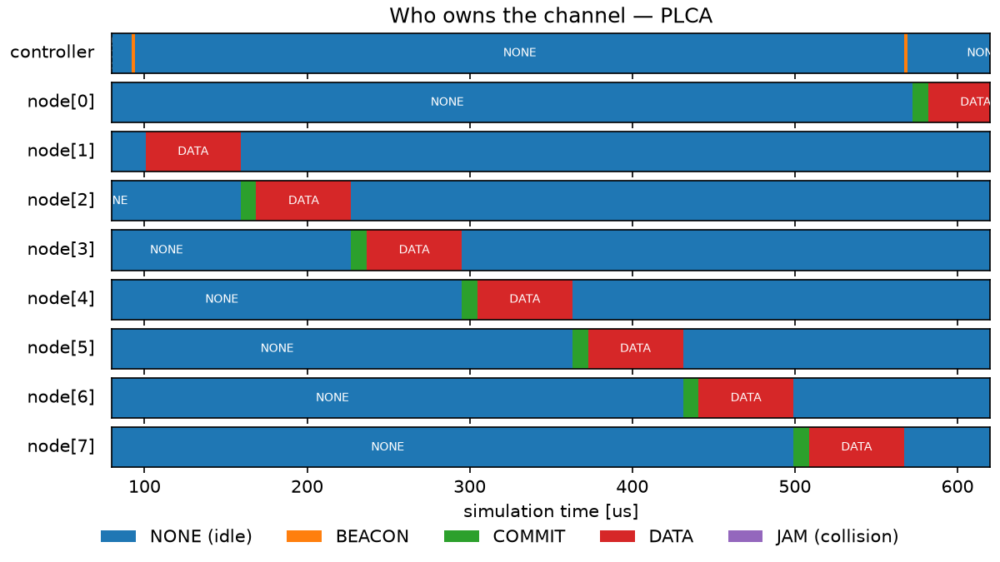
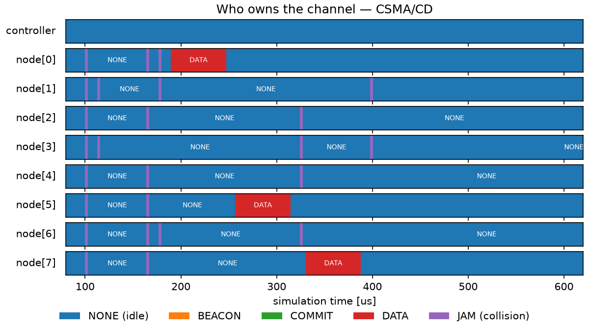

Bounded Channel Access on 10BASE-T1S: PLCA versus CSMA/CD
=========================================================

Goals
-----

Automotive and industrial networks are beginning to replace CAN and similar
fieldbuses with 10BASE-T1S, a 10 Mbps Ethernet that connects a few dozen nodes
to one unshielded twisted pair. Carrying ordinary Ethernet frames all the way
out to the sensor and actuator edge removes a protocol translation from the
vehicle or the machine. It also inherits Ethernet's original problem: on a
shared wire, arbitration by collision produces random waiting times with no
upper limit. A control loop cannot be designed against a delay that has no
worst case.

Physical Layer Collision Avoidance (PLCA) is what the standard adds to fix
this, and it makes three promises. A frame never waits longer than one
rotation of the channel, and that time can be computed in advance. No frame is
ever discarded for losing an arbitration. Every station gets the same number
of turns as every other.

This showcase takes those three promises one at a time and measures each one
on a 10BASE-T1S segment, against the scheme PLCA replaces: plain Carrier Sense
Multiple Access with Collision Detection (CSMA/CD), running on the same wire,
with the same hardware and the same traffic, switched by a single
configuration line.

| Verified with INET version: ``4.7``
| Source files location: `inet/showcases/ethernet/tenbaset1s <https://github.com/inet-framework/inet/tree/master/showcases/ethernet/tenbaset1s>`__

.. TODO: confirm the release version number that contains commits e342d04b0e,
   1bc2af2784, 5e0d2fce22 before publishing; also applies to the opp_env
   version below.

How PLCA Hands Out the Channel
------------------------------

10BASE-T1S (IEEE 802.3cg-2019) is the short-reach member of the single-pair
Ethernet family. Its multidrop mode connects at least 8 nodes to one twisted
pair of at least 25 m — a floor, not a cap — forming a shared bus that the
standard calls a mixing segment. Do not confuse it with 10BASE-T1L, the
long-reach, point-to-point sibling.

PLCA rotates a single transmit opportunity through the node IDs in a fixed
order. Node 0 — often called the PLCA coordinator — sends a short beacon
signal to start each cycle, and every node then counts opportunities in step
with every other. A node with a frame ready transmits when the count reaches
its own ID; a node with nothing to send yields after a few microseconds. The
Ethernet MAC itself is unchanged. PLCA is a thin sublayer below it that holds
the MAC back until the node's turn arrives.

The clearest way to see this is to watch every station on the segment at once.
In the run below, all eight edge nodes are handed a frame at the same instant,
100 µs into the run — the worst thing that can happen to a shared wire. Each
row is one station, and the colour says what that station is putting on the
wire:

..
   FIGURE RECIPE (redo via the "inet-showcase-charts" skill)
   type:    chart (matplotlib)
   anf:     TenBaseT1S.anf   chart "Channel ownership (PLCA)"
   inputs:  results/CycleAnatomy-#0.vec (eth[0].phy transmittedSignalType, all 9 stations)
   shows:   one lane per station over the start-up cycle (80-620 us). All 8 edge nodes are
            given a frame at t=100us; the channel is handed out strictly in node-ID order,
            node[1] first and node[7] last, one per ~68 us, with no overlap anywhere.
            node[0] sends LAST: from the 3.2 us yield cadence its own TO ran 97.6-100.8 us
            and its frame arrived at 100.0 us, too late to claim a TO already in progress,
            so it waits a full rotation and sends at 572.5 us.
   anchors: node[1] DATA starts 100.8 us; node[7] DATA starts 508.9 us; beacons (orange) at
            92.4 and 567.3 us; node[0] COMMIT 572.5 us. Zero JAM cells anywhere in the lane
            set. If any two DATA cells overlap in time, PLCA is not arbitrating - re-derive.
   export:  opp_charttool imageexport TenBaseT1S.anf -n "Channel ownership (PLCA)"
            -f png --dpi 150 -d doc/media   (8x4.5 in -> 1200x675 px)
   stamp:   captured 2026-09-01, INET topic/gy/tenbaset1s-showcase, OMNeT++ 6.4.0aipre2

The eight frames go out one after another in node-ID order, each taking about
68 µs, with no overlap anywhere in the picture. Nothing negotiates and nothing
retries; the order was fixed before the traffic existed.

One detail in that figure is worth pausing on, because it is the whole point
of the mechanism. ``node[0]`` sends last, not first. Its own opportunity ran
from 97.6 µs to 100.8 µs, and its frame only arrived at 100.0 µs — a node has
to be ready when its opportunity opens, and this one was 2.4 µs late. It gets
no second chance within the cycle: it waits for the next beacon and transmits
at 572.5 µs, one full rotation after the frame appeared. That wait is the
price of the guarantee, and it is exactly what the guarantee bounds.

Now the same eight frames, at the same instant, on the same wire, with the
PLCA sublayer removed:

..
   FIGURE RECIPE (redo via the "inet-showcase-charts" skill)
   type:    chart (matplotlib)
   anf:     TenBaseT1S.anf   chart "Channel ownership (CSMA/CD)"
   inputs:  results/CsmaCdCycleAnatomy-#0.vec (eth[0].phy transmittedSignalType, all 9 stations)
   shows:   same lanes, same window, same traffic as the PLCA twin, with the plca submodule
            removed. All 8 nodes transmit at t=100.00us and all 8 jam; retries collide again
            at 112.8, 164.0, 176.8, 324.1 and 397.6 us. Only 3 of the 8 frames are delivered
            inside the 520 us window (node[0] at 189.7, node[5] at 256.9, node[7] at 330.4).
   anchors: 8 simultaneous DATA starts at 100.00 us, 8 JAM cells at 100.01 us; first
            successful frame 189.7 us; 3 DATA cells survive to full width in-window.
            If the retry pattern becomes regular, the backoff or seed changed - re-derive.
   export:  opp_charttool imageexport TenBaseT1S.anf -n "Channel ownership (CSMA/CD)"
            -f png --dpi 150 -d doc/media   (8x4.5 in -> 1200x675 px)
   stamp:   captured 2026-09-01, INET topic/gy/tenbaset1s-showcase, OMNeT++ 6.4.0aipre2

All eight stations start transmitting at 100.00 µs, detect each other 10 ns
later, and jam. They back off by random amounts and collide again at 112.8,
164.0, 176.8, 324.1 and 397.6 µs. PLCA had all eight frames delivered 540 µs
after they appeared; in that same span CSMA/CD delivers three, at 189.7, 256.9
and 330.4 µs. No station did anything wrong; the scheme simply has no notion of
whose turn it is.

Because the whole mechanism rests on every station counting the same cycle,
PLCA is all-or-nothing per segment. A station without the sublayer transmits
whenever the medium looks idle, which means inside somebody else's transmit
opportunity, so it does not merely degrade the rotation — it breaks it. Every
node on a mixing segment must run PLCA, with the same node count configured.
Mixing PLCA and non-PLCA Ethernet is done by putting a switch between them,
not by sharing a wire.

Underneath, each node keeps a counter, ``curID``, holding the ID whose turn it
currently is. Watching that counter is how you confirm the nodes really are in
step:

.. figure:: media/to-rotation.png
   :align: center

..
   FIGURE RECIPE (redo via the "inet-showcase-charts" skill)
   type:    chart (matplotlib)
   anf:     TenBaseT1S.anf   chart "Transmit opportunity rotation"
   inputs:  results/CycleAnatomy-*.vec (plca.curID vectors, controller + node[0])
   shows:   two panels. Upper: curID staircase over ~4 idle cycles (window 950-1075 us),
            IDs 0..8 in fixed order, stepping past the last ID to 9, then the node-0
            BEACON resets all counters; the grey band marks the cycle wrap that the
            lower panel expands. Lower: that one cycle wrap, with the measured 2.0 us
            BEACON shaded gold. Grey = "expanded below", gold = the beacon; the two
            shadings are deliberately different colours so they are not equated.
            The controller is drawn as a wide blue band with node[0] on top, so both
            curves are visible where they coincide (they always do).
   anchors: idle-TO dwell 3.2 us; empty cycle 30.8 us; BEACON 2.0 us (all measured in this
            window at G4). If the staircase shape or these dwells change, the PLCA timing
            model changed - re-derive.
   export:  opp_charttool imageexport TenBaseT1S.anf -n "Transmit opportunity rotation"
            -f png --dpi 150 -d doc/media   (8x7.5 in -> 1200x1125 px)
   stamp:   captured 2026-08-14, INET topic/gy/tenbaset1s-showcase @ 5e0d2fce22 + showcase
            dir, OMNeT++ 6.4.0aipre2 (omnetpp-dev). Layout revised 2026-08-17: the beacon
            zoom moved from an inset to a lower panel, same data. The superseded
            single-panel rendering is kept at doc/media/unused/to-rotation.png.
   note:    the 3.2 us yield and 30.8 us empty cycle quoted below this figure used to come
            from a second figure, "Transmit opportunity timelines". That figure was retired
            in the 2026-09-01 rework (its three claims were not readable in the rendering);
            its chart is still in TenBaseT1S.anf and its last rendering is kept at
            doc/media/unused/to-timelines.png.

This window is an idle stretch of the same run, so every opportunity is
yielded and the counter simply climbs. The controller's curve and ``node[0]``'s
lie exactly on top of each other, which is what "in step" means: only
nanoseconds of propagation separate them. Each staircase runs past the last ID
to 9, and node 0 answers that by sending the next beacon, which resets every
counter to 0. The lower panel expands one such wrap; the beacon it shades
measures 2.0 µs.

Two numbers from this figure are used later: an opportunity that a node yields
costs 3.2 µs, and a cycle in which nobody transmits takes 30.8 µs. Idle nodes
cost microseconds, not frame times, which is why a mostly-quiet segment still
rotates quickly.

The Model and What You Can Vary
-------------------------------

The network is one mixing segment: N edge nodes and one zonal controller. In a
real design the controller bridges this segment to the vehicle backbone; that
side is not modeled here. All nodes are :ned:`EthernetPlcaHost` — a host whose
applications exchange raw Ethernet frames through an interface that has a PLCA
sublayer. The pair itself is a chain of :ned:`WireJunction` modules connected
by :ned:`EthernetMultidropLink` cables, with 1 m of trunk between neighbours
and 10 cm stubs down to the nodes, spacing that real harnesses use.

.. figure:: media/network.png
   :align: center

..
   FIGURE RECIPE (redo via the "omnetpp-mcp-sim" skill)
   type:     canvas
   config:   CycleAnatomy   # omnetpp.ini
   seed:     default (r 0)
   shows:    one 10BASE-T1S mixing segment - controller + 8 edge nodes on a
             daisy-chained WireJunction bus (N=8 operating point)
   anchor:   initial state (t=0, before run). Structural self-check: controller,
             j[0..7], node[0..7]; if the module set/links differ, the NED changed.
   capture:  get_canvas_image, module_path=MultidropNetwork, area=all_elements,
             margin=10; cropped to 1174x400 (empty bottom band removed)
   stamp:    captured 2026-08-14, INET @ 5e0d2fce22 + showcase, OMNeT++ 6.4.0aipre2

N counts the edge nodes. The controller is PLCA node 0 and edge node ``i`` is
PLCA node ``i+1``, so a cycle has N+1 opportunities. The network file assigns
the two mandatory PLCA parameters accordingly, and lays out the trunk and the
stubs:

.. literalinclude:: ../MultidropNetwork.ned
   :language: ned
   :start-at: network MultidropNetwork

Everything the rest of this page measures is one of five knobs, and it is
worth knowing which five before reading any result:

=================== ================================== ==========================
Knob                Set by                             Values used here
=================== ================================== ==========================
Arbitration scheme  ``**.plca.typename``               PLCA, or removed (CSMA/CD)
Node count N        ``*.numNodes``                     8, 16, 40
Frame size          ``source.packetLength``            46 B and 1500 B payload
Offered load        ``source.productionInterval``      30%, 50%, 70%, 85%
Bursting            ``*.eth[*].plca.max_bc``           0, i.e. off
=================== ================================== ==========================

The first knob is the one the whole comparison turns on, and it really is a
single line. Every configuration inherits one of two abstract sections; the
CSMA/CD variant simply deletes the ``plca`` submodule, leaving the MAC, the
PHY, the queue and the cable identical on both sides:

.. literalinclude:: ../omnetpp.ini
   :language: ini
   :start-at: [Config PlcaBase]
   :end-at: **.plca.typename = ""

The last knob is fixed throughout. ``max_bc = 0`` turns off bursting — sending
several frames in one opportunity — because bursting changes the bound
arithmetic derived below. That is the default, though the in-tree example
configurations enable it.

The traffic is the same in every configuration: each edge node sends
fixed-size frames to the controller at a steady rate, and the controller
answers each node. The applications exchange raw Ethernet frames, with no IP
stack in the way:

.. literalinclude:: ../omnetpp.ini
   :language: ini
   :start-at: *.node[*].numApps = 2
   :end-at: *.controller.app[*].source.packetLength = 46B

A 46-byte payload plus 18 bytes of header and frame check sequence is a
64-byte frame, the smallest Ethernet allows. In the latency configurations
each production interval is jittered by ±10% and each node starts at a random
offset, so the nodes drift out of phase. Offered load L counts wire occupancy
in both directions, which gives these per-node periods at N=8:

===================== ========= ========= ======== ========
Offered load L        30%       50%       70%      85%
===================== ========= ========= ======== ========
Period per node       2.267 ms  1.360 ms  971 µs   800 µs
===================== ========= ========= ======== ========

Behind that table, 68 µs is one fully busy 64-byte transmit opportunity and
the factor 1.25 accounts for the uplink plus the quarter-volume downlink. The
top loads match the aggregate regime Ford bench-tested for 10BASE-T1S node
counts; real designs sit well below them.

Six configurations turn those knobs. ``CycleAnatomy`` and
``CsmaCdCycleAnatomy`` produced the two ownership figures above — the same
traffic with and without PLCA. ``PlcaLatency`` and ``CsmaCdLatency`` sweep the
load grid at N=8 for the first promise, and ``PlcaLatency`` also covers N=16,
with ``Scale40Plca`` adding the 40-node point. ``PlcaUtilization`` and
``CsmaCdUtilization`` saturate the wire for the third promise.

Promise 1: The Longest Wait Can Be Computed
-------------------------------------------

The reason a rotation can be turned into a deadline is that every part of a
cycle has a fixed cost. A busy opportunity costs the frame on the wire —
preamble, frame and end-of-stream delimiter, 584 bit times at 64 B — plus one
96-bit interpacket gap, giving 680 bit times, or 68 µs. It does not also pay
the opportunity timer, because the sender's COMMIT stops the other nodes'
timers. An idle opportunity costs the 32 bit-time opportunity timer, the 3.2 µs
seen in the rotation figure. The beacon costs 20 bit times.

The worst case for a node is one fully busy cycle, in which every other node
transmits before its turn comes round. At N=8 with 64-byte frames that is
20 + 9 × 680 = 6140 bit times:

.. code-block:: none

   bound(N) = 68 µs × (N+1) + 2 µs = 68·N + 70 µs
   bound(8) = 614 µs

This is the number a segment is designed against. At N=8, every node is
guaranteed a turn at least every 0.61 ms, so a 10 ms control loop fits with
more than 15× margin. The bound scales with the largest frame any node on the
segment may send, so it must be budgeted for that frame rather than the
typical one: at 1518 B the same eight-node segment guarantees only 11.1 ms.

Whether the real worst case stays under that line is the first thing to
measure. Access latency here is the time from a frame's first transmission
attempt until the transmission that succeeds begins:

.. figure:: media/access-latency-vs-load.png
   :align: center

..
   FIGURE RECIPE (redo via the "inet-showcase-charts" skill)
   type:    chart (matplotlib)
   anf:     TenBaseT1S.anf   chart "Access latency vs offered load"
   inputs:  results/PlcaLatency-*.sca, results/CsmaCdLatency-*.sca (histogram summary max
            fields; no vectors needed)
   shows:   worst observed access latency per run vs total offered load, N=8:
            PLCA (plca vantage, worst of 3 runs per load) bounded under the dashed 614 us
            cycle bound; CSMA/CD (mac vantage, per-run maxima, 10 seeds/load) growing to
            ~0.2-0.3 s, with measured retry-limit drop annotations at 70% and 85%.
   anchors: PLCA maxima 0.23-0.49 ms, all under the bound, monotone in load;
            CSMA/CD maxima 1.3-4.2 ms @30%, 9-43 ms @50%, 196-284 ms @70%, 198-266 ms @85%
            (all-station per-run maxima - the chart pools controller + edge MACs);
            drops 3-10/seed @70%, 20-33/seed @85% (recomputed from scalars at render time).
            If any of these move materially, the scenario or recording changed - re-derive.
   export:  opp_charttool imageexport TenBaseT1S.anf -n "Access latency vs offered load"
            -f png --dpi 150 -d doc/media   (8x6 in -> 1200x900 px)
   stamp:   captured 2026-08-14, INET topic/gy/tenbaset1s-showcase @ 5e0d2fce22 + showcase
            dir, OMNeT++ 6.4.0aipre2 (omnetpp-dev)

The two sides are read at slightly different points, as the legend says: PLCA
below its sublayer, where the delay the rotation imposes is visible, and
CSMA/CD at the MAC, which has nothing beneath it. On the PLCA runs the two
vantage points reported the same maximum in all 25 runs, so the comparison is
not an artifact of where the statistic is taken. PLCA also needs fewer
repetitions than CSMA/CD — three per load point against ten — because it is
near-deterministic, while CSMA/CD's random backoff needs more seeds to expose
its tail.

The vertical axis is logarithmic, and the dashed line is the 614 µs bound. The
PLCA maximum climbs toward that line as load rises — 228–296 µs at 30% load,
484–488 µs at 85% — and never crosses it. At the top of the grid it is using
79% of its own worst case.

CSMA/CD is already at 1.3–4.2 ms at 30% load and 9–43 ms at 50%. Past its
stability limit the maxima diverge, reaching a few hundred milliseconds within
the 2 s run, and they keep growing the longer you watch, because what is being
measured there is the delay of a queue that never drains. There is no number
to design against, at any load.

The bound grows linearly with the node count, so sizing a segment is
arithmetic. Three node counts, measured against the same formula:

.. figure:: media/latency-vs-node-count.png
   :align: center

..
   FIGURE RECIPE (redo via the "inet-showcase-charts" skill)
   type:    chart (matplotlib)
   anf:     TenBaseT1S.anf   chart "Worst-case latency vs node count"
   inputs:  results/PlcaLatency-*.sca (N=8,16 at load=85), results/Scale40Plca-*.sca
            (N=40 at 85% load; histogram summary max fields)
   shows:   measured worst-case access latency (plca vantage, worst over ALL stations -
            controller included - and runs) at N = 8/16/40 under the affine analytical
            cycle bound; the N=40 config runs its downlink halved, total offered load
            ~76.5% (not the 85% grid value)
            bound(N) = 68*N + 70 us (beacon 20 BT + (N+1) x 680 BT busy TOs).
   anchors: measured 0.488 / 0.837 / 1.232 ms at N = 8/16/40 (all-station maxima; the
            N=40 all-station max is the controller's 1232.0 us, edge-only 1215.9) -
            monotone, under the bound at every N (79% / 72% / 44% of it). If a point
            crosses the bound or the monotonicity breaks, the model or scenario
            changed - re-derive.
   export:  opp_charttool imageexport TenBaseT1S.anf -n "Worst-case latency vs node count"
            -f png --dpi 150 -d doc/media   (8x6 in -> 1200x900 px)
   stamp:   captured 2026-08-14, INET topic/gy/tenbaset1s-showcase @ 5e0d2fce22 + showcase
            dir, OMNeT++ 6.4.0aipre2 (omnetpp-dev)

Measured maxima are 488 µs at N=8, 837 µs at N=16 and 1232 µs at N=40, against
bounds of 614 µs, 1.158 ms and 2.79 ms. Forty nodes is the envelope that ODVA
and shipping transceivers specify for in-cabinet use, and it sits at only 44%
of its bound: with 41 stations drifting out of phase, a fully busy rotation
stops being reachable in practice. The bound is a guarantee, not an operating
point.

Two practical notes. With bursting off the controller can serve only one
downlink frame per cycle, so downlink-heavy zones need sizing with that in
mind; the 40-node configuration halves its downlink for that reason, which
puts it at about 76.5% offered load rather than the grid's 85%. The bound
comparison is unaffected, because the bound does not depend on load. Second,
node counts beyond about 8 are an electrical qualification exercise on real
cabling — node spacing, stub capacitance — and this model covers the protocol,
not the analog limits.

Promise 2: Nothing Is Dropped
-----------------------------

A bounded wait is only half of a guarantee. The other half is that the frame
is still there at the end of it.

CSMA/CD gives up. A station that keeps losing arbitration retries with an
exponentially growing random backoff, and after 16 attempts the standard tells
it to discard the frame, having spent up to about 366 ms trying. Those
discards are visible in the load sweep: none at all at 30% and 50% load, then
3–10 frames per 2 s run at 70% and 20–33 at 85%. They are annotated on the
access-latency chart rather than plotted in it, because a frame that never
transmits has no access latency to record — which also means those curves are
censored, and the frames missing from them are precisely the worst ones.

PLCA has no equivalent failure mode. A station that finds the medium busy is
not competing with anyone; it is waiting for a turn that is already coming.
Across every PLCA run on this page — every load, every node count, saturation
included — not one frame was discarded for losing arbitration, because there
is no arbitration to lose.

That promise is about arbitration, and it is worth being exact about what it
does not cover. If an application offers more than 10 Mbps, the interface queue
overflows no matter which scheme is running underneath. In the saturation runs
below, both sides shed almost exactly the same number of frames that way
(154 312 under PLCA, 154 251 under CSMA/CD). PLCA guarantees that a frame
which reaches the wire is never thrown away for losing a race; it cannot
invent bandwidth that is not there.

One statistic in these runs is easy to misread: the MAC still reports
collisions on the PLCA runs. Those are local signals that pace the MAC from
below. Nothing collides on the wire.

Promise 3: Every Station Gets an Equal Share
--------------------------------------------

The third promise only becomes visible when the wire is full, so both
protocols are given more traffic than they can carry, using maximum-size
frames.

The totals are nearly identical: PLCA delivers 9.744 Mbps of application
goodput, CSMA/CD 9.56–9.59 Mbps, about 98% of it. Saturated Ethernet keeps its
aggregate throughput, which has been known since Boggs, Mogul and Kent
measured it in 1988. The aggregate is not where these two differ. The
difference is in who gets to send:

.. figure:: media/per-station-goodput.png
   :align: center

..
   FIGURE RECIPE (redo via the "inet-showcase-charts" skill)
   type:    chart (matplotlib)
   anf:     TenBaseT1S.anf   chart "Per-station delivered goodput at saturation"
   inputs:  results/PlcaUtilization-payloadLength=1500-#0.sca,
            results/CsmaCdUtilization-payloadLength=1500-#0.sca (per-station successful
            transmissions = mac packetPendingDelay:count; drop counts alongside)
   shows:   per-station delivered payload goodput at saturation, 1500-byte payloads,
            seed #0 of each side: PLCA exactly equal shares and zero drops; CSMA/CD
            unequal shares (capture effect) plus retry-limit drops. Aggregate parity
            (CSMA/CD ~98% of PLCA) is stated in the page sentence, not the chart.
   anchors: PLCA bars all 1.08 Mbps (180-181 frames); CSMA/CD bars spread (seed #0 ratio
            2.5x, across seeds 1.6-6.7x); drop annotation measured from the same runs
            (PLCA 0, CSMA/CD ~80 per 2 s). If shares equalize on the CSMA/CD side or PLCA
            spreads, the scenario changed - re-derive.
   export:  opp_charttool imageexport TenBaseT1S.anf
            -n "Per-station delivered goodput at saturation" -f png --dpi 150 -d doc/media
   stamp:   captured 2026-08-14, INET topic/gy/tenbaset1s-showcase @ 5e0d2fce22 + showcase
            dir, OMNeT++ 6.4.0aipre2 (omnetpp-dev)

The blue bars are level. PLCA's stations differ by at most one frame — 180
against 181 — and that single frame is only the 2 s window cutting mid-cycle;
the mechanism grants exactly one opportunity per node per cycle.

The orange bars are not level. Under contention CSMA/CD's losses concentrate
on unlucky stations through the capture effect: in this seed the luckiest
station sends 2.5× what the unluckiest does, and across the ten seeds that
ratio ranges from 1.6× to 6.7×. On top of the uneven shares, 75–81 frames per
run hit the retry limit and were discarded; the PLCA side discarded none.

Note also that on the PLCA side the controller's bar is the same height as any
single node's, even though it offers eight times the traffic. With bursting
off it gets one opportunity per cycle like everyone else — the downlink limit
described under *Promise 1*.

Fairness of this kind is per transmit opportunity, not per byte. Stations
receive equal frame counts, which is equal wire time only if they send
equal-size frames. One turn spent on a 1518-byte frame occupies 12312 bit
times of the cycle against 680 for a 64-byte one, so a station sending
maximum-size frames takes about 18× the wire time of a 64-byte neighbour on
the same segment.

What the Model Leaves Out
-------------------------

The model covers the PLCA protocol rather than a complete 10BASE-T1S product,
and leaves the following out:

- Loss of node 0 and the resynchronization that follows are not modeled;
  beacons always arrive.
- There is no noise and there are no reception errors: frames are lost only to
  collisions (CSMA/CD) or queue overflow.
- Real constrained nodes often reach the PHY over a serial host interface that
  can cap their rate below wire speed; hosts here send at wire speed.
- Bursting is off and multiple node IDs per station are not modeled. These are
  the product knobs for favouring one node; every configuration here grants one
  opportunity per node per cycle.

Sources: :download:`omnetpp.ini <../omnetpp.ini>`,
:download:`MultidropNetwork.ned <../MultidropNetwork.ned>`

Try It Yourself
---------------

If you already have INET and OMNeT++ installed, start the IDE by typing
``omnetpp``, import the INET project, then navigate to the
``inet/showcases/ethernet/tenbaset1s`` folder in the `Project Explorer`. There,
you can view and edit the showcase files, run simulations, and analyze results.

Otherwise, there is an easy way to install INET and OMNeT++ using `opp_env
<https://omnetpp.org/opp_env>`__, and run the simulation interactively:

.. code-block:: bash

    $ opp_env run inet-4.7 --init -w inet-workspace --install --build-modes=release --chdir \
       -c 'cd inet-4.7.*/showcases/ethernet/tenbaset1s && inet'

This command creates an ``inet-workspace`` directory, installs the appropriate
versions of INET and OMNeT++ within it, and launches the ``inet`` command in the
showcase directory for interactive simulation.

Alternatively, for a more hands-on experience, you can first set up the
workspace and then open an interactive shell:

.. code-block:: bash

    $ opp_env install --init -w inet-workspace --build-modes=release inet-4.7
    $ cd inet-workspace
    $ opp_env shell

Inside the shell, start the IDE by typing ``omnetpp``, import the INET project,
then start exploring.

Discussion
----------

Use `this page <https://github.com/inet-framework/inet/discussions>`__ in the
GitHub issue tracker for commenting on this showcase.

.. TODO: create the dedicated discussion thread and replace the generic link.
