..
   All per-config sequence charts are now captured via the OMNeT++ IDE
   MCP (omnetpp-ide-mcp skill). dora_sequence_chart.png covers BasicDHCP,
   lease_renewal.png the LeaseRenewal T1 cycle, and so on. The two
   network topology screenshots (network.png, roaming_network.png) and
   the interface-tables overlay (interface_tables.png) were captured
   via the omnetpp-mcp-sim skill.

Dynamic Host Configuration Protocol (DHCP)
===========================================

Goals
-----

Before a host can communicate over IP, it needs an IP address, subnet mask,
and default gateway. Assigning these parameters manually on every host does
not scale well: administrators must track which addresses are already in use
to avoid conflicts, update configurations when hosts move between subnets,
and reclaim addresses when hosts are decommissioned. In networks where hosts
join and leave frequently, this becomes impractical.

The Dynamic Host Configuration Protocol (DHCP), defined in :rfc:`2131`,
automates this process. The server manages a pool of addresses
and leases them to clients for a limited time, reclaiming them when the
lease expires.

This showcase demonstrates how to set up DHCP-based address assignment in
INET using the :ned:`DhcpServer` and :ned:`DhcpClient` application modules.

| Verified with INET version: ``4.6``
| Source files location: `inet/showcases/general/dhcp <https://github.com/inet-framework/inet/tree/master/showcases/general/dhcp>`__

About DHCP
----------

DHCP is an application-layer protocol that operates over UDP (server on
port 67, client on port 68). Because a client has no IP address when it
first joins the network, DHCP messages are sent as link-layer broadcasts.
This means DHCP operates within a single LAN segment — a router does not
forward DHCP broadcasts unless a DHCP relay agent is configured.

The DHCP server is configured with a pool of IP addresses that it can
hand out. It derives the available range from its own interface address and
subnet mask, and maintains a table of which addresses are currently in use
and by which client (identified by MAC address).

A DHCP address assignment is called a *lease* — the server does not give
the address to the client permanently, but grants it for a limited duration
(the *lease time*). In a real network this ensures that addresses are eventually returned to
the pool if a client leaves without explicitly releasing them.

The initial address acquisition uses a four-message exchange known as
**DORA**:

1. **Discover** — The client broadcasts a DHCPDISCOVER message to locate
   available servers.
2. **Offer** — The server responds with a DHCPOFFER containing an available
   IP address, the subnet mask, the default gateway, the lease duration,
   the T1 and T2 timers (their purpose is explained below), and a
   *server identifier* the client uses to direct its DHCPREQUEST at the
   chosen server.
3. **Request** — The client broadcasts a DHCPREQUEST indicating which offer
   it accepts. (Broadcasting rather than unicasting informs any other servers
   that their offers were not chosen.)
4. **Acknowledge** — The server confirms the lease with a DHCPACK.

After receiving the DHCPACK, the client enters the **BOUND** state and
configures its interface with the leased address.

Two additional message types extend the protocol. A client that no
longer needs its address sends a **DHCPRELEASE** so the server can
return the address to the pool immediately, rather than waiting for
the lease to expire. A client that, after the DHCPACK, detects the
offered address is already in use on the network (typically via an ARP
probe per RFC 5227) sends a **DHCPDECLINE**; the server then
quarantines that address for a while and the client restarts the DORA
exchange. INET's coverage of these two messages is described in
the *DHCP in INET* section below.

Before the lease expires, the client must extend it. This happens in two
stages, providing a fallback in case the original server becomes
unreachable:

- **Renewing** (at time T1, typically half the lease time) — The client
  sends a unicast DHCPREQUEST directly to the server that granted the
  lease. Under normal conditions, the server replies with a DHCPACK and
  the lease is extended. This is the common case.

- **Rebinding** (at time T2, typically 87.5% of the lease time) — If the
  client received no response during the renewing phase (e.g. the original
  server is down), it falls back to *broadcasting* a DHCPREQUEST so that
  any available DHCP server on the LAN can respond and extend the lease.

If neither succeeds and the lease expires, the client loses its address and
must start over with a new Discover.

A client that restarts (e.g. after a reboot) while still holding a
previous lease can take a shortcut known as **INIT-REBOOT**: instead
of a full DORA exchange it broadcasts a DHCPREQUEST naming the
previously held address. The server confirms with a DHCPACK if the
binding is still valid, or rejects it with a DHCPNAK, in which case
the client falls back to a full DORA.

This showcase includes eight configurations that illustrate different
aspects of the protocol:

- **BasicDHCP** — The standard four-message DORA exchange where clients
  obtain addresses from a server.
- **LeaseRenewal** — A short lease time triggers the renewal mechanism
  during the simulation.
- **ClientCrash** — A client is crashed and restarted mid-simulation,
  demonstrating INIT-REBOOT (request previous IP without a full DORA).
- **CleanShutdown** — A client is shut down cleanly, sending a
  DHCPRELEASE so the server immediately frees the lease; the restarted
  client then performs a fresh DORA.
- **LeaseExpiration** — A client crashes without sending DHCPRELEASE
  and the server reclaims the address back into the pool once the
  lease expires, so a different client can acquire it.
- **ServerReboot** — The DHCP server is shut down and restarted, losing
  its lease database. When clients attempt to renew, the server rejects
  the request and clients must re-acquire addresses.
- **LossyDORA** — The server is initially down and the client's
  retransmits drive recovery once it comes back up, illustrating the
  exponential-backoff retransmission strategy from RFC 2131.
- **Roaming** — A mobile wireless client moves between two access points,
  each served by a separate DHCP server on a different subnet.

The Model
---------

DHCP in INET
~~~~~~~~~~~~

INET provides two application modules for DHCP.

:ned:`DhcpServer` listens on a network interface, manages the address
pool, and responds to client requests. Key parameters:

- :par:`interface` — which interface to serve DHCP on; if omitted, the
  only non-loopback interface is used.
- :par:`numReservedAddresses` — number of addresses to skip counting
  from the network address. With the server on 192.168.1.1 in
  192.168.1.0/24 and ``numReservedAddresses=10``, the pool starts at
  192.168.1.10.
- :par:`maxNumClients` — maximum number of concurrent leases.
- :par:`gateway` — default gateway announced to clients; if left
  empty, defaults to the server's own interface address.
- :par:`leaseTime` — how long the server grants a lease for.
- :par:`offerHoldTime` — how long an offered-but-not-yet-acknowledged
  address is reserved (default 120 s).
- :par:`declineHoldTime` — how long a DHCPDECLINEd address is
  quarantined before being offered again (default 60 s).

.. note::

   The server reclaims leases on its own once the lease expires — the
   address simply becomes available again for the next client.

:ned:`DhcpClient` runs the DHCP client on a host interface. Key
parameters:

- :par:`startTime` — when the client begins the DORA exchange.
- :par:`initialRetransmitDelay` (default 4 s) — initial wait between
  retransmits of DHCPDISCOVER / DHCPREQUEST.
- :par:`maxRetransmitDelay` (default 64 s) — cap on the
  exponentially-doubled retransmit delay; ±1 s jitter is added on
  each attempt.
- :par:`maxRetransmitCount` (default 4) — after this many unanswered
  retransmits the client restarts the DORA exchange.
- :par:`minRenewRetransmitInterval` (default 60 s) — floor on the
  retransmit interval during renewal and rebinding, which otherwise
  follows a "half of the remaining interval" rule.
- :par:`declineOfferedIp` — test hook that forces the client to
  decline a specific offered address. Until INET ships an RFC-5227
  ARP probe the client never produces a DHCPDECLINE on its own, so
  this parameter is the only way to exercise the DECLINE round-trip.

On a graceful shutdown while holding a lease the client emits a
DHCPRELEASE; a crash does not.

The T1 and T2 renewal timers are not client-side defaults — the server
sends them in every DHCPOFFER and DHCPACK message (T1 = 0.5 × lease
time, T2 = 0.875 × lease time). The values that take effect are the
ones received in the DHCPACK; T1/T2 carried in an unaccepted DHCPOFFER
are ignored.

The server NAKs a DHCPREQUEST under three conditions:

- the REQUEST's requested-IP option differs from the address the server
  most recently offered to this client (REQUESTING-state mismatch);
- an INIT-REBOOT REQUEST names an address that the server has on file
  but on a different subnet;
- a RENEWING or REBINDING REQUEST names an IP the server has no record
  of (the ServerReboot scenario below).

A REQUEST that names a different *server identifier* (the client picked
another server's offer) does not cause a NAK; the server simply
releases its own pending offer for that client.

On receiving a DHCPDECLINE the server marks the slot as DECLINED for
``declineHoldTime`` rather than freeing it. A later DHCPDISCOVER from
the same client is not re-offered the DECLINED address — it is given
a different address from the pool.

Both modules are added to a :ned:`StandardHost` as applications
(``app[*]``). The server needs a statically configured IP address on its
interface (assigned by :ned:`Ipv4NetworkConfigurator`); client interfaces
are left unconfigured so they receive their addresses via DHCP.

The Network
~~~~~~~~~~~

The network consists of a DHCP server (``dhcpServer``), an Ethernet switch
(``switch``), and three DHCP clients (``client[0..2]``), all connected via
100 Mbps Ethernet links. An :ned:`IntegratedCanvasVisualizer` displays the
acquired addresses on the canvas.

The network topology:

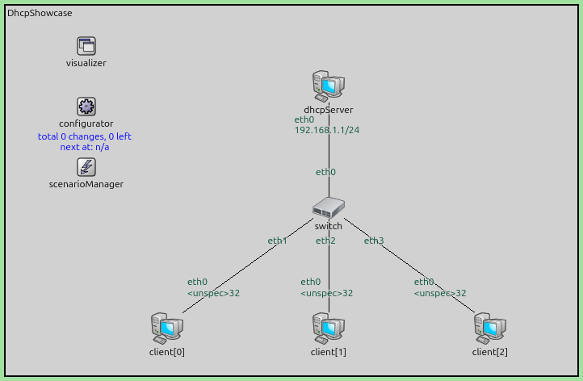

The :ned:`Ipv4NetworkConfigurator` assigns a static IP address only to the
server — client interfaces are left unconfigured so they obtain addresses
via DHCP:

.. literalinclude:: ../omnetpp.ini
   :language: ini
   :start-at: [General]
   :end-at: netmask

Configurations and Results
--------------------------

BasicDHCP
~~~~~~~~~

This configuration sets up a straightforward DHCP scenario. The server is
configured with :par:`numReservedAddresses` = 10, :par:`maxNumClients` = 50,
:par:`gateway` = "192.168.1.1", and :par:`leaseTime` = 3600s. Each client
starts its DHCP process at a random time within the first 2 seconds.

.. literalinclude:: ../omnetpp.ini
   :language: ini
   :start-at: [Config BasicDHCP]
   :end-before: [Config LeaseRenewal]

All three clients obtain IP addresses starting from 192.168.1.10:
``numReservedAddresses=10`` skips the first 10 addresses counting from
the network address (.0 itself is the network address and not assignable
to a host; .1–.9 are skipped so the static server address .1 falls in
the reserved range), so the pool starts at .10 and spans 50 addresses
(.10–.59) as limited by ``maxNumClients=50``. The interface table
visualizer displays the acquired address and prefix length next to each
host.

The following sequence chart shows the DORA exchange (time is non-linear):

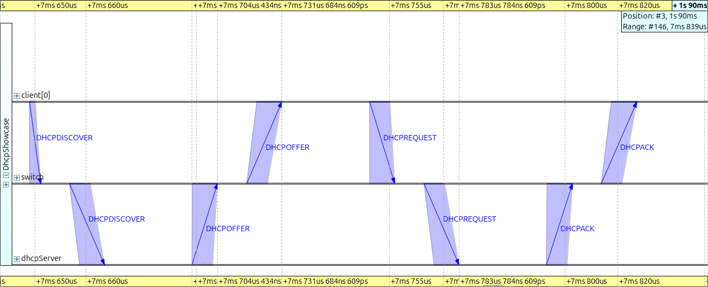

The interface table visualizer displays the acquired addresses:

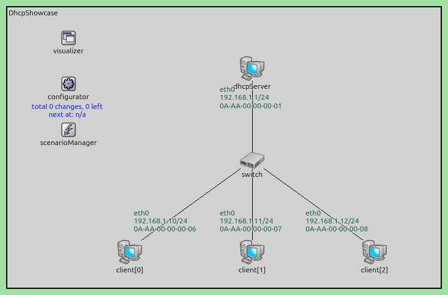

LeaseRenewal
~~~~~~~~~~~~

This configuration extends ``BasicDHCP`` and reduces the lease time to 60
seconds. Since the T1 timer fires at half the lease time (30s), clients
will attempt to renew their leases during the 200-second simulation. This
allows observation of the BOUND → RENEWING transition and the subsequent
unicast DHCPREQUEST/DHCPACK renewal exchange.

.. literalinclude:: ../omnetpp.ini
   :language: ini
   :start-at: [Config LeaseRenewal]
   :end-before: [Config ClientCrash]

During the simulation, the T1 timer fires at t≈31 s for each client
(half of the 60 s lease, measured from each client's own bind around
t≈1 s — clients start at ``uniform(0s, 2s)``),
triggering a unicast DHCPREQUEST to the server. The server responds with
a DHCPACK, extending the lease. This renewal cycle repeats throughout
the simulation.

Sequence chart of two clients' renewal cycles at T1, captured against
the wired path client → switch → dhcpServer. The unicast renewal is
preceded by an ARP exchange to resolve the server's MAC, then carries
the DHCPREQUEST and DHCPACK:

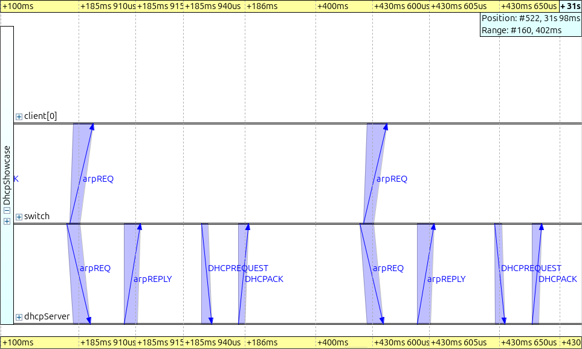

ClientCrash
~~~~~~~~~~~

This configuration demonstrates how a DHCP client re-acquires its address
after an unclean restart. A :ned:`ScenarioManager` ``<crash>`` event takes
``client[0]`` down at t=30s and a ``<startup>`` event brings it back at
t=60s. Because a crash skips the graceful-shutdown path, the client
does *not* emit a DHCPRELEASE, and it still remembers its previously
held address across the restart. On startup the client therefore
enters **INIT-REBOOT** and broadcasts a DHCPREQUEST for its previously
held
address (skipping the Discover and Offer steps); the server responds
with a DHCPACK (or a DHCPNAK if the address is no longer valid). The
lease time is set to 120 seconds.

.. literalinclude:: ../omnetpp.ini
   :language: ini
   :start-at: [Config ClientCrash]
   :end-before: [Config CleanShutdown]

The scenario script:

.. literalinclude:: ../scenario.xml
   :language: xml

At t=30s, ``client[0]`` is crashed and its interface is deconfigured.
At t=60s, the client restarts; because its lease object survived the
crash it enters INIT-REBOOT and broadcasts a DHCPREQUEST for the
previously held address. The server confirms with a DHCPACK and the
client receives the same IP address as before the crash. The other two
clients continue their normal lease renewals throughout — their unicast
DHCPREQUEST/DHCPACK pairs around t≈61 s, t≈121 s, and t≈181 s (T1 = 60 s
of the 120 s lease) are visible in the server pcap.

Sequence chart of the INIT-REBOOT exchange at t=60 s. The broadcast
DHCPREQUEST from ``client[0]`` reaches ``dhcpServer`` via ``switch`` and
the server confirms the old binding with a DHCPACK — no Discover/Offer:

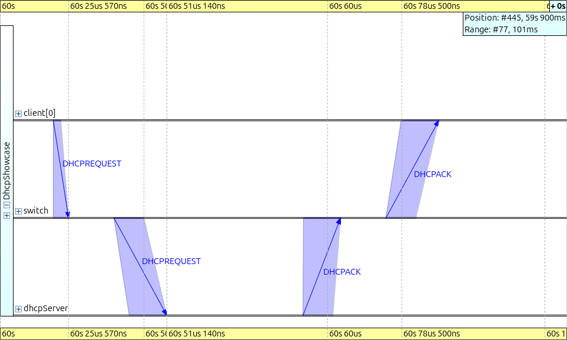

CleanShutdown
~~~~~~~~~~~~~

This configuration demonstrates the **DHCPRELEASE** path
and contrasts directly with ``ClientCrash``. The
scenario is otherwise identical — ``client[0]`` goes down at t=30s and
back up at t=60s — but the ScenarioManager event is a *graceful*
``<shutdown>`` rather than a ``<crash>``. On its way out the client
unicasts a DHCPRELEASE to the granting server, forgets its address,
and exits. The server immediately returns the address to the pool
without waiting for the lease to expire. On restart the client has no
surviving lease, so it performs a fresh DORA from INIT.

.. literalinclude:: ../omnetpp.ini
   :language: ini
   :start-at: [Config CleanShutdown]
   :end-before: [Config LeaseExpiration]

The scenario script:

.. literalinclude:: ../scenario_clean_shutdown.xml
   :language: xml

The DHCPRELEASE is visible in the server-side pcap as a single
BOOTREQUEST with message type ``DHCPRELEASE``, and the server log
shows the address returning to the pool the moment it arrives. With
the pool sized generously (50 addresses) the client typically
reacquires the same IP, but the path to it goes through a full DORA,
not INIT-REBOOT.

Sequence chart of the t=30 s shutdown showing the ARP resolution that
precedes the unicast DHCPRELEASE, followed by the RELEASE itself
travelling client → switch → dhcpServer:

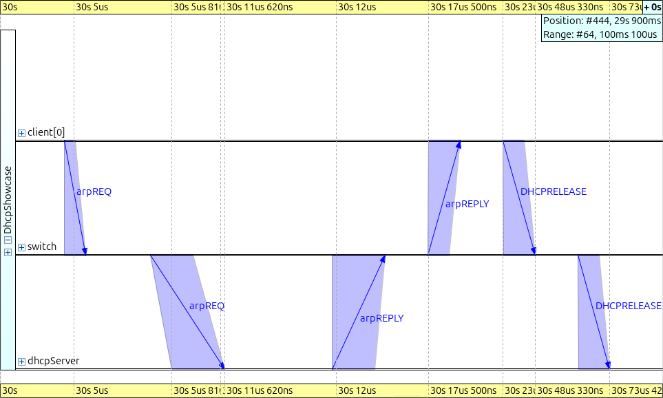

LeaseExpiration
~~~~~~~~~~~~~~~

This configuration exercises the server's **lease-expiration timer**
(introduced for RFC 2131 compliance). The pool is sized to exactly one
address (``maxNumClients = 1``) and the lease time is shortened to 30
seconds. ``client[0]`` starts up at t=0, takes the only address, and is
then *crashed* at t=5s — so no DHCPRELEASE is sent and the server
believes the lease is still in use. At t=80s, well after the lease
duration has elapsed, ``client[1]`` is brought up; it must be able to
acquire ``192.168.1.10`` only if the server has independently reclaimed
the abandoned slot.

.. literalinclude:: ../omnetpp.ini
   :language: ini
   :start-at: [Config LeaseExpiration]
   :end-before: [Config ServerReboot]

The scenario script:

.. literalinclude:: ../scenario_lease_expiration.xml
   :language: xml

The server log shows a "Lease 192.168.1.10 (...) expired, returning
address to the pool." line about a lease time after client[0]
acquired the address. When client[1] joins at t=80s, the slot is
already free again and the DORA completes normally with ``client[1]``
receiving the same 192.168.1.10 that ``client[0]`` previously held.

Sequence chart of ``client[1]``'s DORA at t=80 s, after the server has
reclaimed ``192.168.1.10`` from the crashed ``client[0]``:

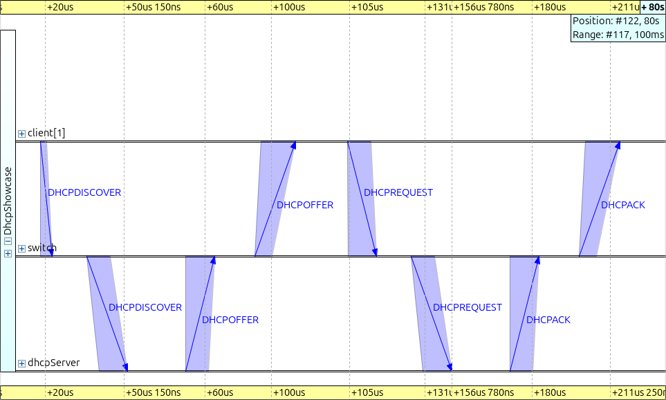

ServerReboot
~~~~~~~~~~~~

This configuration demonstrates what happens when the DHCP server reboots
and loses its lease database. The server is shut down at t=30s and
restarted at t=40s via :ned:`ScenarioManager`. When the server comes back
up, it has no record of previously granted leases.

The lease time is set to 100 seconds, so the T1 renewal timer fires at
t≈51 s (50 s after each client's own bind around t≈1 s). When a client
sends a unicast DHCPREQUEST to renew its lease, the server does not
recognize it and responds with a DHCPNAK. The client then falls back
to the INIT state and performs a full DORA exchange to obtain a new
address.

.. literalinclude:: ../omnetpp.ini
   :language: ini
   :start-at: [Config ServerReboot]
   :end-before: [Config LossyDORA]

The scenario script:

.. literalinclude:: ../scenario_server_reboot.xml
   :language: xml

The server shuts down at t=30s and restarts at t=40s. When the clients'
T1 timers fire around t≈51 s, the server no longer recognizes their
leases. The sequence chart shows the server responding with a DHCPNAK,
followed by the client performing a complete DORA exchange to obtain a
new address.

Sequence chart of the failed renewal and recovery at t≈51 s: the
unicast DHCPREQUEST (preceded by ARP resolution) reaches the restarted
server which has no lease record and responds with DHCPNAK, after which
the client falls back to a full DORA exchange:

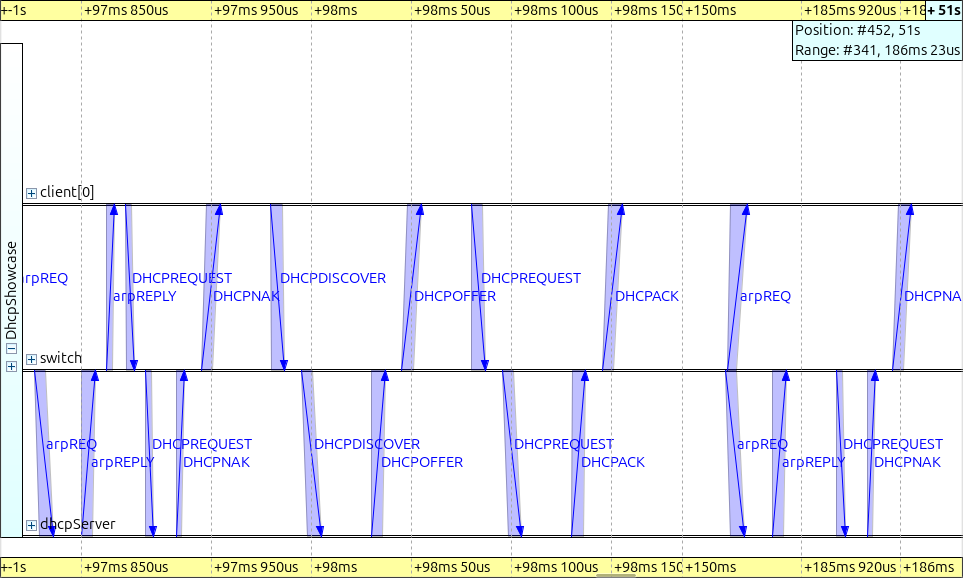

LossyDORA
~~~~~~~~~

This configuration exercises the client's **retransmission strategy**.
The DHCP server is initially DOWN and
:ned:`ScenarioManager` brings it up at t=10s. ``client[0]`` starts at
its usual ``uniform(0s, 2s)`` and sends the first DHCPDISCOVER while
nobody is listening. The client then retransmits the same DHCPDISCOVER
(same xid) at exponentially growing intervals — ~4 s, then ~8 s, then
~16 s, each with ±1 s of jitter — until a reply arrives. The remaining
two clients are disabled in this config so the trace stays focused on
the retransmits.

.. literalinclude:: ../omnetpp.ini
   :language: ini
   :start-at: [Config LossyDORA]
   :end-before: [Config Roaming]

The scenario script:

.. literalinclude:: ../scenario_lossy_dora.xml
   :language: xml

A PcapRecorder on the always-up ``switch`` captures the full sequence
(a recorder on ``dhcpServer`` would only start once the server itself
came up at t=10s and so would miss the retransmits sent during
downtime). The capture shows:

- the initial DHCPDISCOVER at t≈1 s (no reply — server is down);
- a retransmit at t≈5 s (still no reply);
- a third attempt at t≈14 s that succeeds, immediately followed by the
  OFFER, REQUEST and ACK.

The bind therefore lands around t≈14 s, not "right after the server
comes up at t=10 s": each unanswered DISCOVER doubles the wait, and
once the next scheduled retransmit is ~8 s after t=5 s (±1 s of
jitter), the t=10 s server-up window is already missed. The takeaway
is that the client recovers in two retransmits rather than sitting on
one long ``maxRetransmitDelay``-sized wait — not that it recovers
instantly.

The same retransmit machinery applies to DHCPREQUEST in REQUESTING /
REBOOTING, and to lease renewals in RENEWING / REBINDING (where
the "half the remaining interval" rule replaces the doubled-delay
schedule).

Sequence chart of the entire LossyDORA run, with the three retransmits
visible as three DHCPDISCOVER arrows fanning out to ``dhcpServer`` at
t≈1 s, t≈5 s, and t≈14 s; only the third one returns an OFFER (the
server is finally up), and the REQUEST/ACK pair completes immediately
after:

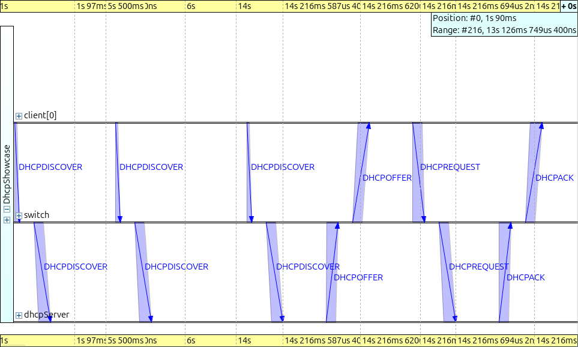

Roaming
~~~~~~~

This configuration uses a different network (:ned:`DhcpRoaming`) to
demonstrate DHCP in a wireless roaming scenario. Two access points
(``ap1``, ``ap2``) are each connected to a dedicated DHCP server on a
separate subnet (192.168.1.0/24 and 192.168.2.0/24). The wired host
named ``server`` is reachable through both DHCP servers, which act as
gateways (``forwarding = true``). Static routes on ``server`` ensure
both subnets are reachable.

The network topology for the roaming scenario:

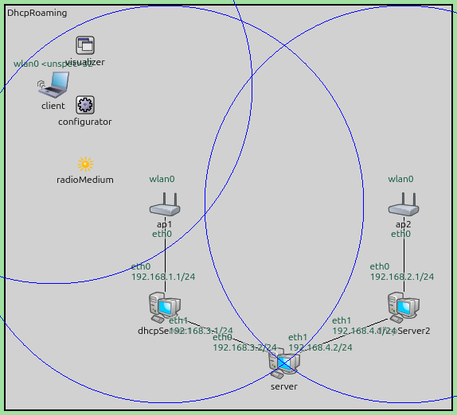

The wireless client uses :ned:`RectangleMobility` to move back and forth
between the two access points at 20 m/s. As it moves out of range of one
access point and into range of the other, it associates with the new AP.
The :ned:`DhcpClient` subscribes to the link-layer association signal; when
a new association is detected it unbinds the current lease and restarts the
DORA exchange, obtaining an address from the DHCP server on the new subnet.

Config header:

.. literalinclude:: ../omnetpp.ini
   :language: ini
   :start-at: [Config Roaming]
   :end-at: sim-time-limit = 200s

The configurator gives the two DHCP servers their static addresses on
``eth0`` and wires up the routing so the wired ``server`` host is
reachable through either subnet; the mobility module drives the client
back and forth across the two coverage areas. The DHCP-relevant
parameters:

.. literalinclude:: ../omnetpp.ini
   :language: ini
   :start-at: # DHCP client
   :end-at: *.dhcpServer*.forwarding = true

As the client moves from one access point's coverage area to the other,
it disassociates from the old AP and associates with the new one. The
DHCP client detects the interface change and initiates a new DORA
exchange with the DHCP server on the new subnet, obtaining an address
from a different address range.

Sequence chart of the t≈17.6 s roam to ``ap2``: 802.11 association
traffic completes between ``client`` and ``ap2``, and the new DORA goes
out via ``ap2`` to ``dhcpServer2`` (192.168.2.x subnet), distinct from
the initial DORA which used ``ap1`` / ``dhcpServer1`` on 192.168.1.x:

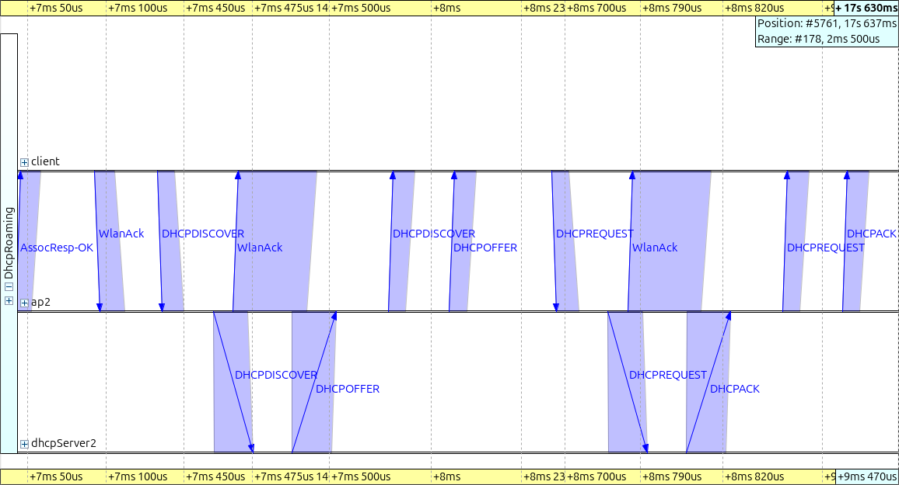

Sources: :download:`omnetpp.ini <../omnetpp.ini>`,
:download:`DhcpShowcase.ned <../DhcpShowcase.ned>`,
:download:`scenario.xml <../scenario.xml>`,
:download:`scenario_clean_shutdown.xml <../scenario_clean_shutdown.xml>`,
:download:`scenario_lease_expiration.xml <../scenario_lease_expiration.xml>`,
:download:`scenario_server_reboot.xml <../scenario_server_reboot.xml>`,
:download:`scenario_lossy_dora.xml <../scenario_lossy_dora.xml>`

Try It Yourself
---------------

If you already have INET and OMNeT++ installed, start the IDE by typing
``omnetpp``, import the INET project into the IDE, then navigate to the
``inet/showcases/general/dhcp`` folder in the `Project Explorer`. There, you can view
and edit the showcase files, run simulations, and analyze results.

Otherwise, there is an easy way to install INET and OMNeT++ using `opp_env
<https://omnetpp.org/opp_env>`__, and run the simulation interactively.
Ensure that ``opp_env`` is installed on your system, then execute:

.. code-block:: bash

    $ opp_env run inet-4.6 --init -w inet-workspace --install --build-modes=release --chdir \
       -c 'cd inet-4.6.*/showcases/general/dhcp && inet'

This command creates an ``inet-workspace`` directory, installs the appropriate
versions of INET and OMNeT++ within it, and launches the ``inet`` command in the
showcase directory for interactive simulation.

Alternatively, for a more hands-on experience, you can first set up the
workspace and then open an interactive shell:

.. code-block:: bash

    $ opp_env install --init -w inet-workspace --build-modes=release inet-4.6
    $ cd inet-workspace
    $ opp_env shell

Inside the shell, start the IDE by typing ``omnetpp``, import the INET project,
then start exploring.

Discussion
----------

Use `this page <https://github.com/inet-framework/inet-showcases/issues/TODO>`__ in
the GitHub issue tracker for commenting on this showcase.

.. TODO: The DhcpServer does not expose a parameter for the DNS server address
   announced to clients (the field defaults to 0.0.0.0). Consider adding a
   ``dns`` parameter and documenting it in the parameter list above.
