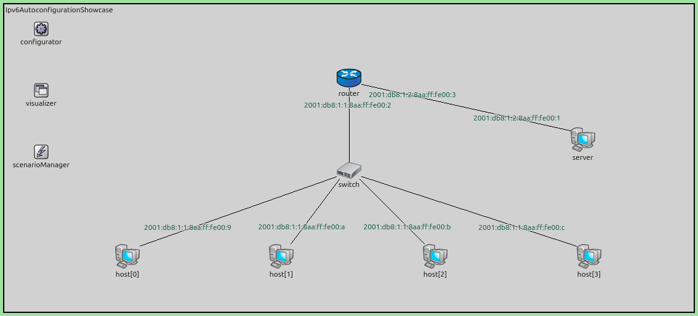
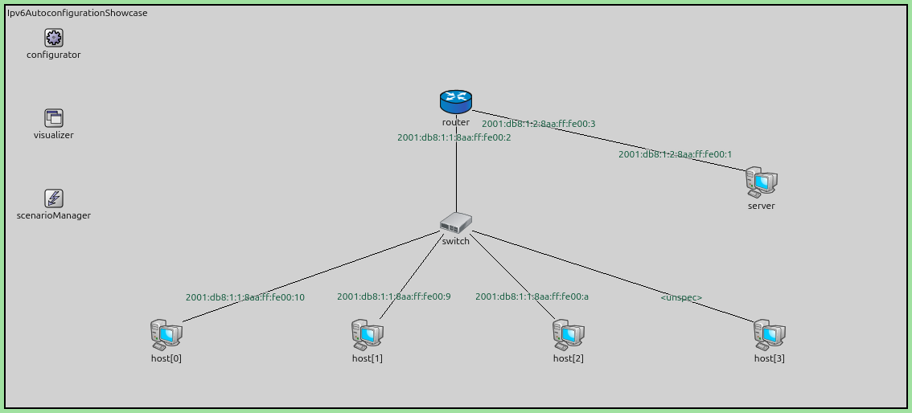

IPv6 Address Autoconfiguration
==============================

Goals
-----

A host that joins a network cannot do anything until it has an address. In IPv4,
someone has to supply that address: an administrator configures it by hand, or a
DHCP server hands it out. Both answers need something on the network besides the
host itself.

IPv6 removes that dependency. A host builds its own addresses from two things it
already has: the identifier of its own network interface, and a prefix that the
local router announces to everyone on the link. This is called Stateless Address
Autoconfiguration (SLAAC). No server keeps any state, and nothing is configured
by hand.

Building your own address raises an obvious risk. If two hosts pick the same
address, both break. IPv6 answers this with Duplicate Address Detection (DAD):
before a host uses an address, it asks the link whether anyone already has it.

This showcase demonstrates both mechanisms. In the first simulation, four hosts
and a server start with no addresses at all and end up fully configured. In the
second, a host carrying a duplicated hardware address joins the same network, and
Duplicate Address Detection refuses the address it tried to claim.

| Verified with INET version: ``4.6``
| Source files location: `inet/showcases/general/ipv6autoconfiguration <https://github.com/inet-framework/inet/tree/master/showcases/general/ipv6autoconfiguration>`__

About IPv6 Address Autoconfiguration
------------------------------------

Stateless Address Autoconfiguration (SLAAC) is part of a larger protocol called
Neighbor Discovery (ND), defined in RFC 4861. Neighbor Discovery replaces several
separate IPv4 mechanisms with one protocol. Address autoconfiguration itself is
defined in RFC 4862.

The interface identifier
~~~~~~~~~~~~~~~~~~~~~~~~

Every IPv6 address is 128 bits. On an Ethernet link the lower 64 bits are the
*interface identifier*, and a host derives it from the 48-bit MAC address of its
network interface. Two hosts with different MAC addresses therefore produce
different interface identifiers. This is what makes autoconfiguration work
without a server: the host already owns a value that is supposed to be unique on
the link.

The link-local address
~~~~~~~~~~~~~~~~~~~~~~

The first address a host builds is a *link-local address*. It combines the fixed
prefix ``fe80::/64`` with the interface identifier. A link-local address works
only on the local link, and routers never forward packets that carry one. Its
purpose is to let the host talk to its neighbors and to its router before it has
any routable address.

Router discovery
~~~~~~~~~~~~~~~~

To build a routable address, the host needs a prefix, and only the router knows
it. Two messages carry this information:

- A **Router Solicitation** is sent by a host that wants the prefix now. It goes
  to the all-routers multicast address ``ff02::2``, so only routers process it.
- A **Router Advertisement** is sent by a router. It goes to the all-nodes
  multicast address ``ff02::1``. Routers send Router Advertisements periodically
  on their own, and also in answer to a Router Solicitation.

A host does not have to wait for the next periodic Router Advertisement. It sends
a Router Solicitation as soon as its link-local address is ready, and gives up
after three attempts if nothing answers.

A router must not flood the link with Router Advertisements. It leaves a minimum
gap of three seconds between two Router Advertisements sent to the all-nodes
multicast address. A Router Solicitation that arrives inside that gap is served
by the next Router Advertisement rather than by one of its own. This is why
several hosts starting at the same time are not all configured at the same
moment.

The Prefix Information option
~~~~~~~~~~~~~~~~~~~~~~~~~~~~~

A Router Advertisement carries a *Prefix Information option* for each prefix on
the link. The option holds:

- the prefix itself, and its length, which is 64 bits for autoconfiguration;
- the *autonomous* flag, which tells hosts they may build an address from this
  prefix;
- the *on-link* flag, which tells hosts that addresses in this prefix are
  reachable directly, without going through the router;
- a *valid lifetime* and a *preferred lifetime*, which say how long the address
  may be used.

A host that receives a Prefix Information option with the autonomous flag set
combines the prefix with its own interface identifier. The result is its global
address.

Duplicate Address Detection
~~~~~~~~~~~~~~~~~~~~~~~~~~~

A newly built address is *tentative*. The host must not send ordinary traffic
from a tentative address. First it runs Duplicate Address Detection (DAD).

The host sends a **Neighbor Solicitation** that names the tentative address as
its target. The source address of this message is the unspecified address
``::``, because the host has no address it is allowed to use yet. Two answers
mean failure:

- another host answers with a **Neighbor Advertisement**, which means it already
  holds the address;
- another host sends a Neighbor Solicitation for the same target, which means it
  is testing the same address at the same time.

Either way, the address is refused and never assigned. If nothing answers within
the retransmission timer, the address becomes permanent.

The solicited-node multicast address
~~~~~~~~~~~~~~~~~~~~~~~~~~~~~~~~~~~~

A Neighbor Solicitation is not broadcast. It is sent to the *solicited-node
multicast address* of the target, which is ``ff02::1:ff`` followed by the low 24
bits of the target address. On Ethernet this maps to a multicast MAC address, so
network cards whose address does not match discard the frame in hardware. This is
the main practical difference from IPv4 Address Resolution Protocol (ARP), which
broadcasts to every node on the link.

The order of events
~~~~~~~~~~~~~~~~~~~

Putting the pieces together, a host that joins a link performs these steps:

1. Build the link-local address from the interface identifier.
2. Run Duplicate Address Detection (DAD) on the link-local address.
3. Send a Router Solicitation.
4. Receive a Router Advertisement and read its Prefix Information option.
5. Build the global address from the prefix and the interface identifier.
6. Run Duplicate Address Detection (DAD) on the global address.

Each address is therefore checked separately, and a host runs Duplicate Address
Detection twice before it is fully configured.

IPv6 Address Autoconfiguration in INET
--------------------------------------

Node types
~~~~~~~~~~

The showcase uses three node types. :ned:`StandardHost6` is a host with an IPv6
network layer and IPv4 disabled. :ned:`Router6` is the same arrangement for a
router; it forwards packets and sends Router Advertisements.
:ned:`EthernetSwitch` is a layer-2 switch, so all nodes attached to it share one
link and one prefix.

Leaving the addresses to the hosts
~~~~~~~~~~~~~~~~~~~~~~~~~~~~~~~~~~

By default, INET's :ned:`Ipv6NetworkConfigurator` assigns a global address to
every interface in the network before the simulation starts. That would leave
Stateless Address Autoconfiguration (SLAAC) with nothing to do.

Setting :par:`assignAddressesToHosts` to ``false`` changes this. The configurator
then addresses only router interfaces, and sets up the prefixes those interfaces
advertise. Host interfaces are left empty, so every host address seen in this
showcase is one the host worked out for itself.

The prefixes are chosen in an XML configuration:

.. literalinclude:: ../configurator.xml
   :language: xml

Each link gets its own ``/64`` prefix, which Stateless Address Autoconfiguration
(SLAAC) requires. The ``among`` attribute names the nodes that share a link. The
switch is not named, because it works at layer 2 and has no IPv6 address of its
own.

The same XML configuration can set per-interface Neighbor Discovery parameters,
including ``advValidLifetime`` and ``advPreferredLifetime`` for the advertised
prefix, ``minRtrAdvInterval`` and ``maxRtrAdvInterval`` for how often Router
Advertisements are sent, ``advAutonomousFlag`` and ``advOnLinkFlag`` for the two
flags in the Prefix Information option, and ``dupAddrDetectTransmits`` for the
number of Duplicate Address Detection probes. This showcase keeps the defaults.

Neighbor Discovery parameters
~~~~~~~~~~~~~~~~~~~~~~~~~~~~~

The :ned:`Ipv6NeighbourDiscovery` module inside each node's network layer
implements Router Discovery, Stateless Address Autoconfiguration (SLAAC) and
Duplicate Address Detection (DAD). Its parameters include:

- :par:`dupAddrDetectTransmits` — how many Neighbor Solicitations to send for
  Duplicate Address Detection (DAD). Setting it to ``0`` disables the check.
- :par:`retransTimer` — the wait between those Neighbor Solicitations, one second
  by default.
- :par:`minIntervalBetweenRAs` and :par:`maxIntervalBetweenRAs` — how often a
  router sends unsolicited Router Advertisements. The defaults, 200 and 600
  seconds, follow RFC 4861.
- :par:`hostBootupTime` and :par:`routerBootupTime` — when a node assigns its
  link-local address. Routers start earlier than hosts, so that a router is ready
  to answer by the time hosts ask.
- :par:`optimisticDad` — if set, an address may be used as a source address while
  Duplicate Address Detection (DAD) is still running.
- :par:`sendGratuitousNa` — if set, a node announces each new address to the link
  once Duplicate Address Detection (DAD) completes.

The module records three statistics: ``startDad`` counts the Duplicate Address
Detection runs a node begins, ``dadCompleted`` counts those that succeed, and
``dadFailed`` counts those that find a duplicate.

Seeing the addresses appear
~~~~~~~~~~~~~~~~~~~~~~~~~~~

:ned:`InterfaceTableVisualizer` writes each interface's current IPv6 address next
to its node on the canvas. Because host interfaces start empty, the labels appear
one by one as Stateless Address Autoconfiguration (SLAAC) proceeds.

What INET does not model
~~~~~~~~~~~~~~~~~~~~~~~~

Three limitations are worth knowing before reading the results:

- There is no DHCPv6 implementation, so the *Managed* flag in a Router
  Advertisement has no effect. Stateless Address Autoconfiguration (SLAAC) is the
  only way a host obtains an address here.
- Temporary privacy addresses are not implemented. Every address is derived from
  the MAC address, so addresses are stable and predictable. This is what makes
  the duplicate-address simulation below possible, but real hosts often use
  randomized identifiers instead.
- The lifetimes of an address that is already configured are not refreshed by
  later Router Advertisements. For this reason the showcase does not run long
  enough for prefix lifetimes to matter, and does not demonstrate them.

The Model
---------

All simulations use the following network:

Four hosts and a router are attached to a switch, so they share one link and one
prefix. A server is attached to the router over a separate link, which therefore
has a different prefix. The ``configurator`` sets up the router's addresses and
advertised prefixes, the ``visualizer`` displays interface addresses, and the
``scenarioManager`` starts a node during the second simulation.

The addresses in the figure are the ones the nodes built for themselves. The four
hosts share the prefix ``2001:db8:1:1::/64``, while the server, being on the other
link, uses ``2001:db8:1:2::/64``. The router has one address on each link.

The general configuration is:

.. literalinclude:: ../omnetpp.ini
   :start-at: [General]
   :end-before: [Config Autoconfiguration]
   :language: ini

Autoconfiguration Configuration
~~~~~~~~~~~~~~~~~~~~~~~~~~~~~~~

.. literalinclude:: ../omnetpp.ini
   :start-at: [Config Autoconfiguration]
   :end-before: [Config DuplicateAddress]
   :language: ini

There is nothing else to configure, and that is the point of the simulation.
Every node starts with an empty interface, and the addresses are the result.

DuplicateAddress Configuration
~~~~~~~~~~~~~~~~~~~~~~~~~~~~~~

.. literalinclude:: ../omnetpp.ini
   :start-at: [Config DuplicateAddress]
   :language: ini

This configuration gives ``host[0]`` and ``host[3]`` the same MAC address. Both
therefore derive the same interface identifier, and both would build the same
link-local address.

``host[3]`` starts in the ``DOWN`` state, and the ``scenarioManager`` starts it
after 15 seconds:

.. literalinclude:: ../clone.xml
   :language: xml

The delay separates the two nodes in time. By the time ``host[3]`` joins,
``host[0]`` has held its addresses for more than ten seconds. This is the
situation an operator meets after cloning a virtual machine without changing its
hardware address.

Results
-------

Autoconfiguration
~~~~~~~~~~~~~~~~~

The following video shows the first eight seconds of the ``Autoconfiguration``
simulation. Every node starts without an address. Labels appear next to the nodes
as each address passes Duplicate Address Detection (DAD).

.. video:: media/autoconfiguration.mp4
   :width: 100%
   :align: center

The log shows the order described earlier. Link-local addresses are built first,
between 0.29 s and 0.88 s:

.. code-block:: none

   0.289098  router:  Assigning Link Local Address
   0.563593  host[0]: Assigning Link Local Address
   0.578520  server:  Assigning Link Local Address
   0.630064  host[1]: Assigning Link Local Address
   0.686599  host[2]: Assigning Link Local Address
   0.875035  host[3]: Assigning Link Local Address

Each of them is then checked by Duplicate Address Detection (DAD). Once a host's
link-local address is permanent, the host starts router discovery, and the router
answers:

.. code-block:: none

   2.022849  host[1]: DAD completed for address fe80::8aa:ff:fe00:a, address is unique
   2.043570  host[0]: DAD completed for address fe80::8aa:ff:fe00:9, address is unique
   2.093885  host[1]: Initiating Router Discovery
   2.137463  router:  Create and send RA invoked!
   2.137484  host[0]: Assigning new address to: eth0
   2.137484  host[1]: Assigning new address to: eth0

One detail here is worth noting. ``host[0]`` obtains the prefix from the Router
Advertisement that ``host[1]`` asked for, because that Router Advertisement is
sent to the all-nodes multicast address. A single answer serves every host that
is listening.

The remaining hosts are served later, and the reason is the three-second minimum
gap between Router Advertisements. ``host[3]`` sends its Router Solicitation at
2.85 s and ``host[2]`` at 3.39 s, both inside the gap that opened at 2.14 s, so
their prefix arrives with the Router Advertisement at 5.37 s:

.. code-block:: none

   5.374267  router:  Create and send RA invoked!
   5.374288  host[2]: Assigning new address to: eth0
   5.374288  host[3]: Assigning new address to: eth0
   7.053168  host[2]: DAD completed for address 2001:db8:1:1:8aa:ff:fe00:b, address is unique
   7.094921  host[3]: DAD completed for address 2001:db8:1:1:8aa:ff:fe00:c, address is unique

All four hosts and the server hold a global address by 7.1 s. The multicast
addresses used along the way are visible in the packet headers: Router
Solicitations are sent to ``ff02::2``, and Router Advertisements come from the
router's link-local address ``fe80::8aa:ff:fe00:2`` to ``ff02::1``.

The statistics confirm that every node ran Duplicate Address Detection (DAD)
exactly twice, once for its link-local address and once for its global address,
and that no address was refused:

.. list-table::
   :header-rows: 1
   :widths: 30 25 25 20

   * - Node
     - ``startDad``
     - ``dadCompleted``
     - ``dadFailed``
   * - ``host[0]`` … ``host[3]``
     - 2
     - 2
     - 0
   * - ``router``
     - 2
     - 2
     - 0
   * - ``server``
     - 2
     - 2
     - 0

The router's two runs are for the link-local addresses of its two interfaces. Its
global addresses come from the configurator, so they are not checked.

Duplicate Address
~~~~~~~~~~~~~~~~~

In the second simulation, ``host[3]`` starts after 15 seconds with the same MAC
address as ``host[0]``. It builds the same link-local address, and Duplicate
Address Detection (DAD) refuses it 30 microseconds later:

.. code-block:: none

   15.712286  host[3]: Assigning Link Local Address
   15.712300  host[0]: Address is duplicate! Inform Sender of duplicate address!
   15.712316  host[3]: Received NA for tentative address fe80::8aa:ff:fe00:10 - Loss of DAD
   15.712316  host[3]: DAD failed for address fe80::8aa:ff:fe00:10 on eth0 --
              Loss of DAD, address will not be assigned

This is the first of the two failure cases described earlier. ``host[0]`` already
holds the address, so it answers the Neighbor Solicitation with a Neighbor
Advertisement, and ``host[3]`` gives up the address.

The consequence is visible on the canvas at the end of the simulation:

``host[3]`` shows ``<unspec>``: it has no address at all. The failure stops it at
the first step, so it never reaches router discovery and never builds a global
address either. A host in this state cannot communicate.

The statistics show the same result, and show that no other node is affected:

.. list-table::
   :header-rows: 1
   :widths: 30 25 25 20

   * - Node
     - ``startDad``
     - ``dadCompleted``
     - ``dadFailed``
   * - ``host[0]``, ``host[1]``, ``host[2]``
     - 2
     - 2
     - 0
   * - ``host[3]``
     - 1
     - 0
     - 1
   * - ``router``, ``server``
     - 2
     - 2
     - 0

``host[3]`` begins one Duplicate Address Detection run and completes none. This
is the outcome the mechanism exists to produce: a collision is caught before the
address is used, rather than after both hosts are broken.

Sources: :download:`omnetpp.ini <../omnetpp.ini>`,
:download:`Ipv6AutoconfigurationShowcase.ned <../Ipv6AutoconfigurationShowcase.ned>`,
:download:`configurator.xml <../configurator.xml>`,
:download:`clone.xml <../clone.xml>`

Try It Yourself
---------------

If you already have INET and OMNeT++ installed, start the IDE by typing
``omnetpp``, import the INET project into the IDE, then navigate to the
``inet/showcases/general/ipv6autoconfiguration`` folder in the `Project Explorer`.
There, you can view and edit the showcase files, run simulations, and analyze
results.

Otherwise, there is an easy way to install INET and OMNeT++ using `opp_env
<https://omnetpp.org/opp_env>`__, and run the simulation interactively.
Ensure that ``opp_env`` is installed on your system, then execute:

.. code-block:: bash

    $ opp_env run inet-4.6 --init -w inet-workspace --install --build-modes=release --chdir \
       -c 'cd inet-4.6.*/showcases/general/ipv6autoconfiguration && inet'

This command creates an ``inet-workspace`` directory, installs the appropriate
versions of INET and OMNeT++ within it, and launches the ``inet`` command in the
showcase directory for interactive simulation.

Alternatively, for a more hands-on experience, you can first set up the
workspace and then open an interactive shell:

.. code-block:: bash

    $ opp_env install --init -w inet-workspace --build-modes=release inet-4.6
    $ cd inet-workspace
    $ opp_env shell

Inside the shell, start the IDE by typing ``omnetpp``, import the INET project,
then start exploring.

.. TODO: replace the issue number below once the showcase discussion issue is opened

Discussion
----------

Use `this page <https://github.com/inet-framework/inet-showcases/issues>`__ in
the GitHub issue tracker for commenting on this showcase.
