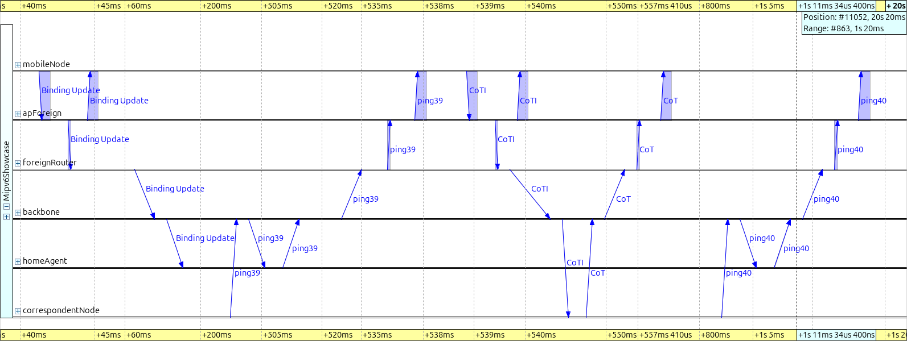
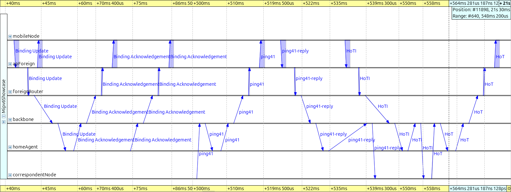
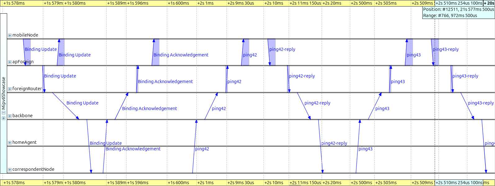
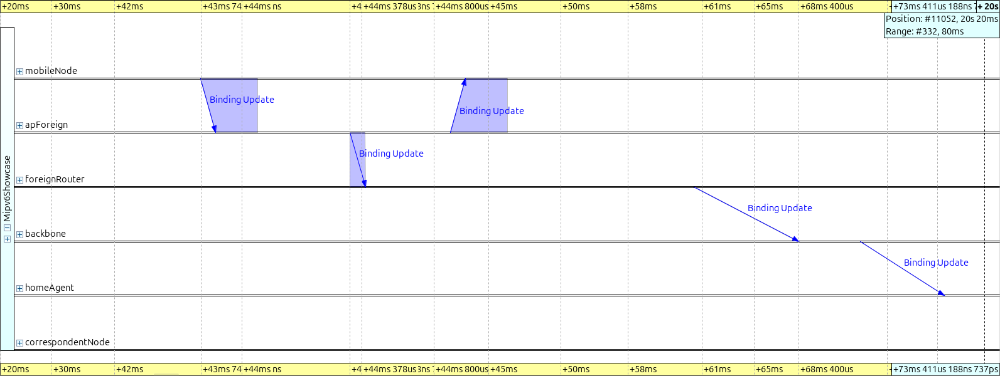
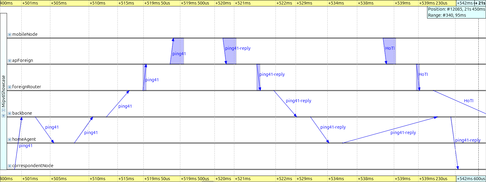
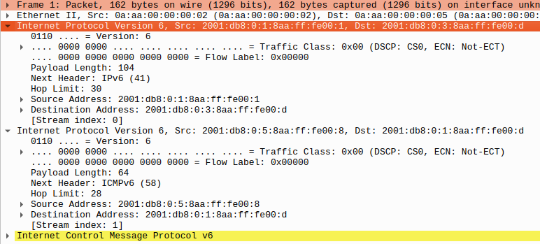
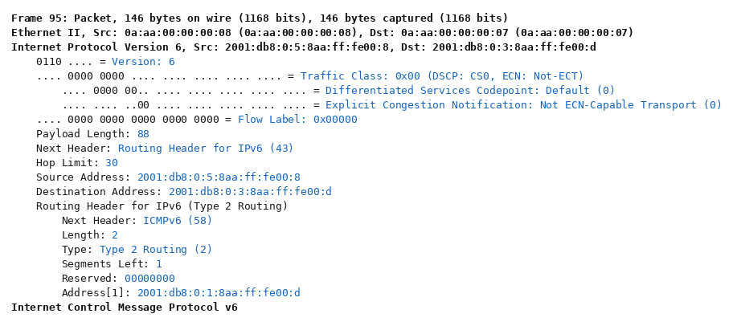

Mobile IPv6
===========

Goals
-----

An IPv6 address does two jobs at the same time. Routers read it as a
*location*, because the prefix says which link the node is on. Transport
connections read it as an *identity*, because a connection binds to one
address pair. A device that moves to a network with a different prefix gets a
new routable address. Every open connection then breaks, and nobody can reach
the device at the address they know.

Mobile IPv6 (RFC 3775, later RFC 6275) splits the two jobs into two addresses,
anchored by a *home agent*. This showcase demonstrates the whole mechanism in
one scenario. A wireless node moves from its home network to a foreign one and
back. A peer pings it at its stable address the whole time. Without Mobile
IPv6 the session dies. With Mobile IPv6 the traffic keeps flowing, first
through a tunnel and then on the direct path.

| Verified with INET version: ``4.7``
| Source files location: `inet/showcases/general/mipv6 <https://github.com/inet-framework/inet/tree/master/showcases/general/mipv6>`__

.. admonition:: In one minute

   - A wireless node leaves its home network, stays 30 s in a foreign network,
     and returns. A peer pings its stable home address every 0.5 s, from
     t = 1 s to the end of the 80 s run.
   - Without Mobile IPv6 the peer gets no reply between t = 17.0 s and
     t = 54.5 s.
   - With Mobile IPv6 the replies come back after an outage of 4.526 s in this
     run. Across seeds 1 to 10 that outage runs from 4.03 s to 7.03 s. Most of
     it is wireless re-association, not Mobile IPv6. The traffic then detours
     through the home agent, at 40.34 ms per round trip.
   - Route optimization then moves the traffic to the direct path, at 20.16 ms.
     At home the round trip is 14 ms.
   - The page shows those three round-trip-time curves, the signalling that
     produces them, and the packet headers that carry the two addresses.

.. figure:: media/pingrtt-routeopt.png
   :align: center

..
   FIGURE RECIPE: this is the same image as the route-optimization chart in
   the Results section. The recipe is attached to that copy.

**Route optimization restores reachability after a 4.5 s outage and then holds
the direct path at 20.16 ms.** The single high dot at t = 21.5 s is the one
reply that still went through the home-agent tunnel, at 40.38 ms. The rest of
the page explains every feature of this curve.

About Mobile IPv6
-----------------

Terminology
~~~~~~~~~~~

Mobile IPv6 is dense with abbreviations, so here is the cast of characters.

- **Mobile node (MN)** — the device that moves between networks.
- **Home network** — the network that hosts the mobile node's permanent
  address. The specification calls it the *home link*. "Home" means an
  administrative relationship, such as a campus network or an internet service
  provider. It is not a physical place.
- **Foreign network** — any other network the mobile node visits. The
  specification calls it the *foreign link*.
- **Home address (HoA)** — the mobile node's stable address, formed from the
  home network's prefix. This address is the identity. Applications bind to
  it, and peers use it to reach the mobile node wherever it is.
- **Care-of address (CoA)** — the temporary address the mobile node gets in
  the network it is visiting. This address is the location, and it changes
  with every move.
- **Home agent (HA)** — a function on a router on the home link. It stands in
  for the mobile node while the mobile node is away.
- **Correspondent node (CN)** — the peer the mobile node talks to. It can be
  a server or another host, anywhere in the internet. It needs Mobile IPv6
  support only for route optimization.

In this scenario the mobile node forms both of its addresses by *stateless
address autoconfiguration* (SLAAC). The standard prescribes autoconfiguration
for the care-of address, and assumes the home address is already configured.

SLAAC needs no server. Routers multicast Router Advertisements that carry the
link's prefix. A host that has just attached asks for one immediately with a
Router Solicitation. The host then appends an interface identifier of its own
making. A short duplicate address detection (DAD) probe follows, and the
address is ready. This is what makes mobility work in networks that have never
heard of the mobile node. The node can build itself a care-of address
anywhere.

What happens on a move
~~~~~~~~~~~~~~~~~~~~~~

The mobile node (MN) moves out of its home network into a foreign one. Five
things then happen in order.

1. **Layer 2 handover** — the wireless interface re-associates with the new
   access point.
2. **Movement detection** — a Router Advertisement on the new link carries an
   unfamiliar prefix, which tells the node "I have moved".
3. **Care-of address formation** — normal SLAAC, plus duplicate address
   detection on the new link.
4. **Registration** — the mobile node sends a *Binding Update (BU)* to its
   home agent (HA). The Binding Update says "my home address is now reachable
   at this care-of address, for this lifetime". The home agent confirms with a
   *Binding Acknowledgement (BA)*. The two ends run no security handshake at
   this point, because they trust each other by prior arrangement. In the
   standard that prior arrangement is an IPsec association, which both ends
   set up in advance.
5. **Delivery resumes** — the home agent now intercepts every packet addressed
   to the home address. It forwards each one to the care-of address inside an
   IPv6-in-IPv6 tunnel. The mobile node sends its own traffic back through the
   same tunnel in reverse.

A tunnel wraps one packet inside another. The home agent makes the whole
original packet the payload of a new packet, and addresses that new packet to
the care-of address. The mobile node unwraps it and reads the original packet.
The outer wrapper costs 40 bytes on every packet.

Bindings are soft state. They expire unless the mobile node refreshes them
with further Binding Updates. A mobile node that crashes or vanishes therefore
ages out of the home agent's *binding cache*. That cache is the table of home
address to care-of address mappings.

Why must the reverse direction also use the tunnel? The mobile node could
answer the correspondent node directly, but ingress filtering would stop it. A
packet that leaves the foreign network with a home-network source address
looks spoofed, and routers drop it. Base Mobile IPv6 is therefore
*bidirectional tunneling*. Both directions detour through the home agent, and
the correspondent node never learns that its peer moved.

On the home link the standard has the home agent impersonate the absent mobile
node. The home agent answers Neighbor Solicitations for the home address with
its own MAC address, so frames for the home address land on it. A Neighbor
Solicitation is the IPv6 equivalent of an ARP request. It asks "the node that
*is* this address: report your MAC".

This is proxy Neighbor Discovery. An attacker would call the same mechanism
address spoofing, and here it runs with authorization. This model does not
implement that step, and the difference is invisible here, because no other
host lives on the home link. While the mobile node is at home, the home agent
does nothing in its mobility role. It still routes the home link, as any
router does.

Route optimization
~~~~~~~~~~~~~~~~~~

The tunnel detour costs latency, because the path stretches through the home
network. It also costs 40 bytes of outer header on every packet.

*Route optimization* removes the latency detour and shrinks the per-packet
overhead from 40 bytes to 24. The mobile node registers its binding directly
with the correspondent node (CN). Packets then flow on the direct path in both
directions, and the home agent drops out of the data path. The home agent
still carries the home half of every return-routability refresh.

The interesting part is security. A forged "I moved, send my traffic here"
would be a session-hijacking primitive. The correspondent node and the mobile
node are strangers, so there is no pre-arranged trust to lean on. Mobile
IPv6's answer is the *return-routability procedure*. The procedure is a
reachability test, and it carries no routing information at all.

- The mobile node sends two probes to the correspondent node. A *Home Test
  Init (HoTI)* travels through the home-agent tunnel. A *Care-of Test Init
  (CoTI)* travels directly.
- The correspondent node returns a token to each source. A *Home Test (HoT)*
  goes back through the home agent, and a *Care-of Test (CoT)* goes back on
  the direct path.
- Only a node reachable at **both** the home address and the care-of address
  collects both tokens. Only the two tokens together yield the key that
  authenticates the *Binding Update* to the correspondent node.

The procedure proves that the sender receives packets at both addresses. It
does not establish identity. It also does not stop an attacker who already
sits on the path between the home network and the correspondent node. Such an
attacker can do the same damage without Mobile IPv6, so the procedure's
achievement is to rule out forged bindings from everywhere else.

Note the built-in ordering. The Home Test Init needs the home-agent tunnel, so
the home half of the procedure cannot start before the home registration is
complete. The Care-of Test half is free to run immediately.

The tokens are deliberately short-lived. They last three and a half minutes,
and the binding they authorize at a correspondent node lasts at most seven.
Long sessions therefore re-run the procedure periodically. A correspondent
node can also ask for a refresh with a *Binding Refresh Request*.

After route optimization, packets carry both addresses. The care-of address
goes where routers look. The home address travels in an extension header: a
*type 2 routing header* toward the mobile node, and a *Home Address
destination option* from it. The network layer swaps the home address back in
at each end. Transport connections therefore stay pinned to the stable home
address, and never notice that the packets took a different path.

Route optimization is optional, per correspondent node. A mobile node may
prefer the tunnel on purpose. Route optimization reveals the care-of address,
and therefore the mobile node's current location, to every correspondent node.
The tunnel hides that location behind the home agent.

When the mobile node returns home, it de-registers. A Binding Update with
lifetime zero deletes the binding at the home agent. The standard makes the
same step optional at correspondent nodes. The tunnel disappears, and the home
agent stops answering for an address whose owner is back.

The mobile node then announces its return on the home link with an unsolicited
Neighbor Advertisement. Its neighbors can then switch their caches back to it,
instead of waiting to re-resolve the address. That announcement refreshes
caches on the home link only. It does not decide when a distant peer's traffic
starts flowing again. Everything collapses to plain IPv6.

One final property is worth noticing. Only the mobile node, its home agent and
the correspondent nodes know that mobility is happening. The visited network
sees an ordinary host with an ordinary local address. Every router in between
forwards ordinary IPv6 packets.

Where Mobile IPv6 is used
~~~~~~~~~~~~~~~~~~~~~~~~~

Host-based Mobile IPv6 is rare in production. Route optimization asks every
peer on the internet to implement mobility signalling for the other end's
benefit, and mainstream hosts never did. The IP mobility a phone experiences
is network-based and invisible to the host: tunnels to a central anchor in
mobile networks, and Proxy Mobile IPv6. All of these reuse the same
anchor-and-tunnel design, so the mechanism is worth knowing even where you
would not deploy it.

Mobile IPv6 in INET
-------------------

INET implements the mobile node, home agent and correspondent node roles of
RFC 3775. The ``Mipv6`` module carries them. It is an optional submodule of
the IPv6 network layer, enabled by the ``hasMipv6`` parameter of
``Ipv6NetworkLayer``. Four node types package the three roles.

- ``WirelessHost6`` — a wireless host with Mobile IPv6 in the mobile-node
  role. This is the node that moves.
- ``HomeAgent6`` — an IPv6 router (``Router6``) with the home-agent role
  enabled.
- ``CorrespondentNode6`` — a standard IPv6 host that can take part in route
  optimization.
- ``MobileHost6`` — a wired variant of the mobile node, not used here.

The screenshot below shows the mobile node's IPv6 network layer. Mobile IPv6
is not a separate protocol layer. The ``mipv6`` module sits beside ``ipv6``,
``icmpv6`` and ``neighbourDiscovery``, and it implements the mobility
signalling. Two data modules sit beside it: ``buList`` records the bindings
this node has registered elsewhere, and ``bindingCache`` holds the bindings
this node keeps for others.

.. figure:: media/networklayer.png
   :align: center

..
   FIGURE RECIPE (redo via the "omnetpp-mcp-sim" skill)
   type:     canvas
   config:   RouteOptimization   # ../omnetpp.ini
   seed:     default (seed-set=1)
   shows:    Ipv6NetworkLayer interior of mobileNode: mipv6 beside ipv6/icmpv6/
             neighbourDiscovery, plus buList + bindingCache
   anchor:   structural (t=0..12s, any time before handover). If the submodule
             set differs, Ipv6NetworkLayer or the mipv6 integration changed.
   capture:  set_canvas_view zoom=1.0 -> get_canvas_image module_rectangle
             margin=5 on Mipv6Showcase.mobileNode.ipv6; was 968x615. Known
             blemish: routingTable status text overlaps configurator label
             (the module's own layout).
   stamp:    captured 2026-08, INET 4.7

**The entire Mobile IPv6 footprint is one module plus two tables, beside the
ordinary IPv6 modules.**

Configuration notes:

- ``useRouteOptimization`` sits on the mobile node's ``mipv6`` submodule and
  defaults to ``true``. It selects between bidirectional tunneling and route
  optimization. The same scenario runs both ways with this one flag.
- Movement detection starts with a Router Solicitation. On every layer-2
  association the IPv6 neighbour discovery module sends one immediately. Its
  ``detectL2Movement`` parameter, default ``true``, controls this.
- The router answers, but not always at once. It must leave a minimum gap of
  three seconds between two advertisements on the same link. It also adds a
  small random delay. An answer therefore arrives late whenever an
  advertisement went out shortly before the node asked.
- The return home in the ``WithoutMipv6`` run shows this. An advertisement had
  gone out at 51.094 s. The node associated at 51.373 s and asked. The answer
  came at 54.400 s, which is 3.305 s after the earlier advertisement: the
  three-second minimum gap plus 0.305 s of delay. The node itself waited
  3.03 s.
- Read those three seconds carefully. They are the minimum gap between two
  advertisements. They are not this scenario's advertisement interval, whose
  lower bound happens to be three seconds as well.
- This scenario advertises every 3–7 s instead of using INET's 200–600 s
  defaults, and that choice is load-bearing. With the defaults the showcase
  breaks. The ``WithoutMipv6`` run then gives its last reply at t = 17.014 s
  and never recovers.
- The mobile node autoconfigures its addresses, so the address configurator
  must leave hosts alone. The network sets ``assignAddressesToHosts = false``
  on the ``Ipv6NetworkConfigurator``, which then assigns addresses and routes
  to routers only.
- The mobile node recognizes its home agent from the home-agent flag in the
  agent's Router Advertisements. That is how it learns the home agent's
  address, at home, before it ever leaves. This model does not include the
  standard's remote-discovery mechanisms, so a mobile node must start the
  simulation in its home network.

The Model
---------

The network puts the three Mobile IPv6 locations in three corners. A home
network holds ``apHome`` and ``homeAgent``. A foreign network holds
``apForeign`` and ``foreignRouter``. A correspondent node sits on its own. All
three meet at a backbone router.

.. figure:: media/network.png
   :align: center

..
   FIGURE RECIPE (redo via the "omnetpp-mcp-sim" skill)
   type:     canvas
   config:   RouteOptimization   # ../omnetpp.ini
   seed:     default (seed-set=1)
   shows:    topology + the mobile node associated at home ("AP: HOME/at home"
             status label, green SLAAC address label on the right)
   anchor:   t=12s: associated, SLAAC done, label shows the home address
             2001:db8:0:1:8aa:ff:fe00:d. If the address differs, the MAC
             assignment order changed -> re-pin destAddr in the ini too.
   capture:  express-run to 12s -> set_canvas_view fit (zoom ~1.106) ->
             get_canvas_image module_rectangle margin=5; was 844x722. A route
             visualizer arrow may still be fading at some capture times;
             capture at ~12.2s (mid ping interval) for a clean shot.
   stamp:    captured 2026-08, INET 4.7

**Three networks, one backbone router, and a wireless node that starts at
home.**

The status text above the mobile node is live. It shows the associated SSID
and the mobility state. That state reads "at home", "away (via home agent)" or
"away (route-optimized, 1 CN)". The green label on the right is the node's
current wireless address. Both update
as the simulation runs. Note that the foreign network's router is a plain
``Router6``. The visited network needs no Mobile IPv6 support at all, just as
promised above.

The WAN link delays are the scenario's one deliberate design choice. The home
agent sits 5 ms from the backbone, the foreign router 8 ms, and the
correspondent node 1 ms. Real mobility spans real distances. These delays make
each forwarding mode land at a distinct, predictable round-trip time, which is
the sum of the link delays along its path.

.. literalinclude:: ../Mipv6Showcase.ned
   :start-at: channel AccessLan
   :end-before: network Mipv6Showcase
   :language: ned

.. literalinclude:: ../Mipv6Showcase.ned
   :start-at: connections:
   :end-at: correspondentNode.ethg
   :language: ned

The wireless link runs at 2 Mbps, and the two access points use adjacent
channels. These values keep the radio hop a small, constant and visible
contribution to every round-trip time. They do not represent a modern wireless
link.

.. literalinclude:: ../omnetpp.ini
   :start-at: **.wlan[*].bitrate
   :end-at: **.wlan[*].radio.transmitter.power
   :language: ini

Predicted round-trip times, counting propagation only. The access LANs
contribute 0.1 µs each way, which is negligible. The 2 Mbps wireless hop adds
about 2 ms of transmission and channel-access overhead on top.

- **at home**: 2 × (1 + 5) = 12 ms
- **tunneled**: 2 × (1 + 5) + 2 × (5 + 8) = 38 ms. Every packet crosses the
  backbone twice, once to the home agent and once through the tunnel.
- **route-optimized**: 2 × (1 + 8) = 18 ms

The route-optimized value is below anything a path through the home agent
could achieve. Take the cheapest conceivable detour: out through the tunnel
(1 + 5 + 5 + 8 = 19 ms) and straight back (8 + 1 = 9 ms). That already costs
28 ms in propagation alone. Measuring 20 ms is therefore proof by arithmetic
that the home agent is out of the loop.

.. admonition:: Details — the 40-byte outer header, measured

   Compare the two plateaus against each other and the outer header falls out
   of the arithmetic. Take the 19 at-home samples before the node departs,
   which is t < 15 s. Their median round trip measures 14.0149 ms, where the
   prediction gives 12 ms. The median tunneled round trip, over t = 22 s to
   50 s, measures 40.3357 ms, where the prediction gives 38 ms. The two
   measurements differ by 26.3208 ms, and the two predictions differ by 26 ms.

   The window matters. Pooling the at-home samples from before and after the
   trip gives a median of 13.9949 ms and an excess of 340.8 µs instead. The
   conclusion holds either way, but the number below comes from the samples
   before departure.

   The excess is therefore 320.8 µs. Every tunneled packet carries the 40-byte
   outer header across the 2 Mbps wireless hop in both directions. Forty bytes
   at 2 Mbps take 160 µs, so two crossings predict 320 µs.

The mobile node's movement has three acts, defined in ``movement.xml``. It
dwells at home for 15 s. It then dashes to the foreign network in 3 s and
dwells there for 30 s. It returns the same way, and settles at home for the
rest of the 80 s run. The two access points operate on different wireless
channels, and the mobile node scans both.

The correspondent node pings the mobile node's *home address* every 0.5 s,
from t = 1 s to the end of the run. The ini file hardcodes that address,
because it is the stable identity a peer would know. The address is also predictable: it is the
home prefix plus the interface identifier derived from the mobile node's MAC
address.

.. literalinclude:: ../omnetpp.ini
   :start-at: correspondentNode.numApps
   :end-at: app[0].startTime
   :language: ini

The configuration fixes the random seed (``seed-set = 1``), so every number
and every figure on this page comes back unchanged from a fresh run. The three
round-trip-time plateaus — 14 ms, 40.34 ms and 20.16 ms — are link-delay
arithmetic. Another seed moves them only in the second decimal. The outage
lengths and the number of tunneled replies before route optimization are one
run's draw, and they vary widely with the seed.

The mobile node itself is a parametric submodule, so one configuration can
swap it for a plain host. The three configurations below differ only in the
mobile node's node type, its route-optimization setting, and the format of its
status label. The network, the movement and the traffic are identical.

WithoutMipv6 configuration
~~~~~~~~~~~~~~~~~~~~~~~~~~

.. literalinclude:: ../omnetpp.ini
   :start-at: [Config WithoutMipv6]
   :end-before: [Config BidirectionalTunneling]
   :language: ini

The mobile node is an ordinary IPv6 host. ``StandardHost6`` has no radio of
its own, so the configuration adds the one wireless interface. The node
associates with the foreign access point, and SLAAC gives it a perfectly good
new address. Nobody sends anything to that address, though. The pings keep
targeting the home address, which now leads to a network where nobody answers
Neighbor Solicitations for it. This is the problem Mobile IPv6 exists to
solve, measured.

BidirectionalTunneling configuration
~~~~~~~~~~~~~~~~~~~~~~~~~~~~~~~~~~~~

.. literalinclude:: ../omnetpp.ini
   :start-at: [Config BidirectionalTunneling]
   :end-before: [Config RouteOptimization]
   :language: ini

The mobile node runs Mobile IPv6 with route optimization switched off. This is
the base protocol and nothing else. After the handover the node registers its
care-of address with the home agent, and the pings resume. Each ping enters
the home network. The home agent intercepts it and tunnels it to the care-of
address. The reply comes back through the reverse tunnel. The round-trip time
settles on the tunneling plateau for the whole stay abroad.

RouteOptimization configuration
~~~~~~~~~~~~~~~~~~~~~~~~~~~~~~~

.. literalinclude:: ../omnetpp.ini
   :start-at: [Config RouteOptimization]
   :language: ini

Route optimization stays at its default, which is enabled. The config only
sets the status label format. The first tunneled ping that reaches the mobile
node triggers the return-routability procedure with the correspondent node. A
Binding Update then installs a binding there. From the next ping onward the
traffic takes the direct path, until the return home tears everything down
again.

.. admonition:: Fine print — simplifications in this model

   Read the simulation for what it is. Six points are worth knowing.

   - RFC 3775 requires IPsec protection between the mobile node and the home
     agent. This model does not include it, which is standard practice in
     simulation.
   - The return-routability *message exchange* is faithful. Sequence, paths,
     sizes, timing and the mobile node's periodic token refresh all match. The
     cryptographic content is schematic. The tokens are constants rather than
     keyed, nonce-indexed values, and the correspondent node never invalidates
     them.
   - The home agent intercepts traffic because it is the home network's
     router. It does not answer Neighbor Solicitations on behalf of the absent
     mobile node, so this model has no proxy Neighbor Discovery. Here the
     difference is invisible, because no other host lives on the home link. A
     host on the home link could not reach an away mobile node.
   - The home agent delays its first Binding Acknowledgement by one second.
     This delay stands in for the duplicate address detection that the
     standard requires on the home address before the home agent answers, and
     a real registration waits a comparable time. Until the acknowledgement
     arrives, the reverse tunnel is not up. The mobile node then refuses to
     send a reply from its home address, because that source address would
     look spoofed outside the home network. This refusal is the node's own
     version of the ingress filtering described earlier. The node drops such
     replies rather than queueing or tunneling them, which costs one or two
     extra lost pings at the tail of each handover outage.
   - The one-second delay has a second visible effect. The mobile node's
     one-second retransmission timer fires just before the delayed
     acknowledgement arrives. The home registration in this scenario therefore
     always takes *two* Binding Updates, while the later correspondent
     registration completes with one. The acknowledgement that activates the
     binding is the one that answers the second Binding Update.
   - The routers do not generate ICMPv6 Redirects (``sendRedirects = false``).
     Traffic intercepted *toward* the mobile node never triggers the Redirect
     rule, because the home agent steers it into the tunnel before the
     forwarding check. The way back is the trigger. After the home agent
     decapsulates a reverse-tunneled reply, it forwards the inner packet out
     of the very interface the tunneled packet arrived on. That is the
     textbook Redirect condition, and it would send a useless Redirect to the
     mobile node's home address on every reply. A real stack attributes
     decapsulated packets to the tunnel interface instead. The flag stands in
     for that difference.

Results
-------

The round-trip time of every ping tells the whole story. The three
configurations use identical axes, so you can compare the phases panel by
panel. The shaded band carries the label *away from home position*. The mobile
node departs its home position at 15 s and settles back at 51 s. The two 3 s
transits fall inside the band. The band is therefore the movement schedule. It
is not the interval during which the peer loses the node.

.. figure:: media/pingrtt-without.png
   :align: center

..
   FIGURE RECIPE (redo via the "inet-showcase-charts" skill)
   type:     chart (matplotlib)
   anf:      Mipv6Showcase.anf   chart "Ping round-trip time (without Mobile IPv6)"
   inputs:   results/WithoutMipv6-#0.vec (re-run the config first)
   shows:    RTT of every ping in the WithoutMipv6 config; the total reachability
             gap while away; "away from home position" span shaded 15..51s
   anchor:   axes are pinned (x 0..80s, y 0..45ms) so the three panels compare
             directly -- keep all three identical if any one is redone.
             The gap is structural -- the home address is simply not routable
             on the foreign link. Note that the shaded band is the movement
             schedule from movement.xml, NOT the reachability gap (17.014 ->
             54.514 = 37.500s): five replies fall inside the band and 3.514s of
             silence falls after it.
   export:   opp_charttool imageexport Mipv6Showcase.anf -n "Ping round-trip time (without Mobile IPv6)"
             -f png --dpi 150 -d doc/media   (8x6in -> 1200x900)
   stamp:    captured 2026-08, INET 4.7

**Without Mobile IPv6 the peer gets no reply between t = 17.0 s and
t = 54.5 s.** The gap lasts 37.5 s, because the home address means nothing on
the foreign link. The node re-associates at home at t = 51.4 s, but its first
reply arrives 3.1 s later.

.. figure:: media/pingrtt-bidirectional.png
   :align: center

..
   FIGURE RECIPE (redo via the "inet-showcase-charts" skill)
   type:     chart (matplotlib)
   anf:      Mipv6Showcase.anf   chart "Ping round-trip time (bidirectional tunneling)"
   inputs:   results/BidirectionalTunneling-#0.vec (re-run the config first)
   shows:    RTT of every ping with route optimization off; the 40.34 ms tunneled
             plateau while away; "away from home position" span shaded 15..51s
   anchor:   axes are pinned (x 0..80s, y 0..45ms) so the three panels compare
             directly -- keep all three identical if any one is redone.
             The 40.34 ms plateau is link-delay arithmetic (38 ms + wifi) -- if it
             moved, the NED delays or the wifi bitrate changed.
   export:   opp_charttool imageexport Mipv6Showcase.anf -n "Ping round-trip time (bidirectional tunneling)"
             -f png --dpi 150 -d doc/media   (8x6in -> 1200x900)
   stamp:    captured 2026-08, INET 4.7

**Bidirectional tunneling restores reachability, at the cost of a detour.**
After a 4.526 s outage the replies resume on the 40.34 ms plateau and stay
there. Every packet takes the long way through the home agent.

.. admonition:: Details — what the 4.526 s outage is made of

   Most of this gap is not Mobile IPv6. About 3.0 s passes before the mobile
   node sends its first Binding Update. That time covers the loss of coverage,
   a scan of the two channels, association, router discovery and duplicate
   address detection. Mobile IPv6 registration accounts for the remaining
   1.5 s, and the home agent's deliberate one-second acknowledgement hold
   dominates it. The ``BidirectionalTunneling`` and ``RouteOptimization`` runs
   share the same outage, 17.014 s to 21.540 s, because the Mobile IPv6 mode
   does not change the access-layer part. The outage is therefore mostly a
   property of the access layer in this model, not the cost of Mobile IPv6. A
   production wireless handover is one to two orders of magnitude faster.

.. figure:: media/pingrtt-routeopt.png
   :align: center

..
   FIGURE RECIPE (redo via the "inet-showcase-charts" skill)
   type:     chart (matplotlib)
   anf:      Mipv6Showcase.anf   chart "Ping round-trip time (route optimization)"
   inputs:   results/RouteOptimization-#0.vec (re-run the config first)
   shows:    RTT of every ping with route optimization on; one 40.38 ms tunneled
             reply, then the 20.16 ms direct path; "away from home position"
             span shaded 15..51s
   anchor:   axes are pinned (x 0..80s, y 0..45ms) so the three panels compare
             directly -- keep all three identical if any one is redone.
             The 20.16 ms plateau is link-delay arithmetic (18 ms + wifi); the lone
             40.38 ms point at t=21.5s is the last pre-optimization reply. The
             count of tunneled replies before the switch is seed-dependent
             (this seed gives one, another gives two).
   export:   opp_charttool imageexport Mipv6Showcase.anf -n "Ping round-trip time (route optimization)"
             -f png --dpi 150 -d doc/media   (8x6in -> 1200x900)
   stamp:    captured 2026-08, INET 4.7

**Route optimization removes the detour after a single tunneled reply.** The
figure shows the same outage, then **exactly one reply at 40.38 ms**, and then
the direct path at 20.16 ms. That single high point is the one ping answered
through the tunnel before route optimization completed. The count depends on
the seed, and another seed gives two.

Up to the handover the three runs are identical. Mobile IPv6 has nothing to do
while the node is at home. The three configurations are therefore the same
simulation, sample for sample, on the 14 ms baseline. On one pair of axes the
three curves coincided exactly and hid one another. That is why the page shows
them separately.

On the way back, at t ≈ 50 s, a shorter outage covers re-association and
de-registration. It lasts about 3.0 s in both Mobile IPv6 configurations. All
three configurations then converge on the 14 ms baseline again. For the plain
host, the old address simply works again at home.

.. admonition:: Fine print — small features of the curves

   **The first reply arrives only at t ≈ 5.5 s, and a couple of milliseconds
   high.** Both hosts spend the first seconds on SLAAC and neighbor resolution
   after boot.

   **The isolated high points are queueing, not lost frames.** The mobile node
   transmits no retried frames at all in the whole 80 s run, in any of the
   three configurations. In each of the four cases the echo reply waits in the
   mobile node's wireless interface instead. Neighbor discovery handed that
   same interface one or two frames at the same instant, and the interface
   sent those first. This is neighbor unreachability detection of the node's
   own router.

   The four points are the 42.67 ms one at t = 26.54 s, and one per run near
   the end, between t = 58.0 s and t = 59.5 s. They sit between 0.91 ms and
   3.42 ms above their own plateaus.

   **After the return home the three runs do not resume together, and the
   difference is a seed artifact.** In this run the two Mobile IPv6
   configurations answer again at t = 53.014 s and the plain host at
   t = 54.514 s. The plain host is not unreachable during that time. The home
   agent resolved its address at t = 52.007 s and released five pings that had
   queued behind the resolution. The first of them arrived at t = 52.009 s.

   Four more pings followed, sent at 52.5, 53.0, 53.5 and 54.0 s. The plain
   host received all nine and answered all nine. Every one of those nine
   replies died on the way back, because the host still used the default
   router it had learned in the foreign network. The home agent discarded
   them. The return direction opens only when the home agent's Router
   Advertisement arrives, at t = 54.400 s. That advertisement answers the
   node's solicitation, and it is late because an earlier advertisement had
   gone out at 51.094 s. The next ping after it, sent at 54.5 s, is the first
   whose reply is **delivered**, at t = 54.514 s.

   Both Mobile IPv6 runs wait for an advertisement as well, and they resume
   earlier, at t = 53.014 s. The arrival time of that advertisement depends on
   when the previous one went out and on a small random delay. Both the size
   and the sign of this 1.5 s difference therefore change with the seed.

The handover, live
~~~~~~~~~~~~~~~~~~

The video below shows the outbound handover in the ``RouteOptimization``
configuration, from t = 13.2 s to t = 23.5 s. The colored polylines come from
INET's network-route visualizer, and each one traces the path a ping actually
took.

Watch the sequence. The home path runs correspondent node, backbone, home
agent, mobile node while the node is at home. Then comes the dash to the
foreign network, and the registration. A brief stretch of tunneled traffic
follows, taking the dog-leg through the home agent. Finally the traffic takes
the direct path through the foreign router, with the home agent out of the
loop.

The status label steps from "at home" through a brief "away (via home agent)"
to "away (route-optimized, 1 CN)". The address label changes to the care-of
address the moment SLAAC completes in the foreign network.

.. video:: media/handover.mp4
   :align: center

..
   VIDEO RECIPE (redo via the "video-recording" skill)
   config:   RouteOptimization
   seed:     default (seed-set=1)
   shows:    home path arrow -> dash -> handover -> one tunneled dog-leg ->
             direct path; status + address labels updating live
   anchors:  registration BU at t~20.04; the HA's BA is delayed ~1s (home-
             link DAD stand-in), binding active ~21.07; first tunneled reply
             ~21.54; RO complete (BU to CN) ~21.58; direct pings from 22.0.
             If these move, timing/params changed -> re-derive window.
   window:   express to 13.2s -> step 1 event -> record to 23.5s. No
             realTime-fade channel visualizer -> no settle wait needed.
   anim:     playback_speed=1, min_animation_speed=0.1 (the model publishes
             no animation speed; without the floor it records one frame per
             event). Qtenv built-in message animation OFF for the recording
             (private .qtenvrc copy with animation_enabled=false) -- the
             wireless signal animation draws misleading bars between the APs.
   capture:  fps=2, crop_area=with_padding; 206 frames; crop was 854:732:911:96
   encode:   ffmpeg -r 10 -vcodec libx264 -pix_fmt yuv420p (pad to even dims)
   post:     none
   stamp:    recorded 2026-08, INET 4.7

**The route arrows switch from the home-agent dog-leg to the direct path in
front of you, one ping at a time.**

The signalling, message by message
~~~~~~~~~~~~~~~~~~~~~~~~~~~~~~~~~~

The sequence chart below shows the same handover at the eventlog level. An
event filter keeps the mobility signalling and the pings, and hides all 802.11
management and neighbor discovery traffic.

Three things make these charts readable.

First, the horizontal axis is nonlinear. Horizontal distance shows event order
and density, not elapsed time. Read every time from the tick labels instead.
Each tick label is an offset from a round second, and the ruler prints that
second in bold at its right-hand end. The base second is not the same on every
panel. It is ``+ 20s`` on some panels and ``+ 21s`` on others, so read it off
the panel in front of you.

Second, the six lifelines run top to bottom in this order: ``mobileNode``,
``apForeign``, ``foreignRouter``, ``backbone``, ``homeAgent``,
``correspondentNode``. They are six of the network's seven nodes, because
``apHome`` plays no part in this window.

Third, watch where an arrow ends. An arrow that **bends** at a lifeline stops
at that node, and the node starts a new arrow onward. An arrow that merely
**crosses** a lifeline's band passes that node without touching it. This is
how the chart shows whether the home agent is in the path or not.

Each hop of a message gets its own labelled arrow. One packet therefore
appears as a chain of same-named arrows across the lifelines it crosses.

.. figure:: media/seqchart.png
   :align: center
   :width: 100%

..
   FIGURE RECIPE (redo via the "omnetpp-ide-mcp" skill)
   type:     seqchart
   config:   RouteOptimization, re-run with --record-eventlog=true
             --eventlog-recording-intervals=19s..23.5s,52s..53.5s
   seed:     default (seed-set=1)
   source:   the eventlog the config: line above produces
             (results/RouteOptimization-#0.elog). Not shipped -- results/*.elog
             is git-ignored. Copy it into an IDE-workspace project dir first if
             the worktree is not a workspace project.
   axes:     mobileNode, apForeign, foreignRouter, backbone, homeAgent,
             correspondentNode (this top-to-bottom order; apForeign is the
             wireless transit -- removing it hides the arrows)
   filter:   message_names: Binding Update, Binding Acknowledgement, HoTI,
             CoTI, HoT, CoT, ping*
   anchor:   BU at t=20.0437 (event #11078); CoTI ~20.54; second BU ~21.04;
             ping41+reply ~21.5; HoTI 21.56; BU-to-CN 21.578; direct pings
             from 22.0. goto_event first -- the disjoint recording intervals
             confuse a bare zoom_to_simulation_time_range.
   capture:  NONLINEAR timeline, NETWORK_COMMUNICATION mode, zoom to
             20.02..22.06, window 1920x1000; was 1593x599
   stamp:    captured 2026-08, INET 4.7

**The whole handover fits in two seconds of simulated time, and the traffic
stops bending at the ``homeAgent`` lifeline at the right-hand end.**

The overview is dense, so the three panels below zoom into it in order. Each
one covers one stretch of the same window.

**Registration, and pings that get no reply.**

..
   FIGURE RECIPE (redo via the "omnetpp-ide-mcp" skill)
   type:     seqchart (zoomed panel of the overview chart above)
   config:   RouteOptimization, re-run with --record-eventlog=true
             --eventlog-recording-intervals=19s..23.5s,52s..53.5s
   seed:     default (seed-set=1)
   source:   the eventlog the config: line above produces
             (results/RouteOptimization-#0.elog). Not shipped -- results/*.elog
             is git-ignored. Copy it into an IDE-workspace project dir first if
             the worktree is not a workspace project.
   axes:     mobileNode, apForeign, foreignRouter, backbone, homeAgent,
             correspondentNode (this top-to-bottom order; apForeign is the
             wireless transit -- removing it hides the arrows)
   filter:   message_names: Binding Update, Binding Acknowledgement, HoTI,
             CoTI, HoT, CoT, ping*
   shows:    the first Binding Update reaching the home agent; ping39 and ping40
             arriving through the home-agent dog-leg with no reply returning;
             the CoTI/CoT pair going directly to the correspondent
   anchor:   first BU at t=20.0437 (event #11078); CoTI 20.5385; CoT 20.5580;
             ping39 20.50, ping40 21.00. The HoTI generated at 20.5385 is
             deliberately absent -- it is dropped before transmission.
   capture:  goto_event #11077 first, then zoom 20.02..21.04. NONLINEAR timeline,
             NETWORK_COMMUNICATION mode, window 1920x1000; was 1593x600.
             The timeline allots pixels by event density, so widening the time
             range does NOT give clipped labels more room -- move the panel
             boundary instead.
   stamp:    captured 2026-08, INET 4.7

**The first Binding Update reaches the home agent, and two tunneled pings
arrive with no reply going back.**

At the left edge the first *Binding Update* descends from the mobile node, on
the top lifeline, through the foreign network to the home agent. No
acknowledgement follows it here. The home agent holds the *Binding
Acknowledgement* back for one second. That hold is this model's stand-in for a
duplicate address detection check on the home link, not protocol timing. The
acknowledgement therefore appears only in the next panel.

Meanwhile ``ping39`` and ``ping40`` reach the mobile node through the
home-agent dog-leg. Every one of their arrows visits the ``homeAgent``
lifeline. **No reply travels back.** Until the binding is active, the mobile
node discards its own replies, because their source is the home address.

The *Care-of Test Init (CoTI)* and *Care-of Test (CoT)* travel directly
between the mobile node and the correspondent node. They run right after the
first tunneled ping arrives. Their arrows cross the ``homeAgent`` band without
touching it.

Their partner the *Home Test Init (HoTI)* is **not drawn here, even though the
mobile node generates it at the same instant**. The Home Test Init needs the
reverse tunnel. This first copy is therefore dropped along with the early
replies. Only its retransmission gets through, a full second later, in the
next panel.

.. admonition:: Details — the upward arrows are ordinary wireless distribution

   An arrow that runs *upward* across the wireless band, from ``apForeign``
   back to ``mobileNode``, is **not** Mobile IPv6 signalling. It carries a
   frame whose link-layer destination is a broadcast or multicast address. An
   access point re-transmits such a frame into its own wireless cell, so that
   every station on the cell receives it, and it also passes the frame toward
   the wired network. Here the only station on the cell is the mobile node, so
   the mobile node hears its own frame come back. Its link layer discards the
   copy. This appears on every sequence chart on this page.

**The binding activates, and return routability completes.**

..
   FIGURE RECIPE (redo via the "omnetpp-ide-mcp" skill)
   type:     seqchart (zoomed panel of the overview chart above)
   config:   RouteOptimization, re-run with --record-eventlog=true
             --eventlog-recording-intervals=19s..23.5s,52s..53.5s
   seed:     default (seed-set=1)
   source:   the eventlog the config: line above produces
             (results/RouteOptimization-#0.elog). Not shipped -- results/*.elog
             is git-ignored. Copy it into an IDE-workspace project dir first if
             the worktree is not a workspace project.
   axes:     mobileNode, apForeign, foreignRouter, backbone, homeAgent,
             correspondentNode (this top-to-bottom order; apForeign is the
             wireless transit -- removing it hides the arrows)
   filter:   message_names: Binding Update, Binding Acknowledgement, HoTI,
             CoTI, HoT, CoT, ping*
   shows:    the retransmitted Binding Update, both Binding Acknowledgements
             arriving, ping41 as the first ping with a reply (still tunneled),
             and the HoTI retransmission answered by HoT
   anchor:   second BU 21.0437; BAs at the mobile node 21.0710 (answers the
             RETRANSMITTED BU -- this is the one that activates the binding)
             and 21.0870 (the home agent's held reply to the FIRST BU, stale
             sequence number, discarded). The held reply is emitted ~16 ms
             after the immediate one and can never overtake it.
             ping41 21.50 with its reply reaching the correspondent 21.5404;
             HoTI retransmit 21.5385; HoT back at the mobile node 21.5781,
             where this panel ends.
   capture:  goto_event #11914 first, then zoom 21.03..21.5782. NONLINEAR timeline,
             NETWORK_COMMUNICATION mode, window 1920x1000; was 1593x600.
             The timeline allots pixels by event density, so widening the time
             range does NOT give clipped labels more room -- move the panel
             boundary instead.
   stamp:    captured 2026-08, INET 4.7

**The retransmitted Binding Update is the one that activates the binding, and
the first reply then travels.**

The mobile node's retransmission timer fires before the held acknowledgement
arrives, so the registration takes a **second Binding Update**. You can see it
at the left edge.

Both *Binding Acknowledgement* chains then arrive together. The one that
arrives first answers the retransmitted Binding Update, and it activates the
binding. The one that arrives second is the home agent's held reply to the
first Binding Update. The mobile node discards it, because its sequence number
is stale. This is why the binding cache shown later records sequence number 2.

With the binding active, ``ping41`` is the first ping to get an answer. Its
reply follows the reverse tunnel back through the ``homeAgent`` lifeline. The
retransmitted *Home Test Init* now gets through, and the *Home Test (HoT)*
returns via the home agent. Return routability completes just as the panel
ends.

**Route optimization takes effect.**

..
   FIGURE RECIPE (redo via the "omnetpp-ide-mcp" skill)
   type:     seqchart (zoomed panel of the overview chart above)
   config:   RouteOptimization, re-run with --record-eventlog=true
             --eventlog-recording-intervals=19s..23.5s,52s..53.5s
   seed:     default (seed-set=1)
   source:   the eventlog the config: line above produces
             (results/RouteOptimization-#0.elog). Not shipped -- results/*.elog
             is git-ignored. Copy it into an IDE-workspace project dir first if
             the worktree is not a workspace project.
   axes:     mobileNode, apForeign, foreignRouter, backbone, homeAgent,
             correspondentNode (this top-to-bottom order; apForeign is the
             wireless transit -- removing it hides the arrows)
   filter:   message_names: Binding Update, Binding Acknowledgement, HoTI,
             CoTI, HoT, CoT, ping*
   shows:    the Binding Update sent straight to the correspondent node and
             acknowledged, then ping42 and ping43 running directly between
             correspondent and mobile node
   anchor:   BU to the correspondent 21.5781, acknowledged 21.5881, ack back at
             the mobile node 21.5978; ping42 at 22.00 and ping43 at 22.50 take
             the direct path. If any ping still bends at homeAgent, route
             optimization did not complete.
   capture:  goto_event #12518 first, then zoom 21.5775..22.55. NONLINEAR timeline,
             NETWORK_COMMUNICATION mode, window 1920x1000; was 1593x600.
             The timeline allots pixels by event density, so widening the time
             range does NOT give clipped labels more room -- move the panel
             boundary instead.
   stamp:    captured 2026-08, INET 4.7

**From ``ping42`` onward no arrow bends at the ``homeAgent`` lifeline any
more.**

The *Binding Update* now goes straight to the correspondent node, which
acknowledges it. INET asks for an acknowledgement on every Binding Update. The
standard makes it optional for correspondent nodes.

From ``ping42`` onward the arrows run **directly between the correspondent
node and the mobile node**. Later arrows merely *cross* the ``homeAgent``
axis on the way past. That is the visual difference between a packet the home
agent forwards and one that simply passes its position on the chart. That is
route optimization in one glance.

Step by step
~~~~~~~~~~~~

The three panels above are enough to follow the handover. The two panels below
cut the same window finer, one exchange at a time, with the dead time between
exchanges skipped.

**1 — The first Binding Update.**

..
   FIGURE RECIPE (redo via the "omnetpp-ide-mcp" skill)
   type:     seqchart (step panel 1 of 2)
   shared:   same eventlog, axes, event filter, timeline mode and window size
             as the stage panels above -- see the first stage panel's recipe
             for the full setup
   capture:  goto_event #11077 first, then zoom 20.02..20.10
   shows:    the first Binding Update, hop by hop from mobileNode to homeAgent
   anchor:   BU at 20.0437 (event #11078). No acknowledgement in this window --
             the home agent holds it for one second.
   stamp:    captured 2026-08, INET 4.7

**One message, four hops, and nothing comes back.** The mobile node registers
its new care-of address. The Binding Update travels wireless to ``apForeign``,
then over Ethernet through ``foreignRouter`` and ``backbone`` to
``homeAgent``. The panel draws five arrows, not four. The third one runs back
upward to the mobile node, and it is not a hop.

**2 — The first ping that gets an answer.**

..
   FIGURE RECIPE (redo via the "omnetpp-ide-mcp" skill)
   type:     seqchart (step panel 2 of 2)
   shared:   same eventlog, axes, event filter, timeline mode and window size
             as the stage panels above -- see the first stage panel's recipe
             for the full setup
   capture:  goto_event #12227 first, then zoom 21.45..21.545
   shows:    ping41 and the first reply that actually travels, through the
             reverse tunnel and out to the correspondent
   anchor:   ping41 21.50, at the mobile node 21.52, reply decapsulated at the home
             agent 21.5344 and delivered to the correspondent 21.5404.
   stamp:    captured 2026-08, INET 4.7

**With the binding active, ``ping41``'s reply completes a full tunneled round
trip.** The reply goes through the reverse tunnel to the home agent. The home
agent decapsulates it and forwards it to the correspondent node.

Inside the packets
~~~~~~~~~~~~~~~~~~

You can tell the two forwarding modes apart inside a single packet. The figure
below shows the two IPv6 header chunks of a tunneled ping request. Qtenv's
packet inspector captured it on the home agent's backbone link and expanded it
field by field. This request is 170 bytes on the wire: 130 bytes of ping
request plus the 40-byte outer header.

.. figure:: media/tunneled_packet.png
   :align: center

..
   FIGURE RECIPE (redo via the "omnetpp-mcp-sim" skill)
   type:     inspector
   config:   BidirectionalTunneling
   seed:     default (seed-set=1)
   shows:    IPv6-in-IPv6: chunks list with two Ipv6Header rows (outer
             HA->CoA protocol=ipv6(40); inner CN->HoA protocol=icmpv6)
   target:   express to 24.4s, fast to 25.65s -> list_logged_packets at
             homeAgent -> the 170B ping -> object inspector, expand depth 4
   anchor:   tunneled pings are 170B on the HA-backbone wire (130B + 40B
             outer header) throughout the away phase
   capture:  open_inspector type=object -> expand_inspector_tree depth=5 ->
             get_inspector_screenshot 1400x4400 -> PIL-crop (60,1778)-(800,2554),
             which is the chunks[2] and chunks[3] Ipv6Header rows with their
             fields; was 740x776.  depth=5 is deliberate -- depth=6 also
             unfolds the raw bin/raw hex dumps and shifts every row offset.
   stamp:    captured 2026-08, INET 4.7

**Two stacked IPv6 headers, and the same interface identifier under two
different prefixes.** The outer header runs from the home agent
(``2001:db8:0:1:...:1``) to the care-of address (``2001:db8:0:3:...:d``) with
``protocol = ipv6``. It carries the untouched inner packet, which runs from
the correspondent node to the *home* address. The two destination addresses
share their interface identifier ``8aa:ff:fe00:d``. That is the
identity/location split, visible inside one packet.

The next figure shows the same ping in route-optimized mode, captured at the
correspondent node and expanded the same way. This request is 154 bytes on the
wire: the same 130 bytes plus a 24-byte routing header.

.. figure:: media/ropacket.png
   :align: center

..
   FIGURE RECIPE (redo via the "omnetpp-mcp-sim" skill)
   type:     inspector
   config:   RouteOptimization
   seed:     default (seed-set=1)
   shows:    direct-path ping: single Ipv6Header (CN->CoA) + Ipv6RoutingHeader
             routingType=2 row
   target:   express to 24.4s, fast to 25.65s -> list_logged_packets at
             correspondentNode -> the 154B ping -> object inspector, depth 4
   anchor:   route-optimized pings are 154B on the CN wire (130B + 24B
             type-2 routing header) during the away phase
   capture:  open_inspector type=object -> expand_inspector_tree depth=5 ->
             get_inspector_screenshot 1400x4400 -> PIL-crop (60,1688)-(800,2358),
             which is the chunks[2] Ipv6Header and chunks[3] Ipv6RoutingHeader
             rows with their fields; was 740x670.  address[1] stays collapsed
             at depth=5 (see the prose); depth=6 would open it but also unfolds
             the hex dumps and shifts every row offset.
   stamp:    captured 2026-08, INET 4.7

**One IPv6 header instead of two, addressed to the care-of address, with a
type 2 routing header behind it.** The routing header shows ``routingType = 2,
segmentsLeft = 1``. Its address field carries the home address. The figure
keeps that field collapsed, and the Wireshark dissection below opens it.

The cost is 24 bytes instead of 40, and there is no detour. Replies in the
other direction carry the home address in a *Home Address destination option*
instead. This page does not show one.

The numbers after the protocol names in these two figures, such as
``ipv6(40)``, are INET's internal protocol identifiers rather than the IANA
protocol numbers. Fields such as ``extensionType = 43`` in the route-optimized
figure are genuine wire values.

The same two kinds of packet, off the wire
~~~~~~~~~~~~~~~~~~~~~~~~~~~~~~~~~~~~~~~~~~

INET can also write a packet capture (PCAP) file, so you can hand these
packets to Wireshark. The figures below show a tunneled request and a
route-optimized request of the same two kinds, captured at different times.
The cross-check is worth doing. Wireshark knows nothing about INET, and it
dissects the recorded bytes on their own terms. Whatever it reports is
therefore a property of the packet, not of the simulator's view of the packet.

..
   FIGURE RECIPE (redo with INET's PcapRecorder + the Wireshark GUI)
   type:     wireshark GUI screenshot of the packet-detail pane
   config:   BidirectionalTunneling   # ../omnetpp.ini
   seed:     default (seed-set=1)
   pcap:     inet -u Cmdenv -c BidirectionalTunneling
             --"*.homeAgent.numPcapRecorders=1"
             --'*.homeAgent.pcapRecorder[0].pcapFile="results/tunneled.pcap"'
             --'*.homeAgent.pcapRecorder[0].fileFormat="pcap"'
             --'**.fcsMode="computed"' --'**.crcMode="computed"'
             --'**.checksumMode="computed"'
             The computed modes are required: with INET's default declared FCS
             the recorder aborts with "Cannot serialize Ethernet FCS without a
             properly computed FCS" and writes an empty file.
   frame:    tshark -Y 'ipv6.nxt==41 && icmpv6.type==128' -> first match = frame 159 at t=20.42s
   gui:      This desktop is Wayland, and XWayland refuses synthetic input from
             other X clients, so the GUI cannot be driven on the main display.
             Run it in a nested X server instead:
               Xephyr :77 -screen 1500x1150 -ac -noreset &
               DISPLAY=:77 QT_QPA_PLATFORM=xcb wireshark -r <one-frame>.pcap
             QT_QPA_PLATFORM=xcb matters: under Wayland, Qt6 opens a native
             Wayland window that X11 tools can neither see nor capture.
   layout:   in the profile's "recent" file set gui.byte_view_show and
             gui.packet_diagram_show to false, so the detail tree gets the
             full window width and the addresses stop truncating.
   expand:   window 1500x900; click the first tree row to give the pane focus,
             then per header: Home, Down x N, Right.  N = 3 then 2 -- the inner
             IPv6 header first, because its children appear below it and so the
             outer row does not move.
   capture:  import -window <id>, crop (0,487)-(772,836); was 772x349
   anchor:   two "Internet Protocol Version 6" root lines, the outer one with
             Next Header: IPv6 (41). One root only = the tunnel was not up.
   stamp:    captured 2026-08, INET 4.7, Wireshark 4.6.4

**Wireshark independently finds the two stacked IPv6 headers.** The outer one
runs from the home agent to the care-of address with ``Next Header: IPv6
(41)``. The inner one runs from the correspondent node to the home address
with ``Next Header: ICMPv6 (58)``.

..
   FIGURE RECIPE (redo with INET's PcapRecorder + the Wireshark GUI)
   type:     wireshark GUI screenshot of the packet-detail pane
   config:   RouteOptimization   # ../omnetpp.ini
   seed:     default (seed-set=1)
   pcap:     inet -u Cmdenv -c RouteOptimization
             --"*.correspondentNode.numPcapRecorders=1"
             --'*.correspondentNode.pcapRecorder[0].pcapFile="results/routeopt.pcap"'
             --'*.correspondentNode.pcapRecorder[0].fileFormat="pcap"'
             --'**.fcsMode="computed"' --'**.crcMode="computed"'
             --'**.checksumMode="computed"'
             The computed modes are required: with INET's default declared FCS
             the recorder aborts with "Cannot serialize Ethernet FCS without a
             properly computed FCS" and writes an empty file.
   frame:    tshark -Y 'ipv6.routing.type==2 && icmpv6.type==128' -> first match = frame 95 at t=21.92s
   gui:      This desktop is Wayland, and XWayland refuses synthetic input from
             other X clients, so the GUI cannot be driven on the main display.
             Run it in a nested X server instead:
               Xephyr :77 -screen 1500x1150 -ac -noreset &
               DISPLAY=:77 QT_QPA_PLATFORM=xcb wireshark -r <one-frame>.pcap
             QT_QPA_PLATFORM=xcb matters: under Wayland, Qt6 opens a native
             Wayland window that X11 tools can neither see nor capture.
   layout:   in the profile's "recent" file set gui.byte_view_show and
             gui.packet_diagram_show to false, so the detail tree gets the
             full window width and the addresses stop truncating.
   expand:   window 1500x900; click the first tree row to give the pane focus,
             then Home, Down x2, Right (the IPv6 header), then Home, Down x12,
             Right (the routing header -- it is the tenth child of IPv6, after
             the generated [Stream index] row, so 2 + 10).
   capture:  import -window <id>, crop (0,487)-(772,806); was 772x319
   anchor:   one IPv6 root with Next Header: Routing Header for IPv6 (43), and
             Address[1] holding the home address. If the routing header is
             absent, route optimization did not complete.
   stamp:    captured 2026-08, INET 4.7, Wireshark 4.6.4

**Here the routing header gives up the field the object inspector kept
collapsed.** ``Address[1]`` holds ``2001:db8:0:1:8aa:ff:fe00:d``, the home
address. The destination is ``2001:db8:0:3:8aa:ff:fe00:d``, the care-of
address. One packet carries both halves of the identity/location split, and no
home agent sits anywhere on its path.

One detail needs reconciling. Wireshark reports these frames as 162 and 146
bytes. That is eight fewer than the 170 B and 154 B the simulation reports for
packets of the same two kinds. INET counts the Ethernet preamble and
start-of-frame delimiter, which a capture file does not store.

Meanwhile the home agent's binding cache holds exactly one entry. That mapping
is what this whole protocol exists to maintain.

.. figure:: media/bindingcache.png
   :align: center

..
   FIGURE RECIPE (redo via the "omnetpp-mcp-sim" skill)
   type:     inspector
   config:   BidirectionalTunneling (RouteOptimization looks the same)
   seed:     default (seed-set=1)
   shows:    homeAgent.ipv6.bindingCache: HoA 2001:db8:0:1:...:d => CoA
             2001:db8:0:3:...:d, lifetime 3600, home registration
   target:   open_inspector (object) on Mipv6Showcase.homeAgent.ipv6.
             bindingCache at t~25s, expand depth 4
   anchor:   exactly 1 entry while the mobile node is away; 0 after ~53s
   capture:  get_inspector_screenshot 1300x900 -> crop map rows
             (was x14-830, y370-430)
   stamp:    captured 2026-08, INET 4.7

**One entry maps the home address to the care-of address, with a 3600 s
lifetime and sequence number 2.** The 3600 s lifetime is the home-registration
default (``maxHaBindingLifeTime``). Home bindings are long-lived, and the
mobile node refreshes them well before they expire. Nothing in an 80 s run
reaches either expiry. The sequence number 2 is the two-act registration
again. The acknowledgement that activated this binding answered the
retransmitted, second Binding Update.

Coming home
~~~~~~~~~~~

The second video shows the return, from t = 47.5 s to t = 56 s, still in the
``RouteOptimization`` configuration. It shows direct-path pings and then the
dash home. Right after re-association the mobile node sends de-registration
Binding Updates, with lifetime zero, to the home agent and the correspondent
node. The status label returns to "at home", the address label to the home
address, and the pings to the 14 ms home path.

.. video:: media/returnhome.mp4
   :align: center

..
   VIDEO RECIPE (redo via the "video-recording" skill)
   config:   RouteOptimization
   seed:     default (seed-set=1)
   shows:    direct path -> dash home -> re-association -> lifetime-0 BUs
             (~52.49s) -> home path again; labels revert
   anchors:  de-registration BUs (lifetime 0) to HA and CN at t~52.49, BAs
             ~52.50; first home-path reply ~53.01
   window:   express to 47.5s -> step 1 event -> record to 56s
   anim:     same as handover.mp4 (playback_speed=1, min_animation_speed=0.1,
             built-in animation off via private .qtenvrc)
   capture:  fps=2, crop_area=with_padding; 170 frames (numbering continued
             at 206 -> ffmpeg -start_number 206); crop was 854:732:911:96
   encode:   ffmpeg -r 10 -start_number 206 -vcodec libx264 -pix_fmt yuv420p
   post:     none
   stamp:    recorded 2026-08, INET 4.7

**The binding cache empties and everything collapses back to plain IPv6.**

The result files record no Mobile IPv6 statistics, so they do not show the
de-registration itself. To see the lifetime-zero Binding Updates, re-run the
``RouteOptimization`` configuration with eventlog recording over t = 52 s to
53.5 s. Then open that eventlog in the sequence chart tool.

Sources: :download:`omnetpp.ini <../omnetpp.ini>`,
:download:`Mipv6Showcase.ned <../Mipv6Showcase.ned>`,
:download:`movement.xml <../movement.xml>`

Try It Yourself
---------------

If you already have INET and OMNeT++ installed, start the IDE by typing
``omnetpp``, import the INET project into the IDE, navigate to the
``inet/showcases/general/mipv6`` folder in the `Project Explorer`, and double-click the
``omnetpp.ini`` file to open it. Select a configuration and press **Run**.

If you don't have INET and OMNeT++ installed, you can quickly set them up
using `opp_env <https://omnetpp.org/opp_env>`__, and run the simulation
interactively. Ensure that ``opp_env`` is installed on your system, then
execute:

.. code-block:: bash

    $ opp_env run inet-4.7 --init -w inet-workspace --install --build-modes=release --chdir \
       -c 'cd inet-4.7.*/showcases/general/mipv6 && inet'

This command creates an ``inet-workspace`` directory, installs the appropriate
versions of INET and OMNeT++ within it, and launches the ``inet`` command in the
showcase directory for interactive simulation.

Alternatively, for a more hands-on experience, you can first set up the
workspace and then open an interactive shell:

.. code-block:: bash

    $ opp_env install --init -w inet-workspace --build-modes=release inet-4.7
    $ cd inet-workspace
    $ opp_env shell

Inside the shell, start the IDE by typing ``omnetpp``, import the INET project,
then start exploring.

Discussion
----------

Use `this page <https://github.com/inet-framework/inet-showcases/issues/TODO>`__ in
the GitHub issue tracker for commenting on this showcase.

.. TODO: create the tracker issue for this showcase and replace the link above
