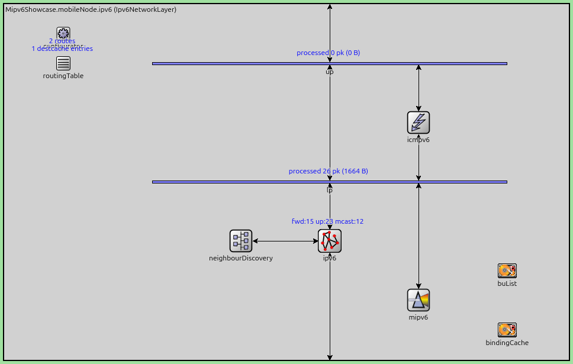
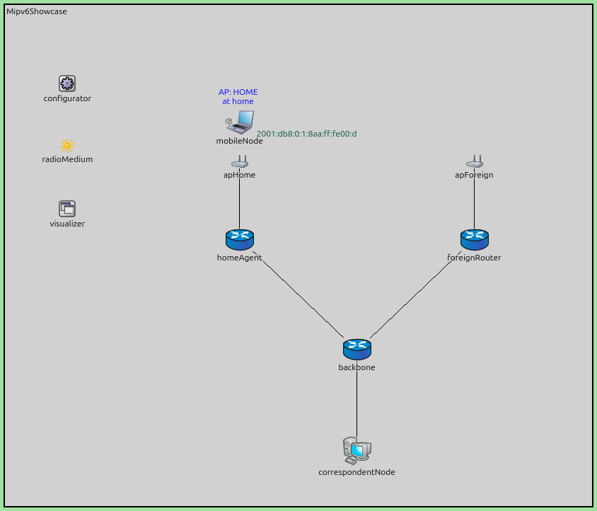
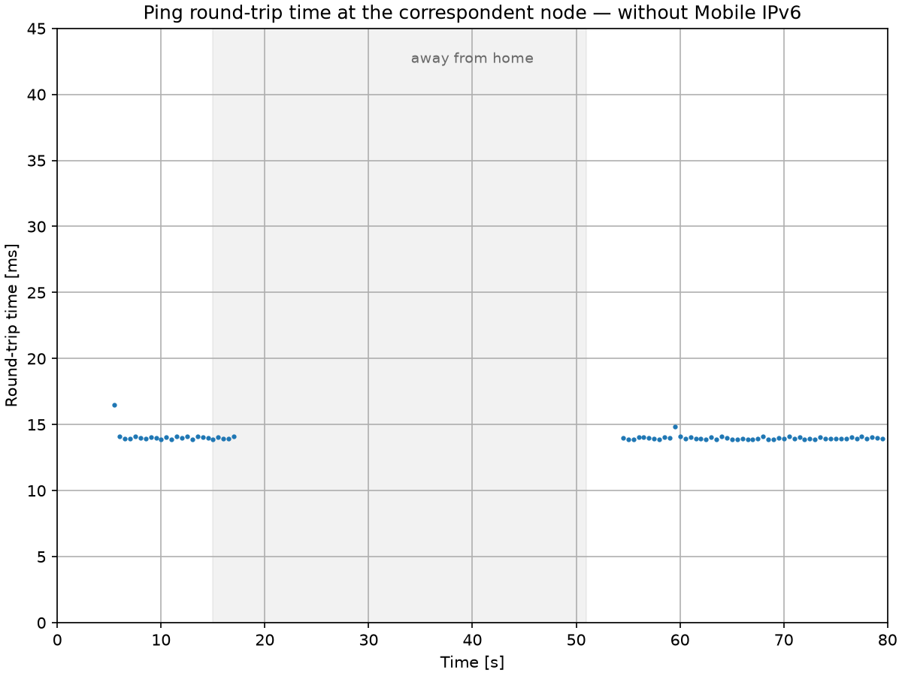
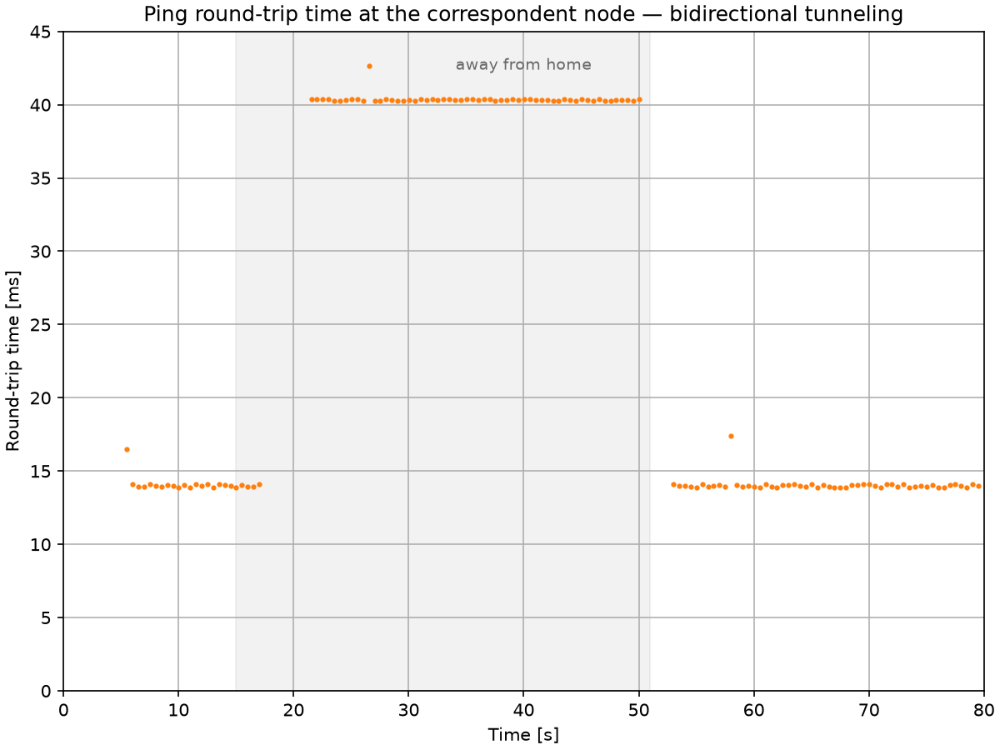
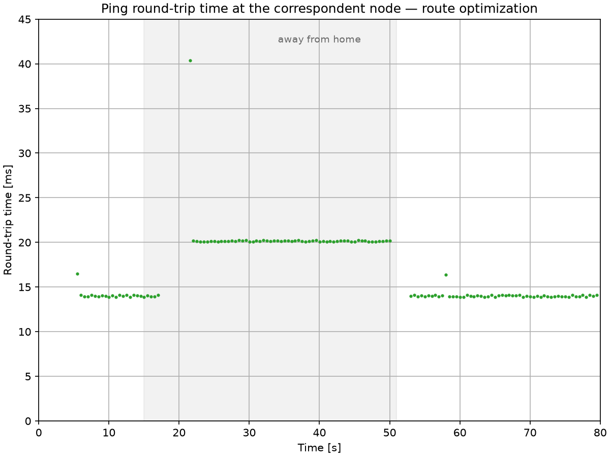
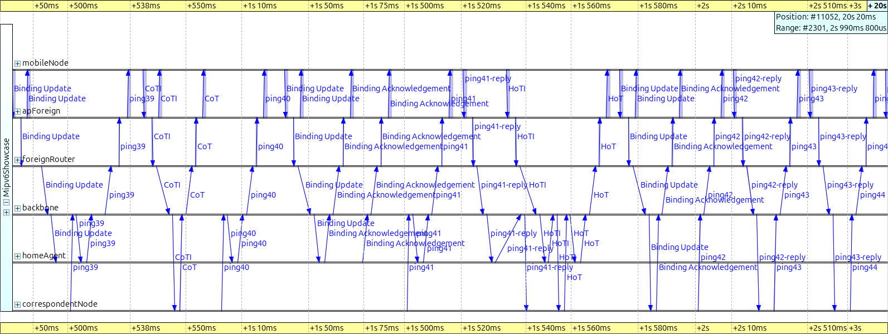
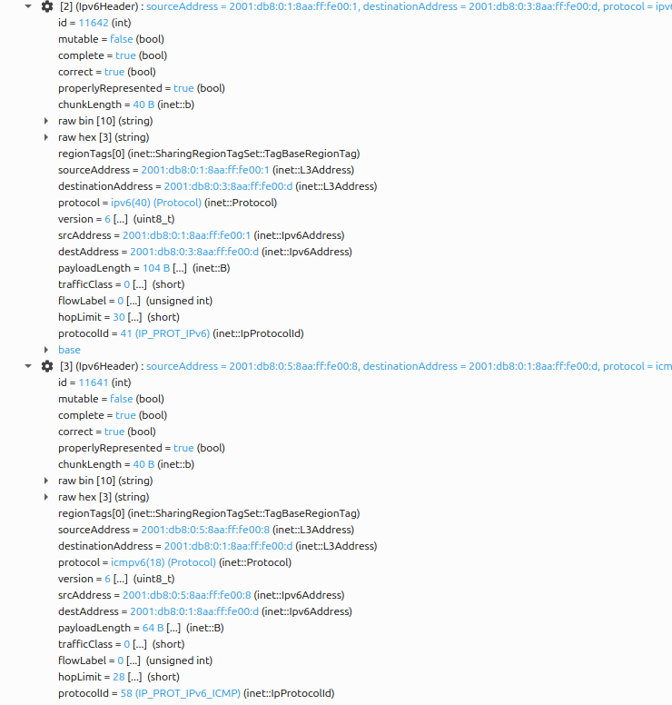
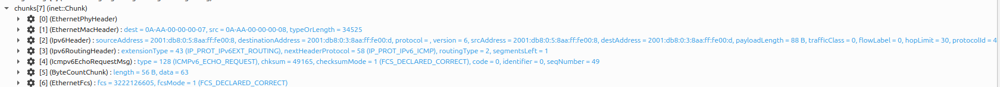
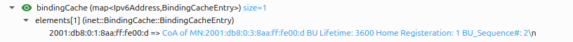

Mobile IPv6
===========

Goals
-----

An IPv6 address plays two roles at once: routers treat it as a *location* (the
prefix says which link the node is on), and transport connections treat it as
an *identity* (a connection is pinned to the address pair). When a device moves
to a network with a different prefix, it gets a new, routable address — but
every open connection breaks, and nobody can reach it at the address they know.

Mobile IPv6 (RFC 3775, later RFC 6275) solves this by splitting the two roles
into two addresses, anchored by a *home agent*. This showcase demonstrates the
whole mechanism in one scenario: a wireless node moves from its home network to
a foreign one and back, while a peer keeps pinging it at its stable address.
Without Mobile IPv6 the session dies; with it, the traffic keeps flowing —
first through a tunnel, then, with route optimization, on the direct path.

| Verified with INET version: ``4.7``
| Source files location: `inet/showcases/general/mipv6 <https://github.com/inet-framework/inet/tree/master/showcases/general/mipv6>`__

About Mobile IPv6
-----------------

Terminology
~~~~~~~~~~~

Mobile IPv6 is dense with abbreviations, so here is the cast of characters:

- **Mobile node (MN)** — the device that moves between networks.
- **Home network** — the network hosting the mobile node's permanent address;
  "home" means an administrative relationship (a campus network, an ISP), not
  a physical place.
- **Home address (HoA)** — the mobile node's stable address, formed from the
  home network's prefix. This is the identity: applications bind to it, and
  peers use it to reach the mobile node, wherever it is.
- **Care-of address (CoA)** — the temporary address the mobile node gets in
  whatever network it is visiting. This is the location; it changes with every
  move.
- **Home agent (HA)** — a function on a router on the home link. It stands in
  for the mobile node while it is away.
- **Correspondent node (CN)** — simply the peer the mobile node talks to: a
  server, another host, anything. It can be anywhere in the internet, and it
  needs Mobile IPv6 support only if it takes part in route optimization.

The mobile node acquires both of its addresses by *stateless address
autoconfiguration* (SLAAC): routers periodically multicast Router
Advertisements carrying the link's prefix (a freshly attached host solicits
one immediately with a Router Solicitation), the host appends an interface
identifier of its own making, and after a short duplicate address detection
(DAD) probe the address is ready — no server involved. This is what makes
mobility work in networks that have never heard of the mobile node: it can
build itself a care-of address anywhere.

What happens on a move
~~~~~~~~~~~~~~~~~~~~~~

When the mobile node (MN) walks out of its home network into a foreign one:

1. **Layer 2 handover** — the wireless interface re-associates with the new
   access point.
2. **Movement detection** — a Router Advertisement on the new link reveals an
   unfamiliar prefix: "I have moved."
3. **Care-of address formation** — normal SLAAC plus duplicate address
   detection on the new link.
4. **Registration** — the mobile node sends a *Binding Update (BU)* to its
   home agent (HA): "my home address is now reachable at this care-of
   address, for this lifetime." The home agent confirms with a *Binding
   Acknowledgement (BAck)*. No security handshake is needed here — the mobile
   node and its home agent trust each other by prior arrangement (the standard
   protects this signaling with an IPsec association set up in advance).
5. **Delivery resumes** — the home agent now intercepts every packet addressed
   to the home address and forwards it to the care-of address inside an
   IPv6-in-IPv6 tunnel. The mobile node sends its own traffic back through the
   same tunnel in reverse.

Bindings are soft state: they expire unless the mobile node refreshes them
with further Binding Updates, so a crashed or vanished mobile node simply ages
out of the home agent's *binding cache* (the table of home address → care-of
address mappings).

Why must the reverse direction also be tunneled, instead of the mobile node
answering the correspondent node directly? Ingress filtering: a packet leaving
the foreign network with a home-network source address looks spoofed and gets
dropped. So base Mobile IPv6 is *bidirectional tunneling* — both directions
detour through the home agent, and the correspondent never learns that its
peer moved.

On the home link itself, the home agent impersonates the absent mobile node:
it answers Neighbor Solicitations for the home address (the IPv6 equivalent of
an ARP request — "the node that *is* this address: report your MAC") with its
own MAC address, so frames for the home address land on it. This is proxy
Neighbor Discovery — the same mechanism an attacker would call address
spoofing, used here with authorization. While the mobile node is at home, the
home agent does nothing at all.

Route optimization
~~~~~~~~~~~~~~~~~~

The tunnel detour costs latency (the path stretches through the home network)
and 40 bytes of outer header per packet. *Route optimization* removes both:
the mobile node registers its binding directly with the correspondent node
(CN), after which packets flow on the direct path in both directions — the
home agent drops out entirely.

The interesting part is security. A forged "I moved, send my traffic here"
would be a session-hijacking primitive, and correspondent and mobile node are
strangers — there is no pre-arranged trust to lean on. Mobile IPv6's answer is
the *return-routability procedure*, which is pure authentication and carries
no routing information at all:

- The mobile node sends two probes to the correspondent node: a *Home Test
  Init (HoTI)* routed through the home-agent tunnel, and a *Care-of Test Init
  (CoTI)* sent directly.
- The correspondent node returns a token to each source: a *Home Test (HoT)*
  via the home agent, and a *Care-of Test (CoT)* on the direct path.
- Only a node reachable at **both** the home address and the care-of address
  collects both tokens, and only their combination yields the key that
  authenticates the *Binding Update* to the correspondent node.

Note the built-in ordering: the Home Test Init needs the home-agent tunnel, so
the home half of the procedure cannot start before the home registration is
complete — the Care-of Test half is free to run immediately. The tokens are
deliberately short-lived (three and a half minutes; the binding they authorize
at a correspondent node lasts at most seven), so long sessions re-run the
procedure periodically; a correspondent can also prompt a refresh with a
*Binding Refresh Request*.

After route optimization, packets carry both addresses: the care-of address
where routers look, and the home address in an extension header — a *type 2
routing header* toward the mobile node, a *Home Address destination option*
from it. The network layer swaps the home address back in at each end, so
transport connections stay pinned to the stable home address and never notice
that the packets took a different path.

Route optimization is optional, per correspondent. A mobile node may prefer
tunneling on purpose: route optimization reveals the care-of address — that
is, the mobile node's current location — to every correspondent, while
tunneling hides it behind the home agent.

When the mobile node returns home, it de-registers: a Binding Update with
lifetime zero deletes the binding at the home agent and at every correspondent
node, the tunnel disappears, and the home agent stops answering for an address
whose owner is back. The mobile node then announces its return on the home
link with an unsolicited Neighbor Advertisement, so its neighbors switch
their caches back to it immediately instead of waiting to re-resolve the
address. Everything collapses to plain IPv6.

A final property worth noticing: only the mobile node, its home agent, and
(optionally) the correspondent nodes know that mobility is happening. The
visited network sees an ordinary host with an ordinary local address; every
router in between forwards ordinary IPv6 packets.

Mobile IPv6 in INET
-------------------

INET implements the mobile node, home agent, and correspondent node roles of
RFC 3775 in the ``Mipv6`` module, an optional submodule of the IPv6 network
layer (enabled by the ``hasMipv6`` parameter of ``Ipv6NetworkLayer``). The
following node types package the three roles:

- ``WirelessHost6`` — a wireless host with Mobile IPv6 in the mobile-node
  role; this is the node that moves.
- ``HomeAgent6`` — an IPv6 router (``Router6``) with the home-agent role
  enabled.
- ``CorrespondentNode6`` — a standard IPv6 host that can take part in route
  optimization.
- ``MobileHost6`` — a wired variant of the mobile node (not used here).

The screenshot below shows the mobile node's IPv6 network layer. Mobile IPv6
is not a separate protocol layer: the ``mipv6`` module sits beside ``ipv6``,
``icmpv6``, and ``neighbourDiscovery`` and implements the mobility signaling,
with two data modules — ``buList`` (the mobile node's record of bindings it
has registered elsewhere) and ``bindingCache`` (bindings this node holds for
others) — beside it. The entire protocol footprint is visible in this one
image:

..
   FIGURE RECIPE (redo via the "omnetpp-mcp-sim" skill)
   type:     canvas
   config:   RouteOptimization   # ../omnetpp.ini
   seed:     default (seed-set=1)
   shows:    Ipv6NetworkLayer interior of mobileNode: mipv6 beside ipv6/icmpv6/
             neighbourDiscovery, plus buList + bindingCache
   anchor:   structural (t=0..12s, any time before handover). If the submodule
             set differs, Ipv6NetworkLayer or the mipv6 integration changed.
   capture:  set_canvas_view zoom=1.0 -> get_canvas_image module_rectangle
             margin=5 on Mipv6Showcase.mobileNode.ipv6; was 968x615. Known
             blemish: routingTable status text overlaps configurator label
             (the module's own layout).
   stamp:    captured 2026-08, INET 4.7

Configuration notes:

- ``useRouteOptimization`` (on the mobile node's ``mipv6`` submodule, default
  ``true``) selects between bidirectional tunneling and route optimization —
  the same scenario runs both ways with this one flag.
- Movement detection does not depend on frequent Router Advertisements: on
  every layer-2 association the IPv6 neighbour discovery module immediately
  sends a Router Solicitation (its ``detectL2Movement`` parameter, default
  ``true``), so the mobile node never waits for a periodic advertisement.
  This scenario advertises every 3–7 s, but that is not what makes detection
  fast — even INET's 200–600 s defaults would detect the move just as
  quickly.
- The mobile node autoconfigures its addresses, so the address configurator
  must leave hosts alone: the network sets ``assignAddressesToHosts = false``
  on the ``Ipv6NetworkConfigurator``, which then assigns addresses and routes
  to routers only. The home agent is recognized from its Router
  Advertisements (via the home-agent flag the standard defines for them),
  which is how the mobile node learns its home agent's address — at home,
  before ever leaving. The standard's remote-discovery mechanisms are not
  modeled, so a mobile node must start the simulation in its home network.

Implementation notes and simplifications, so the simulation is read for what
it is:

- The IPsec protection that RFC 3775 mandates between mobile node and home
  agent is not modeled (standard practice in simulation).
- The return-routability *message exchange* — sequence, paths, sizes, timing,
  and the mobile node's periodic token refresh — is faithful, but the
  cryptographic content is schematic: the tokens are constants rather than
  keyed, nonce-indexed values, and the correspondent never invalidates them.
- The home agent intercepts traffic by virtue of being the home network's
  router; answering Neighbor Solicitations on behalf of the absent mobile
  node (proxy Neighbor Discovery) is not implemented. In this scenario the
  distinction is invisible — no other host lives on the home link — but a
  host on the home link could not reach an away mobile node.
- The home agent delays its first Binding Acknowledgement by one second — a
  stand-in for the duplicate address detection that the standard requires it
  to perform on the home address before answering (a real registration waits
  comparably). Until the acknowledgement lands, the mobile node's reverse
  tunnel is not up, and replies it sends from its home address are dropped by
  its own topological-correctness check — the node refuses to emit a packet
  whose home-address source would look spoofed outside the home network, its
  private version of the ingress filtering discussed earlier — instead of
  being queued or tunneled: one or two extra lost pings at the tail of each
  handover outage. A visible side effect: the mobile node's one-second retransmission
  timer fires just before the delayed acknowledgement arrives, so the home
  registration in this scenario always takes *two* Binding Updates (the later
  correspondent registration completes with one) — and the acknowledgement
  that counts is the second, which is why the binding cache shown later
  records sequence number 2.
- Routers in this network have ICMPv6 Redirect generation disabled
  (``sendRedirects = false``). Traffic intercepted *toward* the mobile node
  never triggers the rule — it is steered into the tunnel before the
  forwarding check. The trigger is the way back: after decapsulating a
  reverse-tunneled reply, the home agent forwards the inner packet out of the
  very interface the tunneled packet arrived on — the textbook Redirect
  condition — and would send a useless Redirect to the mobile node's home
  address on every reply. A real stack attributes decapsulated packets to the
  tunnel interface instead; the flag stands in for that difference.

The Model
---------

The network puts the three Mobile IPv6 locations in three corners: a home
network (``apHome`` + ``homeAgent``), a foreign network (``apForeign`` +
``foreignRouter``), and a correspondent node, all meeting at a backbone
router:

..
   FIGURE RECIPE (redo via the "omnetpp-mcp-sim" skill)
   type:     canvas
   config:   RouteOptimization   # ../omnetpp.ini
   seed:     default (seed-set=1)
   shows:    topology + the mobile node associated at home ("AP: HOME/at home"
             status label, green SLAAC address label on the right)
   anchor:   t=12s: associated, SLAAC done, label shows the home address
             2001:db8:0:1:8aa:ff:fe00:d. If the address differs, the MAC
             assignment order changed -> re-pin destAddr in the ini too.
   capture:  express-run to 12s -> set_canvas_view fit (zoom ~1.106) ->
             get_canvas_image module_rectangle margin=5; was 844x722. A route
             visualizer arrow may still be fading at some capture times;
             capture at ~12.2s (mid ping interval) for a clean shot.
   stamp:    captured 2026-08, INET 4.7

The status text above the mobile node is live: it shows the associated
SSID and the mobility state (at home / away / route-optimized), and the green
label on the right is its current wireless address. Both update as the
simulation runs. Note that the foreign network's router is a plain
``Router6`` — the visited network needs no Mobile IPv6 support at all, just
as promised above.

The WAN link delays are the scenario's one deliberate design choice: 5 ms
between home agent and backbone, 8 ms between foreign router and backbone,
1 ms to the correspondent node. Real mobility spans real distances, and these
delays make each forwarding mode land at a distinct, predictable round-trip
time — the sum of the link delays along its path:

.. literalinclude:: ../Mipv6Showcase.ned
   :start-at: connections:
   :end-at: correspondentNode.ethg
   :language: ned

Predicted round-trip times, counting propagation only (the access LANs'
0.1 µs is negligible, and the 2 Mbps wireless hop adds about 2 ms of
transmission and channel-access overhead on top):

- **at home**: 2 × (1 + 5) = 12 ms
- **tunneled**: 2 × (1 + 5) + 2 × (5 + 8) = 38 ms — every packet crosses the
  backbone twice, once to the home agent and once through the tunnel
- **route-optimized**: 2 × (1 + 8) = 18 ms

Note that the route-optimized value is below anything a path through the home
agent could achieve: even the cheapest conceivable detour — out through the
tunnel (1 + 5 + 5 + 8 = 19 ms) and straight back (8 + 1 = 9 ms) — costs 28 ms
in propagation alone. Measuring 20 ms is proof by arithmetic that the home
agent is out of the loop.

The mobile node's movement has three acts (``movement.xml``): it dwells at
home for 15 s, dashes to the foreign network in 3 s, dwells there for 30 s,
and returns the same way, settling at home for the rest of the 80 s run. The
two access points operate on different wireless channels, and the mobile node
scans both.

Throughout the run, the correspondent node pings the mobile node's *home
address* every 0.5 s — the address is hardcoded in the ini file because it is
the stable identity a peer would know (it is also predictable: the home
prefix plus the interface identifier derived from the mobile node's MAC
address):

.. literalinclude:: ../omnetpp.ini
   :start-at: correspondentNode.numApps
   :end-at: app[0].startTime
   :language: ini

The mobile node itself is a parametric submodule, so one configuration can
swap it for a plain host. The three configurations below differ only in the
mobile node's node type and its route-optimization setting (plus the format
of its status label); everything else — network, movement, traffic — is
identical.

WithoutMipv6 configuration
~~~~~~~~~~~~~~~~~~~~~~~~~~

.. literalinclude:: ../omnetpp.ini
   :start-at: [Config WithoutMipv6]
   :end-before: [Config BidirectionalTunneling]
   :language: ini

The mobile node is an ordinary IPv6 host — ``StandardHost6``, which has no
radio of its own, so the configuration adds the one wireless interface. It
associates with the foreign access point and SLAAC gives it a
perfectly good new address — but nobody sends anything to that address. The
pings keep targeting the old (home) address, which now leads to a network
where nobody answers Neighbor Solicitations for it. Every ping from the
moment it leaves home coverage until it walks back is lost. This is the
problem Mobile IPv6 exists to solve, measured.

BidirectionalTunneling configuration
~~~~~~~~~~~~~~~~~~~~~~~~~~~~~~~~~~~~

.. literalinclude:: ../omnetpp.ini
   :start-at: [Config BidirectionalTunneling]
   :end-before: [Config RouteOptimization]
   :language: ini

The mobile node runs Mobile IPv6 with route optimization switched off — the
base protocol, nothing else. After the handover it registers its care-of
address with the home agent, and the pings resume: into the home network,
intercepted by the home agent, tunneled to the care-of address, answered
through the reverse tunnel. The round-trip time settles on the tunneling
plateau (~40 ms) for the whole stay abroad.

RouteOptimization configuration
~~~~~~~~~~~~~~~~~~~~~~~~~~~~~~~

.. literalinclude:: ../omnetpp.ini
   :start-at: [Config RouteOptimization]
   :language: ini

Route optimization is left at its default (enabled); the config only sets the
status label format. The first tunneled ping that reaches the mobile node
triggers the return-routability procedure with the correspondent node, the
Binding Update installs a binding there, and from the next ping onward the
traffic takes the direct path (~20 ms) — until the return home tears
everything down again.

Results
-------

The round-trip time of every ping tells the whole story. The three
configurations are plotted separately on identical axes, so the phases can be
compared panel by panel; the shaded band marks the interval the mobile node
spends away from its home network.

..
   FIGURE RECIPE (redo via the "inet-showcase-charts" skill)
   type:     chart (matplotlib)
   anf:      Mipv6Showcase.anf   chart "Ping round-trip time (without Mobile IPv6)"
   inputs:   results/WithoutMipv6-#0.vec (re-run the config first)
   shows:    RTT of every ping in the WithoutMipv6 config; the total reachability
             gap while away; "away from home" span shaded 15..51s
   anchor:   axes are pinned (x 0..80s, y 0..45ms) so the three panels compare
             directly -- keep all three identical if any one is redone.
             The gap is structural -- the home address is simply not routable
             on the foreign link.
   export:   opp_charttool imageexport Mipv6Showcase.anf -n "Ping round-trip time (without Mobile IPv6)"
             -f png --dpi 150 -d doc/media   (8x6in -> 1200x900)
   stamp:    captured 2026-08, INET 4.7

**Without Mobile IPv6 the node is unreachable the whole time it is away** —
no replies at all for 37.5 s, resuming only when it re-enters home coverage on
the way back. Its home address means nothing on the foreign link.

..
   FIGURE RECIPE (redo via the "inet-showcase-charts" skill)
   type:     chart (matplotlib)
   anf:      Mipv6Showcase.anf   chart "Ping round-trip time (bidirectional tunneling)"
   inputs:   results/BidirectionalTunneling-#0.vec (re-run the config first)
   shows:    RTT of every ping with route optimization off; the 40 ms tunneled
             plateau while away; "away from home" span shaded 15..51s
   anchor:   axes are pinned (x 0..80s, y 0..45ms) so the three panels compare
             directly -- keep all three identical if any one is redone.
             The 40 ms plateau is link-delay arithmetic (38 ms + wifi) -- if it
             moved, the NED delays or the wifi bitrate changed.
   export:   opp_charttool imageexport Mipv6Showcase.anf -n "Ping round-trip time (bidirectional tunneling)"
             -f png --dpi 150 -d doc/media   (8x6in -> 1200x900)
   stamp:    captured 2026-08, INET 4.7

**Bidirectional tunneling restores reachability, at the cost of a detour.**
After a ~4.5 s outage — scanning, association, movement detection, duplicate
address detection on the new link, and the registration with its one-second
acknowledgement delay from the implementation notes — replies resume on the
40 ms plateau and stay there, every packet taking the long way through the home agent.

..
   FIGURE RECIPE (redo via the "inet-showcase-charts" skill)
   type:     chart (matplotlib)
   anf:      Mipv6Showcase.anf   chart "Ping round-trip time (route optimization)"
   inputs:   results/RouteOptimization-#0.vec (re-run the config first)
   shows:    RTT of every ping with route optimization on; one 40 ms tunneled
             reply, then the 20 ms direct path; span shaded 15..51s
   anchor:   axes are pinned (x 0..80s, y 0..45ms) so the three panels compare
             directly -- keep all three identical if any one is redone.
             The 20 ms plateau is link-delay arithmetic (18 ms + wifi); the lone
             40 ms point at t=21.5s is the last pre-optimization reply.
   export:   opp_charttool imageexport Mipv6Showcase.anf -n "Ping round-trip time (route optimization)"
             -f png --dpi 150 -d doc/media   (8x6in -> 1200x900)
   stamp:    captured 2026-08, INET 4.7

**Route optimization removes the detour after a single tunneled packet.** The
same outage, then **exactly one reply at 40 ms** — the single ping answered
through the tunnel before route optimization completed — and the direct path
at 20 ms from there on.

Up to the handover the three runs are identical: while the node is at home
Mobile IPv6 has nothing to do, so the three configurations are the same
simulation, sample for sample, on the 14 ms baseline. Plotted on one pair of
axes the three curves coincided exactly and hid one another, which is why they
are shown separately here.

On the way back (t≈50 s) a shorter outage covers re-association and
de-registration, and all three configurations converge on the 14 ms baseline
again — for the plain host, simply because its old address works again at
home.

Details worth noticing rather than worrying about: the very first reply
arrives only at t≈5.5 s — and a couple of milliseconds high — because both
hosts spend the first seconds on SLAAC and neighbor resolution after boot;
the few isolated elevated dots (the 42.7 ms one at t≈26.5 s, and one per run
near the end, t≈58–59.5 s) are single 802.11 retransmissions, each worth a
couple of extra milliseconds; and after
the return, the Mobile IPv6 runs resume 1.5 s earlier than the plain host
(t=53.0 vs t=54.5) — de-registration ends with that unsolicited Neighbor
Advertisement announcing the return, while the plain host is only
re-discovered when the router next resolves its address.

The handover, live
~~~~~~~~~~~~~~~~~~

The video below shows the outbound handover in the ``RouteOptimization``
configuration (t = 13.2 s to 23.5 s). The colored polylines are drawn by
INET's network-route visualizer: each traces the path a ping actually took.
Watch the sequence: the home path (correspondent → backbone → home agent →
mobile node) while at home; the dash to the foreign network; the registration;
then a brief moment of tunneled traffic taking the dog-leg through the home
agent — and finally the direct path through the foreign router, with the home
agent out of the loop. The status label steps from "at home" through a brief
"away (via home agent)" to "away (route-optimized, 1 CN)", and the address
label changes to the care-of address the moment SLAAC completes in the
foreign network.

.. video:: media/handover.mp4
   :align: center

..
   VIDEO RECIPE (redo via the "video-recording" skill)
   config:   RouteOptimization
   seed:     default (seed-set=1)
   shows:    home path arrow -> dash -> handover -> one tunneled dog-leg ->
             direct path; status + address labels updating live
   anchors:  registration BU at t~20.04; the HA's BAck is delayed ~1s (home-
             link DAD stand-in), binding active ~21.09; first tunneled reply
             ~21.54; RO complete (BU to CN) ~21.58; direct pings from 22.0.
             If these move, timing/params changed -> re-derive window.
   window:   express to 13.2s -> step 1 event -> record to 23.5s. No
             realTime-fade channel visualizer -> no settle wait needed.
   anim:     playback_speed=1, min_animation_speed=0.1 (the model publishes
             no animation speed; without the floor it records one frame per
             event). Qtenv built-in message animation OFF for the recording
             (private .qtenvrc copy with animation_enabled=false) -- the
             wireless signal animation draws misleading bars between the APs.
   capture:  fps=2, crop_area=with_padding; 206 frames; crop was 854:732:911:96
   encode:   ffmpeg -r 10 -vcodec libx264 -pix_fmt yuv420p (pad to even dims)
   post:     none
   stamp:    recorded 2026-08, INET 4.7

The signaling, message by message
~~~~~~~~~~~~~~~~~~~~~~~~~~~~~~~~~

The sequence chart below shows the same handover on the eventlog level,
filtered to the mobility signaling and the pings (all 802.11 management and
neighbor discovery traffic is hidden). Time flows left to right on a
nonlinear axis, with tick labels showing offsets from the window start
(t = 20.02 s); the six lifelines are six of the network's seven nodes —
``apHome`` plays no part in this window and is omitted. Each hop of a
message is drawn and labelled as its own arrow, so one packet appears as a
chain of same-named arrows across the lifelines it crosses.

..
   FIGURE RECIPE (redo via the "omnetpp-ide-mcp" skill)
   type:     seqchart
   config:   RouteOptimization, re-run with --record-eventlog=true
             --eventlog-recording-intervals=19s..23.5s,52s..53.5s
   seed:     default (seed-set=1)
   source:   results/RouteOptimization-#0.elog (copy into an IDE-workspace
             project dir first if the worktree is not a workspace project)
   axes:     mobileNode, apForeign, foreignRouter, backbone, homeAgent,
             correspondentNode (this top-to-bottom order; apForeign is the
             wireless transit -- removing it hides the arrows)
   filter:   message_names: Binding Update, Binding Acknowledgement, HoTI,
             CoTI, HoT, CoT, ping*
   anchor:   BU at t=20.0437 (event #11078); CoTI ~20.54; second BU ~21.04;
             ping41+reply ~21.5; HoTI 21.56; BU-to-CN 21.578; direct pings
             from 22.0. goto_event first -- the disjoint recording intervals
             confuse a bare zoom_to_simulation_time_range.
   capture:  NONLINEAR timeline, NETWORK_COMMUNICATION mode, zoom to
             20.02..22.06, window 1920x1000; was 1593x599
   stamp:    captured 2026-08, INET 4.7

Reading it left to right:

- **Registration, in two acts**: at the left edge, the first *Binding Update*
  descends from the mobile node (top lifeline) through the foreign network to
  the home agent. Its acknowledgement is nowhere near it: the home agent
  holds the *Binding Acknowledgement* back for one second (the
  duplicate-address-detection stand-in from the implementation notes), so the
  mobile node's retransmission timer fires first — the *second* Binding
  Update — and the two *Binding Acknowledgement* arrows appear only after
  it, between ``ping40`` and ``ping41``. The first acknowledgement is
  discarded for its stale sequence number; the second activates the binding.
- **Tunneled pings, dropped replies**: ``ping39`` and ``ping40`` arrive via
  the home-agent dog-leg — every early arrow visits the ``homeAgent``
  lifeline — but no reply comes back: until the binding is active, the
  mobile node discards its own home-address-sourced replies (the same
  implementation note). ``ping41`` is the first with a reply, still through
  the tunnel.
- **Return routability**: the *Care-of Test Init (CoTI)* and *Care-of Test
  (CoT)* travel directly between mobile node and correspondent right after
  the first tunneled ping arrives — a full second *before* the *Home Test
  Init (HoTI)* manages to leave. The Home Test Init needs the reverse tunnel:
  its first copy is lost along with the early replies, and it is its
  retransmission that goes through. The *Home Test (HoT)* returns via the
  home agent.
- **Route optimization completes**: the *Binding Update* goes straight to the
  correspondent node and is acknowledged (INET requests an acknowledgement on
  every Binding Update; the standard makes it optional for correspondents).
  From ``ping42`` onward the arrows run directly between correspondent and
  mobile node — no arrow bends at the ``homeAgent`` lifeline anymore (later
  arrows merely cross its axis on the way to the correspondent), which is
  route optimization in one glance.

Inside the packets
~~~~~~~~~~~~~~~~~~

The two forwarding modes are distinguishable inside a single packet. Below is
the parsed structure of a tunneled ping request captured on the home
agent's backbone link (Qtenv's packet inspector): **two stacked IPv6
headers** — the outer one from the home agent (``2001:db8:0:1:...:1``) to the
care-of address (``2001:db8:0:3:...:d``) with ``protocol = ipv6``, carrying
the untouched inner packet from the correspondent to the *home* address, 40
bytes of overhead in all. Notice that the two destination addresses share
their interface identifier (``8aa:ff:fe00:d``) under different prefixes —
the identity/location split, visible inside one packet. (The numbers after
the protocol names in the figure, like ``ipv6(40)``, are INET's internal
protocol identifiers, not the IANA protocol numbers; fields such as
``extensionType = 43`` are genuine wire values.)

..
   FIGURE RECIPE (redo via the "omnetpp-mcp-sim" skill)
   type:     inspector
   config:   BidirectionalTunneling
   seed:     default (seed-set=1)
   shows:    IPv6-in-IPv6: chunks list with two Ipv6Header rows (outer
             HA->CoA protocol=ipv6(40); inner CN->HoA protocol=icmpv6)
   target:   express to 24.4s, fast to 25.65s -> list_logged_packets at
             homeAgent -> the 170B ping -> object inspector, expand depth 4
   anchor:   tunneled pings are 170B on the HA-backbone wire (130B + 40B
             outer header) throughout the away phase
   capture:  get_inspector_screenshot 1750x2800 -> crop the chunks[7] band
             (was x60-1740, y1305-1455)
   stamp:    captured 2026-08, INET 4.7

The same ping in the route-optimized mode, captured at the correspondent
node: **one** IPv6 header, addressed to the care-of address directly, followed
by a *type 2 routing header* (``routingType = 2, segmentsLeft = 1``) whose
address field — one level deeper than the crop shows — carries the home
address: 24 bytes instead of 40, and no detour. (Replies in the other
direction carry the home address in a *Home Address destination option*
instead; not shown.)

..
   FIGURE RECIPE (redo via the "omnetpp-mcp-sim" skill)
   type:     inspector
   config:   RouteOptimization
   seed:     default (seed-set=1)
   shows:    direct-path ping: single Ipv6Header (CN->CoA) + Ipv6RoutingHeader
             routingType=2 row
   target:   express to 24.4s, fast to 25.65s -> list_logged_packets at
             correspondentNode -> the 154B ping -> object inspector, depth 4
   anchor:   route-optimized pings are 154B on the CN wire (130B + 24B
             type-2 routing header) during the away phase
   capture:  get_inspector_screenshot 1750x2800 -> crop chunks band
             (was x60-1740, y1213-1360)
   stamp:    captured 2026-08, INET 4.7

Meanwhile the home agent's binding cache holds exactly one entry — the
mapping this whole protocol exists to maintain. The 3600 s lifetime is the
home-registration default (``maxHaBindingLifeTime``) — unlike the seven-
minute correspondent bindings, home bindings are long-lived, refreshed well
before expiry. And the sequence number 2 is the two-act registration again:
the acknowledgement that activated this binding answered the retransmitted,
second Binding Update:

..
   FIGURE RECIPE (redo via the "omnetpp-mcp-sim" skill)
   type:     inspector
   config:   BidirectionalTunneling (RouteOptimization looks the same)
   seed:     default (seed-set=1)
   shows:    homeAgent.ipv6.bindingCache: HoA 2001:db8:0:1:...:d => CoA
             2001:db8:0:3:...:d, lifetime 3600, home registration
   target:   open_inspector (object) on Mipv6Showcase.homeAgent.ipv6.
             bindingCache at t~25s, expand depth 4
   anchor:   exactly 1 entry while the mobile node is away; 0 after ~53s
   capture:  get_inspector_screenshot 1300x900 -> crop map rows
             (was x14-830, y370-430)
   stamp:    captured 2026-08, INET 4.7

Coming home
~~~~~~~~~~~

The second video shows the return (t = 47.5 s to 56 s), still in the
``RouteOptimization`` configuration: direct-path pings, the walk home, and —
right after re-association — the de-registration Binding Updates (lifetime
zero) to the home agent and the correspondent node. The status label returns
to "at home", the address label to the home address, and the pings to the
14 ms home path. The binding cache empties; Mobile IPv6 has left the
building.

.. video:: media/returnhome.mp4
   :align: center

..
   VIDEO RECIPE (redo via the "video-recording" skill)
   config:   RouteOptimization
   seed:     default (seed-set=1)
   shows:    direct path -> dash home -> re-association -> lifetime-0 BUs
             (~52.8s) -> home path again; labels revert
   anchors:  de-registration BUs (lifetime 0) to HA and CN at t~52.49, BAcks
             ~52.50; first home-path reply ~53.01
   window:   express to 47.5s -> step 1 event -> record to 56s
   anim:     same as handover.mp4 (playback_speed=1, min_animation_speed=0.1,
             built-in animation off via private .qtenvrc)
   capture:  fps=2, crop_area=with_padding; 170 frames (numbering continued
             at 206 -> ffmpeg -start_number 206); crop was 854:732:911:96
   encode:   ffmpeg -r 10 -start_number 206 -vcodec libx264 -pix_fmt yuv420p
   post:     none
   stamp:    recorded 2026-08, INET 4.7

Sources: :download:`omnetpp.ini <../omnetpp.ini>`,
:download:`Mipv6Showcase.ned <../Mipv6Showcase.ned>`,
:download:`movement.xml <../movement.xml>`

Try It Yourself
---------------

If you already have INET and OMNeT++ installed, start the IDE by typing
``omnetpp``, import the INET project into the IDE, navigate to the
``inet/showcases/general/mipv6`` folder in the `Project Explorer`, and double-click the
``omnetpp.ini`` file to open it. Select a configuration and press **Run**.

If you don't have INET and OMNeT++ installed, you can quickly set them up
using `opp_env <https://omnetpp.org/opp_env>`__, and run the simulation
interactively. Ensure that ``opp_env`` is installed on your system, then
execute:

.. code-block:: bash

    $ opp_env run inet-4.7 --init -w inet-workspace --install --build-modes=release --chdir \
       -c 'cd inet-4.7.*/showcases/general/mipv6 && inet'

This command creates an ``inet-workspace`` directory, installs the appropriate
versions of INET and OMNeT++ within it, and launches the ``inet`` command in the
showcase directory for interactive simulation.

Alternatively, for a more hands-on experience, you can first set up the
workspace and then open an interactive shell:

.. code-block:: bash

    $ opp_env install --init -w inet-workspace --build-modes=release inet-4.7
    $ cd inet-workspace
    $ opp_env shell

Inside the shell, start the IDE by typing ``omnetpp``, import the INET project,
then start exploring.

Discussion
----------

Use `this page <https://github.com/inet-framework/inet-showcases/issues/TODO>`__ in
the GitHub issue tracker for commenting on this showcase.

.. TODO: create the tracker issue for this showcase and replace the link above
