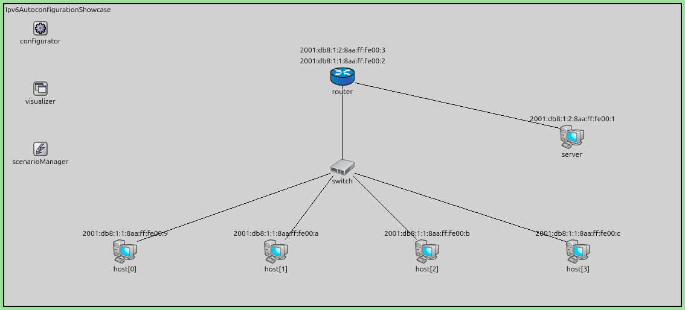
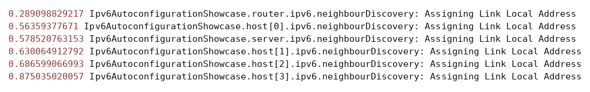
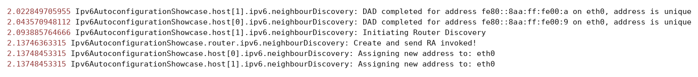
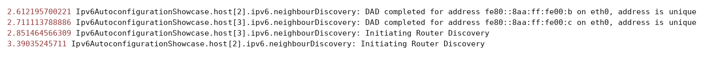
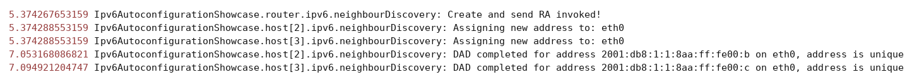
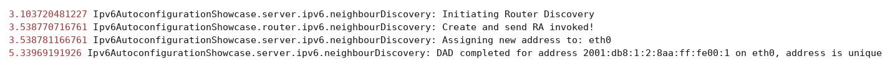
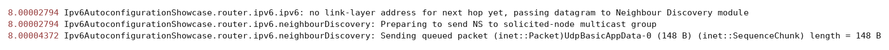
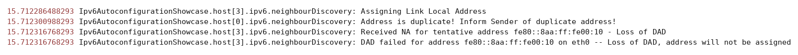
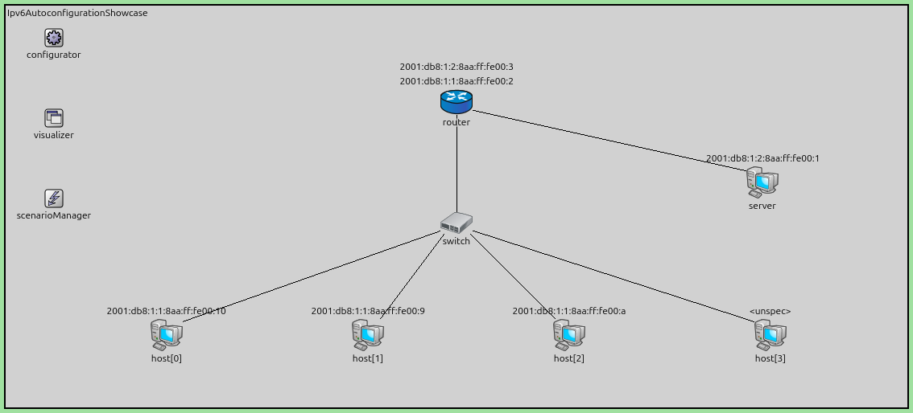

IPv6 Address Autoconfiguration
==============================

Goals
-----

A host that joins a network cannot send or receive IP packets until it has an IP
address. In IPv4 it cannot produce one by itself: either an administrator types an
address into the host's configuration, or a DHCP server leases it one. Both methods
need something else to be in place first — a person who knows the addressing plan of
that subnet, or a running DHCP server holding a pool of free addresses.

IPv6 adds a third method that needs neither. A host derives its own addresses from
two pieces of information it can already obtain: its MAC address, and a prefix that
the local router announces to everyone on the link. This is called Stateless Address
Autoconfiguration (SLAAC). No server keeps any state, and nothing is configured by
hand.

Deriving an address locally removes the central authority that guaranteed it was
unique, so two hosts can end up with the same address. IPv6 guards against this with
Duplicate Address Detection (DAD): before a host uses an address, it asks the other
nodes on the link whether one of them already holds it.

This showcase demonstrates both mechanisms, Stateless Address Autoconfiguration
(SLAAC) and Duplicate Address Detection (DAD). In the first simulation, four hosts and
a server start with no addresses and end up holding a link-local address, a global
address and a default router each, and then exchange traffic. In the second, a host
carrying a duplicated MAC address joins the same network, and Duplicate Address
Detection refuses the address it tried to claim.

| Verified with INET version: ``4.7``
| Source files location: `inet/showcases/ipv6/autoconfiguration <https://github.com/inet-framework/inet/tree/master/showcases/ipv6/autoconfiguration>`__

About IPv6 Address Autoconfiguration
------------------------------------

Stateless Address Autoconfiguration (SLAAC) is part of a larger protocol called
Neighbor Discovery (ND), defined in RFC 4861. Address autoconfiguration itself is
defined in RFC 4862.

The interface identifier
~~~~~~~~~~~~~~~~~~~~~~~~

Every IPv6 address is 128 bits. On an Ethernet link the lower 64 bits are the
*interface identifier*, which a host derives from the 48-bit MAC address of its
network interface by a fixed rule called Modified EUI-64. The rule inserts two bytes
in the middle of the MAC address and flips one bit; what matters here is only that
the identifier follows from the MAC address alone. ``host[0]``, whose MAC address is
``0A-AA-00-00-00-09``, ends up with the identifier ``8aa:ff:fe00:9``, which is how it
appears in every figure and log excerpt below.

Addresses are printed with the leading zeros of each 16-bit group dropped, and one
run of all-zero groups replaced by ``::``. That host's link-local address is
therefore written ``fe80::8aa:ff:fe00:9``.

Two hosts with different MAC addresses therefore produce different interface
identifiers. This is what makes autoconfiguration work without a server: the host
already owns a value that is supposed to be unique on the link. Throughout this
page, *the link* means one Ethernet broadcast domain — everything reachable
without passing through a router, which in IPv4 terms is one subnet.

The link-local address
~~~~~~~~~~~~~~~~~~~~~~

The first address a host builds is a *link-local address*. It combines the fixed
prefix ``fe80::/64`` with the interface identifier. A link-local address works
only on the local link, and routers never forward packets that carry one. Its
purpose is to let the host exchange packets with its neighbors and with its router
before it has a routable address.

Router discovery
~~~~~~~~~~~~~~~~

To build a routable address, the host needs the prefix in use on the link. Hosts
that have already configured themselves hold that prefix too, but Neighbor Discovery
gives them no way to pass it on: a host learns the prefix only from a router, and only
a router announces it. Two messages are involved:

- A **Router Solicitation** is sent by a host that wants the prefix now. It goes
  to the all-routers multicast address ``ff02::2``, so only routers process it.
- A **Router Advertisement** is sent by a router. It goes to the all-nodes
  multicast address ``ff02::1``. Routers send Router Advertisements periodically
  on their own, and also in answer to a Router Solicitation.

A host does not have to wait for the next periodic Router Advertisement. Once its
link-local address has passed its check, it waits a random time of up to one second
— so that hosts starting together do not all solicit at the same instant — and then
sends a Router Solicitation. If no router answers after three attempts, four seconds
apart, the host concludes about nine seconds after the first attempt that there is no
router on the link. It keeps its link-local address and can still exchange packets
with neighbors on the same link, but it has no global address and can reach nothing
beyond the link. It does not stop listening, though: a Router Advertisement that
arrives later is still processed, and the host configures itself then.

The standard also allows a router to answer a solicitation with a Router
Advertisement addressed to the soliciting host alone. INET always sends it to the
all-nodes multicast address, which is what lets one answer serve several hosts in
the results below.

A router must not flood the link with Router Advertisements. Each advertising
interface keeps its own record of when it last sent one, and defers a solicited
Router Advertisement to at least three seconds after that, plus a random delay of
up to half a second. If an advertisement is already scheduled to go out no later
than the newly computed time, the router schedules nothing: the pending
advertisement will serve the new solicitation as well.

Two consequences matter for reading the results. A router with two interfaces runs
two independent timers, so an advertisement on one link says nothing about the
timing on the other. And because each deferral carries its own random delay, the
order in which solicitations arrive does not decide the order in which they are
answered.

The Prefix Information option
~~~~~~~~~~~~~~~~~~~~~~~~~~~~~

A Router Advertisement carries a *Prefix Information option* for each prefix on
the link. The two fields this showcase depends on are the prefix itself, which is
64 bits long for autoconfiguration, and the *autonomous* flag, which tells hosts
they may build an address from this prefix. The option also carries an *on-link*
flag, and two different lifetimes: the *preferred lifetime*, after which the
address should no longer be used to start new communication, and the longer *valid
lifetime*, after which the address stops existing. Neither simulation here runs long
enough for either lifetime to expire.

A host that receives a Prefix Information option with the autonomous flag set
combines the prefix with its own interface identifier. The result is its global
address.

Duplicate Address Detection
~~~~~~~~~~~~~~~~~~~~~~~~~~~

Two hosts that derive the same address both treat it as theirs. Their neighbors
cannot tell the two apart: a neighbor records one link-layer address for that IPv6
address, so packets meant for one host may be delivered to the other, and which host
receives them can change as each of the two answers for the address in turn. Neither
host can be reached reliably. Duplicate Address Detection (DAD) catches this before
either of them starts using the address.

A newly derived address is *tentative*. The host must not use a tentative address as
the source address of ordinary data packets. First it runs Duplicate Address
Detection (DAD).

The host sends a **Neighbor Solicitation** that names the tentative address as its
target. The source address of this message is the unspecified address ``::``,
because the host has no address it is allowed to use yet. Two answers mean
failure:

- another host answers with a **Neighbor Advertisement**, which means it already
  holds the address;
- another host sends a Neighbor Solicitation for the same target, which means it
  is testing the same address at the same time.

Either way, the address is refused and is never assigned. Failure is therefore
immediate: it takes one round trip on the link. Success, by contrast, can only be
concluded from silence, so the host has to wait out a timer before the address
becomes usable.

The solicited-node multicast address
~~~~~~~~~~~~~~~~~~~~~~~~~~~~~~~~~~~~

A Neighbor Solicitation is not broadcast. It is sent to the *solicited-node
multicast address* of the target: the prefix ``ff02::1:ff00:0/104`` with the low 24
bits of the target address filling the remainder. A host testing
``fe80::8aa:ff:fe00:9`` therefore sends to ``ff02::1:ff00:9``, which on Ethernet
maps to the multicast MAC address ``33-33-FF-00-00-09``. IPv4 Address Resolution
Protocol (ARP) instead broadcasts, and every node on the link has to inspect the
packet. On real hardware the network card of an uninvolved node rejects the
multicast frame without waking the processor.

The order of events
~~~~~~~~~~~~~~~~~~~

Putting the pieces together, a host that joins a link performs these steps:

1. Build the link-local address from the interface identifier.
2. Run Duplicate Address Detection (DAD) on the link-local address.
3. Send a Router Solicitation.
4. Receive a Router Advertisement and read its Prefix Information option.
5. Build the global address from the prefix and the interface identifier.
6. Run Duplicate Address Detection (DAD) on the global address.

Each address is therefore checked separately, and a host runs Duplicate Address
Detection twice before it holds both addresses.

Two points about this ordering are specific to INET rather than required by the
standard. INET waits for step 2 to finish before starting step 3, while RFC 4861
allows a host to send its Router Solicitation earlier, from the unspecified source
address, without waiting for the check to pass. And while a host is still in step 2
it ignores any Router Advertisement that arrives. Both have a visible effect in the
results below: a host that is still checking its link-local address when an
advertisement passes by does not use it, and has to ask for one of its own
afterwards.

IPv6 Address Autoconfiguration in INET
--------------------------------------

Node types
~~~~~~~~~~

The showcase uses three node types. :ned:`StandardHost6` is a host with an IPv6
network layer and IPv4 disabled. :ned:`Router6` is the same arrangement for a
router; it forwards packets and sends Router Advertisements.
:ned:`EthernetSwitch` is a layer-2 switch, so all nodes attached to it share one
link and one prefix.

Leaving the addresses to the hosts
~~~~~~~~~~~~~~~~~~~~~~~~~~~~~~~~~~

By default, INET's :ned:`Ipv6NetworkConfigurator` assigns a global address to
every interface in the network before the simulation starts. That would leave
Stateless Address Autoconfiguration (SLAAC) with nothing to do.

Setting :par:`assignAddressesToHosts` to ``false`` changes this. The configurator
then addresses only router interfaces, and sets up the prefixes those interfaces
advertise. Host interfaces are left without addresses, so every host address seen
in this showcase is one the host worked out for itself. The router is the
exception: its global addresses come from the configurator, and only its link-local
addresses are built and checked by the router itself.

The parameter withholds *addresses* from hosts, not routes: the configurator still
installs an on-link route and a default route in every host before the run, so a model
built on this pattern should not assume the hosts learned their routing table from the
protocol.

The prefixes are chosen in an XML configuration:

.. literalinclude:: ../configurator.xml
   :language: xml

Each link gets its own ``/64`` prefix, which Stateless Address Autoconfiguration
(SLAAC) requires. The ``among`` attribute names the nodes that share a link. The
switch is not named, because it works at layer 2 and has no IPv6 address of its
own. The same XML configuration can override the advertised lifetimes, the Router
Advertisement intervals, the Prefix Information flags and the number of Duplicate
Address Detection probes per interface. This showcase keeps the defaults: one
Duplicate Address Detection probe per address, a valid lifetime of 30 days, a
preferred lifetime of 7 days, and both Prefix Information flags set.

Neighbor Discovery parameters
~~~~~~~~~~~~~~~~~~~~~~~~~~~~~

The :ned:`Ipv6NeighbourDiscovery` module inside each node's network layer
implements router discovery, Stateless Address Autoconfiguration (SLAAC) and
Duplicate Address Detection (DAD). The parameters that shape the timings seen in
the results are:

- :par:`dupAddrDetectTransmits` — how many Neighbor Solicitations to send for
  Duplicate Address Detection (DAD), one by default. Setting it to ``0`` skips the
  probing entirely, and INET then counts a completed check without a started one.
- :par:`retransTimer` — the interval between Duplicate Address Detection probes,
  one second by default, and therefore also the wait after the last probe. INET adds
  a random delay of up to one more second to the first of those intervals, so a
  successful check with the default of one probe takes between one and two seconds.
  Note that INET truncates this parameter to whole seconds, so a value below one
  second becomes zero.
- The delay before a host sends its first Router Solicitation, once its link-local
  address is accepted, is a further random value of up to one second. It is not a
  parameter, and it is the reason the gap between a host's completed check and its
  Router Solicitation differs from host to host in the results below.
- :par:`minIntervalBetweenRAs` and :par:`maxIntervalBetweenRAs` — how often a
  router sends unsolicited Router Advertisements, 200 and 600 seconds by default.
  Both are far longer than the simulations here, so no unsolicited Router
  Advertisement is ever sent; every one seen below answers a Router Solicitation.
  See the limitations below for why a real router would have advertised sooner.
- :par:`hostBootupTime` and :par:`routerBootupTime` — when a node assigns its
  link-local address. Both are random: ``uniform(0.4s, 1s)`` for hosts and
  ``uniform(0s, 0.3s)`` for routers, so a router starts before the hosts it serves.
  The randomness is why identically configured hosts do not start together in the
  results below.

The module records three statistics, as both counts in the ``.sca`` file and
vectors in the ``.vec`` file: ``startDad`` counts the Duplicate Address Detection
runs a node begins, ``dadCompleted`` counts those that succeed, and ``dadFailed``
counts those that find a duplicate.

Seeing the addresses appear
~~~~~~~~~~~~~~~~~~~~~~~~~~~

:ned:`InterfaceTableVisualizer` writes an interface's IPv6 address next to its
node on the canvas. The ``format = "%a"`` setting selects one address per
interface: the *preferred* one, which is the address the node would use to reach
an off-link destination. A host therefore shows its link-local address first, and
that label is then **replaced** by the global address once the host has one. The
figures in this page show the end state, so the link-local addresses are no longer
visible in them; the video shows the change happening.

What INET does not model
~~~~~~~~~~~~~~~~~~~~~~~~

Four limitations of the current implementation bound what this showcase can claim:

- INET currently has no DHCPv6 implementation. A Router Advertisement can carry a
  *Managed* flag, which tells hosts to obtain addresses from a DHCPv6 server instead.
  INET's router sends the flag, but its hosts never read it, so setting it does not
  suppress Stateless Address Autoconfiguration (SLAAC). SLAAC is the only way a host
  obtains an address here, whatever the flag says.
- The link-layer multicast filtering described above is not modelled. INET's
  Ethernet interface accepts every multicast frame, and the address check happens
  one layer up, in the IPv6 module. Uninvolved nodes therefore do receive and
  examine a Neighbor Solicitation addressed to someone else's solicited-node
  multicast address, which real hardware would have discarded. The protocol
  behaviour is right; the saving in receiver effort is not visible in the model.
- Temporary privacy addresses are not implemented. Every address is derived from
  the MAC address, so addresses are stable and predictable. That is what makes the
  duplicate-address simulation below possible; real hosts often use randomized
  identifiers instead, precisely so that their addresses cannot be traced back to
  their hardware.
- The lifetimes of an address that is already configured are not refreshed by
  later Router Advertisements. Lifetime expiry is therefore not demonstrated, and
  both simulations are kept well short of any lifetime.
- A router that has just started advertising is supposed to send its first few
  Router Advertisements quickly — up to three of them, no more than 16 seconds
  apart — before settling into the slow periodic schedule. INET goes straight to the
  slow schedule. This is why every Router Advertisement in the results below was
  triggered by a Router Solicitation: a conformant router would have advertised
  within the first 16 seconds, and most of these hosts would never have needed to
  ask.

The Model
---------

All simulations use the following network:

.. FIGURE RECIPE: Qtenv + MCP server on the Autoconfiguration config;
   run_simulation {"time_limit":"8s"} then get_canvas_image
   {"area":"module_rectangle","margin":5}. Determinism self-check: host[0] must be
   labelled 2001:db8:1:1:8aa:ff:fe00:9 and the server 2001:db8:1:2:8aa:ff:fe00:1.

Four hosts and a router are attached to a switch, so they share one link and one
prefix. A server is attached to the router over a separate link, which therefore
has a different prefix. The ``configurator`` sets up the router's addresses and
advertised prefixes, the ``visualizer`` displays interface addresses, and the
``scenarioManager`` starts a node during the second simulation.

Every host address in the figure was built by the host itself. The four hosts
share the prefix ``2001:db8:1:1::/64``, while the server, being on the other link,
uses ``2001:db8:1:2::/64``. That difference is what shows the second prefix in the
XML configuration is really being advertised. The router's two global addresses come
from the configurator, as described above.

Each interface in the figure carries two addresses, a link-local one and a global
one, but the label shows only the preferred address, which is the global one.

The interface identifiers run ``:1``, ``:2``, ``:3``, then jump to ``:9`` through
``:c``. Nothing is missing: the switch's own ports took the MAC addresses in
between, and the switch has no IPv6 address to display.

The general configuration is:

.. literalinclude:: ../omnetpp.ini
   :start-at: [General]
   :end-before: [Config Autoconfiguration]
   :language: ini

The ``networkConfiguratorModule`` setting points each node's own IPv6 configurator
submodule at the network-level :ned:`Ipv6NetworkConfigurator`, so that the two agree
on which addresses and prefixes to use.

Autoconfiguration Configuration
~~~~~~~~~~~~~~~~~~~~~~~~~~~~~~~

.. literalinclude:: ../omnetpp.ini
   :start-at: [Config Autoconfiguration]
   :end-before: [Config DuplicateAddress]
   :language: ini

No host is given an address; the addresses are the result. The only other thing the
configuration does is send four UDP packets from ``host[0]`` to the server, starting
at 8 s, once every node has finished configuring itself. They are there to show that
the self-assigned addresses actually carry traffic.

DuplicateAddress Configuration
~~~~~~~~~~~~~~~~~~~~~~~~~~~~~~

.. literalinclude:: ../omnetpp.ini
   :start-at: [Config DuplicateAddress]
   :language: ini

This configuration gives ``host[0]`` and ``host[3]`` the same MAC address. Both
therefore derive the same interface identifier, and both would build the same
link-local address ``fe80::8aa:ff:fe00:10``.

Setting :par:`hasStatus` to ``true`` gives every node a status submodule, without
which the ``scenarioManager`` cannot start or stop a node during the run. ``host[3]`` begins in
the ``DOWN`` state, and the ``scenarioManager`` starts it after 15 seconds:

.. literalinclude:: ../clone.xml
   :language: xml

The delay separates the two nodes in time. By the time ``host[3]`` joins,
``host[0]`` has held its addresses for more than ten seconds. This is the situation
an operator meets after cloning a virtual machine without changing its hardware
address, and it exercises the first of the two failure conditions described
earlier: an established owner answers with a Neighbor Advertisement. The second
condition, two hosts testing the same address at the same moment, would need them
to start together; it is not shown here.

Assigning explicit MAC addresses to ``host[0]`` and ``host[3]`` also shifts the
ones INET generates automatically for ``host[1]`` and ``host[2]``, so those two
hosts have different addresses here than in the first simulation. ``host[1]`` in
particular inherits the ``:9`` identifier that belonged to ``host[0]`` before. The
router and the server are unaffected. Only the identifiers change; the mechanism
does not.

Results
-------

Autoconfiguration
~~~~~~~~~~~~~~~~~

The following video runs the ``Autoconfiguration`` simulation to t = 8 s. Frame
capture begins a little after the start, so the first frame already shows five
``fe80::`` labels, one on each host and one on the server. The router's two labels
are global from the outset, because its global addresses come from the configurator
before the run begins and outrank a tentative link-local address.

Watch each label change as the host obtains its global address: ``host[0]`` and
``host[1]`` change first, then the server, then ``host[2]`` and ``host[3]``.

The label changes the moment the global address is *assigned*, which is before
Duplicate Address Detection (DAD) has confirmed it. A tentative global address is
already the preferred one, because a link-local address could not be used to reach
an off-link destination anyway. So the label showing a global address does not yet
mean the host may use it; the log excerpts below give the times at which each
address was actually accepted.

.. video:: media/autoconfiguration.mp4
   :width: 100%
   :align: center

.. VIDEO RECIPE: run the Autoconfiguration config in Qtenv with an MCP server
   (opp_run -u Qtenv -c Autoconfiguration --mcp-server-address localhost:8765),
   then: set_animation_parameters {"profile":"normal","playback_speed":1,
   "min_animation_speed":0.5} -- without min_animation_speed you get one frame per
   event -- then record_video {"time_limit":"8s","fps":20,"crop_area":"network_area",
   "output_dir":"<this doc>/media"}. Encode the frames with the ffmpeg command the
   tool returns, then re-crop "crop=1080:466:0:34" to remove the Qtenv toolbar, and
   delete the PNG frames. Determinism self-check: host[3] must complete DAD for
   2001:db8:1:1:8aa:ff:fe00:c at 7.094921.

The log excerpts below come from a Cmdenv run of each configuration with
``--cmdenv-log-level=detail``, with the module paths shortened to the node name for
readability, and the trailing ``on eth0`` dropped from the address-check lines; the
full paths read
``Ipv6AutoconfigurationShowcase.host[0].ipv6.neighbourDiscovery``. Both runs use the
default seed, so the times reproduce exactly.

The log shows the order described earlier. Link-local addresses are built first, at
times drawn from :par:`hostBootupTime` and :par:`routerBootupTime`:

.. code-block:: none

   0.289098  router:  Assigning Link Local Address
   0.563593  host[0]: Assigning Link Local Address
   0.578520  server:  Assigning Link Local Address
   0.630064  host[1]: Assigning Link Local Address
   0.686599  host[2]: Assigning Link Local Address
   0.875035  host[3]: Assigning Link Local Address

The same lines as they come out of the simulation, with the module paths untouched:

.. FIGURE RECIPE: run the Autoconfiguration config under Cmdenv with
   --cmdenv-express-mode=false --cmdenv-log-level=detail --cmdenv-log-prefix="%t %M: ",
   grep the "Assigning Link Local Address" lines, and render them as an image:
   DejaVu Sans Mono 15px, black on white, timestamp column in dark red.
   Determinism self-check: the first line must read
   0.289098829217 ... router ... and the last 0.875035020057 ... host[3].

Each of them is then checked by Duplicate Address Detection (DAD), which takes
between one and two seconds. Once a host's link-local address is accepted, the
host starts router discovery, and the router answers:

.. code-block:: none

   2.022849  host[1]: DAD completed for address fe80::8aa:ff:fe00:a, address is unique
   2.043570  host[0]: DAD completed for address fe80::8aa:ff:fe00:9, address is unique
   2.093885  host[1]: Initiating Router Discovery
   2.137463  router:  Create and send RA invoked!
   2.137484  host[0]: Assigning new address to: eth0
   2.137484  host[1]: Assigning new address to: eth0

Unedited:

.. FIGURE RECIPE: run the config under Cmdenv with --cmdenv-express-mode=false
   --cmdenv-log-level=detail --cmdenv-log-prefix="%t %M: ", pick the lines quoted
   in the code block above, and render them as an image: DejaVu Sans Mono 15px,
   black on white, timestamp column in dark red. Determinism self-check:
   the fourth line must be 2.13746363315 ... router ... Create and send RA invoked!

``host[0]`` never asked for this prefix: it obtains it from the Router Advertisement
that ``host[1]`` solicited, because that advertisement is sent to the all-nodes
multicast address rather than to ``host[1]`` alone. One answer therefore serves every
host on the link that is ready to use it.

``host[2]`` and ``host[3]`` were also on the link at 2.137 s, and did receive that
same Router Advertisement. They did not use it, because neither had finished
checking its own link-local address yet — that happened at 2.61 s and 2.71 s. As
described above, a host in the middle of Duplicate Address Detection ignores Router
Advertisements. Each therefore had to send a Router Solicitation of its own, after
the random delay of up to one second that follows a completed check. That delay is
why the two gaps below differ so much: 0.14 s for ``host[3]``, 0.78 s for
``host[2]``.

.. code-block:: none

   2.612195  host[2]: DAD completed for address fe80::8aa:ff:fe00:b, address is unique
   2.711113  host[3]: DAD completed for address fe80::8aa:ff:fe00:c, address is unique
   2.851464  host[3]: Initiating Router Discovery
   3.390352  host[2]: Initiating Router Discovery

Unedited:

.. FIGURE RECIPE: run the config under Cmdenv with --cmdenv-express-mode=false
   --cmdenv-log-level=detail --cmdenv-log-prefix="%t %M: ", pick the lines quoted
   in the code block above, and render them as an image: DejaVu Sans Mono 15px,
   black on white, timestamp column in dark red. Determinism self-check:
   the last line must be 3.39035245711 ... host[2] ... Initiating Router Discovery.

Note that ``host[3]`` solicits first, at 2.851 s, and ``host[2]`` second, at
3.390 s — but ``host[2]`` is answered first. The router had already sent a Router
Advertisement to the all-nodes multicast address on this interface at 2.137 s, so it
deferred each answer to at least three seconds after that plus a random delay, and
the two draws came out at 0.435 s and 0.237 s respectively. The random delay, not
the arrival order, decides which answer goes out first:

.. code-block:: none

   5.374267  router:  Create and send RA invoked!
   5.374288  host[2]: Assigning new address to: eth0
   5.374288  host[3]: Assigning new address to: eth0
   7.053168  host[2]: DAD completed for address 2001:db8:1:1:8aa:ff:fe00:b, address is unique
   7.094921  host[3]: DAD completed for address 2001:db8:1:1:8aa:ff:fe00:c, address is unique

Unedited:

.. FIGURE RECIPE: run the config under Cmdenv with --cmdenv-express-mode=false
   --cmdenv-log-level=detail --cmdenv-log-prefix="%t %M: ", pick the lines quoted
   in the code block above, and render them as an image: DejaVu Sans Mono 15px,
   black on white, timestamp column in dark red. Determinism self-check:
   the first line must be 5.374267653159 ... router ... Create and send RA invoked!

Because this advertisement goes to the all-nodes multicast address, it serves both
hosts, exactly as the 2.137 s one served ``host[0]`` and ``host[1]``.

So two separate mechanisms delay these two hosts: first their own Duplicate Address
Detection, which stops them using an advertisement that was already on the link, and
then the router's rate limit, which delays the advertisement they asked for. All four
hosts and the server hold a global address by 7.1 s.

Two further details show up in a full log. ``host[0]`` starts router discovery at
2.381 s even though it took the prefix at 2.137 s — receiving an advertisement does not
cancel a solicitation already scheduled — and its solicitation only leaves at 3.158 s,
because the tentative global address is already the preferred source and the datagram
waits for it. A second advertisement also goes out at 5.572 s, 0.198 s after the one at
5.374 s; it is superfluous, because INET does not cancel the advertisement it
supersedes.

The server is served by a Router Advertisement on the other interface, 0.435 s
after it asked. That interface has its own timer, so the 2.137 s advertisement on the
host link does not defer it; had both links shared one interface, the three-second
rate limit would have held this answer back until at least 5.14 s:

.. code-block:: none

   3.103720  server:  Initiating Router Discovery
   3.538770  router:  Create and send RA invoked!
   3.538781  server:  Assigning new address to: eth0
   5.339691  server:  DAD completed for address 2001:db8:1:2:8aa:ff:fe00:1, address is unique

Unedited:

.. FIGURE RECIPE: run the config under Cmdenv with --cmdenv-express-mode=false
   --cmdenv-log-level=detail --cmdenv-log-prefix="%t %M: ", pick the lines quoted
   in the code block above, and render them as an image: DejaVu Sans Mono 15px,
   black on white, timestamp column in dark red. Determinism self-check:
   the last line must be 5.33969191926 ... server ... 2001:db8:1:2:8aa:ff:fe00:1.

This is why the server obtains its address from the second prefix, while the hosts
obtain theirs from the first.

The statistics in the ``.sca`` result file confirm that every node ran Duplicate
Address Detection (DAD) exactly twice, once for its link-local address and once
for its global address, and that no address was refused:

.. list-table::
   :header-rows: 1
   :widths: 30 25 25 20

   * - Node
     - ``startDad``
     - ``dadCompleted``
     - ``dadFailed``
   * - ``host[0]`` … ``host[3]``
     - 2
     - 2
     - 0
   * - ``router``
     - 2
     - 2
     - 0
   * - ``server``
     - 2
     - 2
     - 0

The router's two runs are for the link-local addresses of its two interfaces. Its
global addresses come from the configurator, so they are not checked.

The addresses work
~~~~~~~~~~~~~~~~~~

Addresses appearing on a canvas is not the same as addresses being usable, so from
8 s ``host[0]`` sends four UDP packets to the server. The server receives all four.
They cross the router, so they exercise both prefixes and the default route that
``host[0]`` learned from the Router Advertisement.

The first packet shows one more thing. ``host[0]`` does not have to resolve the
router's link-layer address, because the Router Advertisement it accepted already
carried it. The router does have to resolve the server's, so it holds the first
packet for about 16 microseconds while a Neighbor Solicitation and a Neighbor
Advertisement cross the second link, and forwards it once the answer arrives:

.. code-block:: none

   8.000028  router: no link-layer address for next hop yet, passing datagram to Neighbour Discovery module
   8.000028  router: Preparing to send NS to solicited-node multicast group
   8.000044  router: Sending queued packet UdpBasicAppData-0

Unedited — the last line is longer than the version above, which drops the chunk detail:

.. FIGURE RECIPE: run the config under Cmdenv with --cmdenv-express-mode=false
   --cmdenv-log-level=detail --cmdenv-log-prefix="%t %M: ", pick the lines quoted
   in the code block above, and render them as an image: DejaVu Sans Mono 15px,
   black on white, timestamp column in dark red. Determinism self-check:
   the last line must be 8.00004372 ... Sending queued packet (inet::Packet)UdpBasicAppData-0.

No packet is lost. A datagram whose next hop is not yet known is held rather than
dropped, and sent as soon as the neighbor answers.

Duplicate Address
~~~~~~~~~~~~~~~~~

In the second simulation, ``host[3]`` starts after 15 seconds with the same MAC
address as ``host[0]``. It builds the same link-local address, and Duplicate
Address Detection (DAD) refuses it about 30 microseconds later:

.. code-block:: none

   15.712286  host[3]: Assigning Link Local Address
   15.712300  host[0]: Address is duplicate! Inform Sender of duplicate address!
   15.712316  host[3]: Received NA for tentative address fe80::8aa:ff:fe00:10 - Loss of DAD
   15.712316  host[3]: DAD failed for address fe80::8aa:ff:fe00:10 on eth0 --
              Loss of DAD, address will not be assigned

Unedited:

.. FIGURE RECIPE: as above but on the DuplicateAddress config; grep the lines at
   t=15.712286/15.712300/15.712316. Determinism self-check: the third line must read
   "Received NA for tentative address fe80::8aa:ff:fe00:10 - Loss of DAD".

``host[0]`` already holds the address, so it answers the Neighbor Solicitation
with a Neighbor Advertisement, and ``host[3]`` gives up the address. The contrast
with the first simulation is sharp: a successful check waits out a timer for one
to two seconds, while a failed one is settled in the time it takes a frame to
cross the link and come back.

The consequence is visible on the canvas at the end of the simulation:

.. FIGURE RECIPE: Qtenv + MCP server; setup_config {"config_name":"DuplicateAddress"},
   run_simulation {"time_limit":"18s"}, then get_canvas_image
   {"area":"module_rectangle","margin":5}. Determinism self-check: host[3] must show
   <unspec> and host[0] must show 2001:db8:1:1:8aa:ff:fe00:10.

``host[3]`` shows ``<unspec>``: it has no address at all. The failure stops it at
the first step, so it never reaches router discovery and never builds a global
address either. A host in this state cannot communicate.

The statistics show the same result, and show that no other node is affected:

.. list-table::
   :header-rows: 1
   :widths: 30 25 25 20

   * - Node
     - ``startDad``
     - ``dadCompleted``
     - ``dadFailed``
   * - ``host[0]``, ``host[1]``, ``host[2]``
     - 2
     - 2
     - 0
   * - ``host[3]``
     - 1
     - 0
     - 1
   * - ``router``, ``server``
     - 2
     - 2
     - 0

``host[3]`` begins one Duplicate Address Detection run and completes none. This is
the outcome the mechanism exists to produce: a collision is caught before the
address is used, rather than after both hosts are broken.

Sources: :download:`omnetpp.ini <../omnetpp.ini>`,
:download:`Ipv6AutoconfigurationShowcase.ned <../Ipv6AutoconfigurationShowcase.ned>`,
:download:`configurator.xml <../configurator.xml>`,
:download:`clone.xml <../clone.xml>`

Try It Yourself
---------------

The showcase contains two configurations, ``Autoconfiguration`` and
``DuplicateAddress``. Both write their Duplicate Address Detection statistics to
``results/``, where the OMNeT++ Analysis tool or ``opp_scavetool`` can read them.

If you already have INET and OMNeT++ installed, start the IDE by typing
``omnetpp``, import the INET project into the IDE, then navigate to the
``inet/showcases/ipv6/autoconfiguration`` folder in the `Project Explorer`.
There, you can view and edit the showcase files, run simulations, and analyze
results.

Otherwise, there is an easy way to install INET and OMNeT++ using `opp_env
<https://omnetpp.org/opp_env>`__, and run the simulation interactively.
Ensure that ``opp_env`` is installed on your system, then execute:

.. code-block:: bash

    $ opp_env run inet-4.7 --init -w inet-workspace --install --build-modes=release --chdir \
       -c 'cd inet-4.7.*/showcases/ipv6/autoconfiguration && inet'

This command creates an ``inet-workspace`` directory, installs the appropriate
versions of INET and OMNeT++ within it, and launches the ``inet`` command in the
showcase directory for interactive simulation.

Alternatively, for a more hands-on experience, you can first set up the
workspace and then open an interactive shell:

.. code-block:: bash

    $ opp_env install --init -w inet-workspace --build-modes=release inet-4.7
    $ cd inet-workspace
    $ opp_env shell

Inside the shell, start the IDE by typing ``omnetpp``, import the INET project,
then start exploring.

.. TODO: replace the issue-tracker link below once the showcase discussion issue is opened

Discussion
----------

Use `this page <https://github.com/inet-framework/inet-showcases/issues>`__ in
the GitHub issue tracker for commenting on this showcase.
