Mobile IPv6
===========

Goals
-----

An IPv6 address plays two roles at once: routers treat it as a *location* (the
prefix says which link the node is on), and transport connections treat it as
an *identity* (a connection is pinned to the address pair). When a device moves
to a network with a different prefix, it gets a new, routable address — but
every open connection breaks, and nobody can reach it at the address they know.

Mobile IPv6 (RFC 6275) solves this by splitting the two roles
into two addresses, anchored by a *home agent*. This showcase demonstrates the
whole mechanism in one scenario: a wireless node moves from its home network to
a foreign one and back, while a peer keeps pinging it at its stable address.
Without Mobile IPv6 the session dies; with it, the traffic keeps flowing —
first through a tunnel, then, with route optimization, on the direct path.

| Verified with INET version: ``TODO``
| Source files location: `inet/showcases/ipv6/mipv6 <https://github.com/inet-framework/inet/tree/master/showcases/ipv6/mipv6>`__

.. todo::

   The showcase needs five INET source commits that are not in any release
   yet: ac1db6c244 (a ``WirelessHost6`` mobile node without Mobile IPv6),
   8b08688968 and 7e6083f7f1 (the first-registration Binding Update timer,
   pull request #1134), 979eb60440 (pull request #1152) and aeee20a40d
   (Mobile IPv6 signaling addressed to the next hop). Without them the
   ``WithoutMipv6`` configuration still runs Mobile IPv6 and the registration
   takes two Binding Updates. Fill in the version above, and change the
   ``inet-4.7`` release in the Try It Yourself ``opp_env`` commands, once a
   release contains them.

About Mobile IPv6
-----------------

Terminology
~~~~~~~~~~~

Mobile IPv6 is dense with abbreviations, so here is the cast of characters:

- **Mobile node (MN)** — the device that moves between networks.
- **Home network** — the network hosting the mobile node's permanent address;
  "home" means an administrative relationship (a campus network, an ISP), not
  a physical place.
- **Home address (HoA)** — the mobile node's stable address, formed from the
  home network's prefix. This is the identity: applications bind to it, and
  peers use it to reach the mobile node, wherever it is.
- **Care-of address (CoA)** — the temporary address the mobile node gets in
  whatever network it is visiting. This is the location; it changes with every
  move.
- **Home agent (HA)** — a function on a router on the home link. It stands in
  for the mobile node while it is away.
- **Correspondent node (CN)** — simply the peer the mobile node talks to: a
  server, another host, anything. It can be anywhere in the internet, and it
  needs Mobile IPv6 support only if it takes part in route optimization.
- **Binding** — the association between a home address and a care-of address,
  valid for a limited lifetime; creating, refreshing and deleting bindings is
  what all Mobile IPv6 signaling does.

The mobile node acquires both of its addresses by *stateless address
autoconfiguration* (SLAAC): routers periodically multicast Router
Advertisements carrying the link's prefix (a freshly attached host solicits
one immediately with a Router Solicitation), the host appends an interface
identifier of its own making, and the address is ready — no server involved.
This is what makes mobility work in networks that have never heard of the
mobile node: it can build itself a care-of address anywhere.

An address built that way is a guess until it is checked, so the host may not
use it yet — the standard calls such an address *tentative* — and runs
*duplicate address detection* (DAD, RFC 4862): it multicasts a *Neighbor
Solicitation* naming that very address and waits. A Neighbor Solicitation is
the question IPv6's *Neighbor Discovery* protocol asks about an address — the
replacement for the ARP request — and a *Neighbor Advertisement* is the answer
to it. Silence means the address is free and becomes usable; an answer means
the guess collided and the address must be abandoned. Nothing may be sent from
an address still being checked, and the wait is a fixed timeout rather than a
round trip, so a host arriving on a new link pays duplicate address detection
in full before it can do anything — which is why it dominates the handover
outage measured below.

What happens on a move
~~~~~~~~~~~~~~~~~~~~~~

When the mobile node (MN) walks out of its home network into a foreign one:

1. **Layer 2 handover** — the wireless interface re-associates with the new
   access point.
2. **Movement detection** — a Router Advertisement on the new link reveals an
   unfamiliar prefix: "I have moved."
3. **Care-of address formation** — normal SLAAC on the new link. Before the
   node uses its new addresses, duplicate address detection checks both its
   link-local address and the new care-of address; the two checks may run at
   the same time.
4. **Registration** — the mobile node sends a *Binding Update (BU)* to its
   home agent (HA): "my home address is now reachable at this care-of
   address, for this lifetime." The home agent confirms with a *Binding
   Acknowledgement (BA)*. Every Binding Update carries a sequence number
   that counts up, and the acknowledgement echoes the number of the update it
   answers; each end discards anything below the highest number it has already
   seen as stale, which is how a retransmission is told apart from a newer
   registration. No security handshake is needed here — the mobile
   node and its home agent trust each other by prior arrangement (the standard
   protects this signaling with an IPsec association set up in advance).
5. **Delivery resumes** — the home agent now intercepts every packet addressed
   to the home address and forwards it to the care-of address inside an
   IPv6-in-IPv6 tunnel: it wraps the whole original packet inside a new one
   addressed to the care-of address, and the mobile node unwraps
   (decapsulates) it again. The mobile node sends its own traffic back through
   the same tunnel in reverse.

Bindings are soft state: they expire unless the mobile node refreshes them
with further Binding Updates, so a crashed or vanished mobile node simply ages
out of the home agent's *binding cache* (the table of home address → care-of
address mappings).

Why must the reverse direction also be tunneled, instead of the mobile node
answering the correspondent node directly? Ingress filtering: a packet leaving
the foreign network with a home-network source address looks spoofed and gets
dropped. So base Mobile IPv6 is *bidirectional tunneling* — both directions
detour through the home agent, and the correspondent never learns that its
peer moved.

On the home link itself, the home agent impersonates the absent mobile node:
it answers Neighbor Solicitations for the home address (the IPv6 equivalent of
an ARP request — "the node that *is* this address: report your MAC") with its
own MAC address, so frames for the home address land on it. This is proxy
Neighbor Discovery — the same mechanism an attacker would call address
spoofing, used here with authorization. While the mobile node is at home, the
home agent does nothing at all.

Route optimization
~~~~~~~~~~~~~~~~~~

The tunnel detour costs latency (the path stretches through the home network)
and 40 bytes of outer header per packet. *Route optimization* removes both:
the mobile node registers its binding directly with the correspondent node
(CN), after which packets flow on the direct path in both directions — the
home agent drops out entirely.

The interesting part is security. A forged "I moved, send my traffic here"
would be a session-hijacking primitive, and correspondent and mobile node are
strangers — there is no pre-arranged trust to lean on. Mobile IPv6's answer is
the *return-routability procedure*, which is pure authentication and carries
no routing information at all:

- The mobile node sends two probes to the correspondent node: a *Home Test
  Init (HoTI)* routed through the home-agent tunnel, and a *Care-of Test Init
  (CoTI)* sent directly.
- The correspondent node returns a token to each source: a *Home Test (HoT)*
  via the home agent, and a *Care-of Test (CoT)* on the direct path.
- Only a node reachable at **both** the home address and the care-of address
  collects both tokens, and only their combination yields the key that
  authenticates the *Binding Update* to the correspondent node.

Note the built-in ordering: the mobile node sends the Home Test Init and the
Care-of Test Init at the same time, but the home half travels through the home
agent, so the mobile node must first have sent its Binding Update to the home
agent. The Care-of Test half needs no home agent. The tokens are
deliberately short-lived (three and a half minutes; the binding they authorize
at a correspondent node lasts at most seven), so long sessions re-run the
procedure periodically; a correspondent can also prompt a refresh with a
*Binding Refresh Request*.

After route optimization, packets carry both addresses: the care-of address
where routers look, and the home address in an extension header — a *type 2
routing header* toward the mobile node, a *Home Address destination option*
from it. The network layer swaps the home address back in at each end, so
transport connections stay pinned to the stable home address and never notice
that the packets took a different path.

Route optimization is optional, per correspondent. A mobile node may prefer
tunneling on purpose: route optimization reveals the care-of address — that
is, the mobile node's current location — to every correspondent, while
tunneling hides it behind the home agent.

When the mobile node returns home, it de-registers: a Binding Update with
lifetime zero deletes the binding at the home agent and at every correspondent
node, the tunnel disappears, and the home agent stops answering for an address
whose owner is back. The mobile node then announces its return on the home
link with an unsolicited Neighbor Advertisement, so its neighbors switch
their caches back to it immediately instead of waiting to re-resolve the
address. Everything collapses to plain IPv6.

A final property worth noticing: only the mobile node, its home agent, and
(optionally) the correspondent nodes know that mobility is happening. The
visited network sees an ordinary host with an ordinary local address; every
router in between forwards ordinary IPv6 packets.

Mobile IPv6 in INET
-------------------

INET implements the mobile node, home agent, and correspondent node roles of
RFC 6275 in the ``Mipv6`` module, an optional submodule of the IPv6 network
layer. The ``hasMipv6`` parameter of ``Ipv6NetworkLayer`` creates that module,
together with the two data modules it works with.

Which role a node plays is decided by two boolean parameters on ``Mipv6``:
``isMobileNode`` and ``isHomeAgent``. They are not three switches for three
roles. They select between two kinds of memory. A mobile node keeps a
*Binding Update List*, the record of the bindings it has registered
elsewhere. Every other Mobile IPv6 node keeps a *Binding Cache*, the record of
bindings it holds for others. A node that sets neither flag is a
correspondent node: it does not select that role, it falls through to it.

What each role does follows from that. The mobile node registers. It forms a
care-of address, sends the Binding Update, and runs the return-routability
exchange. The home agent answers. It acknowledges every Binding Update, holds
the binding, and builds the tunnel to the care-of address. A correspondent
node only accepts a binding and answers the return-routability test. No node
type sets both flags.

A model rarely sets the flags itself. The four node types below are ordinary
IPv6 nodes that switch Mobile IPv6 on and then fix them, so choosing a node
type chooses a role:

- ``WirelessHost6`` — a ``StandardHost6`` with one wireless interface, in the
  mobile-node role. This is the node that moves.
- ``MobileHost6`` — the same role on a wired host (not used here).
- ``HomeAgent6`` — a ``Router6`` in the home-agent role.
- ``CorrespondentNode6`` — a ``StandardHost6`` that is neither a mobile node
  nor a home agent. It differs from a plain ``StandardHost6`` in nothing but
  the presence of the Mobile IPv6 modules, and that presence is what lets it
  accept a binding and take part in route optimization.

The screenshot below shows the mobile node's IPv6 network layer. Mobile IPv6
is not a separate protocol layer: the ``mipv6`` module sits beside ``ipv6``,
``icmpv6``, and ``neighbourDiscovery`` and implements the mobility signaling,
with two data modules — ``buList`` (the mobile node's record of bindings it
has registered elsewhere) and ``bindingCache`` (bindings this node holds for
others) — beside it. The entire protocol footprint is visible in this one
image:

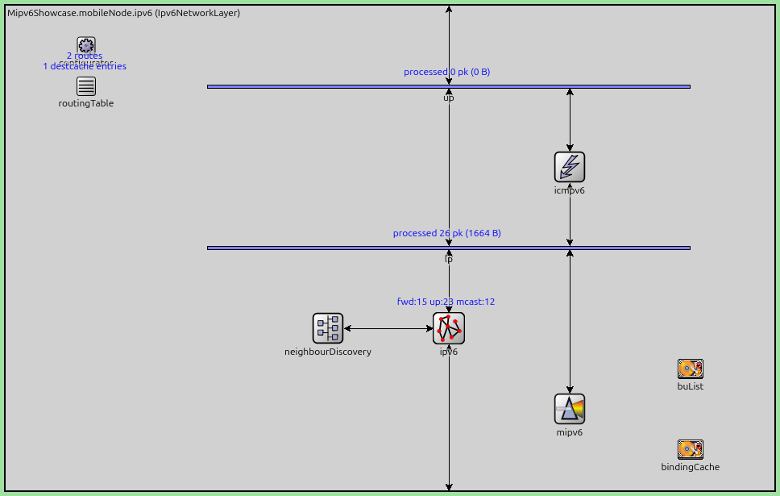

..
   FIGURE RECIPE (redo via the "omnetpp-mcp-sim" skill)
   type:     canvas
   config:   RouteOptimization   # ../omnetpp.ini
   seed:     default (seed-set=1)
   shows:    Ipv6NetworkLayer interior of mobileNode: mipv6 beside ipv6/icmpv6/
             neighbourDiscovery, plus buList + bindingCache
   anchor:   structural (t=0..12s, any time before handover). If the submodule
             set differs, Ipv6NetworkLayer or the mipv6 integration changed.
   capture:  set_canvas_view zoom=1.0 -> get_canvas_image module_rectangle
             margin=5 on Mipv6Showcase.mobileNode.ipv6; was 968x615. Known
             blemish: routingTable status text overlaps configurator label
             (the module's own layout).
   stamp:    captured 2026-08, INET 4.7

Every tunable parameter lives in the ``mipv6`` module:

- ``isMobileNode`` and ``isHomeAgent`` — the two role flags, fixed by the node
  type as described above.
- ``useRouteOptimization`` (default ``true``) — route-optimize with
  correspondent nodes, or always tunnel through the home agent.
- ``maxHaBindingLifeTime`` (default 3600 s) — the ceiling on a home
  registration.
- ``maxRrBindingLifeTime`` (default 420 s) — the ceiling on a binding held at
  a correspondent node.

One level up, ``hasMipv6`` on ``Ipv6NetworkLayer`` decides whether these
modules exist at all.

Neither lifetime expires inside this showcase's 80 second run, but a study of
re-registration reaches the 420 second one first. ``Mipv6`` also emits two
signals a study can record: ``mipv6RoCompleted`` when route optimization
finishes, and ``packetDropped``. The drops that the Results section walks
through (the mobile node's replies and its first Home Test Init) happen in the
IPv6 module, not in ``Mipv6``, and emit no drop signal.

Configuration notes:

- ``hasMipv6`` (on the node's ``ipv6`` submodule) creates or omits the whole
  Mobile IPv6 footprint. The ``WithoutMipv6`` configuration sets it to
  ``false`` on the mobile node, which leaves an ordinary wireless IPv6 host
  and is how this showcase measures what mobility support is worth.
- ``useRouteOptimization`` on the mobile node is what separates two of the
  three configurations: the same scenario runs both ways with this one flag.
- Movement detection does not depend on frequent Router Advertisements: on
  every layer-2 association the IPv6 neighbour discovery module immediately
  sends a Router Solicitation (its ``detectL2Movement`` parameter, default
  ``true``), so the mobile node never waits for a periodic advertisement.
- The mobile node autoconfigures its addresses, so the address configurator
  must leave hosts alone: the network sets ``assignAddressesToHosts = false``
  on the ``Ipv6NetworkConfigurator``, which then assigns addresses and routes
  to routers only. The home agent is recognized from its Router
  Advertisements (via the home-agent flag the standard defines for them),
  which is how the mobile node learns its home agent's address — at home,
  before ever leaving. The standard's remote-discovery mechanisms are not
  modeled, so a mobile node must start the simulation in its home network.

Implementation notes and simplifications, so the simulation is read for what
it is:

- The IPsec protection that RFC 6275 mandates between mobile node and home
  agent is not modeled (standard practice in simulation).
- The return-routability *message exchange* — sequence, paths, sizes, timing,
  and the mobile node's periodic token refresh — is faithful, but the
  cryptographic content is schematic: the tokens are constants rather than
  keyed, nonce-indexed values, and the correspondent never invalidates them.
- The home agent intercepts traffic by virtue of being the home network's
  router; answering Neighbor Solicitations on behalf of the absent mobile
  node (proxy Neighbor Discovery) is not implemented. In this scenario the
  distinction is invisible — no other host lives on the home link — but a
  host on the home link could not reach an away mobile node.

  .. todo::

     Merge this bullet with the next one: the one-second delay described there
     is a consequence of this same missing capability, not a separate
     shortcoming.

     This is gap 1 of MIPV6_IMPLEMENTATION_GAPS.md, and unlike the other gaps
     the page refers to it is **not filed** — no issue, no branch, no fix in
     progress as of 2026-08-27.

     RFC 6275 Section 10.4.1 asks the home agent to impersonate the absent
     mobile node on the home link: claim its home address with duplicate
     address detection, announce the claim with a multicast Neighbor
     Advertisement so neighbors replace their cache entries, and then answer
     Neighbor Solicitations for it. INET does none of the three — there is no
     on-link agent code anywhere in ``src/inet/networklayer/mipv6/``, the only
     "proxy" matches being Proxy Mobile IPv6 message fields. They are missing
     together because they are one capability, which is why the home agent's
     duplicate address detection cannot be added on its own.

     The next bullet's one-second delay is the workaround for the missing
     first step, hardcoded as ``sendTime = existingBinding ? 0 : 1`` at
     ``Mipv6.cc:898`` and applied at ``:664``, which carries its own
     ``// TODO solve the HA DAD problem in a different way``. Fixing this gap
     replaces that literal with a real probe, so the delay would then vary per
     seed the way the mobile node's own duplicate address detection does, and
     the handover budget in the Results section would need re-deriving.
- The home agent delays its first Binding Acknowledgement by one second, as a
  stand-in for the duplicate address detection the standard requires it to
  perform on the home address before answering. The delay itself is not the
  deviation: a compliant home agent waits about as long for real duplicate
  address detection.

  .. todo::

     This bullet exists only because the previous one's capability is missing.
     Implementing proxy Neighbor Discovery gives the home agent a real
     duplicate address detection probe, and this bullet is then deleted: the
     wait stops being a stand-in and becomes the timing of a check that
     actually runs. The wait itself does not go away -- INET's duplicate
     address detection costs ``retransTimer`` (1 s) plus a random 0--1 s, so
     it stays in the same range and starts varying per seed -- but it then
     belongs beside the handover budget in the Results section, which is where
     the reader meets it as a number, rather than in a list of things the
     simulation does not do.
- Until that acknowledgement lands the mobile node's reverse tunnel is not up,
  and the packets it sends from its home address — ping replies, and the
  first Home Test Init of route optimization — are dropped instead of being
  queued or tunneled. The node refuses to emit a packet whose home-address
  source would look spoofed outside the home network — its private version of
  the ingress filtering discussed earlier. This is the part that departs from
  the standard, and it costs one or two extra lost pings at the tail of each
  handover outage.
- The mobile node waits 1.5 s for the acknowledgement of a first home
  registration before it retransmits the Binding Update. This is the
  standard's first-registration timeout (InitialBindackTimeoutFirstReg), chosen
  to leave the home agent time for its duplicate address detection. The held
  acknowledgement arrives about one second after the Binding Update, so every
  home registration here takes one Binding Update, and the binding cache
  records sequence number 1.
- After a move, the mobile node runs duplicate address detection on its
  link-local address only, and assigns the care-of address without probing
  it. The standard requires both checks; a node that runs them at the same
  time waits about as long.
- Routers in this network have ICMPv6 Redirect generation disabled
  (``sendRedirects = false``). A router sends a Redirect when it forwards a
  packet back out of the very interface that packet arrived on, to tell the
  sender about a better first hop. Traffic intercepted *toward* the mobile
  node never meets that condition — it is steered into the tunnel before the
  forwarding check. The way back does: after decapsulating a reverse-tunneled
  reply, the home agent forwards the inner packet out of the very interface
  the tunneled packet arrived on, and would send a useless Redirect to the
  mobile node's home address on every reply. A real stack attributes
  decapsulated packets to the tunnel interface instead; the flag stands in for
  that difference.

The Model
---------

The network puts the three Mobile IPv6 locations in three corners: a home
network (``apHome`` + ``homeAgent``), a foreign network (``apForeign`` +
``foreignRouter``), and a correspondent node, all meeting at a backbone
router:

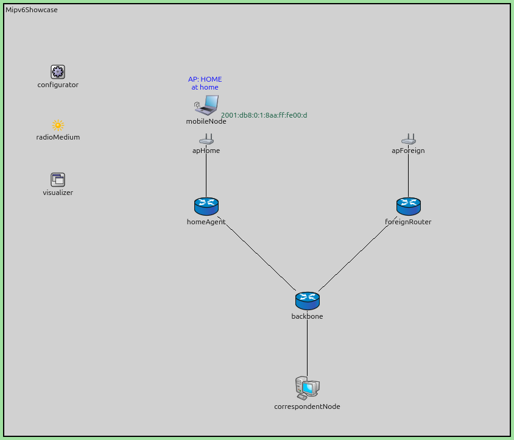

..
   FIGURE RECIPE (redo via the "omnetpp-mcp-sim" skill)
   type:     canvas
   config:   RouteOptimization   # ../omnetpp.ini
   seed:     default (seed-set=1)
   shows:    topology + the mobile node associated at home ("AP: HOME/at home"
             status label, green SLAAC address label on the right)
   anchor:   t=12s: associated, SLAAC done, label shows the home address
             2001:db8:0:1:8aa:ff:fe00:d. If the address differs, the MAC
             assignment order changed -> re-pin destAddr in the ini too.
   capture:  express-run to 12s -> set_canvas_view fit (zoom ~1.106) ->
             get_canvas_image module_rectangle margin=5; was 844x722. A route
             visualizer arrow may still be fading at some capture times;
             capture at ~12.2s (mid ping interval) for a clean shot.
   stamp:    captured 2026-08, INET 4.7

The status text above the mobile node is live: it shows the associated
SSID and the mobility state (at home / away / route-optimized), and the green
label on the right is its current IP address. Both update as the
simulation runs. Note that the foreign network's router is a plain
``Router6`` — the visited network needs no Mobile IPv6 support at all, just
as promised above.

The WAN link delays are the scenario's one deliberate design choice: 5 ms
between home agent and backbone, 8 ms between foreign router and backbone,
1 ms to the correspondent node. Real mobility spans real distances, and these
delays make each forwarding mode land at a distinct, predictable round-trip
time — the sum of the link delays along its path:

.. literalinclude:: ../Mipv6Showcase.ned
   :start-at: connections:
   :end-at: correspondentNode.ethg
   :language: ned

Predicted round-trip times, adding up the link delays along each path (the
access LANs' 0.1 µs is too small to matter):

- **at home**: 2 × (1 + 5) = 12 ms
- **tunneled**: 2 × (1 + 5) + 2 × (5 + 8) = 38 ms — every packet crosses the
  backbone twice, once to the home agent and once through the tunnel
- **route-optimized**: 2 × (1 + 8) = 18 ms

Those are the wired links only. The wireless hop is crossed twice per round
trip — once carrying the request to the mobile node, once carrying the reply
back — and each crossing costs about 1 ms: at 2 Mbps a ping frame takes that
long to clock out, plus the wait for a free channel. Adding the resulting 2 ms
gives the three plateaus the Results section measures: 14 ms at home, 40 ms
tunneled, 20 ms route-optimized.

Note that the route-optimized value is below anything a path through the home
agent could achieve: even the cheapest conceivable detour — out through the
tunnel (1 + 5 + 5 + 8 = 19 ms) and straight back (8 + 1 = 9 ms) — costs 28 ms
in link delays alone. Measuring 20 ms is proof by arithmetic that the home
agent is out of the loop.

The mobile node's movement has three acts (``movement.xml``): it dwells at
home for 15 s, dashes to the foreign network in 3 s, dwells there for 30 s,
and returns the same way, settling at home for the rest of the 80 s run. The
two access points operate on different wireless channels, and the mobile node
scans both.

Throughout the run, the correspondent node pings the mobile node's *home
address* every 0.5 s — the address is hardcoded in the ini file because it is
the stable identity a peer would know (it is also predictable: the home
prefix plus the interface identifier derived from the mobile node's MAC
address):

.. literalinclude:: ../omnetpp.ini
   :start-at: correspondentNode.numApps
   :end-at: app[0].startTime
   :language: ini

The mobile node is a ``WirelessHost6`` in all three configurations below.
They differ only in whether its Mobile IPv6 (MIPv6) engine is present at all
and, when it is, whether route optimization is enabled; everything else —
network, movement, traffic — is identical.

WithoutMipv6 configuration
~~~~~~~~~~~~~~~~~~~~~~~~~~

.. literalinclude:: ../omnetpp.ini
   :start-at: [Config WithoutMipv6]
   :end-at: hasMipv6
   :language: ini

Setting ``hasMipv6 = false`` removes the ``mipv6`` module from the mobile
node's IPv6 network layer, leaving an ordinary wireless IPv6 host. It
associates with the foreign access point and stateless address
autoconfiguration (SLAAC) gives it a perfectly good new address — but nobody
sends anything to that address. The pings keep targeting the old (home)
address, which now leads to a network where nobody answers Neighbor
Solicitations for it. Every ping from the moment it leaves home coverage
until it walks back is lost. This is the problem Mobile IPv6 (MIPv6) exists
to solve, measured.

BidirectionalTunneling configuration
~~~~~~~~~~~~~~~~~~~~~~~~~~~~~~~~~~~~

.. literalinclude:: ../omnetpp.ini
   :start-at: [Config BidirectionalTunneling]
   :end-at: useRouteOptimization
   :language: ini

The mobile node runs Mobile IPv6 with route optimization switched off — the
base protocol, nothing else. After the handover it registers its care-of
address with the home agent, and the pings resume: into the home network,
intercepted by the home agent, tunneled to the care-of address, answered
through the reverse tunnel. The round-trip time settles on the tunneling
plateau (~40 ms) for the whole stay abroad.

RouteOptimization configuration
~~~~~~~~~~~~~~~~~~~~~~~~~~~~~~~

.. literalinclude:: ../omnetpp.ini
   :start-at: [Config RouteOptimization]
   :end-at: useRouteOptimization
   :language: ini

The configuration states ``useRouteOptimization`` explicitly so that the one
parameter separating this scenario from the previous one is visible in both
listings. The first tunneled ping that reaches the mobile node
triggers the return-routability procedure with the correspondent node, the
Binding Update installs a binding there, and from the next ping onward the
traffic takes the direct path (~20 ms) — until the return home tears
everything down again.

Results
-------

This section follows one run of each configuration in time order. Until the
mobile node has its care-of address, at 19.9 s, the three configurations are
the same simulation. After that point, we follow the run without Mobile IPv6
first, because it shows the problem, and then the two runs with Mobile IPv6.

The pings are named after their ICMPv6 sequence number: the correspondent node
sends ``ping0`` at t = 1 s and one more every 0.5 s, so ``ping<N>`` leaves at
1 + 0.5·N s. All times come from the default random seed. Where a value
depends on the seed, we also give its range over ten runs with different
seeds.

Before the move
~~~~~~~~~~~~~~~

After the start, the mobile node associates with ``apHome``, forms its home
address by stateless address autoconfiguration (SLAAC), and checks it with
duplicate address detection (DAD). The first reply, to ``ping9`` at 5.5 s,
comes this late because the home agent cannot resolve the home address
while the mobile node is still checking it.

From then on, the pings take the home path: correspondent node, ``backbone``,
``homeAgent``, ``apHome``, mobile node. The round-trip time (RTT) stays at
about 14 ms (median 14.07 ms), as The Model predicts. No Mobile IPv6 message is
sent while the node is at home.

Leaving home
~~~~~~~~~~~~

At 15 s the mobile node starts to move to the foreign network. The last reply
at home arrives at 17.014 s (``ping32``). The node hears the last ``apHome``
beacon at 17.407 s, but it stays associated: it declares the access point lost
only when 3.5 beacon intervals have passed without a beacon, a value fixed in
INET, at 17.757 s. Meanwhile the home agent still
sends the pings to ``apHome``, which transmits each of ``ping33`` to ``ping37``
seven times and then drops it.

The node then scans both wireless channels. Channel 1 is empty, and channel 2
has ``apForeign``. The scan ends at 18.407 s, and the node is associated with
``apForeign`` at 18.408 s.

The association makes the node send a Router Solicitation (RS) at once.
``foreignRouter`` answers with a Router Advertisement (RA) after a random delay
of 0.457 s: the standard requires a random delay of up to 0.5 s before a
solicited Router Advertisement. The Router Advertisement reaches the node at
18.867 s with the prefix ``2001:db8:0:3::/64``. This is not the home prefix, so
the node has moved, and it starts duplicate address detection (DAD). Here INET
departs from the standard, as the implementation notes say: the node probes
only its link-local address, with one Neighbor Solicitation, and never its new
care-of address. While the check runs, INET also marks the node's home address
tentative, so the node cannot use that address either.

The check takes 1 s plus a random 0.057 s and completes at 19.924 s. At the
same instant, the node assigns its care-of address,
``2001:db8:0:3:8aa:ff:fe00:d``, without probing it, and its home address
becomes usable again. From here on, the home address is usable; the replies
that the node drops a little later have a different cause.

Here is this part of the run as a sequence chart, taken from the
``WithoutMipv6`` run. Each horizontal line is one node, and each arrow is one
hop of one packet. An arrow that bends at a line stops at that node, which then
sends the packet on; an arrow that only crosses a line passes that node's
position on the chart without touching the node. The chart has an overview
and, below it, a zoomed strip. Both have linear time axes, so the waits appear
at their true length:

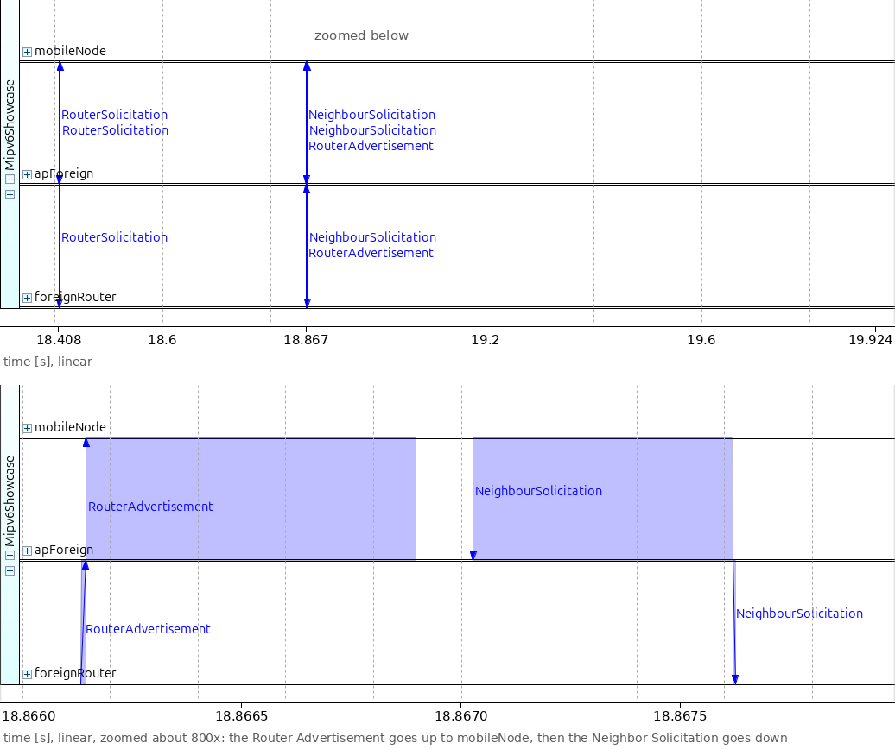

..
   FIGURE RECIPE (redo via the "omnetpp-ide-mcp" skill)
   type:     seqchart
   config:   WithoutMipv6, seed-set 1, re-run with --record-eventlog=true
             --eventlog-recording-intervals=18.3s..20.0s,51.3s..52.1s
             (results/WithoutMipv6-intervals.elog)
   ide:      OMNeT++ IDE (omnetpp-aipre-GUI, MCP server on 127.0.0.1:5077), started with
             ~/omnetpp-aipre-GUI/ide/opp_ide -data ~/omnetpp-aipre-GUI/samples (plain opp_ide
             stops at the Choose Workspace dialog). The .elog must be inside a workspace project:
             it was copied to /home/user/inet/tmp-mipv6-seq/ (project "inet") and opened by
             absolute path.
   nav:      goto_event <first event> BEFORE zoom_to_simulation_time_range -- a bare zoom on a
             multi-interval eventlog squashes the whole log into the viewport. In NONLINEAR mode
             the zoom only sets the left edge; the scale is fixed by the event count, so the
             panel width is set with resize_window, and the right edge ends at the last
             filtered event.
   axes:     mobileNode, apForeign, foreignRouter (this order)
   filter:   message_names RouterSolicitation, RouterAdvertisement, NeighbourSolicitation
   view:     NETWORK_COMMUNICATION, SIMULATION_TIME (linear); resize_window 1250x900.
             Overview: zoom 18.30..19.96 (viewport left 18.2992048, 624.096 px/s).
             Zoom (V2): goto_event 10462, zoom 18.86595..18.86799 (viewport left 18.8659493,
             507843 px/s) -- the Router Advertisement (up) and the DAD Neighbor Solicitation
             (down) separate; the AP's re-sent copy of the multicast NS at ~18.8680 s stays
             just outside the window.
   anchor:   RS 18.408162 (event #10129) up to foreignRouter; RA 18.866896 (#10462, router
             delay 0.457 s) and the one DAD NS (#10464) at the same time; then nothing until
             DAD done 19.923596 (#11079, not a message, so not drawn). A second NS or an RA
             much later than 0.5 s after the RS = the timeline moved.
   capture:  two screenshots, 1036x508 each (raw: seqchart-raw/p1c.png, p1zoom3.png)
   post:     research/analyst-data/p1.py: overview crop (0,110)-(1036,486) + absolute tick strip
             (ticks at 18.408 RS, 18.867 RA/NS, 19.924 DAD done, and 18.6/19.2/19.6, x=(t-18.2992048)
             *624.096); a grey "zoomed below" note at the RA/NS; then the zoom crop (0,120)-(1036,486)
             + tick strip 18.8660..18.8675 s (x=(t-18.8659493)*507843) with the note "zoomed about
             800x: the Router Advertisement goes up to mobileNode, then the Neighbor Solicitation goes
             down". The IDE rulers are cut off. Result 1036x868.
   stamp:    captured 2026-09-29, INET HEAD 473613b760 (model = aeee20a40d), OMNeT++ IDE 6.4.0aipre

The Router Solicitation goes from ``mobileNode`` to ``foreignRouter`` at once,
and the Router Advertisement comes back about 0.46 s later. At the same moment,
the node sends the single Neighbor Solicitation of duplicate address detection
(DAD). At the scale of the overview the two arrows coincide; the strip below
it stretches this moment about 800 times and shows the order: the Router
Advertisement reaches ``mobileNode`` first, and then the Neighbor Solicitation
leaves it. After that comes about a second of silence, in which the node may not use
its new addresses yet. The end of the check is not a message, so no arrow
marks it. At
19.924 s all three runs have a working care-of address. This is where they
part.

Without Mobile IPv6
~~~~~~~~~~~~~~~~~~~

Without Mobile IPv6, nothing happens at 19.924 s. The node has a new, working
address, but nobody knows it. The correspondent node keeps sending to the home
address, and the pings keep going to the home link. There, the router
``homeAgent`` still has a valid neighbor entry for the home address, so it
sends each ping to ``apHome``, which transmits it seven times and drops it; 53
pings are lost this way. Neighbor Unreachability Detection (NUD), the Neighbor
Discovery check that a neighbor still answers, starts to doubt the entry at
36.0 s, probes the node from 41.0 s, and deletes the entry at 44.0 s. Only then
does the router try to resolve the home address to a link-layer address again.
It holds the pings that arrive during each attempt. When an attempt fails, it
drops them, and the correspondent node receives ICMPv6 Destination Unreachable
messages, at 47.0 s and again at 50.0 s.

Here is the round-trip time of every ping in the ``WithoutMipv6`` run. The
shaded band is the time the node spends away from home. The three
configurations are plotted separately on identical axes, because at home their
points coincide and would hide one another:

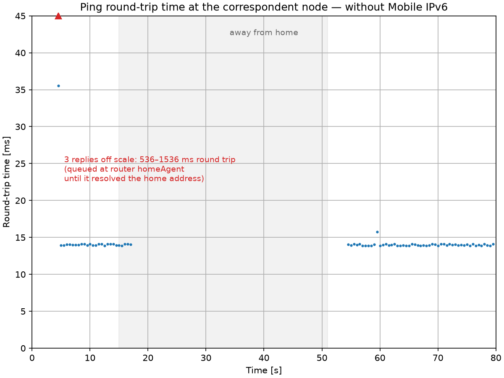

..
   FIGURE RECIPE (redo via the "inet-showcase-charts" skill)
   type:     chart (matplotlib)
   anf:      Mipv6Showcase.anf   chart "Ping round-trip time (without Mobile IPv6)"
   inputs:   results/WithoutMipv6-#0.vec (re-run the config first, seed-set 1)
   shows:    RTT of every ping in the WithoutMipv6 config: the 14 ms home plateau, no reply from 17.014 s to 52.016 s, then four queued replies off scale (drawn as red markers on the top edge, labelled with their real RTTs) and the home plateau again; "away from home" span shaded 15..51 s
   anchor:   axes are pinned (x 0..80 s, y 0..45 ms) so the three panels compare
             directly -- keep all three identical if any one is redone.
             first reply ping9 at 5.516 s (15.77 ms); last reply before the move ping32 at 17.014 s; first reply after the return ping98 at 52.016 s (2015.8 ms, off scale); off-scale label reads "4 replies off scale: 524–2016 ms round trip (queued at the home agent)"; ping102 at 52.025 s (24.6 ms) is on scale. If the marker/label is missing or the count differs, the return timing changed.
             Replies above the y range are never clipped silently: the shared chart
             script draws them as red markers on the top edge with one label.
   export:   opp_charttool imageexport Mipv6Showcase.anf -n "(without Mobile IPv6)" -f png --dpi 150
             -d doc/media   (8x6 in -> 1200x900; filename from image_export_filename)
   stamp:    captured 2026-09-29, INET HEAD aeee20a40d (topic/gy/mipv6-showcase), OMNeT++ 6.4.0aipre2

No reply arrives for 35.0 s, from 17.014 s until the node is home again. The
node answers the router's third attempt at 52.007 s, and the router sends the
pings it held for that attempt, so their replies arrive late: the markers on the top edge, at about
52 s, stand for round-trip times of 523.5 to 2015.8 ms. Over ten seeds, the gap
without replies is 34.5–37.0 s. This is the problem that Mobile IPv6 solves.

The home registration
~~~~~~~~~~~~~~~~~~~~~

We now go back to 19.9 s, the moment the care-of address is ready, and follow
the runs with Mobile IPv6. The ``BidirectionalTunneling`` and
``RouteOptimization`` runs are the same until 20.04 s.

The video below shows the handover in the ``RouteOptimization`` configuration,
from the last reply at home to the direct path. Each colored line traces the
path of a ping reply that reaches the correspondent node, and the labels at the
mobile node show its access point, its address and its status:

.. video:: media/handover.mp4
   :align: center

..
   VIDEO RECIPE (redo via the "video-recording" skill)
   config:   RouteOptimization
   seed:     default (seed-set=1)
   shows:    home path -> the move -> AP label HOME -> FOREIGN -> care-of address and
             "away (via home agent)" -> ping40 round trip through the tunnel (reply leg
             drawn along homeAgent-backbone) -> "away (route-optimized, 1 CN)" -> ping41
             and later pings on the direct path through foreignRouter
   anchors:  association with apForeign 18.408 s; DAD done + BU 19.924 s (status label
             "away (via home agent)", address label -> 2001:db8:0:3:8aa:ff:fe00:d);
             binding active 20.967 s; first reply ping40 at 21.040 s (tunneled route);
             CN's BA at the MN 21.097 s (status "away (route-optimized, 1 CN)");
             ping41 direct 21.520 s. ping38/ping39 (replies dropped at the MN) draw no
             route -- the network-route visualizer shows only delivered round trips.
             If ping40 is not the first route drawn after the move, the timeline moved.
   window:   express to 16.5 s -> step 1 event (normal) -> record to 22.5 s.
             Route visualizer fades in simulation time (0.6 s) -> no settle wait.
   launch:   private prefs copy so the user's Qtenv prefs stay untouched:
             XDG_CONFIG_HOME=<dir> with <dir>/omnetpp/.qtenvrc copied from
             ~/.config/omnetpp/.qtenvrc and animation_enabled=false (built-in message
             animation off); opp_run_release ... -u Qtenv -c RouteOptimization
             '--*.visualizer.osgVisualizer.typename=""' --mcp-server-address localhost:8777
   anim:     set_animation_parameters profile=normal playback_speed=1
             min_animation_speed=0.1 (no model animation speed with the built-in
             animation off; the floor gives 0.05 s sim time per frame at fps=2)
   capture:  record_video fps=2, crop_area=with_padding; 120 frames (0000-0119);
             crop_rect was 854x732 at 884,87; frames kept in /var/tmp/mipv6-video/frames_handover
   encode:   ffmpeg -r 6 -f image2 -i <prefix>_%04d.png -filter:v "crop=830:684:896:123"
             -vcodec libx264 -pix_fmt yuv420p <name>.mp4  (V3: the crop keeps only the canvas
             interior -- x 896-1725, y 123-806 -- so neither the green Qtenv window background nor the
             canvas border shows; 830x684, fits the 834 px column without scaling)
   post:     none
   stamp:    recorded 2026-09-29, INET HEAD 0d66eff240 (model = aeee20a40d), OMNeT++ 6.4.0aipre2

The replies take the home path until the last one at home, at 17.014 s, while
the node is already moving; after that, no line is drawn for a while. The
access point label changes from HOME to FOREIGN. At 19.924 s the address
label shows the care-of address, and the status becomes "away (via home
agent)". The video does not draw the Binding Update or any other signaling;
the status label is where the signaling shows. ``ping38`` and ``ping39`` draw
no line either, because their replies are dropped; the sequence chart later in
this subsection shows them. The first line after the move belongs to
the reply to ``ping40``, which takes the reverse tunnel through the home
agent. Then the status
becomes "away (route-optimized, 1 CN)", and from ``ping41`` on, the lines take
the direct path through ``foreignRouter``.

At the same instant as duplicate address detection (DAD) completes, at
19.924 s, the mobile node sends a Binding Update (BU) to its home agent. The
source address is the care-of address. The Binding Update carries sequence
number 1, a lifetime of 3600 s, and the A (acknowledge), H (home registration)
and L (link-local address compatibility) flags. The node expects the Binding Acknowledgement (BA) within
1.5 s; otherwise it would send the Binding Update again at 21.424 s.

The home agent receives the Binding Update at 19.953 s. It creates a binding
cache entry and the tunnel to the care-of address at once, but it holds the
Binding Acknowledgement (BA) for exactly 1 s. This is the stand-in for
duplicate address detection described in the implementation notes. The
standard requires the home agent to check the home address on the home link before
it acknowledges a first registration, and that check also takes about a
second. A standard home agent would start tunneling only after the check;
INET's home agent starts at once.

Here are the home agent's interfaces at 20.48 s, in the middle of the hold.
Next to the loopback and the two Ethernet interfaces there is now a tunnel
interface, ``ip6tun0``:

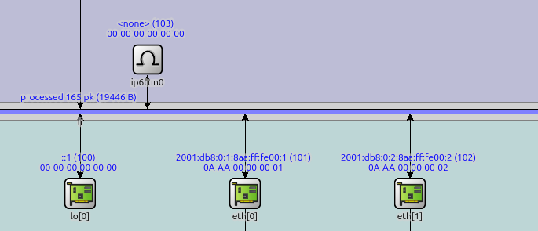

..
   FIGURE RECIPE (redo via the "omnetpp-mcp-sim" skill)
   type:     canvas (get_canvas_image)
   config:   BidirectionalTunneling
   seed:     default (seed-set=1)
   shows:    the home agent's interface layer at 20.48 s: ip6tun0 (interface id 103, no
             address, MAC 00-00-00-00-00-00) next to lo[0] (::1), eth[0]
             (2001:db8:0:1:8aa:ff:fe00:1, home link) and eth[1] (2001:db8:0:2:8aa:ff:fe00:2,
             backbone link)
   launch:   as tunneled_packet.png (Qtenv, --mcp-server-address localhost:8777)
   target:   same stop as bindingcache.png: run_simulation mode=express time_limit=20.5
             (20.480866, event #11533). set_canvas_view module_path=homeAgent zoom=1.4
   anchor:   ip6tun0 is created dynamically when the HA accepts the Binding Update:
             19.953260, event #11153 (the mobile node's own ip6tun0 appears only at
             20.966823, event #11799). Before 19.953 s the icon is absent -- if it shows at
             an earlier time, tunnel creation moved.
   capture:  get_canvas_image module_path=homeAgent area=module_rectangle margin=5 at zoom 1.4
             (1773x1589; zoom 1.0 makes the interface labels overlap, zoom >= 1.7 exceeds
             2048 px and is downscaled) -> PIL-crop (955,1125)-(1640,1420); 685x295
   stamp:    captured 2026-09-29, INET HEAD aeee20a40d, OMNeT++ 6.4.0aipre2

At the same moment, its binding cache holds one entry:

..
   FIGURE RECIPE (redo via the "omnetpp-mcp-sim" skill)
   type:     inspector
   config:   BidirectionalTunneling (RouteOptimization looks the same)
   seed:     default (seed-set=1)
   shows:    homeAgent.ipv6.bindingCache with one entry: HoA 2001:db8:0:1:8aa:ff:fe00:d =>
             CoA 2001:db8:0:3:8aa:ff:fe00:d, lifetime 3600, home registration, BU sequence 1
   launch:   as tunneled_packet.png (Qtenv, --mcp-server-address localhost:8777)
   target:   run_simulation mode=express time_limit=20.5 (stops at 20.480866, event #11533,
             next event = the CN's sendPing for ping39) -> open_inspector
             Mipv6Showcase.homeAgent.ipv6.bindingCache type=object -> expand_inspector_tree
             depth=4. Same moment as homeagent-tunnel.png.
   anchor:   exactly 1 entry, BU_Sequence#: 1, from 19.953260 (BU received, event #11153)
             until 52.796721 (BT de-registration). Sequence 2 = a second Binding Update
             happened (the pre-fix behavior).
   capture:  get_inspector_screenshot width=1300 height=900 -> PIL-crop (14,370)-(830,430):
             the bindingCache map rows; 816x60. The entry text ("Registeration", trailing
             "\n") is INET's own string.
   stamp:    captured 2026-09-29, INET HEAD aeee20a40d, OMNeT++ 6.4.0aipre2

The entry maps the home address to the care-of address, with sequence number 1.
The lifetime of 3600 s is INET's default for a home registration
(``maxHaBindingLifeTime``), not a value from the standard.

At 20.0 s the correspondent node sends ``ping38``. The home agent intercepts it
and sends it through the tunnel, and it reaches the mobile node at 20.038 s.
The node answers, but it drops its own reply. The reply's source is the home
address, and until the Binding Acknowledgement (BA) arrives, the node has no
reverse tunnel to carry it. ``ping39`` reaches the node at 20.520 s, 0.447 s
before the binding becomes active, and its reply is dropped the same way. The
home agent is ready, but the mobile node is not. The standard has no rule that
makes the node discard these packets; this is the INET behavior listed in the
implementation notes. In the ``RouteOptimization`` run, the arrival of
``ping38`` also starts return routability; the next subsection follows it from
this moment.

At 20.953 s, 1 s after the Binding Update arrived, the home agent sends the
Binding Acknowledgement with sequence number 1. It reaches the mobile node at
20.967 s. The node marks the binding active and creates its reverse tunnel,
from the care-of address to the home agent. One Binding Update, one Binding
Acknowledgement: the retransmission planned for 21.424 s is not needed,
because the 1.5 s timeout leaves room for the home agent's 1 s wait. The
standard chose the value for this reason.

``ping40`` leaves the correspondent node at 21.0 s. It goes to the home agent,
through the tunnel to the mobile node, and its reply comes back through the
reverse tunnel. The home agent unwraps the reply at 21.034 s and forwards it to
the correspondent node, where it arrives at 21.040 s. The round trip takes
40.36 ms.

The outage, from the last reply at home to this first reply abroad, is 4.03 s.
It is the same in both Mobile IPv6 configurations. Over ten seeds it is
4.0–7.5 s, with a median of 4.5 s; the ping interval rounds these values to
steps of 0.5 s. The random parts are the delay of duplicate address detection
and the delay of the Router Advertisement. The two longest runs, 7.0 and
7.5 s, are 3 s longer than the shortest ones: there the foreign router's answer
was held back by a limit on multicast Router Advertisements, which the return
home shows at work. This run is at the low end: none of the ten runs had a
shorter outage.

Here is the registration as a sequence chart, from the
``BidirectionalTunneling`` run. The bracket marks the 1 s hold, and the red
stubs mark the two dropped replies. The time axis is not linear here: busy
stretches get more room than idle ones, so the bracket's label gives the true
length of the hold:

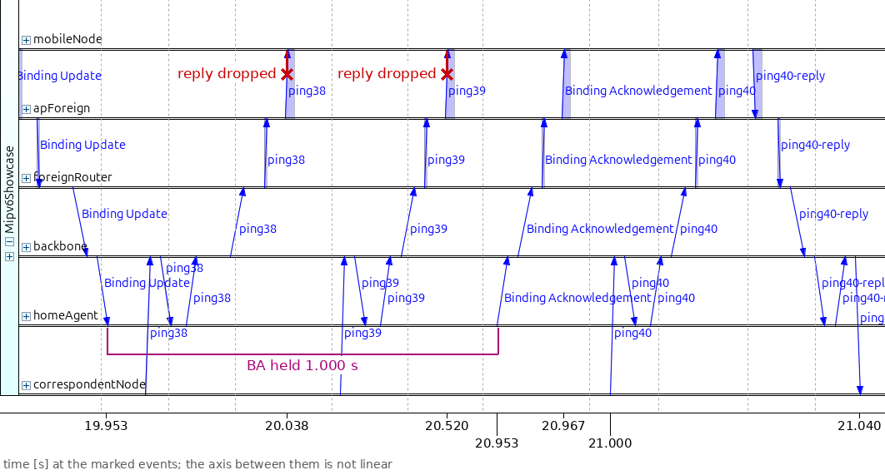

..
   FIGURE RECIPE (redo via the "omnetpp-ide-mcp" skill)
   type:     seqchart
   config:   BidirectionalTunneling, seed-set 1, --record-eventlog=true
             --eventlog-recording-intervals=19.9s..21.1s,51.3s..53.1s
   ide:      OMNeT++ IDE (omnetpp-aipre-GUI, MCP server on 127.0.0.1:5077), started with
             ~/omnetpp-aipre-GUI/ide/opp_ide -data ~/omnetpp-aipre-GUI/samples (plain opp_ide
             stops at the Choose Workspace dialog). The .elog must be inside a workspace project:
             it was copied to /home/user/inet/tmp-mipv6-seq/ (project "inet") and opened by
             absolute path.
   nav:      goto_event <first event> BEFORE zoom_to_simulation_time_range -- a bare zoom on a
             multi-interval eventlog squashes the whole log into the viewport. In NONLINEAR mode
             the zoom only sets the left edge; the scale is fixed by the event count, so the
             panel width is set with resize_window, and the right edge ends at the last
             filtered event.
   axes:     mobileNode, apForeign, foreignRouter, backbone, homeAgent, correspondentNode
   filter:   message_names "Binding Update", "Binding Acknowledgement", ping*
   view:     NETWORK_COMMUNICATION, NONLINEAR; resize_window 1330x1000 (widget 1102x578);
             goto_event 11080, zoom 19.92..21.3
   anchor:   BU leaves the MN 19.923596 (#11081), reaches homeAgent 19.953260 (#11152);
             ping38 and ping39 reach the MN via homeAgent at 20.037830 (#11320) and
             20.519974 (#11601) with no reply; BA leaves homeAgent 20.953260 (#11762), at
             the MN 20.966823 (#11798); ping40 round trip via homeAgent both ways, reply at
             the CN 21.040356 (#11982)
   capture:  screenshot 1102x578 (raw: seqchart-raw/p2h.png) -> crop (0,62)-(1062,556): drops the
             hover box, the IDE ruler and ping41; + absolute tick strip -> 1062x571
   post:     bracket on the homeAgent lifeline from the BU arrival #11152 (x 128) to the BA departure
             #11762 (x 597), bar at cropped y 425, label "BA held 1.000 s"; red stubs "reply dropped"
             from the mobileNode axis at the ping38 arrival (#11320, x 344; drop #11322 same time) and
             the ping39 arrival (#11601, x 536; drop #11603). Ticks: 19.953 (#11152), 20.038 (#11320),
             20.520 (#11601), 20.953 (#11762), 20.967 (#11798, x 676.5), 21.000 (ping40 leaves the CN,
             x 732), 21.040 (#11982, x 1031.5).
             Composition script research/analyst-data/pn.py (helpers compose.py; raw
             screenshots in research/analyst-data/seqchart-raw/): run from analyst-data/ with an
             out/ directory. Overlay font DejaVu Sans 17 px (V5). The IDE's relative ruler is cut
             off and replaced by an absolute-time strip: a tick at each anchor event's x (read from
             the arrow ends in the screenshot), labelled with the event's simulation time, and the
             note "time [s] at the marked events; the axis between them is not linear" (V1).
   stamp:    captured 2026-09-29, INET HEAD 473613b760 (model = aeee20a40d), OMNeT++ IDE 6.4.0aipre

The Binding Update travels down from ``mobileNode`` through ``apForeign``,
``foreignRouter`` and ``backbone`` to ``homeAgent``. The next arrows belong to
``ping38`` and ``ping39``. They bend at the ``homeAgent`` line and then go out
to the foreign network, but no reply arrow leaves ``mobileNode``. After the
bracket, the Binding Acknowledgement travels to the mobile node, and the round
trip of ``ping40`` follows, through the home agent in both directions.

Return routability and the direct path
~~~~~~~~~~~~~~~~~~~~~~~~~~~~~~~~~~~~~~

We go back once more, to 20.038 s. In the ``RouteOptimization``
configuration, the arrival of ``ping38`` also starts return routability. The standard names a tunneled packet
from a correspondent node as one reason to start it. The node sends the Home
Test Init (HoTI) and the Care-of Test Init (CoTI) at the same time. The Home
Test Init has the home address as its source, so the node drops it, like the
ping replies. The Care-of Test Init goes directly to the correspondent node,
which answers with the Care-of Test (CoT). The Care-of Test is back at the
mobile node at 20.057 s.

Here is that moment as a sequence chart; the red stub marks the dropped Home
Test Init:

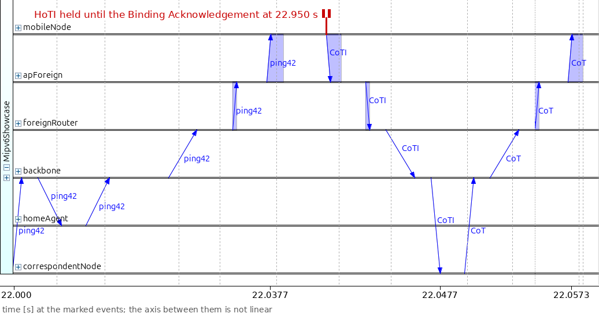

..
   FIGURE RECIPE (redo via the "omnetpp-ide-mcp" skill)
   type:     seqchart
   config:   RouteOptimization, seed-set 1, --record-eventlog=true
             --eventlog-recording-intervals=19.9s..22.1s,51.3s..54.6s
   ide:      OMNeT++ IDE (omnetpp-aipre-GUI, MCP server on 127.0.0.1:5077), started with
             ~/omnetpp-aipre-GUI/ide/opp_ide -data ~/omnetpp-aipre-GUI/samples (plain opp_ide
             stops at the Choose Workspace dialog). The .elog must be inside a workspace project:
             it was copied to /home/user/inet/tmp-mipv6-seq/ (project "inet") and opened by
             absolute path.
   nav:      goto_event <first event> BEFORE zoom_to_simulation_time_range -- a bare zoom on a
             multi-interval eventlog squashes the whole log into the viewport. In NONLINEAR mode
             the zoom only sets the left edge; the scale is fixed by the event count, so the
             panel width is set with resize_window, and the right edge ends at the last
             filtered event.
   axes:     mobileNode, apForeign, foreignRouter, backbone, homeAgent, correspondentNode
   filter:   message_names CoTI, CoT, HoTI, ping*
   view:     NETWORK_COMMUNICATION, NONLINEAR; resize_window 1250x1000; goto_event 11320,
             zoom 20.034..20.060
   anchor:   ping38 reaches the MN 20.037830 (#11320); CoTI MN -> CN 20.037830..20.047718
             (#11391), CoT back at the MN 20.057332 (#11433); both cross the homeAgent band
             without touching it; no HoTI arrow (dropped at the MN, #11324)
   capture:  screenshot 1036x578 (raw: seqchart-raw/p3b.png) -> crop (0,62)-(1036,556) + tick
             strip -> 1036x550
   post:     red stub "HoTI dropped" from the mobileNode axis at the ping38 arrival (#11320, x 193;
             drop #11324 same time); the ping38 reply drop (#11326) is deliberately not marked. Ticks:
             20.0378 (#11320), 20.0477 (CoTI at the CN #11391, x 639.5), 20.0573 (CoT at the MN #11433,
             x 965.5).
             Composition script research/analyst-data/pn.py (helpers compose.py; raw
             screenshots in research/analyst-data/seqchart-raw/): run from analyst-data/ with an
             out/ directory. Overlay font DejaVu Sans 17 px (V5). The IDE's relative ruler is cut
             off and replaced by an absolute-time strip: a tick at each anchor event's x (read from
             the arrow ends in the screenshot), labelled with the event's simulation time, and the
             note "time [s] at the marked events; the axis between them is not linear" (V1).
   stamp:    captured 2026-09-29, INET HEAD 473613b760 (model = aeee20a40d), OMNeT++ IDE 6.4.0aipre

The Care-of Test Init and the Care-of Test run straight between the two nodes,
without touching ``homeAgent``. The care-of half of the test is finished,
while the home half has not left the mobile node.

The node sends the Home Test Init (HoTI) again at 21.038 s. The Binding
Acknowledgement does not trigger this copy: the Home Test Init has its own
retransmission timer of 1 s, which fires 1 s after the dropped first copy. Now
the binding is active, so the message goes through the reverse tunnel: it reaches the home agent at 21.052 s and the correspondent node at
21.058 s. The correspondent node sends the Home Test (HoT) to the home address.
The home agent intercepts it and tunnels it to the care-of address, and it
reaches the mobile node at 21.077 s. The node now holds both tokens, so return
routability is complete.

At the same instant, the node sends a Binding Update (BU) to the correspondent
node, with sequence number 1 and a lifetime of 420 s. The correspondent node
creates its binding cache entry at 21.088 s and answers with a Binding
Acknowledgement (BA), which reaches the node at 21.097 s. Route optimization
is now complete, and the node's status becomes "away (route-optimized, 1 CN)".
Asking for this acknowledgement is the mobile node's choice (INET
always asks), but a correspondent node that is asked must answer. The standard
lets this Binding Update go only after both tests are complete and the home
agent has acknowledged the home registration. Here the home agent's Binding
Acknowledgement arrived at 20.967 s, well before.

Here is the second half of return routability and the registration at the
correspondent node:

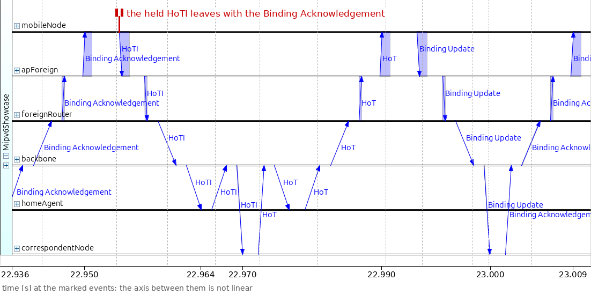

..
   FIGURE RECIPE (redo via the "omnetpp-ide-mcp" skill)
   type:     seqchart
   config:   RouteOptimization (same eventlog as P3)
   ide:      OMNeT++ IDE (omnetpp-aipre-GUI, MCP server on 127.0.0.1:5077), started with
             ~/omnetpp-aipre-GUI/ide/opp_ide -data ~/omnetpp-aipre-GUI/samples (plain opp_ide
             stops at the Choose Workspace dialog). The .elog must be inside a workspace project:
             it was copied to /home/user/inet/tmp-mipv6-seq/ (project "inet") and opened by
             absolute path.
   nav:      goto_event <first event> BEFORE zoom_to_simulation_time_range -- a bare zoom on a
             multi-interval eventlog squashes the whole log into the viewport. In NONLINEAR mode
             the zoom only sets the left edge; the scale is fixed by the event count, so the
             panel width is set with resize_window, and the right edge ends at the last
             filtered event.
   axes:     mobileNode, apForeign, foreignRouter, backbone, homeAgent, correspondentNode
   filter:   message_names HoTI, HoT, "Binding Update", "Binding Acknowledgement", ping*
   view:     NETWORK_COMMUNICATION, NONLINEAR; resize_window 1330x1000 (widget 1102);
             goto_event 12082, zoom 21.0365..21.0985
   anchor:   HoTI leaves the MN 21.037830 (#12082) through the reverse tunnel, homeAgent
             21.051580, CN 21.057593 (#12161); HoT via homeAgent (21.063607) to the MN
             21.077391 (#12229); BU to the CN (#12232) and its BA at the MN 21.097182 (#12337)
             go direct. The end of the previous ping40 reply shows at the left edge.
   capture:  screenshot 1102x578 (raw: seqchart-raw/p4b.png) -> crop (0,62)-(1102,556) + tick
             strip -> 1102x550. The MN-side "Binding Acknowledgement" label is cut at the right edge
             (the BA is the last filtered event); its other hops carry the full label.
   post:     red label "HoTI sent again, 1 s after the dropped copy" in the apForeign band (x 130,
             cropped y 64) with a horizontal leader and arrowhead ending on the HoTI arrow just below
             the mobileNode axis (#12082, arrow start x 46); no overlay pixel crosses the "mobileNode"
             name (V4). Ticks: 21.038 (#12082), 21.040 (ping40 reply at the CN, x 164.5), 21.058
             (HoTI at the CN #12161, x 345.5), 21.077 (HoT at the MN #12229, x 619.5), 21.088 (BU at the
             CN #12296, x 833.5), 21.097 (BA at the MN #12337, x 1000.5).
             Composition script research/analyst-data/pn.py (helpers compose.py; raw
             screenshots in research/analyst-data/seqchart-raw/): run from analyst-data/ with an
             out/ directory. Overlay font DejaVu Sans 17 px (V5). The IDE's relative ruler is cut
             off and replaced by an absolute-time strip: a tick at each anchor event's x (read from
             the arrow ends in the screenshot), labelled with the event's simulation time, and the
             note "time [s] at the marked events; the axis between them is not linear" (V1).
   stamp:    captured 2026-09-29, INET HEAD 473613b760 (model = aeee20a40d), OMNeT++ IDE 6.4.0aipre

The Home Test Init and the Home Test both bend at the ``homeAgent`` line: the
home half of the test travels through the tunnel, as it must. The Binding
Update to the correspondent node and the Binding Acknowledgement that answers
it then run directly, without bending at ``homeAgent``; the acknowledgement's
label is on its hops through ``backbone`` and ``foreignRouter``.

Because the Home Test Init waited for its timer, return routability completes
only at 21.077 s, and route optimization at 21.097 s, after ``ping40`` has left
the correspondent node at 21.0 s.
So ``ping40`` still takes the tunnel, and from ``ping41`` at 21.5 s on, the
pings take the direct path: correspondent
node, ``backbone``, ``foreignRouter``, mobile node. The request carries a
type 2 routing header with the home address, and the reply carries a Home
Address destination option. The round trip takes 20.18 ms. Exactly one reply
in this run came through the tunnel, the reply to ``ping40``; the same is true
in each of the ten seeds. Here is the direct path as a sequence chart:

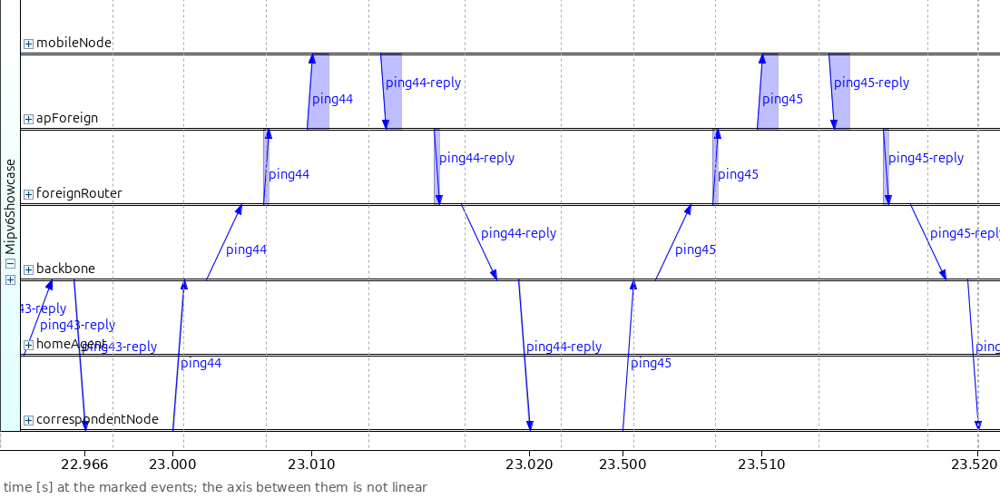

..
   FIGURE RECIPE (redo via the "omnetpp-ide-mcp" skill)
   type:     seqchart
   config:   RouteOptimization (same eventlog as P3)
   ide:      OMNeT++ IDE (omnetpp-aipre-GUI, MCP server on 127.0.0.1:5077), started with
             ~/omnetpp-aipre-GUI/ide/opp_ide -data ~/omnetpp-aipre-GUI/samples (plain opp_ide
             stops at the Choose Workspace dialog). The .elog must be inside a workspace project:
             it was copied to /home/user/inet/tmp-mipv6-seq/ (project "inet") and opened by
             absolute path.
   nav:      goto_event <first event> BEFORE zoom_to_simulation_time_range -- a bare zoom on a
             multi-interval eventlog squashes the whole log into the viewport. In NONLINEAR mode
             the zoom only sets the left edge; the scale is fixed by the event count, so the
             panel width is set with resize_window, and the right edge ends at the last
             filtered event.
   axes:     mobileNode, apForeign, foreignRouter, backbone, homeAgent, correspondentNode
   filter:   message_names ping*
   view:     NETWORK_COMMUNICATION, NONLINEAR; resize_window 1330x1000; goto_event 12472,
             zoom 21.4995..22.03
   anchor:   ping41 leaves the CN 21.5 (#12472), reply back 21.520178; ping42 22.0, reply
             22.020078; all arrows CN <-> backbone <-> foreignRouter <-> MN cross the
             homeAgent band without a bend. A bend at homeAgent = route optimization failed.
   capture:  screenshot 1102x578 (raw: seqchart-raw/p5b.png) -> crop (0,62)-(1102,556) + tick
             strip -> 1102x550
   post:     no marks; ticks: 21.510 (ping41 at the MN, x 190.5), 21.520 (ping41 reply at the CN,
             x 458), 22.000 (ping42 leaves the CN, x 572), 22.010 (ping42 at the MN, x 742.5), 22.020
             (ping42 reply at the CN, x 1008.5).
             Composition script research/analyst-data/pn.py (helpers compose.py; raw
             screenshots in research/analyst-data/seqchart-raw/): run from analyst-data/ with an
             out/ directory. Overlay font DejaVu Sans 17 px (V5). The IDE's relative ruler is cut
             off and replaced by an absolute-time strip: a tick at each anchor event's x (read from
             the arrow ends in the screenshot), labelled with the event's simulation time, and the
             note "time [s] at the marked events; the axis between them is not linear" (V1).
   stamp:    captured 2026-09-29, INET HEAD 473613b760 (model = aeee20a40d), OMNeT++ IDE 6.4.0aipre

The ping arrows now run between
``correspondentNode`` and ``mobileNode`` and cross the ``homeAgent`` line
without bending: the home agent is out of the path.

Away from home
~~~~~~~~~~~~~~

While the node is away, neither Mobile IPv6 configuration sends any Mobile
IPv6 message. The binding lasts 3600 s at the home agent and 420 s at the
correspondent node, both far longer than the 30 s stay. Here are the
round-trip times of the two Mobile IPv6 runs, on the same axes as before:

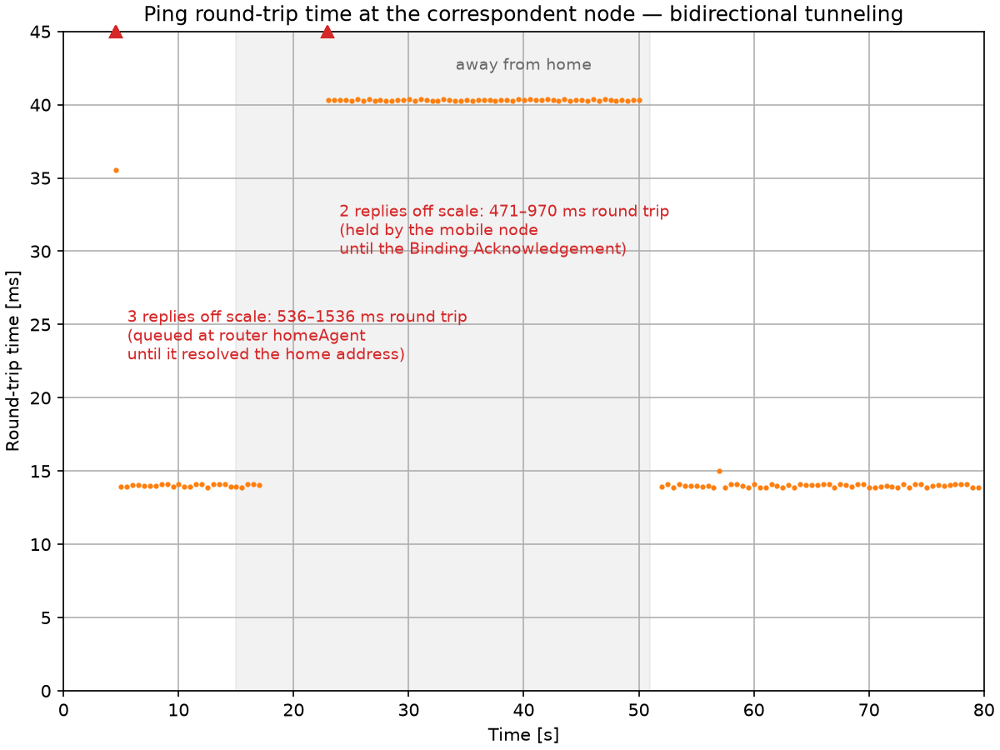

..
   FIGURE RECIPE (redo via the "inet-showcase-charts" skill)
   type:     chart (matplotlib)
   anf:      Mipv6Showcase.anf   chart "Ping round-trip time (bidirectional tunneling)"
   inputs:   results/BidirectionalTunneling-#0.vec (re-run the config first, seed-set 1)
   shows:    RTT of every ping with route optimization off: 14 ms at home, gap 17.014–21.040 s, the 40 ms tunneled plateau while away, gap 50.040–53.014 s, 14 ms at home again; "away from home" span shaded 15..51 s
   anchor:   axes are pinned (x 0..80 s, y 0..45 ms) so the three panels compare
             directly -- keep all three identical if any one is redone.
             first reply after the move ping40 at 21.040 s (40.36 ms); away median 40.34 ms (40.26–40.40), no point above 40.4 ms; last reply away ping98 at 50.040 s; first reply at home ping104 at 53.014 s. The 40 ms plateau is link-delay arithmetic (38 ms wired + wifi).
             Replies above the y range are never clipped silently: the shared chart
             script draws them as red markers on the top edge with one label.
   export:   opp_charttool imageexport Mipv6Showcase.anf -n "(bidirectional tunneling)" -f png --dpi 150
             -d doc/media   (8x6 in -> 1200x900; filename from image_export_filename)
   stamp:    captured 2026-09-29, INET HEAD aeee20a40d (topic/gy/mipv6-showcase), OMNeT++ 6.4.0aipre2

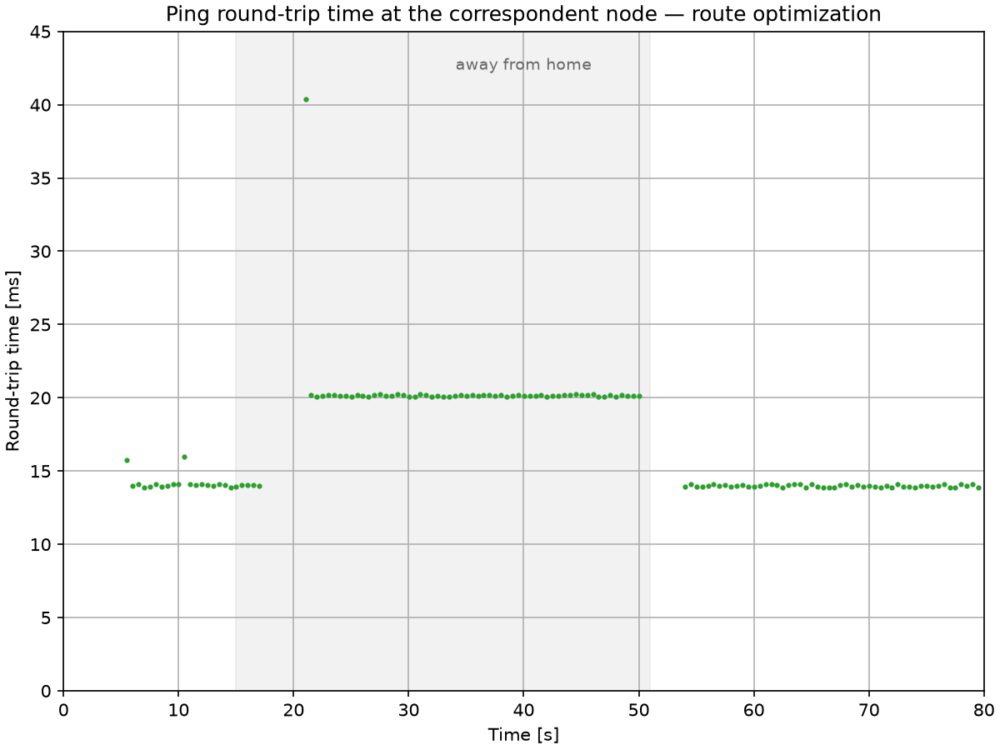

..
   FIGURE RECIPE (redo via the "inet-showcase-charts" skill)
   type:     chart (matplotlib)
   anf:      Mipv6Showcase.anf   chart "Ping round-trip time (route optimization)"
   inputs:   results/RouteOptimization-#0.vec (re-run the config first, seed-set 1)
   shows:    RTT of every ping with route optimization on: 14 ms at home, gap 17.014–21.040 s, exactly one 40 ms tunneled point (ping40), the 20 ms direct plateau from ping41, gap 50.020–54.014 s, 14 ms at home again; span shaded 15..51 s
   anchor:   axes are pinned (x 0..80 s, y 0..45 ms) so the three panels compare
             directly -- keep all three identical if any one is redone.
             the lone 40 ms point is ping40 at 21.040 s (40.36 ms); ping41 at 21.520 s is the first 20 ms point; direct median 20.16 ms (20.08–20.22); last reply away ping98 at 50.020 s; first reply at home ping106 at 54.014 s. More than one 40 ms point = route optimization completed later.
             Replies above the y range are never clipped silently: the shared chart
             script draws them as red markers on the top edge with one label.
   export:   opp_charttool imageexport Mipv6Showcase.anf -n "(route optimization)" -f png --dpi 150
             -d doc/media   (8x6 in -> 1200x900; filename from image_export_filename)
   stamp:    captured 2026-09-29, INET HEAD aeee20a40d (topic/gy/mipv6-showcase), OMNeT++ 6.4.0aipre2

With bidirectional tunneling, the pings stay on a plateau of 40.34 ms (median;
40.26–40.40 ms) for the whole stay. With route optimization, one reply at
40 ms is followed by a plateau of 20.16 ms (median; 20.08–20.22 ms). Both
plateaus match the path arithmetic in The Model. No answered ping in any
configuration needed an 802.11 retransmission.

The two forwarding modes also differ inside each packet. Here is a tunneled
ping request, captured on the home agent's backbone link and opened in Qtenv's
object inspector:

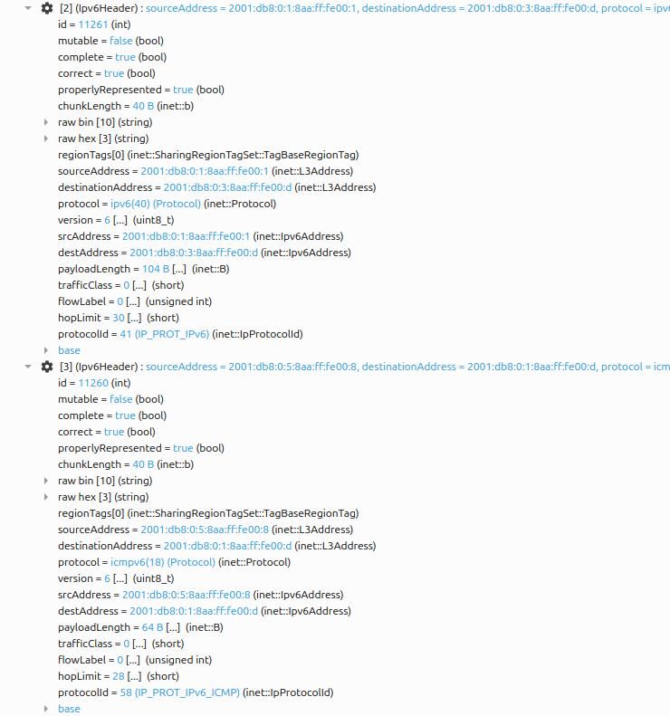

..
   FIGURE RECIPE (redo via the "omnetpp-mcp-sim" skill)
   type:     inspector
   config:   BidirectionalTunneling
   seed:     default (seed-set=1)
   shows:    IPv6-in-IPv6 on the home agent's backbone link: chunks[2] = outer
             Ipv6Header (2001:db8:0:1:8aa:ff:fe00:1 -> care-of 2001:db8:0:3:8aa:ff:fe00:d,
             protocol ipv6(40), protocolId 41) and chunks[3] = inner Ipv6Header
             (correspondent 2001:db8:0:5:8aa:ff:fe00:8 -> home 2001:db8:0:1:8aa:ff:fe00:d,
             protocol icmpv6(18), protocolId 58), each with its fields
   launch:   Qtenv with the sim's own MCP server: opp_run_release -l <wt>/src/INET -u Qtenv
             -c BidirectionalTunneling -n <wt>/src:<wt>/showcases
             '--*.visualizer.osgVisualizer.typename=""' --mcp-server-address localhost:8777
             --qtenv-default-run=0 omnetpp.ini   (port 8765 is taken by the showcase
             previewer; the OSG override is needed only while VisualizationOsg is off)
   target:   run_simulation mode=express time_limit=25.4, then mode=fast time_limit=25.52
             (stops at 25.519985, event #14747) -> list_logged_packets
             module_path=Mipv6Showcase.homeAgent name_pattern=ping49* -> the 170 B
             EthernetSignal "ping49" sent by homeAgent.eth[1] at 25.5060208 (event #14688),
             path logged:<id> (was logged:12223)
   anchor:   tunneled pings are 170 B on the HA-backbone wire (130 B + 40 B outer header)
             throughout the away phase; chunks[1] EthernetMacHeader src 0A-AA-00-00-00-02 ->
             dst 0A-AA-00-00-00-05. A single Ipv6Header = the tunnel was not up.
   capture:  open_inspector type=object -> expand_inspector_tree depth=5 ->
             get_inspector_screenshot width=1400 height=4400 -> PIL-crop (60,1776)-(800,2567):
             the chunks[2] and chunks[3] Ipv6Header rows with all their fields; 740x791.
             depth=5 unfolds raw bin/raw hex above the chunks; the crop starts below them.
             The row headers are cut at the right edge on purpose (the fields below repeat them).
   stamp:    captured 2026-09-29, INET HEAD aeee20a40d, OMNeT++ 6.4.0aipre2

The packet has two IPv6 headers. The outer header runs from the home agent
(``2001:db8:0:1:8aa:ff:fe00:1``) to the care-of address
(``2001:db8:0:3:8aa:ff:fe00:d``). The inner header is the correspondent node's
original packet, addressed to the home address. This ping is 170 bytes on
the wire; the same ping measures 130 bytes at home, so the outer header adds
40 bytes. The two
destination addresses have the same interface identifier (``8aa:ff:fe00:d``)
under different prefixes, so identity and location appear in one packet.

Here is a route-optimized ping request, recorded at the correspondent node
into a packet capture (PCAP) file and opened in Wireshark:

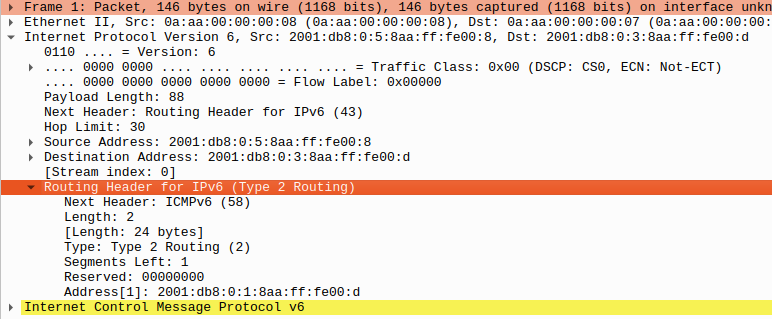

..
   FIGURE RECIPE (redo with INET's PcapRecorder + the Wireshark GUI)
   type:     wireshark GUI screenshot of the packet-detail pane
   config:   RouteOptimization   # ../omnetpp.ini
   seed:     default (seed-set=1)
   pcap:     opp_run_release ... -c RouteOptimization
             --"*.correspondentNode.numPcapRecorders=1"
             --'*.correspondentNode.pcapRecorder[0].pcapFile="results/routeopt.pcap"'
             --'*.correspondentNode.pcapRecorder[0].fileFormat="pcap"'
             --'**.fcsMode="computed"' --'**.crcMode="computed"'
             --'**.checksumMode="computed"'
             The computed modes are required (declared FCS -> empty file).
   frame:    tshark -Y 'ipv6.routing.type==2 && icmpv6.type==128' -> first match =
             frame 97 = ping41 (sent at sim 21.500012, capture-relative 21.415459);
             editcap -r routeopt.pcap frame.pcap 97  (one-frame file, shows as "Frame 1")
   gui:      Xephyr :77 -screen 1500x1150 -ac -noreset &
             env -u WAYLAND_DISPLAY QT_QPA_PLATFORM=xcb DISPLAY=:77 HOME=<tmp>
             XDG_CONFIG_HOME=<tmp>/.config wireshark -r frame.pcap
   layout:   <tmp>/.config/wireshark/recent: gui.byte_view_show: FALSE,
             gui.packet_diagram_show: FALSE (the geometry keys there are ignored with a
             warning; the window comes up 1500x900 at 0,0 anyway)
   expand:   XTest via ctypes (libXtst): click the first detail row (200,493), then
             Home, Down x2, Right (IPv6 header), Home, Down x12, Right (routing header).
   capture:  import -window root on :77, crop (0,487)-(772,806); 772x319
   anchor:   one IPv6 root with Next Header: Routing Header for IPv6 (43), destination
             2001:db8:0:3:8aa:ff:fe00:d (care-of) and Address[1]: 2001:db8:0:1:8aa:ff:fe00:d
             (home). 146 bytes.
             Keep the top "Frame 1: Packet, 146 bytes on wire" row in the crop:
             the page text cites it. No routing header = route optimization did not complete.
   stamp:    captured 2026-09-29, INET HEAD aeee20a40d, Wireshark 4.6.4
             (pixel-identical to the committed 2026-08 image: git shows no change)

There is one IPv6 header, addressed to the care-of address, and a type 2
routing header whose ``Address[1]`` field holds the home address. The routing
header adds 24 bytes instead of the tunnel's 40, and the packet takes no
detour.

Coming home
~~~~~~~~~~~

At 48 s the node starts back. The last reply while away arrives at 50.020 s
with route optimization (50.040 s with bidirectional tunneling). The following
pings still go to the care-of address, and ``apForeign`` drops each of them
after seven transmissions. The node loses the ``apForeign`` beacons at
50.721 s, scans, and is associated with ``apHome`` at 51.372 s. It sends a
Router Solicitation (RS) at once.

Now the node waits. The home agent answers with a Router Advertisement (RA)
sent by multicast, and a router may send at most one multicast Router
Advertisement every 3 s. The home agent had multicast one on the home link at
50.614 s, so its answer waits until 3 s after that, plus a random 0.207 s. It
leaves the home agent at 53.821 s, 2.45 s after the solicitation arrived, and
reaches the node at 53.822 s. In the ``BidirectionalTunneling`` run the last
multicast Router Advertisement was earlier, at 49.648 s, and the wait is
1.42 s.

This wait comes from answering by multicast. The standard also allows a router
to answer a solicitation by unicast, and a unicast answer is not held back by
the limit; common router software enables it by default. The 3 s gap itself is
the standard's default, which Mobile IPv6 allows a router serving mobile nodes
to lower. INET keeps it as a fixed value; it is not the
``minIntervalBetweenRAs`` parameter of the ini file, which sets the spacing of
the periodic advertisements.

The Router Advertisement carries the home prefix, so the node knows that it is
home. It removes its care-of address and its reverse tunnel, and it does not
run duplicate address detection (DAD). The standard forbids a node to probe its
own home address while its binding is still alive, to avoid a conflict with
the home agent, which still uses that address; because the node's Binding
Update had the L flag set, the rule covers its link-local address too. At the
same instant, the node sends the de-registration Binding Update (BU) to the home agent, with sequence
number 2 and lifetime 0. With route optimization, it sends one to the
correspondent node as well.

The home agent deletes the binding and the tunnel at 53.823 s and sends the
Binding Acknowledgement (BA), with sequence number 2 and lifetime 0, at once. A
de-registration needs no check, so there is no hold. The acknowledgement
reaches the node at 53.825 s. The node then announces its return with the
unsolicited Neighbor Advertisement described in the About section. Its purpose
is to undo the home agent's proxy Neighbor Advertisements for the home address;
INET's home agent never sends those (see the implementation notes), so here it
changes nothing. The
correspondent node deletes its binding at 53.830 s, and its Binding
Acknowledgement reaches the node at 53.837 s.

The first reply at home is the reply to ``ping106``, at 54.014 s, with a round
trip of 13.91 ms. With bidirectional tunneling, the first reply at home is the
reply to ``ping104``, at 53.014 s.

Here is the return in the ``RouteOptimization`` run as a sequence chart. It
shows only the signaling and the first ping answered at home; the pings that
still go to the care-of address are left out. The bracket marks the wait for
the Router Advertisement:

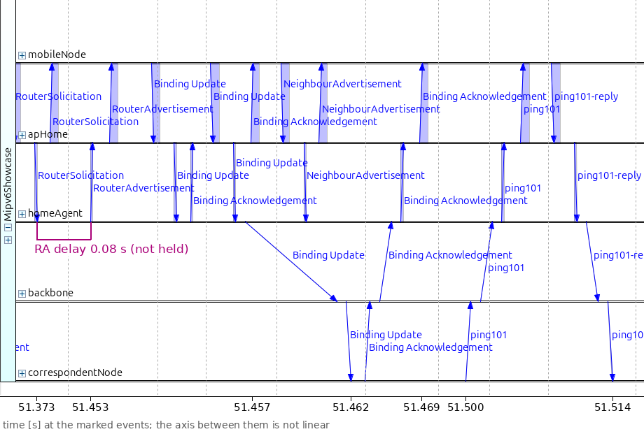

..
   FIGURE RECIPE (redo via the "omnetpp-ide-mcp" skill)
   type:     seqchart
   config:   RouteOptimization, seed-set 1, --record-eventlog=true
             --eventlog-recording-intervals=19.9s..22.1s,51.3s..54.6s (the 54.6 s end is
             needed: see filter)
   ide:      OMNeT++ IDE (omnetpp-aipre-GUI, MCP server on 127.0.0.1:5077), started with
             ~/omnetpp-aipre-GUI/ide/opp_ide -data ~/omnetpp-aipre-GUI/samples (plain opp_ide
             stops at the Choose Workspace dialog). The .elog must be inside a workspace project:
             it was copied to /home/user/inet/tmp-mipv6-seq/ (project "inet") and opened by
             absolute path.
   nav:      goto_event <first event> BEFORE zoom_to_simulation_time_range -- a bare zoom on a
             multi-interval eventlog squashes the whole log into the viewport. In NONLINEAR mode
             the zoom only sets the left edge; the scale is fixed by the event count, so the
             panel width is set with resize_window, and the right edge ends at the last
             filtered event.
   axes:     mobileNode, apHome, homeAgent, backbone, correspondentNode (apForeign and
             foreignRouter left out: their bands only showed overheard wireless copies)
   filter:   message_names RouterSolicitation, RouterAdvertisement, "Binding Update",
             "Binding Acknowledgement", NeighbourAdvertisement, ping106, ping106-reply,
             ping107 -- ping107 only gives the NONLINEAR timeline an event after the last
             wanted arrow, and is cropped away
   view:     NETWORK_COMMUNICATION, NONLINEAR; resize_window 1400x1100 (widget 1160x649);
             goto_event 28703, zoom 51.372..54.51
   anchor:   RS 51.372109 (#28703) reaches homeAgent 51.372849 (#28738); the solicited RA
             leaves homeAgent 53.821173 (#30136) -- 3 s after the HA's multicast RA of
             50.614221 plus 0.207 s; both de-registration BUs leave the MN together
             53.821936 (#30167/#30168); HA BA at the MN 53.824734, unsolicited NA
             53.824734, CN BA at the MN 53.836521; ping106 on the home path, reply at the CN
             54.013915 (#30564). Periodic RAs on the WAN links (between homeAgent and backbone at
             51.905-51.938 s, backbone -> CN at about 53.71 s) also match the RouterAdvertisement filter and
             appear inside the bracket; they are not sent to the mobile node (the IDE's
             message_expression filter could not exclude them).
   capture:  screenshot 1160x649 (raw: seqchart-raw/p6g.png) -> crop (0,62)-(1016,627): drops the
             hover box, the IDE ruler and the ping107 arrows; + tick strip -> 1016x621
   post:     bracket on the homeAgent lifeline from the RS arrival #28738 (x 40) to the RA departure
             #30136 (x 348), bar at cropped y 282 with label "RA delay 2.45 s (3 s rate limit)" above
             it; the left tick stops above the "homeAgent" axis name (name box x 28-116, y 299-312)
             in a down-pointing arrowhead; the right tick runs down to the axis. Ticks: 51.373
             (#28738), 53.821 (#30136), 53.823 (BU at the HA #30193, x 441.5), 53.830 (CN BU #30339,
             x 631.5), 54.000 (ping106 leaves the CN, x 759), 54.014 (#30564, x 919.5).
             Composition script research/analyst-data/pn.py (helpers compose.py; raw
             screenshots in research/analyst-data/seqchart-raw/): run from analyst-data/ with an
             out/ directory. Overlay font DejaVu Sans 17 px (V5). The IDE's relative ruler is cut
             off and replaced by an absolute-time strip: a tick at each anchor event's x (read from
             the arrow ends in the screenshot), labelled with the event's simulation time, and the
             note "time [s] at the marked events; the axis between them is not linear" (V1).
   stamp:    captured 2026-09-29, INET HEAD 473613b760 (model = aeee20a40d), OMNeT++ IDE 6.4.0aipre

The Router Solicitation reaches ``homeAgent`` right after the association, and
then no signaling reaches the mobile node for the length of the bracket. The
Router Advertisements drawn inside the bracket, between ``homeAgent``,
``backbone`` and ``correspondentNode``, are periodic advertisements on the
wired links; none of them reaches the mobile node. After the Router
Advertisement, the two de-registration Binding Updates leave the mobile node in
the same instant, and both acknowledgements come back within milliseconds.
The last arrows are the round trip of ``ping106`` on the home path.

The video below shows the same return: the direct path, the walk home, the
de-registration, and the pings back on the home path. After the association
with ``apHome``, the picture stays still for about 2.4 s of simulated time. The
node is at home, but its status still reads "away (route-optimized, 1 CN)",
because it is waiting for the held Router Advertisement. Then the status label
returns to "at home", the address label to the home address, and the pings
take the home path:

.. video:: media/returnhome.mp4
   :align: center

..
   VIDEO RECIPE (redo via the "video-recording" skill)
   config:   RouteOptimization
   seed:     default (seed-set=1)
   shows:    last direct pings (red route through foreignRouter) -> the walk home -> AP
             label FOREIGN -> HOME ("Associated with AP" bubble) while the status stays
             "away (route-optimized, 1 CN)" for 2.4 s (the Router Advertisement held by the
             3 s rate limit) -> status "at home", address label back to the home address
             -> ping106 and ping107 on the home path through homeAgent
   anchors:  last reply away ping98 at 50.020 s; beacon loss 50.721 s; association with
             apHome 51.372 s; HA's solicited RA 53.821 s (last multicast RA on the home
             link 50.614 s + 3 s + 0.207 s random); de-registration BUs to HA and CN at
             53.822 s, BAs at the MN 53.825 / 53.837 s; first home reply ping106 at
             54.014 s; ping107 54.514 s. If the status turns "at home" long before 53.8 s,
             the rate-limited RA no longer happens (timeline moved).
   window:   continue in the same Qtenv session after handover.mp4 (or relaunch): express
             to 49.5 s -> step 1 event -> record to 54.1 s, then record again to 54.6 s so
             the ping106 route (arrives 54.014 s) stays on screen ~2 s. Same output dir:
             numbering continues (0120-0221).
   anim:     same as handover.mp4 (playback_speed=1, min_animation_speed=0.1, built-in
             animation off via the private .qtenvrc copy)
   capture:  record_video fps=2, crop_area=with_padding; 102 frames (0120-0221);
             crop_rect was 854x732 at 884,87; frames kept in /var/tmp/mipv6-video/frames_returnhome
   encode:   ffmpeg -r 6 -start_number 120 -f image2 -i <prefix>_%04d.png -filter:v "crop=830:684:896:123"
             -vcodec libx264 -pix_fmt yuv420p <name>.mp4  (V3: the crop keeps only the canvas
             interior -- x 896-1725, y 123-806 -- so neither the green Qtenv window background nor the
             canvas border shows; 830x684, fits the 834 px column without scaling)
   post:     none
   stamp:    recorded 2026-09-29, INET HEAD 0d66eff240 (model = aeee20a40d), OMNeT++ 6.4.0aipre2

So in this run the return is barely shorter with route optimization, 3.99 s
against 4.03 s on the way out, and clearly shorter with bidirectional
tunneling, 2.97 s. The node skips both waits for duplicate address detection,
but it spends time waiting for the held multicast Router Advertisement
instead; a router that answered by unicast would not hold it back. That wait
depends on when the home agent last multicast an advertisement, so it changes
from run to run. Over ten seeds, the return takes 1.5–4.5 s with route
optimization and 2.0–4.0 s with bidirectional tunneling, against 4.0–7.5 s on
the way out, where this run is at the minimum.

The plain host of the ``WithoutMipv6`` run gets its first replies earlier in
this run, at 52.016 s. At 52.007 s the next address-resolution attempt of its
home router, ``homeAgent``, reaches the host, and the router sends the pings it
held. The replies find their way back because the host has already received
the router's Router Advertisement, at 51.469 s, which replaced the foreign
router as its default router; the router had sent no multicast Router
Advertisement in the previous 3 s, so this one was not held back. In runs where
it is held back, the host answers the pings but sends the replies toward the
foreign router, and they are lost until the advertisement arrives. Which kind of host is answered first after
the return depends on the run; Mobile IPv6 gives no advantage here. Back home,
all three runs return to the 14 ms plateau.

What the handover costs
~~~~~~~~~~~~~~~~~~~~~~~

Where do the 4.03 s of the outbound outage go? The steps above give the terms,
and each term is either a protocol timer or a value of this scenario:

.. list-table::
   :header-rows: 1
   :widths: 50 15 35

   * - Term
     - Time
     - Kind
   * - Out of range, still associated with ``apHome``
     - 0.743 s
     - scenario value (802.11 beacon loss)
   * - Scan and association
     - 0.651 s
     - scenario value (scan settings, two channels)
   * - Wait for the Router Advertisement
     - 0.459 s
     - protocol timer (random, up to 0.5 s)
   * - Duplicate address detection on the new link
     - 1.057 s
     - protocol timer (1 s, plus a random part)
   * - Binding Update, the home agent's hold, Binding Acknowledgement
     - 1.043 s
     - protocol timer (1 s hold, first registration only) plus 43 ms of network
       path
   * - Next ping and its round trip
     - 0.074 s
     - measurement granularity (0.5 s ping interval)
   * - **Total**
     - **4.026 s**
     -

The protocol timers (the wait for the Router Advertisement, duplicate address
detection, and the home agent's hold) take 2.52 s. The two waits tied to
duplicate address detection (DAD), the node's own check and the home agent's
hold, alone take 2.06 s, more than half of the outage. The scenario values, the time 802.11 takes to notice the lost access
point, to scan and to associate, take 1.39 s. The network paths take 43 ms,
and the rest comes from the 0.5 s spacing of the pings.

A measured 802.11 testbed (Cabellos-Aparicio et al., 2005) found a mean
Mobile IPv6 handover of 2.1 s, 87 % of it in the IPv6 phase; it had no wait at
the home agent and started timing at the scan.

Sources: :download:`omnetpp.ini <../omnetpp.ini>`,
:download:`Mipv6Showcase.ned <../Mipv6Showcase.ned>`,
:download:`movement.xml <../movement.xml>`

Try It Yourself
---------------

If you already have INET and OMNeT++ installed, start the IDE by typing
``omnetpp``, import the INET project into the IDE, navigate to the
``inet/showcases/ipv6/mipv6`` folder in the `Project Explorer`, and double-click the
``omnetpp.ini`` file to open it. Select a configuration and press **Run**.

If you don't have INET and OMNeT++ installed, you can quickly set them up
using `opp_env <https://omnetpp.org/opp_env>`__, and run the simulation
interactively. Ensure that ``opp_env`` is installed on your system, then
execute:

.. code-block:: bash

    $ opp_env run inet-4.7 --init -w inet-workspace --install --build-modes=release --chdir \
       -c 'cd inet-4.7.*/showcases/ipv6/mipv6 && inet'

This command creates an ``inet-workspace`` directory, installs the appropriate
versions of INET and OMNeT++ within it, and launches the ``inet`` command in the
showcase directory for interactive simulation.

Alternatively, for a more hands-on experience, you can first set up the
workspace and then open an interactive shell:

.. code-block:: bash

    $ opp_env install --init -w inet-workspace --build-modes=release inet-4.7
    $ cd inet-workspace
    $ opp_env shell

Inside the shell, start the IDE by typing ``omnetpp``, import the INET project,
then start exploring.

Discussion
----------

Use `this page <https://github.com/inet-framework/inet-showcases/issues/TODO>`__ in
the GitHub issue tracker for commenting on this showcase.

.. TODO: create the tracker issue for this showcase and replace the link above

The handover outage in this showcase is set mostly by protocol timers. The
standard's default timers, added to this scenario's 802.11 times and ping
spacing, predict about 3.9 s without the random delay before duplicate address
detection and about 4.4 s with it. For a care-of address, the Mobile IPv6
standard prefers the variant without the random delay; INET applies the delay.
Neither value reaches the 7.0–7.5 s of the longest runs, which come from the
limit on multicast Router Advertisements.

A measured 802.11 testbed (Cabellos-Aparicio et al., 2005) shows the same
picture. Its IPv6 phase, 1.84 s on average, is close to this run's Router
Advertisement wait and duplicate address detection together, 1.52 s. The
testbed spent that phase on duplicate address detection and on Neighbor
Unreachability Detection, which finds out that the old router no longer
answers; this run detects the move from the link layer instead. The rest of
the gap between the testbed's 2.1 s and this run's 4.03 s comes from three
things the testbed did not have: the home agent's 1 s first-registration
check, the 0.74 s the node stays associated with an access point it can no
longer hear, and the 0.5 s spacing of the pings.

The 802.11 terms of this scenario are long. With fast roaming (IEEE 802.11k and
802.11r), a node changes access points in about 50 ms or less, which leaves
the protocol timers as an even larger share of the outage.

Optimizations such as Optimistic Duplicate Address Detection (RFC 4429) let a
node use a new address while the check still runs. This removes the mobile
node's own wait, about 1.06 s here, but not the home agent's 1 s check before
a first registration, which the standard requires separately.

Route optimization does not shorten the outage. The standard lets the Binding
Update to the correspondent node go only after the home agent has acknowledged
the home registration, so the direct path can start only after the tunnel
works. The gain of route optimization is on the path afterward, 20 ms instead
of 40 ms. That gain comes from where the home agent sits in this network, 5 ms
off the backbone; with a home agent close to the correspondent node, the gain
shrinks.

The two modes also cost differently per packet. The tunnel adds 40 bytes to
every packet, so on a path that carries 1500-byte packets, the node can send
packets of at most 1460 bytes without fragmentation. Route optimization adds
only 24 bytes, but in IPv6 extension headers, which some networks filter out.

In practice, the pattern of the ``BidirectionalTunneling`` run, an anchor that
keeps the node's address and a tunnel to wherever the node is, is what mobile
operator networks, Wi-Fi calling and enterprise Wi-Fi controllers use, under
other names and protocols. In those systems the network, not the node, sends
the registration, and the node keeps its address on the new link. So the
address-change terms of this showcase, the Router Advertisement wait and
duplicate address detection, do not occur there; what carries over is the
anchor, the tunnel, its detour and its per-packet overhead. Route optimization
did not spread. It needs support in every correspondent node, firewalls and
filters on some paths drop its headers, and it reveals the node's location to
each correspondent node it route-optimizes with. End hosts that need their
sessions to survive a change of network more often solve this in the
transport layer, with Multipath TCP or QUIC connection migration.
