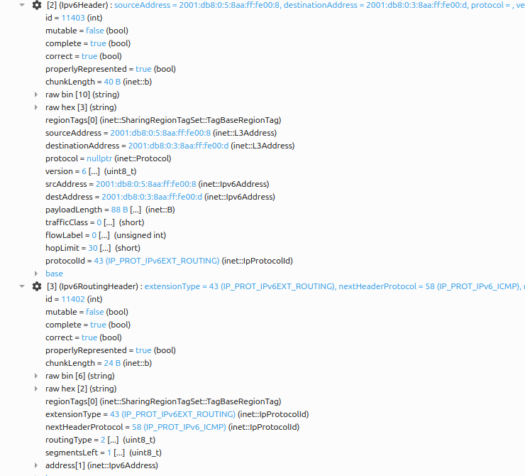
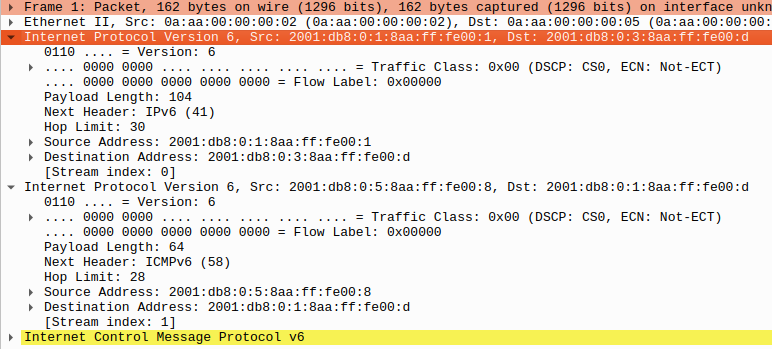

Mobile IPv6
===========

Goals
-----

An IPv6 address plays two roles at once: routers treat it as a *location* (the
prefix says which link the node is on), and transport connections treat it as
an *identity* (a connection is pinned to the address pair). When a device moves
to a network with a different prefix, it gets a new, routable address — but
nobody can reach it at the address they know, so its open connections stall
until it comes back.

Mobile IPv6 (RFC 6275) solves this by splitting the two roles into two
addresses, anchored by a *home agent*. This showcase demonstrates the whole
mechanism in one scenario: a wireless node moves from its home network to a
foreign one and back, while a peer keeps pinging it at its stable address.
Without Mobile IPv6 the node cannot be reached while it is away; with it, the
traffic keeps flowing — first through a tunnel, then, with route optimization,
on the direct path.

| Verified with INET version: ``TODO``
| Source files location: `inet/showcases/ipv6/mipv6 <https://github.com/inet-framework/inet/tree/master/showcases/ipv6/mipv6>`__

.. todo::

   The showcase needs INET source changes that are not in any release yet: ac1db6c244 (a ``WirelessHost6`` mobile node without Mobile IPv6), 8b08688968 and 7e6083f7f1 (the first-registration Binding Update timer, pull request #1134), 979eb60440 (pull request #1152), aeee20a40d (Mobile IPv6 signaling addressed to the next hop), and pull requests #1247, #1195, #1141, #1183, #1157 and #1260. Without them the
   ``WithoutMipv6`` configuration still runs Mobile IPv6 and the registration
   takes two Binding Updates. Fill in the version above, and change the
   ``inet-4.7`` release in the Try It Yourself ``opp_env`` commands, once a
   release contains them.

About Mobile IPv6
-----------------

Terminology
~~~~~~~~~~~

Mobile IPv6 is dense with abbreviations, so here is the cast of characters:

- **Mobile node (MN)** — the device that moves between networks.
- **Home network** — the network hosting the mobile node's permanent address;
  "home" means an administrative relationship (a campus network, an ISP), not
  a physical place.
- **Home address (HoA)** — the mobile node's stable address, formed from the
  home network's prefix. This is the identity: applications bind to it, and
  peers use it to reach the mobile node, wherever it is.
- **Care-of address (CoA)** — the temporary address the mobile node gets in
  whatever network it is visiting. This is the location; it changes with every
  move.
- **Home agent (HA)** — a function on a router on the home link. It stands in
  for the mobile node while it is away.
- **Correspondent node (CN)** — simply the peer the mobile node talks to: a
  server, another host, anything. It can be anywhere in the internet, and it
  needs Mobile IPv6 support only if it takes part in route optimization.
- **Binding** — the association between a home address and a care-of address,
  valid for a limited lifetime; creating, refreshing and deleting bindings is
  what all Mobile IPv6 signaling does.

The mobile node acquires both of its addresses by *stateless address
autoconfiguration* (SLAAC): routers periodically multicast Router
Advertisements carrying the link's prefix (a freshly attached host solicits
one immediately with a Router Solicitation), the host appends an interface
identifier of its own making, and the address is ready — no server involved.
This is what makes mobility work in networks that have never heard of the
mobile node: it can build itself a care-of address anywhere.

An address built that way is a guess until it is checked, so the host may not
use it yet — the standard calls such an address *tentative* — and runs
*duplicate address detection* (DAD, RFC 4862): it multicasts a *Neighbor
Solicitation* naming that very address and waits. A Neighbor Solicitation is
the question IPv6's *Neighbor Discovery* protocol asks about an address — the
replacement for the ARP request — and a *Neighbor Advertisement* is the answer
to it. Silence means the address is free and becomes usable; an answer means
the guess collided and the address must be abandoned. Nothing may be sent from
an address still being checked, and the wait is a fixed timeout rather than a
round trip, so a host arriving on a new link pays duplicate address detection
in full before it can do anything — which is why it dominates the handover
outage measured below.

What happens on a move
~~~~~~~~~~~~~~~~~~~~~~

When the mobile node (MN) walks out of its home network into a foreign one:

1. **Layer 2 handover** — the wireless interface re-associates with the new
   access point.
2. **Movement detection** — a Router Advertisement on the new link reveals an
   unfamiliar prefix: "I have moved."
3. **Care-of address formation** — normal SLAAC on the new link. Before the
   node uses its new addresses, duplicate address detection checks both its
   link-local address and the new care-of address; the two checks may run at
   the same time.
4. **Registration** — the mobile node sends a *Binding Update (BU)* to its
   home agent (HA): "my home address is now reachable at this care-of
   address, for this lifetime." The home agent confirms with a *Binding
   Acknowledgement (BA)*. Every Binding Update carries a sequence number
   that counts up, and the acknowledgement echoes the number of the update it
   answers; each end discards anything below the highest number it has already
   seen as stale, which is how a retransmission is told apart from a newer
   registration. No security handshake is needed here — the mobile
   node and its home agent trust each other by prior arrangement (the standard
   protects this signaling with an IPsec association set up in advance).
5. **Delivery resumes** — the home agent now intercepts every packet addressed
   to the home address and forwards it to the care-of address inside an
   IPv6-in-IPv6 tunnel: it wraps the whole original packet inside a new one
   addressed to the care-of address, and the mobile node unwraps
   (decapsulates) it again. The mobile node sends its own traffic back through
   the same tunnel in reverse.

Bindings are soft state: they expire unless the mobile node refreshes them
with further Binding Updates, so a crashed or vanished mobile node simply ages
out of the home agent's *binding cache* (the table of home address → care-of
address mappings).

Why must the reverse direction also be tunneled, instead of the mobile node
answering the correspondent node directly? Ingress filtering: a packet leaving
the foreign network with a home-network source address looks spoofed and gets
dropped. So base Mobile IPv6 is *bidirectional tunneling* — both directions
detour through the home agent, and the correspondent never learns that its
peer moved.

On the home link itself, the home agent impersonates the absent mobile node:
it answers Neighbor Solicitations for the home address (the IPv6 equivalent of
an ARP request — "the node that *is* this address: report your MAC") with its
own MAC address, so frames for the home address land on it. This is proxy
Neighbor Discovery — the same mechanism an attacker would call address
spoofing, used here with authorization. While the mobile node is at home, the
home agent does nothing at all.

Route optimization
~~~~~~~~~~~~~~~~~~

The tunnel detour costs latency (the path stretches through the home network)
and 40 bytes of outer header per packet. *Route optimization* removes both:
the mobile node registers its binding directly with the correspondent node
(CN), after which packets flow on the direct path in both directions — the
home agent drops out entirely.

The interesting part is security. A forged "I moved, send my traffic here"
would be a session-hijacking primitive, and correspondent and mobile node are
strangers — there is no pre-arranged trust to lean on. Mobile IPv6's answer is
the *return-routability procedure*, which is pure authentication and carries
no routing information at all:

- The mobile node sends two probes to the correspondent node: a *Home Test
  Init (HoTI)* routed through the home-agent tunnel, and a *Care-of Test Init
  (CoTI)* sent directly.
- The correspondent node returns a token to each source: a *Home Test (HoT)*
  via the home agent, and a *Care-of Test (CoT)* on the direct path.
- Only a node reachable at **both** the home address and the care-of address
  collects both tokens, and only their combination yields the key that
  authenticates the *Binding Update* to the correspondent node.

Note the built-in ordering: the mobile node sends the Home Test Init and the
Care-of Test Init at the same time, but the home half travels through the home
agent, so the mobile node must first have sent its Binding Update to the home
agent. The Care-of Test half needs no home agent. The tokens are
deliberately short-lived (three and a half minutes; the binding they authorize
at a correspondent node lasts at most seven), so long sessions re-run the
procedure periodically; a correspondent can also prompt a refresh with a
*Binding Refresh Request*.

After route optimization, packets carry both addresses: the care-of address
where routers look, and the home address in an extension header — a *type 2
routing header* toward the mobile node, a *Home Address destination option*
from it. The network layer swaps the home address back in at each end, so
transport connections stay pinned to the stable home address and never notice
that the packets took a different path.

Route optimization is optional, per correspondent. A mobile node may prefer
tunneling on purpose: route optimization reveals the care-of address — that
is, the mobile node's current location — to every correspondent, while
tunneling hides it behind the home agent.

When the mobile node returns home, it de-registers: a Binding Update with
lifetime zero deletes the binding at the home agent and at every correspondent
node, the tunnel disappears, and the home agent stops answering for an address
whose owner is back. The mobile node then announces its return on the home
link with an unsolicited Neighbor Advertisement, so its neighbors switch
their caches back to it immediately instead of waiting to re-resolve the
address. Everything collapses to plain IPv6.

A final property worth noticing: only the mobile node, its home agent, and
(optionally) the correspondent nodes know that mobility is happening. The
visited network sees an ordinary host with an ordinary local address; every
router in between forwards ordinary IPv6 packets.

Mobile IPv6 in INET
-------------------

INET implements the mobile node, home agent, and correspondent node roles of
RFC 6275 in the ``Mipv6`` module, an optional submodule of the IPv6 network
layer. The ``hasMipv6`` parameter of ``Ipv6NetworkLayer`` creates that module,
together with the two data modules it works with.

Which role a node plays is decided by two boolean parameters on ``Mipv6``:
``isMobileNode`` and ``isHomeAgent``. They are not three switches for three
roles. They select between two kinds of memory. A mobile node keeps a
*Binding Update List*, the record of the bindings it has registered
elsewhere. Every other Mobile IPv6 node keeps a *Binding Cache*, the record of
bindings it holds for others. A node that sets neither flag is a
correspondent node: it does not select that role, it falls through to it.

What each role does follows from that. The mobile node registers. It forms a
care-of address, sends the Binding Update, and runs the return-routability
exchange. The home agent answers. It acknowledges every Binding Update, holds
the binding, and builds the tunnel to the care-of address. A correspondent
node only accepts a binding and answers the return-routability test. No node
type sets both flags.

A model rarely sets the flags itself. The four node types below are ordinary
IPv6 nodes that switch Mobile IPv6 on and then fix them, so choosing a node
type chooses a role:

- ``WirelessHost6`` — a ``StandardHost6`` with one wireless interface, in the
  mobile-node role. This is the node that moves.
- ``MobileHost6`` — the same role on a wired host (not used here).
- ``HomeAgent6`` — a ``Router6`` in the home-agent role.
- ``CorrespondentNode6`` — a ``StandardHost6`` that is neither a mobile node
  nor a home agent. It differs from a plain ``StandardHost6`` in nothing but
  the presence of the Mobile IPv6 modules, and that presence is what lets it
  accept a binding and take part in route optimization.

The screenshot below shows the mobile node's IPv6 network layer. Mobile IPv6
is not a separate protocol layer: the ``mipv6`` module sits beside ``ipv6``,
``icmpv6``, and ``neighbourDiscovery`` and implements the mobility signaling,
with two data modules — ``buList`` (the mobile node's record of bindings it
has registered elsewhere) and ``bindingCache`` (bindings this node holds for
others) — beside it. The entire protocol footprint is visible in this one
image:

.. figure:: media/networklayer.png
   :align: center

..
   FIGURE RECIPE (redo via the "omnetpp-mcp-sim" skill)
   type:     canvas
   config:   RouteOptimization   # ../omnetpp.ini
   seed:     default (seed-set=1)
   shows:    Ipv6NetworkLayer interior of mobileNode: mipv6 beside ipv6/icmpv6/
             neighbourDiscovery, plus buList + bindingCache
   anchor:   structural (t=0..12s, any time before handover). If the submodule
             set differs, Ipv6NetworkLayer or the mipv6 integration changed.
   capture:  set_canvas_view zoom=1.0 -> get_canvas_image module_rectangle
             margin=5 on Mipv6Showcase.mobileNode.ipv6; was 968x615. Known
             blemish: routingTable status text overlaps configurator label
             (the module's own layout).
   stamp:    captured 2026-08, INET 4.7

Every tunable parameter lives in the ``mipv6`` module:

- ``isMobileNode`` and ``isHomeAgent`` — the two role flags, fixed by the node
  type as described above.
- ``useRouteOptimization`` (default ``true``) — route-optimize with
  correspondent nodes, or always tunnel through the home agent.
- ``maxHaBindingLifeTime`` (default 3600 s) — the ceiling on a home
  registration.
- ``maxRrBindingLifeTime`` (default 420 s) — the ceiling on a binding held at
  a correspondent node.

One level up, ``hasMipv6`` on ``Ipv6NetworkLayer`` decides whether these
modules exist at all. The same network layer also has a ``hasPmipv6``
parameter for Proxy Mobile IPv6 (RFC 5213), a different approach in which the
network moves the node and the mobile node runs no mobility software of its
own. This showcase does not use it.

Neither lifetime expires inside this showcase's 80 second run, but a study of
re-registration reaches the 420 second one first. ``Mipv6`` also emits two
signals a study can record: ``mipv6RoCompleted`` when route optimization
finishes, and ``packetDropped``. The losses that the Results section walks
through happen at the access points, not in ``Mipv6``, and emit no ``Mipv6``
drop signal.

Configuration notes:

- ``hasMipv6`` (on the node's ``ipv6`` submodule) creates or omits the whole
  Mobile IPv6 footprint. The ``WithoutMipv6`` configuration sets it to
  ``false`` on the mobile node, which leaves an ordinary wireless IPv6 host
  and is how this showcase measures what mobility support is worth.
- ``useRouteOptimization`` on the mobile node is what separates two of the
  three configurations: the same scenario runs both ways with this one flag.
- Movement detection does not depend on frequent Router Advertisements: on
  every layer-2 association the IPv6 neighbour discovery module immediately
  sends a Router Solicitation (its ``detectL2Movement`` parameter, default
  ``true``), so the mobile node never waits for a periodic advertisement.
- The mobile node autoconfigures its addresses, so the address configurator
  must leave hosts alone: the network sets ``assignAddressesToHosts = false``
  on the ``Ipv6NetworkConfigurator``, which then assigns addresses and routes
  to routers only. The home agent is recognized from its Router
  Advertisements (via the home-agent flag the standard defines for them),
  which is how the mobile node learns its home agent's address — at home,
  before ever leaving. The standard's remote-discovery mechanisms are not
  modeled, so a mobile node must start the simulation in its home network.

Implementation notes and simplifications, so the simulation is read for what
it is:

- The IPsec protection that RFC 6275 mandates between mobile node and home
  agent is not modeled (standard practice in simulation).
- The return-routability *message exchange* — sequence, paths, sizes, timing,
  and the mobile node's periodic token refresh — is faithful, but the
  cryptographic content is schematic: the tokens are constants rather than
  keyed, nonce-indexed values, and the correspondent never invalidates them.
- The home agent intercepts traffic by virtue of being the home network's
  router; answering Neighbor Solicitations on behalf of the absent mobile
  node (proxy Neighbor Discovery) is not implemented. In this scenario the
  distinction is invisible — no other host lives on the home link — but a
  host on the home link could not reach an away mobile node.

  .. todo::

     The home agent now runs duplicate address detection on the home address
     before it acknowledges a first registration (pull request #1195), but it
     still neither announces its claim with a multicast Neighbor Advertisement
     nor answers Neighbor Solicitations for the away mobile node. This part of
     gap 1 of MIPV6_IMPLEMENTATION_GAPS.md was not filed as of 2026-08-27.

- Before it acknowledges a first registration, the home agent runs duplicate
  address detection on the mobile node's home address on the home link, as the
  standard requires. It creates the binding and the tunnel as soon as the
  Binding Update arrives, and sends the acknowledgement when the check
  completes.
- Until that acknowledgement lands the mobile node's reverse tunnel is not up,
  so the node holds the packets it sends from its home address — ping replies,
  and the first Home Test Init of route optimization — and sends them through
  the reverse tunnel as soon as the acknowledgement arrives. It does not emit a
  packet whose home-address source would look spoofed outside the home network
  — its private version of the ingress filtering discussed earlier. The held
  replies arrive late instead of being lost.
- The mobile node waits 1.5 s for the acknowledgement of a first home
  registration before it retransmits the Binding Update. This is the standard's
  first-registration timeout (InitialBindackTimeoutFirstReg), chosen to leave
  the home agent time for its duplicate address detection. The acknowledgement
  arrives about one second after the Binding Update (1.05 s in the run shown),
  so the home registration takes one Binding Update, and the binding cache
  records sequence number 1.
- After a move, the mobile node runs duplicate address detection first on its
  link-local address and then on its new care-of address, one after the other;
  the standard requires both checks and allows them to run at the same time.
  Before each probe the node waits a random delay, as RFC 4862 describes.
- Routers in this network have ICMPv6 Redirect generation disabled
  (``sendRedirects = false``). A router sends a Redirect when it forwards a
  packet back out of the very interface that packet arrived on, to tell the
  sender about a better first hop. Traffic intercepted *toward* the mobile node
  never meets that condition — it is steered into the tunnel before the
  forwarding check. The way back does: after decapsulating a reverse-tunneled
  reply, the home agent forwards the inner packet out of the very interface the
  tunneled packet arrived on, and would send a useless Redirect to the mobile
  node's home address on every reply. A real stack attributes decapsulated
  packets to the tunnel interface instead; the flag stands in for that
  difference.

The Model
---------

The network puts the three Mobile IPv6 locations in three corners: a home
network (``apHome`` + ``homeAgent``), a foreign network (``apForeign`` +
``foreignRouter``), and a correspondent node, all meeting at a backbone
router:

.. figure:: media/network.png
   :align: center

..
   FIGURE RECIPE (redo via the "omnetpp-mcp-sim" skill)
   type:     canvas
   config:   RouteOptimization   # ../omnetpp.ini
   seed:     default (seed-set=1)
   shows:    topology + the mobile node associated at home ("AP: HOME/at home"
             status label, green SLAAC address label on the right)
   anchor:   t=12s: associated, SLAAC done, label shows the home address
             2001:db8:0:1:8aa:ff:fe00:d. If the address differs, the MAC
             assignment order changed -> re-pin destAddr in the ini too.
   capture:  express-run to 12s -> set_canvas_view fit (zoom ~1.106) ->
             get_canvas_image module_rectangle margin=5; was 844x722. A route
             visualizer arrow may still be fading at some capture times;
             capture at ~12.2s (mid ping interval) for a clean shot.
   stamp:    captured 2026-08, INET 4.7

The status text above the mobile node is live: it shows the associated
SSID and the mobility state (at home / away / route-optimized), and the green
label on the right is its current IP address. Both update as the
simulation runs. Note that the foreign network's router is a plain
``Router6`` — the visited network needs no Mobile IPv6 support at all, just
as promised above.

The WAN link delays are the scenario's one deliberate design choice: 5 ms
between home agent and backbone, 8 ms between foreign router and backbone,
1 ms to the correspondent node. Real mobility spans real distances, and these
delays make each forwarding mode land at a distinct, predictable round-trip
time — the sum of the link delays along its path:

.. literalinclude:: ../Mipv6Showcase.ned
   :start-at: connections:
   :end-at: correspondentNode.ethg
   :language: ned

Predicted round-trip times, adding up the link delays along each path (the
access LANs' 0.1 µs is too small to matter):

- **at home**: 2 × (1 + 5) = 12 ms
- **tunneled**: 2 × (1 + 5) + 2 × (5 + 8) = 38 ms — every packet crosses the
  backbone twice, once to the home agent and once through the tunnel
- **route-optimized**: 2 × (1 + 8) = 18 ms

Those are the wired links only. The wireless hop is crossed twice per round
trip — once carrying the request to the mobile node, once carrying the reply
back — and each crossing costs about 1 ms: at 2 Mbps a ping frame takes that
long to clock out, plus the wait for a free channel. Adding the resulting 2 ms
gives the three plateaus the Results section measures: 14 ms at home, 40 ms
tunneled, 20 ms route-optimized.

Note that the route-optimized value is below anything a path through the home
agent could achieve: even the cheapest conceivable detour — out through the
tunnel (1 + 5 + 5 + 8 = 19 ms) and straight back (8 + 1 = 9 ms) — costs 28 ms
in link delays alone. Measuring 20 ms is proof by arithmetic that the home
agent is out of the loop.

The mobile node's movement has three acts (``movement.xml``): it dwells at
home for 15 s, dashes to the foreign network in 3 s, dwells there for 30 s,
and returns the same way, settling at home for the rest of the 80 s run. The
two access points operate on different wireless channels, and the mobile node
scans both.

Throughout the run, the correspondent node pings the mobile node's *home
address* every 0.5 s — the address is hardcoded in the ini file because it is
the stable identity a peer would know (it is also predictable: the home
prefix plus the interface identifier derived from the mobile node's MAC
address):

.. literalinclude:: ../omnetpp.ini
   :start-at: correspondentNode.numApps
   :end-at: app[0].startTime
   :language: ini

The mobile node is a ``WirelessHost6`` in all three configurations below.
They differ only in whether its Mobile IPv6 (MIPv6) engine is present at all
and, when it is, whether route optimization is enabled; everything else —
network, movement, traffic — is identical.

WithoutMipv6 configuration
~~~~~~~~~~~~~~~~~~~~~~~~~~

.. literalinclude:: ../omnetpp.ini
   :start-at: [Config WithoutMipv6]
   :end-at: hasMipv6
   :language: ini

Setting ``hasMipv6 = false`` removes the ``mipv6`` module from the mobile
node's IPv6 network layer, leaving an ordinary wireless IPv6 host. It
associates with the foreign access point and stateless address
autoconfiguration (SLAAC) gives it a perfectly good new address — but nobody
sends anything to that address. The pings keep targeting the old (home)
address, which now leads to a network where nobody answers Neighbor
Solicitations for it. Every ping from the moment it leaves home coverage
until it walks back is lost. This is the problem Mobile IPv6 (MIPv6) exists
to solve, measured.

BidirectionalTunneling configuration
~~~~~~~~~~~~~~~~~~~~~~~~~~~~~~~~~~~~

.. literalinclude:: ../omnetpp.ini
   :start-at: [Config BidirectionalTunneling]
   :end-at: useRouteOptimization
   :language: ini

The mobile node runs Mobile IPv6 with route optimization switched off — the
base protocol, nothing else. After the handover it registers its care-of
address with the home agent, and the pings resume: into the home network,
intercepted by the home agent, tunneled to the care-of address, answered
through the reverse tunnel. The round-trip time settles on the tunneling
plateau (~40 ms) for the whole stay abroad.

RouteOptimization configuration
~~~~~~~~~~~~~~~~~~~~~~~~~~~~~~~

.. literalinclude:: ../omnetpp.ini
   :start-at: [Config RouteOptimization]
   :end-at: useRouteOptimization
   :language: ini

The configuration states ``useRouteOptimization`` explicitly so that the one
parameter separating this scenario from the previous one is visible in both
listings. The first tunneled ping that reaches the mobile node triggers the
return-routability procedure with the correspondent node, the Binding Update
installs a binding there, and once that registration completes, the traffic
takes the direct path (~20 ms) — until the return home tears everything down
again.

Results
-------

The round-trip time of every ping tells the whole story. The three
configurations are plotted separately on identical axes, so the phases can be
compared panel by panel; the shaded band marks the interval the mobile node
spends away from its home network.

.. figure:: media/pingrtt-without.png
   :align: center

..
   FIGURE RECIPE (redo via the "inet-showcase-charts" skill)
   type:     chart (matplotlib)
   anf:      Mipv6Showcase.anf   chart "Ping round-trip time (without Mobile IPv6)"
   inputs:   results/WithoutMipv6-#0.vec (re-run the config first, seed-set 1)
   shows:    RTT of every ping in the WithoutMipv6 config: the 14 ms home plateau, no reply from 17.014 s to 52.016 s, then four queued replies off scale (drawn as red markers on the top edge, labelled with their real RTTs) and the home plateau again; "away from home" span shaded 15..51 s
   anchor:   axes are pinned (x 0..80 s, y 0..45 ms) so the three panels compare
             directly -- keep all three identical if any one is redone.
             first reply ping9 at 5.516 s (15.77 ms); last reply before the move ping32 at 17.014 s; first reply after the return ping98 at 52.016 s (2015.8 ms, off scale); off-scale label reads "4 replies off scale: 524–2016 ms round trip (queued at router homeAgent)"; ping102 at 52.025 s (24.6 ms) is on scale. If the marker/label is missing or the count differs, the return timing changed.
             Replies above the y range are never clipped silently: the shared chart
             script draws them as red markers on the top edge with one label.
   export:   opp_charttool imageexport Mipv6Showcase.anf -n "(without Mobile IPv6)" -f png --dpi 150
             -d doc/media   (8x6 in -> 1200x900; filename from image_export_filename)
   stamp:    captured 2026-09-29, INET HEAD aeee20a40d (topic/gy/mipv6-showcase), OMNeT++ 6.4.0aipre2; off-scale label re-rendered 2026-09-29 (G5 r3: "queued at router homeAgent")

Without Mobile IPv6 the node is unreachable the whole time it is away — no
replies at all for 37.5 s (34.5–37.5 s over ten seeds), resuming only when it
re-enters home coverage on the way back. Its home address means nothing on the
foreign link. The three markers on the top edge at about 4.5 s appear in all
three charts: at boot the router ``homeAgent`` holds the first pings while the
mobile node is still checking its home address, and their replies arrive 0.5 to
1.5 s late.

.. figure:: media/pingrtt-bidirectional.png
   :align: center

..
   FIGURE RECIPE (redo via the "inet-showcase-charts" skill)
   type:     chart (matplotlib)
   anf:      Mipv6Showcase.anf   chart "Ping round-trip time (bidirectional tunneling)"
   inputs:   results/BidirectionalTunneling-#0.vec (re-run the config first, seed-set 1)
   shows:    RTT of every ping with route optimization off: 14 ms at home, gap 17.014–21.040 s, the 40 ms tunneled plateau while away, gap 50.040–53.014 s, 14 ms at home again; "away from home" span shaded 15..51 s
   anchor:   axes are pinned (x 0..80 s, y 0..45 ms) so the three panels compare
             directly -- keep all three identical if any one is redone.
             first reply after the move ping40 at 21.040 s (40.36 ms); away median 40.34 ms (40.26–40.40), no point above 40.4 ms; last reply away ping98 at 50.040 s; first reply at home ping104 at 53.014 s. The 40 ms plateau is link-delay arithmetic (38 ms wired + wifi).
             Replies above the y range are never clipped silently: the shared chart
             script draws them as red markers on the top edge with one label.
   export:   opp_charttool imageexport Mipv6Showcase.anf -n "(bidirectional tunneling)" -f png --dpi 150
             -d doc/media   (8x6 in -> 1200x900; filename from image_export_filename)
   stamp:    captured 2026-09-29, INET HEAD aeee20a40d (topic/gy/mipv6-showcase), OMNeT++ 6.4.0aipre2

Bidirectional tunneling restores reachability, at the cost of a detour. After a
6.0 s outage replies resume on the 40 ms plateau and stay there, every packet
taking the long way through the home agent. The first two replies arrive 0.97 s
and 0.47 s late, off scale: the mobile node held them until its binding was
active.

Where those seconds go, from this run's event log — the last reply at home
arrives at t = 17.014 s, the first tunneled one at t = 22.970 s:

- **0.39 s** — the ping spacing, not the handover: the node still hears
  ``apHome`` until 17.407 s, but the next ping is due only at 17.5 s.
- **0.35 s** — still associated with the home access point, already out of
  range: the node declares the access point lost after 3.5 beacon intervals
  without a beacon (0.1 s each; the 3.5 is fixed in INET). The requests sent
  from 17.5 s on are simply lost.
- **0.65 s** — scanning both channels, then authenticating and associating with
  ``apForeign``.
- **0.45 s** — waiting for a Router Advertisement on the new link, which
  reveals the unfamiliar prefix; the router delays its answer by a random time
  of up to 0.5 s.
- **1.90 s** — duplicate address detection on the link-local address: the node
  waits a random 0.90 s, sends the probe, and then waits 1 s for an answer, as
  RFC 4862 describes. The home address is tentative meanwhile.
- **1.15 s** — duplicate address detection on the new care-of address, the same
  way: a random 0.15 s, the probe, and 1 s. The *Binding Update* leaves at the
  same instant as this check completes.
- **1.05 s** — the Binding Update's way to the home agent (30 ms, including 16
  ms for ``foreignRouter`` to resolve the backbone router's address), the home
  agent's own duplicate address detection on the home address (a random 6 ms,
  the probe, and 1 s) before it sends the *Binding Acknowledgement*, and the
  acknowledgement's way back (14 ms). The home agent creates the binding and
  the tunnel at once, before its check completes.
- **0.02 s** — the first reply's way back. The pings sent at 22.0 s and 22.5 s
  reached the mobile node through the tunnel; it held their replies until its
  binding became active at 22.950 s and then sent them through the reverse
  tunnel. The pings sent before 22.0 s never reached it: the home agent had no
  binding for them yet.

More than half the outage — 4.05 s of 5.96 s — is duplicate address detection,
at one end or the other. It is a correctness check whose entire cost lands in
handover latency, which is what motivates optimizations such as RFC 4429
Optimistic DAD. All three terms are timeouts rather than round trips, so none
of them shrinks on a faster link.

Those values are this seed's, not constants: before each probe INET waits a
random delay, as RFC 4862 describes, and after it ``retransTimer`` (1 s). With
these random delays and the random delay of the Router Advertisement, the
outage ranges over 5.9–9.9 s across ten seeds (median 6.9 s); one run of the
ten is 26 ms shorter than this one.

.. todo::

   The ten-seed spread is provisional. In 6 of the 10 seeds the Binding Update
   is sent twice (the home agent's check plus its random delay exceeds the
   mobile node's 1.5 s timeout, pull request #1195), and in 7 return
   routability runs twice (the held Home Test Init and its retransmission are
   both released, pull request #1247). Re-measure the seeds once the
   interaction fixes land.

.. figure:: media/pingrtt-routeopt.png
   :align: center

..
   FIGURE RECIPE (redo via the "inet-showcase-charts" skill)
   type:     chart (matplotlib)
   anf:      Mipv6Showcase.anf   chart "Ping round-trip time (route optimization)"
   inputs:   results/RouteOptimization-#0.vec (re-run the config first, seed-set 1)
   shows:    RTT of every ping with route optimization on: 14 ms at home, gap 17.014–21.040 s, exactly one 40 ms tunneled point (ping40), the 20 ms direct plateau from ping41, gap 50.020–54.014 s, 14 ms at home again; span shaded 15..51 s
   anchor:   axes are pinned (x 0..80 s, y 0..45 ms) so the three panels compare
             directly -- keep all three identical if any one is redone.
             the lone 40 ms point is ping40 at 21.040 s (40.36 ms); ping41 at 21.520 s is the first 20 ms point; direct median 20.16 ms (20.08–20.22); last reply away ping98 at 50.020 s; first reply at home ping106 at 54.014 s. More than one 40 ms point = route optimization completed later.
             Replies above the y range are never clipped silently: the shared chart
             script draws them as red markers on the top edge with one label.
   export:   opp_charttool imageexport Mipv6Showcase.anf -n "(route optimization)" -f png --dpi 150
             -d doc/media   (8x6 in -> 1200x900; filename from image_export_filename)
   stamp:    captured 2026-09-29, INET HEAD aeee20a40d (topic/gy/mipv6-showcase), OMNeT++ 6.4.0aipre2

Route optimization removes the detour right away. The same outage, then the two
held replies, off scale at 22.97 s, and the direct path at 20 ms from
``ping44`` on. No reply shows the 40 ms tunnel path: the correspondent node has
its binding at 23.000 s, just before ``ping44`` leaves.

Up to the handover the three runs are identical: while the node is at home
Mobile IPv6 has nothing to do, so the three configurations are the same
simulation, sample for sample, on the 14 ms baseline. Plotted on one pair of
axes the three curves coincided exactly and hid one another, which is why they
are shown separately here.

On the way back (t≈50 s) a second outage covers re-association and
de-registration: 3.99 s with route optimization and 1.97 s with bidirectional
tunneling, both clearly shorter than the 5.96 s outbound outage (the return
video explains why). All three configurations converge on the 14 ms baseline
again — for the plain host only at 54.514 s: its home router's address
resolution reaches it at 52.006 s, but the router's Router Advertisement, held
by the same 3 s limit, arrives only at 54.311 s, and until then the host sends
its replies to the foreign router, where they are lost.

Details worth noticing rather than worrying about: the very first reply arrives
only at t≈4.5 s — and 1.5 s late, with the next two also off scale — because
the home agent cannot resolve the home address while the mobile node is still
checking it with duplicate address detection after boot, and holds the pings
meanwhile; the few isolated elevated dots (``ping112`` at t=57.0 s with
bidirectional tunneling and ``ping117`` at t=59.5 s without Mobile IPv6) are
not 802.11 retransmissions but replies that waited behind a Neighbor
Unreachability Detection probe; and after the return, the tunneling run is
answered first in this run (t=52.014 s, against 54.014 s with route
optimization and 54.514 s for the plain host) — which host comes back first
depends on the run's random timing, not on Mobile IPv6.

The handover, live
~~~~~~~~~~~~~~~~~~

The video below shows the outbound handover in the ``RouteOptimization``
configuration (t = 16.5 s to 23.6 s). The colored polylines are drawn by INET's
network-route visualizer: each traces the path a ping reply actually took.
Watch the sequence: the home path (correspondent → backbone → home agent →
mobile node) while at home; the dash to the foreign network; the registration,
which is not drawn but shows in the status label; then two replies, to
``ping42`` and ``ping43``, taking the detour through the home agent together —
and finally the direct path through the foreign router, with the home agent out
of the loop. The status label steps from "at home" through a brief "away (via
home agent)" to "away (route-optimized, 1 CN)", and the address label changes
to the care-of address the moment its duplicate address detection completes in
the foreign network.

.. video:: media/handover.mp4
   :align: center

..
   VIDEO RECIPE (redo via the "video-recording" skill)
   config:   RouteOptimization
   seed:     default (seed-set=1)
   shows:    home path -> the move -> AP label HOME -> FOREIGN -> care-of address and
             "away (via home agent)" -> the ping40 reply path through the reverse tunnel
             (drawn along homeAgent-backbone) -> "away (route-optimized, 1 CN)" -> ping41
             and later pings on the direct path through foreignRouter
   anchors:  association with apForeign 18.408 s; DAD done + BU 19.924 s (status label
             "away (via home agent)", address label -> 2001:db8:0:3:8aa:ff:fe00:d);
             binding active 20.967 s; first reply ping40 at 21.040 s (tunneled route);
             CN's BA at the MN 21.097 s (status "away (route-optimized, 1 CN)");
             ping41 direct 21.520 s. ping38/ping39 (replies dropped at the MN) draw no
             route -- each line is the path of one reply that reached the correspondent node.
             If ping40 is not the first route drawn after the move, the timeline moved.
   window:   express to 16.5 s -> step 1 event (normal) -> record to 22.5 s.
             Route visualizer fades in simulation time (0.6 s) -> no settle wait.
   launch:   private prefs copy so the user's Qtenv prefs stay untouched:
             XDG_CONFIG_HOME=<dir> with <dir>/omnetpp/.qtenvrc copied from
             ~/.config/omnetpp/.qtenvrc and animation_enabled=false (built-in message
             animation off); opp_run_release ... -u Qtenv -c RouteOptimization
             '--*.visualizer.osgVisualizer.typename=""' --mcp-server-address localhost:8777
   anim:     set_animation_parameters profile=normal playback_speed=1
             min_animation_speed=0.1 (no model animation speed with the built-in
             animation off; the floor gives 0.05 s sim time per frame at fps=2)
   capture:  record_video fps=2, crop_area=with_padding; 120 frames (0000-0119);
             crop_rect was 854x732 at 884,87; frames kept in /var/tmp/mipv6-video/frames_handover
   encode:   ffmpeg -r 6 -f image2 -i <prefix>_%04d.png -filter:v "crop=830:684:896:123"
             -vcodec libx264 -pix_fmt yuv420p <name>.mp4  (V3: the crop keeps only the canvas
             interior -- x 896-1725, y 123-806 -- so neither the green Qtenv window background nor the
             canvas border shows; 830x684, fits the 834 px column without scaling)
   post:     none
   stamp:    recorded 2026-09-29, INET HEAD 0d66eff240 (model = aeee20a40d), OMNeT++ 6.4.0aipre2

The signaling, message by message
~~~~~~~~~~~~~~~~~~~~~~~~~~~~~~~~~

The sequence charts below follow the same handover on the eventlog level, one
exchange at a time, filtered to the messages that matter in each stretch. Each
horizontal line is one node, and each arrow is one hop of one packet. An arrow
that bends at a line stops at that node, which then sends the packet on; an
arrow that only crosses a line passes that node's position on the chart
without touching the node. That is how the charts show whether the home agent
is in the path or not. A strip under each chart gives the absolute simulation
time at the named events.

The ping names carry the ICMPv6 sequence number, which starts at zero: the
correspondent node sends ``ping0`` at t = 1 s and one more every 0.5 s, so
``ping42`` leaves at t = 22.0 s.

**Arriving in the foreign network.** This part is the same in all three
configurations; the chart is taken from the ``WithoutMipv6`` run, so it ends
before any Binding Update. Its time axis is linear, so the waits appear at
their true length:

.. figure:: media/seqchart-p1-movement.png
   :align: center
   :width: 100%

..
   FIGURE RECIPE (redo via the "omnetpp-ide-mcp" skill)
   type:     seqchart
   config:   WithoutMipv6, seed-set 1, re-run with --record-eventlog=true
             --eventlog-recording-intervals=18.3s..20.0s,51.3s..52.1s
             (results/WithoutMipv6-intervals.elog)
   ide:      OMNeT++ IDE (omnetpp-aipre-GUI, MCP server on 127.0.0.1:5077), started with
             ~/omnetpp-aipre-GUI/ide/opp_ide -data ~/omnetpp-aipre-GUI/samples (plain opp_ide
             stops at the Choose Workspace dialog). The .elog must be inside a workspace project:
             it was copied to /home/user/inet/tmp-mipv6-seq/ (project "inet") and opened by
             absolute path.
   nav:      goto_event <first event> BEFORE zoom_to_simulation_time_range -- a bare zoom on a
             multi-interval eventlog squashes the whole log into the viewport. In NONLINEAR mode
             the zoom only sets the left edge; the scale is fixed by the event count, so the
             panel width is set with resize_window, and the right edge ends at the last
             filtered event.
   axes:     mobileNode, apForeign, foreignRouter (this order)
   filter:   message_names RouterSolicitation, RouterAdvertisement, NeighbourSolicitation
   view:     NETWORK_COMMUNICATION, SIMULATION_TIME (linear); resize_window 1250x900.
             Overview: zoom 18.30..19.96 (viewport left 18.2992048, 624.096 px/s).
             Zoom (V2): goto_event 10462, zoom 18.86595..18.86799 (viewport left 18.8659493,
             507843 px/s) -- the Router Advertisement (up) and the DAD Neighbor Solicitation
             (down) separate; the AP's re-sent copy of the multicast NS at ~18.8680 s stays
             just outside the window.
   anchor:   RS 18.408162 (event #10129) up to foreignRouter; RA 18.866896 (#10462, router
             delay 0.457 s) and the one DAD NS (#10464) at the same time; then nothing until
             DAD done 19.923596 (#11079, not a message, so not drawn). A second NS or an RA
             much later than 0.5 s after the RS = the timeline moved.
   capture:  two screenshots, 1036x508 each (raw: seqchart-raw/p1c.png, p1zoom3.png)
   post:     research/analyst-data/p1.py: overview crop (0,110)-(1036,486) + absolute tick strip
             (ticks at 18.408 RS, 18.867 RA/NS, 19.924 DAD done, and 18.6/19.2/19.6, x=(t-18.2992048)
             *624.096); a grey "zoomed below" note at the RA/NS; then the zoom crop (0,120)-(1036,486)
             + tick strip 18.8660..18.8675 s (x=(t-18.8659493)*507843) with the note "zoomed about
             800x: the Router Advertisement goes up to mobileNode, then the Neighbor Solicitation goes
             down". The IDE rulers are cut off. Result 1036x868.
   stamp:    captured 2026-09-29, INET HEAD 473613b760 (model = aeee20a40d), OMNeT++ IDE 6.4.0aipre

The Router Solicitation goes from ``mobileNode`` to ``foreignRouter`` at once,
and the Router Advertisement comes back about 0.45 s later. The node then waits
a random 0.90 s before it sends the Neighbor Solicitation that checks its
link-local address, and 1 s more for an answer. Right after that check, a
second Neighbor Solicitation checks the new care-of address, again after a
random delay (0.15 s), and again 1 s passes in silence. The Router Solicitation
in between, at 20.995 s, is the node restarting router discovery. The end of a
check is not a message, so no arrow marks it. The second Router Solicitation
and Neighbor Solicitation labels in the ``apForeign`` band are not second
messages: they are the access point relaying the multicast copy back into its
cell.

**Registration, and replies held back.** This chart is taken from the
``BidirectionalTunneling`` run; with the messages shown here, the
``RouteOptimization`` run looks the same. The bracket marks the home agent's
duplicate address detection on the home address, and the stubs mark the two
replies the mobile node holds. The time axis is not linear here: busy stretches
get more room than idle ones, so the bracket's label gives the true length of
the check:

.. figure:: media/seqchart-p2-registration.png
   :align: center
   :width: 100%

..
   FIGURE RECIPE (redo via the "omnetpp-ide-mcp" skill)
   type:     seqchart
   config:   BidirectionalTunneling, seed-set 1, --record-eventlog=true
             --eventlog-recording-intervals=19.9s..21.1s,51.3s..53.1s
   ide:      OMNeT++ IDE (omnetpp-aipre-GUI, MCP server on 127.0.0.1:5077), started with
             ~/omnetpp-aipre-GUI/ide/opp_ide -data ~/omnetpp-aipre-GUI/samples (plain opp_ide
             stops at the Choose Workspace dialog). The .elog must be inside a workspace project:
             it was copied to /home/user/inet/tmp-mipv6-seq/ (project "inet") and opened by
             absolute path.
   nav:      goto_event <first event> BEFORE zoom_to_simulation_time_range -- a bare zoom on a
             multi-interval eventlog squashes the whole log into the viewport. In NONLINEAR mode
             the zoom only sets the left edge; the scale is fixed by the event count, so the
             panel width is set with resize_window, and the right edge ends at the last
             filtered event.
   axes:     mobileNode, apForeign, foreignRouter, backbone, homeAgent, correspondentNode
   filter:   message_names "Binding Update", "Binding Acknowledgement", ping*
   view:     NETWORK_COMMUNICATION, NONLINEAR; resize_window 1330x1000 (widget 1102x578);
             goto_event 11080, zoom 19.92..21.3
   anchor:   BU leaves the MN 19.923596 (#11081), reaches homeAgent 19.953260 (#11152);
             ping38 and ping39 reach the MN via homeAgent at 20.037830 (#11320) and
             20.519974 (#11601) with no reply; BA leaves homeAgent 20.953260 (#11762), at
             the MN 20.966823 (#11798); ping40 round trip via homeAgent both ways, reply at
             the CN 21.040356 (#11982)
   capture:  screenshot 1102x578 (raw: seqchart-raw/p2h.png) -> crop (0,62)-(1062,556): drops the
             hover box, the IDE ruler and ping41; + absolute tick strip -> 1062x571
   post:     bracket on the homeAgent lifeline from the BU arrival #11152 (x 128) to the BA departure
             #11762 (x 597), bar at cropped y 425, label "BA held 1.000 s"; red stubs "reply dropped"
             from the mobileNode axis at the ping38 arrival (#11320, x 344; drop #11322 same time) and
             the ping39 arrival (#11601, x 536; drop #11603). Ticks: 19.953 (#11152), 20.038 (#11320),
             20.520 (#11601), 20.953 (#11762), 20.967 (#11798, x 676.5), 21.000 (ping40 leaves the CN,
             x 732), 21.040 (#11982, x 1031.5).
             Composition script research/analyst-data/pn.py (helpers compose.py; raw
             screenshots in research/analyst-data/seqchart-raw/): run from analyst-data/ with an
             out/ directory. Overlay font DejaVu Sans 17 px (V5). The IDE's relative ruler is cut
             off and replaced by an absolute-time strip: a tick at each anchor event's x (read from
             the arrow ends in the screenshot), labelled with the event's simulation time, and the
             note "time [s] at the marked events; the axis between them is not linear" (V1).
   stamp:    captured 2026-09-29, INET HEAD 473613b760 (model = aeee20a40d), OMNeT++ IDE 6.4.0aipre

At the left edge the *Binding Update* descends from the mobile node (top
lifeline) through ``apForeign``, ``foreignRouter`` and ``backbone`` to
``homeAgent``. No acknowledgement follows it at once: the home agent first
checks the home address with duplicate address detection on the home link — a
Neighbor Solicitation after a random 6 ms, then 1 s of silence — and sends the
*Binding Acknowledgement* when the check ends, at 22.936 s.

Meanwhile ``ping42`` and ``ping43`` reach the mobile node through the
home-agent detour — their arrows bend at the ``homeAgent`` lifeline — but **no
reply travels back yet**. Until the binding is active the mobile node holds its
own home-address-sourced replies, the same implementation note as before. (The
pings sent between 20.0 s and 21.5 s never reach the mobile node: the home
agent had no binding for them yet.) After the bracket, the *Binding
Acknowledgement* travels to the mobile node and activates the binding: one
Binding Update, one acknowledgement. At that instant, 22.950 s, the node sends
both held replies through the reverse tunnel, back through the ``homeAgent``
lifeline; the reply to ``ping42`` is the first one to arrive, at 22.970 s.

**The care-of test.** In the ``RouteOptimization`` run, the arrival of
``ping42`` at 22.036 s also starts return routability. The node sends the Home
Test Init (HoTI) and the Care-of Test Init (CoTI) at the same time. The Home
Test Init has the home address as its source, so the node holds it, like the
ping replies; the stub marks it:

.. figure:: media/seqchart-p3-careoftest.png
   :align: center
   :width: 100%

..
   FIGURE RECIPE (redo via the "omnetpp-ide-mcp" skill)
   type:     seqchart
   config:   RouteOptimization, seed-set 1, --record-eventlog=true
             --eventlog-recording-intervals=19.9s..22.1s,51.3s..54.6s
   ide:      OMNeT++ IDE (omnetpp-aipre-GUI, MCP server on 127.0.0.1:5077), started with
             ~/omnetpp-aipre-GUI/ide/opp_ide -data ~/omnetpp-aipre-GUI/samples (plain opp_ide
             stops at the Choose Workspace dialog). The .elog must be inside a workspace project:
             it was copied to /home/user/inet/tmp-mipv6-seq/ (project "inet") and opened by
             absolute path.
   nav:      goto_event <first event> BEFORE zoom_to_simulation_time_range -- a bare zoom on a
             multi-interval eventlog squashes the whole log into the viewport. In NONLINEAR mode
             the zoom only sets the left edge; the scale is fixed by the event count, so the
             panel width is set with resize_window, and the right edge ends at the last
             filtered event.
   axes:     mobileNode, apForeign, foreignRouter, backbone, homeAgent, correspondentNode
   filter:   message_names CoTI, CoT, HoTI, ping*
   view:     NETWORK_COMMUNICATION, NONLINEAR; resize_window 1250x1000; goto_event 11320,
             zoom 20.034..20.060
   anchor:   ping38 reaches the MN 20.037830 (#11320); CoTI MN -> CN 20.037830..20.047718
             (#11391), CoT back at the MN 20.057332 (#11433); both cross the homeAgent band
             without touching it; no HoTI arrow (dropped at the MN, #11324)
   capture:  screenshot 1036x578 (raw: seqchart-raw/p3b.png) -> crop (0,62)-(1036,556) + tick
             strip -> 1036x550
   post:     red stub "HoTI dropped" from the mobileNode axis at the ping38 arrival (#11320, x 193;
             drop #11324 same time); the ping38 reply drop (#11326) is deliberately not marked. Ticks:
             20.0378 (#11320), 20.0477 (CoTI at the CN #11391, x 639.5), 20.0573 (CoT at the MN #11433,
             x 965.5).
             Composition script research/analyst-data/pn.py (helpers compose.py; raw
             screenshots in research/analyst-data/seqchart-raw/): run from analyst-data/ with an
             out/ directory. Overlay font DejaVu Sans 17 px (V5). The IDE's relative ruler is cut
             off and replaced by an absolute-time strip: a tick at each anchor event's x (read from
             the arrow ends in the screenshot), labelled with the event's simulation time, and the
             note "time [s] at the marked events; the axis between them is not linear" (V1).
   stamp:    captured 2026-09-29, INET HEAD 473613b760 (model = aeee20a40d), OMNeT++ IDE 6.4.0aipre

The *Care-of Test Init* and the *Care-of Test (CoT)* run straight between the
two nodes, without touching ``homeAgent``. The care-of half of the test is
finished, while the home half has not left the mobile node.

**The home test, and the correspondent registration.** The node sends the held
Home Test Init when the Binding Acknowledgement arrives, at 22.950 s, together
with the held replies. Now the binding is active, so the message goes through
the reverse tunnel:

.. figure:: media/seqchart-p4-hometest.png
   :align: center
   :width: 100%

..
   FIGURE RECIPE (redo via the "omnetpp-ide-mcp" skill)
   type:     seqchart
   config:   RouteOptimization (same eventlog as P3)
   ide:      OMNeT++ IDE (omnetpp-aipre-GUI, MCP server on 127.0.0.1:5077), started with
             ~/omnetpp-aipre-GUI/ide/opp_ide -data ~/omnetpp-aipre-GUI/samples (plain opp_ide
             stops at the Choose Workspace dialog). The .elog must be inside a workspace project:
             it was copied to /home/user/inet/tmp-mipv6-seq/ (project "inet") and opened by
             absolute path.
   nav:      goto_event <first event> BEFORE zoom_to_simulation_time_range -- a bare zoom on a
             multi-interval eventlog squashes the whole log into the viewport. In NONLINEAR mode
             the zoom only sets the left edge; the scale is fixed by the event count, so the
             panel width is set with resize_window, and the right edge ends at the last
             filtered event.
   axes:     mobileNode, apForeign, foreignRouter, backbone, homeAgent, correspondentNode
   filter:   message_names HoTI, HoT, "Binding Update", "Binding Acknowledgement", ping*
   view:     NETWORK_COMMUNICATION, NONLINEAR; resize_window 1330x1000 (widget 1102);
             goto_event 12082, zoom 21.0365..21.0985
   anchor:   HoTI leaves the MN 21.037830 (#12082) through the reverse tunnel, homeAgent
             21.051580, CN 21.057593 (#12161); HoT via homeAgent (21.063607) to the MN
             21.077391 (#12229); BU to the CN (#12232) and its BA at the MN 21.097182 (#12337)
             go direct. The end of the previous ping40 reply shows at the left edge.
   capture:  screenshot 1102x578 (raw: seqchart-raw/p4b.png) -> crop (0,62)-(1102,556) + tick
             strip -> 1102x550. The MN-side "Binding Acknowledgement" label is cut at the right edge
             (the BA is the last filtered event); its other hops carry the full label.
   post:     red label "HoTI sent again, 1 s after the dropped copy" in the apForeign band (x 130,
             cropped y 64) with a horizontal leader and arrowhead ending on the HoTI arrow just below
             the mobileNode axis (#12082, arrow start x 46); no overlay pixel crosses the "mobileNode"
             name (V4). Ticks: 21.038 (#12082), 21.040 (ping40 reply at the CN, x 164.5), 21.058
             (HoTI at the CN #12161, x 345.5), 21.077 (HoT at the MN #12229, x 619.5), 21.088 (BU at the
             CN #12296, x 833.5), 21.097 (BA at the MN #12337, x 1000.5).
             Composition script research/analyst-data/pn.py (helpers compose.py; raw
             screenshots in research/analyst-data/seqchart-raw/): run from analyst-data/ with an
             out/ directory. Overlay font DejaVu Sans 17 px (V5). The IDE's relative ruler is cut
             off and replaced by an absolute-time strip: a tick at each anchor event's x (read from
             the arrow ends in the screenshot), labelled with the event's simulation time, and the
             note "time [s] at the marked events; the axis between them is not linear" (V1).
   stamp:    captured 2026-09-29, INET HEAD 473613b760 (model = aeee20a40d), OMNeT++ IDE 6.4.0aipre

The *Home Test Init* and the *Home Test (HoT)* both bend at the ``homeAgent``
line: the home half of the test travels through the tunnel, as it must. The
Home Test reaches the mobile node at 22.990 s, and return routability is
complete. At the same instant the *Binding Update* goes straight to the
correspondent node, and its *Binding Acknowledgement* comes back at 23.009 s.
(INET requests an acknowledgement on every Binding Update; asking is the mobile
node's choice, but a correspondent node that is asked must answer.) Route
optimization completes after ``ping43`` has left the correspondent node at 22.5
s, but the correspondent node has its binding from 23.000 s, so ``ping44``,
sent at 23.0 s, already takes the direct path.

**Route optimization takes effect.**

.. figure:: media/seqchart-p5-direct.png
   :align: center
   :width: 100%

..
   FIGURE RECIPE (redo via the "omnetpp-ide-mcp" skill)
   type:     seqchart
   config:   RouteOptimization (same eventlog as P3)
   ide:      OMNeT++ IDE (omnetpp-aipre-GUI, MCP server on 127.0.0.1:5077), started with
             ~/omnetpp-aipre-GUI/ide/opp_ide -data ~/omnetpp-aipre-GUI/samples (plain opp_ide
             stops at the Choose Workspace dialog). The .elog must be inside a workspace project:
             it was copied to /home/user/inet/tmp-mipv6-seq/ (project "inet") and opened by
             absolute path.
   nav:      goto_event <first event> BEFORE zoom_to_simulation_time_range -- a bare zoom on a
             multi-interval eventlog squashes the whole log into the viewport. In NONLINEAR mode
             the zoom only sets the left edge; the scale is fixed by the event count, so the
             panel width is set with resize_window, and the right edge ends at the last
             filtered event.
   axes:     mobileNode, apForeign, foreignRouter, backbone, homeAgent, correspondentNode
   filter:   message_names ping*
   view:     NETWORK_COMMUNICATION, NONLINEAR; resize_window 1330x1000; goto_event 12472,
             zoom 21.4995..22.03
   anchor:   ping41 leaves the CN 21.5 (#12472), reply back 21.520178; ping42 22.0, reply
             22.020078; all arrows CN <-> backbone <-> foreignRouter <-> MN cross the
             homeAgent band without a bend. A bend at homeAgent = route optimization failed.
   capture:  screenshot 1102x578 (raw: seqchart-raw/p5b.png) -> crop (0,62)-(1102,556) + tick
             strip -> 1102x550
   post:     no marks; ticks: 21.510 (ping41 at the MN, x 190.5), 21.520 (ping41 reply at the CN,
             x 458), 22.000 (ping42 leaves the CN, x 572), 22.010 (ping42 at the MN, x 742.5), 22.020
             (ping42 reply at the CN, x 1008.5).
             Composition script research/analyst-data/pn.py (helpers compose.py; raw
             screenshots in research/analyst-data/seqchart-raw/): run from analyst-data/ with an
             out/ directory. Overlay font DejaVu Sans 17 px (V5). The IDE's relative ruler is cut
             off and replaced by an absolute-time strip: a tick at each anchor event's x (read from
             the arrow ends in the screenshot), labelled with the event's simulation time, and the
             note "time [s] at the marked events; the axis between them is not linear" (V1).
   stamp:    captured 2026-09-29, INET HEAD 473613b760 (model = aeee20a40d), OMNeT++ IDE 6.4.0aipre

From ``ping44`` onward the arrows run **directly between correspondent and
mobile node** — no arrow bends at the ``homeAgent`` lifeline any more. The
arrows merely *cross* its band on the way past, which is the visual difference
between a packet the home agent forwards and one that simply passes its
position on the chart. That is route optimization in one glance.

Inside the packets
~~~~~~~~~~~~~~~~~~

The two forwarding modes are distinguishable inside a single packet. Below are
the two IPv6 header chunks of a tunneled ping request, captured on the home
agent's backbone link and expanded field by field in Qtenv's object inspector:
**two stacked IPv6 headers** — the outer one from the home agent
(``2001:db8:0:1:...:1``) to the care-of address (``2001:db8:0:3:...:d``) with
``protocol = ipv6``, carrying the untouched inner packet from the correspondent
to the *home* address, 40 bytes of overhead in all. Notice that the two
destination addresses share their interface identifier (``8aa:ff:fe00:d``)
under different prefixes — the identity/location split, visible inside one
packet. (The numbers after the protocol names in the figure, like ``ipv6(40)``,
are INET's internal protocol identifiers, not the IANA protocol numbers; fields
such as ``extensionType = 43`` are genuine wire values.)

.. figure:: media/tunneled_packet.png
   :align: center

..
   FIGURE RECIPE (redo via the "omnetpp-mcp-sim" skill)
   type:     inspector
   config:   BidirectionalTunneling
   seed:     default (seed-set=1)
   shows:    IPv6-in-IPv6 on the home agent's backbone link: chunks[2] = outer
             Ipv6Header (2001:db8:0:1:8aa:ff:fe00:1 -> care-of 2001:db8:0:3:8aa:ff:fe00:d,
             protocol ipv6(40), protocolId 41) and chunks[3] = inner Ipv6Header
             (correspondent 2001:db8:0:5:8aa:ff:fe00:8 -> home 2001:db8:0:1:8aa:ff:fe00:d,
             protocol icmpv6(18), protocolId 58), each with its fields
   launch:   Qtenv with the sim's own MCP server: opp_run_release -l <wt>/src/INET -u Qtenv
             -c BidirectionalTunneling -n <wt>/src:<wt>/showcases
             '--*.visualizer.osgVisualizer.typename=""' --mcp-server-address localhost:8777
             --qtenv-default-run=0 omnetpp.ini   (port 8765 is taken by the showcase
             previewer; the OSG override is needed only while VisualizationOsg is off)
   target:   run_simulation mode=express time_limit=25.4, then mode=fast time_limit=25.52
             (stops at 25.519985, event #14747) -> list_logged_packets
             module_path=Mipv6Showcase.homeAgent name_pattern=ping49* -> the 170 B
             EthernetSignal "ping49" sent by homeAgent.eth[1] at 25.5060208 (event #14688),
             path logged:<id> (was logged:12223)
   anchor:   tunneled pings are 170 B on the HA-backbone wire (130 B + 40 B outer header)
             throughout the away phase; chunks[1] EthernetMacHeader src 0A-AA-00-00-00-02 ->
             dst 0A-AA-00-00-00-05. A single Ipv6Header = the tunnel was not up.
   capture:  open_inspector type=object -> expand_inspector_tree depth=5 ->
             get_inspector_screenshot width=1400 height=4400 -> PIL-crop (60,1776)-(800,2567):
             the chunks[2] and chunks[3] Ipv6Header rows with all their fields; 740x791.
             depth=5 unfolds raw bin/raw hex above the chunks; the crop starts below them.
             The row headers are cut at the right edge on purpose (the fields below repeat them).
   stamp:    captured 2026-09-29, INET HEAD aeee20a40d, OMNeT++ 6.4.0aipre2

The same ping in the route-optimized mode, captured at the correspondent node
and expanded the same way: **one** IPv6 header, addressed to the care-of
address directly, followed by a *type 2 routing header* (``routingType = 2,
segmentsLeft = 1``) whose address field — collapsed here, but opened in the
Wireshark dissection below — carries the home address: 24 bytes instead of 40,
and no detour. (Replies in the other direction carry the home address in a
*Home Address destination option* instead; not shown.)

..
   FIGURE RECIPE (redo via the "omnetpp-mcp-sim" skill)
   type:     inspector
   config:   RouteOptimization
   seed:     default (seed-set=1)
   shows:    direct-path ping on the correspondent node's wire: chunks[2] = a single Ipv6Header
             (correspondent 2001:db8:0:5:8aa:ff:fe00:8 -> care-of 2001:db8:0:3:8aa:ff:fe00:d,
             chunkLength 40 B, payloadLength 88 B, hopLimit 30, protocolId 43) and chunks[3] =
             Ipv6RoutingHeader (chunkLength 24 B, nextHeaderProtocol 58, routingType 2,
             segmentsLeft 1, address[1] collapsed)
   launch:   Qtenv with the sim's own MCP server: opp_run_release -l <wt>/src/INET -u Qtenv
             -c RouteOptimization -n <wt>/src:<wt>/showcases
             '--*.visualizer.osgVisualizer.typename=""' --mcp-server-address localhost:8777
             --qtenv-default-run=0 omnetpp.ini   (8765 is taken by the showcase previewer)
   target:   run_simulation mode=express time_limit="25.4", then mode=fast time_limit="25.52"
             (stops at 25.519886, event #14894) -> list_logged_packets
             module_path=Mipv6Showcase.correspondentNode name_pattern=ping49* -> the 154 B
             EthernetSignal "ping49" sent by correspondentNode.eth[0] at 25.5 (event #14785),
             path logged:<id> (was logged:12370). Not ping49-reply: that is also 154 B, but it
             carries a Home Address destination option instead of the routing header.
   anchor:   route-optimized pings are 154 B on the CN wire (130 B + 24 B type 2 routing header)
             from ping41 on. The chunk ids shown (Ipv6Header id = 11080, Ipv6RoutingHeader
             id = 11079) are run-specific; if they change, the model or the run changed. A single
             Ipv6Header without a routing header = route optimization did not complete.
   capture:  open_inspector object_path=logged:<id> type=object -> expand_inspector_tree depth=5
             -> get_inspector_screenshot width=1400 height=4400 -> PIL-crop (60,1688)-(800,2358):
             740x670, the same crop as the 2026-08 image. address[1] stays collapsed at depth=5;
             depth=6 opens it but also unfolds the hex dumps and shifts every row.
   compare:  against the 2026-08 image the only differing pixels are the two "id =" rows
             (was 11202 / 11201); every address, length and field is identical.
   stamp:    captured 2026-09-29, INET HEAD 035ff8b8a1 (model = aeee20a40d), OMNeT++ 6.4.0aipre2

The same two kinds of packet, off the wire
~~~~~~~~~~~~~~~~~~~~~~~~~~~~~~~~~~~~~~~~~~

INET can also write a packet capture (PCAP) file, so the same two kinds of
packet can be handed to Wireshark. The captured pings are different ones
(``ping42`` tunneled, ``ping44`` route-optimized, where the inspector showed
``ping49``), but their header fields are the same. That is worth doing as a
cross-check: Wireshark knows nothing about INET and dissects the recorded bytes
on their own terms, so whatever it reports is a property of the packet rather
than of the simulator's own view of it.

..
   FIGURE RECIPE (redo with INET's PcapRecorder + the Wireshark GUI)
   type:     wireshark GUI screenshot of the packet-detail pane
   config:   BidirectionalTunneling
   seed:     default (seed-set=1)
   shows:    Frame 1: 162 bytes on wire; Ethernet II 0a:aa:00:00:00:02 -> 0a:aa:00:00:00:05
             (homeAgent -> backbone); outer IPv6 2001:db8:0:1:8aa:ff:fe00:1 -> care-of
             2001:db8:0:3:8aa:ff:fe00:d, Payload Length 104, Next Header IPv6 (41), Hop Limit 30;
             inner IPv6 2001:db8:0:5:8aa:ff:fe00:8 -> home 2001:db8:0:1:8aa:ff:fe00:d, Payload
             Length 64, Next Header ICMPv6 (58), Hop Limit 28; ICMPv6 collapsed
   pcap:     opp_run_release -l <wt>/src/INET -u Cmdenv -c BidirectionalTunneling
             -n <wt>/src:<wt>/showcases '--*.visualizer.osgVisualizer.typename=""'
             '--*.homeAgent.numPcapRecorders=1'
             '--*.homeAgent.pcapRecorder[0].pcapFile="<dir>/tunneled.pcap"'
             '--*.homeAgent.pcapRecorder[0].fileFormat="pcap"'
             '--**.fcsMode="computed"' '--**.crcMode="computed"' '--**.checksumMode="computed"'
             omnetpp.ini   (the computed modes are required: with the default declared FCS the
             recorder aborts and writes an empty file)
   frame:    ping39 = frame 165, relative 20.417481 s (sim 20.506): the frame of the 2026-08
             image. tshark -Y 'ipv6.nxt==41 && icmpv6.type==128' now matches ping38 first
             (frame 163, 19.917481 s); ping38 differs from ping39 only in the FCS, which the
             shot does not show. Cut it out: editcap -r tunneled.pcap one.pcap 165
   gui:      Xephyr :77 -screen 1500x1150 -ac -noreset &
             DISPLAY=:77 QT_QPA_PLATFORM=xcb wireshark -r one.pcap
             (the desktop is Wayland; XWayland refuses synthetic input, so drive a nested X
             server; set gui.byte_view_show and gui.packet_diagram_show to false in the profile's
             "recent" file so the detail tree gets the full width)
   expand:   window 1500x900; click the first tree row, then per header Home, Down x N, Right,
             N = 3 then 2 (the inner IPv6 header first, so the outer row does not move)
   capture:  import -window <id>, crop (0,487)-(772,836): 772x349
   compare:  2026-09-29, not recaptured: tshark -V of the 2026-08 capture's frame (old pcap
             frame 159, ping39, relative 20.417481) and of the current run's frame 165 is
             identical line for line from "Ethernet II" to "Internet Control Message Protocol",
             FCS included, so the image still shows the current run.
   stamp:    captured 2026-08; verified against INET HEAD 035ff8b8a1 (model = aeee20a40d),
             OMNeT++ 6.4.0aipre2, Wireshark 4.6.4

Wireshark independently finds the two stacked IPv6 headers — outer from the
home agent to the care-of address with ``Next Header: IPv6 (41)``, inner from
the correspondent to the home address with ``Next Header: ICMPv6 (58)``. These
are the IANA protocol numbers, the same ones the object inspector above shows
in its ``protocolId`` fields; only the numbers in parentheses after its protocol
names are INET's own identifiers.

.. figure:: media/ropacket_wireshark.png
   :align: center

..
   FIGURE RECIPE (redo with INET's PcapRecorder + the Wireshark GUI)
   type:     wireshark GUI screenshot of the packet-detail pane
   config:   RouteOptimization   # ../omnetpp.ini
   seed:     default (seed-set=1)
   pcap:     opp_run_release ... -c RouteOptimization
             --"*.correspondentNode.numPcapRecorders=1"
             --'*.correspondentNode.pcapRecorder[0].pcapFile="results/routeopt.pcap"'
             --'*.correspondentNode.pcapRecorder[0].fileFormat="pcap"'
             --'**.fcsMode="computed"' --'**.crcMode="computed"'
             --'**.checksumMode="computed"'
             The computed modes are required (declared FCS -> empty file).
   frame:    tshark -Y 'ipv6.routing.type==2 && icmpv6.type==128' -> first match =
             frame 97 = ping41 (sent at sim 21.500012, capture-relative 21.415459);
             editcap -r routeopt.pcap frame.pcap 97  (one-frame file, shows as "Frame 1")
   gui:      Xephyr :77 -screen 1500x1150 -ac -noreset &
             env -u WAYLAND_DISPLAY QT_QPA_PLATFORM=xcb DISPLAY=:77 HOME=<tmp>
             XDG_CONFIG_HOME=<tmp>/.config wireshark -r frame.pcap
   layout:   <tmp>/.config/wireshark/recent: gui.byte_view_show: FALSE,
             gui.packet_diagram_show: FALSE (the geometry keys there are ignored with a
             warning; the window comes up 1500x900 at 0,0 anyway)
   expand:   XTest via ctypes (libXtst): click the first detail row (200,493), then
             Home, Down x2, Right (IPv6 header), Home, Down x12, Right (routing header).
   capture:  import -window root on :77, crop (0,487)-(772,806); 772x319
   anchor:   one IPv6 root with Next Header: Routing Header for IPv6 (43), destination
             2001:db8:0:3:8aa:ff:fe00:d (care-of) and Address[1]: 2001:db8:0:1:8aa:ff:fe00:d
             (home); [Length: 24 bytes] -- the overhead the page quotes. The Frame row
             reads 146 bytes on wire (kept in the crop; the page cites it).
             No routing header = route optimization did not complete.
   stamp:    captured 2026-09-29, INET HEAD aeee20a40d, Wireshark 4.6.4
             (pixel-identical to the committed 2026-08 image: git shows no change)

And here the routing header gives up the field the object inspector kept
collapsed: ``Address[1]: 2001:db8:0:1:8aa:ff:fe00:d`` — the home address,
carried alongside a destination of ``2001:db8:0:3:8aa:ff:fe00:d``, the care-of
address. One packet, both halves of the identity/location split, and no home
agent anywhere on its path.

One detail to reconcile: Wireshark reports these frames as 162 and 146 bytes,
eight fewer than the 170 B and 154 B the simulation reports for the same kinds
of packet. INET counts the Ethernet preamble and start-of-frame delimiter,
which a capture file does not store.

Meanwhile the home agent's binding cache holds exactly one entry — the mapping
this whole protocol exists to maintain. The 3600 s lifetime is the
home-registration default (``maxHaBindingLifeTime``) — unlike the seven-minute
correspondent bindings, home bindings are long-lived. INET refreshes one 2 s
before it expires, a fixed value, where the standard suggests refreshing well
before; in this 80 s run no refresh happens. And the sequence number is 1: one
Binding Update, answered by one acknowledgement:

.. figure:: media/bindingcache.png
   :align: center

..
   FIGURE RECIPE (redo via the "omnetpp-mcp-sim" skill)
   type:     inspector
   config:   BidirectionalTunneling (RouteOptimization looks the same)
   seed:     default (seed-set=1)
   shows:    homeAgent.ipv6.bindingCache with one entry: HoA 2001:db8:0:1:8aa:ff:fe00:d =>
             CoA 2001:db8:0:3:8aa:ff:fe00:d, lifetime 3600, home registration, BU sequence 1
   launch:   as tunneled_packet.png (Qtenv, --mcp-server-address localhost:8777)
   target:   run_simulation mode=express time_limit=20.5 (stops at 20.480866, event #11533,
             next event = the CN's sendPing for ping39) -> open_inspector
             Mipv6Showcase.homeAgent.ipv6.bindingCache type=object -> expand_inspector_tree
             depth=4. Same moment as homeagent-tunnel.png.
   anchor:   exactly 1 entry, BU_Sequence#: 1, from 19.953260 (BU received, event #11153)
             until 52.796721 (BT de-registration). Sequence 2 = a second Binding Update
             happened (the pre-fix behavior).
   capture:  get_inspector_screenshot width=1300 height=900 -> PIL-crop (14,370)-(830,430):
             the bindingCache map rows; 816x60. The entry text ("Registeration", trailing
             "\n") is INET's own string.
   stamp:    captured 2026-09-29, INET HEAD aeee20a40d, OMNeT++ 6.4.0aipre2

Coming home
~~~~~~~~~~~

The second video shows the return (t = 49.5 s to 54.6 s), still in the
``RouteOptimization`` configuration: direct-path pings, the walk home, and —
2.59 s after re-association, when the home agent's Router Advertisement finally
arrives — the de-registration Binding Updates (lifetime zero) to the home agent
and the correspondent node. The status label returns to "at home", the address
label to the home address, and the pings to the 14 ms home path. The binding
cache empties, and the node is an ordinary IPv6 host again.

.. video:: media/returnhome.mp4
   :align: center

..
   VIDEO RECIPE (redo via the "video-recording" skill)
   config:   RouteOptimization
   seed:     default (seed-set=1)
   shows:    last direct pings (red route through foreignRouter) -> the walk home -> AP
             label FOREIGN -> HOME ("Associated with AP" bubble) while the status stays
             "away (route-optimized, 1 CN)" for 2.45 s (the Router Advertisement held by the
             3 s rate limit) -> status "at home", address label back to the home address
             -> ping106 and ping107 on the home path through homeAgent
   anchors:  last reply away ping98 at 50.020 s; beacon loss 50.721 s; association with
             apHome 51.372 s; HA's solicited RA 53.821 s (last multicast RA on the home
             link 50.614 s + 3 s + 0.207 s random); de-registration BUs to HA and CN at
             53.822 s, BAs at the MN 53.825 / 53.837 s; first home reply ping106 at
             54.014 s; ping107 54.514 s. If the status turns "at home" long before 53.8 s,
             the rate-limited RA no longer happens (timeline moved).
   window:   continue in the same Qtenv session after handover.mp4 (or relaunch): express
             to 49.5 s -> step 1 event -> record to 54.1 s, then record again to 54.6 s so
             the ping106 route (arrives 54.014 s) stays on screen ~2 s. Same output dir:
             numbering continues (0120-0221).
   anim:     same as handover.mp4 (playback_speed=1, min_animation_speed=0.1, built-in
             animation off via the private .qtenvrc copy)
   capture:  record_video fps=2, crop_area=with_padding; 102 frames (0120-0221);
             crop_rect was 854x732 at 884,87; frames kept in /var/tmp/mipv6-video/frames_returnhome
   encode:   ffmpeg -r 6 -start_number 120 -f image2 -i <prefix>_%04d.png -filter:v "crop=830:684:896:123"
             -vcodec libx264 -pix_fmt yuv420p <name>.mp4  (V3: the crop keeps only the canvas
             interior -- x 896-1725, y 123-806 -- so neither the green Qtenv window background nor the
             canvas border shows; 830x684, fits the 834 px column without scaling)
   post:     none
   stamp:    recorded 2026-09-29, INET HEAD 0d66eff240 (model = aeee20a40d), OMNeT++ 6.4.0aipre2

Why the wait: the home agent answers the node's Router Solicitation with a
multicast Router Advertisement, as INET's routers always do, and a router may
multicast at most one Router Advertisement every 3 s. It had multicast one at
50.785 s, so its answer leaves only at 53.959 s. The node then skips duplicate
address detection — it must not probe its own home address while its binding is
alive — and the home agent acknowledges the de-registration at once. So the
return is clearly shorter than the way out in both configurations: 3.99 s with
route optimization and 1.97 s with bidirectional tunneling, against 5.96 s.
With bidirectional tunneling the home agent's last multicast advertisement fell
more than 3 s before the solicitation, at 48.165 s, so its answer was not held.
That difference is chance, not route optimization: after 22.04 s the two runs
make different random draws. Over ten seeds the return takes 1.5–4.5 s in both
configurations.

Here is the return in the ``RouteOptimization`` run as a sequence chart. It
shows only the signaling and the first ping answered at home; the pings that
still go to the care-of address are left out. The bracket marks the wait for
the Router Advertisement:

.. figure:: media/seqchart-p6-return.png
   :align: center
   :width: 100%

..
   FIGURE RECIPE (redo via the "omnetpp-ide-mcp" skill)
   type:     seqchart
   config:   RouteOptimization, seed-set 1, --record-eventlog=true
             --eventlog-recording-intervals=19.9s..22.1s,51.3s..54.6s (the 54.6 s end is
             needed: see filter)
   ide:      OMNeT++ IDE (omnetpp-aipre-GUI, MCP server on 127.0.0.1:5077), started with
             ~/omnetpp-aipre-GUI/ide/opp_ide -data ~/omnetpp-aipre-GUI/samples (plain opp_ide
             stops at the Choose Workspace dialog). The .elog must be inside a workspace project:
             it was copied to /home/user/inet/tmp-mipv6-seq/ (project "inet") and opened by
             absolute path.
   nav:      goto_event <first event> BEFORE zoom_to_simulation_time_range -- a bare zoom on a
             multi-interval eventlog squashes the whole log into the viewport. In NONLINEAR mode
             the zoom only sets the left edge; the scale is fixed by the event count, so the
             panel width is set with resize_window, and the right edge ends at the last
             filtered event.
   axes:     mobileNode, apHome, homeAgent, backbone, correspondentNode (apForeign and
             foreignRouter left out: their bands only showed overheard wireless copies)
   filter:   message_names RouterSolicitation, RouterAdvertisement, "Binding Update",
             "Binding Acknowledgement", NeighbourAdvertisement, ping106, ping106-reply,
             ping107 -- ping107 only gives the NONLINEAR timeline an event after the last
             wanted arrow, and is cropped away
   view:     NETWORK_COMMUNICATION, NONLINEAR; resize_window 1400x1100 (widget 1160x649);
             goto_event 28703, zoom 51.372..54.51
   anchor:   RS 51.372109 (#28703) reaches homeAgent 51.372849 (#28738); the solicited RA
             leaves homeAgent 53.821173 (#30136) -- 3 s after the HA's multicast RA of
             50.614221 plus 0.207 s; both de-registration BUs leave the MN together
             53.821936 (#30167/#30168); HA BA at the MN 53.824734, unsolicited NA
             53.824734, CN BA at the MN 53.836521; ping106 on the home path, reply at the CN
             54.013915 (#30564). Periodic RAs on the WAN links (between homeAgent and backbone at
             51.905-51.938 s, backbone -> CN at about 53.71 s) also match the RouterAdvertisement filter and
             appear inside the bracket; they are not sent to the mobile node (the IDE's
             message_expression filter could not exclude them).
   capture:  screenshot 1160x649 (raw: seqchart-raw/p6g.png) -> crop (0,62)-(1016,627): drops the
             hover box, the IDE ruler and the ping107 arrows; + tick strip -> 1016x621
   post:     bracket on the homeAgent lifeline from the RS arrival #28738 (x 40) to the RA departure
             #30136 (x 348), bar at cropped y 282 with label "RA delay 2.45 s (3 s rate limit)" above
             it; the left tick stops above the "homeAgent" axis name (name box x 28-116, y 299-312)
             in a down-pointing arrowhead; the right tick runs down to the axis. Ticks: 51.373
             (#28738), 53.821 (#30136), 53.823 (BU at the HA #30193, x 441.5), 53.830 (CN BU #30339,
             x 631.5), 54.000 (ping106 leaves the CN, x 759), 54.014 (#30564, x 919.5).
             Composition script research/analyst-data/pn.py (helpers compose.py; raw
             screenshots in research/analyst-data/seqchart-raw/): run from analyst-data/ with an
             out/ directory. Overlay font DejaVu Sans 17 px (V5). The IDE's relative ruler is cut
             off and replaced by an absolute-time strip: a tick at each anchor event's x (read from
             the arrow ends in the screenshot), labelled with the event's simulation time, and the
             note "time [s] at the marked events; the axis between them is not linear" (V1).
   stamp:    captured 2026-09-29, INET HEAD 473613b760 (model = aeee20a40d), OMNeT++ IDE 6.4.0aipre

The Router Solicitation reaches ``homeAgent`` right after the association, and
then no signaling reaches the mobile node for the length of the bracket. The
Router Advertisements drawn inside the bracket, between ``homeAgent``,
``backbone`` and ``correspondentNode``, are periodic advertisements on the
wired links; none of them reaches the mobile node. After the Router
Advertisement, the two de-registration Binding Updates leave the mobile node in
the same instant, and both acknowledgements come back within milliseconds. The
last arrows are the round trip of ``ping106`` on the home path.

Sources: :download:`omnetpp.ini <../omnetpp.ini>`,
:download:`Mipv6Showcase.ned <../Mipv6Showcase.ned>`,
:download:`movement.xml <../movement.xml>`

Try It Yourself
---------------

If you already have INET and OMNeT++ installed, start the IDE by typing
``omnetpp``, import the INET project into the IDE, navigate to the
``inet/showcases/ipv6/mipv6`` folder in the `Project Explorer`, and double-click the
``omnetpp.ini`` file to open it. Select a configuration and press **Run**.

If you don't have INET and OMNeT++ installed, you can quickly set them up
using `opp_env <https://omnetpp.org/opp_env>`__, and run the simulation
interactively. Ensure that ``opp_env`` is installed on your system, then
execute:

.. code-block:: bash

    $ opp_env run inet-4.7 --init -w inet-workspace --install --build-modes=release --chdir \
       -c 'cd inet-4.7.*/showcases/ipv6/mipv6 && inet'

This command creates an ``inet-workspace`` directory, installs the appropriate
versions of INET and OMNeT++ within it, and launches the ``inet`` command in the
showcase directory for interactive simulation.

Alternatively, for a more hands-on experience, you can first set up the
workspace and then open an interactive shell:

.. code-block:: bash

    $ opp_env install --init -w inet-workspace --build-modes=release inet-4.7
    $ cd inet-workspace
    $ opp_env shell

Inside the shell, start the IDE by typing ``omnetpp``, import the INET project,
then start exploring.

Discussion
----------

Use `this page <https://github.com/inet-framework/inet-showcases/issues/TODO>`__ in
the GitHub issue tracker for commenting on this showcase.

.. TODO: create the tracker issue for this showcase and replace the link above

The handover outage in this showcase is set mostly by protocol timers. For a
care-of address, Mobile IPv6 (RFC 6275) prefers duplicate address detection
without a random delay; INET waits a random delay before this probe too, as for
any other address (0.15 s in this run).

A measured 802.11 testbed (Cabellos-Aparicio et al., 2005) found a mean Mobile
IPv6 handover of 2.1 s, 87 % of it in the IPv6 phase. That phase, 1.84 s on
average, is shorter than this run's Router Advertisement wait and duplicate
address detection together, 3.49 s. The testbed spent it on duplicate address
detection and on Neighbor Unreachability Detection, which finds out that the
old router no longer answers; this run detects the move from the link layer
instead.

This run's 5.96 s is 3.85 s longer. The largest part of the difference is the
IPv6 phase, 1.66 s longer here, because this run checks both its link-local and its care-of
address, each after a random delay. The home agent's first-registration
exchange takes 1.05 s here, with a real duplicate address detection, and 4 ms
in the testbed. This run counts 0.74 s before the access point is lost (the
first two terms of the budget in the Results), which the testbed's clock,
started at the scan, leaves out, and its scan and association take 0.65 s
against 0.26 s. The remaining 0.01 s is this run's 20 ms for the held first
reply against the testbed's 9 ms for the registration at the correspondent
node.

The 802.11 terms of this scenario depend on its scan settings. Fast roaming
(IEEE 802.11k and 802.11r) changes access points in tens of milliseconds, but
only between access points of one Wi-Fi network, where the network normally
also keeps the node's address and Mobile IPv6 is not needed. A move to a
different network, as here, needs a full scan and association, and in a secured
network also a full authentication, which this scenario leaves out. So the
802.11 terms of a real move can be shorter or longer than here.

Whether a router answers a Router Solicitation by unicast, which the 3 s limit
does not hold back, is a setting: some routers do so by default, others
multicast unless configured. RFC 7772 asks routers to support unicast answers,
and asks networks with many battery-powered devices to turn them on, to save
energy.

Optimizations such as Optimistic Duplicate Address Detection (RFC 4429) let a
node use a new address while the check still runs. This removes the mobile
node's own waits, 1.90 s for the link-local and 1.15 s for the care-of address
here, but not the home agent's 1 s check before a first registration, which the
standard requires separately.

Route optimization does not shorten the outage. The standard lets the Binding
Update to the correspondent node go only after the home agent has acknowledged
the home registration. INET does not check this rule, but it keeps the same
order, because the Home Test Init can leave only through the reverse tunnel,
which the acknowledgement creates. The gain of route optimization is on the
path afterward, 20 ms instead of 40 ms. That gain comes from where the home
agent sits in this network, 5 ms off the backbone; with a home agent close to
the correspondent node, the gain shrinks.

The two modes also cost differently per packet. The tunnel adds at least 40
bytes to every packet, more when the tunnel is protected with IPsec, which this
model leaves out. On a path that carries 1500-byte packets, the node can then
send packets of at most 1460 bytes without fragmentation. Route optimization
adds only 24 bytes, but in IPv6 extension headers, which some networks filter
out.

In practice, the pattern of the ``BidirectionalTunneling`` run, an anchor that
keeps the node's address and a tunnel to wherever the node is, is what mobile
operator networks, enterprise Wi-Fi controllers and Wi-Fi calling use, under
other names and protocols. In mobile operator core networks and enterprise
Wi-Fi controllers, the network, not the node, sends the registration, and the
node keeps its address on the new link, so the Router Advertisement wait and
duplicate address detection of this showcase do not occur there. Wi-Fi calling
is closer to this showcase: the phone first gets a new local address on the
Wi-Fi network, then builds an IPsec tunnel from it to the operator's gateway,
which keeps the phone's inner address. What carries over to all three is the
anchor, the tunnel, its detour and its per-packet overhead.

Route optimization did not spread. It needs support in every correspondent
node, firewalls and filters on some paths drop its headers, and it reveals the
node's location to each correspondent node it route-optimizes with. End hosts
that need their own sessions to survive a change of network more often solve
this in the transport layer, with Multipath TCP or QUIC connection migration;
being reachable at a fixed address for sessions that others start still needs
an anchor.
