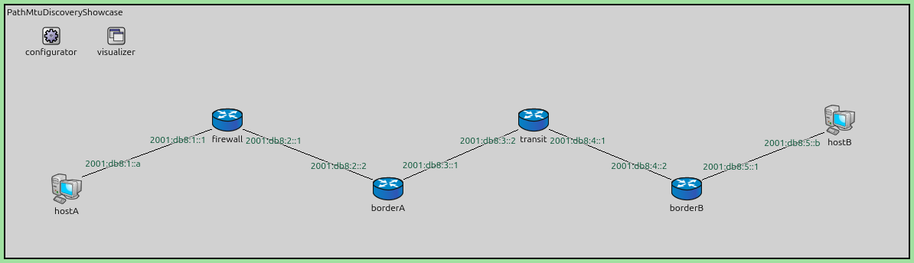
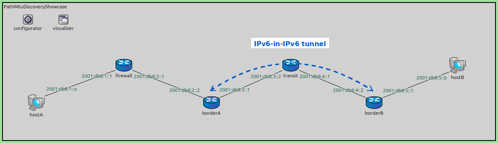
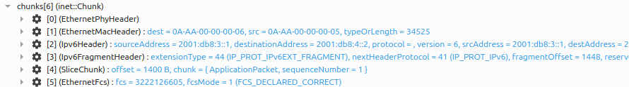

Path MTU Discovery
==================

Goals
-----

Every network link has a limit on how large a packet it will carry, its *Maximum
Transmission Unit (MTU)*; on Ethernet it is 1500 bytes. For IPv6 that limit applies to
the IPv6 datagram itself. A path made of several links can carry no more than its
smallest link, and the sender has no way of knowing that number in advance.

IPv6 handles this differently from IPv4, and the difference is strict. In IPv4 a
router that met an oversized packet could split it up itself and forward the pieces,
so the transfer merely got slower. IPv6 removed that: only the original sender may
split a packet, never a router forwarding one. So when a packet is too large for the
next link, the router has no way to deliver it: it discards the packet and sends an
ICMPv6 *Packet Too Big* message back to the sender, naming the size that would have
fitted. The sender's IPv6 layer remembers that number and sends smaller packets from
then on. This exchange is *Path MTU Discovery*, defined in RFC 8201.

Path MTU Discovery rests on the Packet Too Big message getting back to the sender.
IPv6 has other exchanges that need a reply — *Neighbor Discovery* learns a neighbor's
link-layer address that way — but those run between neighbors on a single link, and
when one fails nothing works at all. The Packet Too Big message has to cross every
network between the two ends, and many of them discard ICMP traffic at the firewall on
their border. Routers also rate-limit the ICMP errors they generate, as the standard
requires them to, so under load the message can be lost even where nothing filters it
— which makes the failure intermittent.

When the message does not arrive, the sender does not learn the path MTU. It keeps
sending the same size, so the network carries small packets and discards large ones.
For example, a name lookup succeeds and a web page starts to load, while a file
transfer stops partway. This failure is called a *Path MTU Discovery black hole*,
and one of the configurations below reproduces it.

This showcase creates a path whose limit is lower than the sender's own link. The four
configurations show:

1. every oversized packet split at the tunnel and reassembled beyond it, which
   delivers the traffic at twice the packet count;
2. no packet arriving at all, because the Packet Too Big message is filtered and the
   sender goes on sending the same size;
3. a single packet lost, after which the sender learns the path MTU and splits its own
   datagrams to fit;
4. nothing split or discarded anywhere, because the sender's packets already fit the
   path.

An *IPv6-in-IPv6 tunnel* is used to make the path narrower, because encapsulation is a
common reason a path carries less than the links at either end of it. For more
information on IPv6 tunneling, see the :doc:`../../tunneling/doc/index` showcase.

| Verified with INET version: ``4.7``
| Source files location: `inet/showcases/ipv6/pathmtudiscovery <https://github.com/inet-framework/inet/tree/master/showcases/ipv6/pathmtudiscovery>`__

About Path MTU Discovery
------------------------

Why a tunnel narrows the path
~~~~~~~~~~~~~~~~~~~~~~~~~~~~~

A tunnel wraps each packet in a second IPv6 header before sending it on. That header
is 40 bytes. A packet that exactly filled a 1500-byte link before it was wrapped
becomes 1540 bytes afterwards, and no longer fits.

The node that does the wrapping has two roles at once, and the rules for them differ:

- For the **inner** packet it is a *router*. It is forwarding somebody else's packet,
  so it may not split it. If the inner packet is larger than the tunnel will accept,
  INET discards it and sends a Packet Too Big message back to the sender. (RFC 2473
  asks for this only when the packet is larger than the 1280-byte IPv6 minimum;
  smaller ones should be wrapped and the resulting outer packet fragmented. INET
  refuses in both cases.)
- For the **outer** packet it is the *sender*. It built that packet itself, so it may
  split it. If the outer packet is too large for the link, it is fragmented and the
  far end of the tunnel puts the pieces back together.

Which of the two limits is exceeded first therefore decides whether an oversized
packet is fragmented or refused. Both behaviours appear in this showcase.

What goes wrong
~~~~~~~~~~~~~~~

Path MTU Discovery works when the Packet Too Big message reaches the sender. The usual
reason it does not is that something along the way discards ICMP traffic.
Administrators often block ICMP as a matter of habit, which in IPv4 mostly broke
diagnostic tools. In IPv6 it breaks much more, because IPv6 depends on ICMPv6 for
Neighbor Discovery, Router Discovery and Path MTU Discovery alike.

.. note::

   The practice is common enough that RFC 4890 was written to tell firewall
   administrators which ICMPv6 messages they must not filter. Packet Too Big is on
   that list.

Filtering is not the only way the message goes missing, and the other ways matter
because they make the loss *intermittent* rather than permanent:

- **Rate limiting.** A router limits how many ICMP errors it generates, so that it
  cannot be used to flood a victim. Under load — exactly when packets are being
  discarded — the errors are the first thing it stops sending.
- **The reply has nowhere to go.** The error is addressed to the packet's source. If
  that address is not reachable from the router that generated it, or the return path
  differs from the forward one and passes through a filter, the message never arrives.
- **The sender is not one machine.** Traffic sent from a load-balanced or anycast
  address can have its error delivered to a different machine than the one that sent
  the packet — which then has nothing to apply it to.
- **Nobody generates it.** A tunnel entry point has to map an oversized outer packet
  back to the inner packet's source and quote the adjusted size. Not every
  implementation does, and INET's does not do it at all for a forwarded tunnel packet.

The consequence of the intermittent cases is worse than of the permanent ones. A path
that black-holes every large packet gets diagnosed. A path that loses the feedback only
under load produces a fault that appears when the network is busy and disappears when
anyone looks at it.

A message travelling backwards can also be *invented* rather than lost. A node that
accepts any Packet Too Big it receives can be told to shrink its packets by anyone who
can guess enough about a flow, which is why RFC 8201 asks a node to check that the
datagram quoted in the message is one it actually sent. INET performs no such check.

Because the mechanism cannot be relied on, network operators fall back on a cruder
one: they configure tunnel routers to rewrite the Maximum Segment Size option inside
passing TCP handshakes, so the two endpoints agree on a smaller segment and never need
the feedback at all. That technique only helps TCP. UDP and QUIC get nothing from it.

Path MTU Discovery in INET
--------------------------

The tunnel's limit
~~~~~~~~~~~~~~~~~~

``Ipv6TunnelInterface`` has an ``mtu`` parameter that sets the largest inner packet the
tunnel will accept. It defaults to 1500 bytes, the same as an Ethernet link, which is
the value that guarantees fragmentation: the outer header always pushes an inner
packet of that size 40 bytes over the link's limit.

The value that avoids fragmentation is the link's limit minus the outer header:

.. code-block:: none

    1500 (Ethernet)  -  40 (outer IPv6 header)  =  1460

Set the tunnel to 1460 and the two checks line up. Any inner packet the tunnel accepts
still fits the link once wrapped, so the tunnel never has to split anything, and
anything larger is refused at the first check instead. That does not mean nothing is
fragmented anywhere — it means the tunnel is not the one doing it. The sender may
still split its own packets, and in the ``Discovery`` configuration below it does.

RFC 2473 expects a tunnel to derive this number from the path between its endpoints
and to keep it up to date as that path changes. INET's tunnel interface has a fixed
value that you set.

Discovering the path limit
~~~~~~~~~~~~~~~~~~~~~~~~~~

The ``Ipv6`` module carries out Path MTU Discovery and has two parameters for it:

- ``pathMtuDiscovery`` — whether the node records what an incoming Packet Too Big
  message reports, and whether it uses what it has recorded when sending. Enabled by
  default. Turning it off restores the behaviour of a node that never learns a path MTU.
- ``pathMtuAgingTime`` — how long a learned value is kept before the node tries a
  larger size again, ten minutes by default. A path can widen, and nothing would tell
  the sender if it never retried.

A learned value is never raised by an incoming message, only lowered, and it is never
taken below 1280 bytes. That number is the smallest MTU any IPv6 link must support,
fixed by RFC 8200; RFC 8201 only forbids reducing the estimate past it. The ten-minute
retry has no effect in a ten-second run; it matters in longer ones.

The floor protects the sender, not the path. Setting a tunnel's ``mtu`` below 1280
produces a tunnel that refuses packets no sender is allowed to shrink far enough to
fit, and the traffic is then lost permanently. RFC 2473 tells a tunnel entry point to
report at least the IPv6 minimum and to encapsulate and fragment small packets rather
than refuse them; INET does neither, so treat 1280 as a hard lower bound when setting
this parameter.

The learned value is held in the node's routing table, alongside the cached next hop
for that destination, and the node reports it in its log when it changes — ``Path MTU
towards ... is now 1460``. That log line shows the mechanism working.

The sending application is not involved and does not change. It keeps writing the same
amount of data, and the IPv6 layer underneath it splits each write to fit what it has
learned. A TCP connection would instead reduce its segment size and avoid splitting
anything — it reacts to these messages on its own account, whatever
``pathMtuDiscovery`` is set to — but this showcase uses UDP, which has no equivalent,
so the source has to fragment.

Filtering the message
~~~~~~~~~~~~~~~~~~~~~

To show what happens when the Packet Too Big message never arrives, one node discards
it. That node is called ``firewall`` and sits between the sending host and the tunnel
entry point, which is where such a filter usually sits in a real network; the next
section shows the topology.

INET has no firewall module, but it does have a Security Policy Database, which is a
packet filter by definition — it matches traffic against selectors and applies one of
three verdicts: protect it, let it pass, or discard it. Enabling it on a node and
giving it a policy is enough. These two lines belong to the ``BlackHole``
configuration only; in the other three the firewall forwards everything:

.. literalinclude:: ../omnetpp.ini
   :start-at: *.firewall.ipv6.hasIpsec
   :end-at: *.firewall.ipv6.ipsec.spdConfig
   :language: ini

.. literalinclude:: ../firewall.xml
   :language: xml

Three things about that policy are worth knowing before adapting it.

The first entry discards ICMPv6 — protocol number 58 — travelling from anywhere beyond
the firewall towards ``hostA``'s network. The selector matches on addresses rather
than on the message type, because the type selector only works for IPv4's ICMP. So
this filter drops *all* ICMPv6 travelling from the far range towards ``hostA``'s
network, not only Packet Too Big. It is a one-way rule: ICMPv6 that ``hostA`` sends
outward is not affected. Dropping a whole class of ICMPv6 in one direction is
realistic — firewalls that cause this problem block ICMP broadly.

``LocalAddress`` and ``RemoteAddress`` are named from the point of view of the
direction, not of the node. For an ``OUT`` policy, ``LocalAddress`` matches the
packet's source and ``RemoteAddress`` its destination. On a node that is neither
endpoint, as here, that is easy to get backwards.

The two ``BYPASS`` entries are not optional. When no policy matches, the default is to
discard, so a policy file with only the first entry would silence the node completely.

The address ranges have to be chosen with the firewall's own traffic in mind. Neighbor
Discovery sends its unicast messages from a node's global address, so a filter written
in terms of address *scope* — link-local against global — would discard the firewall's
own Neighbor Advertisements and break the network.

The ranges used here work, but not because the firewall's addresses are outside them:
its ``eth1`` address ``2001:db8:2::1`` is in fact inside the source range. They work
because the firewall never *sources* anything towards ``hostA`` from that interface.
When it answers ``hostA``, it uses its ``eth0`` address ``2001:db8:1::1``, which the
rule does not match. That is a subtle thing to depend on, and it is worth checking
rather than assuming when adapting this policy.

Multicast Neighbor Discovery bypasses the policy database entirely, so Router
Advertisements and Duplicate Address Detection are unaffected either way.

The Model
---------

Each interface is labelled with the IPv6 address it holds.

.. FIGURE RECIPE: launch `inet -u Qtenv -c Fragmentation --mcp-server-address
   localhost:8799`, then over the MCP server: run_simulation time_limit 1.9s mode
   express, then get_canvas_image with module_path "<root>", area "module_rectangle",
   margin 5. The ini filters tun* out of the interface table labels, because a tunnel
   interface has no address of its own and would only add an "fe80::" label.

``hostA`` and ``hostB`` are the two endpoints. ``borderA`` and ``borderB`` are joined
by an IPv6-in-IPv6 tunnel, and ``transit`` is a router between them that carries only
the two addresses of the links it is attached to. ``firewall`` sits between ``hostA``
and ``borderA``; in three of the four configurations it does nothing at all.

The tunnel is not part of the topology. The dashed line below shows where it runs, but
there is no link between the border routers — only an interface on each of them and a
route that leads to it:

.. FIGURE RECIPE: derived from media/network.png with PIL — a quadratic Bezier from
   (505,218) through (695,88) to (893,218) in the 1194x344 image, 3px wide, colour
   (0,90,200), dashes of 9 samples out of 400, arrow heads at both ends, and a white
   label box centred at x=695, y=96. Redraw whenever network.png is recaptured.

Traffic enters the tunnel the way it enters any interface — an ordinary route whose
output interface is the tunnel. This single line is what sends ``hostA``'s packets
through it, and without it nothing in this showcase would happen:

.. literalinclude:: ../configurator.xml
   :start-at: <route hosts="borderA" destination="2001:db8:5::/64"
   :end-at: <route hosts="borderA" destination="2001:db8:5::/64"
   :language: xml

``tun0`` is the name of the tunnel interface created by the ``tun[0]`` settings in the
``[General]`` section above. The tunneling showcase goes into why a tunnel is built
this way; here it is enough to know that the route is what feeds it.

Every link is Ethernet with the usual 1500-byte limit. Nothing in this network has a
narrow link. The only thing that narrows the path is the tunnel, and how much it
narrows it is what the configurations vary.

The addresses are from ``2001:db8::/32``, the range RFC 3849 reserves for
documentation. Routes are written out by hand rather than computed, so ``transit``
holds only the two prefixes it is attached to and the tunnel is genuinely needed.

The rest of the scenario is the same in every configuration:

.. literalinclude:: ../omnetpp.ini
   :start-at: [General]
   :end-before: [Config Fragmentation]
   :language: ini

``hostA`` sends UDP packets to ``hostB`` twice a second from 2 s to 9.75 s, which is 16
packets, and ``hostB`` runs ``UdpSink``. Traffic starts at 2 s so that Duplicate Address
Detection
has finished and every node holds a usable address, which takes about 1.6 s here.
Address resolution has not finished by then — the first datagram triggers a Neighbor
Solicitation and waits for the answer — but that only delays it briefly.

Only two things differ between the configurations: how much data the application
writes, and what the tunnel will accept.

.. list-table::
   :header-rows: 1

   * - Configuration
     - Application writes
     - Inner packet
     - Tunnel ``mtu``
     - ICMPv6
   * - ``Fragmentation``
     - 1452 B
     - 1500 B
     - 1500 B
     - delivered
   * - ``BlackHole``
     - 1452 B
     - 1500 B
     - 1460 B
     - filtered
   * - ``Discovery``
     - 1452 B
     - 1500 B
     - 1460 B
     - delivered
   * - ``SizedToFit``
     - 1412 B
     - 1460 B
     - 1460 B
     - delivered

The inner packet is the application's data plus 8 bytes of UDP header and 40 bytes of
IPv6 header, so 1452 bytes of data makes a 1500-byte packet.

Fragmentation Configuration
~~~~~~~~~~~~~~~~~~~~~~~~~~~

The tunnel's limit is set to 1500, which is also its default, so it accepts the
1500-byte inner packet:

.. literalinclude:: ../omnetpp.ini
   :start-at: [Config Fragmentation]
   :end-before: [Config BlackHole]
   :language: ini

Wrapping it produces a 1540-byte outer packet, which does not fit the link to
``transit``. ``borderA`` is the sender of that outer packet, so it is allowed to split
it, and does. ``borderB`` reassembles the pieces before unwrapping.

Everything arrives. The cost is paid on the wire and at ``borderB``, not by the
application.

BlackHole Configuration
~~~~~~~~~~~~~~~~~~~~~~~

The tunnel's limit is lowered to 1460 so that the tunnel never has to split anything,
which is the correct thing to configure. The firewall discards ICMPv6 heading towards
``hostA``:

.. literalinclude:: ../omnetpp.ini
   :start-at: [Config BlackHole]
   :end-before: [Config Discovery]
   :language: ini

Now the 1500-byte inner packet is larger than the tunnel accepts. ``borderA`` is
forwarding it, so it may not split it: it discards the packet and sends Packet Too Big
back towards ``hostA``. The firewall discards that message. ``hostA`` learns nothing,
sends the next packet at the same size, and the cycle repeats for the whole run.

Discovery Configuration
~~~~~~~~~~~~~~~~~~~~~~~

The same network and the same tunnel limit, with the firewall doing nothing:

.. literalinclude:: ../omnetpp.ini
   :start-at: [Config Discovery]
   :end-before: [Config SizedToFit]
   :language: ini

The first packet is discarded exactly as before, but this time the Packet Too Big
message reaches ``hostA``, which records that the path to ``hostB`` accepts 1460
bytes. From the next packet onwards, ``hostA`` splits its own datagrams to fit, and
everything gets through.

One packet is lost — the one that taught the sender. That loss is the mechanism
working, not failing.

SizedToFit Configuration
~~~~~~~~~~~~~~~~~~~~~~~~

The application writes 1412 bytes instead of 1452, which makes a 1460-byte inner
packet:

.. literalinclude:: ../omnetpp.ini
   :start-at: [Config SizedToFit]
   :language: ini

The tunnel accepts it, wrapping it produces exactly 1500 bytes, and that fits the
link. Nothing is discarded, nothing is split, and nothing has to be discovered.

Results
-------

.. list-table::
   :header-rows: 1

   * - Configuration
     - Delivered, of 16
     - Frames ``hostA`` → ``firewall``
     - Frames ``borderA`` → ``transit``
   * - ``Fragmentation``
     - 16
     - 20 (16 data)
     - 36 (32 data)
   * - ``BlackHole``
     - 0
     - 21 (16 data)
     - 4 (0 data)
   * - ``Discovery``
     - 15
     - 36 (31 data)
     - 34 (30 data)
   * - ``SizedToFit``
     - 16
     - 20 (16 data)
     - 20 (16 data)

The frame counts are the ``packetReceivedFromUpper:count`` statistic of each link's
``eth[n].mac`` module, so they include control traffic as well as application data. Four
or five frames per link are Neighbor Discovery, depending on the configuration, which
is why the data figure is given separately in brackets. It is the data figures that
carry the argument.

Read down those two columns and they say where the fragmentation happened.

In ``SizedToFit`` the two numbers match: 16 packets leave the sender and 16 cross the
tunnel, because nothing is ever split. In ``Fragmentation`` the sender emits 16 and the
tunnel link carries 32 — the doubling appears only after ``borderA``, because that is
where the splitting happens. In ``Discovery`` the doubling has moved to the other end:
31 leave the sender and 30 go beyond it. ``hostA`` is now doing the splitting — one
full-size packet that was refused, then fifteen split into two apiece — and ``borderA``
merely forwards what it is given.

That is the real effect of Path MTU Discovery here. It did not remove the
fragmentation, because the application still writes 1452 bytes and UDP has no way to
write less. What it changed is *where* the work happens. In ``Fragmentation`` the two
tunnel routers carry it: ``borderA`` splits every packet and ``borderB`` puts every one
back together, in the middle of the network. In ``Discovery`` the two hosts carry it
instead, and the routers only forward what they are given.

Both are legal. ``borderA`` was splitting a packet it had built itself rather than one
it was forwarding, which is the one case where a router may still fragment — so no
prohibited operation was stopped. The gain is simply that the per-packet cost moved
out of the forwarding path and onto the machines at either end, which are far better
placed to absorb it.

``SizedToFit`` is the only configuration with no fragmentation anywhere, and it is the
one an operator should aim for.

``BlackHole`` carries no application data at all on the tunnel link; the four frames
there are control traffic. Nothing gets past ``borderA``. The sender's link still
carries its 16 packets, so from ``hostA``'s point of view everything is being sent
normally, which is exactly what makes this failure hard to diagnose on real equipment.

What a fragment looks like
~~~~~~~~~~~~~~~~~~~~~~~~~~

This is the second of the two fragments ``borderA`` produces in the ``Fragmentation``
configuration, taken from the link to ``transit``:

The Fragment header in chunk ``[3]`` is the one chunk that would not be there had the
packet not been split.

.. FIGURE RECIPE: launch `inet -u Qtenv -c Fragmentation --mcp-server-address
   localhost:8799`, run_simulation to 2.6s in "fast" mode, list_logged_packets with
   module_path "borderA" and pick the 126-byte packet named "...-frag-1448-last" (the
   small last fragment; the first fragment is 1522 B and its raw bit dump makes the
   inspector tree far too tall to render). open_inspector on its "logged:<treeId>"
   path with type "object", expand_inspector_tree depth 4, get_inspector_screenshot
   width 1500 height 5000, then crop the "chunks[6]" block under the "dissection" node.

Chunk ``[2]`` is the outer header, addressed from ``2001:db8:3::1`` to
``2001:db8:4::2`` — the two tunnel endpoints. Chunk ``[3]`` is an IPv6 Fragment header,
which only appears on a packet that has been split. Its ``nextHeaderProtocol`` of 41
says that what was split was an IPv6 datagram, which is what a tunnel carries. Chunk
``[4]`` is the tail of the original packet, and ``[0]``, ``[1]`` and ``[5]`` are the
Ethernet framing around it.

Two offsets appear here and they count from different places. The Fragment header's
``fragmentOffset`` of 1448 counts from the start of the inner IPv6 datagram, while
chunk ``[4]``'s ``offset`` of 1400 counts from the start of the application's own
data. They differ by the 48 bytes of inner IPv6 and UDP header that sit between the
two starting points, and chunk ``[4]`` holds only application data for the same reason
— those inner headers travelled in the first fragment.

One detail the figure does not show faithfully: on the wire the Fragment Offset field
is 13 bits counted in units of 8 bytes, so it would hold 181 rather than 1448. INET
stores the byte offset and displays that.

The value 1448 itself is worth a word, because the obvious arithmetic gives 1452: the
link's 1500 bytes, less the 40-byte outer header, less the 8-byte Fragment header.
IPv6 requires every fragment except the last to carry a multiple of 8 bytes, so 1452
is rounded down to 1448.

The packet names in the simulation show the same thing more briefly. One
``UdpBasicAppData-1`` of 1526 bytes arrives at ``borderA``, and two packets leave it:
``UdpBasicAppData-1-frag-0`` of 1522 bytes and ``UdpBasicAppData-1-frag-1448-last`` of
126 bytes.

Those sizes count differently from every other number on this page. An MTU limits the
IPv6 datagram, while a logged frame size adds the Ethernet framing around it — 14
bytes of header, 4 of frame check sequence and 8 of preamble, 26 in all. So the
1500-byte datagram that arrives at ``borderA`` is logged as 1526 bytes, and it does
fit a link whose MTU is 1500.

That second one is the point of the whole exercise. It carries 52 bytes of data in a
126-byte frame. Splitting a packet does not cost much in bytes: the two fragments
carry 1596 bytes of IPv6 datagram where one unsplit packet would have carried 1540, an
extra 56 bytes or about 3.6%. What it does is double the number of packets, and a runt
like this one costs a router as much to handle as a full-size one.

Sources: :download:`omnetpp.ini <../omnetpp.ini>`,
:download:`PathMtuDiscoveryShowcase.ned <../PathMtuDiscoveryShowcase.ned>`,
:download:`configurator.xml <../configurator.xml>`,
:download:`firewall.xml <../firewall.xml>`

Try It Yourself
---------------

If you already have INET installed, write the following into the command line from the
INET root directory:

.. code-block:: bash

    $ cd showcases/ipv6/pathmtudiscovery
    $ inet

``inet`` with no arguments offers a list of the four configurations to choose from.

Otherwise, there is an easy way to install INET and OMNeT++ using ``opp_env``, and run
the simulation interactively.

Ensure that ``opp_env`` is installed on your system, then execute:

.. code-block:: bash

    $ opp_env run inet-4.7 --init -w inet-workspace --install --build-modes=release --chdir \
       -c 'cd inet-4.7.*/showcases/ipv6/pathmtudiscovery && inet'

This command creates an ``inet-workspace`` directory, installs the appropriate
versions of INET and OMNeT++ within it, and launches the ``inet`` command in the
showcase directory for interactive simulation.

Alternatively, for a more hands-on experience, you can first set up the
workspace and then open an interactive shell:

.. code-block:: bash

    $ opp_env install --init -w inet-workspace --build-modes=release inet-4.7
    $ cd inet-workspace
    $ opp_env shell

Inside the shell, start the IDE by typing ``omnetpp``, import the INET project,
then start exploring.

.. TODO: replace the issue-tracker link below once the showcase discussion issue is opened

Discussion
----------

Use `this page <https://github.com/inet-framework/inet-showcases/issues>`__ in
the GitHub issue tracker for commenting on this showcase.
