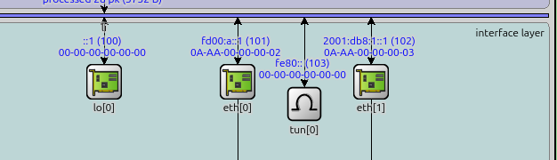
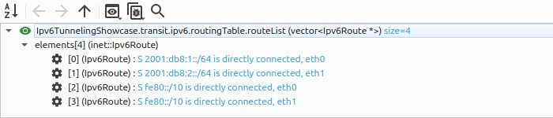

IPv6-in-IPv6 Tunneling
======================

Goals
-----

An IPv6 router can only forward a packet if its routing table holds a route matching
the destination address. Some IPv6 addresses are, by design, ones that routers on the
public Internet hold no routes for. One such range is ``fc00::/7``, the Unique Local
Addresses — the IPv6 counterpart of the private addresses used inside IPv4 networks. A
company can number its internal networks out of that range, and providers filter those
addresses at their borders by default. So a company with two offices, each numbered
this way, cannot simply send packets from one to the other across the Internet: the
first Internet router that sees such a packet discards it.

Tunneling solves this by wrapping the packet. The border router of the first office
puts the whole original packet inside a second IPv6 header, addressed from itself to
the border router of the second office — two addresses the Internet does have routes
for. Every router in between then makes its forwarding decision from that outer header
alone, which is all a router normally reads. The border router at the far end strips
that header off and delivers the original packet into the second office.

This showcase demonstrates IPv6-in-IPv6 tunneling as defined in RFC 2473. Two sites
use addresses the network between them cannot route, and a tunnel between the site
border routers carries their traffic across. The four configurations show the
following:

- what happens without the tunnel, so that the failure it fixes is visible;
- the tunnel carrying a whole remote site;
- the same tunnel carrying traffic to one host only, leaving a second host in that
  site unreachable, which shows that the routing decides what the tunnel carries;
- a single wrong route that sends packets back into the tunnel they arrived through,
  so that they loop until their hop limit runs out.

| Verified with INET version: ``4.7``
| Source files location: `inet/showcases/ipv6/tunneling <https://github.com/inet-framework/inet/tree/master/showcases/ipv6/tunneling>`__

About IPv6-in-IPv6 tunneling
----------------------------

An IPv6-in-IPv6 tunnel carries a complete IPv6 datagram as the payload of another IPv6
datagram. The node that adds the outer header is the *tunnel entry point*, and the
node that removes it is the *tunnel exit point*. The original datagram is the *inner
packet*; the datagram that actually travels between the two endpoints is the *outer
packet*.

The outer header is an ordinary IPv6 header. Its source address is the entry point,
its destination address is the exit point, and its Next Header field says ``IPv6``.
That value is what makes the tunnel work: any other value — TCP, UDP, ICMPv6 — would
tell the exit point to hand the payload up to that protocol and be done with it.
``IPv6`` tells it instead to strip the outer header and route the inner packet
onwards, which is exactly what an exit point has to do. Every router between the two
endpoints treats the outer packet as normal traffic addressed to the exit point.

.. note::

   Tunneling is widely used in networking, under many different names. A mobile
   network's GTP tunnels, a datacentre's VXLAN, and a broadband provider's Dual-Stack
   Lite all wrap one packet in another and route the outer one; they differ in which
   headers they use and what they carry. IPv6-in-IPv6 is the case where the outer
   header is an ordinary IPv6 header.

Addresses the network will not carry
~~~~~~~~~~~~~~~~~~~~~~~~~~~~~~~~~~~~

The Unique Local Address range mentioned above, ``fc00::/7``, is defined in RFC 4193;
in practice organisations use the ``fd00::/8`` half of it. It is worth being precise
about why these addresses stay out of the global routing table.

An organisation creates its own Unique Local Address prefix by choosing 40 random
bits. The standard requires those bits to be random so that two organisations are
very unlikely to pick the same prefix, which is what makes the addresses safe to use privately and
even between co-operating organisations.

What they are not is *globally* routable, and that is a matter of policy rather than
of any technical ambiguity. The standard states that these addresses are not expected
to be routed on the global Internet. No registry records who holds which prefix, no
provider has any reason to carry them, and providers filter them at their borders by
default. The consequence is the one that matters here: a packet carrying these
addresses will not cross a public network.

So two networks that both use Unique Local Addresses have a concrete problem. Each
works internally. Neither can reach the other across a public network, because that
network will not carry the addresses. The standard anticipates this and allows the
addresses to be routed between co-operating sites where the routes are deliberately
set up — which is exactly what a tunnel does. The inner packet keeps the Unique Local
Addresses, and the outer packet uses the border routers' public addresses.

The two prefixes in this showcase, ``fd00:a::/64`` and ``fd00:b::/64``, are written to
be easy to read and to tell apart. A real prefix has 40 pseudo-random bits in the
middle and looks more like ``fd2b:47a1:9c3e::/48``, and a single organisation numbers
all of its sites out of one such prefix.

.. note::

   A tunnel is not a Virtual Private Network. The arrangement in this showcase looks
   like one, and the shape is indeed the same, but a plain IPv6-in-IPv6 tunnel gives
   *reachability*, not *confidentiality*. Nothing in it is encrypted or authenticated.
   Anyone who can observe the transit network can read every inner packet, and anyone
   who can inject traffic toward the exit point can inject inner packets. In a real
   deployment the encapsulation is what a security protocol such as IPsec is layered
   on top of; the tunnel by itself carries traffic, it does not protect it.

IPv6-in-IPv6 tunneling in INET
------------------------------

In INET a tunnel is a *virtual network interface* called ``Ipv6TunnelInterface``. A
node has it alongside its real interfaces and routes packets to it in the same way.
What makes it virtual is that it has no link underneath: instead of putting the packet
on a wire, it hands it back to the node's own IPv6 layer with the tunnel endpoints
attached, and IPv6 wraps it in the outer header and forwards the result toward the
exit point like any other locally originated packet. The wrapping is done by the
``Ipv6`` module, which treats the inner packet like any other payload it has to
encapsulate; the tunnel interface only says which addresses to use.

At the far end, IPv6 sees a datagram addressed to itself whose Next Header field says
``IPv6``, removes the outer header, and processes the inner packet as if it had just
arrived from the network.

Inside a border router, the tunnel sits in the interface layer with the node's other
interfaces:

``tun[0]`` stands alongside the two Ethernet interfaces and the loopback, but has no
link leading out of the node. The ``fe80::`` shown against it is the unset placeholder
every interface starts with, not an address it holds.

.. FIGURE RECIPE: launch `inet -u Qtenv -c Tunnel --mcp-server-address localhost:8799`,
   then over the MCP server: run_simulation time_limit 2.6s mode express, then
   open_inspector on "borderA" with type "graphical" (get_canvas_image fails without an
   open graphical inspector), then get_canvas_image with module_path "borderA", area
   "all_elements", margin 5. Crop the interface-layer band at the bottom -- (640, 890)
   to (1266, 1070) of the 1270x1139 capture -- since the layer boxes above it are
   mostly empty.

In short:

    A tunnel is one network interface plus one route.

The interface says *where the tunnel goes*. The route says *what goes into it*. The
two are configured independently, and changing only the route changes what the tunnel
is used for, without touching the tunnel itself.

The addresses and routes are configured by the ``Ipv6NetworkConfigurator`` module from
an XML file.

Configuring the interface
~~~~~~~~~~~~~~~~~~~~~~~~~

Host and router node types have a ``tun`` submodule vector for tunnel interfaces.
Setting ``numTunInterfaces`` creates the slots, and each slot's type and parameters
are set individually. This is how one end of this showcase's own tunnel is configured,
on the border router named ``borderA`` in the network described below:

.. literalinclude:: ../omnetpp.ini
   :start-at: *.borderA.numTunInterfaces
   :end-at: *.borderA.tun[0].destination
   :language: ini

Three parameters describe the tunnel:

- ``source`` — the tunnel entry point, which must be an address of this node. It
  becomes the source address of the outer header.
- ``destination`` — the tunnel exit point. It becomes the destination address of the
  outer header.
- ``mtu`` — the largest packet the tunnel will accept, 1500 bytes by default.

.. note::

   This tunnel interface holds no address of its own, and the configurator leaves it
   without one. It never appears as a source or destination: the addresses in the
   outer header are the ``source`` and ``destination`` above, which belong to the
   node's real interfaces.

   On real equipment a tunnel interface usually does carry an address, so that routing
   protocols can form adjacencies over it and so that it answers ping and shows up in
   a traceroute. It is not required for forwarding — Cisco's ``ip unnumbered`` and a
   plain Linux ``ip6tnl`` both work without one — but expect to see addresses on
   tunnel interfaces in a real configuration.

A tunnel interface encapsulates, so it is needed on the node that *sends* into the
tunnel. The node at the far end needs no tunnel interface at all: any IPv6 node that
receives a datagram addressed to itself whose Next Header says ``IPv6`` strips the
outer header and routes what was inside, as described above. One interface therefore
gives a tunnel that carries traffic in one direction only.

Both border routers declare one here, with the ``source`` and ``destination`` values
swapped, so that either can send into it. The application traffic runs from site A to
site B, but the return direction is used too: it is what carries the ICMPv6 errors
that site B's router sends back.

Steering traffic into the tunnel
~~~~~~~~~~~~~~~~~~~~~~~~~~~~~~~~

The tunnel interface has no idea which traffic it is meant to carry. It wraps whatever
arrives and sends it to its far end. What decides which traffic arrives is an ordinary
route whose output interface is the tunnel:

.. literalinclude:: ../tunnel.xml
   :start-at: <route hosts="borderA" destination="fd00:b::/64"
   :end-at: <route hosts="borderB" destination="fd00:a::/64"
   :language: xml

Because the route is ordinary, the usual longest-prefix rule applies, and the *shape*
of the route decides what the tunnel is for. A route for a single address sends one
host's traffic through it. A route for a prefix sends a whole remote site. A default
route sends everything. This showcase uses the first two.

The cost of the outer header
~~~~~~~~~~~~~~~~~~~~~~~~~~~~

The outer header is 40 bytes, and those bytes are added to every packet the tunnel
carries. A packet that exactly filled the outgoing link before encapsulation no longer
fits after it, and the entry point must then split it into fragments that the exit
point reassembles. Setting the tunnel's ``mtu`` to the link's limit minus 40 avoids
this: an oversized packet is then refused rather than split, and the sender is told so
with an ICMPv6 Packet Too Big message, which is what allows it to send smaller packets
instead. This showcase keeps the default and uses 100-byte packets, so nothing is ever
fragmented here.

The Model
---------

All four configurations use the same network:

.. figure:: media/network.png
   :align: center

Each interface is labelled with the IPv6 address it holds.

.. FIGURE RECIPE: launch `inet -u Qtenv -c NoTunnel --mcp-server-address localhost:8799`,
   then over the MCP server: run_simulation time_limit 1.9s mode express (so addresses are
   assigned and no packet is in flight), then get_canvas_image with module_path "<root>",
   area "module_rectangle", margin 5. NoTunnel is used deliberately: in the tunnel configs
   the tunnel interface adds an "fe80::" label that means nothing to a reader.

The tunnel itself is not part of the topology. The dashed line below shows where it
runs, but there is no link between the two border routers — only an interface on each
of them and a route that leads to it:

.. figure:: media/tunnel-overlay.png
   :align: center

.. FIGURE RECIPE: derived from media/network.png. The dashed arc, its two arrow heads
   and the label are drawn with PIL: a quadratic Bezier from (258,168) through
   (478,28) to (700,168) in the 1024x409 image, 3px wide, colour (0,90,200), dashes of
   9 samples out of 400, with a white label box centred at x=478, y=40. Redraw it
   whenever network.png is recaptured, since the coordinates follow the node
   positions.

``hostA`` is in site A and ``hostB1`` and ``hostB2`` are in site B. ``borderA`` and
``borderB`` are the two site border routers, and ``transit`` is a router in the public
network between them. ``switchB`` is an Ethernet switch that puts both site B hosts on
one link. The hosts and routers are ``StandardHost6`` and ``Router6``, the IPv6
variants of INET's generic host and router.

The addresses in the figure are the point of the network:

.. list-table::
   :header-rows: 1

   * - Link
     - Prefix
     - Kind
   * - ``hostA`` – ``borderA`` (site A)
     - ``fd00:a::/64``
     - Unique Local Address
   * - ``borderA`` – ``transit``
     - ``2001:db8:1::/64``
     - globally routable
   * - ``transit`` – ``borderB``
     - ``2001:db8:2::/64``
     - globally routable
   * - ``borderB`` – site B hosts
     - ``fd00:b::/64``
     - Unique Local Address

Both sites use Unique Local Addresses. Both border routers also have a globally
routable address on the link toward ``transit``, and those two addresses are the
tunnel endpoints. ``2001:db8::/32`` is the range RFC 3849 reserves for documentation;
it stands in here for real provider-assigned addresses.

Routing is configured by hand rather than computed, using
``*.configurator.addStaticRoutes = false`` and an explicit route for every node. The
transit router's routing table is the following:

The first two routes are the ones configured for it, covering the links it is attached
to. The other two are the link-local ``fe80::/10`` routes that every IPv6 interface
gets, which never carry traffic between sites. ``S`` marks a route as static.

What matters is that nothing in the table matches either site's addresses, so any
packet carrying them that reaches ``transit`` is discarded.

.. FIGURE RECIPE: launch `inet -u Qtenv -c Tunnel --mcp-server-address localhost:8799`,
   then over the MCP server: run_simulation time_limit 2.6s mode express, then
   expand_inspector_tree depth 2 and get_inspector_screenshot width 1000 height 150 on
   object_path "Ipv6TunnelingShowcase.transit.ipv6.routingTable.routeList" with type
   "object". Use the FULL path including the network name -- a non-module object is not
   found by the network-relative path that works for modules. Inspecting the
   routingTable module itself instead shows its parameters, and expanding that far
   enough to reach the routes buries them. Crop the right 30% of the 1000x150 capture,
   which is empty.

In a real network that absence is not a configuration choice: providers filter these
addresses, as described above. Here it has to be arranged deliberately, because a
shortest-path configurator would happily install routes that reality would not.

The rest of the scenario is the same in every configuration:

.. literalinclude:: ../omnetpp.ini
   :start-at: [General]
   :end-before: [Config NoTunnel]
   :language: ini

``hostA`` sends 100-byte UDP packets to both site B hosts, twice a second, from 2 s to
the end of the 10 s simulation. That is 16 packets to each host, and the two receiving
hosts run ``UdpSink``. Traffic starts at 2 s so that Neighbor Discovery has finished
first; a packet sent before a node knows its neighbours would be delayed or dropped
for reasons that have nothing to do with tunneling.

NoTunnel Configuration
~~~~~~~~~~~~~~~~~~~~~~

The ``NoTunnel`` configuration is the baseline. There is no tunnel, and the two sites
are left to reach each other directly:

.. literalinclude:: ../omnetpp.ini
   :start-at: [Config NoTunnel]
   :end-before: [Config Tunnel]
   :language: ini

``hostA`` sends its packets to ``borderA``. ``borderA`` has no route for
``fd00:b::/64``, so it forwards them along its default route toward ``transit``, the
way a site router hands anything it does not recognise to its provider. ``transit``
has no route for those addresses and discards them.

``transit`` does try to report the failure, and cannot. The ICMPv6 Destination
Unreachable message it generates is addressed to ``hostA``, whose address
``fd00:a::a`` is a Unique Local Address as well — so the error is discarded for exactly
the same reason as the packet that caused it. ``hostA`` learns nothing. Both sites are
simply invisible to the network between them.

Tunnel Configuration
~~~~~~~~~~~~~~~~~~~~

The ``Tunnel`` configuration adds a tunnel interface to each border router and a route
for the whole remote site pointing into it:

.. literalinclude:: ../omnetpp.ini
   :start-at: [Config Tunnel]
   :end-before: [Config SelectiveTunnel]
   :language: ini

The tunnel endpoints are the two public addresses, ``2001:db8:1::1`` and
``2001:db8:2::2``. The routes that feed the tunnel are the two shown earlier: on
``borderA``, everything for ``fd00:b::/64``; on ``borderB``, everything for
``fd00:a::/64``.

SelectiveTunnel Configuration
~~~~~~~~~~~~~~~~~~~~~~~~~~~~~

The ``SelectiveTunnel`` configuration keeps exactly the same tunnel and changes one
route. Instead of a prefix route for the whole of site B, ``borderA`` gets a route for
one host address:

.. literalinclude:: ../selective.xml
   :start-at: <route hosts="borderA" destination="fd00:b::b1"
   :end-at: <route hosts="borderA" destination="fd00:b::b1"
   :language: xml

.. literalinclude:: ../omnetpp.ini
   :start-at: [Config SelectiveTunnel]
   :end-before: [Config RoutingLoop]
   :language: ini

Traffic to ``hostB1`` now matches that route and enters the tunnel. Traffic to
``hostB2`` matches nothing that leads into the tunnel, so it takes the ordinary path
and dies at ``transit`` exactly as in the baseline.

RoutingLoop Configuration
~~~~~~~~~~~~~~~~~~~~~~~~~

Because the tunnel is fed by ordinary routes, an ordinary routing mistake can feed it
the wrong traffic. The ``RoutingLoop`` configuration adds one wrong route on
``borderB``: a host route for ``hostB1`` — a host directly attached to ``borderB`` —
pointing into the tunnel back towards ``borderA``:

.. literalinclude:: ../routing-loop.xml
   :start-at: <route hosts="borderB" destination="fd00:b::b1"
   :end-at: <route hosts="borderB" destination="fd00:b::b1"
   :language: xml

.. literalinclude:: ../omnetpp.ini
   :start-at: [Config RoutingLoop]
   :language: ini

The wrong route is longer than the on-link route covering the rest of site B, so it
wins. A packet for ``hostB1`` reaches ``borderB`` through the tunnel, and ``borderB``
sends it straight back through the tunnel to ``borderA``, which sends it forward
again. The packet bounces between the two border routers.

The headers do not pile up. Each router removes the outer header before it looks at
the inner packet, and adds a fresh one when it sends it back, so there is never more
than one outer header on the wire and the packet does not grow.

What stops it is the hop limit. Each border router forwards the inner packet, and
forwarding decrements its hop limit. INET starts an IPv6 packet with a hop limit of
30, and each round trip costs two decrements, so a packet reaches ``borderB`` about
fifteen times before it is discarded there. The loop is self-limiting: each individual
packet dies on its own hop limit, rather than circulating for ever. New packets keep entering the
loop until the sender stops, and the run itself ends on the simulation time limit.

This is an ordinary routing loop that happens to run through a tunnel. It is worth
separating from a different failure with a similar-sounding name. In *recursive
routing*, the route towards the tunnel's own exit point leads through the tunnel
itself: the entry point wraps the packet, looks up the outer destination, finds the
tunnel again, and wraps it once more, without ever putting anything on the wire. That
one has no hop limit to stop it, which is why router operating systems detect it
specifically and shut the tunnel down. It is not what happens here — each border
router reaches the other's public address by the ordinary route out of its Ethernet
interface. This page's own advice contains the trap, though: a *default* route into
the tunnel, mentioned earlier as one of the route shapes you might use, would send the
outer packet into the tunnel as well, and that is the real thing.

RFC 2473 also defines protection against genuinely nested tunnels: a Tunnel
Encapsulation Limit option that says how many further levels of encapsulation are
allowed, after which the packet is discarded. INET does not implement it. It would not
have helped here in any case, because nothing in this configuration nests.

Two other numbers here are INET's rather than the standard's. It says the outer
header's hop limit should start at the usual IPv6 default of 64, where INET uses 30 —
so on real equipment a loop like this one would run about twice as long. And it
expects a tunnel's MTU to be derived from the path between the endpoints and updated
as that path changes, where ``Ipv6TunnelInterface`` has a fixed value you set
yourself.

Results
-------

The first question is whether the traffic arrives. This is the number of packets each
site B host received, out of 16 sent to each:

.. list-table::
   :header-rows: 1

   * - Configuration
     - ``hostB1``
     - ``hostB2``
   * - ``NoTunnel``
     - 0
     - 0
   * - ``Tunnel``
     - 16
     - 16
   * - ``SelectiveTunnel``
     - 16
     - 0
   * - ``RoutingLoop``
     - 0
     - 16

The baseline delivers nothing, which confirms that the transit network really cannot
carry these addresses and that the tunnel is doing the work in the other
configurations.

``SelectiveTunnel`` delivers to one host and not the other. Both hosts are on the same
link in the same site, and both are reached through the same tunnel — the only
difference is that one of them is named by a route and the other is not. This is the
clearest demonstration on the page that the tunnel carries whatever the routing gives
it, and nothing else.

``RoutingLoop`` inverts the pattern: the host with the wrong route is the one that
gets nothing, while ``hostB2``, whose routing is untouched, keeps receiving all 16
packets. A tunnel does not "break"; one route breaks one destination.

What an encapsulated packet looks like
~~~~~~~~~~~~~~~~~~~~~~~~~~~~~~~~~~~~~~

The following is an Ethernet frame captured on the link between ``borderA`` and
``transit`` in the ``Tunnel`` configuration, shown as the chunk list of INET's packet
inspector:

.. figure:: media/encapsulated-packet.png
   :align: center

.. FIGURE RECIPE: launch `inet -u Qtenv -c Tunnel --mcp-server-address localhost:8799`,
   then over the MCP server: run_simulation to 2.6s in "fast" mode, list_logged_packets with
   module_path "borderA" and pick a 214-byte EthernetSignal whose hop_modules run borderA ->
   transit, open_inspector on its "logged:<treeId>" path with type "object",
   expand_inspector_tree depth 4, then get_inspector_screenshot width 1500 height 3800 and
   crop the "chunks[7]" block (it sits under the "dissection" node, below the raw bin/raw hex
   listings). Depth 3 leaves the chunk list collapsed; depth 4 also expands the raw bit dump,
   which is why the screenshot must be tall and then cropped.

The two middle entries are the point. Chunk ``[2]`` is the outer IPv6 header: it runs
from ``2001:db8:1::1`` to ``2001:db8:2::2``, the two public tunnel endpoints. Chunk
``[3]`` is the inner header, still carrying the original ``fd00:a::a`` and
``fd00:b::b2`` addresses.

The field the figure calls ``protocol`` is the header's Next Header field, the one
described earlier. On the outer header it names ``ipv6``, which is what tells the exit
point that the payload is another IPv6 datagram. On the inner header it names ``udp``.

The numbers in brackets are not the values that travel on the wire. ``ipv6(40)`` and
``udp(69)`` are identifiers INET uses internally; the Next Header bytes in the actual
headers are 41 for IPv6 and 17 for UDP.

The transit network forwards this frame using the addresses in chunk ``[2]``, which it
has routes for. The addresses in chunk ``[3]``, which it has no routes for, are just
payload bytes to it.

The other entries are the ordinary framing around the packet. ``[0]`` and ``[1]`` are
the Ethernet physical and MAC headers, ``[4]`` is the UDP header, ``[5]`` is the
application's own data, and ``[6]`` is the Ethernet frame check sequence.

The cost of the loop
~~~~~~~~~~~~~~~~~~~~

Delivery counts do not show the whole effect of ``RoutingLoop``. Counting the packets
that crossed the link between ``transit`` and ``borderA`` does:

.. list-table::
   :header-rows: 1

   * - Configuration
     - packets sent by ``transit`` toward ``borderA``
   * - ``Tunnel``
     - 4
   * - ``RoutingLoop``
     - 244

The four packets in the first row are not application traffic — the receiving hosts
never reply. They are Neighbor Discovery messages, which every node exchanges to
resolve its neighbours' link-layer addresses. The 240 packets above that baseline are
the loop.

Sixteen packets, each bouncing until its hop limit runs out, put roughly 240 extra
packets onto the transit link. Almost all of that is data that never reaches anyone:
224 of the 240 are the looping packets themselves. The remaining 16 are ICMPv6 Time
Exceeded messages, one per packet, generated when its hop limit finally reaches zero.

Those 16 are worth following, because they close a loop with the baseline. In
``NoTunnel`` the error could not get home: it was addressed to ``fd00:a::a``, which
the transit network cannot route, so it died alongside the packet that caused it and
``hostA`` learned nothing. Here the tunnel gives that same error a path back, so
``hostA`` does learn that its packets are expiring. The network is the same and the
address is the same; the tunnel is the only difference.

This is why a routing loop through a tunnel matters in practice. The visible symptom
is that one destination is unreachable. The expensive consequence is that the link
between the sites carries many times its normal load to accomplish nothing.

Sources: :download:`omnetpp.ini <../omnetpp.ini>`,
:download:`Ipv6TunnelingShowcase.ned <../Ipv6TunnelingShowcase.ned>`,
:download:`no-tunnel.xml <../no-tunnel.xml>`,
:download:`tunnel.xml <../tunnel.xml>`,
:download:`selective.xml <../selective.xml>`,
:download:`routing-loop.xml <../routing-loop.xml>`

Try It Yourself
---------------

If you already have INET installed, write the following into the command line from the
INET root directory:

.. code-block:: bash

    $ cd showcases/ipv6/tunneling
    $ inet

``inet`` with no arguments offers a list of the four configurations to choose from.

Otherwise, there is an easy way to install INET and OMNeT++ using ``opp_env``, and run
the simulation interactively.

Ensure that ``opp_env`` is installed on your system, then execute:

.. code-block:: bash

    $ opp_env run inet-4.7 --init -w inet-workspace --install --build-modes=release --chdir \
       -c 'cd inet-4.7.*/showcases/ipv6/tunneling && inet'

This command creates an ``inet-workspace`` directory, installs the appropriate
versions of INET and OMNeT++ within it, and launches the ``inet`` command in the
showcase directory for interactive simulation.

Alternatively, for a more hands-on experience, you can first set up the
workspace and then open an interactive shell:

.. code-block:: bash

    $ opp_env install --init -w inet-workspace --build-modes=release inet-4.7
    $ cd inet-workspace
    $ opp_env shell

Inside the shell, start the IDE by typing ``omnetpp``, import the INET project,
then start exploring.

.. TODO: replace the issue-tracker link below once the showcase discussion issue is opened

Discussion
----------

Use `this page <https://github.com/inet-framework/inet-showcases/issues>`__ in
the GitHub issue tracker for commenting on this showcase.
