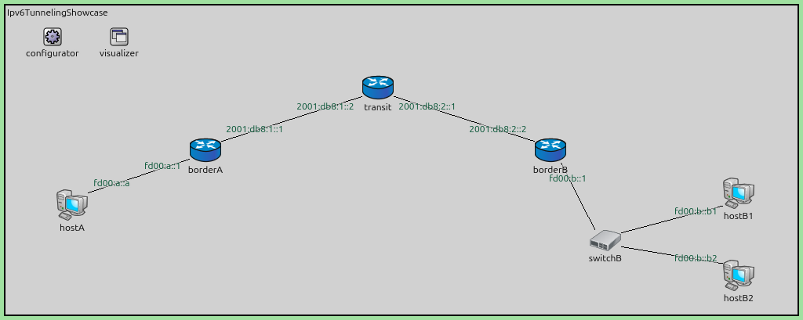
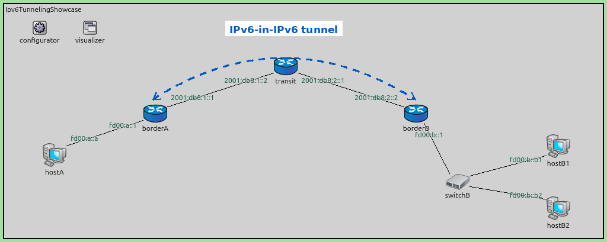
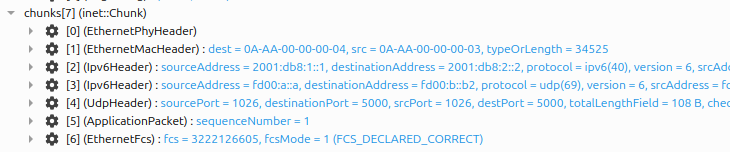

IPv6-in-IPv6 Tunneling
======================

Goals
-----

A network can only forward a packet if it has a route for the destination address.
Some addresses are, by design, ones that no public network will ever carry. A site
that numbers its internal networks from such a range cannot simply send those packets
across the Internet to another site.

Tunneling solves this by hiding the packet. The site's border router wraps the whole
packet inside a second IPv6 header that uses addresses the public network *does*
carry. The network forwards the outer packet normally and never inspects what is
inside. The router at the far end removes the outer header and delivers the original
packet into the second site.

This showcase demonstrates IPv6-in-IPv6 tunneling as defined in RFC 2473. Two sites
use addresses the network between them cannot route, and a tunnel between the site
border routers carries their traffic across. The showcase then varies one thing at a
time: which traffic the tunnel carries, and what happens when the routing that feeds
the tunnel is wrong.

One point of scope, because the term is ambiguous. "IPv6 tunneling" often means
carrying IPv6 across an IPv4-only network — the transition mechanisms 6in4, 6to4, 6rd
and Teredo. This page is not about those, and INET does not model them. This page is
about carrying IPv6 inside IPv6, which is a different mechanism solving a different
problem.

| Verified with INET version: ``4.7``
| Source files location: `inet/showcases/ipv6/tunneling <https://github.com/inet-framework/inet/tree/master/showcases/ipv6/tunneling>`__

About IPv6-in-IPv6 tunneling
----------------------------

A tunnel puts one packet inside another. The node that adds the outer header is the
*tunnel entry point*, and the node that removes it is the *tunnel exit point*. The
original packet is the *inner packet*; the packet that actually travels is the *outer
packet*.

The outer header is an ordinary IPv6 header. Its source address is the entry point,
its destination address is the exit point, and its Next Header field says ``IPv6``.
That last field is the whole trick: it tells the exit point that the payload is
another IPv6 datagram rather than a transport protocol. Every router between the two
endpoints treats the outer packet as normal traffic addressed to the exit point, and
never looks at the inner packet at all.

Nothing about this is specific to IPv6-in-IPv6. Putting a packet inside another packet
and routing the outer one is the mechanism underneath every overlay network in use
today. IPv6-in-IPv6 is that mechanism in its simplest form, because the outer header
is the same IPv6 header the reader already knows, with nothing added.

Addresses the network will not carry
~~~~~~~~~~~~~~~~~~~~~~~~~~~~~~~~~~~~

IPv6 reserves a range called Unique Local Addresses, ``fc00::/7``, defined in
RFC 4193. In practice organisations use the ``fd00::/8`` half of it. Unique Local
Addresses are the rough equivalent of the private address ranges in IPv4: they are
meant for traffic inside an organisation, and they never appear in the global routing
table.

An organisation creates its own Unique Local Address prefix by choosing 40 random
bits. RFC 4193 makes that choice random so that two organisations are very unlikely
to pick the same prefix, which is what makes the addresses safe to use privately and
even between co-operating organisations.

What they are not is *globally* routable, and that is a matter of policy rather than
of any technical ambiguity. RFC 4193 states that these addresses are not expected to
be routed on the global Internet. No registry records who holds which prefix, no
provider has any reason to carry them, and providers filter them at their borders as
a matter of course. The consequence is the one that matters here: a packet carrying
these addresses will not cross a public network.

So two networks that both use Unique Local Addresses have a concrete problem. Each
works internally. Neither can reach the other across a public network, because that
network will not carry the addresses. RFC 4193 anticipates this and allows the
addresses to be routed between co-operating sites where the routes are deliberately
set up — which is exactly what a tunnel does. The inner packet keeps the Unique Local
Addresses, and the outer packet uses the border routers' public addresses.

The two prefixes in this showcase, ``fd00:a::/64`` and ``fd00:b::/64``, are written to
be easy to read and to tell apart. A real prefix has 40 pseudo-random bits in the
middle and looks more like ``fd2b:47a1:9c3e::/48``, and a single organisation numbers
all of its sites out of one such prefix.

A tunnel is not a Virtual Private Network
~~~~~~~~~~~~~~~~~~~~~~~~~~~~~~~~~~~~~~~~~

The arrangement in this showcase looks like a Virtual Private Network, and the shape
is indeed the same. The difference matters: a plain IPv6-in-IPv6 tunnel gives
*reachability*, not *confidentiality*. Nothing in it is encrypted or authenticated.
Anyone who can observe the transit network can read every inner packet, and anyone who
can inject traffic toward the exit point can inject inner packets. In a real
deployment the encapsulation is what a security protocol such as IPsec is layered on
top of; the tunnel by itself carries traffic, it does not protect it.

IPv6-in-IPv6 tunneling in INET
------------------------------

In INET a tunnel is not a protocol module. It is a *virtual network interface* called
``Ipv6TunnelInterface``. A packet routed to that interface is handed back to IPv6 with
the tunnel endpoints attached to it, and IPv6 wraps it in the outer header and
forwards the result toward the exit point like any other locally originated packet.
The wrapping is done by the ordinary IPv6 code that encapsulates any payload; the
tunnel interface only says which addresses to use. At the far end, IPv6 sees a datagram
addressed to itself whose Next Header field says ``IPv6``, removes the outer header,
and processes the inner packet as if it had just arrived from the network.

This leads to the single most useful idea on this page:

    A tunnel is one network interface plus one route.

The interface says *where the tunnel goes*. The route says *what goes into it*. The
two are configured independently, and changing only the route changes what the tunnel
is used for, without touching the tunnel itself.

How the configuration is written
~~~~~~~~~~~~~~~~~~~~~~~~~~~~~~~~

Two kinds of file describe the scenario, and it helps to know which is which before
reading the fragments below.

``omnetpp.ini`` sets module parameters. Each line is a pattern naming one or more
modules, then the parameter and its value. In ``*.borderA.tun[0].mtu``, the leading
``*`` stands for the network, so the line sets the ``mtu`` parameter of the first
tunnel interface of the node called ``borderA``. The file is divided into sections:
``[General]`` applies to everything, and each ``[Config ...]`` section describes one
scenario. ``extends`` lets one section inherit another's settings.

Addresses and routes are not module parameters, so they come from a separate XML file
read by a module called ``Ipv6NetworkConfigurator``. The ini points at that file with
``xmldoc("...")``. This showcase has four such XML files, one per configuration. They
are identical except for the one or two routes that lead into the tunnel, which is the
only thing the configurations actually vary.

Configuring the interface
~~~~~~~~~~~~~~~~~~~~~~~~~

Host and router node types have a ``tun`` submodule vector for tunnel interfaces.
Setting ``numTunInterfaces`` creates the slots, and each slot's type and parameters
are set individually:

.. literalinclude:: ../omnetpp.ini
   :caption: omnetpp.ini
   :start-at: *.borderA.numTunInterfaces
   :end-at: *.borderA.tun[0].destination
   :language: ini

Three parameters describe the tunnel (the module declares two more that every
network interface has):

- ``source`` — the tunnel entry point, which must be an address of this node. It
  becomes the source address of the outer header.
- ``destination`` — the tunnel exit point. It becomes the destination address of the
  outer header.
- ``mtu`` — the largest packet the tunnel will accept, 1500 bytes by default. This
  showcase leaves it at the default, which is why the ini fragment above does not
  mention it.

The submodule is written ``tun[0]`` in the ini because it is the first element of a
vector, but the network interface it registers is named ``tun0``, without the
brackets. That is the name routes use.

Unlike a tunnel interface on most router operating systems, this one needs no address
of its own. It never appears as a source or destination — the addresses in the outer
header are the ``source`` and ``destination`` above, which belong to the node's real
interfaces.

Each end is configured separately, and each end describes only its own direction. The
tunnel in this showcase is used in both directions, so both border routers declare an
interface, with the ``source`` and ``destination`` values swapped. Configuring only
one end would give a tunnel that carries traffic one way and nothing back.

Steering traffic into the tunnel
~~~~~~~~~~~~~~~~~~~~~~~~~~~~~~~~

The tunnel interface has no idea which traffic it is meant to carry. It wraps whatever
arrives and sends it to its far end. What decides which traffic arrives is an ordinary
route whose output interface is the tunnel:

.. literalinclude:: ../tunnel.xml
   :caption: tunnel.xml
   :start-at: <route hosts="borderA" destination="fd00:b::/64"
   :end-at: <route hosts="borderB" destination="fd00:a::/64"
   :language: xml

Because the route is ordinary, the usual longest-prefix rule applies, and the *shape*
of the route decides what the tunnel is for. A route for a single address sends one
host's traffic through it. A route for a prefix sends a whole remote site. A default
route sends everything. This showcase uses the first two.

The cost of the outer header
~~~~~~~~~~~~~~~~~~~~~~~~~~~~

The outer header is 40 bytes, and those bytes are added to every packet the tunnel
carries. A packet that exactly filled the outgoing link before encapsulation no longer
fits after it, and the entry point must then split it into fragments that the exit
point reassembles. Setting the tunnel's ``mtu`` to the link's limit minus 40 avoids
this: an oversized packet is then refused rather than split, and the sender is told so
with an ICMPv6 Packet Too Big message, which is what allows it to send smaller packets
instead. This showcase keeps the default and uses 100-byte packets, so nothing is ever
fragmented here.

The Model
---------

All four configurations use the same network:

   The network, with the address each interface holds. The ``configurator`` and
   ``visualizer`` modules have no part in the protocol: the first assigns the
   addresses and routes, and the second draws the address labels.

.. FIGURE RECIPE: launch `inet -u Qtenv -c NoTunnel --mcp-server-address localhost:8799`,
   then over the MCP server: run_simulation time_limit 1.9s mode express (so addresses are
   assigned and no packet is in flight), then get_canvas_image with module_path "<root>",
   area "module_rectangle", margin 5. NoTunnel is used deliberately: in the tunnel configs
   the tunnel interface adds an "fe80::" label that means nothing to a reader.

The tunnel itself is not part of the topology. It is drawn here as a dashed line, but
there is no link between the two border routers — only an interface on each of them
and a route that leads to it:

   The tunnel between the two border routers. The dashed line is drawn on the figure
   to show where the tunnel goes; it is not a link in the model.

.. FIGURE RECIPE: derived from media/network.png. The dashed arc, its two arrow heads
   and the label are drawn with PIL: a quadratic Bezier from (258,168) through
   (478,28) to (700,168) in the 1024x409 image, 3px wide, colour (0,90,200), dashes of
   9 samples out of 400, with a white label box centred at x=478, y=40. Redraw it
   whenever network.png is recaptured, since the coordinates follow the node
   positions.

``hostA`` is in site A and ``hostB1`` and ``hostB2`` are in site B. ``borderA`` and
``borderB`` are the two site border routers, and ``transit`` is a router in the public
network between them. ``switchB`` is an Ethernet switch that puts both site B hosts on
one link. The hosts and routers are ``StandardHost6`` and ``Router6``, the IPv6
variants of INET's generic host and router.

The addresses in the figure are the point of the network:

.. list-table::
   :header-rows: 1

   * - Link
     - Prefix
     - Kind
   * - ``hostA`` – ``borderA`` (site A)
     - ``fd00:a::/64``
     - Unique Local Address
   * - ``borderA`` – ``transit``
     - ``2001:db8:1::/64``
     - globally routable
   * - ``transit`` – ``borderB``
     - ``2001:db8:2::/64``
     - globally routable
   * - ``borderB`` – site B hosts
     - ``fd00:b::/64``
     - Unique Local Address

Both sites use Unique Local Addresses. Both border routers also have a globally
routable address on the link toward ``transit``, and those two addresses are the
tunnel endpoints. ``2001:db8::/32`` is the range RFC 3849 reserves for documentation;
it stands in here for real provider-assigned addresses.

Routing is configured by hand rather than computed, using
``*.configurator.addStaticRoutes = false`` and an explicit route for every node. This
is more verbose than letting the configurator compute shortest paths, but it makes the
premise of the showcase visible instead of merely asserted. The transit router's
routing table is this, and nothing else:

.. code-block:: none

    transit:
      2001:db8:1::/64 via <unspec> dev eth0
      2001:db8:2::/64 via <unspec> dev eth1

That is the output of the configurator's ``dumpRoutes`` option, which prints every
node's routing table at the start of the run. ``<unspec>`` means the route has no next
hop because the destination is on a directly attached link.

Those are the routes the configurator created. The table also holds the link-local
``fe80::/10`` route that every IPv6 interface gets, which never carries traffic
between sites. What matters is that nothing in it matches either site's addresses. Any packet carrying them that reaches ``transit`` is discarded. In a real
network the absence is not a configuration choice — it is unavoidable, for the reasons
given above. Here it has to be arranged deliberately, because a shortest-path
configurator would happily install routes that reality would not.

The rest of the scenario is the same in every configuration:

.. literalinclude:: ../omnetpp.ini
   :caption: omnetpp.ini
   :start-at: [General]
   :end-before: [Config NoTunnel]
   :language: ini

``hostA`` sends 100-byte UDP packets to both site B hosts, twice a second, from 2 s to
the end of the 10 s simulation. That is 16 packets to each host, and the two receiving
hosts run ``UdpSink``. Traffic starts at 2 s so that Neighbor Discovery has finished
first; a packet sent before a node knows its neighbours would be delayed or dropped
for reasons that have nothing to do with tunneling.

NoTunnel Configuration
~~~~~~~~~~~~~~~~~~~~~~

The ``NoTunnel`` configuration is the baseline. There is no tunnel, and the two sites
are left to reach each other directly:

.. literalinclude:: ../omnetpp.ini
   :caption: omnetpp.ini
   :start-at: [Config NoTunnel]
   :end-before: [Config Tunnel]
   :language: ini

``hostA`` sends its packets to ``borderA``. ``borderA`` has no route for
``fd00:b::/64``, so it forwards them along its default route toward ``transit``, the
way a site router hands anything it does not recognise to its provider. ``transit``
has no route for those addresses and discards them.

``transit`` does try to report the failure, and cannot. The ICMPv6 Destination
Unreachable message it generates is addressed to ``hostA``, whose address
``fd00:a::a`` is a Unique Local Address as well — so the error is discarded for exactly
the same reason as the packet that caused it. ``hostA`` learns nothing. Both sites are
simply invisible to the network between them.

Tunnel Configuration
~~~~~~~~~~~~~~~~~~~~

The ``Tunnel`` configuration adds a tunnel interface to each border router and a route
for the whole remote site pointing into it:

.. literalinclude:: ../omnetpp.ini
   :caption: omnetpp.ini
   :start-at: [Config Tunnel]
   :end-before: [Config SelectiveTunnel]
   :language: ini

The tunnel endpoints are the two public addresses, ``2001:db8:1::1`` and
``2001:db8:2::2``. The routes that feed the tunnel are the two shown earlier: on
``borderA``, everything for ``fd00:b::/64``; on ``borderB``, everything for
``fd00:a::/64``.

SelectiveTunnel Configuration
~~~~~~~~~~~~~~~~~~~~~~~~~~~~~

The ``SelectiveTunnel`` configuration keeps exactly the same tunnel and changes one
route. Instead of a prefix route for the whole of site B, ``borderA`` gets a route for
one host address:

.. literalinclude:: ../selective.xml
   :caption: selective.xml
   :start-at: <route hosts="borderA" destination="fd00:b::b1"
   :end-at: <route hosts="borderA" destination="fd00:b::b1"
   :language: xml

.. literalinclude:: ../omnetpp.ini
   :caption: omnetpp.ini
   :start-at: [Config SelectiveTunnel]
   :end-before: [Config RoutingLoop]
   :language: ini

Traffic to ``hostB1`` now matches that route and enters the tunnel. Traffic to
``hostB2`` matches nothing that leads into the tunnel, so it takes the ordinary path
and dies at ``transit`` exactly as in the baseline.

RoutingLoop Configuration
~~~~~~~~~~~~~~~~~~~~~~~~~

Because the tunnel is fed by ordinary routes, an ordinary routing mistake can feed it
the wrong traffic. The ``RoutingLoop`` configuration adds one wrong route on
``borderB``: a host route for ``hostB1`` — a host directly attached to ``borderB`` —
pointing into the tunnel back towards ``borderA``:

.. literalinclude:: ../routing-loop.xml
   :caption: routing-loop.xml
   :start-at: <route hosts="borderB" destination="fd00:b::b1"
   :end-at: <route hosts="borderB" destination="fd00:b::b1"
   :language: xml

.. literalinclude:: ../omnetpp.ini
   :caption: omnetpp.ini
   :start-at: [Config RoutingLoop]
   :language: ini

The wrong route is longer than the on-link route covering the rest of site B, so it
wins. A packet for ``hostB1`` reaches ``borderB`` through the tunnel, and ``borderB``
sends it straight back through the tunnel to ``borderA``, which sends it forward
again. The packet bounces between the two border routers.

The headers do not pile up. Each router removes the outer header before it looks at
the inner packet, and adds a fresh one when it sends it back, so there is never more
than one outer header on the wire and the packet does not grow.

What stops it is the hop limit. Each border router forwards the inner packet, and
forwarding decrements its hop limit. INET starts an IPv6 packet with a hop limit of
30, and each round trip costs two decrements, so a packet reaches ``borderB`` about
fifteen times before it is discarded there. The loop is self-limiting: each individual packet dies
on its own hop limit, rather than circulating for ever. New packets keep entering the
loop until the sender stops, and the run itself ends on the simulation time limit.

This is an ordinary routing loop that happens to run through a tunnel. It is worth
separating from a different failure with a similar-sounding name. In *recursive
routing*, the route towards the tunnel's own exit point leads through the tunnel
itself: the entry point wraps the packet, looks up the outer destination, finds the
tunnel again, and wraps it once more, without ever putting anything on the wire. That
one has no hop limit to stop it, which is why router operating systems detect it
specifically and shut the tunnel down. It is not what happens here — each border
router reaches the other's public address by the ordinary route out of its Ethernet
interface. This page's own advice contains the trap, though: a *default* route into
the tunnel, mentioned earlier as one of the route shapes you might use, would send the
outer packet into the tunnel as well, and that is the real thing.

RFC 2473 also defines protection against genuinely nested tunnels: a Tunnel
Encapsulation Limit option that says how many further levels of encapsulation are
allowed, after which the packet is discarded. INET does not implement it. It would not
have helped here in any case, because nothing in this configuration nests.

Two other numbers here are INET's rather than the standard's. RFC 2473 says the outer
header's hop limit should start at the usual IPv6 default of 64, where INET uses 30 —
so on real equipment a loop like this one would run about twice as long. And RFC 2473
expects a tunnel's MTU to be derived from the path between the endpoints and updated
as that path changes, where ``Ipv6TunnelInterface`` has a fixed value you set
yourself.

Results
-------

The first question is whether the traffic arrives. This is the number of packets each
site B host received, out of 16 sent to each:

.. list-table::
   :header-rows: 1

   * - Configuration
     - ``hostB1``
     - ``hostB2``
   * - ``NoTunnel``
     - 0
     - 0
   * - ``Tunnel``
     - 16
     - 16
   * - ``SelectiveTunnel``
     - 16
     - 0
   * - ``RoutingLoop``
     - 0
     - 16

The baseline delivers nothing, which confirms that the transit network really cannot
carry these addresses and that the tunnel is doing the work in the other
configurations.

``SelectiveTunnel`` delivers to one host and not the other. Both hosts are on the same
link in the same site, and both are reached through the same tunnel — the only
difference is that one of them is named by a route and the other is not. This is the
clearest demonstration on the page that the tunnel carries whatever the routing gives
it, and nothing else.

``RoutingLoop`` inverts the pattern: the host with the wrong route is the one that
gets nothing, while ``hostB2``, whose routing is untouched, keeps receiving all 16
packets. A tunnel does not "break"; one route breaks one destination.

What an encapsulated packet looks like
~~~~~~~~~~~~~~~~~~~~~~~~~~~~~~~~~~~~~~

The following is an Ethernet frame captured on the link between ``borderA`` and
``transit`` in the ``Tunnel`` configuration, shown as the chunk list of INET's packet
inspector:

.. FIGURE RECIPE: launch `inet -u Qtenv -c Tunnel --mcp-server-address localhost:8799`,
   then over the MCP server: run_simulation to 2.6s in "fast" mode, list_logged_packets with
   module_path "borderA" and pick a 214-byte EthernetSignal whose hop_modules run borderA ->
   transit, open_inspector on its "logged:<treeId>" path with type "object",
   expand_inspector_tree depth 4, then get_inspector_screenshot width 1500 height 3800 and
   crop the "chunks[7]" block (it sits under the "dissection" node, below the raw bin/raw hex
   listings). Depth 3 leaves the chunk list collapsed; depth 4 also expands the raw bit dump,
   which is why the screenshot must be tall and then cropped.

The two middle entries are the point. Chunk ``[2]`` is the outer IPv6 header: it runs
from ``2001:db8:1::1`` to ``2001:db8:2::2``, the two public tunnel endpoints. Chunk
``[3]`` is the inner header, still carrying the original ``fd00:a::a`` and
``fd00:b::b2`` addresses.

The field the figure calls ``protocol`` is the header's Next Header field, the one
described earlier. On the outer header it names ``ipv6``, which is what tells the exit
point that the payload is another IPv6 datagram. On the inner header it names ``udp``.

The numbers in brackets are not the values that travel on the wire. ``ipv6(40)`` and
``udp(69)`` are identifiers INET uses internally; the Next Header bytes in the actual
headers are 41 for IPv6 and 17 for UDP.

The transit network forwards this frame using the addresses in chunk ``[2]``, which it
has routes for. The addresses in chunk ``[3]``, which it has no routes for, are just
payload bytes to it.

The other entries are the ordinary framing around the packet. ``[0]`` and ``[1]`` are
the Ethernet physical and MAC headers, ``[4]`` is the UDP header, ``[5]`` is the
application's own data, and ``[6]`` is the Ethernet frame check sequence.

The cost of the loop
~~~~~~~~~~~~~~~~~~~~

Delivery counts do not show the whole effect of ``RoutingLoop``. Counting the packets
that crossed the link between ``transit`` and ``borderA`` does:

.. list-table::
   :header-rows: 1

   * - Configuration
     - packets sent by ``transit`` toward ``borderA``
   * - ``Tunnel``
     - 4
   * - ``RoutingLoop``
     - 244

The four packets in the first row are not application traffic — the receiving hosts
never reply. They are Neighbor Discovery messages, which every node exchanges to
resolve its neighbours' link-layer addresses. The 240 packets above that baseline are
the loop.

Sixteen packets, each bouncing until its hop limit runs out, put roughly 240 extra
packets onto the transit link. Almost all of that is data that never reaches anyone:
224 of the 240 are the looping packets themselves. The remaining 16 are ICMPv6 Time
Exceeded messages, one per packet, generated when its hop limit finally reaches zero.

Those 16 are worth following, because they close a loop with the baseline. In
``NoTunnel`` the error could not get home: it was addressed to ``fd00:a::a``, which
the transit network cannot route, so it died alongside the packet that caused it and
``hostA`` learned nothing. Here the tunnel gives that same error a path back, so
``hostA`` does learn that its packets are expiring. The network is the same and the
address is the same; the tunnel is the only difference.

This is why a routing loop through a tunnel matters in practice. The visible symptom
is that one destination is unreachable. The expensive consequence is that the link
between the sites carries many times its normal load to accomplish nothing.

Sources: :download:`omnetpp.ini <../omnetpp.ini>`,
:download:`Ipv6TunnelingShowcase.ned <../Ipv6TunnelingShowcase.ned>`,
:download:`no-tunnel.xml <../no-tunnel.xml>`,
:download:`tunnel.xml <../tunnel.xml>`,
:download:`selective.xml <../selective.xml>`,
:download:`routing-loop.xml <../routing-loop.xml>`

Try It Yourself
---------------

If you already have INET installed, write the following into the command line from the
INET root directory:

.. code-block:: bash

    $ cd showcases/ipv6/tunneling
    $ inet

``inet`` with no arguments offers a list of the four configurations to choose from.

Otherwise, there is an easy way to install INET and OMNeT++ using ``opp_env``, and run
the simulation interactively.

Ensure that ``opp_env`` is installed on your system, then execute:

.. code-block:: bash

    $ opp_env run inet-4.7 --init -w inet-workspace --install --build-modes=release --chdir \
       -c 'cd inet-4.7.*/showcases/ipv6/tunneling && inet'

This command creates an ``inet-workspace`` directory, installs the appropriate
versions of INET and OMNeT++ within it, and launches the ``inet`` command in the
showcase directory for interactive simulation.

Alternatively, for a more hands-on experience, you can first set up the
workspace and then open an interactive shell:

.. code-block:: bash

    $ opp_env install --init -w inet-workspace --build-modes=release inet-4.7
    $ cd inet-workspace
    $ opp_env shell

Inside the shell, start the IDE by typing ``omnetpp``, import the INET project,
then start exploring.

.. TODO: replace the issue-tracker link below once the showcase discussion issue is opened

Discussion
----------

Use `this page <https://github.com/inet-framework/inet-showcases/issues>`__ in
the GitHub issue tracker for commenting on this showcase.
