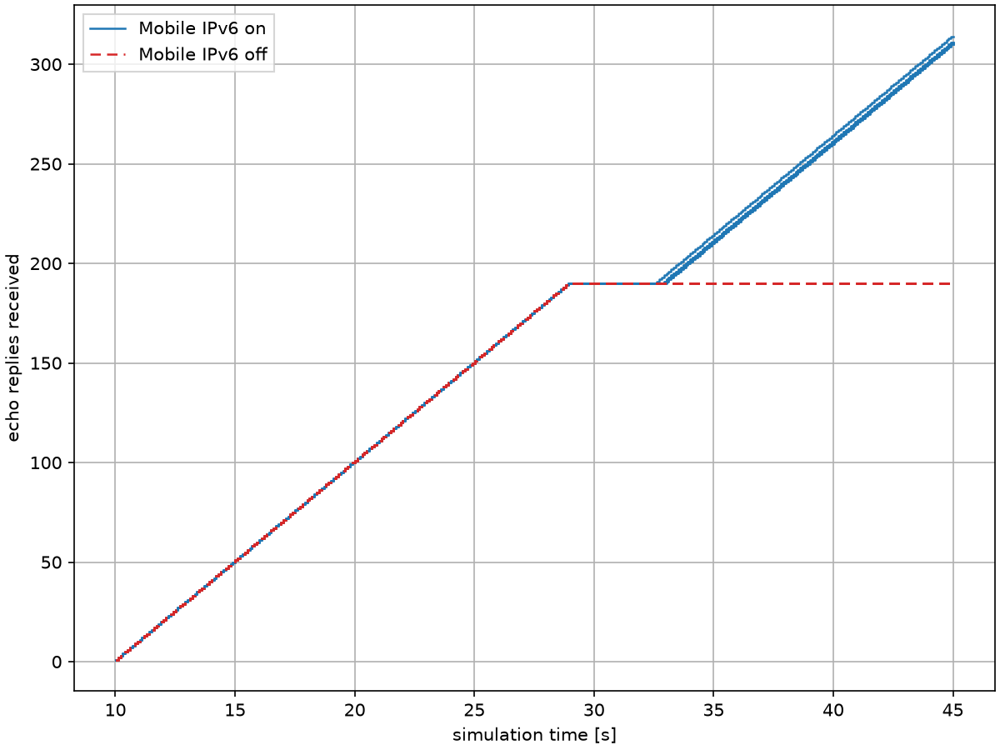
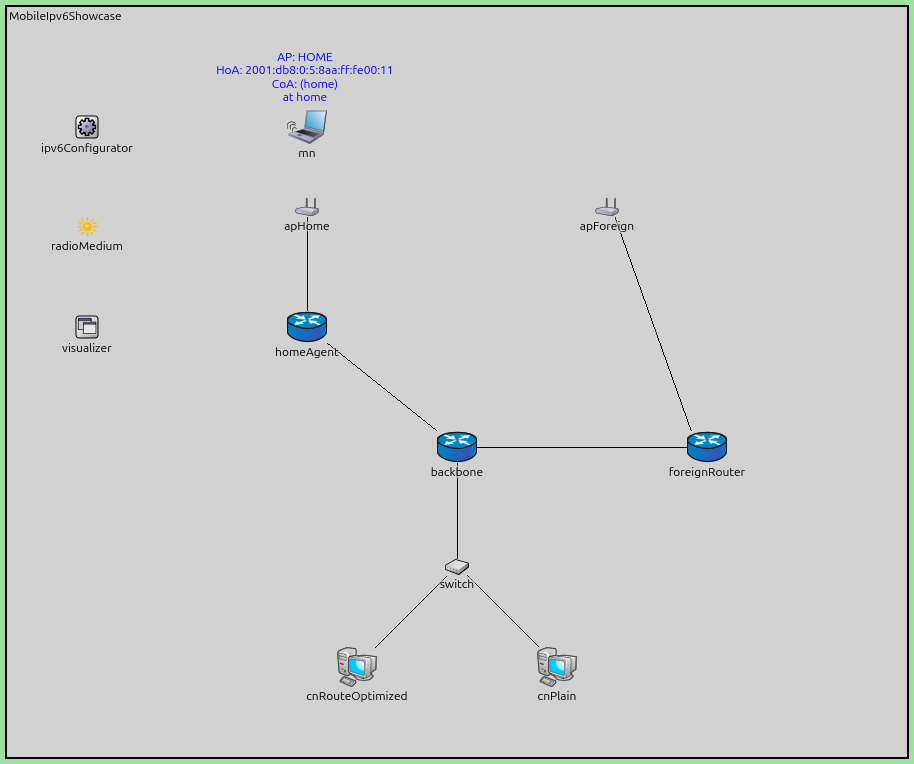
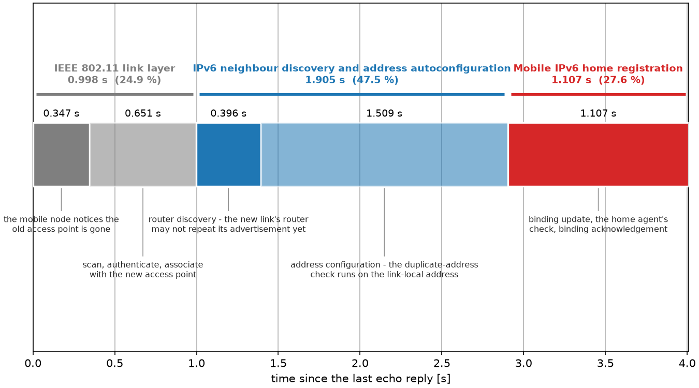
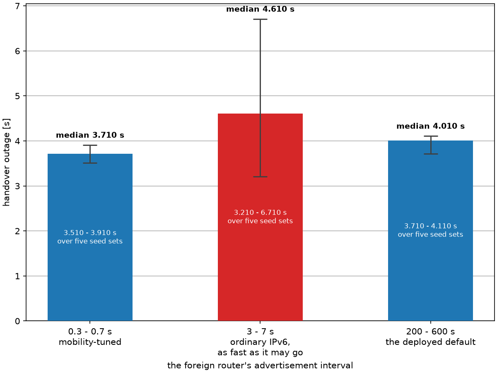
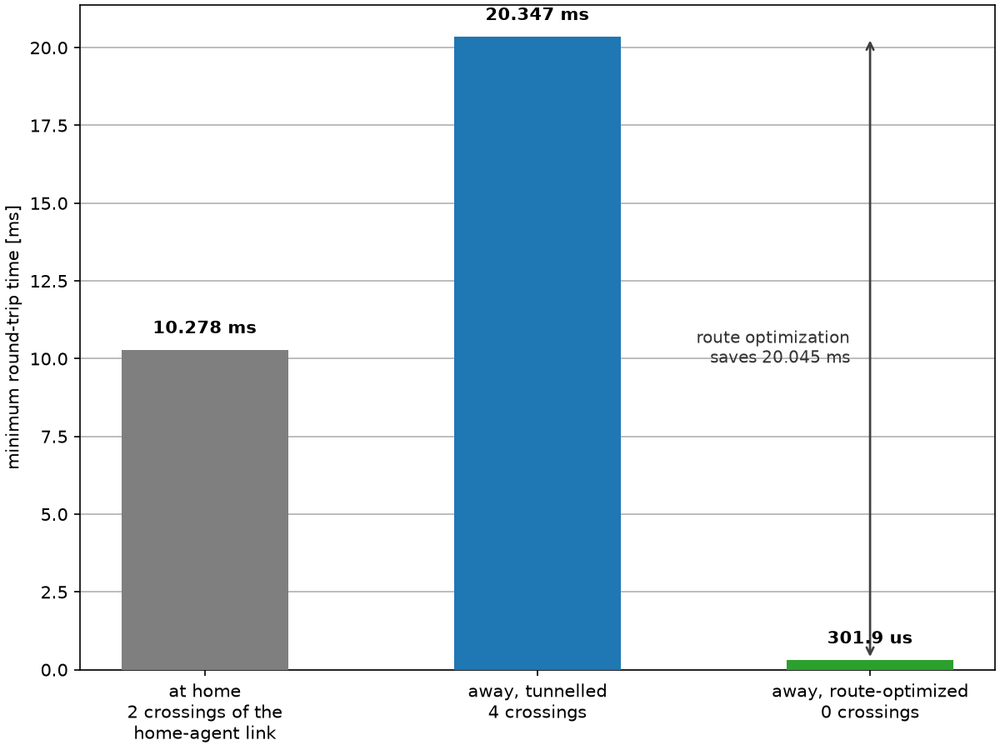
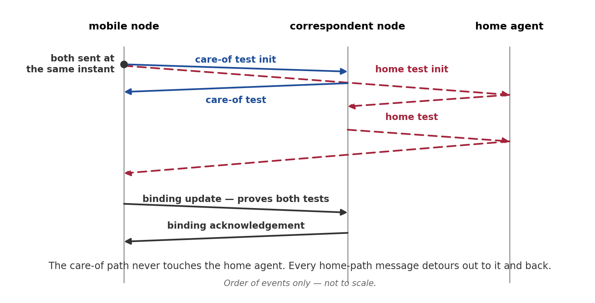
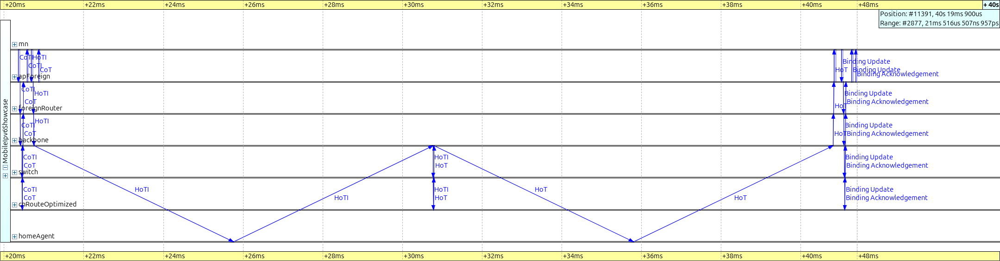

Keeping a Flow Alive While a Node Moves
=======================================

Goals
-----

An ordinary Internet Protocol version 6 (IPv6) address only routes to the place
in the network it was assigned from. When a device moves to a different link it
must take a new address, and every open transport connection breaks, because a
connection is bound to a fixed pair of addresses.

Mobile IPv6 (MIPv6) solves this by giving the device **two** addresses and
keeping them associated. A permanent **home address** is its identity, and a
**care-of address**, which changes at every link it visits, says where it
currently is. A router on its home link, the **home agent**, holds the mapping
between them.

In this showcase a mobile node moves from its home link to a foreign link while
a correspondent node is sending it traffic. We measure how long the flow is
interrupted, where that time actually goes, and what changes when the
correspondent node is told to send directly instead of through the home agent.

| Verified with INET version: ``TBD``
| Source files location: `inet/showcases/mobileip/mipv6 <https://github.com/inet-framework/inet/tree/master/showcases/mobileip/mipv6>`__

.. TODO: The version line above is a placeholder. This showcase is held until the two Mobile
   IPv6 first-registration timer fixes it depends on are merged into INET master. Set the
   version then, and re-run the verification pass: every number on this page was measured on
   the pre-merge branch, base f513057d65.

.. admonition:: In one minute
   :class: note

   A mobile node keeps one permanent **home address** as its identity and takes a
   new **care-of address** at every link it visits. The binding between the two is
   what Mobile IPv6 (MIPv6) maintains, and it is what keeps the flow alive.

   Across a node's **first** handover the flow here is interrupted for **3.7 to 4.1
   seconds** and then resumes; a later one is about a second shorter. Only **10.1 ms** of that is Mobile IPv6 messages in flight. Nearly
   all the rest is waiting for timers — most of them belonging to the wireless link
   and to ordinary IPv6, and one full second of it to a check that Mobile IPv6 itself
   requires. Once the correspondent node holds a binding, every round trip is
   **20.0 ms** shorter, because packets stop making the detour through the home
   agent.

..
   FIGURE RECIPE (redo via the "inet-showcase-charts" skill)
   type:     chart (matplotlib)
   anf:      MobileIpv6Showcase.anf   chart "Flow survival"
   inputs:   results/Baseline-#*.{sca,vec}, results/Tunnelled-#*.{sca,vec}
   shows:    cumulative echo replies received against time, five seed sets per arm. The
             mobility-off arm goes flat at 28.910 s and stays flat for the remaining 16.09 s;
             the Mobile IPv6 arm goes flat at the same instant, stays flat 3.71-4.11 s, then
             resumes at the SAME slope and the five seeds fan out permanently.
   why this quantity: pingRxSeq records the sequence number of the ARRIVING reply, and the
             sender emits sequence n at 10 + 0.1n, so time and value advance together and the
             outage is NOT a flat segment in the recorded vector (slope across the gap
             9.97 seq/s against 10.00 outside it - a fraction of a pixel). The chart script
             derives the cumulative count and appends a terminal sample at t = 45 s, without
             which the mobility-off arm merely stops instead of running flat.
   anchor:   the flat starts at 28.910 s in every seed of both arms (spread 100 us) and the
             mobility-off arm never leaves y = 190. If any Mobile IPv6 arm's flat is longer
             than ~4.2 s the foreignRouter advertisement interval is not the deployed default.
   export:   opp_charttool imageexport MobileIpv6Showcase.anf -n "Flow survival" \
               -f png --dpi 150 -d doc/media      ; 8x6 in -> 1200x900 px
   stamp:    captured 2026-08, INET f513057d65, OMNeT++ 6.4.0aipre2

**Without Mobile IPv6 the flow stops at the move and never comes back; with it,
the same flow stops at the same instant and resumes a few seconds later.**

Both arms are the same network, the same movement and the same traffic. The only
difference is whether the mobile node runs Mobile IPv6. Five seed sets are drawn
for each arm; the flat segment is the interruption, and its length is what the
rest of this page takes apart.

.. admonition:: Details — why the chart counts replies instead of plotting them
   :class: note

   The natural quantity to plot is the sequence number of each arriving reply, but
   it hides the very thing this figure exists to show. The sender emits sequence
   *n* at 10 + 0.1*n* seconds, so sequence number and time advance together, and an
   interruption in the flow is not a flat segment in that vector — it is a change
   of slope from 10.00 to 9.97 replies per second, a fraction of one pixel. The
   chart therefore counts the replies that have arrived. The 10 seconds of empty
   lead-in before traffic starts is not an outage.

Where Mobile IPv6 Stands Today
------------------------------

Host-based Mobile IPv6 is **not a production technology**. No mobile operator
runs it in its network, and no mainstream handset ships a stack that end users
depend on. Production mobile networks solved the same problem a different way:
with **network-based mobility**, where the network moves the traffic and the
device does nothing mobility-specific.

The GPRS Tunnelling Protocol carries the user plane in the mobile core, and
Proxy Mobile IPv6 does the same job on non-3GPP access. The 3rd Generation
Partnership Project did standardize a host-based option and it lost. INET
implements the network-based sibling too, in ``examples/ipv6/pmipv6``.

So why teach this protocol? Because Mobile IPv6 is the most legible illustration
of mechanics that every deployed mobility system still uses underneath: a stable
identity address, a temporary location address, a binding between them, a tunnel
to the current location, and a measurable interruption at the moment of handover.
Understand this model and the conceptual skeleton of the deployed ones follows.

For a modern reader, one more contrast: an engineer today who wants a connection
to survive a network change reaches for Multipath TCP or QUIC connection
migration. Mobility moved up the stack, where it needs no cooperation from
routers or firewalls.

About Mobile IPv6
-----------------

**Two addresses.** The mobile node keeps a **home address** that never changes.
Transport connections and peers use it as the node's identity. On each link it
visits it also configures a **care-of address**, which carries that link's prefix
and therefore says where the node currently is. The transport layer only ever
sees the home address, so a connection survives the move.

**The home agent.** A router on the home link keeps the mapping — the
**binding** — from home address to current care-of address. To catch the packets
addressed to a home address whose owner is not there, it answers for that address on
the home link itself, on the absent node's behalf — proxy Neighbour Discovery.
Nothing else on the Internet needs to know the node has moved.

**The binding update.** When the mobile node configures a new care-of address it
sends a **binding update** to the home agent, which replies with a **binding
acknowledgement**. That exchange is the whole registration: one message each way.

**Bidirectional tunnelling.** Once the binding exists, the home agent takes
packets addressed to the home address and wraps them in a second, outer header
addressed to the care-of address. The mobile node unwraps them. Its own traffic
goes back the same way, wrapped, through the home agent.

.. code-block:: text

    correspondent node            home agent              mobile node
          |                            |                       |
          |  to: home address          |                       |
          |--------------------------->|                       |
          |                            |  outer header         |
          |                            |  to: care-of address  |
          |                            |---------------------->|  unwraps it; the inner
          |                            |                       |  packet is addressed to
          |                            |                       |  the home address
          |                            |  outer header         |
          |                            |<----------------------|  the reply is wrapped
          |  from: home address        |                       |  the same way
          |<---------------------------|                       |

**The correspondent node never learns that anything moved: it sends to the home
address and receives from the home address, exactly as it would for a fixed
host.**

This is the mandatory part of Mobile IPv6, and it works against any peer,
including one that has never heard of the protocol. The outer header costs
**40 bytes on every packet** on the tunnelled leg, so 40 bytes less of every packet
is available to the flow — a maximum-transmission-unit decision for anyone deploying
it.

The protocol is specified in RFC 6275.

Mobile IPv6 in INET
-------------------

INET provides ready-made node types, so a Mobile IPv6 network is assembled from
stock parts:

- ``WirelessHost6`` — a wireless IPv6 host that acts as a mobile node.
- ``HomeAgent6`` — an IPv6 router that also serves as a home agent.
- ``CorrespondentNode6`` — an IPv6 host that can hold a binding and therefore
  route-optimize.
- ``StandardHost6`` — a plain IPv6 host, with no Mobile IPv6 at all. We use one
  as a correspondent node on purpose, and one as the mobile node in the
  mobility-off arm.

All of them are ordinary IPv6 nodes with Mobile IPv6 enabled and a role flag set.
The one parameter this showcase changes at run time is
``useRouteOptimization`` on the mobile node, which decides whether its traffic
stays on the home-agent tunnel or goes direct once a correspondent node accepts a
binding.

The Model
---------

..
   FIGURE RECIPE (redo via the "omnetpp-mcp-sim" skill)
   type:     Qtenv canvas image
   config:   Tunnelled, run 0 (seed set 1)
   shows:    the nine-node network. What the picture CAN carry is that homeAgent terminates
             its own branch off backbone, so a packet routed through it leaves the
             correspondent-node-to-apForeign path and returns along the same link.
             What it CANNOT carry, and what no caption may claim from it: homeAgent and
             foreignRouter are topologically and visually identical branches off backbone,
             and the 5 ms delay that makes the detour measurable is NOT annotated on the
             image. The delay is stated in the prose two paragraphs below instead.
   launch:   opp_run -m -u Qtenv -n <src>:<showcases> -l <libINET.so> -c Tunnelled -r 0 \
               --mcp-server-address=localhost:8765
   steps:    run_simulation(time_limit="5s", mode="express")   # before traffic starts at 10 s
             run_simulation(event_limit=200, mode="fast")      # then wait ~2.5 s of WALL CLOCK
             run_simulation(event_limit=3, mode="normal")      # repaint, clears the stale bubble
             get_canvas_image(area="all_elements", margin=5)   # 914 x 764
   hazard:   after an express run Qtenv redraws the LAST bubble() notification ("Associated with
             AP") over the mobile node's label. The fast-run + wall-clock-wait + repaint above
             clears it. Verify before shipping: no pixel of RGB(248,248,216) in the image.
   stamp:    captured 2026-08, INET f513057d65, OMNeT++ 6.4.0aipre2

**The home agent sits at the end of its own branch: traffic sent through it leaves the
path from the correspondent nodes to the foreign link and comes back.**

The mobile node carries its two addresses on its label as ``HoA:`` — the home address
that never changes — and ``CoA:`` — the care-of address it takes on each link.

The mobile node ``mn`` starts on the home link, behind ``apHome``, and moves once
to ``apForeign`` between t = 25 s and t = 30 s. Two correspondent nodes sit on the
same switch: ``cnRouteOptimized`` runs Mobile IPv6, and ``cnPlain`` is a stock
IPv6 host that does not. Only ``cnRouteOptimized`` sends traffic unless a
configuration says otherwise.

The link between the backbone router and the home agent carries a one-way delay
``d`` of 5 ms. Everything else is a fast local link. That single delay is the
whole geometry of this showcase:

.. list-table::
   :header-rows: 1
   :widths: 40 30 30

   * - path
     - crossings of the home-agent link, per round trip
     - extra round-trip time
   * - away, sending direct
     - 0
     - none
   * - at home
     - 2
     - ``2d``
   * - away, through the home agent
     - 4
     - ``4d`` = 20 ms

.. literalinclude:: ../omnetpp.ini
   :language: ini
   :start-at: *.homeAgentLinkDelay
   :end-at: *.homeAgent.ipv6.ipv6.sendRedirects

Three of those lines need a word. The **foreign router** advertises at the interval a
deployed IPv6 router uses, and that is the setting every result below is measured at.

The other routers are deliberately left advertising far more often. That is a
workaround rather than a scenario choice — see the fine print below.

``sendRedirects = false`` on the home agent suppresses an ICMPv6 Redirect that the
standard does not ask for here: while the mobile node is away, its home address is by
construction not a neighbour on the home link, and that is the condition a Redirect
requires.

.. admonition:: Fine print — why the other routers advertise so often
   :class: note

   Leaving every router at the deployed interval can strand a node that never gets an
   answer to its very first router solicitation: with the next unsolicited
   advertisement minutes away, nothing rescues it, and in one seed set here a wired
   host silently ends up with no usable address for the whole run — no error, no
   warning, just a flow that never starts. The fast interval on the other routers
   avoids that. **If you change these values, check that every host still receives
   replies before trusting a result.**

The traffic is an ICMPv6 echo flow — ping — at ten packets per second, starting at
10 s, so the mobile node has long settled at home before the first packet. There is
no transport protocol above it: an echo request is carried directly by ICMPv6, which
is why the packet dumps further down show an ICMPv6 header and nothing between it and
the IPv6 header:

.. literalinclude:: ../omnetpp.ini
   :language: ini
   :start-at: *.cnRouteOptimized.numApps
   :end-at: *.cn*.app[0].startTime

Baseline: no Mobile IPv6
~~~~~~~~~~~~~~~~~~~~~~~~

The mobile node becomes a plain IPv6 host with a wireless interface. It still
moves, still associates with the foreign access point, and still configures an
address there — and the flow addressed to its home address never comes back.

.. literalinclude:: ../omnetpp.ini
   :language: ini
   :start-at: [Config Baseline]
   :end-before: [Config Tunnelled]

Tunnelled
~~~~~~~~~

Route optimization is off, so every packet between the correspondent node and the
mobile node passes through the home agent. This is the mandatory Mobile IPv6
spine and it is the configuration most of the results below come from.

.. literalinclude:: ../omnetpp.ini
   :language: ini
   :start-at: [Config Tunnelled]
   :end-before: [Config FrequentRouterAdvertisements]

Two advertisement-interval variations
~~~~~~~~~~~~~~~~~~~~~~~~~~~~~~~~~~~~~

The same handover with the foreign router advertising at two other rates. They
exist to measure one thing, and the answer is not the obvious one — see
`How often the router advertises`_.

.. literalinclude:: ../omnetpp.ini
   :language: ini
   :start-at: [Config FrequentRouterAdvertisements]
   :end-before: [Config RouteOptimized]

Route optimized
~~~~~~~~~~~~~~~

One parameter differs from ``Tunnelled``. Once the correspondent node holds a
binding, packets go direct.

.. literalinclude:: ../omnetpp.ini
   :language: ini
   :start-at: [Config RouteOptimized]
   :end-before: [Config MixedCorrespondents]

Mixed correspondents, and the return-routability capture
~~~~~~~~~~~~~~~~~~~~~~~~~~~~~~~~~~~~~~~~~~~~~~~~~~~~~~~~

``MixedCorrespondents`` gives the plain correspondent node a flow of its own, so
both peers are active at once. ``ReturnRoutability`` starts its traffic after the
mobile node has finished registering, which is what keeps the four-message
exchange in one tight burst for the sequence chart.

.. literalinclude:: ../omnetpp.ini
   :language: ini
   :start-at: [Config MixedCorrespondents]

Results
-------

Does the flow survive?
~~~~~~~~~~~~~~~~~~~~~~

Yes, and the interruption is bounded and repeatable. Across five seed sets the
flow stops at **t = 28.910 s** — the same instant every time, to the millisecond
— and resumes after **3.710, 4.010, 4.010, 4.110 and 4.110 seconds**. The median
is **4.010 s**.

The mobility-off arm stops at exactly the same instant and never resumes in the
remaining 16 seconds of the run. That is the comparison the claim rests on.

Where the time goes
~~~~~~~~~~~~~~~~~~~

..
   FIGURE RECIPE (redo via the "inet-showcase-charts" skill)
   type:     chart (matplotlib)
   anf:      MobileIpv6Showcase.anf   chart "Handover budget"
   inputs:   NONE from results/ - the five durations are CONSTANTS in the chart script.
             Mobile IPv6 records no measurement statistics, so the decomposition comes from
             event banners, not from a recorded vector. The script header carries the six
             instants they are differenced from, and the run that produced them.
   shows:    one representative handover split into five consecutive terms that sum exactly to
             the measured 4.010048 s outage, grouped in three by responsibility:
             802.11 link layer 0.998 s (24.9 %), IPv6 neighbour discovery and address
             autoconfiguration 1.905 s (47.5 %), Mobile IPv6 home registration 1.107 s (27.6 %)
   anchor:   config Tunnelled, run 0 (seed set 1), the median seed. Re-derive by running
             opp_run -u Cmdenv -c Tunnelled -r 0 --cmdenv-express-mode=false
                     --cmdenv-event-banners=true --cmdenv-log-level=info
             and differencing: 28.910419451735 / 29.257119314267 / 29.908202919212 /
             30.304007237774 / 31.813121475276 / 32.920467334000.
             If the terms no longer sum to the run's own largest pingRxSeq gap, the constants
             are stale and MUST be re-read before the figure ships.
   export:   opp_charttool imageexport MobileIpv6Showcase.anf -n "Handover budget" \
               -f png --dpi 150 -d doc/media      ; 9x5 in
   stamp:    captured 2026-08, INET f513057d65, OMNeT++ 6.4.0aipre2

**Almost all of the interruption is spent waiting for timers, and only about a
quarter of it belongs to Mobile IPv6 at all.**

One representative handover splits into five consecutive steps that sum exactly
to its 4.010 s outage:

.. list-table::
   :header-rows: 1
   :widths: 8 52 20 20

   * - #
     - step
     - duration
     - owned by
   * - 1
     - the mobile node notices the old access point is gone
     - 0.347 s
     - IEEE 802.11
   * - 2
     - scan, authenticate and associate with the new access point
     - 0.651 s
     - IEEE 802.11
   * - 3
     - router discovery — the new link's router may not repeat its advertisement yet
     - 0.396 s
     - IPv6
   * - 4
     - address configuration — the duplicate-address check runs on the link-local address
     - 1.509 s
     - IPv6
   * - 5
     - home registration, until traffic flows in both directions
     - 1.107 s
     - Mobile IPv6
   * -
     - **total**
     - **4.010 s**
     -

Grouped by who owns the delay: the wireless link layer takes **24.9 %**, generic
IPv6 neighbour discovery and address autoconfiguration take **47.5 %**, and
Mobile IPv6 home registration takes **27.6 %**.

Two facts shrink that last block. Almost all of it is one second in which the home
agent is not sending anything but checking that the home address is free — and **it
only does that the first time it takes on an address.** Every number on this page is
therefore a *first* handover.

Subtract that second from the measured 4.010 s and a later handover in the same
session comes to **3.010 s**, with Mobile IPv6's share of it falling to **3.57 %**.
That is arithmetic on the first handover, not a measurement: **no configuration here
moves the node twice**, and 86.9 ms of the remaining Mobile IPv6 time is the node
waiting for the flow's next packet rather than doing protocol work.

The memorable number is a different one. The handover involves exactly two Mobile
IPv6 messages, and between them they are in flight for **10.1 ms** — the binding
update takes 5.086 ms to reach the home agent and the acknowledgement 5.061 ms to
come back. Out of a four-second interruption, that is what the protocol's own
messaging costs. Everything else in step 5 is waiting.

.. admonition:: Details — why the home agent waits a second before it answers
   :class: note

   Before a home agent starts answering for a mobile node's home address it has to
   check that nobody else on the home link is already using it, and it only has to
   do this the first time it takes on that address. The standard mandates the
   check and sizes it at about a second: it tells the mobile node to use a longer
   retransmission timer for its first registration precisely so that the timer
   outlasts it.

   The binding update itself reaches the home agent in **5.086 ms**. The
   acknowledgement is then held for **exactly 1.000000000 s**, in every seed set.
   **This model waits the same second but does not send the check itself.**

.. admonition:: Fine print — the published figure is optimistic, not pessimistic
   :class: note

   The care-of address here is installed without a duplicate-address check; the
   check that runs, and that fills step 4, is on the link-local address. RFC 4862
   names this exact shortcut, tolerates it in implementations that already do it,
   and forbids it in new ones.

   A fully conforming implementation would run one more such check on the care-of
   address, and would therefore be roughly **one to two seconds slower** than the
   figure published here. **This number is an optimistic one; it must not be read
   as an upper bound.**

The interruption is also asymmetric, and a count shows that better than a
percentage. **39 echo requests go unanswered.** 29 of them never reach the mobile
node at all, because the home agent has no binding yet and nothing knows where to
send them.

The remaining **ten reach the mobile node and cannot be answered**, during the
second in which the home agent is checking the address. That ten is exactly ten
in every seed set — one second of hold divided by a ten-packets-per-second flow.

The reason is that the two directions recover separately. The home agent can
start delivering downlink traffic the moment it accepts the registration, but
this model's mobile node waits for the confirmation to arrive before it starts
sending. The standard expects a mobile node to start using its new care-of
address as soon as it has *sent* the registration.

How often the router advertises
~~~~~~~~~~~~~~~~~~~~~~~~~~~~~~~

Step 3 is the mobile node waiting to be told which prefix the new link uses. It
cannot configure an address until a router advertisement arrives. The obvious
conclusion — advertise more often and the handover gets faster — is wrong, and
the model measures why.

..
   FIGURE RECIPE (redo via the "inet-showcase-charts" skill)
   type:     chart (matplotlib)
   anf:      MobileIpv6Showcase.anf   chart "Movement detection versus router advertisement interval"
   inputs:   results/MobilityTunedRouterAdvertisements-#*.{sca,vec},
             results/FrequentRouterAdvertisements-#*.{sca,vec}, results/Tunnelled-#*.{sca,vec}
   shows:    the handover outage at three foreign-router advertisement intervals, median bar
             with a min-to-max whisker over five seed sets: 0.3-0.7 s -> 3.710 s,
             3-7 s -> 4.610 s (highlighted, the worst), 200-600 s -> 4.010 s
   the point: the middle setting is the worst on the median, the mean, the maximum and the
             spread - and the BEST on the minimum, because its distribution is by far the
             widest (3.210-6.710 s against 0.400 s of spread at the other two). The caption
             must name the statistic.
   x axis:   deliberately CATEGORICAL with equal spacing. Only three intervals were run; a
             numeric axis would invite reading values that were never measured.
   anchor:   the 3-7 s arm's five gaps are 3.210 / 3.810 / 4.610 / 5.610 / 6.710 s, a spread of
             3.499880 s against the standard-derived ceiling MIN_DELAY_BETWEEN_RAS (3 s) +
             MAX_RA_DELAY_TIME (0.5 s) = 3.5 s. NOTE the resolution: a gap is the interval
             between two echo replies on a 100 ms grid, so any gap figure is +/-50 ms and this
             agreement can only be claimed TO WITHIN THAT. Do not write "exactly" or "to the
             picosecond". If the spread leaves the 3.45-3.55 s band the mechanism has changed.
   export:   opp_charttool imageexport MobileIpv6Showcase.anf \
               -n "Movement detection versus router advertisement interval" \
               -f png --dpi 150 -d doc/media
   stamp:    captured 2026-08, INET f513057d65, OMNeT++ 6.4.0aipre2

**On the median the chart plots and on the worst case its whisker reaches, the middle
setting is the worst of the three: advertising every 3 to 7 seconds is worse than
advertising every few minutes.**

The mechanism is a rate limit. A router must not repeat a multicast advertisement
more often than once every three seconds, so when a host solicits one, the answer
is held until that window opens. Reading the event log at each of the three
settings shows three different things happening:

- **Every 200 to 600 seconds.** The router has not advertised recently, the
  window is open, and it answers after only a small random delay. Measured
  **0.23 to 0.41 s**, median 0.37 s.
- **Every 3 to 7 seconds.** The router has almost always advertised within the
  last three seconds, so the answer waits for the window. Measured **1.504 s** in
  the median seed, of which 1.165 s is the rate limit alone.
- **Every 0.3 to 0.7 seconds.** The solicited answer is **never sent at all** in
  the whole run. A periodic advertisement arrives first — 0.157 s after the
  solicitation — and the node uses that.

So the fast setting does not work by answering faster; it works by advertising so
often that the node does not need an answer. And the slow setting wins over the
middle one by having nothing to rate-limit against.

.. admonition:: Fine print — which statistic, and one exact number
   :class: note

   The curve is non-monotonic on the median, the mean, the maximum and the spread
   — but **not on the minimum**, where the middle setting is the best of the three
   (3.210 s against 3.510 s and 3.710 s). Its distribution is simply much wider: a
   periodic advertisement can happen to land right after the solicitation.

   That width is what the mechanism predicts. Across five seed sets the 3-to-7-second
   configuration produces interruptions of 3.210, 3.810, 4.610, 5.610 and 6.710 s — a
   spread of **3.4999 s**. The rate limit is three seconds and the random delay adds up
   to another half second, so the widest spread the mechanism can produce is **3.5 s**,
   and the measurement matches that ceiling to within its own resolution: each gap is
   the interval between two echo replies on a 100 ms grid, so no gap figure here is
   finer than ±50 ms. The value is a ceiling derived from two constants, not a number
   fitted to five draws — which is why matching it is worth something.

   Two quantities share the value three seconds here and they are not the same
   thing: the interval at which the router advertises on its own, which is
   configurable, and the rate limit on how soon it may answer a solicitation,
   which is fixed in this model. Changing the first does not change the second.

Taking the worst case of each setting: advertising every 3 to 7 seconds costs
**6.710 s**, the deployed interval **4.110 s**, and the mobility-tuned interval
**3.910 s**. Note what does *not* move: at all three settings the Mobile IPv6
registration step stays between **1.092 and 1.107 s**. **The mobility protocol's own
share of the handover is not tunable from here.**

.. admonition:: Fine print — what a practitioner should take from this number
   :class: note

   Published measurements of base Mobile IPv6 handover on real testbeds sit in the
   **hundreds of milliseconds** — an order of magnitude below what this model
   reports. The three groups in the budget are why, and two of them are tunable:
   the wireless scan, and the router-advertisement behaviour. The third is not.

   A link that carries moving nodes is expected to be configured for them. The
   mobility standard relaxes the advertisement rate limit by a factor of a hundred
   for exactly this reason, and requires that routers not use the faster rate by
   default, because frequent multicast on a wireless link is not free.

The care-of address changes
~~~~~~~~~~~~~~~~~~~~~~~~~~~

The first clip covers the move itself: the mobile node crosses to the foreign
access point, the flow stops, and the association changes from ``HOME`` to
``FOREIGN``.

.. video:: media/mipv6-handover-move.mp4
   :width: 100%

..
   VIDEO RECIPE (redo via the "video-recording" skill)     [clip A of two]
   config:   Tunnelled, run 0 (repeat = 5 with seed-set = ${repetition} + 1, so run 0 = seed set 1)
   shows:    the mobile node crossing from the home access point to the foreign one, the echo
             flow stopping, and the 802.11 association moving from HOME to FOREIGN
   window:   express to 28.80 s, then record to 30.00 s   -> 440 frames
   prereq:   XDG_CONFIG_HOME must point at a Qtenv preferences directory with
             animation_enabled=TRUE. MEASURED: with animation_enabled=false the recorder
             produces ONE frame for the whole window - the built-in message animation is what
             creates the animation steps the recorder samples, so it cannot be switched off to
             remove the beacon arrows without destroying the video.
   anchors:  last echo reply 28.910419 s; scan request 29.257119 s; association 29.908203 s.
             "Beacon lost!" bubble ~29.271 s, "Associated with AP" bubble 29.908203 s.
             If the association is not within ~0.05 s of 29.908 s the timeline moved.
   anim:     set_animation_parameters(profile="normal", playback_speed=30); verify
             get_simulation_state -> animation.animation_speed == 0.1 (from the ini) and
             playback_speed == 30
   capture:  fps=2, crop_area="with_padding". crop_rect last measured x=777 y=86 w=924 h=740 -
             RE-READ it from start_video_recording, never hardcode. Frames are the FULL Qtenv
             window, 1920x1010.
   compose:  each output frame = a 42 px white banner carrying the Qtenv toolbar's
             simulation-time field, cropped from (1658,15)-(1880,45) of the full frame, above
             the canvas crop. WITHOUT THIS NO FRAME CARRIES A CLOCK and the two clips read as
             continuous across the 2.8 s that is cut between them.
   post:     hold the two bubble runs x3 (frames 152-161 and 415-425) so they are readable
   encode:   ffmpeg -r 20 -f image2 -i "A_%04d.png" -vcodec libx264 -pix_fmt yuv420p \
               -vf "pad=ceil(iw/2)*2:ceil(ih/2)*2" mipv6-handover-move.mp4 -y
             -> 482 frames, 24.1 s, 924x782
   known:    Qtenv's built-in animation draws Beacon / WlanAck legs BETWEEN apHome and
             apForeign, in the same red as the ping route. The two access points really are in
             range of each other, so the arrow is truthful; it cannot be removed without
             removing the animation and therefore the video. The caption owes it one sentence.
   known:    the two bubbles cover the mobile node's FOURTH label line, the mobility status.
             In clip A that line reads "at home" throughout, so nothing load-bearing is hidden.
   stamp:    recorded 2026-08, INET f513057d65, OMNeT++ 6.4.0aipre2

**The flow stops when the mobile node leaves the home access point, well before
it has anywhere new to send from.**

The second clip picks up 2.8 seconds later and shows the flow coming back.

.. video:: media/mipv6-handover-resume.mp4
   :width: 100%

..
   VIDEO RECIPE (redo via the "video-recording" skill)     [clip B of two]
   config:   Tunnelled, run 0 (seed set 1)
   shows:    the moment the flow comes back - an unanswerable echo request in flight, the
             binding acknowledgement arriving, the care-of address APPEARING on the mobile
             node's label, and the red route reappearing with the backbone-to-home-agent leg
             visibly DOUBLED, which is the tunnelling detour drawn by the model
   window:   express to 32.76 s, fast 400 events, then record to 33.00 s   -> 61 frames
   anchors:  binding acknowledgement at the mobile node 32.823269 s - THIS is when the CoA
             label flips (inside the binding-acknowledgement handling), not when the interface
             gets the address at 30.304007 s. Uplink resumes 32.910127 s; the correspondent
             node sees the reply 32.920467 s. If the acknowledgement is not within ~0.05 s of
             32.823 s the timeline moved and the window must be re-derived.
   opening state: the clip OPENS on "CoA: (home)" beside "away (via home agent)", because the
             status line flipped at 31.813121 s, inside the 2.8 s that is deliberately cut.
             The caption owes one sentence or the reader reads it as a contradiction.
   anim / capture / compose: identical to clip A
   post:     hold frames 25-30 x4 (the label change) and the final frame x20
   encode:   ffmpeg -r 20 ... -> 98 frames, 4.9 s, 924x782
   stamp:    recorded 2026-08, INET f513057d65, OMNeT++ 6.4.0aipre2

**The care-of address appears on the mobile node's label at the instant the
binding acknowledgement arrives, and the traffic comes back on a path that
visibly doubles back through the home agent.**

One thing in the second clip would otherwise read as a contradiction: it opens on
``CoA: (home)`` beside ``away (via home agent)``. The status line changes about a
second before the address does, and that second falls inside the 2.8 s cut between the
two clips — which is why every frame carries a clock.

The data path
~~~~~~~~~~~~~

While the mobile node is away, packets addressed to its home address arrive
wrapped in an outer header addressed to its care-of address. Here is one, taken
from the run:

.. code-block:: text

    (Packet)ping219 (144 B) [
      Ipv6Header, sourceAddress = 2001:db8:0:5:8aa:ff:fe00:c,
                  destinationAddress = 2001:db8:0:4:8aa:ff:fe00:11,
                  payloadLength = 104 B, protocolId = 41 (IP_PROT_IPv6)
    | Ipv6Header, sourceAddress = 2001:db8:0:1:8aa:ff:fe00:1,
                  destinationAddress = 2001:db8:0:5:8aa:ff:fe00:11,
                  payloadLength = 64 B, protocolId = 58 (IP_PROT_IPv6_ICMP)
    | Icmpv6EchoRequestMsg, type = 128 (ICMPv6_ECHO_REQUEST), seqNumber = 219
    | ByteCountChunk, length = 56 B]

**Two IPv6 headers, one inside the other: the outer one runs from the home agent
to the care-of address, and the inner one is the original packet, still addressed
to the home address.**

The outer header is 40 bytes: this packet is 144 bytes where the same echo request is
104 bytes without the tunnel.

What the detour costs
~~~~~~~~~~~~~~~~~~~~~

..
   FIGURE RECIPE (redo via the "inet-showcase-charts" skill)
   type:     chart (matplotlib)
   anf:      MobileIpv6Showcase.anf   chart "Round-trip time by path"
   inputs:   results/Tunnelled-#*.{sca,vec}, results/RouteOptimized-#*.{sca,vec}
   shows:    the minimum round trip on the three paths - at home 10.278 ms (2 crossings of the
             home-agent link), away tunnelled 20.347 ms (4 crossings), away route-optimized
             301.9 us (0 crossings) - with the 20.045 ms saving annotated between the last two
   measurement rule enforced by the script: the at-home and away windows are located per run
             from the largest pingRxSeq gap and are never pooled with each other; the two
             configurations' away windows open within 20 ns of each other, so the comparison is
             away-against-away with the node in the same place
   anchor:   at-home minimum 10 278.3 us in every run (the 2d guard: 278.5 + 2 x 5 ms). If it
             moves, homeAgentLinkDelay is not 5 ms and every latency number on the page is wrong.
   export:   opp_charttool imageexport MobileIpv6Showcase.anf -n "Round-trip time by path" \
               -f png --dpi 150 -d doc/media
   stamp:    captured 2026-08, INET f513057d65, OMNeT++ 6.4.0aipre2

**Going through the home agent costs 20 ms of round-trip time here, and going
direct removes all of it.**

.. list-table::
   :header-rows: 1
   :widths: 45 25 30

   * - where the mobile node is, and how it is reached
     - round trip
     - crossings of the home-agent link
   * - away, reached directly
     - **301.9 µs**
     - 0
   * - at home
     - **10 278.3 µs**
     - 2
   * - away, through the home agent
     - **20 347.3 µs**
     - 4

Each value is identical in all five seed sets. Note the ordering: **being away
and reached directly is faster than being at home**, because the home link sits
behind the home agent and traffic to it crosses that link twice, while the direct
path never touches it at all.

.. admonition:: Fine print — this is a real deployment decision, not an artefact
   :class: note

   Where the anchor sits is a choice someone makes. In a mobile core it is
   home-routed roaming against local breakout; in enterprise wireless it is an
   anchored service set identifier against a locally switched one. The decision
   costs an extra round trip of ``4d`` — here 20 ms — on every packet that takes
   the anchored path, and it is paid even by a device that has not moved, which is
   the at-home row above.

   The at-home value is a result in its own right, not a reference the other two
   are measured against. The comparison that isolates route optimization is
   away-against-away, with the mobile node in the same place.

Route optimization
~~~~~~~~~~~~~~~~~~

When the correspondent node holds a binding, it stops sending through the home
agent. Packets go straight to the care-of address, carrying the home address in a
routing header so that the mobile node's transport layer still sees its own
identity:

.. code-block:: text

    (Packet)ping230 (128 B) [
      Ipv6Header, sourceAddress = 2001:db8:0:1:8aa:ff:fe00:1,
                  destinationAddress = 2001:db8:0:4:8aa:ff:fe00:11,
                  payloadLength = 88 B, protocolId = 43 (IP_PROT_IPv6EXT_ROUTING)
    | Ipv6RoutingHeader, routingType = 2, segmentsLeft = 1
    | Icmpv6EchoRequestMsg, type = 128 (ICMPv6_ECHO_REQUEST), seqNumber = 230
    | ByteCountChunk, length = 56 B]

The replies travel the other way with the home address carried in a destination
options header instead. Note that the dump prints that header's option list empty, so
what this evidence shows is the header being present and pointing at ICMPv6 — not the
address inside it:

.. code-block:: text

    (Packet)ping230-reply (128 B) [
      Ipv6Header, sourceAddress = 2001:db8:0:4:8aa:ff:fe00:11,
                  destinationAddress = 2001:db8:0:1:8aa:ff:fe00:1,
                  payloadLength = 88 B, protocolId = 60 (IP_PROT_IPv6EXT_DEST)
    | Ipv6DestinationOptionsHeader
    | Icmpv6EchoReplyMsg, type = 129 (ICMPv6_ECHO_REPLY), seqNumber = 230
    | ByteCountChunk, length = 56 B]

**Every packet delivered while the node is away carries one of these two headers
instead of a second IPv6 header, and none of them goes near the home agent.**

Route optimization does not remove the 40 bytes; it **substitutes** a 24-byte header
in each direction, so the per-packet saving is **16 bytes** and the packet drops from
144 to 128 bytes. The maximum transmission unit available to the flow still comes
down against a peer that needs no headers at all.

The latency saving is a different matter, and it is large: **20 045.4 µs on the
minimum round trip, identically in all five seed sets**, and 20.045 to 20.065 ms on
the median. That is ``4d`` almost exactly — the entire benefit here is the detour that
is no longer taken, not the bytes.

.. admonition:: Details — what route optimization costs, and what it does not
   :class: note

   Setting it up costs about twenty-one milliseconds, four extra messages, some
   state at the correspondent node, and a repeat at most every seven minutes per
   binding. It does **not** cost the flow anything while it is being set up:
   traffic keeps moving through the tunnel at the latency it would have had
   anyway. Nothing is lost, so nothing has to be repaid — the setup only delays
   the moment the saving starts.

   The cost is per peer and per handover, while the saving accrues per round trip
   of traffic. A node with many peers and frequent handovers pays it often.

   In the field, what keeps route optimization out of deployments is not its
   message count: firewalls and middleboxes do not understand mobility headers or
   the routing header and drop them.

Convincing the correspondent
~~~~~~~~~~~~~~~~~~~~~~~~~~~~

A binding update tells its receiver to send someone's traffic somewhere else. The
home agent and the mobile node know each other in advance and can be configured
to trust each other. A correspondent node cannot: it is an arbitrary IPv6 host
that has never met this mobile node before.

If it accepted such a message unchecked, it would install what is in effect a
routing exception inside a stranger's host. An attacker anywhere on the Internet
— not on the victim's link, and not on any path between the parties — could forge
one and have a victim's traffic delivered to itself. Ordinary source-address
filtering does not help, because the address being claimed rides in the payload
rather than in the source field.

The answer is a cheap reachability test rather than an identity check, and it has
a name: **return routability**. Before it will redirect anything, the
correspondent node satisfies itself that whoever sent the message really is
reachable at **both** of the addresses being claimed.

The mobile node sends two probes at the same instant. The **care-of test init**
(``CoTI``) goes straight to the correspondent node, testing the care-of address. The
**home test init** (``HoTI``) goes the long way round, through the home agent, testing
the home address. The correspondent node answers each one along the path it arrived
by, with a **care-of test** (``CoT``) and a **home test** (``HoT``). Those four short
names are what the measured chart below labels its arrows with.

..
   FIGURE RECIPE (author-drawn schematic; redo by re-running the script below)
   type:     matplotlib schematic, 1470 x 750 px, dpi 150, white background
   why not monospace: this figure carries U1's "two pairs on two paths" requirement, so the
             two paths must be VISIBLE as different shapes rather than asserted in labels.
   column order MUST be mobile node, correspondent node, home agent - the home agent LAST,
             matching the axis order of the measured sequence chart below it. With the home
             agent in the middle the direct care-of arrow runs across its lifeline and reads
             as passing through it, which is the exact misread this figure exists to prevent.
   both test inits leave from ONE marked point on the mobile node's lifeline, because the
             prose says they are sent simultaneously.
   the four message names on the figure are the four used in the prose above it.
   deliberately NOT to scale, and it says so on its face: the real proportion is 27.1 : 1 and
             belongs to the measured chart below, not to a hand-drawn ordering diagram.
   script:   verified — this exact script regenerates the shipped file byte-for-byte
     import matplotlib; matplotlib.use("Agg")
     import matplotlib.pyplot as plt
     from matplotlib.patches import FancyArrowPatch
     fig, ax = plt.subplots(figsize=(9.8, 5.0))
     MN, CN, HA = 0.13, 0.60, 0.94
     DIRECT, HOME, PLAIN = "#1f4e99", "#a4243b", "#333333"
     for x, name in [(MN, "mobile node"), (CN, "correspondent node"), (HA, "home agent")]:
         ax.plot([x, x], [0.05, 0.86], color="#999999", lw=1.3, zorder=1)
         ax.text(x, 0.93, name, ha="center", va="center", fontsize=12, fontweight="bold")
     def arrow(x0, y0, x1, y1, c, d):
         ax.add_patch(FancyArrowPatch((x0, y0), (x1, y1), arrowstyle="-|>", mutation_scale=15,
             lw=2.0, color=c, zorder=3, shrinkA=0, shrinkB=0,
             linestyle=(0, (5, 3)) if d else "solid"))
     def lab(x, y, t, c, ha="center"):
         ax.text(x, y, t, color=c, fontsize=11, ha=ha, va="center", fontweight="bold", zorder=4)
     ax.plot([MN], [0.80], marker="o", ms=8, color=PLAIN, zorder=5)
     lab(MN - 0.02, 0.80, "both sent at\nthe same instant", PLAIN, "right")
     arrow(MN, 0.80, CN, 0.775, DIRECT, False); lab((MN + CN) / 2, 0.815, "care-of test init", DIRECT)
     arrow(MN, 0.795, HA, 0.695, HOME, True)
     arrow(HA, 0.695, CN, 0.655, HOME, True);   lab(0.735, 0.782, "home test init", HOME)
     arrow(CN, 0.735, MN, 0.705, DIRECT, False); lab((MN + CN) / 2, 0.676, "care-of test", DIRECT)
     arrow(CN, 0.575, HA, 0.535, HOME, True)
     arrow(HA, 0.535, MN, 0.425, HOME, True);   lab(0.735, 0.618, "home test", HOME)
     arrow(MN, 0.32, CN, 0.29, PLAIN, False);   lab((MN + CN) / 2, 0.335, "binding update — proves both tests", PLAIN)
     arrow(CN, 0.22, MN, 0.19, PLAIN, False);   lab((MN + CN) / 2, 0.243, "binding acknowledgement", PLAIN)
     ax.text(0.5, 0.105, "The care-of path never touches the home agent. "
                         "Every home-path message detours out to it and back.",
             ha="center", va="center", fontsize=11.5, color=PLAIN)
     ax.text(0.5, 0.045, "Order of events only — not to scale.", ha="center", va="center",
             fontsize=10, style="italic", color="#666666")
     ax.set_xlim(-0.10, 1.02); ax.set_ylim(0.01, 0.99); ax.axis("off")
     plt.tight_layout()
     plt.savefig("doc/media/mipv6-return-routability-schematic.png", dpi=150, facecolor="white")
   stamp:    drawn 2026-08-24 (no simulation input; it illustrates message order, not timing)

**Two pairs on two paths: the care-of pair never goes near the home agent, and
the home pair detours out to it and back on every leg.**

Each reply carries a token, and the mobile node needs **both** tokens to
authorize the binding update that follows. That is why there are four messages
and not two: the correspondent node does not choose those paths, it simply
replies to the address it was asked from, which keeps it from being turned into a
reflector for someone else's traffic.

..
   FIGURE RECIPE (redo via the "omnetpp-ide-mcp" skill)
   type:       seqchart
   config:     ReturnRoutability, run 0; seed-set = 1 (fixed in the config; repeat = 1)
   source:     opp_run -m -u Cmdenv -n <src>:<showcases> -l <libINET.so> \
                 -c ReturnRoutability -r 0 --result-dir=<scratch> --record-eventlog=true \
                 --eventlog-recording-intervals='31.9034..31.9035,32.9089..32.9090,40.0200..40.0420'
               -> <scratch>/ReturnRoutability-#0.elog, 1 096 390 B, ~2 s. NOT shipped; regenerate.
               The two hair-thin leading intervals are MANDATORY: they carry the module-creation
               records of mn.ip6tun0 / homeAgent.ip6tun0, without which the chart dies with a
               NullPointerException in the style provider. They add nothing to the frame.
               Do NOT "fix" that by widening the window to 31.9..40.05 - measured unusable.
   STAGING:    *** THE STEP THAT UNBLOCKS THE FIGURE *** open_eventlog resolves only paths
               inside an open workspace project. The IDE workspace holds one project, `inet`,
               mapped to /home/user/inet. So: mkdir -p /home/user/inet/f9-eventlog-stage
               cp <scratch>/'ReturnRoutability-#0.elog' /home/user/inet/f9-eventlog-stage/
               then open the workspace path /inet/f9-eventlog-stage/ReturnRoutability-#0.elog
               Delete the staging directory afterwards; the eventlog is self-contained.
   prereq:     start the IDE with an explicit -data <workspace> or it hangs on the chooser;
               ready in ~25 s, confirm curl http://127.0.0.1:5077/mcp/health -> 200.
               If open_eventlog rejects the path, call it a second time unchanged first.
   filter:     message_names = ["HoTI","CoTI","HoT","CoT","Binding Update","Binding Acknowledgement"]
   axes:       MobileIpv6Showcase.{mn, apForeign, foreignRouter, backbone, switch,
               cnRouteOptimized, homeAgent}  - home agent LAST, so the detour reads as a detour
   display:    NETWORK_COMMUNICATION ; timeline SIMULATION_TIME (linear)
   capture:    resize_window 2600x950 -> chart widget 2160x565; zoom_to_simulation_time_range
               40.0199..40.0450; check pixel_per_timeline_unit = 86055.777 before screenshotting
   anchor:     both test inits leave together 40.020142346851; care-of test back +0.765 ms;
               home test back +20.742 ms; binding update at the correspondent node +20.960 ms;
               binding acknowledgement back, span 21.274 ms. Ratio 27.1 : 1. Each message ONCE.
               Home-agent touchdowns of the two diagonals 40.0257 and 40.0357 - one
               homeAgentLinkDelay = 5 ms after departure and 5 ms before return.
               If a second test-init pair appears the base is older than f513057d65.
   not-in-frame: the home-agent registration. It completes 7.132 s before the correspondent
               binding update. Exactly ONE binding update and ONE acknowledgement are drawn and
               BOTH are correspondent-node messages.
   caveat:     the DRAWN departure is the 802.11 transmission start, 214 us after the module
               send, so the ratio measurable off the picture is ~37 : 1, not 27.1 : 1. The
               caption must NOT tell the reader to measure the ratio off the figure.
   artifact:   the widget's top-right read-out says "Range: ... 21ms 516us ..." - that is the
               VIEWPORT WIDTH, not the 21.274 ms span. Not suppressible. Do not quote it.
   known blemish: on the mn axis the labels HoT / Binding Update / Binding Acknowledgement
               overlap; three arrows land within 532.5 us. Unavoidable at any linear zoom that
               keeps the exchange in frame.
   stamp:      captured 2026-08-24, INET f513057d65, OMNeT++ 6.4.0aipre2

**The shape is the point: the care-of test is a tight burst on the direct path,
while the home test sweeps down to the home agent and back, twice.**

Read the figure for its geometry, not for its measurements. The two long
diagonals touch the home agent's axis exactly one 5 ms link delay after they
leave and 5 ms before they return, so the detour is drawn to scale. The tight
cluster on the left is the direct pair completing before the home pair has got
anywhere.

.. admonition:: Fine print — three things in this figure that would otherwise puzzle you
   :class: note

   **Do not measure anything off the picture — including two of its own labels.** In
   this display mode an arrow leaves a node when the frame physically leaves it, so
   214 µs of wireless contention is drawn as time spent on the mobile node's own axis
   rather than as arrow length. Measured between the protocol's own events the two
   paths are **0.765 ms and 20.742 ms, a ratio of 27.1 : 1**; measured off the image it
   looks closer to 37 : 1. Nothing is wrong — the contention is real. Two printed
   labels are wrong, though: the box at the top right reports the width of the
   viewport, and the final tick on the time ruler is off the grid and mislabelled.

   **The binding update and acknowledgement drawn here are the correspondent
   node's, not the home agent's.** The home registration finished 7.132 seconds
   earlier and is far outside this window. It is the same pair of message types
   doing a different job.

The whole exchange takes **20.960 ms** from the first test message to the binding
update arriving. That is worth comparing against a prediction registered before any
of it was run: the setup cost should be one and a half direct round trips plus the
detour ``4d``.

The formula was fixed in advance; the round trip you feed it is a choice, and it
**brackets** the measurement rather than hitting it. Using the direct round trip this
page publishes elsewhere, 301.9 µs, it predicts **20.453 ms**. Using the care-of
test's own round trip, 0.765 ms, it predicts **21.148 ms**. The measured 20.960 ms
sits between them, and the choice moves the prediction by 0.70 ms — so the bracket is
the honest claim, not any single reading.

What does not depend on that choice is the shape: ``4d`` alone accounts for over 95 %
of the total. **The four messages are almost free; where the home agent sits is what
costs.**

A peer that has never heard of Mobile IPv6
~~~~~~~~~~~~~~~~~~~~~~~~~~~~~~~~~~~~~~~~~~

Route optimization is optional at the correspondent node. Bidirectional
tunnelling is not: it always works, against any peer. The ``MixedCorrespondents``
configuration runs both kinds of peer at once so that the difference is visible in
one run.

Both peers take the same handover, and they take it identically: **in every one of the
five seed sets the plain IPv6 host loses exactly the same packets the Mobile IPv6
aware one loses** — 36 of them in seed set 1, 35 to 41 across the five.

What it does not get is what happens afterwards. The Mobile IPv6 aware peer settles at
**311.3 µs**, sending direct, while the plain host goes back to **20 347.3 µs** through
the home agent — up from **10 586.9 µs** while the mobile node was still at home.

**The plain host does not lose the flow; it loses the shortcut.**

Those two figures are from this configuration, where both peers are sending. They are
a little above the single-flow values in the table earlier — 301.9 µs and 10 278.3 µs —
because the second flow serialises behind the first on the wireless link. Each set is
identical across all five seed sets within its own configuration; the two sets are not
interchangeable.

When the mobile node tries to start the test with it, it answers with an ICMPv6
Parameter Problem — precisely what the standard says an ordinary IPv6 host does
with a message type it does not recognize.

**The plain correspondent node is completely conformant. It is not broken, and it
does not need upgrading: only the mobile node and its home agent need to
understand Mobile IPv6 for the flow to survive.**

.. admonition:: Fine print — the repeated probes are this model's, not the protocol's
   :class: note

   Seven mobility messages go toward the plain correspondent node in this run and
   seven errors come back, at one, two and four second intervals. A conforming
   mobile node would remember after the first error that this peer cannot
   route-optimize and would stop asking for a while; this model keeps asking, so
   the extra probes are the model's behaviour rather than the protocol's.

   The two cases are different in the standard and should not be collapsed into
   "never retry". On an explicit error, remember the peer and stop. On silence —
   which is what a lost message looks like — retrying is required, bounded at
   three attempts, and then the mobile node falls back to the home agent.

What This Model Simplifies
--------------------------

Six things a reader should know before lifting anything from this page.

**The interruption measured here is optimistic, not an upper bound.** A conforming
implementation would run one more duplicate-address check, on the care-of address,
and would be roughly one to two seconds slower.

**Every number here is a first handover.** The home agent's one-second check is paid
once per home address, so a later handover in the same session is roughly a second
shorter.

**The signalling between the mobile node and its home agent is unprotected here, and
the standard requires that it not be.** RFC 6275 makes a security association between
the two a requirement on both of them. INET can apply IPsec to the binding update and
acknowledgement, but no configuration in this showcase enables it, so what you see is
a registration with that protection missing.

**The return-routability tokens are placeholder values.** The exchange is faithful in
its message flow and its timing — which is what this showcase measures — but the
tokens are not cryptographic, so no security property should be claimed from the run
itself. The reasoning for why the exchange exists, above, comes from the standard,
not from the model.

**The mobile node keeps probing a peer that has already refused.** A conforming one
would remember the error and stop for a while.

**The home agent waits the second that the duplicate-address check takes, but does
not send the check itself.**

Sources: :download:`omnetpp.ini <../omnetpp.ini>`, :download:`MobileIpv6Showcase.ned <../MobileIpv6Showcase.ned>`, :download:`movement.xml <../movement.xml>`

Try It Yourself
---------------

If you already have INET and OMNeT++ installed, start the IDE by typing
``omnetpp``, import the INET project into the IDE, then navigate to the
``inet/showcases/mobileip/mipv6`` folder in the `Project Explorer`. There, you can
view and edit the showcase files, run simulations, and analyze results.

Otherwise, there is an easy way to install INET and OMNeT++ using `opp_env
<https://omnetpp.org/opp_env>`__, and run the simulation interactively.
Ensure that ``opp_env`` is installed on your system, then execute:

.. code-block:: bash

    $ opp_env run inet-4.6 --init -w inet-workspace --install --build-modes=release --chdir \
       -c 'cd inet-4.6.*/showcases/mobileip/mipv6 && inet'

This command creates an ``inet-workspace`` directory, installs the appropriate
versions of INET and OMNeT++ within it, and launches the ``inet`` command in the
showcase directory for interactive simulation.

Each configuration runs five seed sets, so a plain run produces five repetitions.

One experiment worth running: the router-advertisement interval above was measured at
three settings only, and the relationship is not monotonic. Try a fourth, and predict
first whether the interruption will get longer or shorter.

Change the interval on ``foreignRouter`` alone, as the configurations here do. If you
lengthen it on the other routers too, check that every host is still receiving replies
before you trust the result: a host that misses its first router solicitation can wait
minutes for the next advertisement without reporting anything.

Discussion
----------

Use `this page <https://github.com/inet-framework/inet-showcases/issues/16>`__ in
the GitHub issue tracker for commenting on this showcase.
