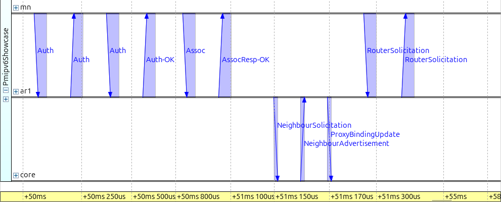
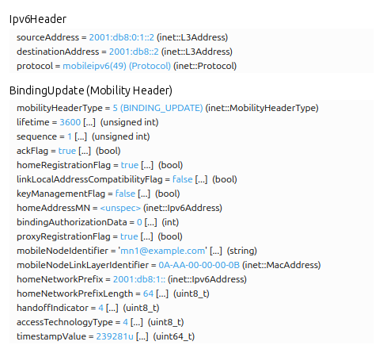

Proxy Mobile IPv6
=================

Goals
-----

An IPv6 host learns its address from the router on the link it is attached to.
The prefix in that address says which link the host is on, and that is how the
rest of the network finds it. It also means that a host which moves to a
different router gets a different address, and the exchanges that used the old
address stop.

Proxy Mobile IPv6 (PMIPv6) keeps the address stable, and it does so entirely in
the network. The mobile node need not run any mobility protocol and holds no
mobility state of its own. An access router, acting as a Mobile Access Gateway
(MAG), registers the node with a Local Mobility Anchor (LMA) on the node's
behalf, and the anchor re-points the node's prefix into the new gateway's tunnel
when the node moves.

In this showcase, we will first watch a mobile node move between two ordinary
IPv6 access routers. The move ends the traffic the node was exchanging. We will
then run the same movement with Proxy Mobile IPv6 in the network, and measure
what the handover costs. By the end of this showcase, you will
understand what the Mobile Access Gateway and the Local Mobility Anchor do, and
what work is left for the mobile node.

| Verified with INET version: ``4.7``
| Source files location: `inet/showcases/mobileip/pmipv6 <https://github.com/inet-framework/inet/tree/master/showcases/mobileip/pmipv6>`__

About Proxy Mobile IPv6
-----------------------

An IPv6 address is built from a prefix and an interface identifier. Routers
advertise the prefix of the link they serve, and a host builds its own address
from that prefix and its own interface identifier; this is stateless address
autoconfiguration (SLAAC). Routing then delivers anything addressed to that
prefix to that link. The address is therefore a statement about where the host
is.

A host that is exchanging traffic has that traffic pinned to the address it
started with. Both ends named each other when they started, and neither expects
the other's name to change. Most transport connections are identified by the two
addresses and the two port numbers they started with, and the echo requests and
replies in this showcase are matched the same way. Change one of those addresses
and an exchange identified that way ends. In this page, a *session* means such
an ongoing exchange between two end nodes.

A laptop that moves between two access points of the same wireless network
keeps its address, and nothing it was doing breaks. Those access points bridge
one and the same IP link, so nothing about the host's link changed. The two
access routers in this showcase are different IP links with different prefixes,
and a host that moves from one to the other leaves one network and joins
another.

The obvious repair is to announce a route for the moving host's address from
wherever the host currently is. That does not scale: the network would have to
carry one route per host, and the point of a prefix is that a router can forget
about the individual addresses inside it.

Proxy Mobile IPv6, specified in RFC 5213, gives the mobile node a home network
prefix, which stays with it wherever it goes inside the Proxy Mobile IPv6
domain — the access routers and anchors configured to serve it. Whichever
access router the node attaches to advertises that prefix on its own link,
even though the prefix does not topologically belong there. That contradicts
the rule this section opened with, so something has to bring the traffic to
where the prefix now is. The network tells the node the same thing on every
link inside the domain, so the node builds the same address every time — its
home address. The home network prefix behaves like a link that follows the
mobile node.

Two roles do this work.

- The Mobile Access Gateway is a function on an access router. It learns from
  the link layer that a node has attached, looks the node up in a policy
  profile, and sends a Proxy Binding Update to the anchor on the node's behalf.
  The profile names the home network prefix that node gets.
- The Local Mobility Anchor is the fixed point. It keeps a binding that maps the
  node's identity to the gateway currently serving it, and it answers with a
  Proxy Binding Acknowledgement.

The gateway then builds a tunnel to the anchor. The node is identified in these
messages by a mobile node identifier and by the link-layer address of the
interface it attached with, not by its IP address — the address the protocol is
working to keep constant.

The anchor is what brings the traffic. It advertises the home network prefix
into ordinary routing, so a packet for the mobile node arrives at the anchor no
matter where the node is. The anchor wraps it in an outer header and puts it
through the tunnel to the serving gateway, which strips that header and delivers
it on the access link. The mobile node's own packets take the same tunnel back:
the gateway sends a mobile node's packets to its anchor whatever their
destination. An ordinary router decides where a packet goes by looking at its
destination; for a mobile node's packets the gateway decides by looking at where
they came from.

The cost is that the anchor sits on the path in both directions, even when the
two ends are near each other. Traffic runs to the anchor and back out again, so
a packet between two nearby nodes crosses the link to the anchor twice. Unless
both ends are attached to the same access router, Proxy Mobile IPv6 has nothing
like Mobile IPv6's route optimization, which lets the two ends talk directly, so
the detour lasts as long as the session does.

Mobile IPv6 uses the same ideas under different names. The home agent becomes
the Local Mobility Anchor, and the binding update the host used to send becomes
a Proxy Binding Update sent by the gateway on its behalf. The difference is
where the mobility function runs. In Mobile IPv6 it runs in the host: a handover
with route optimization costs seven messages, four of them sent by the host, and
one new address for the host to configure and check; with home registration
alone it is two messages, one of them the host's. In Proxy Mobile IPv6 the host
sends no mobility message and configures no address. What moves the node is a
registration and its acknowledgement between two network elements, and a
de-registration pair when the old access router notices the node has gone. These
counts come from the two specifications — RFC 6275 for Mobile IPv6 — and not
from this model's run.

Proxy Mobile IPv6 in INET
-------------------------

INET has two node types for the two roles: :ned:`LocalMobilityAnchor` and
:ned:`MobileAccessGateway`, both IPv6 routers with the protocol module added.
The gateway also turns each of its wireless interfaces into an 802.11 access
point. The mobile node is a plain :ned:`StandardHost6` with a wireless
interface — the same host type an IPv6 host that never moves would use. Here is
the network layer inside one of the access routers:

.. figure:: media/modules.png
   :align: center
   :width: 100%

..
   FIGURE RECIPE (redo via the "omnetpp-mcp-sim" skill)
   type:     one Qtenv module-interior canvas
   config:   Pmipv6          seed: seed-set = 1
   shows:    the network layer inside an access router, with the pmipv6 submodule
             boxed. The node type is MobileAccessGateway; the module pictured is
             its ipv6 submodule, of type Ipv6NetworkLayer with hasPmipv6 = true.
   scope:    ONE panel, the access router's. The mobile node's network layer was
             dropped by a USER RULING, not because it could not be captured: an
             ordinary IPv6 network layer shown to prove something is absent from
             it is weak evidence -- it looks like every other host in INET, so a
             reader who does not already know what to miss learns nothing from
             it, and it was costing half the area of the page's most downscaled
             figure. An earlier two-panel version (side by side, then stacked
             vertically) is superseded; do not re-derive it as an improvement.
             The anchor's network layer is the same picture again and gets a
             sentence rather than a panel.
   launch:   inet -u Qtenv -c Pmipv6 --mcp-server-address=localhost:<port>
             --'**.displayStringTextFormat'='""'

             That override is what makes the figure legible, and it is worth
             knowing for any module-interior capture, not just this one. Most
             INET modules declare a displayStringTextFormat parameter and paint
             its expansion onto the canvas from refreshDisplay(): here that was
             "processed 446 pk (46384 B)" on each MessageDispatcher,
             "fwd:1360 up:499 mcast:20" under ipv6, and "6 routes / 0 destcache
             entries" over the routingTable icon, the last of which also
             overprinted the configurator's own label. At a figure's rendered
             size none of it is readable, all of it competes with the module
             names that ARE the subject, and every value changes with the run,
             so the figure cannot be reproduced byte for byte. Blanking the
             parameter with a '**' wildcard removes all of it at once and
             changes nothing about the model. Capturing at t = 0 is the weaker
             version of the same idea -- it makes the counters read zero but
             leaves the text there.
   window:   at t = 0, before any run_simulation call -- the layout is static
   capture:  open_inspector {object_path:"Pmipv6Showcase.ar1.ipv6", type:"graphical"}
             set_canvas_view  {module_path:"Pmipv6Showcase.ar1.ipv6", zoom:1.0}
             get_canvas_image {module_path:"Pmipv6Showcase.ar1.ipv6",
                               area:"all_elements", margin:6}   -> 954x574
             Do not raise the zoom to gain pixels: Qtenv scales positions and
             icons with zoom but not label fonts, so a higher zoom spreads the
             figure without making a single label larger.
             get_inspector_screenshot at the default size clips the pmipv6 icon;
             get_canvas_image does not.
   compose:  crop x 4..764 -- the right ~190 px are empty canvas, and cutting
             there trims the tail of the two dispatcher bars and the module
             rectangle's right border, which is the price of the legibility.
             Pad 10 px white, then a 3 px red rectangle at (674,482)-(744,550) in
             source coordinates around pmipv6 -> 780x594, aspect 1.31:1.
             Ask for :width: 100%: on a ~745 px column that renders at about
             1.05x, against 2.61x for the original side-by-side pair.
   anchor:   the submodule set must read exactly configurator, routingTable, up,
             icmpv6, lp, neighbourDiscovery, ipv6, pmipv6 -- eight, with pmipv6
             inside the box. MobileAccessGateway hard-assigns ipv6.hasPmipv6 =
             true (not a default), so no ini can remove it; and nothing in this
             showcase's ini touches the network layer's composition, so this is
             the stock interior of the type, not a configuration of it. If ipsec,
             spd, sad, mipv6, buList, bindingCache or mld appear, something has
             switched on hasIpsec, hasMipv6 or hasMld and the figure no longer
             matches the page.
   stamp:    captured 2026-09, INET 4.7

Each access router in this configuration is a :ned:`MobileAccessGateway`, and
the Proxy Mobile IPv6 module in its network layer is what makes it one; the
anchor carries the same module in the same place. The mobile node's network
layer has nothing of the kind — an IPv6 module, Neighbor Discovery, and the rest
of what any IPv6 host has.

The gateway needs to know two things: where its anchor is, and which nodes it
may serve. The first is the :par:`localMobilityAnchorAddress` parameter. The
second is the :par:`mobileNodeProfiles` parameter, which takes the policy
profile as XML:

.. literalinclude:: ../profiles.xml
   :start-at: <mobileNodes>
   :end-at: </mobileNodes>
   :language: xml

The profile names the node's identifier, the home network prefix that belongs to
it, and the link-layer address by which a gateway recognizes it on arrival. Every
gateway that may serve the node carries the same profile, so whichever one the
node reaches can identify it and ask the anchor for it by name. What keeps the
address stable is the anchor, which holds one binding for that node and points
it at whichever gateway is currently asking.

A gateway also notices when a node has left its access link, and then tells the
anchor to release the binding rather than keep it alive.

The standard requires this signalling to be protected, and in this showcase it
is not. INET has the machinery — an IPsec module that can be switched on and
configured for these messages — but it performs no cryptography by design, so
switching it on models the header and the delay rather than the protection. Two
further pieces are missing outright: there is no automated key exchange, and the
anchor accepts a registration from any access router, because it has no
authorization state to configure.

The Model
---------

The simulation uses the following network:

.. figure:: media/network.png
   :align: center
   :width: 80%

..
   FIGURE RECIPE (redo via the "omnetpp-mcp-sim" skill)
   type:     Qtenv canvas screenshot (network overview)
   config:   Pmipv6          seed: seed-set = 1 (from [General])
   shows:    the six nodes and the four wired links, before anything happens
   launch:   inet -u Qtenv -c Pmipv6 --mcp-server-address=localhost:<port>
             --'*.visualizer.interfaceTableVisualizer.displayInterfaceTables'=false
             (the annotation is switched off for this one figure only; at t = 0 it
             would otherwise print the mobile node's link-local address, which the
             page has not introduced yet)
   view:     set_canvas_view {module_path:"<root>", zoom:1.0}
   capture:  get_canvas_image {module_path:"<root>", area:"module_rectangle", margin:5}
             at t = 0, before any run_simulation call; was 814x514
   anchor:   mn sits under ar1 at (250,400); no route arrows, no movement trail,
             no address label. If an arrow or a trail is present the capture was
             taken after t = 0 -- restart and shoot before stepping.
   stamp:    captured 2026-09, INET 4.7

``cn`` is the correspondent node, the fixed host that exchanges traffic with the
mobile node. ``core`` is an ordinary IPv6 router; the two access routers ``ar1``
and ``ar2`` and the anchor all connect to it, which is what puts the anchor off
the direct path between ``cn`` and the access routers. ``mn`` is the mobile
node. It starts under ``ar1``, waits until t = 20 s, and then drives to ``ar2`` at 20 m/s.
The link between ``core`` and the anchor delays a packet by 5 ms; every other
link in the network delays it by 0.1 µs. The 5 ms is this showcase's choice, and
the arithmetic further down rests on it.
The two access routers are on different 802.11 channels and serve different
network names, so the move is a real 802.11 handover. They do share one thing —
the same link-layer address on their wireless interfaces:

.. literalinclude:: ../omnetpp.ini
   :start-at: *.ar*.wlan[0].address
   :end-at: *.ar*.wlan[0].address
   :language: ini

The standard has every gateway in a domain present the same one, so that a node
that moves does not see its default router change, and that value is reserved
for the purpose.

There is one mobile node, and one per access radio is what this model serves.
The standard covers point-to-point access links only, so two nodes sharing one
radio is outside what it describes, and serving them would need a Router
Advertisement carrying a different prefix set per node, which INET cannot build.
Configure it anyway and the advertisement carries both prefixes: each node builds
an address from the other's as well as its own, quietly and without any error.
Some runs also end in a crash. Two mobile nodes on two radios work.

The correspondent node sends an echo request to the mobile node every 50 ms from
t = 8 s to the end of the 60 s run:

.. literalinclude:: ../omnetpp.ini
   :start-at: *.cn.app[0].typename
   :end-at: *.cn.app[0].startTime
   :language: ini

The destination is the mobile node's home address: the home network prefix
``2001:db8:1::`` from the policy profile, followed by the interface identifier
the node builds from its own wireless interface's address by the modified EUI-64
rule. In the baseline
configuration the same address belongs to ``ar1``'s own prefix, which is why one
destination serves both configurations — and why the traffic works there until
the node moves.

The two configurations differ in the node types of the anchor and the two access
routers, and in the addressing that follows from them. Everything else — the
topology, the positions, the movement, the traffic, the radios — is the same.

Without Proxy Mobile IPv6
~~~~~~~~~~~~~~~~~~~~~~~~~

In the ``NoPmipv6`` configuration, the anchor and the two access routers are
plain IPv6 routers, and each access router owns and advertises the prefix of its
own wireless link:

.. literalinclude:: ../omnetpp.ini
   :start-at: [Config NoPmipv6]
   :end-at: config-nopmipv6.xml
   :language: ini

With Proxy Mobile IPv6
~~~~~~~~~~~~~~~~~~~~~~

In the ``Pmipv6`` configuration, the access routers are Mobile Access Gateways
and the anchor is a Local Mobility Anchor. Both gateways register with the same
anchor and serve the same policy profile:

.. literalinclude:: ../omnetpp.ini
   :start-at: [Config Pmipv6]
   :end-at: mobileNodeProfiles
   :language: ini

The home network prefix belongs to no interface in the network, so the
configurator cannot compute a route to it. It is configured by hand instead, so
that ``core`` sends traffic for that prefix to the anchor — this model's stand-in
for the anchor advertising the prefix into routing, which is how a deployment
reaches the same result:

.. literalinclude:: ../config.xml
   :start-at: <route hosts="core"
   :end-at: interface="eth1"/>
   :language: xml

Traffic for the mobile node arrives at the anchor and leaves through the same
link, so the anchor is configured not to send ICMPv6 Redirects, which would
suggest a shorter path that does not exist:

.. literalinclude:: ../omnetpp.ini
   :start-at: *.anchor.ipv6.ipv6.sendRedirects
   :end-at: *.anchor.ipv6.ipv6.sendRedirects
   :language: ini

Results
-------

This section follows the ``Pmipv6`` run in time order. It starts with the node's
first attachment and the traffic that follows. Then it shows the move twice:
first without Proxy Mobile IPv6, where the traffic stops, and then with it,
where the traffic continues. The cost of the interruption comes last.

The node arrives
~~~~~~~~~~~~~~~~

The mobile node starts under ``ar1`` but is not yet associated with it. At
t = 3 s it scans the two channels for access points, finds ``ar1``, and
authenticates and associates with it at about 3.651 s.

The node's IPv6 layer does not wait for the radio. It checks its link-local
address for duplicates, which finishes at 2.76 s, and sends a first Router
Solicitation at 3.509 s. That solicitation never leaves the node: its own
802.11 interface discards it, because the station is not associated yet. When
the association completes, the node sends a second Router Solicitation. It
asks any router on the link to send a Router Advertisement, the message that
carries the prefixes from which a host builds its addresses.

The sequence chart below shows what happens in the next 40 ms, on the axes of
the mobile node, ``ar1``, ``core`` and the anchor:

..
   PLACEHOLDER — sequence chart of the first registration.
   source:   Pmipv6 eventlog (the analyst's E-P run, full 60 s)
   axes:     mn, ar1, core, anchor (node level, this top-to-bottom order)
   window:   3.649 .. 3.690 s
   filter:   ProxyBinding* or RouterSol* or RouterAdv* or NeighbourSol* or
             NeighbourAdv* or Auth* or Assoc*   (about 25 arrows)
   must show: the authentication and association with ar1; the Router
             Solicitation at 3.651105 and its re-broadcast copy from ar1's radio;
             the Proxy Binding Update from ar1 (on the wire 3.651165) through core
             to the anchor (3.666202); core's Neighbor Solicitation/Advertisement
             for the anchor (3.651176 -> 3.661191); the anchor's own address
             resolution of core (3.666202 -> 3.676217); the Proxy Binding
             Acknowledgement reaching ar1 (3.681238); the unsolicited Router
             Advertisement to mn; the node's first Neighbor Solicitation for its
             new address (3.681289).
   Proposed by the analyst (results-walkthrough-corrected.md, evidence for A).

The chart reads from top to bottom as follows.

1. The node authenticates and associates with ``ar1``. ``ar1`` learns of the new
   station from its own access point at 3.651 s. It looks up the station's
   link-layer address, ``0A-AA-00-00-00-0B``, in the policy profile. It finds the node's identifier,
   ``mn1@example.com``, and its home network prefix, ``2001:db8:1::/64``.
2. The node's Router Solicitation reaches ``ar1``. It appears twice on the
   chart. The access point re-broadcasts a multicast frame it receives from a
   station to all stations, and the node's own interface discards the copy. The
   node does not ask twice.
3. ``ar1`` sends a Proxy Binding Update to the anchor. It asks the anchor to
   bind the node's home network prefix to ``ar1``.
4. The update crosses ``core`` to the anchor. The anchor has no entry for this
   prefix, so it creates one in its binding cache, creates a tunnel to ``ar1``,
   and routes the prefix into that tunnel. In the same step it answers with a
   Proxy Binding Acknowledgement, which confirms the binding.
5. When the acknowledgement arrives, ``ar1`` creates its end of the tunnel and
   routes the prefix to its wireless link. Then it sends a Router Advertisement
   that carries ``2001:db8:1::/64``, without waiting to be asked.
6. The node builds its home address, ``2001:db8:1:0:8aa:ff:fe00:b``, from the
   advertised prefix at 3.681 s. It then checks that no other node uses the
   address. This duplicate address detection finishes at 4.88 s.

The node sends no mobility message at any point. From its side it associated,
asked for a router, and got an advertisement — what any IPv6 host does on a new
link. The node's solicitation is never answered directly. The advertisement
that ``ar1`` sends after the acknowledgement is its own. The next periodic
advertisement, at 3.927 s, carries the same prefix, and that is the only
answer the solicitation gets.

Here is the Proxy Binding Update that ``ar1`` sends, as it leaves ``ar1``:

..
   PLACEHOLDER — Qtenv packet-inspector view of the first Proxy Binding Update.
   source:   Pmipv6, Qtenv; stop at the FES entry of the ProxyBindingUpdate at ar1,
             3.651165 s (see memory reference_qtenv_packet_dissection_capture)
   must show: outer IPv6 source 2001:db8:0:1::2, destination 2001:db8::2; Mobility
             Header type 5; sequence 1; lifetime 3600; flags A, H, P set; options:
             mobile node identifier mn1@example.com, link-layer identifier
             0A-AA-00-00-00-0B, home network prefix 2001:db8:1::/64, handoff
             indicator 4, access technology type 4, timestamp
   crop:     the Mobility Header and its options only
   Proposed by the analyst (results-walkthrough-corrected.md, evidence for A).
   The analyst also proposed the same view of the ProxyBindingAck; not placed.

The update goes from ``ar1``'s address on its link to ``core``,
``2001:db8:0:1::2``, to the anchor, ``2001:db8::2``. It is a Mobile IPv6 Binding
Update with one more flag. The fields that matter here are:

- The flags. P (proxy registration) marks the update as sent by a gateway on the
  node's behalf. H (home registration) asks the receiver to act as the anchor
  for the node. A (acknowledge) asks for an acknowledgement.
- The lifetime, 3600 s. This is how long the anchor keeps the binding unless
  ``ar1`` renews or removes it.
- The sequence number, 1. This is ``ar1``'s own counter for this node.
- The mobile node identifier and link-layer identifier. They name the node. The
  node's IP address appears nowhere in the message, because that address is what
  the protocol keeps constant.
- The home network prefix, ``2001:db8:1::/64``, from the profile.
- The handoff indicator, 4, which means "handoff state unknown". ``ar1`` does
  not claim to know whether the node is new to the domain or comes from another
  gateway.
- The access technology type, 4, which means IEEE 802.11.
- The timestamp, the time at which ``ar1`` sent the update: 3.651 s. The anchor
  uses it to put updates from different gateways in order.

The acknowledgement carries a status of 0, which means accepted, the same
sequence number and lifetime, and a copy of the update's options.

The model gives these messages the field values the standard defines, but not
the standard's byte layout. A packet capture of them does not dissect in tools
that follow the standard.

The whole registration takes 30.09 ms, from the update leaving ``ar1`` to the
acknowledgement arriving. The same exchange at the handover later in the run
takes 10.06 ms. The difference is address resolution. This is the first use of
the link between ``core`` and the anchor, and neither end has the other's
link-layer address yet. Before ``core`` can forward the update, it sends
a Neighbor Solicitation to the anchor and waits for the Neighbor Advertisement.
Before the anchor can send the acknowledgement, it does the same for ``core``.
Each of these exchanges crosses the 5 ms link twice, so each costs 10 ms. The
remaining 10 ms is the update and the acknowledgement, each crossing the link
once. ``ar1`` also resolves ``core``'s address first, but that link is short
and it costs almost nothing. At the handover every address is already known.

Traffic through the anchor
~~~~~~~~~~~~~~~~~~~~~~~~~~

From t = 8 s the correspondent node sends an echo request every 50 ms. Here is
the path one request takes and the path its reply takes back:

1. ``cn`` sends the request to the node's home address. Its router, ``core``,
   has a route for ``2001:db8:1::/64`` that points at the anchor, so ``core``
   sends the request there.
2. The anchor's route for the prefix points into its tunnel to ``ar1``. The
   anchor wraps the request in an outer IPv6 header, from its own address to
   ``ar1``'s, and sends it back out through ``core``.
3. ``core`` forwards the packet on the outer destination, to ``ar1``.
4. ``ar1`` removes the outer header and delivers the request on its wireless
   link.
5. The node answers. The reply is addressed to ``cn``, and it goes to ``ar1``,
   the node's default router.
6. ``ar1`` does not forward the reply toward ``cn``, although ``cn`` is only two
   hops away through ``core``. It sees that the packet comes from a mobile node
   it serves and sends it into its tunnel to the anchor. The gateway chooses the
   path from the packet's source, not its destination.
7. The anchor removes the outer header and forwards the reply to ``cn``, again
   through ``core``.

The figure below shows this path on the network. It was taken after the move,
so the gateway in it is ``ar2``; before the move the picture is the same with
``ar1`` in its place:

.. figure:: media/path.png
   :align: center
   :width: 80%

..
   FIGURE RECIPE (redo via the "omnetpp-mcp-sim" skill)
   type:     Qtenv canvas screenshot with the network route visualizer
   config:   Pmipv6          seed: seed-set = 1
   shows:    the routed path after the handover -- cn <- core <-> anchor and
             core -> ar2, with the anchor's link carrying two parallel arrows
             because every packet crosses it twice
   launch:   inet -u Qtenv -c Pmipv6 --mcp-server-address=localhost:<port>
             --'*.visualizer.networkRouteVisualizer.labelFormat'='""'
             Without that override each arrow carries its packet name, and on the
             anchor's link the two names are drawn rotated and on top of each
             other, which is illegible and says nothing the prose needs.
   view:     set_canvas_view {module_path:"<root>", zoom:1.0}
   window:   run_simulation to 39.90 s in "express" mode, then to 40.10 s in
             "fast" mode so the visualizer has fresh paths on the canvas
   capture:  get_canvas_image {module_path:"<root>", area:"module_rectangle",
             margin:5}; was 814x514
   anchor:   two parallel arrows on the core-anchor link and an arrow into ar2,
             none into ar1, and the address label still reads
             2001:db8:1:0:8aa:ff:fe00:b. The re-anchoring happens at
             t = 31.261193; any time after ~31.4 s shows the same picture.
   known:    the hop from ar2 to mn is not drawn -- the tunnel makes the gateway
             re-inject the packet, which starts a new path in PathVisualizerBase.
             The page says so; do not "fix" it by cropping.
             cn's node label is hidden behind the arrowhead that points at it.
             Qtenv draws a node's name under its icon and the path ends exactly
             there; lineWidth=2, a higher zoom and lineShiftMode="x" were all
             tried and none of them moves it.
   stamp:    captured 2026-09, INET 4.7

The arrows show the routed path as far as the access router that serves the
node; the last hop over the air is not drawn. The link between ``core`` and the
anchor carries two arrows, because every packet crosses it twice: once to the
anchor and once back. The frame counts show the same detour. Counted at the two
links' Ethernet interfaces, the correspondent node's link carries 2101 frames
over the run and the anchor's link carries 4195 — about two per exchange against
about four.

Here is one of those requests on the link from the anchor, with its outer
header:

.. figure:: media/packet.png
   :align: center
   :width: 80%

..
   FIGURE RECIPE (redo via the "omnetpp-mcp-sim" skill)
   type:     Qtenv object-inspector screenshot, cropped to the chunk list
   config:   Pmipv6          seed: seed-set = 1
   shows:    one encapsulated echo request on the anchor-to-gateway link: the
             outer IPv6 header addressed 2001:db8::2 -> 2001:db8:0:2::2 around the
             inner header addressed 2001:db8:ff:0:8aa:ff:fe00:1 ->
             2001:db8:1:0:8aa:ff:fe00:b
   launch:   inet -u Qtenv -c Pmipv6 --mcp-server-address=localhost:<port>
   window:   run_simulation to ~40 s, and the last step must be in "fast" or
             "normal" mode -- an express run does not fill Qtenv's packet log
             buffer and list_logged_packets then returns nothing
   capture:  list_logged_packets {module_path:"Pmipv6Showcase.anchor",
                                  name_pattern:"ping*"}
             pick an EthernetSignal of 170 B, name without "-reply", whose
             hop_modules start at Pmipv6Showcase.anchor.eth[0].mac -- that is the
             encapsulated downlink request (130 B entries are the decapsulated
             replies, and the 170 B ones starting at core.eth[1].mac are the
             reverse-tunnelled uplink)
             expand_inspector_tree {object_path:"logged:<id>", type:"object",
                                    depth:4}
             get_inspector_screenshot {object_path:"logged:<id>", type:"object",
                                       width:2600, height:4200}
             crop x 72..918, y 2716..2858, then pad 12 px white -> 870x166.
             The x bound is what matters: it must fall AFTER the inner header's
             destinationAddress, or the figure cuts an address in half. 918 also
             keeps both protocol fields. Ask for :width: 80% or less; the figure
             is meant to render close to 1:1.
   anchor:   the chunk list must read EthernetPhyHeader, EthernetMacHeader,
             Ipv6Header (protocol = ipv6(40)), Ipv6Header (protocol = icmpv6(18)),
             Icmpv6EchoRequestMsg, ByteCountChunk, EthernetFcs -- two IPv6 headers,
             the outer one carrying the anchor and gateway addresses, and all four
             addresses complete. If only one Ipv6Header appears, the packet was
             taken off the wrong link.
   known:    depth 4 also expands the raw bit dump, which is why the useful rows
             sit 2700 px down; the crop is what makes the figure. The inspector
             prints the anchor's address in its canonical short form,
             2001:db8::2, where config.xml writes 2001:db8:0::2 -- same address,
             and Qtenv offers no way to render the longer form.
   stamp:    captured 2026-09, INET 4.7

The packet has two IPv6 headers. The outer one is addressed from the anchor to
the gateway; the inner one from the correspondent node to the mobile node. The
anchor's address is printed in its shortest form, ``2001:db8::2``, which is the
same address the route in ``config.xml`` writes as ``2001:db8:0::2``. Both ends
of the session see only the mobile node's home address. The outer header exists
only between the gateway and the anchor, and both headers are ordinary IPv6.

The detour has a price. A round trip takes 20.361 ms on average here, against
0.312 ms in the baseline, where the traffic never reaches the anchor. Four
crossings of the anchor's 5 ms link account for the difference. The very first
round trip takes 20.78 ms, because the routers resolve link-layer addresses on
first use. The 5 ms is this showcase's choice, made so that the detour can be
seen in the numbers. It is a short link by deployment standards: an anchor
reached across a country costs a great deal more per crossing.

Moving without Proxy Mobile IPv6
~~~~~~~~~~~~~~~~~~~~~~~~~~~~~~~~

In the ``NoPmipv6`` configuration the node arrives in the same way, but no
registration takes place. ``ar1`` advertises its own prefix,
``2001:db8:1::/64``, in its periodic Router Advertisement at 3.927 s, and the
node builds the same address from it as in the ``Pmipv6`` run. The traffic
flows directly between ``core`` and ``ar1``.

At t = 20 s the node starts to drive toward ``ar2``. Here is the move. Watch the
address label on the mobile node, and the arrows that mark the path of the
traffic. Above the address label, a Wi-Fi icon carries the name of the access
point the node is associated with, ``AR1`` or ``AR2``. The icon disappears while
the node is associated with neither:

.. video:: media/baseline-movement.mp4
   :align: center
   :width: 100%

..
   VIDEO RECIPE (redo via the "video-recording" skill)
   config:   NoPmipv6        seed: seed-set = 1 (from [General])
   shows:    the mobile node drives from ar1 to ar2; the route arrows stop, the
             address label changes from 2001:db8:1:0:8aa:ff:fe00:b to
             2001:db8:2:0:8aa:ff:fe00:b, the association label above the address
             label goes AR1 -> none -> AR2, and the arrows never come back
   anchors:  last echo reply at t = 30.250258 (arrows stop within a frame of it);
             re-association with ar2 at t = 31.25643; the new address is assigned
             at t = 33.945575, which is when the address label changes. If the
             address label changes more than ~0.3 s away from 33.95, the timeline
             moved -- re-derive the window before re-recording. The association
             label is the second thing that changes: last frame carrying AR1 at
             t = 30.60, first frame with no association label at t = 30.70, first
             frame reading AR2 at t = 31.30 -- the address label follows only
             2.7 s later. Both labels must change; if only one does, the wrong
             configuration was recorded. The icon is the full one (signal_power_3,
             a 21x24 px shape) and reads blue on AR1, red on AR2; a smaller icon
             means minPower/maxPower no longer sit below the -85 dBm receiver
             sensitivity that floors every reception in the model.
   window:   express-run to 19.0 s, step one event in normal mode, wait 2 s for
             the route visualizer to fade (fadeOutMode is realTime), then record
             to 40.0 s
   anim:     playback_speed=1, min_animation_speed=0.1   (normal profile)
             The min clamp is what makes this recordable: nothing in this model
             requests an animation speed, so without it Qtenv falls back to one
             frame per event and 21 s of simulation yields ~30 000 frames. With
             it, one frame per 0.1 s of simulation -> 210 frames in ~42 s.
             The clamp only bites with Qtenv's own message animation switched OFF
             (Preferences -> Animate messages, or animation_enabled=false in
             $HOME/.config/omnetpp/.qtenvrc). With it on the clamp is ignored and
             the sampling is ~10x finer: the handover window below was measured at
             867 frames instead of 199 with animation on, at either clamp value.
   view:     set_canvas_view {module_path:"<root>", zoom:1.0} before recording;
             at any other zoom the crop below is wrong
   capture:  fps=1, crop_area=with_padding; re-read crop_rect -- 824x524 on an
             1853x1010 window, at (810,155) for the shipped file and (837,155) on
             one earlier run. The size is stable; the x offset moves with the
             Qtenv panel layout, so take it from the start_video_recording
             response and not from here.
   encode:   ffmpeg -r 10 -f image2 -i frames/v2_%04d.png
             -filter:v "crop=824:524:810:155,pad=ceil(iw/2)*2:ceil(ih/2)*2"
             -vcodec libx264 -pix_fmt yuv420p   -> 210 frames, 21.0 s
   post:     none
   stamp:    recorded 2026-09, re-recorded twice the same month -- association
             label added, then moved above the address label and recoloured.
             INET 4.7

The video shows three moments, in this order.

- The arrows stop. The last echo reply reaches ``cn`` at 30.250 s. From
  30.306 s on, the requests die at ``ar1``'s radio. It sends each one to the
  node, gets no 802.11 acknowledgement, retransmits it up to the retry limit,
  and then drops it. ``ar1`` is a plain router here, so nothing else happens: it does not
  tell anyone.
- The icon changes from AR1 to AR2. The node notices that ``ar1`` is gone
  only when it misses ``ar1``'s beacons, at 30.605 s. It then scans, and
  associates with ``ar2`` at 31.256 s.
- The address label changes, 2.7 s after the icon. At association the node
  sends a Router Solicitation. Nothing answers it. The node learns ``ar2``'s
  prefix, ``2001:db8:2::/64``, only from ``ar2``'s next periodic Router
  Advertisement, which arrives at 32.386 s, 1.13 s later. The node builds a new
  address from it, ``2001:db8:2:0:8aa:ff:fe00:b``. It then runs duplicate
  address detection again — on its link-local address, not on the new global
  address. When that check finishes, at 33.946 s, the node adds the new address
  and removes the old one in the same step. That is the moment the label
  changes.

.. TODO: surprise S2 in results-walkthrough-corrected.md — the baseline host
   marks all its addresses tentative, checks only the link-local one, and drops
   the old global address when the check ends. INET expert to say whether the
   page should state that this is not what plain stateless address
   autoconfiguration does.

The arrows never come back. Here are the echo replies that the correspondent
node received over the whole run:

.. figure:: media/baseline-chart.png
   :align: center
   :width: 100%

..
   FIGURE RECIPE (redo via the "inet-showcase-charts" skill)
   type:     chart (native LINE)
   anf:      Pmipv6Showcase.anf   chart "Replies received without Proxy Mobile IPv6"
   inputs:   results/*.sca, results/*.vec  (from: inet -u Cmdenv -c NoPmipv6)
   shows:    the received echo-reply sequence number against time over the whole
             60 s run; it climbs to 445 at t = 30.25 and there is nothing after it
   filter:   name =~ "pingRxSeq:vector" AND runattr:configname =~ "NoPmipv6"
   props:    xaxis 0..60 (the empty right half is the evidence and must stay),
             yaxis auto from 0, square marker size 3, no legend, 8x6 in
   script:   the two lines immediately before utils.export_image_if_needed(props):

                 import matplotlib
                 matplotlib.rcParams["savefig.transparent"] = True

             This cannot be done from the Configure Chart dialog, and the reason
             generalises to every native chart in every showcase. The export
             always goes through Matplotlib, and plt.savefig() is called without
             transparent=, so it obeys the rcParam. But utils.preconfigure_plot
             applies the matplotlibrc properties only on the MATPLOTLIB branch:
             for a native chart it takes the ideplot branch instead, and the
             rcParam is never set. The failure is silent and ships: the chart
             looks correct in the IDE and in the exported file viewed alone, and
             only shows itself on the page, as a white rectangle over the theme's
             off-white background. Check it with the alpha channel, not the eye --
             an opaque export has alpha 255 everywhere; a correct one is about
             1 % opaque, the ink.
   anchor:   the last point is (30.250258, 445) and 1041 requests were sent. If
             the series reaches the right-hand edge the wrong configuration was
             plotted.
   export:   opp_charttool imageexport Pmipv6Showcase.anf -i 0 -f png --dpi 150
             -o baseline-chart -d doc/media      ; 1200x900, transparent
   stamp:    captured 2026-09, INET 4.7

Each point is one reply, plotted at the time it arrived against its sequence
number. The points climb steadily to sequence number 445 at 30.25 s, and the
right half of the chart is empty. Of the 1041 requests sent, 446 are answered —
a loss rate of 57.16 % — and the missing sequence numbers run unbroken from 446
to the last one sent. This is not a gap; it is the end of the session.

The node is still in the network, with a new address, but the correspondent
node does not know that address and keeps sending to the old one. ``core``
still routes the old prefix to ``ar1``, and ``ar1`` still has the node's
link-layer address in its neighbor cache, the table in which an IPv6 node keeps
the link-layer addresses of its neighbors. So ``ar1`` sends every request to a
station that is no longer there, and every frame dies at the retry limit,
silently.

Only after several seconds does ``ar1`` start to doubt the entry. It uses
Neighbor Unreachability Detection (NUD), the check an IPv6 node runs on a
neighbor that it has not recently confirmed as reachable:

- At 38.05 s the entry goes from STALE (not recently confirmed) to DELAY (wait
  briefly before checking).
- At 43.05 s it goes to PROBE: ``ar1`` sends unicast Neighbor Solicitations to
  the node.
- At 46.05 s ``ar1`` declares the neighbor unreachable and removes the entry.
  The next request starts a new address resolution with a multicast Neighbor
  Solicitation, and ``ar1`` queues the requests while it waits.
- At 49.05 s the address resolution fails. ``ar1`` sends an ICMPv6 Destination
  Unreachable message (code 3, address unreachable) to ``cn`` for each queued
  request.

The cycle then repeats: ``cn`` receives 240 such errors between 49.05 s and
58.05 s. The network does tell the correspondent node that the address is
unreachable, but only from 49.05 s on, and it never tells it the new address. No echo reply returns after 30.25 s.

Moving with Proxy Mobile IPv6
~~~~~~~~~~~~~~~~~~~~~~~~~~~~~

Here is the same move, with Proxy Mobile IPv6 running:

.. video:: media/handover.mp4
   :align: center
   :width: 100%

..
   VIDEO RECIPE (redo via the "video-recording" skill)
   config:   Pmipv6          seed: seed-set = 1 (from [General])
   shows:    the same drive with the mechanism running: the route arrows stop,
             reappear through ar2, and the address label never changes, while the
             association label above the address label goes AR1 -> none -> AR2.
             Qtenv's own bubbles narrate it -- "Beacon lost" at t = 30.605127
             and "Associated with AP" at t = 31.256112
   anchors:  last echo reply at t = 30.270332, first one after the gap at
             t = 31.320925 -- an interruption of 1.0506 s, about 42 frames at the
             sampling below. The address label reads 2001:db8:1:0:8aa:ff:fe00:b in
             every frame; if the address label ever changes, the wrong
             configuration was recorded. The association label is a second,
             independent clock on the same event: last frame carrying AR1 at
             t = 30.600, first frame with no association label at t = 30.625,
             first frame reading AR2 at t = 31.275. Both edges sit inside the
             reply gap above; if either falls outside it, the timeline moved.
             Same icon check as the baseline recipe: the full icon, blue on AR1
             and red on AR2.
   window:   express-run to 29.0 s, step one event in normal mode, wait 2 s for
             the route visualizer to fade, then record to 34.0 s
   anim:     playback_speed=1, min_animation_speed=0.025  (normal profile)
             Four times finer than the baseline video because this clip is five
             simulated seconds rather than twenty-one, and the interruption is the
             whole point. Same reason for the clamp as in the baseline recipe,
             including the requirement that Qtenv's message animation be off --
             with it on this window records 867 frames whatever the clamp says.
   view:     set_canvas_view {module_path:"<root>", zoom:1.0}; same framing as the
             baseline video, so the two can be compared shot for shot
   capture:  fps=1, crop_area=with_padding; re-read crop_rect -- 824x524 at
             (810,155) here, the same size but a different x offset than the
             baseline video, which is a panel-layout effect and not a reframing
   encode:   ffmpeg -r 10 -f image2 -i frames/v1_%04d.png
             -filter:v "crop=824:524:810:155,pad=ceil(iw/2)*2:ceil(ih/2)*2"
             -vcodec libx264 -pix_fmt yuv420p   -> 199 frames, 19.9 s
   post:     none
   stamp:    recorded 2026-09, re-recorded twice the same month -- association
             label added, then moved above the address label and recoloured.
             INET 4.7

.. TODO: re-capture after the destination-cache fix

The arrows stop, and then reappear through ``ar2``. The icon changes from
``AR1`` to ``AR2``, as in the baseline. The address label does not change at any
point. Here are the replies around the moment of the move:

.. figure:: media/pmipv6-chart.png
   :align: center
   :width: 100%

..
   FIGURE RECIPE (redo via the "inet-showcase-charts" skill)
   type:     chart (native LINE)
   anf:      Pmipv6Showcase.anf   chart "Replies received with Proxy Mobile IPv6"
   inputs:   results/*.sca, results/*.vec  (from: inet -u Cmdenv -c Pmipv6)
   shows:    the same series around the handover; replies stop after (30.270332,
             445) and resume at (31.320925, 466) -- twenty missing sequence numbers
   filter:   name =~ "pingRxSeq:vector" AND runattr:configname =~ "Pmipv6"
   props:    xaxis 29..33 (the interruption is invisible on a 60 s axis), yaxis
             400..520, square marker size 3 -- the same mark as its sibling, so
             the pair differs only in the zoom the prose explains -- no legend,
             8x6 in
   script:   the same savefig.transparent line as the baseline chart
   anchor:   exactly one gap in the marker row, 1.0506 s wide, between sequence
             numbers 445 and 466. If the gap is wider than ~1.1 s or the sequence
             numbers differ, the timeline moved -- re-derive before re-exporting.
   export:   opp_charttool imageexport Pmipv6Showcase.anf -i 1 -f png --dpi 150
             -o pmipv6-chart -d doc/media        ; 1200x900, transparent
   stamp:    captured 2026-09, INET 4.7

.. TODO: re-capture after the destination-cache fix

This chart shows only the run from 29 s to 33 s, because on a 60 s axis the gap
is too narrow to see. The replies stop after sequence number 445, at 30.270 s, and
continue from sequence number 466, at 31.321 s. The correspondent node addresses
the same destination from the first request to the last, so a reply after the
gap comes from the same address as a reply before it. Of the 1041 requests,
1020 are answered — a loss rate of 2.02 %. Twenty of the twenty-one missing
ones are consecutive, 446 to 465, and they are the move; the twenty-first is the
request sent at t = 60 s, at the time limit, whose reply had no time to arrive.

What happens in that second is below, in time order.

**ar1 notices first.** The first request that ``ar1`` cannot deliver, number
446, reaches the 802.11 retry limit at 30.317 s. In the baseline ``ar1`` did
nothing with this event. Here ``ar1`` is a gateway, and it treats a frame that
its radio could not deliver as a sign that the node has left the link (the
:par:`detectTransmissionFailure` parameter, on by default). This is the point
where the two runs diverge. ``ar1`` knows before the node does: the node
notices the loss only when it misses beacons, at 30.605 s. In the same instant
``ar1`` does three things:

- It stops advertising ``2001:db8:1::/64`` on its wireless link and deletes its
  route to the node.
- It sends a de-registration to the anchor. This is a Proxy Binding Update with
  the same options as before but with a lifetime of 0, which asks the anchor to
  release the binding. Its sequence number is 2, and its handoff indicator is
  4 again.
- It waits for the answer before it removes its tunnel.

**The anchor accepts, and waits.** The de-registration reaches the anchor at
30.323 s. It comes from the gateway that serves the node, so the anchor accepts
it. It deletes its route for the prefix, but it does not delete the binding
cache entry. The standard makes the anchor keep the entry for a while, called
MinDelayBeforeBCEDelete, 10 s by default (the
:par:`minDelayBeforeBindingCacheEntryDelete` parameter). The reason is that the
node may reappear at another gateway, and then its mobility session can
continue. The anchor acknowledges with status 0 and lifetime 0. At 30.328 s
``ar1`` receives the acknowledgement, releases its binding, and deletes its
tunnel. ``ar1``'s part in the move is over.

.. TODO: after the destination-cache fix — where the 20 requests die and why

Proxy Mobile IPv6 does not hold traffic for a node that is between access
routers, and nothing forwards it from the old one. Buffering it instead of
dropping it is what Fast Handovers for Proxy Mobile IPv6 (RFC 5949) adds; this
model has none.

**The node moves.** After it misses ``ar1``'s beacons at 30.605 s, the node
scans. It finds nothing on the first channel and finds ``ar2`` on the second.
It associates with ``ar2`` at 31.256 s and sends a Router Solicitation, exactly
as in the baseline.

**ar2 registers the node.** ``ar2`` looks the station up in the same profile and
sends its own Proxy Binding Update at 31.256 s. It carries the same identifier,
link-layer identifier and home network prefix as ``ar1``'s, a lifetime of
3600 s, and handoff indicator 4. Its sequence number is 1: this is ``ar2``'s own
counter, and ``ar2`` does not know that ``ar1`` reached 2. A sequence number
therefore cannot tell the anchor which update is newer. The timestamp can: it is
the time at which the gateway sent the update, and the later update wins.

**The anchor re-points the prefix.** The update reaches the anchor at 31.261 s,
well inside the 10 s wait. The anchor finds the entry by the prefix. The
update's timestamp is later than the one it stored, so it accepts it. Because
the entry still exists, this is a move and not a new registration: the anchor
keeps the entry, stops the wait, creates a tunnel to ``ar2``, routes the prefix
into it, and removes the old tunnel to ``ar1``. It answers with status 0,
sequence number 1 and lifetime 3600. The acknowledgement reaches ``ar2`` at
31.266 s, 10.06 ms after the update left.

Here is the anchor's binding cache before the move and after it:

.. figure:: media/binding-cache.png
   :align: center
   :width: 100%

..
   FIGURE RECIPE (redo via the "omnetpp-mcp-sim" skill)
   type:     two Qtenv object-inspector readings of a WATCH_MAP, composed
   config:   Pmipv6          seed: seed-set = 1
   shows:    the anchor's binding cache before and after the move. One entry
             throughout; the mobile node identifier, the link-layer address and
             the home network prefix are the same in both; the serving gateway
             changes from 2001:db8:0:1::2 (ar1) to 2001:db8:0:2::2 (ar2).
   why:      the watch is WATCH_MAP(bindingCache) at Pmipv6.cc:177, with stream
             operators for the key and the entry at Pmipv6.cc:81 and :89. It
             exists for this figure.
   launch:   inet -u Qtenv -c Pmipv6 --mcp-server-address=localhost:<port>
   window:   run_simulation to 29.0 s, capture; then to 40.0 s, capture. Express
             mode is fine -- a watch is module state, not a logged packet.
   capture:  open_inspector {object_path:
               "Pmipv6Showcase.anchor.ipv6.pmipv6.bindingCache", type:"object"}
             expand_inspector_tree {same path, type:"object", depth:3}
             get_inspector_screenshot {same path, type:"object",
                                       width:1400, height:300}
   compose:  crop each to x 44..742, y 30..88 -- that keeps the header line with
             "size=1", the elements[1] line, and the entry as far as the serving
             gateway address, and cuts before "tunnel interface id" so the figure
             renders close to 1:1. Stack before above after, 12 px margin, 16 px
             gutter, 17 px bold header on each, and a 2 px red rectangle around
             "serving gateway <address>" in both -> 722x216.
   anchor:   both readings must show size=1 and the same prefix 2001:db8:1::/64;
             only the serving gateway, the tunnel interface id (102 -> 103) and
             the expiry (3603.666 -> 3631.261) differ. The expiry after the move
             is the re-anchoring instant 31.261193 plus the 3600 s binding
             lifetime. If the prefix differs between the two readings the model
             is wrong, not the capture.
   stamp:    captured 2026-09, INET 4.7

Before and after are the same entry: one mobile node, the same identifier and
link-layer address, the same home network prefix. The boxed field, the serving
gateway, is the only one that moves. It goes from ``2001:db8:0:1::2`` to
``2001:db8:0:2::2``, the two access routers' addresses on their links to
``core``, and that single change re-points the node's traffic. The entry never
left the cache: the de-registration removed the route and started the wait, and
the new registration arrived before the wait ran out.

**ar2 advertises the same prefix.** When the acknowledgement arrives, ``ar2``
creates its end of the tunnel, routes the prefix to its wireless link, and sends
a Router Advertisement carrying ``2001:db8:1::/64``, without waiting to be
asked. The node receives it at 31.266 s. The prefix is one it already has, so
it builds no new address and runs no duplicate address detection. The
advertisement also comes from the same link-local address as ``ar1``'s did,
because both gateways share one link-layer address. So the node's default
router does not change either.

**Traffic resumes.** Request 466 is the first to reach ``ar2``, at 31.310 s.
``ar2`` has no neighbor cache entry for the node's home address, so it first resolves
the node's link-layer address with a Neighbor Solicitation, and the node answers
with a Neighbor Advertisement. Then ``ar2`` delivers the request. The reply
takes the tunnel to the anchor and reaches ``cn`` at 31.321 s. The node's own
Router Solicitation is answered only by ``ar2``'s periodic advertisement at
31.402 s, after the traffic has already resumed.

The sequence chart below shows the node's side of the move and ``ar2``'s
registration, from the scan to the advertisement:

.. figure:: media/sequence.png
   :align: center
   :width: 100%

..
   FIGURE RECIPE (redo via the "omnetpp-ide-mcp" skill)
   type:     seqchart
   config:   Pmipv6          seed: seed-set = 1
   shows:    the handover message by message -- the 802.11 scan, the
             authentication and association with ar2, the Proxy Binding Update
             and its Acknowledgement between ar2 and the anchor, and the Router
             Advertisement that follows. The mobile node's row carries only
             ordinary 802.11 and Neighbour Discovery traffic.
   source:   inet -u Cmdenv -c Pmipv6 --record-eventlog=true --sim-time-limit=31.45s
             -> results/Pmipv6-#0.elog, 46.6 MB. NOT committed; regenerate it.
             *** Do NOT use --eventlog-recording-intervals here. *** An
             interval-recorded log has events whose module description entry was
             never written, and the Sequence Chart then throws
             NullPointerException in Event.getAsString (via
             SequenceChartStyleProvider.getEventFillColor) and paints
             "Internal error - please tweak the settings and refresh" instead of
             the chart. Re-tested on 2026-09-22 against the same IDE build
             (6.4.0.260323-80950d1a54 with sequencechart 6.4.0.260609-31dc38776b):
             still throws. Recording from t = 0 to the end of the window avoids it;
             the whole 60 s log would be 100.5 MB, which is why the limit is 31.45 s.
   axes:     mn, ar2, core, anchor   (this top-to-bottom order)
             core is a physical transit module: without it the ProxyBindingUpdate
             and ProxyBindingAck arrows are not drawn at all and the anchor's row
             comes out empty (re-tested twice). ar1 is deliberately NOT an axis --
             it carries no message of its own in any window that keeps the scan,
             and dropping it removes the duplicated labels and the arrowhead
             overdraw. Approved at G5; plan section 6.3 records the change.
   filter:   set_event_filter message_names = ProbeReq, ProbeResp, Auth, Auth-OK,
             Assoc, AssocResp-OK, ProxyBindingUpdate, ProxyBindingAck,
             RouterSolicitation, RouterAdvertisement
             (message_expression cannot select on the module in this build; only
             message names are matchable)
   window:   zoom_to_simulation_time_range 30.85 .. 31.38, applied AFTER
             set_timeline_mode NONLINEAR -- applied before it, the viewport lands
             somewhere else. The start is 30.85 and not earlier because ar2's own
             periodic Router Advertisement at t = 30.543 otherwise bleeds its label
             in from the left edge, where it reads as an axis name. The end is
             31.38 and not later so that step 4's label has room and the periodic
             advertisement at 31.402 stays out.
   anchor:   the order along the chart must read ProbeReq/ProbeResp, Auth,
             Auth-OK, Assoc, AssocResp-OK (t = 31.256112), ProxyBindingUpdate
             (31.256156), ProxyBindingAck (31.266214), RouterAdvertisement
             (31.266264). If the Proxy Binding exchange does not sit between the
             association and the advertisement, the timeline moved.
   capture:  display mode NETWORK_COMMUNICATION, timeline NONLINEAR, IDE window
             2600x1040 -> chart 2160x628; crop the top 66 px to drop the upper
             time ruler and the Position/Range overlay -> 2160x562
   known:    the RouterAdvertisement on the anchor-core rows at about t = 31.10 is
             the anchor's own periodic advertisement on its backhaul link, not part
             of the handover. It cannot be filtered out by message name and cannot
             be windowed out without losing the scan.
   stamp:    captured 2026-09, INET 4.7

.. TODO: re-capture after the destination-cache fix. The window 30.85-31.38 s
   leaves out ar1's de-registration at 30.317 s and its acknowledgement: widen
   the window (and add ar1 as an axis) or add a second chart for 30.30-30.33 s.

Read the chart from left to right. On the mobile node's axis, at the top, the
node scans, authenticates and associates with ``ar2``, and sends its Router
Solicitation; as at the first attachment, the solicitation appears twice. Then
the Proxy Binding Update runs from ``ar2`` through ``core`` to the anchor, and
the Proxy Binding Acknowledgement comes back the same way. The last arrow is
``ar2``'s unsolicited Router Advertisement to the node. The advertisement on
the rows of ``core`` and the anchor at about 31.10 s is the anchor's
own periodic advertisement on its link to ``core``; it is not part of the move.
Everything on the node's axis is ordinary 802.11 and Neighbor Discovery traffic.
None of it is mobility signalling.

What the interruption costs
~~~~~~~~~~~~~~~~~~~~~~~~~~~

The interruption lasts from the last reply before the move to the first reply
after it. It has four parts, and almost none of it belongs to Proxy Mobile IPv6:

.. list-table::
   :header-rows: 1

   * - Part of the interruption
     - Length
   * - the radio is already unusable and the station has not noticed
     - 0.335 s
   * - scan, authenticate, associate — the 802.11 handover
     - 0.651 s
   * - Proxy Binding Update and Proxy Binding Acknowledgement
     - 0.010 s
   * - the next echo request reaches the node, and its reply returns
     - 0.055 s

The four parts add up to 1.051 s. The registration is 10.0577 ms of that, and
10 ms of it is the 5 ms link between ``core`` and the anchor, crossed once in
each direction — a delay this showcase chooses, not a property of the protocol.
The de-registration adds nothing: it happens inside the first part, while the
node has not yet noticed that it lost ``ar1``.

The 802.11 handover dominates. The first part is the station's own policy: it
waits for a few beacons to go missing at the interval this network configures.
The "authenticate" step is 802.11's own two-frame formality; a network that runs
802.1X puts a whole authentication exchange there instead, and that can take
most of a second on its own.

**This ordering is not a general rule.** It holds for the two terms this network
has: a plain 802.11 handover of about 0.65 s, and a gateway 5 ms away from its
anchor. A network with 802.11r fast transition brings the link-layer term down
to tens of milliseconds, while the registration grows with the distance from the
gateway to the anchor — a few milliseconds across a metropolitan network,
hundreds across a country. Somewhere around a 10 ms anchor link the two terms
change places.

Sources: :download:`omnetpp.ini <../omnetpp.ini>`, :download:`Pmipv6Showcase.ned <../Pmipv6Showcase.ned>`, :download:`profiles.xml <../profiles.xml>`, :download:`config.xml <../config.xml>`, :download:`config-nopmipv6.xml <../config-nopmipv6.xml>`, :download:`movement.xml <../movement.xml>`

Try It Yourself
---------------

If you already have INET and OMNeT++ installed, start the IDE by typing
``omnetpp``, import the INET project into the IDE, then navigate to the
``inet/showcases/mobileip/pmipv6`` folder in the `Project Explorer`. There, you can view
and edit the showcase files, run simulations, and analyze results.

Otherwise, there is an easy way to install INET and OMNeT++ using `opp_env
<https://omnetpp.org/opp_env>`__, and run the simulation interactively.
Ensure that ``opp_env`` is installed on your system, then execute:

.. code-block:: bash

    $ opp_env run inet-4.7 --init -w inet-workspace --install --build-modes=release --chdir \
       -c 'cd inet-4.7.*/showcases/mobileip/pmipv6 && inet'

This command creates an ``inet-workspace`` directory, installs the appropriate
versions of INET and OMNeT++ within it, and launches the ``inet`` command in the
showcase directory for interactive simulation.

Alternatively, for a more hands-on experience, you can first set up the
workspace and then open an interactive shell:

.. code-block:: bash

    $ opp_env install --init -w inet-workspace --build-modes=release inet-4.7
    $ cd inet-workspace
    $ opp_env shell

Inside the shell, start the IDE by typing ``omnetpp``, import the INET project,
then start exploring.

Discussion
----------

Use `this <https://github.com/inet-framework/inet/discussions>`__ page in the GitHub issue tracker for commenting on this showcase.

.. TODO: ship gate — create the discussion thread for this showcase and replace
   the link above with its number, as every other showcase page has.
