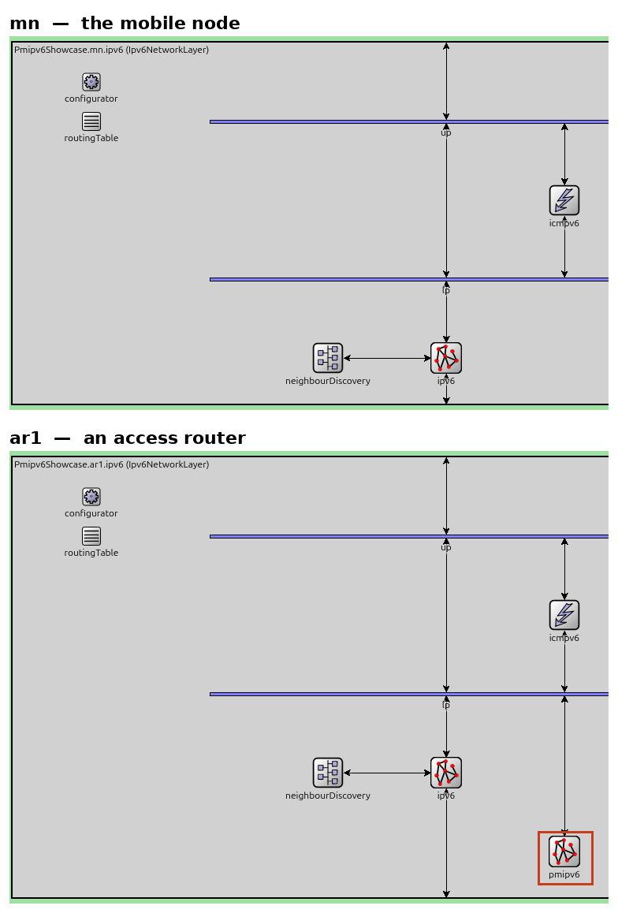
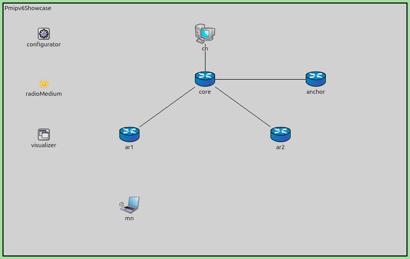
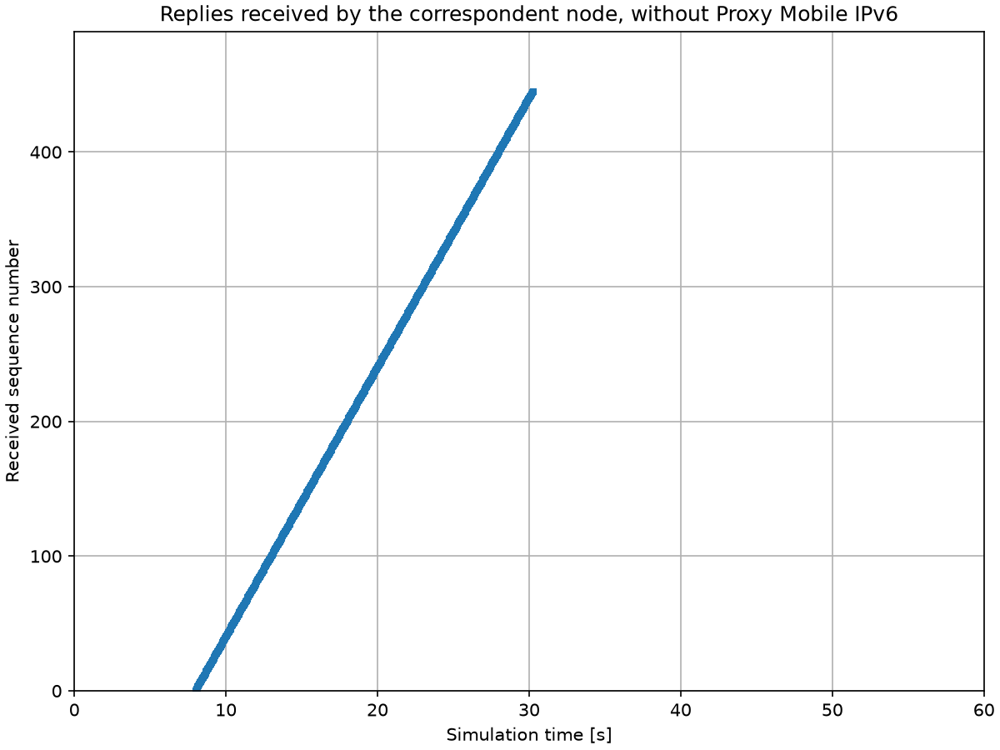
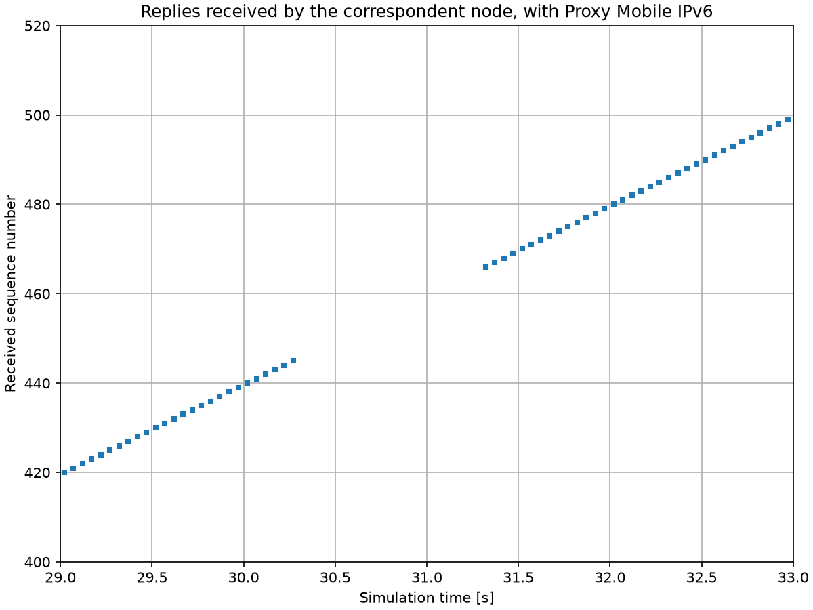
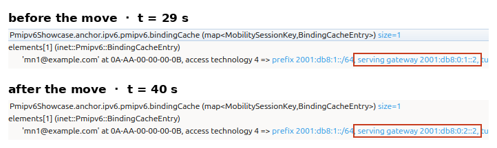
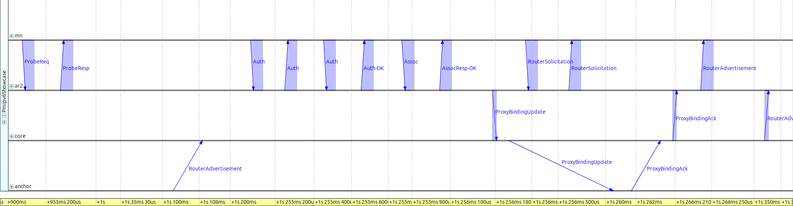
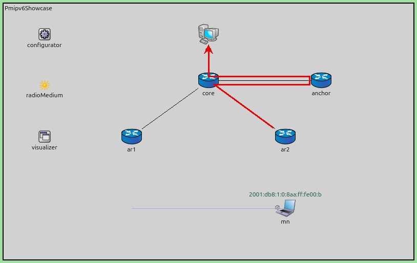
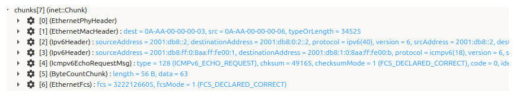

Proxy Mobile IPv6
=================

Goals
-----

An IPv6 host learns its address from the router on the link it is attached to.
The prefix in that address says which link the host is on, and that is how the
rest of the network finds it. It also means that a host which moves to a
different router gets a different address, and the exchanges that used the old
address stop.

Proxy Mobile IPv6 (PMIPv6) keeps the address stable, and it does so entirely in
the network. The mobile node need not run any mobility protocol and holds no
mobility state of its own. An access router, acting as a Mobile Access Gateway
(MAG), registers the node with a Local Mobility Anchor (LMA) on the node's
behalf, and the anchor re-points the node's prefix into the new gateway's tunnel
when the node moves.

In this showcase, we will first watch a mobile node move between two ordinary
IPv6 access routers. The move ends the traffic the node was exchanging. We will
then run the same movement with Proxy Mobile IPv6 in the network, and measure
what the handover costs. By the end of this showcase, you will
understand what the Mobile Access Gateway and the Local Mobility Anchor do, and
what work is left for the mobile node.

| Verified with INET version: ``4.7``
| Source files location: `inet/showcases/mobileip/pmipv6 <https://github.com/inet-framework/inet/tree/master/showcases/mobileip/pmipv6>`__

About Proxy Mobile IPv6
-----------------------

An IPv6 address is built from a prefix and an interface identifier. Routers
advertise the prefix of the link they serve, and a host builds its own address
from that prefix and its own interface identifier; this is stateless address
autoconfiguration (SLAAC). Routing then delivers anything addressed to that
prefix to that link. The address is therefore a statement about where the host
is.

A laptop that moves between two access points of the same wireless network
keeps its address, and nothing it was doing breaks. Those access points bridge
one and the same IP link, so nothing about the host's link changed. The two
access routers in this showcase are different IP links with different prefixes,
and a host that moves from one to the other leaves one network and joins
another.

A host that is exchanging traffic has that traffic pinned to the address it
started with. Both ends named each other when they started, and neither expects
the other's name to change. A transport connection is identified by the two
addresses and the two port numbers it started with, and the echo requests and
replies in this showcase are matched the same way. Change one of the addresses
and the exchange ends. QUIC is the deployed exception: it names its connection
with an identifier of its own, so it can survive the change. Most traffic
cannot. In this page, a *session* means such
an ongoing exchange between two end nodes.

The obvious repair is to announce a route for the moving host's address from
wherever the host currently is. That does not scale: the network would have to
carry one route per host, and the point of a prefix is that a router can forget
about the individual addresses inside it.

Proxy Mobile IPv6, specified in RFC 5213, gives the mobile node a home network
prefix, which stays with it wherever it goes inside the Proxy Mobile IPv6
domain — the access routers and anchors configured to serve it. Whichever
access router the node attaches to
advertises that prefix on its own link, even though the prefix does not
topologically belong there. The network tells the node the same thing on every
link inside the domain, so the node builds the same address every time. The home
network prefix behaves like a link that follows the mobile node.

Two roles do this work.

- The Mobile Access Gateway is a function on an access router. It learns from
  the link layer that a node has attached, looks the node up in a policy
  profile, and sends a Proxy Binding Update to the anchor on the node's behalf.
- The Local Mobility Anchor is the fixed point. It keeps a binding that maps the
  node's identity to the gateway currently serving it, and it answers with a
  Proxy Binding Acknowledgement.

The gateway then builds a tunnel to the anchor and advertises the node's home
network prefix on the access link. The node is identified in these messages by a
mobile node identifier and by the link-layer address of the interface it
attached with, not by its IP address — the address the protocol is working to
keep constant.

The anchor advertises the home network prefix into ordinary routing, so a packet
for the mobile node arrives at the anchor no matter where the node is. The
anchor puts it through the tunnel to the serving gateway, which strips the outer
header and delivers it on the access link. The mobile node's own packets take
the same tunnel back: the gateway sends a mobile node's packets to its anchor
whatever their destination. An ordinary router decides where a packet goes by
looking at its destination; for a mobile node's packets the gateway decides by
looking at where they came from.

The cost is that the anchor sits on the path in both directions, even when the
two ends are near each other. Traffic runs to the anchor and back out again, so
a packet between two nearby nodes crosses the link to the anchor twice. Proxy
Mobile IPv6 has nothing like Mobile IPv6's route optimization, which lets the
two ends talk directly, so the detour lasts as long as the session does. It does
allow one shortcut: an access router may route directly between two mobile nodes
it serves itself. This showcase never has two, so everything here goes to the
anchor.

Mobile IPv6 uses the same ideas under different names. The home agent becomes
the Local Mobility Anchor, and the binding update the host used to send becomes
a Proxy Binding Update sent by the gateway on its behalf. The difference is
where the mobility function runs. In Mobile IPv6 it runs in the host: a handover
with route optimization costs seven messages, four of them sent by the host, and
one new address for the host to configure and check; with home registration
alone it is two messages, one of them the host's. In Proxy Mobile IPv6 the host
sends no mobility message and configures no address. What moves the node is a
registration and its acknowledgement between two network elements, and a
de-registration pair when the old access router notices the node has gone. These
counts come from the two specifications — RFC 6275 for Mobile IPv6 — and not
from this model's run.

Proxy Mobile IPv6 in INET
-------------------------

INET has two node types for the two roles: :ned:`LocalMobilityAnchor` and
:ned:`MobileAccessGateway`, both IPv6 routers with the protocol module added.
The gateway also turns each of its wireless interfaces into an 802.11 access
point. The mobile node is a plain :ned:`StandardHost6` with a wireless
interface, and it contains no mobility module. Here are the two network layers
side by side, the mobile node's on the left and an access router's on the right:

..
   FIGURE RECIPE (redo via the "omnetpp-mcp-sim" skill)
   type:     two Qtenv module-interior canvases, stacked vertically
   config:   Pmipv6          seed: seed-set = 1
   shows:    mn.ipv6 above and ar1.ipv6 below at the same zoom; the pmipv6
             submodule is present in the access router, boxed, and absent from the
             mobile node
   launch:   inet -u Qtenv -c Pmipv6 --mcp-server-address=localhost:<port>
             --'**.displayStringTextFormat'='""'

             That override is what makes the figure legible, and it is worth
             knowing for any module-interior capture, not just this one. Most
             INET modules declare a displayStringTextFormat parameter and paint
             its expansion onto the canvas from refreshDisplay(): here that was
             "processed 446 pk (46384 B)" on each MessageDispatcher,
             "fwd:1360 up:499 mcast:20" under ipv6, and "6 routes / 0 destcache
             entries" over the routingTable icon, the last of which also
             overprinted the configurator's own label. At a figure's rendered
             size none of it is readable, all of it competes with the module
             names that ARE the subject, and every value changes with the run,
             so the figure cannot be reproduced byte for byte. Blanking the
             parameter with a '**' wildcard removes all of it at once and
             changes nothing about the model. Capturing at t = 0 is the weaker
             version of the same idea -- it makes the counters read zero but
             leaves the text there.
   window:   at t = 0, before any run_simulation call -- the layout is static and
             the counters are all zero
   capture:  open_inspector {object_path:"Pmipv6Showcase.mn.ipv6", type:"graphical"}
             set_canvas_view  {module_path:"Pmipv6Showcase.mn.ipv6", zoom:1.0}
             get_canvas_image {module_path:"Pmipv6Showcase.mn.ipv6",
                               area:"all_elements", margin:6}   -> 954x474
             the same three calls for Pmipv6Showcase.ar1.ipv6    -> 954x574
             Both must report zoom_factor 1, or the panels are not comparable.
             get_inspector_screenshot at the default size clips the pmipv6 icon;
             get_canvas_image does not.
   compose:  crop each panel to x 4..764 (the right ~190 px are empty canvas and
             are what forced the old 3.09:1 aspect and its 2.6x downscale), stack
             mn above ar1, 12 px margin, 18 px gutter, white background, a 22 px
             bold header over each panel, and a 3 px red rectangle around pmipv6
             in the lower panel -> 784x1158. Ask for :width: 90%.
   anchor:   ar1.ipv6 has exactly one submodule that mn.ipv6 does not: pmipv6, at
             the bottom right, inside the box. If both panels have the same
             submodules the wrong configuration was captured (NoPmipv6 has pmipv6
             nowhere).
   stamp:    captured 2026-09, INET 4.7

The access router's network layer contains the Proxy Mobile IPv6 module, and so
does the anchor's. The mobile node's contains nothing of the kind: an IPv6
module, Neighbor Discovery, and the rest of what any IPv6 host has. That
difference is the claim of this page, and it is a property of the network's
configuration, not of anything the node does.

The gateway needs to know two things: where its anchor is, and which nodes it
may serve. The first is the :par:`localMobilityAnchorAddress` parameter. The
second is the :par:`mobileNodeProfiles` parameter, which takes the policy
profile as XML:

.. literalinclude:: ../profiles.xml
   :start-at: <mobileNodes>
   :end-at: </mobileNodes>
   :language: xml

The profile names the node's identifier, the home network prefix that belongs to
it, and the link-layer address by which a gateway recognizes it on arrival. Every
gateway that may serve the node carries the same profile, so whichever one the
node reaches can identify it and ask the anchor for it by name. What keeps the
address stable is the anchor, which holds one binding for that node and points
it at whichever gateway is currently asking.

A gateway also notices when a node has left its access link, and then tells the
anchor to release the binding rather than keep it alive.

The standard requires this signalling to be protected, and in this showcase it
is not. INET has the machinery — an IPsec module that can be switched on and
configured for these messages — but it performs no cryptography by design, so
switching it on models the header and the delay rather than the protection. Two
further pieces are missing outright: there is no automated key exchange, and the
anchor accepts a registration from any access router, because it has no
authorization state to configure.

The Model
---------

The simulation uses the following network:

..
   FIGURE RECIPE (redo via the "omnetpp-mcp-sim" skill)
   type:     Qtenv canvas screenshot (network overview)
   config:   Pmipv6          seed: seed-set = 1 (from [General])
   shows:    the six nodes and the four wired links, before anything happens
   launch:   inet -u Qtenv -c Pmipv6 --mcp-server-address=localhost:<port>
             --'*.visualizer.interfaceTableVisualizer.displayInterfaceTables'=false
             (the annotation is switched off for this one figure only; at t = 0 it
             would otherwise print the mobile node's link-local address, which the
             page has not introduced yet)
   view:     set_canvas_view {module_path:"<root>", zoom:1.0}
   capture:  get_canvas_image {module_path:"<root>", area:"module_rectangle", margin:5}
             at t = 0, before any run_simulation call; was 814x514
   anchor:   mn sits under ar1 at (250,400); no route arrows, no movement trail,
             no address label. If an arrow or a trail is present the capture was
             taken after t = 0 -- restart and shoot before stepping.
   stamp:    captured 2026-09, INET 4.7

``cn`` is the correspondent node, the fixed host that exchanges traffic with the
mobile node. ``core`` is an ordinary IPv6 router; the two access routers ``ar1``
and ``ar2`` and the anchor all connect to it, which is what puts the anchor off
the direct path between ``cn`` and the access routers. ``mn`` is the mobile
node. It starts under ``ar1``, waits until t = 20 s, and then drives to ``ar2`` at 20 m/s.
The link between ``core`` and the anchor delays a packet by 5 ms; every other
link in the network delays it by 0.1 µs. The 5 ms is this showcase's choice, and
the arithmetic further down rests on it.
The two access routers are on different 802.11 channels and serve different
network names, so the move is a real 802.11 handover. They do share one thing —
the same link-layer address on their wireless interfaces:

.. literalinclude:: ../omnetpp.ini
   :start-at: *.ar*.wlan[0].address
   :end-at: *.ar*.wlan[0].address
   :language: ini

The standard has every gateway in a domain present the same one, so that a node
that moves does not see its default router change, and that value is reserved
for the purpose.

There is one mobile node, and one per access radio is what this model serves.
The standard covers point-to-point access links only, so two nodes sharing one
radio is outside what it describes, and serving them would need a Router
Advertisement carrying a different prefix set per node, which INET cannot build.
Configure it anyway and the advertisement carries both prefixes: each node builds
an address from the other's as well as its own, quietly and without any error.
Some runs also end in a crash. Two mobile nodes on two radios work.

The correspondent node sends an echo request to the mobile node every 50 ms from
t = 8 s to the end of the 60 s run:

.. literalinclude:: ../omnetpp.ini
   :start-at: *.cn.app[0].typename
   :end-at: *.cn.app[0].startTime
   :language: ini

The destination is the mobile node's home address: the home network prefix
``2001:db8:1::`` from the policy profile, followed by the interface identifier
the node builds from its own wireless interface's address by the modified EUI-64
rule. In the baseline
configuration the same address belongs to ``ar1``'s own prefix, which is why one
destination serves both configurations — and why the traffic works there until
the node moves.

The two configurations differ in the node types of the anchor and the two access
routers, and in the addressing that follows from them. Everything else — the
topology, the positions, the movement, the traffic, the radios — is the same.

Without Proxy Mobile IPv6
~~~~~~~~~~~~~~~~~~~~~~~~~

In the ``NoPmipv6`` configuration, the anchor and the two access routers are
plain IPv6 routers, and each access router owns and advertises the prefix of its
own wireless link:

.. literalinclude:: ../omnetpp.ini
   :start-at: [Config NoPmipv6]
   :end-at: config-nopmipv6.xml
   :language: ini

With Proxy Mobile IPv6
~~~~~~~~~~~~~~~~~~~~~~

In the ``Pmipv6`` configuration, the access routers are Mobile Access Gateways
and the anchor is a Local Mobility Anchor. Both gateways register with the same
anchor and serve the same policy profile:

.. literalinclude:: ../omnetpp.ini
   :start-at: [Config Pmipv6]
   :end-at: mobileNodeProfiles
   :language: ini

The home network prefix belongs to no interface in the network, so the
configurator cannot compute a route to it. It is configured by hand instead, so
that ``core`` sends traffic for that prefix to the anchor — this model's stand-in
for the anchor advertising the prefix into routing, which is how a deployment
reaches the same result:

.. literalinclude:: ../config.xml
   :start-at: <route hosts="core"
   :end-at: interface="eth1"/>
   :language: xml

Traffic for the mobile node arrives at the anchor and leaves through the same
link, so the anchor is configured not to send ICMPv6 Redirects, which would
suggest a shorter path that does not exist:

.. literalinclude:: ../omnetpp.ini
   :start-at: *.anchor.ipv6.ipv6.sendRedirects
   :end-at: *.anchor.ipv6.ipv6.sendRedirects
   :language: ini

Results
-------

Moving without Proxy Mobile IPv6
~~~~~~~~~~~~~~~~~~~~~~~~~~~~~~~~

Here is the move itself. Watch the address label on the mobile node, and the
arrows that mark the path of the traffic:

.. video:: media/baseline-movement.mp4
   :align: center
   :width: 100%

..
   VIDEO RECIPE (redo via the "video-recording" skill)
   config:   NoPmipv6        seed: seed-set = 1 (from [General])
   shows:    the mobile node drives from ar1 to ar2; the route arrows stop, the
             address label changes from 2001:db8:1:0:8aa:ff:fe00:b to
             2001:db8:2:0:8aa:ff:fe00:b, and the arrows never come back
   anchors:  last echo reply at t = 30.250258 (arrows stop within a frame of it);
             re-association with ar2 at t = 31.25643; the new address is assigned
             at t = 33.945575, which is when the label changes. If the label
             changes more than ~0.3 s away from 33.95, the timeline moved --
             re-derive the window before re-recording.
   window:   express-run to 19.0 s, step one event in normal mode, wait 2 s for
             the route visualizer to fade (fadeOutMode is realTime), then record
             to 40.0 s
   anim:     playback_speed=1, min_animation_speed=0.1   (normal profile)
             The min clamp is what makes this recordable: nothing in this model
             requests an animation speed, so without it Qtenv falls back to one
             frame per event and 21 s of simulation yields ~30 000 frames. With
             it, one frame per 0.1 s of simulation -> 210 frames in ~42 s.
   view:     set_canvas_view {module_path:"<root>", zoom:1.0} before recording;
             at any other zoom the crop below is wrong
   capture:  fps=1, crop_area=with_padding; re-read crop_rect -- was
             824x524 at (810,155) on an 1853x1010 window
   encode:   ffmpeg -r 10 -f image2 -i frames/v2_%04d.png
             -filter:v "crop=824:524:810:155,pad=ceil(iw/2)*2:ceil(ih/2)*2"
             -vcodec libx264 -pix_fmt yuv420p   -> 210 frames, 21.0 s
   post:     none
   stamp:    recorded 2026-09, INET 4.7

The address label changes when the node reaches the second access router, and
the arrows never come back. Here are the echo replies the correspondent node
received over the whole run:

..
   FIGURE RECIPE (redo via the "inet-showcase-charts" skill)
   type:     chart (native LINE)
   anf:      Pmipv6Showcase.anf   chart "Replies received without Proxy Mobile IPv6"
   inputs:   results/*.sca, results/*.vec  (from: inet -u Cmdenv -c NoPmipv6)
   shows:    the received echo-reply sequence number against time over the whole
             60 s run; it climbs to 445 at t = 30.25 and there is nothing after it
   filter:   name =~ "pingRxSeq:vector" AND runattr:configname =~ "NoPmipv6"
   props:    xaxis 0..60 (the empty right half is the evidence and must stay),
             yaxis auto from 0, square marker size 3, no legend, 8x6 in
   script:   the two lines immediately before utils.export_image_if_needed(props):

                 import matplotlib
                 matplotlib.rcParams["savefig.transparent"] = True

             This cannot be done from the Configure Chart dialog, and the reason
             generalises to every native chart in every showcase. The export
             always goes through Matplotlib, and plt.savefig() is called without
             transparent=, so it obeys the rcParam. But utils.preconfigure_plot
             applies the matplotlibrc properties only on the MATPLOTLIB branch:
             for a native chart it takes the ideplot branch instead, and the
             rcParam is never set. The failure is silent and ships: the chart
             looks correct in the IDE and in the exported file viewed alone, and
             only shows itself on the page, as a white rectangle over the theme's
             off-white background. Check it with the alpha channel, not the eye --
             an opaque export has alpha 255 everywhere; a correct one is about
             1 % opaque, the ink.
   anchor:   the last point is (30.250258, 445) and 1041 requests were sent. If
             the series reaches the right-hand edge the wrong configuration was
             plotted.
   export:   opp_charttool imageexport Pmipv6Showcase.anf -i 0 -f png --dpi 150
             -o baseline-chart -d doc/media      ; 1200x900, transparent
   stamp:    captured 2026-09, INET 4.7

The replies stop when the node changes access router and never resume. Of the
1041 requests sent, 446 are answered — a loss rate of 57.16 % — and the missing
sequence numbers run unbroken from 446 to the last one sent. This is not a gap;
it is the end of the session. The node is not gone: it re-associated, and it
replaced its address with one built from the prefix the new access router
advertises, the old address being removed at the same instant. The correspondent
node is not told the new address and keeps sending to the old one, and no reply
comes back.

Moving with Proxy Mobile IPv6
~~~~~~~~~~~~~~~~~~~~~~~~~~~~~

Here is the same move, with Proxy Mobile IPv6 running:

.. video:: media/handover.mp4
   :align: center
   :width: 100%

..
   VIDEO RECIPE (redo via the "video-recording" skill)
   config:   Pmipv6          seed: seed-set = 1 (from [General])
   shows:    the same drive with the mechanism running: the route arrows stop,
             reappear through ar2, and the address label never changes. Qtenv's
             own bubbles narrate it -- "Beacon lost" at t = 30.605127 and
             "Associated with AP" at t = 31.256112
   anchors:  last echo reply at t = 30.270332, first one after the gap at
             t = 31.320925 -- an interruption of 1.0506 s, about 42 frames at the
             sampling below. The address label reads 2001:db8:1:0:8aa:ff:fe00:b in
             every frame; if it ever changes, the wrong configuration was recorded.
   window:   express-run to 29.0 s, step one event in normal mode, wait 2 s for
             the route visualizer to fade, then record to 34.0 s
   anim:     playback_speed=1, min_animation_speed=0.025  (normal profile)
             Four times finer than the baseline video because this clip is five
             simulated seconds rather than twenty-one, and the interruption is the
             whole point. Same reason for the clamp as in the baseline recipe.
   view:     set_canvas_view {module_path:"<root>", zoom:1.0}; same framing as the
             baseline video, so the two can be compared shot for shot
   capture:  fps=1, crop_area=with_padding; crop_rect was 824x524 at (810,155)
   encode:   ffmpeg -r 10 -f image2 -i frames/v1_%04d.png
             -filter:v "crop=824:524:810:155,pad=ceil(iw/2)*2:ceil(ih/2)*2"
             -vcodec libx264 -pix_fmt yuv420p   -> 199 frames, 19.9 s
   post:     none
   stamp:    recorded 2026-09, INET 4.7

The arrows stop, and then reappear through the second access router. The address
label does not change at any point. Here are the replies from the same movement,
around the moment of the handover:

..
   FIGURE RECIPE (redo via the "inet-showcase-charts" skill)
   type:     chart (native LINE)
   anf:      Pmipv6Showcase.anf   chart "Replies received with Proxy Mobile IPv6"
   inputs:   results/*.sca, results/*.vec  (from: inet -u Cmdenv -c Pmipv6)
   shows:    the same series around the handover; replies stop after (30.270332,
             445) and resume at (31.320925, 466) -- twenty missing sequence numbers
   filter:   name =~ "pingRxSeq:vector" AND runattr:configname =~ "Pmipv6"
   props:    xaxis 29..33 (the interruption is invisible on a 60 s axis), yaxis
             400..520, square marker size 3 -- the same mark as its sibling, so
             the pair differs only in the zoom the prose explains -- no legend,
             8x6 in
   script:   the same savefig.transparent line as the baseline chart
   anchor:   exactly one gap in the marker row, 1.0506 s wide, between sequence
             numbers 445 and 466. If the gap is wider than ~1.1 s or the sequence
             numbers differ, the timeline moved -- re-derive before re-exporting.
   export:   opp_charttool imageexport Pmipv6Showcase.anf -i 1 -f png --dpi 150
             -o pmipv6-chart -d doc/media        ; 1200x900, transparent
   stamp:    captured 2026-09, INET 4.7

The traffic stops for about a second and then continues. The correspondent node
has been addressing one and the same destination from the first request to the
last, so a reply plotted after the gap is a reply from the same address as one
plotted before it. Of the 1041 requests, 1020 are answered — a loss rate of
2.02 %. Twenty of the twenty-one missing ones are consecutive, 446 to 465, and
they are the handover; the twenty-first is the request sent at t = 60 s, at the
time limit, whose reply had no time to arrive.

The interruption has four parts, and almost none of it belongs to Proxy Mobile
IPv6:

.. list-table::
   :header-rows: 1

   * - Part of the interruption
     - Length
   * - the radio is already unusable and the station has not noticed
     - 0.335 s
   * - scan, authenticate, associate — the 802.11 handover
     - 0.651 s
   * - Proxy Binding Update and Proxy Binding Acknowledgement
     - 0.010 s
   * - waiting for the next echo request
     - 0.055 s

The four parts add up to 1.051 s. The registration is 10.0577 ms of that, and
10 ms of it is the 5 ms link between ``core`` and the anchor, crossed once in
each direction — a delay this showcase chooses, not a property of the protocol.
The remaining 57.68 µs is not protocol work either: it is 41.6 µs of Ethernet
transmission, 0.2 µs of propagation, and 15.88 µs during which the gateway held
the update while it resolved a link-layer address. The anchor answers in the
same event in which it receives, so no processing time appears at all.

The 802.11 handover dominates. Its first part is easy to miss: the radio is
dead for about a third of a second before the station gives up on it. That third
of a second is the station's own policy — it waits for a few beacons to go
missing at the interval this network configures — rather than a fixed property
of 802.11. The "authenticate" step is 802.11's own two-frame formality; a
network that runs 802.1X puts a whole authentication exchange there instead, and
that can take most of a second on its own.

**This ordering is not a general rule.** It holds for the two terms this network
has: a plain 802.11 handover of about 0.65 s, and a gateway 5 ms away from its
anchor. A network with 802.11r fast transition brings the link-layer term down
to tens of milliseconds, while the registration grows with the distance from the
gateway to the anchor — a few milliseconds across a metropolitan network,
hundreds across a country. Somewhere around a 10 ms anchor link the two terms
change places.

The requests sent during the interruption are lost, and it is possible to say
exactly where. Twenty frames hit the 802.11 retry limit at the old access
router's radio — the same twenty requests the chart is missing — and none is
dropped at the anchor, which keeps tunnelling them to the old access router
until the instant it re-points the prefix. Proxy Mobile IPv6 does not hold
traffic for a node that is between access routers, and nothing forwards it from
the old one. Buffering it instead of dropping it is what Fast Handovers for
Proxy Mobile IPv6 (RFC 5949) adds; this model has none.

What the network does
~~~~~~~~~~~~~~~~~~~~~

The state that changes across the handover is the anchor's, not the node's:

.. list-table::
   :header-rows: 1

   * -
     - before the move
     - after the move
   * - the mobile node's global address
     - ``2001:db8:1:0:8aa:ff:fe00:b``
     - the same address
   * - what the mobile node stores about the move
     - nothing
     - nothing
   * - the anchor's binding for the node
     - prefix via the first gateway
     - prefix via the second gateway
   * - who sent the messages that changed it
     - the first gateway
     - the second gateway

The third row of that table can be read straight out of the anchor. Here is its
binding cache before the move and after it:

..
   FIGURE RECIPE (redo via the "omnetpp-mcp-sim" skill)
   type:     two Qtenv object-inspector readings of a WATCH_MAP, composed
   config:   Pmipv6          seed: seed-set = 1
   shows:    the anchor's binding cache before and after the move. One entry
             throughout; the mobile node identifier, the link-layer address and
             the home network prefix are the same in both; the serving gateway
             changes from 2001:db8:0:1::2 (ar1) to 2001:db8:0:2::2 (ar2).
   why:      the watch is WATCH_MAP(bindingCache) at Pmipv6.cc:177, with stream
             operators for the key and the entry at Pmipv6.cc:81 and :89. It
             exists for this figure.
   launch:   inet -u Qtenv -c Pmipv6 --mcp-server-address=localhost:<port>
   window:   run_simulation to 29.0 s, capture; then to 40.0 s, capture. Express
             mode is fine -- a watch is module state, not a logged packet.
   capture:  open_inspector {object_path:
               "Pmipv6Showcase.anchor.ipv6.pmipv6.bindingCache", type:"object"}
             expand_inspector_tree {same path, type:"object", depth:3}
             get_inspector_screenshot {same path, type:"object",
                                       width:1400, height:300}
   compose:  crop each to x 44..742, y 30..88 -- that keeps the header line with
             "size=1", the elements[1] line, and the entry as far as the serving
             gateway address, and cuts before "tunnel interface id" so the figure
             renders close to 1:1. Stack before above after, 12 px margin, 16 px
             gutter, 17 px bold header on each, and a 2 px red rectangle around
             "serving gateway <address>" in both -> 722x216.
   anchor:   both readings must show size=1 and the same prefix 2001:db8:1::/64;
             only the serving gateway, the tunnel interface id (102 -> 103) and
             the expiry (3603.666 -> 3631.261) differ. The expiry after the move
             is the re-anchoring instant 31.261193 plus the 3600 s binding
             lifetime. If the prefix differs between the two readings the model
             is wrong, not the capture.
   stamp:    captured 2026-09, INET 4.7

Before and after are the same entry: one mobile node, the same identifier and
link-layer address, the same home network prefix. The boxed field is the only
one that moves. The serving gateway goes from ``2001:db8:0:1::2`` to
``2001:db8:0:2::2`` — the two access routers' addresses on their links to
``core`` — and that single change is what re-points the node's traffic. This is
the mobility state the claim is about, in the place the claim says it lives.

The sequence chart below shows the same handover message by message. The
``core`` router has an axis of its own because every message between an access
router and the anchor passes through it. Watch the mobile node's axis, on the
top. It does the ordinary 802.11 work any laptop does — scan, authenticate,
associate — and then asks the new access router for a Router Advertisement, as
any IPv6 host does on a link it has just joined. None of it is mobility
signalling:

..
   FIGURE RECIPE (redo via the "omnetpp-ide-mcp" skill)
   type:     seqchart
   config:   Pmipv6          seed: seed-set = 1
   shows:    the handover message by message -- the 802.11 scan, the
             authentication and association with ar2, the Proxy Binding Update
             and its Acknowledgement between ar2 and the anchor, and the Router
             Advertisement that follows. The mobile node's row carries only
             ordinary 802.11 and Neighbour Discovery traffic.
   source:   inet -u Cmdenv -c Pmipv6 --record-eventlog=true --sim-time-limit=31.45s
             -> results/Pmipv6-#0.elog, 46.6 MB. NOT committed; regenerate it.
             *** Do NOT use --eventlog-recording-intervals here. *** An
             interval-recorded log has events whose module description entry was
             never written, and the Sequence Chart then throws
             NullPointerException in Event.getAsString (via
             SequenceChartStyleProvider.getEventFillColor) and paints
             "Internal error - please tweak the settings and refresh" instead of
             the chart. Re-tested on 2026-09-22 against the same IDE build
             (6.4.0.260323-80950d1a54 with sequencechart 6.4.0.260609-31dc38776b):
             still throws. Recording from t = 0 to the end of the window avoids it;
             the whole 60 s log would be 100.5 MB, which is why the limit is 31.45 s.
   axes:     mn, ar2, core, anchor   (this top-to-bottom order)
             core is a physical transit module: without it the ProxyBindingUpdate
             and ProxyBindingAck arrows are not drawn at all and the anchor's row
             comes out empty (re-tested twice). ar1 is deliberately NOT an axis --
             it carries no message of its own in any window that keeps the scan,
             and dropping it removes the duplicated labels and the arrowhead
             overdraw. Approved at G5; plan section 6.3 records the change.
   filter:   set_event_filter message_names = ProbeReq, ProbeResp, Auth, Auth-OK,
             Assoc, AssocResp-OK, ProxyBindingUpdate, ProxyBindingAck,
             RouterSolicitation, RouterAdvertisement
             (message_expression cannot select on the module in this build; only
             message names are matchable)
   window:   zoom_to_simulation_time_range 30.85 .. 31.38, applied AFTER
             set_timeline_mode NONLINEAR -- applied before it, the viewport lands
             somewhere else. The start is 30.85 and not earlier because ar2's own
             periodic Router Advertisement at t = 30.543 otherwise bleeds its label
             in from the left edge, where it reads as an axis name. The end is
             31.38 and not later so that step 4's label has room and the periodic
             advertisement at 31.402 stays out.
   anchor:   the order along the chart must read ProbeReq/ProbeResp, Auth,
             Auth-OK, Assoc, AssocResp-OK (t = 31.256112), ProxyBindingUpdate
             (31.256156), ProxyBindingAck (31.266214), RouterAdvertisement
             (31.266264). If the Proxy Binding exchange does not sit between the
             association and the advertisement, the timeline moved.
   capture:  display mode NETWORK_COMMUNICATION, timeline NONLINEAR, IDE window
             2600x1040 -> chart 2160x628; crop the top 66 px to drop the upper
             time ruler and the Position/Range overlay -> 2160x562
   known:    the RouterAdvertisement on the anchor-core rows at about t = 31.10 is
             the anchor's own periodic advertisement on its backhaul link, not part
             of the handover. It cannot be filtered out by message name and cannot
             be windowed out without losing the scan.
   stamp:    captured 2026-09, INET 4.7

It reads in four steps:

1. The mobile node loses the first access router and scans the channels.
2. It authenticates and associates with the second access router.
3. That access router recognizes the node from its policy profile and sends a
   Proxy Binding Update. The anchor re-points the home network prefix at the new
   gateway and answers.
4. The new access router advertises the same home network prefix on its link.

Two things in the chart are easy to misread. The node's request for a Router
Advertisement appears twice because the access point re-broadcasts the same
frame on the wireless link, not because the node asks again. And the
advertisement drawn just after the acknowledgement is the access router's own,
sent unprompted; the answer to the node's request arrives later still, after the
traffic has already resumed.

The fourth step is why the node has nothing left to do. Stateless address
autoconfiguration is offered a prefix the node already holds, so it builds no
address, and there is nothing for it to check before it can carry on using the
one it has.

Where the packets go
~~~~~~~~~~~~~~~~~~~~

Here is the path the traffic takes after the handover:

..
   FIGURE RECIPE (redo via the "omnetpp-mcp-sim" skill)
   type:     Qtenv canvas screenshot with the network route visualizer
   config:   Pmipv6          seed: seed-set = 1
   shows:    the routed path after the handover -- cn <- core <-> anchor and
             core -> ar2, with the anchor's link carrying two parallel arrows
             because every packet crosses it twice
   launch:   inet -u Qtenv -c Pmipv6 --mcp-server-address=localhost:<port>
             --'*.visualizer.networkRouteVisualizer.labelFormat'='""'
             Without that override each arrow carries its packet name, and on the
             anchor's link the two names are drawn rotated and on top of each
             other, which is illegible and says nothing the prose needs.
   view:     set_canvas_view {module_path:"<root>", zoom:1.0}
   window:   run_simulation to 39.90 s in "express" mode, then to 40.10 s in
             "fast" mode so the visualizer has fresh paths on the canvas
   capture:  get_canvas_image {module_path:"<root>", area:"module_rectangle",
             margin:5}; was 814x514
   anchor:   two parallel arrows on the core-anchor link and an arrow into ar2,
             none into ar1, and the address label still reads
             2001:db8:1:0:8aa:ff:fe00:b. The re-anchoring happens at
             t = 31.261193; any time after ~31.4 s shows the same picture.
   known:    the hop from ar2 to mn is not drawn -- the tunnel makes the gateway
             re-inject the packet, which starts a new path in PathVisualizerBase.
             The page says so; do not "fix" it by cropping.
             cn's node label is hidden behind the arrowhead that points at it.
             Qtenv draws a node's name under its icon and the path ends exactly
             there; lineWidth=2, a higher zoom and lineShiftMode="x" were all
             tried and none of them moves it.
   stamp:    captured 2026-09, INET 4.7

The arrows show the routed path as far as the access router serving the node;
the last hop over the air is not drawn. Both directions run through the anchor,
and the frame counts show the detour. The reply takes that path although the
correspondent node is two hops the other way: the access router forwards the
node's packets on where they came from, not on where they are going. Counted at
the two links' Ethernet interfaces, the correspondent node's link carries 2101
frames over the run and the anchor's carries 4195 — about two per exchange
against about four.
The traffic crosses the link between ``core`` and the anchor twice, on its way to
a node that is two hops from the correspondent node's router. That is what the
detour costs: a round trip takes 20.361 ms here against 0.312 ms in the baseline,
where the traffic never reaches the anchor, and four crossings of the anchor's
5 ms link account for the difference. The 5 ms is this showcase's choice, made so
that the detour can be felt as well as seen. It is a short link by deployment
standards: the same four crossings cost proportionally less on a faster one and
a great deal more on a slower one, and an anchor reached across a country is the
normal case rather than an unusual one.

Here is one of those packets on the link to the anchor, with its outer header:

..
   FIGURE RECIPE (redo via the "omnetpp-mcp-sim" skill)
   type:     Qtenv object-inspector screenshot, cropped to the chunk list
   config:   Pmipv6          seed: seed-set = 1
   shows:    one encapsulated echo request on the anchor-to-gateway link: the
             outer IPv6 header addressed 2001:db8::2 -> 2001:db8:0:2::2 around the
             inner header addressed 2001:db8:ff:0:8aa:ff:fe00:1 ->
             2001:db8:1:0:8aa:ff:fe00:b
   launch:   inet -u Qtenv -c Pmipv6 --mcp-server-address=localhost:<port>
   window:   run_simulation to ~40 s, and the last step must be in "fast" or
             "normal" mode -- an express run does not fill Qtenv's packet log
             buffer and list_logged_packets then returns nothing
   capture:  list_logged_packets {module_path:"Pmipv6Showcase.anchor",
                                  name_pattern:"ping*"}
             pick an EthernetSignal of 170 B, name without "-reply", whose
             hop_modules start at Pmipv6Showcase.anchor.eth[0].mac -- that is the
             encapsulated downlink request (130 B entries are the decapsulated
             replies, and the 170 B ones starting at core.eth[1].mac are the
             reverse-tunnelled uplink)
             expand_inspector_tree {object_path:"logged:<id>", type:"object",
                                    depth:4}
             get_inspector_screenshot {object_path:"logged:<id>", type:"object",
                                       width:2600, height:4200}
             crop x 72..918, y 2716..2858, then pad 12 px white -> 870x166.
             The x bound is what matters: it must fall AFTER the inner header's
             destinationAddress, or the figure cuts an address in half. 918 also
             keeps both protocol fields. Ask for :width: 80% or less; the figure
             is meant to render close to 1:1.
   anchor:   the chunk list must read EthernetPhyHeader, EthernetMacHeader,
             Ipv6Header (protocol = ipv6(40)), Ipv6Header (protocol = icmpv6(18)),
             Icmpv6EchoRequestMsg, ByteCountChunk, EthernetFcs -- two IPv6 headers,
             the outer one carrying the anchor and gateway addresses, and all four
             addresses complete. If only one Ipv6Header appears, the packet was
             taken off the wrong link.
   known:    depth 4 also expands the raw bit dump, which is why the useful rows
             sit 2700 px down; the crop is what makes the figure. The inspector
             prints the anchor's address in its canonical short form,
             2001:db8::2, where config.xml writes 2001:db8:0::2 -- same address,
             and Qtenv offers no way to render the longer form.
   stamp:    captured 2026-09, INET 4.7

The outer header is addressed from the anchor to the gateway; the inner one is
addressed from the correspondent node to the mobile node. The anchor's address
is printed here in its shortest form, ``2001:db8::2``, which is the same address
the route in ``config.xml`` writes as ``2001:db8:0::2``. Both ends of the
session see the mobile node's home address throughout, and the outer header
exists only between the gateway and the anchor.

Both headers here are ordinary IPv6 and read as such in any dissector. The
protocol's own messages are a different matter: the model gives the Proxy
Binding Update and its Acknowledgement the values the standard defines, but not
its byte layout, so a capture of those will not dissect against the standard.

Sources: :download:`omnetpp.ini <../omnetpp.ini>`, :download:`Pmipv6Showcase.ned <../Pmipv6Showcase.ned>`, :download:`profiles.xml <../profiles.xml>`, :download:`config.xml <../config.xml>`, :download:`config-nopmipv6.xml <../config-nopmipv6.xml>`, :download:`movement.xml <../movement.xml>`

Try It Yourself
---------------

If you already have INET and OMNeT++ installed, start the IDE by typing
``omnetpp``, import the INET project into the IDE, then navigate to the
``inet/showcases/mobileip/pmipv6`` folder in the `Project Explorer`. There, you can view
and edit the showcase files, run simulations, and analyze results.

Otherwise, there is an easy way to install INET and OMNeT++ using `opp_env
<https://omnetpp.org/opp_env>`__, and run the simulation interactively.
Ensure that ``opp_env`` is installed on your system, then execute:

.. code-block:: bash

    $ opp_env run inet-4.7 --init -w inet-workspace --install --build-modes=release --chdir \
       -c 'cd inet-4.7.*/showcases/mobileip/pmipv6 && inet'

This command creates an ``inet-workspace`` directory, installs the appropriate
versions of INET and OMNeT++ within it, and launches the ``inet`` command in the
showcase directory for interactive simulation.

Alternatively, for a more hands-on experience, you can first set up the
workspace and then open an interactive shell:

.. code-block:: bash

    $ opp_env install --init -w inet-workspace --build-modes=release inet-4.7
    $ cd inet-workspace
    $ opp_env shell

Inside the shell, start the IDE by typing ``omnetpp``, import the INET project,
then start exploring.

Discussion
----------

Use `this <https://github.com/inet-framework/inet/discussions>`__ page in the GitHub issue tracker for commenting on this showcase.

.. TODO: ship gate — create the discussion thread for this showcase and replace
   the link above with its number, as every other showcase page has.
