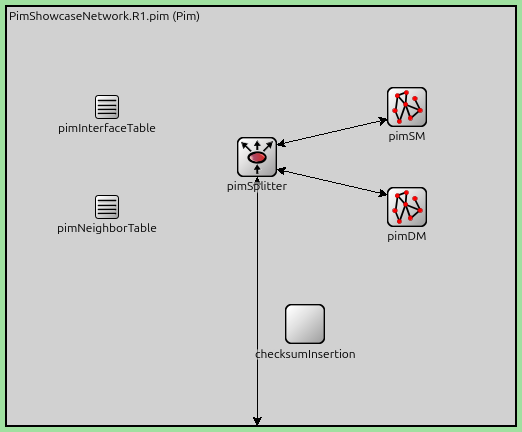
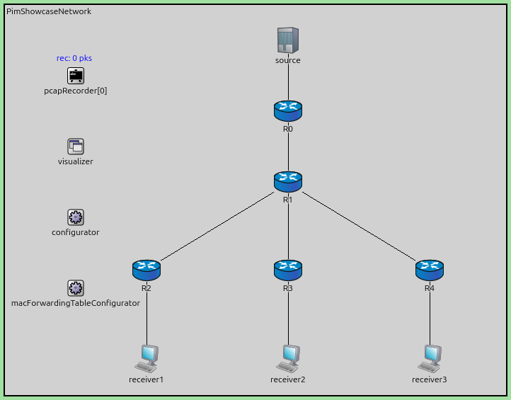
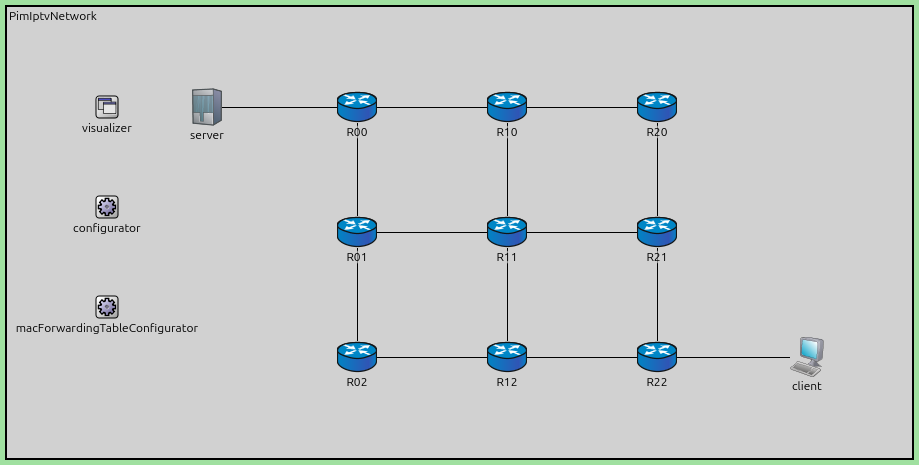

Multicast Routing with PIM
==========================

Goals
-----

When a server needs to deliver the same content — such as a live video stream —
to many receivers at once, the straightforward approach is to send a separate
unicast copy to each one. This works, but it wastes bandwidth: the server's
uplink and every shared link along the way must carry N identical copies for N
receivers.

IP multicast solves this by letting the *network* replicate packets. The source
sends each packet once, and routers along the path duplicate it only where the
tree branches. Each link carries only one copy, regardless of how many
receivers are downstream. On the local network segment, the last-hop router
sends the packet as a multicast frame — all interested hosts receive it
directly. Hosts signal their interest to their local router using IGMP
(Internet Group Management Protocol): a host sends an IGMP Report to join a
multicast group, and the router periodically sends IGMP Queries to check
whether any group members are still present on the link.

Protocol Independent Multicast (PIM) is the protocol that builds and maintains
these distribution trees. It is called "protocol independent" because it does
not include its own topology discovery mechanism — instead it relies on the
unicast routing table (populated by any unicast routing protocol or static
configuration).

In this showcase, we demonstrate two PIM modes available in INET — Dense Mode
(PIM-DM) and Sparse Mode (PIM-SM) — using simple example networks. We also
show a more realistic IPTV streaming scenario using PIM-SM over a grid
network.

| Verified with INET version: ``4.6``
| Source files location: `inet/showcases/routing/pim2 <https://github.com/inet-framework/inet/tree/master/showcases/routing/pim2>`__

About PIM
---------

Regardless of the mode, all PIM routers periodically exchange **PIM Hello**
messages on each interface (every 30s by default). Hellos serve as neighbor
discovery and keepalive — a router learns who its PIM neighbors are, and if a
neighbor's Hellos stop arriving, it is declared unreachable.

PIM operates in two primary modes, each suited to a different multicast traffic
pattern.

**PIM Dense Mode (PIM-DM)** assumes that multicast group members are densely
distributed throughout the network. It uses a *flood-and-prune* strategy:

- Multicast traffic is initially **flooded** to all parts of the network.
- Routers with no interested downstream receivers send **Prune** messages back
  upstream to stop receiving the traffic. This prune state is temporary — it
  expires after a *prune timer* (default 180s), at which point the router
  resumes flooding. This creates a periodic flood-and-prune cycle.
- If a new receiver appears on a previously pruned branch *before* the prune
  timer expires, its router sends a **Graft** message for immediate
  re-attachment — without waiting for the next flood cycle.
- To avoid the periodic flood-and-prune cycle, the source's first-hop router (also called the *designated router* or DR)
  can periodically send **State Refresh** messages (every 60s by default)
  downstream to maintain prune state without re-flooding.

PIM-DM is defined in RFC 3973 (Experimental).

**PIM Sparse Mode (PIM-SM)** assumes receivers are sparsely distributed and
uses an explicit join model. Unlike PIM-DM, traffic does not flow until a
receiver asks for it — but receivers don't know where the source is, and
sources don't know where the receivers are. The protocol solves this by
designating one router as the *Rendezvous Point (RP)* — a well-known meeting
point. Receivers send Join messages *towards* the RP, and sources send their
traffic *to* the RP. The RP connects the two sides, and the tree of paths that
forms around it is called the *shared tree*. All routers in the PIM domain
must know the RP's address — in real networks this is typically learned via the
PIM Bootstrap mechanism, but in INET it is configured statically on every
router.

PIM uses a standard notation for multicast forwarding state. Each router's
multicast forwarding table contains entries that determine what to forward:

- ``(*,G)`` — "any source, group G": forward traffic for group G regardless of
  who sent it.
- ``(S,G)`` — "source S, group G": only forward traffic from a specific source.

The same notation is used in PIM control messages: a ``(*,G)`` Join message
asks each router along the path to create a ``(*,G)`` forwarding entry, while
an ``(S,G)`` Join asks for an ``(S,G)`` forwarding entry to be created. Receivers typically send
``(*,G)`` Joins because they just want the stream without caring who sends it,
while the RP uses ``(S,G)`` Joins when it needs to pull traffic from a
particular source.

The basic operation works as follows:

- Receivers send ``(*,G)`` **Join** messages towards the RP to subscribe to a
  multicast group. Traffic only flows along branches that have been explicitly
  requested.
- When a source starts sending, it simply sends a normal multicast IP packet
  onto its local LAN — it has no knowledge of PIM. The source's first-hop
  router (the *designated router* or DR) picks up this multicast packet and
  wraps it inside a unicast **Register** message
  addressed to the RP. This *registers* the source with the RP — informing it
  that a new source is active for this group, while simultaneously delivering
  the data.
  It is a temporary bootstrap mechanism — it gets traffic flowing immediately,
  but adds overhead: each packet carries an extra header, and the RP must
  individually decapsulate every packet from every source. With many
  simultaneous sources this can turn the RP into a bottleneck, which is why
  the protocol transitions to native multicast as quickly as possible:
- The RP strips the unicast envelope, recovers the original multicast packet,
  and forwards it down the shared tree to receivers. At the same time, it
  sends an (S,G) Join back towards the source to build a native multicast path
  (source → DR → ... → RP).
- Once native multicast forwarding is established on that path, the RP sends a
  **Register-Stop** to the DR. The DR stops encapsulating, and from this point
  on, traffic flows as plain multicast end-to-end — the RP is just another
  router in the tree, not a unicast relay.

.. TODO: The Register-Null bullet below might be too detailed for the About
   section. Consider removing it if it distracts from the main flow.

- After receiving Register-Stop, the DR starts a *Register-Stop Timer*. When
  the timer nears expiry, the DR sends a **Register-Null** message (a Register
  with no data) to the RP to check whether receivers still exist. If they do,
  the RP replies with another Register-Stop and the cycle repeats. This
  probing keeps the source's DR in sync with the RP without sending actual
  data.

When a receiver leaves the group, its router sends a **Prune** message towards
the RP to remove that branch from the shared tree.

PIM-SM is defined in RFC 4601.

.. note::

   The INET PIM-SM implementation simplifies the Register-Stop timing: the RP
   sends the Register-Stop immediately upon receiving the first Register
   message — in the same step as the (S,G) Join — rather than waiting for the
   native path to be established. This means only one Register-encapsulated
   packet is ever delivered, followed by a brief gap until the native (S,G)
   path propagates.

PIM in INET
-----------

The :ned:`MulticastRouter` node type is a standard :ned:`Router` with PIM and IGMP
protocols enabled (``hasPim = true``) and multicast forwarding turned on by
default. Inside each router, the compound module ``pim`` contains a :ned:`PimDm`
and a :ned:`PimSm` submodule (both always present), along with a splitter that
directs incoming PIM packets to the appropriate mode based on the receiving
interface's configuration. Every router along a multicast path must run PIM so it
can process Join/Prune messages and build its own multicast forwarding state.

PIM relies on *Reverse Path Forwarding (RPF) checks* to prevent loops. When a
multicast packet arrives at a router, PIM looks up the source address (or the RP
address, for shared trees) in the unicast routing table and checks whether the
packet arrived on the interface that leads back towards that address. If it did,
the packet is accepted and forwarded. If it arrived on a different interface —
for example, because of a redundant path in the network — the packet is dropped.
This prevents forwarding loops and duplicate delivery. The
:ned:`Ipv4NetworkConfigurator` populates the unicast routes that PIM uses for
these checks.

**Configuring PIM mode.** PIM is enabled on router interfaces using the
``pimConfig`` parameter, an XML string that specifies the mode:

.. code-block:: ini

   # For Dense Mode:
   **.pimConfig = xml("<config><interface mode='dense'/></config>")

   # For Sparse Mode:
   **.pimConfig = xml("<config><interface mode='sparse'/></config>")

**Configuring the Rendezvous Point (PIM-SM only).** The RP address is set via the
``RP`` parameter of the :ned:`PimSm` module (path: ``**.pim.pimSM.RP``). All
routers are configured with the same address. The router that owns this address
recognizes itself as the RP. You can assign a well-known address to any interface
on the RP router using the :ned:`Ipv4NetworkConfigurator` XML — the configurator
will then automatically generate unicast routes to it from all other routers
(which is necessary for Join and Register messages to reach the RP):

.. code-block:: ini

   **.configurator.config = xml("<config>..." \
       "<interface hosts='R1' towards='R0' address='10.99.0.1' netmask='255.255.255.0'/>" \
       "...</config>")
   **.pim.pimSM.RP = "10.99.0.1"

.. note::

   The INET PIM-SM implementation has some limitations compared to the full
   RFC 4601 specification: only a single global RP is supported (configured
   statically), switchover to the Shortest Path Tree (SPT) is not implemented,
   and PIM Bootstrap / RP discovery mechanisms are not available.

The Model
---------

We use two network topologies in this showcase. The first, ``PimShowcaseNetwork``,
is a simple tree topology used for both the PIM-DM and PIM-SM configurations.
A :ned:`StandardHost` (``source``) sends UDP multicast traffic to the group
address ``239.1.1.1`` through five :ned:`MulticastRouter` nodes (R0–R4) to three
receivers. R0 is the source's directly connected router, R1 is the tree root,
and R2, R3, and R4 branch towards the receivers. The receivers run :ned:`UdpSink`
applications configured to join this multicast group.

The second network, ``PimIptvNetwork``, models a more realistic scenario. Nine
:ned:`MulticastRouter` nodes are arranged in a 3×3 grid, with an IPTV server
(:ned:`StandardHost`) attached at one corner and a client at the opposite corner.

Both networks extend :ned:`WiredNetworkBase` (which provides an
:ned:`Ipv4NetworkConfigurator` for automatic IP address assignment and unicast
route generation).

PIM-DM Configuration
~~~~~~~~~~~~~~~~~~~~~

The ``PimDm`` configuration uses the ``PimShowcaseNetwork`` with PIM operating
in Dense Mode. ``receiver1`` joins the multicast group at 5s, while ``receiver2``
joins later at 50s. The source begins sending at 10s.

.. literalinclude:: ../omnetpp.ini
   :language: ini
   :start-at: [Config PimDm]
   :end-before: [Config PimSm]

This configuration demonstrates all three key PIM-DM behaviors:

1. **Flood**: When the source starts sending at 10s, multicast packets are
   flooded to all downstream router interfaces. R0 forwards to R1, and R1 floods
   to both R2 and R3.

2. **Prune**: Since ``receiver2`` has not yet joined the group, R3 has no
   downstream members. R3 sends a Prune message upstream to R1, which stops
   forwarding traffic towards R3. Only ``receiver1`` (via R2) receives the stream.

3. **Graft**: At 50s, ``receiver2`` joins the multicast group. R3 detects the
   new local member (via IGMP) and sends a Graft message to R1. R1 resumes
   forwarding to R3, and ``receiver2`` begins receiving the stream immediately.

The following video shows the flood-and-prune cycle. When the source starts
sending at 10s, traffic is flooded to all routers (blue arrows). Since
``receiver2`` has not yet joined, R3 sends a Prune message (red arrow) upstream
to R1, which stops forwarding towards R3:

.. video:: media/PimDm_flood_prune.mp4

At 50s, ``receiver2`` joins the multicast group. R3 sends a Graft message to R1,
which resumes forwarding. The video below shows R3 grafting back onto the tree
and traffic resuming:

.. video:: media/PimDm_graft.mp4

PIM-SM Configuration
~~~~~~~~~~~~~~~~~~~~~

The ``PimSm`` configuration also uses ``PimShowcaseNetwork``, but with PIM in
Sparse Mode. Router ``R1`` is configured as the Rendezvous Point.

.. literalinclude:: ../omnetpp.ini
   :language: ini
   :start-at: [Config PimSm]
   :end-before: [Config Iptv]

In PIM-SM, no traffic flows until a receiver explicitly joins. The sequence of
events is:

1. At 5s, ``receiver1`` joins the multicast group. Its directly connected router
   R2 (acting as the *designated router* for that LAN — the router responsible
   for forwarding multicast to/from the segment) sends a (*,G) Join message
   towards the RP (R1). This builds the shared tree branch R1→R2.

2. At 10s, the source starts sending. Its designated router R0 receives the
   multicast packets but has no direct path to receivers. R0 encapsulates each
   packet in a PIM *Register* message and unicasts it to the RP (R1). R1
   decapsulates the packet and forwards it down the shared tree to ``receiver1``.

3. Simultaneously, R1 sends an (S,G) Join towards the source (to R0) to
   establish native multicast forwarding on the path source→R0→R1. Once this
   path is active, R1 sends a *Register-Stop* to R0, which stops the
   encapsulation overhead.

4. At 30s, ``receiver2`` joins. Its designated router R3 sends a (*,G) Join to
   R1, extending the shared tree to include the R1→R3 branch.

The following video shows the Register and native path establishment. When the
source starts at 10s, R0 encapsulates the multicast data in a PIM Register
message (red) and unicasts it to the RP (R1). R1 then initiates a shortest-path
join towards the source, and once the native path is established, traffic flows
directly (blue) without encapsulation:

.. video:: media/PimSm_register_native.mp4

The PIM Register message encapsulates the original multicast packet inside a
unicast wrapper:

.. code-block:: text

   PIM Register Header (8 B)
     Version: 2, Type: Register
   Encapsulated IPv4 Header (20 B)
     Src: 10.0.0.1, Dst: 239.1.1.1 (multicast group)
     Protocol: UDP, TTL: 31, Total length: 528 B
   Encapsulated UDP Header (8 B)
     Src port: 1025, Dst port: 5000, Length: 508 B
   Application payload (500 B)

The outer IP packet (not shown above) is a unicast delivery from R0
(10.99.0.2) to the RP R1 (10.99.0.1). Once the RP sends a Register-Stop and
the native multicast path is established, the source's data flows as plain
multicast without this extra encapsulation.

IPTV Configuration
~~~~~~~~~~~~~~~~~~

The ``Iptv`` configuration uses ``PimIptvNetwork``, a 3×3 grid of routers with an
IPTV server at one corner and a client at the opposite corner.

.. literalinclude:: ../omnetpp.ini
   :language: ini
   :start-at: [Config Iptv]

The :ned:`Ipv4NetworkConfigurator` automatically populates the unicast routing
tables, which PIM then uses for RPF checks to determine the shortest path
towards the RP and to build the multicast distribution tree.

The IPTV server sends high-rate multicast traffic (one 1000-byte packet every
40ms, i.e. 25 packets/s) starting at 25s. The client joins the multicast group
at 30s. At that point, R22 (the client's designated router) sends a (*,G) Join
towards the RP (R10). The join propagates through the grid, and the multicast
tree is established along the shortest path from the server's corner (R00)
through the RP (R10) to the client's corner (R22). Once the tree is built,
the client begins receiving the stream.

The video shows the tree building — multicast traffic (blue arrows) lights up
the path from the server's corner through the network to the client:

.. video:: media/Iptv_tree_building.mp4

Sources: :download:`omnetpp.ini <../omnetpp.ini>`, :download:`PimShowcase.ned <../PimShowcase.ned>`

Try It Yourself
---------------

If you already have INET and OMNeT++ installed, start the IDE by typing
``omnetpp``, import the INET project into the IDE, then navigate to the
``inet/showcases/routing/pim2`` folder in the `Project Explorer`. There, you can view
and edit the showcase files, run simulations, and analyze results.

Otherwise, there is an easy way to install INET and OMNeT++ using `opp_env
<https://omnetpp.org/opp_env>`__, and run the simulation interactively.
Ensure that ``opp_env`` is installed on your system, then execute:

.. code-block:: bash

    $ opp_env run inet-4.6 --init -w inet-workspace --install --build-modes=release --chdir \
       -c 'cd inet-4.6.*/showcases/routing/pim2 && inet'

This command creates an ``inet-workspace`` directory, installs the appropriate
versions of INET and OMNeT++ within it, and launches the ``inet`` command in the
showcase directory for interactive simulation.

Alternatively, for a more hands-on experience, you can first set up the
workspace and then open an interactive shell:

.. code-block:: bash

    $ opp_env install --init -w inet-workspace --build-modes=release inet-4.6
    $ cd inet-workspace
    $ opp_env shell

Inside the shell, start the IDE by typing ``omnetpp``, import the INET project,
then start exploring.

Discussion
----------

Use `this page <https://github.com/inet-framework/inet/discussions>`__
on GitHub for commenting on this showcase.
