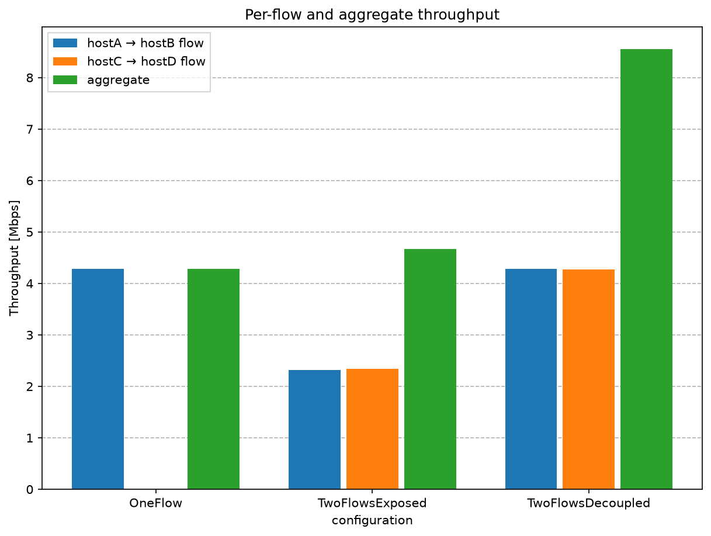
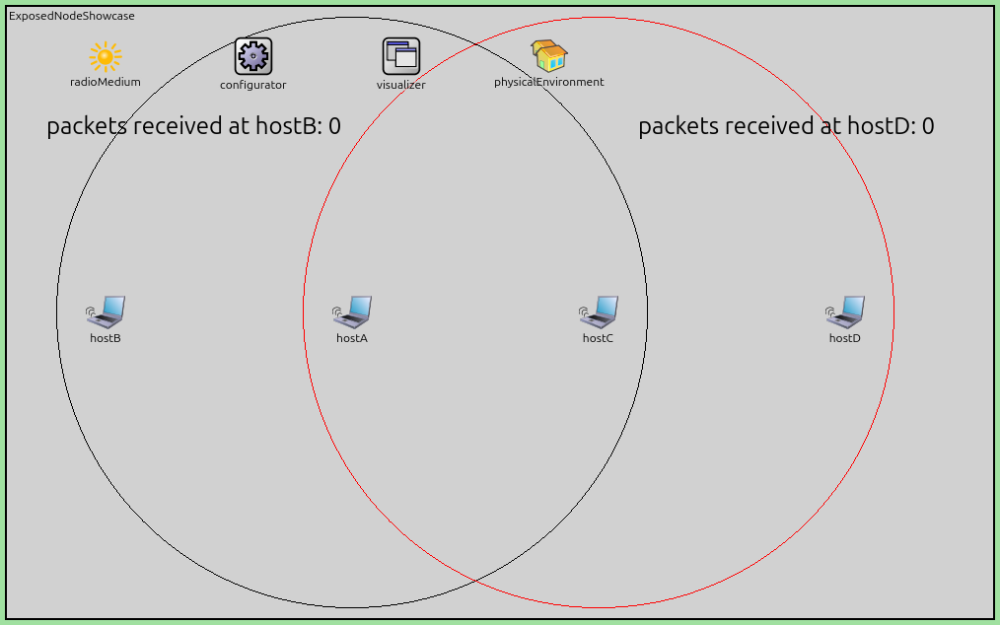

The Exposed Node Problem
========================

Goals
-----

Carrier sensing is 802.11's first line of defense against collisions: listen
before transmitting, and stay silent while another station is on the air. That
rule assumes that whatever the transmitter hears would also interfere at its
receiver. When that assumption fails, carrier sensing becomes too cautious — a
station stays silent even though its transmission would have disturbed no one.

This showcase demonstrates the **exposed node problem**: two wireless links
that could operate simultaneously without any interference are serialized by
carrier sensing, and each is cut to about half of its throughput. It is the
mirror image of :doc:`the hidden node problem <../../hiddennode/doc/index>` —
there, carrier sensing hears too little; here, it hears too much.

| Verified with INET version: ``4.6``
| Source files location: `inet/showcases/wireless/exposednode <https://github.com/inet-framework/inet/tree/master/showcases/wireless/exposednode>`__

.. admonition:: In one minute

   - **The effect:** two independent links, hostA → hostB and hostC → hostD,
     each capable of 4.3 Mbps on its own, drop to ~2.3 Mbps each when they run
     together — their aggregate is pinned at roughly one link's worth (in
     fact ~9% above it; Results explains why).
   - **The cause:** the transmitters hostA and hostC are in each other's
     sensing range, so carrier sensing forces them to take turns — even though
     neither receiver could hear the other link's transmitter at all.
   - **The proof:** in the entire 5-second run, not a single transmitted
     frame is lost or retransmitted — every deferral guarded against a
     collision that could not have happened. A control run with a
     radio-opaque wall between hostA and hostC
     lets both flows run at full rate in parallel: the aggregate rises from
     4.7 to 8.6 Mbps.
   - **The catch:** unlike the hidden node problem, 802.11 has no switch to
     flip — RTS/CTS does not help, and simply ignoring the busy channel would
     break acknowledgments (see the fine print at the end of Results).

..
   FIGURE RECIPE (redo via the "inet-showcase-charts" skill)
   type:     chart (matplotlib)
   anf:      ExposedNodeShowcase.anf   chart "Per-flow and aggregate throughput"
   inputs:   results/*.sca from configs OneFlow, TwoFlowsExposed,
             TwoFlowsDecoupled (already recorded)
   shows:    application-level throughput of the two flows plus their sum, per
             config; exposed flows at ~half rate, exposed aggregate ~= OneFlow
             baseline, decoupled aggregate ~2x
   anchor:   data is structural -- host{B,D}.app[0] packetReceived:count
             x 0.0016 -> Mbps (1000 B packets / 5 s). If the series set
             changes, the scenario/recording changed -> re-derive.
   backend:  matplotlib -> identical in IDE and headless
   export:   opp_charttool imageexport ExposedNodeShowcase.anf
             -n "Per-flow and aggregate throughput" -f png --dpi 150
             -d doc/media   ; image_export_width/height 8x6 -> 1200x900
   stamp:    captured 2026-07, INET 4.6

**Alone (OneFlow), a link delivers 4.3 Mbps. Run together (TwoFlowsExposed),
the two flows get ~2.3 Mbps each — about half — and a wall that stops the
transmitters from hearing each other (TwoFlowsDecoupled) gives both links
their full rate back.**

About the Exposed Node Problem
------------------------------

802.11 stations arbitrate the shared channel with CSMA/CA (carrier-sense
multiple access with collision avoidance): a station listens first, and while
it senses another transmission it defers, resuming a random backoff countdown
once the channel goes quiet. Deferring is the right call whenever the sensed
transmission would actually interfere at the intended receiver.

The exposed node problem is the situation where that inference is wrong.
Consider two transmitter–receiver pairs pointing away from each other: hostA
sends to hostB on its left, hostC sends to hostD on its right, and only the
two *transmitters* are within range of each other. Each transmitter's signal
cannot reach the *other pair's receiver* at all.

The two links are therefore physically independent — both could transmit at
the same time and both receivers would decode their frames cleanly. But
whenever hostA transmits, hostC senses a busy channel and defers (and vice
versa). hostC is called an *exposed node*: it is exposed to hostA's
transmission without being a threat to it. Here the roles are symmetric —
each transmitter is an exposed node with respect to the other.

The cost is real: two links that could each run at full rate are serialized
onto a single channel's worth of capacity, roughly halving both throughputs.
The effect has been known since early packet-radio research; it was analyzed
— together with its hidden-node mirror image — in the MACAW paper (Bharghavan
et al., SIGCOMM 1994), which brought the term into wide use.

Unlike the hidden node problem, plain 802.11 offers no configuration switch
against exposure. RTS/CTS (request to send / clear to send: a short handshake
that reserves the channel around a long data frame) protects receivers from
transmitters they cannot hear — the hidden-node direction — but it does
nothing to let an exposed node transmit *during* its neighbor's transmission.
The deeper reason 802.11 keeps the conservative behavior is its
acknowledgment scheme, shown at the end of the Results section.

The Model
---------

The Scenario in INET
~~~~~~~~~~~~~~~~~~~~

The network contains four :ned:`WirelessHost` nodes in a row, 250 m apart, in
ad-hoc mode (no access point, frames go directly to the destination). The
radios use the unit-disk model, which makes "who hears whom" a pure matter of
configured range:

- Within the 300 m *communication range*, a signal is received and decoded.
- The *interference range* and *detection range* default to the same 300 m:
  a signal disturbs other receptions and is sensed as a busy channel out to
  300 m, and has no effect whatsoever beyond it.

With 250 m spacing, each host hears exactly its 250 m neighbors. hostA
reaches hostB and hostC, but not hostD — that one is 500 m away. Likewise,
hostC reaches hostA and hostD, but not hostB.

When hostA transmits, hostC senses the channel busy for as long as the frame
is on the air. And since hostC can decode the frame, it also sets its NAV
(network allocation vector, 802.11's virtual carrier sense) from the frame's
duration field — covering the rest of the exchange, the ACK from hostB that
hostC is too far away to sense. Between them, the two mechanisms keep hostC
silent for the entire exchange.

..
   FIGURE RECIPE (redo via the "omnetpp-mcp-sim" skill)
   type:     canvas
   config:   TwoFlowsExposed   # ../omnetpp.ini
   seed:     default
   shows:    topology -- hostB, hostA, hostC, hostD in a row 250 m apart, the
             infrastructure modules on top, and the 300 m communication range
             circles of hostA (black) and hostC (red) drawn via their display
             strings; hostA's circle contains hostB and hostC but not hostD,
             hostC's contains hostA and hostD but not hostB
   anchor:   initial state (t=0, before run). Structural -- no timing; if the
             module set or the circle/range geometry differs, the NED or ini
             changed.
   capture:  get_canvas_image, module_path=ExposedNodeShowcase,
             area=module_rectangle, margin=5; was 1014x634
   stamp:    captured 2026-07, INET 4.6

**The circles are the 300 m communication ranges of hostA (black) and hostC
(red): each covers its own receiver and the other transmitter — but neither
covers the other link's receiver.**

The interface and radio-medium settings pin everything to fixed, symmetric
values:

.. literalinclude:: ../omnetpp.ini
   :start-at: mgmt.typename
   :end-at: obstacleLoss.typename
   :language: ini

Line by line:

- The ``mgmt`` and ``agent`` settings put the interfaces in ad-hoc mode — no
  access point, no scanning or association.
- Data, ACK, and control frames all use a fixed 6 Mbps.
- The radio is unit-disk with a 300 m communication range (interference and
  detection range default to the same value).
- A 14-frame MAC queue keeps each sender backlogged.
- :par:`sameTransmissionStartTimeCheck` permits transmissions that start at
  exactly the same moment. By default the radio medium treats coincident
  starts as a likely configuration error and stops; here they are legitimate
  — both saturated senders begin at t = 1 ms.
- :ned:`IdealObstacleLoss` makes obstacles block signals completely; it only
  has an effect in the wall configuration.

All runs use plain DCF (distributed coordination function — 802.11's
standard CSMA/CA channel access): RTS/CTS stays disabled, its default state.

Traffic is saturated UDP: hostA streams 1000-byte packets to hostB every
1 ms — about 8 Mbps offered, well above what one 6 Mbps link can carry — so
its MAC queue is always full, and the excess offered packets are dropped at
the sender's own queue. That is saturation by design: the link is measured at
its capacity, not at the offered load. hostB and hostD run UDP sinks.

.. literalinclude:: ../omnetpp.ini
   :start-at: hostA.numApps
   :end-before: [Config OneFlow]
   :language: ini

The showcase runs three configurations, each for 5 seconds of simulation
time. Throughput is measured as the packets received by the sinks.

OneFlow Configuration
~~~~~~~~~~~~~~~~~~~~~

Only hostA transmits; hostC stays silent. This measures what one link is
worth on its own — the baseline that the two-flow runs are compared against.
(The baseline comes out near 4.3 Mbps rather than 6: besides the data bits,
every 1000-byte frame also pays for a physical-layer preamble, interframe
gaps, the random backoff, and the ACK.)

.. literalinclude:: ../omnetpp.ini
   :start-at: [Config OneFlow]
   :end-before: [Config TwoFlowsExposed]
   :language: ini

TwoFlowsExposed Configuration
~~~~~~~~~~~~~~~~~~~~~~~~~~~~~

hostC now also streams saturated UDP traffic, to hostD. The two flows never
interfere at either receiver, but the two transmitters hear each other — the
exposed node situation:

.. literalinclude:: ../omnetpp.ini
   :start-at: [Config TwoFlowsExposed]
   :end-before: [Config TwoFlowsDecoupled]
   :language: ini

TwoFlowsDecoupled Configuration
~~~~~~~~~~~~~~~~~~~~~~~~~~~~~~~

The control experiment: the same two flows, plus a wall between hostA and
hostC that completely blocks radio signals (ideal obstacle loss). The wall
removes the one thing the exposed configuration suffers from — the
transmitters sensing each other — while leaving both links' own paths
untouched:

.. literalinclude:: ../omnetpp.ini
   :start-at: [Config TwoFlowsDecoupled]
   :language: ini

Results
-------

The following video shows the exposed configuration in steady state. The
expanding disks are radio transmissions; the counters show packets received:

.. video:: media/exposed.mp4
   :width: 100%

..
   VIDEO RECIPE (redo via the "video-recording" skill)
   config:   TwoFlowsExposed
   seed:     default
   shows:    hostA and hostC transmitting strictly one at a time (a single
             signal disk on the air at any moment), each data frame answered
             by the receiver's ACK; both packet counters advancing at about
             half pace (~297 at t=1.02 s vs ~543 in the decoupled run)
   anchors:  saturated steady state from a few ms in; any window works. Last
             observed: counters 297 (hostB) / 300 (hostD) at t=1.02 s.
   window:   express-run to 1.02 s -> step 1 event -> record to 1.037 s;
             no fade wait (fadeOutMode=animationTime)
   anim:     playback_speed=2        # set_animation_parameters, normal profile
   capture:  fps=2, crop_area=with_padding   # crop_rect was 1024:644:777:87
   encode:   ffmpeg -r 10 -vcodec libx264 -pix_fmt yuv420p (pad to even dims)
   post:     none
   stamp:    recorded 2026-07, INET 4.6

**Only one signal disk is on the air at any moment: hostA and hostC take
turns, so the two independent links share one link's worth of airtime.**

The decoupled control run looks strikingly different — the wall (the reddish
bar in the middle) hides the transmitters from each other, and their
transmissions overlap freely:

.. video:: media/decoupled.mp4
   :width: 100%

..
   VIDEO RECIPE (redo via the "video-recording" skill)
   config:   TwoFlowsDecoupled
   seed:     default
   shows:    both hostA and hostC transmitting at the same time (two signal
             disks on the air together, overlapping mid-canvas), the wall
             visible between them; packet counters at roughly double the
             exposed run's values (~543 at t=1.02 s vs ~297)
   anchors:  saturated steady state from a few ms in; any window works. Last
             observed: counters 543 (hostB) / 545 (hostD) at t=1.02 s.
   window:   express-run to 1.02 s -> step 1 event -> record to 1.037 s;
             no fade wait (fadeOutMode=animationTime)
   anim:     playback_speed=2        # set_animation_parameters, normal profile
   capture:  fps=2, crop_area=with_padding   # crop_rect was 1024:644:777:87
   encode:   ffmpeg -r 14 -vcodec libx264 -pix_fmt yuv420p (pad to even dims)
   post:     none
   stamp:    recorded 2026-07, INET 4.6

**With the wall blocking the transmitters from sensing each other, both
signal disks are on the air simultaneously — and both receivers still decode
every frame, because neither transmitter's signal reaches the other link's
receiver.**

Measured over the full 5-second runs, the throughput picture is this:

..
   FIGURE RECIPE: same chart as the hero figure at the top of the page --
   see the recipe there.

**Alone, the hostA → hostB link carries 4.28 Mbps. Exposed to each other, the
two links get 2.32 and 2.34 Mbps — 54% and 55% of the baseline — while their
aggregate stays at one link's worth. Decoupled by the wall, both flows return
to the full single-link rate, and the aggregate nearly doubles.**

=================  ===============  ===============  =========
configuration      hostA → hostB    hostC → hostD    aggregate
=================  ===============  ===============  =========
OneFlow            4.28             —                4.28
TwoFlowsExposed    2.32             2.34             4.67
TwoFlowsDecoupled  4.28             4.28             8.56
=================  ===============  ===============  =========

(Application-level throughput in Mbps: packets received by the sink × 8000
bits / 5 s.)

Two measurements pin down *why* this is pure carrier-sensing overcaution and
not physics:

- **The links never actually collide.** In the exposed run, not one data
  frame is retransmitted — the MAC's retry counters stay at zero on both
  senders. Every frame that was sent got through and was acknowledged. The
  collisions carrier sensing guarded against cannot occur in this topology.
- **The serialization is near-total.** Computed from the recorded radio
  transmission-state vectors, hostA and hostC are on the air simultaneously
  for just 1.4 ms of their combined 4.23 s of transmission airtime (0.03%) —
  and that sole overlap, the two flows' very first packets started in the
  same instant at t = 1 ms, was delivered successfully by *both* links. In
  the decoupled run the same overlap measure is 3.0 s.

.. admonition:: Details — why the exposed aggregate is slightly *above* the baseline

   The exposed aggregate (4.67 Mbps) is about 9% higher than the single-flow
   baseline (4.28 Mbps), even though the two flows share the channel. The
   gain is backoff efficiency, not parallelism:

   - After each frame exchange, every 802.11 sender waits a random number of
     idle backoff slots before transmitting again.
   - With one saturated sender, the channel idles for that station's full
     backoff draw between frames — on average ~15.5 slots, half the minimum
     contention window of 31.
   - With two saturated senders, whoever's counter expires first seizes the
     channel, so the idle gap is the *smaller* of two counters — measured
     ~8.3 slots per frame here. Less idle time, slightly more frames.

.. admonition:: Fine print — why 802.11 cannot simply ignore the busy channel

   Could a smarter MAC just let hostC transmit while hostA is on the air,
   since their receivers are isolated? Not in 802.11 — because of the ACKs:

   - Every data frame is acknowledged by its receiver, in the reverse
     direction, right after the frame.
   - Suppose hostC ignored the busy channel and started while hostA's frame
     was on the air. Having started later, hostC would still be transmitting
     when hostB's ACK to hostA arrives — and hostC is well within hostA's
     range, so the ACK would be destroyed at hostA. Whichever station starts
     second clobbers the other link's ACK.
   - The parallelism is therefore not recoverable just by relaxing carrier
     sensing — physical or virtual: the *reverse* channel of each link is not
     independent, only the forward channel is. Carrier sensing and the NAV
     are what serialize the links, but the ACK coupling is why that deferral
     cannot simply be switched off. (The wall in the control run removes this
     coupling too, which is why it recovers the full rate.)
   - This is why the exposed node problem, unlike the hidden node problem,
     has no in-protocol fix in 802.11; proposals in the literature (MACA,
     MACAW, and successors) change the protocol itself.

Sources: :download:`omnetpp.ini <../omnetpp.ini>`,
:download:`ExposedNodeShowcase.ned <../ExposedNodeShowcase.ned>`,
:download:`wall.xml <../wall.xml>`

Try It Yourself
---------------

A good first experiment: run ``TwoFlowsExposed`` and ``TwoFlowsDecoupled``
side by side in Qtenv and watch the signal disks and the two packet counters
— one transmission at a time in the first, two at once (and counters climbing
twice as fast) in the second.

If you already have INET and OMNeT++ installed, start the IDE by typing
``omnetpp``, import the INET project into the IDE, then navigate to the
``inet/showcases/wireless/exposednode`` folder in the `Project Explorer`.
There, you can view and edit the showcase files, run simulations, and analyze
results.

Otherwise, there is an easy way to install INET and OMNeT++ using `opp_env
<https://omnetpp.org/opp_env>`__, and run the simulation interactively.
Ensure that ``opp_env`` is installed on your system, then execute:

.. code-block:: bash

    $ opp_env run inet-4.6 --init -w inet-workspace --install --build-modes=release --chdir \
       -c 'cd inet-4.6.*/showcases/wireless/exposednode && inet'

This command creates an ``inet-workspace`` directory, installs the appropriate
versions of INET and OMNeT++ within it, and launches the ``inet`` command in
the showcase directory for interactive simulation.

Alternatively, for a more hands-on experience, you can first set up the
workspace and then open an interactive shell:

.. code-block:: bash

    $ opp_env install --init -w inet-workspace --build-modes=release inet-4.6
    $ cd inet-workspace
    $ opp_env shell

Inside the shell, start the IDE by typing ``omnetpp``, import the INET
project, then start exploring.

References
----------

- V. Bharghavan, A. Demers, S. Shenker, and L. Zhang, "MACAW: A Media Access
  Protocol for Wireless LAN's," *Proc. ACM SIGCOMM 1994*, pp. 212–225.
  https://dl.acm.org/doi/10.1145/190314.190334

Discussion
----------

Use `this page <https://github.com/inet-framework/inet-showcases/issues/TODO>`__ in
the GitHub issue tracker for commenting on this showcase.
