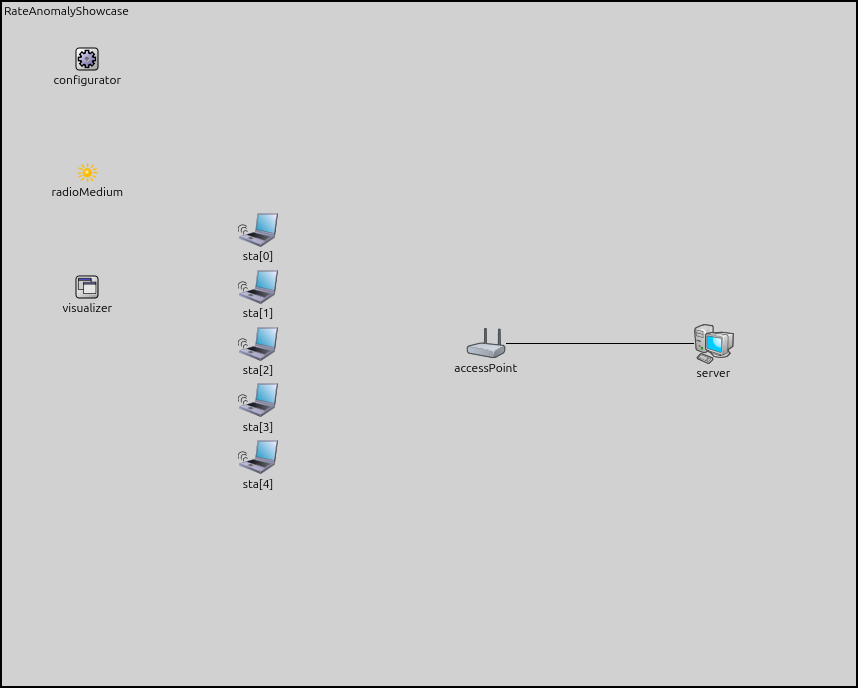
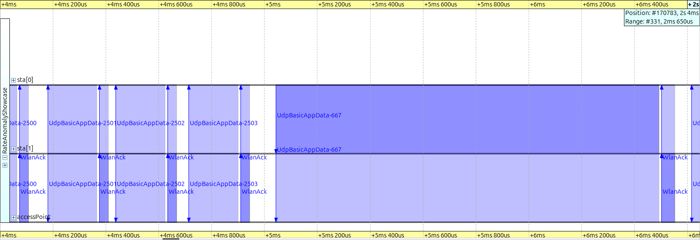
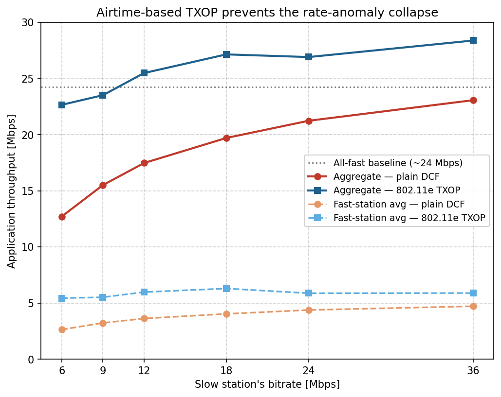

IEEE 802.11 Rate Anomaly
========================

Goals
-----

A Wi-Fi cell is a shared medium: at any instant only one station can be
transmitting. When several stations have traffic to send, the 802.11 Distributed
Coordination Function (DCF) shares the channel between them *fairly* — but "fairly"
turns out to mean something surprising. This showcase demonstrates the **802.11 rate
anomaly**: a single station transmitting at a low bitrate does not just get less for
itself, it drags the throughput of *every* other station down to its own level, and
the whole network loses a large fraction of its capacity.

We reproduce the effect with a small 802.11g network and measure just how much one
slow station costs everyone else.

| Verified with INET version: ``4.6``
| Source files location: `inet/showcases/wireless/rateanomaly <https://github.com/inet-framework/inet/tree/master/showcases/wireless/rateanomaly>`__

About 802.11 Channel Access and the Rate Anomaly
------------------------------------------------

802.11 stations share a single half-duplex radio channel — only one of them can be on
the air at a time. They coordinate access with the Distributed Coordination Function
(DCF), a carrier-sense multiple access scheme with collision avoidance (CSMA/CA): a
station listens before transmitting, and when the channel is busy it waits a random
*backoff* — a random number of idle slots — before trying again.
Averaged over time, this random backoff gives every contending station a statistically
**equal number of opportunities to transmit**. That is the fairness DCF provides.

802.11 is also a multi-rate technology. A station with a weaker or noisier link falls
back to a lower bitrate so that its frames remain decodable. The catch is that a frame
sent at a low bitrate occupies the channel *longer*. The data bits take proportionally
longer to clock out — about nine times longer at 6 Mbps than at 54 Mbps, since the rate
is nine times lower. The whole on-air frame grows by a slightly smaller factor, about
eight times, because the physical-layer preamble and header take a fixed time that does
not shrink with the data rate. And the full channel cost of a transmission — the frame
plus the fixed interframe spaces and the acknowledgment (which for the slow station is
itself sent at a low rate) — comes to a smaller factor still, roughly six times for
6 versus 54 Mbps. However it is counted, a slow frame ties up the shared medium several
times longer than a fast one.

Now combine the two facts. DCF equalizes the *number* of transmissions, not the *time*
each station spends transmitting. A slow station transmits about as often as everyone
else, but each of its transmissions ties up the channel far longer — so it consumes a
disproportionate share of channel time. Because the medium is shared, the time the slow
station occupies is time the fast stations cannot use. The fast stations are therefore
throttled down toward the slow station's throughput. In the limit, *all* stations end
up with roughly the **same** throughput, close to what the slowest station would
achieve on its own. This is the IEEE 802.11 performance anomaly, first characterized by
`Heusse, Rousseau, Berger-Sabbatel, and Duda
<https://ieeexplore.ieee.org/document/1208921/>`__ (INFOCOM 2003).

The root cause is that standard DCF provides **transmission-opportunity fairness**
(equal access count) rather than **airtime fairness** (equal channel time). Scheduling
disciplines that enforce airtime fairness avoid the anomaly, but they are outside plain
DCF.

In practice this is how the problem is handled today: modern access points schedule
stations by **airtime** rather than by packets. The Linux ``mac80211`` stack, for
example, uses a deficit round-robin scheduler whose deficit is counted in airtime
(microseconds) instead of bytes, so a slow station is held to its fair *time* share and
can no longer drag the others down. That scheme — described by Høiland-Jørgensen et al.,
`"Ending the Anomaly" <https://arxiv.org/abs/1703.00064>`__ (USENIX ATC 2017) — ships in
mainline Linux, and many commercial access points expose an equivalent "airtime
fairness" feature.

The Model
---------

802.11 Configuration in INET
~~~~~~~~~~~~~~~~~~~~~~~~~~~~~~

The network uses three kinds of node:

- :ned:`WirelessHost` — the contending stations, each with an 802.11 interface;
- :ned:`AccessPoint` — the access point the stations associate with; it bridges the
  wireless cell to a wired Ethernet segment;
- :ned:`StandardHost` — a wired server that receives the stations' traffic.

Each station's data rate is pinned with the wlan interface's ``bitrate`` parameter, and
``opMode`` selects 802.11g. No rate-control algorithm is active, so every station
transmits at exactly its configured rate regardless of conditions. This is what lets us
make one station slow and the rest fast purely by configuration:

.. literalinclude:: ../omnetpp.ini
   :start-at: *.sta[*].wlan[*].opMode
   :end-at: pendingQueue.packetCapacity
   :language: ini

The relevant settings:

- ``opMode = "g(erp)"`` — every interface runs 802.11g.
- ``bitrate`` — the fixed data rate: 54 Mbps for the fast stations, lower for the slow
  one.
- The transmit ``power`` is generous and all stations sit close to the access point, so
  every link is error-free at every rate. The slow station is slow *by configuration*,
  not because of a weak signal — this isolates the anomaly from packet loss.
- A small MAC queue (``pendingQueue.packetCapacity``) together with an over-provisioned
  UDP source keeps every station continuously backlogged, so the channel is fully
  contended. This is the saturated regime in which the rate anomaly is defined.

Every station sends a saturating UDP stream to the server on its own port, so
throughput can be measured separately for each station:

.. literalinclude:: ../omnetpp.ini
   :start-at: *.sta[*].numApps
   :end-at: *.sta[*].app[0].sendInterval
   :language: ini

The Network
~~~~~~~~~~~

The network contains an access point with five wireless stations clustered nearby, and
a wired server reachable through the access point. All five stations upload a saturating
UDP flow to the server at the same time, so they continuously contend for the channel.

..
   FIGURE RECIPE (redo via the "omnetpp-mcp-sim" skill)
   type:     canvas
   config:   Homogeneous   # ../omnetpp.ini (node positions are identical across configs)
   seed:     default
   shows:    topology -- the configurator/radioMedium/visualizer infrastructure modules,
             five sta[*] wireless hosts clustered ~8-9 m from the accessPoint, and the
             wired server reachable over Eth100M
   anchor:   initial state (t=0, before run). Structural -- no timing; if the module set
             or links differ, the NED changed.
   capture:  Qtenv + MCP server; set_canvas_view {module_path:"<root>", fit:true} then
             get_canvas_image {module_path:"<root>", area:"viewport"}; green canvas
             margin trimmed with `convert -fuzz 6% -trim`. Was 858x688.
   stamp:    captured 2026-07, INET 4.6

Homogeneous and RateAnomaly Configurations
~~~~~~~~~~~~~~~~~~~~~~~~~~~~~~~~~~~~~~~~~~~~

Two configurations are defined. In **Homogeneous**, all five stations transmit at
54 Mbps — the baseline, in which the channel is shared fairly and the network runs at
full 802.11g capacity. In **RateAnomaly**, one station is slowed while the other four
stay at 54 Mbps; its bitrate is swept from 36 Mbps down to 6 Mbps to show how the
damage grows as the rate gap widens:

.. literalinclude:: ../omnetpp.ini
   :start-at: [Config RateAnomaly]
   :end-at: slowBitrate
   :language: ini

Results
-------

Each station's application-level throughput is measured at the server over the
steady-state interval, after association settles. Each run lasts 5 s, with the first
1 s discarded as warmup, so throughput is averaged over the remaining 4 s.

In the **Homogeneous** baseline, all five stations achieve nearly the same throughput,
about 4.6–5.0 Mbps each, for an aggregate of roughly 24 Mbps — full 802.11g saturation
throughput at this payload size.

When one station is slowed to 6 Mbps in **RateAnomaly**, every station — including the
four still configured for 54 Mbps — drops to about 2.3–2.6 Mbps. The fast stations do
not merely lose a little throughput; they are pulled down to nearly the slow station's
level, settling just above the floor it sets:

.. figure:: media/per-station-throughput.png
..
   FIGURE RECIPE (redo via the "inet-showcase-charts" skill)
   type:     chart (matplotlib)
   anf:      RateAnomalyShowcase.anf   chart "Per-station throughput"
   inputs:   results/*.sca   from configs Homogeneous + RateAnomaly (already recorded)
   shows:    per-station application throughput, Homogeneous (all 54 Mbps) vs the
             rate anomaly (sta[0] at 6 Mbps); the four fast stations collapse to the
             slow station's level (dotted line)
   anchor:   data is structural — server.app[*] packetReceived:count x 0.002 -> Mbps.
             If the per-station series set changes, the scenario/recording changed -> re-derive.
   backend:  matplotlib -> identical in IDE and headless
   export:   opp_charttool imageexport RateAnomalyShowcase.anf -n "Per-station throughput"
             -f png --dpi 150 -d doc/media/   ; size 1200x900, 8x6 in via image_export_width/height
   stamp:    captured 2026-06, INET 4.6

The reason is visible in the raw frame counts: over the measurement interval every
station — fast or slow — successfully transmits a similar *number* of frames (between
roughly 1,150 and 1,300). DCF gave each station a nearly equal number of transmission
opportunities, exactly as designed. But each of the slow station's frame exchanges tied
up the channel several times longer — around six times, once the rate-independent
preamble, interframe spaces, and acknowledgment are included — so it consumed
most of the channel time and left little for the others.

.. figure:: media/frames-per-station.png
..
   FIGURE RECIPE (redo via the "inet-showcase-charts" skill)
   type:     chart (matplotlib)
   anf:      RateAnomalyShowcase.anf   chart "Frames per station"
   inputs:   results/*.sca   from config RateAnomaly slowBitrate=6 (already recorded)
   shows:    frames successfully transmitted per station in the rate-anomaly case
             (slow = 6 Mbps); near-equal counts = DCF's equal transmission opportunities
   anchor:   data is structural — server.app[*] packetReceived:count for the RateAnomaly
             slowBitrate=6 run. If that run is absent or counts diverge, re-derive.
   backend:  matplotlib -> identical in IDE and headless
   export:   opp_charttool imageexport RateAnomalyShowcase.anf -n "Frames per station"
             -f png --dpi 150 -d doc/media/   ; size 1200x900, 8x6 in via image_export_width/height
   stamp:    captured 2026-06, INET 4.6

Where the frame counts show that each station gets an equal *number* of turns, a
sequence chart shows how unequal those turns are in *duration*. The chart below captures
about 2.6 ms of the shared channel in a reduced two-station illustration — one station
fixed at 6 Mbps, the other at 54 Mbps, each sending a light, collision-free stream (the
other three stations idle) so every frame stands alone. Each frame is drawn as a block
whose width is the time it holds the medium:

..
   FIGURE RECIPE (redo via the "omnetpp-ide-mcp" skill)
   type:     seqchart
   config:   RateAnomaly run 5 (slowBitrate=6), reduced to two active stations (apps on
             sta[2..4] disabled) at LIGHT load so frames don't collide: sta[0]=6 Mbps
             sending every 3 ms, sta[1]=54 Mbps sending every 0.8 ms
   seed:     default
   shows:    four narrow 54 Mbps frames (sta[1], seq 2500-2503) then one wide 6 Mbps frame
             (sta[0], seq 667) carrying the same 1000-byte payload -- block width = airtime,
             so the slow frame occupies the channel ~8x longer (measured 7.8x on-air)
   record:   inet -u Cmdenv -c RateAnomaly -r 5
               --*.sta[2].numApps=0 --*.sta[3].numApps=0 --*.sta[4].numApps=0
               --*.sta[0].app[0].sendInterval=3ms --*.sta[1].app[0].sendInterval=0.8ms
               --record-eventlog=true --eventlog-recording-intervals=2s..2.05s
               --sim-time-limit=2.06s --result-dir=results/elog3
   source:   results/elog3/RateAnomaly-slowBitrate=6-#0.elog
   axes:     sta[0] (6 Mbps), sta[1] (54 Mbps), accessPoint   (this top-to-bottom order)
   display:  NETWORK_COMMUNICATION; timeline SIMULATION_TIME (linear -- required so block
             width equals airtime; NONLINEAR flattens the contrast)
   anchor:   window 2.004000s..2.006650s -- the collision-free 6 Mbps frame occupies
             [2.005044s, 2.006494s]. Any clean (non-colliding) slow frame works; if the
             wide/narrow width ratio stops being ~8x, the bitrates changed.
   capture:  Sequence Chart screenshot, cropped to the window; was 1630x560
   stamp:    captured 2026-07, INET 4.6

Each narrow block is a 54 Mbps frame; the wide block is a single 6 Mbps frame carrying
the same 1000 bytes, so its on-air time is about eight times longer — the data alone
would take nine times as long at the lower rate, but the fixed preamble keeps the whole
frame just under that. The slow frame alone holds the channel about as long as the whole
run of fast frames beside it. That per-frame airtime gap is the mechanism behind the
anomaly: because DCF hands the stations a similar *number* of transmissions (the
frame-count chart above), the slow station's far longer frames let it swallow a
correspondingly larger share of channel time — dragging every station's throughput down
toward its own.

The damage scales with the rate gap. As the slow station's rate falls from 54 to
6 Mbps, the aggregate network throughput falls from about 24 to 12 Mbps — a single slow
station halves the capacity of the entire cell:

.. figure:: media/throughput-vs-rate.png
..
   FIGURE RECIPE (redo via the "inet-showcase-charts" skill)
   type:     chart (matplotlib)
   anf:      RateAnomalyShowcase.anf   chart "Throughput vs slow-station rate"
   inputs:   results/*.sca   from configs Homogeneous + RateAnomaly (already recorded)
   shows:    aggregate, fast-station-average, and slow-station throughput vs the slow
             station's bitrate (54 = Homogeneous baseline, 36..6 = RateAnomaly sweep)
   anchor:   data is structural — server.app[*] packetReceived:count grouped by the
             slowBitrate itervar (Homogeneous -> 54). If the sweep points change, re-derive.
   backend:  matplotlib -> identical in IDE and headless
   export:   opp_charttool imageexport RateAnomalyShowcase.anf -n "Throughput vs slow-station rate"
             -f png --dpi 150 -d doc/media/   ; size 1200x900, 8x6 in via image_export_width/height
   stamp:    captured 2026-06, INET 4.6

============================  ===============  ==============  ====================
slow station rate (Mbps)      aggregate        slow station    fast stations (avg)
============================  ===============  ==============  ====================
54 (Homogeneous baseline)     24.2             5.02            4.80
36                            23.1             4.24            4.70
24                            21.2             3.83            4.34
18                            19.9             3.40            4.12
12                            17.8             2.81            3.74
9                             15.2             2.74            3.11
6                             12.2             2.31            2.47
============================  ===============  ==============  ====================

(All values in Mbps, application-level throughput. The 54 Mbps row is the Homogeneous
baseline — the zero-gap reference point; the rows below it are the RateAnomaly sweep.)
The fast stations' own throughput — the rightmost column — falls almost in step with the
slow station's, even though their configuration never changes. That drop is the rate
anomaly: equal access, unequal airtime.

Solving the Anomaly with Airtime Fairness
-----------------------------------------

The anomaly follows from DCF sharing *transmission opportunities* equally. The IEEE 802.11e
amendment adds a mechanism that shares *airtime* instead: the **transmission opportunity
(TXOP)**. 802.11e replaces DCF with EDCA, which sorts traffic into four access categories;
ordinary best-effort traffic uses AC_BE. A station that wins the channel for a category may
then transmit a burst of frames for up to a bounded *time* — that category's ``txopLimit`` —
before it has to contend again. DCF still hands out wins equally often, so an equal *time* per
win means an equal share of airtime: a fast station simply packs many frames into its slice, a
slow station only a few.

The ``[Config Txop]`` configuration switches the interface to the QoS (EDCA) MAC and grants
best-effort traffic a time-based TXOP. AC_BE's *default* TXOP limit is zero — one frame per
win, i.e. plain DCF behaviour — so the fix is simply to set a nonzero limit; here we borrow
the standard's Video-category value (3.008 ms). The MAC queue is deepened too, so a fast
station has enough frames buffered to fill a burst; those are the only changes:

.. literalinclude:: ../omnetpp.ini
   :start-at: [Config Txop]
   :end-at: pendingQueue.packetCapacity
   :language: ini

Rerunning the rate sweep tells a very different story. Where plain DCF's throughput
collapses as the slow station slows — dragging the fast stations down with it — TXOP holds
the aggregate roughly flat and keeps the fast stations near their full throughput:

..
   FIGURE RECIPE (redo via ../txop-chart.py)
   type:     chart (matplotlib)
   shows:    aggregate and fast-station-average application throughput vs the slow station's
             bitrate, plain DCF vs 802.11e TXOP; DCF collapses as the slow rate drops, TXOP
             stays flat and high
   inputs:   results/solve/RateAnomaly-*.sca and results/solve/Txop-*.sca, BOTH 3 reps
             (DCF is not deterministic -- same RNG/backoff -- so both are averaged alike);
             results/Homogeneous-#0.sca for the all-fast baseline line
   record:   inet -u Cmdenv -c RateAnomaly  -r 0..17 --repeat=3 --result-dir=results/solve
             inet -u Cmdenv -c Txop        -r 0..17 --repeat=3 --result-dir=results/solve
             inet -u Cmdenv -c Homogeneous -r 0               --result-dir=results
   metric:   server.app[*] packetReceived:count x 0.002 -> Mbps; aggregate = sum over the 5
             apps per run, fast-avg = mean over app[1..4]; both configs averaged over 3 reps
   anchor:   structural -- if the RateAnomaly/Txop configs or sweep points change, re-derive.
             Txop results are kept out of results/ root so they don't contaminate the
             DCF-only .anf charts (whose filters match packetReceived:count of any config).
   plot:     ../txop-chart.py (matplotlib; DCF red/orange, TXOP blue; 8x6 in @ dpi 150)
   stamp:    captured 2026-07, INET 4.6

At the widest gap — the slow station at 6 Mbps — the fast-station average recovers from about
2.5 Mbps under DCF to about 5.5 Mbps under TXOP, and the aggregate climbs from ~12 back to ~23
Mbps, most of the way to the ~24 Mbps all-fast baseline (the dashed line). The slow station
itself falls from ~2.3 to ~0.9 Mbps — and that *is* airtime fairness, not a side-effect: given
only its fair share of time, a 6 Mbps station can clock out proportionally fewer bits, so it
stops monopolising the medium and the others get their time back. (TXOP also sits a little
*above* the DCF baseline even at small gaps — bursting amortises the fixed per-frame overhead,
a modest efficiency bonus on top of the fairness fix.)

This is the standardised, in-MAC counterpart to the software airtime-fair scheduling that
production access points run (the Linux ``mac80211`` scheduler mentioned earlier): both
allocate channel *time* rather than transmission *count*.

One honest caveat — and the reason the chart plots only aggregate and group-average curves.
TXOP restores the *aggregate* capacity and the fast-station *group* reliably, but it does
**not** hand each individual station equal airtime here. Under this permanent, extreme
saturation INET's EDCA sometimes locks a station out completely: in several of the runs a
fast station receives *zero* throughput for the whole measurement window while its neighbours
absorb its share. Averaging over repetitions is what makes the group curves smooth — a
per-station plot would be dominated by that run-to-run lockout, so it is deliberately left
out. The system-level result (capacity recovered, the fast group no longer penalised) is
robust; perfect per-station fairness is not.

Sources: :download:`omnetpp.ini <../omnetpp.ini>`,
:download:`RateAnomalyShowcase.ned <../RateAnomalyShowcase.ned>`

Try It Yourself
---------------

If you already have INET and OMNeT++ installed, start the IDE by typing
``omnetpp``, import the INET project into the IDE, then navigate to the
``inet/showcases/wireless/rateanomaly`` folder in the `Project Explorer`. There, you can
view and edit the showcase files, run simulations, and analyze results.

Otherwise, there is an easy way to install INET and OMNeT++ using `opp_env
<https://omnetpp.org/opp_env>`__, and run the simulation interactively.
Ensure that ``opp_env`` is installed on your system, then execute:

.. code-block:: bash

    $ opp_env run inet-4.6 --init -w inet-workspace --install --build-modes=release --chdir \
       -c 'cd inet-4.6.*/showcases/wireless/rateanomaly && inet'

This command creates an ``inet-workspace`` directory, installs the appropriate
versions of INET and OMNeT++ within it, and launches the ``inet`` command in the
showcase directory for interactive simulation.

Alternatively, for a more hands-on experience, you can first set up the
workspace and then open an interactive shell:

.. code-block:: bash

    $ opp_env install --init -w inet-workspace --build-modes=release inet-4.6
    $ cd inet-workspace
    $ opp_env shell

Inside the shell, start the IDE by typing ``omnetpp``, import the INET project,
then start exploring.

References
----------

- M. Heusse, F. Rousseau, G. Berger-Sabbatel, and A. Duda, "Performance Anomaly of
  802.11b," *Proc. IEEE INFOCOM 2003*, pp. 836–843.
  https://ieeexplore.ieee.org/document/1208921/
- T. Høiland-Jørgensen, M. Kazior, D. Täht, P. Hurtig, and A. Brunström, "Ending the
  Anomaly: Achieving Low Latency and Airtime Fairness in WiFi," *Proc. USENIX ATC 2017*,
  pp. 139–151. https://arxiv.org/abs/1703.00064

Discussion
----------

Use `this page <https://github.com/inet-framework/inet-showcases/issues/TODO>`__ in
the GitHub issue tracker for commenting on this showcase.
