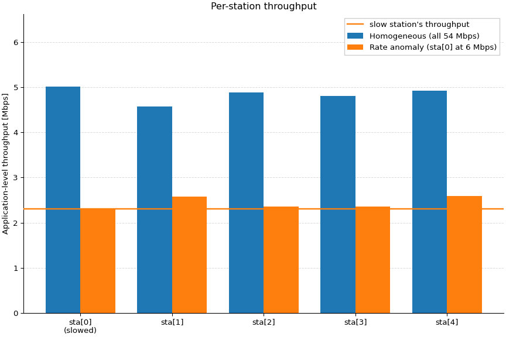
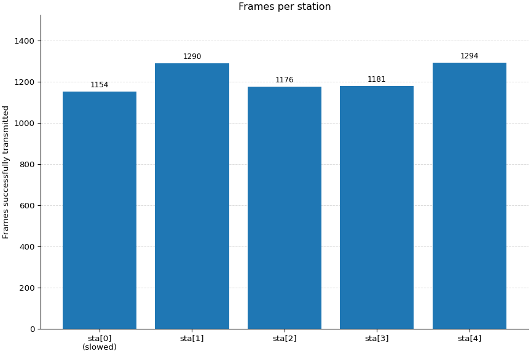
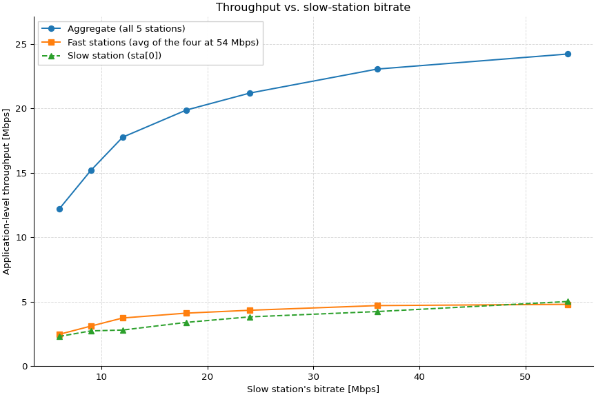

IEEE 802.11 Rate Anomaly
========================

Goals
-----

A Wi-Fi cell is a shared medium: at any instant only one station can be
transmitting. When several stations have traffic to send, the 802.11 Distributed
Coordination Function (DCF) shares the channel between them *fairly* — but "fairly"
turns out to mean something surprising. This showcase demonstrates the **802.11 rate
anomaly**: a single station transmitting at a low bitrate does not just get less for
itself, it drags the throughput of *every* other station down to its own level, and
the whole network loses a large fraction of its capacity.

We reproduce the effect with a small 802.11g network and measure just how much one
slow station costs everyone else.

| Verified with INET version: ``4.6``
| Source files location: `inet/showcases/wireless/rateanomaly <https://github.com/inet-framework/inet/tree/master/showcases/wireless/rateanomaly>`__

About 802.11 Channel Access and the Rate Anomaly
------------------------------------------------

802.11 stations share a single half-duplex radio channel — only one of them can be on
the air at a time. They coordinate access with the Distributed Coordination Function
(DCF), a carrier-sense multiple access scheme with collision avoidance (CSMA/CA): a
station listens before transmitting, and when the channel is busy it waits a random
*backoff* — a random number of idle slots — before trying again.
Averaged over time, this random backoff gives every contending station a statistically
**equal number of opportunities to transmit**. That is the fairness DCF provides.

802.11 is also a multi-rate technology. A station with a weaker or noisier link falls
back to a lower bitrate so that its frames remain decodable. The catch is that a frame
sent at a low bitrate occupies the channel *longer*. The data take proportionally longer
to send — about nine times longer at 6 Mbps than at 54 Mbps, since the rate is nine
times lower. The total channel cost grows by a smaller factor, because every frame also
carries fixed-duration overhead that does not shrink with the data rate: a physical-layer
preamble and header, interframe spaces, the random backoff, and the acknowledgment (which
for the slow station is itself sent at a low rate). Counting that overhead, a slow frame
still ties up the channel several times longer than a fast one — roughly six times, for
6 versus 54 Mbps.

Now combine the two facts. DCF equalizes the *number* of transmissions, not the *time*
each station spends transmitting. A slow station transmits about as often as everyone
else, but each of its transmissions ties up the channel far longer — so it consumes a
disproportionate share of channel time. Because the medium is shared, the time the slow
station occupies is time the fast stations cannot use. The fast stations are therefore
throttled down toward the slow station's throughput. In the limit, *all* stations end
up with roughly the **same** throughput, close to what the slowest station would
achieve on its own. This is the IEEE 802.11 performance anomaly, first characterized by
Heusse, Rousseau, Berger-Sabbatel, and Duda (INFOCOM 2003).

The root cause is that standard DCF provides **transmission-opportunity fairness**
(equal access count) rather than **airtime fairness** (equal channel time). Scheduling
disciplines that enforce airtime fairness avoid the anomaly, but they are outside plain
DCF.

The Model
---------

802.11 Configuration in INET
~~~~~~~~~~~~~~~~~~~~~~~~~~~~~~

The network uses three kinds of node:

- :ned:`WirelessHost` — the contending stations, each with an 802.11 interface;
- :ned:`AccessPoint` — the access point the stations associate with; it bridges the
  wireless cell to a wired Ethernet segment;
- :ned:`StandardHost` — a wired server that receives the stations' traffic.

Each station's data rate is pinned with the wlan interface's ``bitrate`` parameter, and
``opMode`` selects 802.11g. No rate-control algorithm is active, so every station
transmits at exactly its configured rate regardless of conditions. This is what lets us
make one station slow and the rest fast purely by configuration:

.. literalinclude:: ../omnetpp.ini
   :start-at: *.sta[*].wlan[*].opMode
   :end-at: pendingQueue.packetCapacity
   :language: ini

The relevant settings:

- ``opMode = "g(erp)"`` — every interface runs 802.11g.
- ``bitrate`` — the fixed data rate: 54 Mbps for the fast stations, lower for the slow
  one.
- The transmit ``power`` is generous and all stations sit close to the access point, so
  every link is error-free at every rate. The slow station is slow *by configuration*,
  not because of a weak signal — this isolates the anomaly from packet loss.
- A small MAC queue (``pendingQueue.packetCapacity``) together with an over-provisioned
  UDP source keeps every station continuously backlogged, so the channel is fully
  contended. This is the saturated regime in which the rate anomaly is defined.

Every station sends a saturating UDP stream to the server on its own port, so
throughput can be measured separately for each station:

.. literalinclude:: ../omnetpp.ini
   :start-at: *.sta[*].numApps
   :end-at: *.sta[*].app[0].sendInterval
   :language: ini

The Network
~~~~~~~~~~~

The network contains an access point with five wireless stations clustered nearby, and
a wired server reachable through the access point. All five stations upload a saturating
UDP flow to the server at the same time, so they continuously contend for the channel.

.. todo:: capture network screenshot (``media/network.png``) — access point, five
   ``sta[*]`` stations, and the wired server. Pending the chart/figure discussion.

Homogeneous and RateAnomaly Configurations
~~~~~~~~~~~~~~~~~~~~~~~~~~~~~~~~~~~~~~~~~~~~

Two configurations are defined. In **Homogeneous**, all five stations transmit at
54 Mbps — the baseline, in which the channel is shared fairly and the network runs at
full 802.11g capacity. In **RateAnomaly**, one station is slowed while the other four
stay at 54 Mbps; its bitrate is swept from 36 Mbps down to 6 Mbps to show how the
damage grows as the rate gap widens:

.. literalinclude:: ../omnetpp.ini
   :start-at: [Config RateAnomaly]
   :end-at: slowBitrate
   :language: ini

Results
-------

Each station's application-level throughput is measured at the server over the
steady-state interval, after association settles.

In the **Homogeneous** baseline, all five stations achieve nearly the same throughput,
about 4.6–5.0 Mbps each, for an aggregate of roughly 24 Mbps — full 802.11g saturation
throughput at this payload size.

When one station is slowed to 6 Mbps in **RateAnomaly**, every station — including the
four still configured for 54 Mbps — drops to about 2.3–2.6 Mbps. The fast stations do
not merely lose a little throughput; they are pulled down to nearly the slow station's
level, settling just above the floor it sets:

..
   FIGURE RECIPE (redo via the "inet-showcase-charts" skill)
   type:     chart (matplotlib)
   anf:      RateAnomalyShowcase.anf   chart "Per-station throughput" (id 101)
   inputs:   results/*.sca   from configs Homogeneous + RateAnomaly (already recorded)
   shows:    per-station application throughput, Homogeneous (all 54 Mbps) vs the
             rate anomaly (sta[0] at 6 Mbps); the four fast stations collapse to the
             slow station's level (dotted line)
   anchor:   data is structural — server.app[*] packetReceived:count x 0.002 -> Mbps.
             If the per-station series set changes, the scenario/recording changed -> re-derive.
   backend:  matplotlib -> identical in IDE and headless
   export:   opp_charttool imageexport RateAnomalyShowcase.anf -n "Per-station throughput"
             -f png --dpi 96 -d doc/media/   ; size 864x576, 9x6 in via image_export_width/height
   stamp:    captured 2026-06, INET 4.6

The reason is visible in the raw frame counts: over the measurement interval every
station — fast or slow — successfully transmits a similar *number* of frames (between
roughly 1,150 and 1,300). DCF gave each station a nearly equal number of transmission
opportunities, exactly as designed. But each of the slow station's frame exchanges tied
up the channel several times longer — around six times, once the rate-independent
preamble, interframe spaces, backoff, and acknowledgment are included — so it consumed
most of the channel time and left little for the others.

..
   FIGURE RECIPE (redo via the "inet-showcase-charts" skill)
   type:     chart (matplotlib)
   anf:      RateAnomalyShowcase.anf   chart "Frames per station" (id 103)
   inputs:   results/*.sca   from config RateAnomaly slowBitrate=6 (already recorded)
   shows:    frames successfully transmitted per station in the rate-anomaly case
             (slow = 6 Mbps); near-equal counts = DCF's equal transmission opportunities
   anchor:   data is structural — server.app[*] packetReceived:count for the RateAnomaly
             slowBitrate=6 run. If that run is absent or counts diverge, re-derive.
   backend:  matplotlib -> identical in IDE and headless
   export:   opp_charttool imageexport RateAnomalyShowcase.anf -n "Frames per station"
             -f png --dpi 96 -d doc/media/   ; size 864x576, 9x6 in via image_export_width/height
   stamp:    captured 2026-06, INET 4.6

The damage scales with the rate gap. As the slow station's rate falls from 54 to
6 Mbps, the aggregate network throughput falls from about 24 to 12 Mbps — a single slow
station halves the capacity of the entire cell:

..
   FIGURE RECIPE (redo via the "inet-showcase-charts" skill)
   type:     chart (matplotlib)
   anf:      RateAnomalyShowcase.anf   chart "Throughput vs slow-station rate" (id 102)
   inputs:   results/*.sca   from configs Homogeneous + RateAnomaly (already recorded)
   shows:    aggregate, fast-station-average, and slow-station throughput vs the slow
             station's bitrate (54 = Homogeneous baseline, 36..6 = RateAnomaly sweep)
   anchor:   data is structural — server.app[*] packetReceived:count grouped by the
             slowBitrate itervar (Homogeneous -> 54). If the sweep points change, re-derive.
   backend:  matplotlib -> identical in IDE and headless
   export:   opp_charttool imageexport RateAnomalyShowcase.anf -n "Throughput vs slow-station rate"
             -f png --dpi 96 -d doc/media/   ; size 864x576, 9x6 in via image_export_width/height
   stamp:    captured 2026-06, INET 4.6

============================  ===============  ==============  ====================
slow station rate (Mbps)      aggregate        slow station    fast stations (avg)
============================  ===============  ==============  ====================
54 (Homogeneous baseline)     24.2             5.02            4.80
36                            23.1             4.24            4.70
24                            21.2             3.83            4.34
18                            19.9             3.40            4.12
12                            17.8             2.81            3.74
9                             15.2             2.74            3.11
6                             12.2             2.31            2.47
============================  ===============  ==============  ====================

(All values in Mbps, application-level throughput. The 54 Mbps row is the Homogeneous
baseline — the zero-gap reference point; the rows below it are the RateAnomaly sweep.)
The fast stations' own throughput — the rightmost column — falls almost in step with the
slow station's, even though their configuration never changes. That drop is the rate
anomaly: equal access, unequal airtime.

Sources: :download:`omnetpp.ini <../omnetpp.ini>`,
:download:`RateAnomalyShowcase.ned <../RateAnomalyShowcase.ned>`

Try It Yourself
---------------

If you already have INET and OMNeT++ installed, start the IDE by typing
``omnetpp``, import the INET project into the IDE, then navigate to the
``inet/showcases/wireless/rateanomaly`` folder in the `Project Explorer`. There, you can
view and edit the showcase files, run simulations, and analyze results.

Otherwise, there is an easy way to install INET and OMNeT++ using `opp_env
<https://omnetpp.org/opp_env>`__, and run the simulation interactively.
Ensure that ``opp_env`` is installed on your system, then execute:

.. code-block:: bash

    $ opp_env run inet-4.6 --init -w inet-workspace --install --build-modes=release --chdir \
       -c 'cd inet-4.6.*/showcases/wireless/rateanomaly && inet'

This command creates an ``inet-workspace`` directory, installs the appropriate
versions of INET and OMNeT++ within it, and launches the ``inet`` command in the
showcase directory for interactive simulation.

Alternatively, for a more hands-on experience, you can first set up the
workspace and then open an interactive shell:

.. code-block:: bash

    $ opp_env install --init -w inet-workspace --build-modes=release inet-4.6
    $ cd inet-workspace
    $ opp_env shell

Inside the shell, start the IDE by typing ``omnetpp``, import the INET project,
then start exploring.

Discussion
----------

Use `this page <https://github.com/inet-framework/inet-showcases/issues/TODO>`__ in
the GitHub issue tracker for commenting on this showcase.
