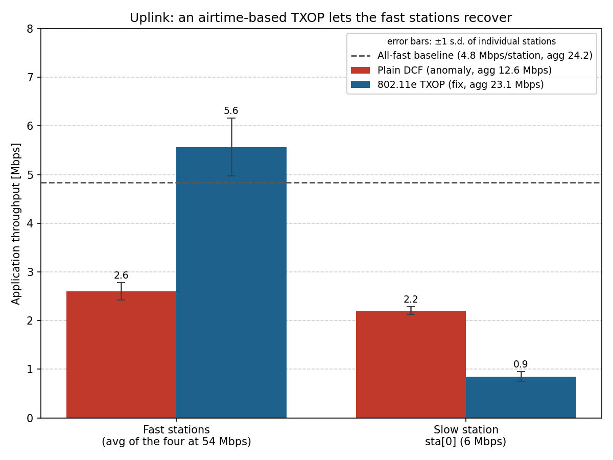

IEEE 802.11 Rate Anomaly
========================

Goals
-----

A Wi-Fi cell is a shared medium: at any instant only one station can be
transmitting. When several stations have traffic to send, the 802.11 Distributed
Coordination Function (DCF) shares the channel between them *fairly* — but "fairly"
turns out to mean something surprising. This showcase demonstrates the **802.11 rate
anomaly**: a single station transmitting at a low bitrate does not just get less for
itself, it drags the throughput of *every* other station down to its own level, and
the whole network loses a large fraction of its capacity.

We reproduce the effect with a small 802.11g network and measure just how much one
slow station costs everyone else. The page then shows the two standard cures for the two
forms of the anomaly: the 802.11e TXOP on the contention-based uplink, and an
airtime-fair transmit queue at the access point on the downlink.

| Verified with INET version: ``4.6``
| Source files location: `inet/showcases/wireless/rateanomaly <https://github.com/inet-framework/inet/tree/master/showcases/wireless/rateanomaly>`__

About 802.11 Channel Access and the Rate Anomaly
------------------------------------------------

802.11 stations share a single half-duplex radio channel — only one of them can be on
the air at a time. They coordinate access with the Distributed Coordination Function
(DCF), a carrier-sense multiple access scheme with collision avoidance (CSMA/CA): a
station listens before transmitting, and when the channel is busy it waits a random
*backoff* — a random number of idle slots — before trying again.
Averaged over time, this random backoff gives every contending station a statistically
**equal number of opportunities to transmit**. That is the fairness DCF provides.

802.11 is also a multi-rate technology. A station with a weaker or noisier link falls
back to a lower bitrate so that its frames remain decodable. The catch is that a frame
sent at a low bitrate occupies the channel *longer*. The data bits take proportionally
longer to clock out — about nine times longer at 6 Mbps than at 54 Mbps, since the rate
is nine times lower. The whole on-air frame grows by a slightly smaller factor, about
eight times, because the physical-layer preamble and header take a fixed time that does
not shrink with the data rate. And the full channel cost of a transmission — the frame
plus the fixed interframe spaces and the acknowledgment (which for the slow station is
itself sent at a low rate) — comes to a smaller factor still, roughly six times for
6 versus 54 Mbps. However it is counted, a slow frame ties up the shared medium several
times longer than a fast one.

Now combine the two facts. DCF equalizes the *number* of transmissions, not the *time*
each station spends transmitting. A slow station transmits about as often as everyone
else, but each of its transmissions ties up the channel far longer — so it consumes a
disproportionate share of channel time. Because the medium is shared, the time the slow
station occupies is time the fast stations cannot use. The fast stations are therefore
throttled down toward the slow station's throughput. In the limit, *all* stations end
up with roughly the **same** throughput, close to what the slowest station would
achieve on its own. This is the IEEE 802.11 performance anomaly, first characterized by
`Heusse, Rousseau, Berger-Sabbatel, and Duda
<https://ieeexplore.ieee.org/document/1208921/>`__ (INFOCOM 2003).

The root cause is that standard DCF provides **transmission-opportunity fairness**
(equal access count) rather than **airtime fairness** (equal channel time). Scheduling
disciplines that enforce airtime fairness avoid the anomaly, but they are outside plain
DCF.

These airtime-fair disciplines take two forms, because the anomaly itself does — and this
showcase reproduces both. One form is *uplink*: independent stations contending, each running
its own DCF. Fixing it means every *contending* station must bound its own share, which is
what the 802.11e standard adds with the transmission opportunity (TXOP). The mirror-image
*downlink* form appears when one access point serves many clients of mixed rates. There is no
contention to arbitrate — a single transmitter divides *its own* airtime among its
destinations, a scheduling problem rather than a contention one.

The downlink form is the one production access points face. The Linux ``mac80211`` stack
schedules its own frames with a deficit round-robin whose deficit is counted in airtime
(microseconds) instead of bytes (Høiland-Jørgensen et al., `"Ending the Anomaly"
<https://arxiv.org/abs/1703.00064>`__, USENIX ATC 2017), and many commercial access points
expose an equivalent "airtime fairness" knob. Such a transmit-side scheduler only governs the
frames a node sends itself, so it cures the downlink case but does nothing for distributed
uplink contention — the two forms need separate fixes, and both are shown below.

The Model
---------

802.11 Configuration in INET
~~~~~~~~~~~~~~~~~~~~~~~~~~~~~~

The network uses three kinds of node:

- :ned:`WirelessHost` — the contending stations, each with an 802.11 interface;
- :ned:`AccessPoint` — the access point the stations associate with; it bridges the
  wireless cell to a wired Ethernet segment;
- :ned:`StandardHost` — a wired server that receives the stations' traffic.

Each station's data rate is pinned with the wlan interface's ``bitrate`` parameter, and
``opMode`` selects 802.11g. No rate-control algorithm is active, so every station
transmits at exactly its configured rate regardless of conditions. This is what lets us
make one station slow and the rest fast purely by configuration:

.. literalinclude:: ../omnetpp.ini
   :start-at: *.sta[*].wlan[*].opMode
   :end-at: pendingQueue.packetCapacity
   :language: ini

The relevant settings:

- ``opMode = "g(erp)"`` — every interface runs 802.11g.
- ``bitrate`` — the fixed data rate. Here it is 54 Mbps everywhere; the configurations
  below override it for one station to open the rate gap.
- The transmit ``power`` is generous and all stations sit close to the access point, so
  every link is error-free at every rate. The slow station is slow *by configuration*,
  not because of a weak signal — this isolates the anomaly from packet loss.
- A MAC queue of ten frames (``pendingQueue.packetCapacity``) together with an
  over-provisioned UDP source keeps every station continuously backlogged, so the channel
  is fully contended. This is the saturated regime in which the rate anomaly is defined.
  The exact depth does not matter as long as the queue never drains — ten frames is simply
  enough to keep one always ready to send while the excess is dropped at the queue rather
  than buffered into a growing delay.

Every station sends a saturating UDP stream to the server on its own port, so
throughput can be measured separately for each station:

.. literalinclude:: ../omnetpp.ini
   :start-at: [Config UplinkBase]
   :end-at: *.server.app[*].localPort
   :language: ini

These traffic settings, together with the radio and node placement in ``[General]``, make up
an abstract ``[Config UplinkBase]`` that every uplink configuration extends; the downlink
section later builds a parallel ``[Config DownlinkBase]``.

The Network
~~~~~~~~~~~

The network contains an access point with five wireless stations spread along a line 8 to
11 m away, and a wired server reachable through the access point. All five stations upload
a saturating UDP flow to the server at the same time, so they continuously contend for the
channel. ``sta[0]`` is the station the later configurations slow down; the other four
always stay at 54 Mbps. The node positions live in ``[General]``, so every configuration on
this page — uplink and downlink alike — uses the same layout.

.. figure:: media/network.png
..
   FIGURE RECIPE (redo via the "omnetpp-mcp-sim" skill)
   type:     canvas
   config:   UplinkHomogeneous   # ../omnetpp.ini (node positions live in [General], so
             every configuration -- uplink and downlink alike -- uses this same layout)
   seed:     default
   shows:    topology -- the configurator/radioMedium/visualizer infrastructure modules,
             five sta[*] wireless hosts 8-11 m from the accessPoint, and the
             wired server reachable over Eth100M
   anchor:   initial state (t=0, before run). Structural -- no timing; if the module set
             or links differ, the NED changed.
   capture:  set_canvas_view {module_path:"<root>", zoom:18.938} then get_canvas_image
             {module_path:"<root>", area:"module_rectangle", margin:5,
             output_file:"doc/media/network.png"}. No cropping or post-processing --
             this is exactly Qtenv's right-click "Export to Image", entire module, 5 px.
             Was 583x469.
             zoom 18.938 is the same zoom as the two downlink cell figures below, so all
             three canvas shots on this page are framed alike. Set it EXPLICITLY: fit:true
             depends on the Qtenv window size (it yielded 18.9 in one window and 28.5 in a
             larger one), so it does not replay. If the frame ever looks mostly empty
             again, the cause is the layout, not the capture -- check that [General] still
             spaces the stations 4 m apart (they span y=4..20 of the bgb=30,24 playground).
             Do not "fix" it by cropping the PNG, and note that area="viewport" is no help
             either: it inherits the Qtenv window's 4:3 aspect while the content is about
             2:1, so it clips or leaves a worse band.
   stamp:    captured 2026-07, INET 4.6

The Configurations
~~~~~~~~~~~~~~~~~~

Six runnable configurations are defined, one run each, in two families of three. The uplink
family has the stations contending; the downlink family has the access point serving them.
Within each family there is a no-rate-gap baseline, the anomaly, and the fix — so every claim
on this page is a comparison between two configurations that differ in exactly one thing:

===================  ==========================================================
configuration        what it shows
===================  ==========================================================
UplinkHomogeneous    baseline — all five stations at 54 Mbps
UplinkAnomaly        the anomaly — ``sta[0]`` at 6 Mbps, the rest at 54
UplinkTxop           the fix — the same rate gap under 802.11e TXOP
DownlinkHomogeneous  baseline — the AP serves all five clients at 54 Mbps
DownlinkAnomaly      the anomaly — frame-fair AP queue, ``sta[0]`` at 6 Mbps
DownlinkAirtimeFair  the fix — airtime-fair AP queue, same rate gap
===================  ==========================================================

Each is run from the showcase directory with, for example:

.. code-block:: bash

    $ inet -u Cmdenv -c UplinkAnomaly          # one run, no parameter study
    $ inet -u Qtenv  -c DownlinkAirtimeFair    # watch it in the GUI

The rate gap is the same 6-versus-54 Mbps everywhere, so the uplink and downlink halves are
directly comparable. The sections below work through the uplink family first and the downlink
family after it, each time establishing the anomaly before introducing the fix.

The UplinkHomogeneous and UplinkAnomaly Configurations
~~~~~~~~~~~~~~~~~~~~~~~~~~~~~~~~~~~~~~~~~~~~~~~~~~~~~~

The first two uplink configurations set up the contrast. In **UplinkHomogeneous**, all five
stations transmit at 54 Mbps — the baseline, in which the channel is shared fairly and the
network runs at full 802.11g capacity. In **UplinkAnomaly**, a single line pins ``sta[0]`` to
the slowest 802.11g rate while the other four stay at 54 Mbps:

.. literalinclude:: ../omnetpp.ini
   :start-at: [Config UplinkHomogeneous]
   :end-at: bitrate = 6Mbps
   :language: ini

Results
-------

Each station's application-level throughput is measured at the server over the
steady-state interval, after association settles. Each run lasts 5 s, with the first
1 s discarded as warmup, so throughput is averaged over the remaining 4 s.

DCF is not deterministic — the random backoff draws from the RNG — so results vary from
seed to seed, by a few tenths of a Mbps for a single station over 4 s. The charts and the
table in this section each come from **one run**, so they show a concrete realisation
rather than an average: the anomaly aggregate reads 12.0 Mbps here, against 12.4 Mbps for the
mean of the three runs used in the TXOP comparison later. The effect being shown is far larger
than that scatter, but the per-station detail is not — the frame counts below, which by theory
should be equal, still spread by about ±10% within a single run.
The two later charts that compare a *fix* against the anomaly do average three
repetitions, because there the differences being plotted are comparable to the scatter.

In the **UplinkHomogeneous** baseline, all five stations achieve nearly the same throughput,
about 4.7–5.1 Mbps each, for an aggregate of roughly 24 Mbps — full 802.11g saturation
throughput at this payload size.

When one station is slowed to 6 Mbps in **UplinkAnomaly**, every station — including the
four still configured for 54 Mbps — drops to about 2.2–2.5 Mbps. The fast stations do
not merely lose a little throughput; they are pulled down to nearly the slow station's
level, settling just above the floor it sets:

.. figure:: media/per-station-throughput.png
..
   FIGURE RECIPE (redo via the "inet-showcase-charts" skill)
   type:     chart (matplotlib)
   anf:      RateAnomalyShowcase.anf   chart "Per-station throughput"
   inputs:   results/*.sca   from configs UplinkHomogeneous + UplinkAnomaly, ONE run each
             (no --repeat: this figure shows a single realisation, as it always has)
   record:   inet -u Cmdenv -c UplinkHomogeneous -r 0
             inet -u Cmdenv -c UplinkAnomaly     -r 0
   shows:    per-station application throughput, UplinkHomogeneous (all 54 Mbps) vs the
             rate anomaly (sta[0] at 6 Mbps); the four fast stations collapse to the
             slow station's level (dotted line)
   anchor:   data is structural — server.app[*] packetReceived:count x 0.002 -> Mbps.
             If the per-station series set changes, the scenario/recording changed -> re-derive.
   backend:  matplotlib -> identical in IDE and headless
   export:   opp_charttool imageexport RateAnomalyShowcase.anf -n "Per-station throughput"
             -f png --dpi 150 -d doc/media/   ; size 1200x900, 8x6 in via image_export_width/height
   stamp:    captured 2026-06, INET 4.6

The reason is visible in the raw frame counts: over the measurement interval every
station — fast or slow — successfully transmits a similar *number* of frames, about
1,090 to 1,270 in this run — within ±10% of each other, against the six-fold airtime
difference that follows. DCF hands out transmission opportunities at roughly the same
rate to everyone, exactly as designed. But each of the
slow station's frame exchanges tied up the channel several times longer — around six
times, once the rate-independent preamble, interframe spaces, and acknowledgment are
included — so it consumed most of the channel time and left little for the others.

.. figure:: media/frames-per-station.png
..
   FIGURE RECIPE (redo via the "inet-showcase-charts" skill)
   type:     chart (matplotlib)
   anf:      RateAnomalyShowcase.anf   chart "Frames per station"
   inputs:   results/*.sca   from config UplinkAnomaly, ONE run (run 0 -- no sweep any more)
             Do NOT record this with --repeat=3: averaging only 3 seeds is the worst of
             both worlds here. The per-station counts scatter by ~100 frames run to run,
             so 3 samples import that scatter without cancelling it. Measured at n=10 the
             four fast stations agree within 8% and the slow station sits ~16% below them.
             How flat ONE run reads is pure seed luck, and the seed moved twice as the
             sweep was cut (6 points -> 4 -> none), because seed-set defaults to the run
             number: bars were +-4% at seed 5, +-8% at seed 3, and are 1087..1268 (+-10%)
             at seed 0 now. That is honest -- the prose quotes the +-10% spread -- but if
             the figure ever needs to read flat, record 10+ reps rather than hunting for a
             flattering seed. The chart script averages duplicates, so reps just work.
   record:   inet -u Cmdenv -c UplinkHomogeneous -r 0
             inet -u Cmdenv -c UplinkAnomaly -r 0
   shows:    frames successfully transmitted per station in the rate-anomaly case
             (slow = 6 Mbps); near-equal counts = DCF's equal transmission opportunities
   anchor:   data is structural — server.app[*] packetReceived:count for the UplinkAnomaly
             run. If that run is absent or counts diverge, re-derive.
   backend:  matplotlib -> identical in IDE and headless
   export:   opp_charttool imageexport RateAnomalyShowcase.anf -n "Frames per station"
             -f png --dpi 150 -d doc/media/   ; size 1200x900, 8x6 in via image_export_width/height
   stamp:    captured 2026-06, INET 4.6

Where the frame counts show that each station gets an equal *number* of turns, a
sequence chart shows how unequal those turns are in *duration*. The chart below captures
about 2.6 ms of the shared channel in a reduced two-station illustration — one station
fixed at 6 Mbps, the other at 54 Mbps, each sending a light, collision-free stream (the
other three stations idle) so every frame stands alone. Each frame is drawn as a block
whose width is the time it holds the medium:

.. figure:: media/frame-airtime-sequence.png
..
   FIGURE RECIPE (redo via the "omnetpp-ide-mcp" skill)
   type:     seqchart
   config:   UplinkAnomaly, reduced to two active stations (apps on
             sta[2..4] disabled) at LIGHT load so frames don't collide: sta[0]=6 Mbps
             sending every 3 ms, sta[1]=54 Mbps sending every 0.8 ms
   seed:     PINNED --seed-set=5, not the default. This figure was captured back when the
             config was a 6-point rate sweep and slowBitrate=6 was run 5, so it drew
             seed-set 5. There is no sweep now -- UplinkAnomaly is a single run 0, which
             would default to seed-set 0 and a different frame layout. -r 0 --seed-set=5
             reproduces the original run exactly (verified: server.app[*]
             packetReceived:count 1156/1168/1249/1252/1258), so the PNG below is still the
             run this recipe describes. Drop --seed-set only if you re-capture the figure,
             and then re-derive the seq numbers and window below.
   shows:    four narrow 54 Mbps frames (sta[1], seq 2500-2503) then one wide 6 Mbps frame
             (sta[0], seq 667) carrying the same 1000-byte payload -- block width = airtime,
             so the slow frame occupies the channel ~8x longer (measured 7.8x on-air)
   record:   inet -u Cmdenv -c UplinkAnomaly -r 0 --seed-set=5
               --*.sta[2].numApps=0 --*.sta[3].numApps=0 --*.sta[4].numApps=0
               --*.sta[0].app[0].sendInterval=3ms --*.sta[1].app[0].sendInterval=0.8ms
               --record-eventlog=true --eventlog-recording-intervals=2s..2.05s
               --sim-time-limit=2.06s --result-dir=results/elog3
   source:   results/elog3/UplinkAnomaly-#0.elog
   axes:     sta[0] (6 Mbps), sta[1] (54 Mbps), accessPoint   (this top-to-bottom order)
   display:  NETWORK_COMMUNICATION; timeline SIMULATION_TIME (linear -- required so block
             width equals airtime; NONLINEAR flattens the contrast)
   anchor:   window 2.004000s..2.006700s -- the collision-free 6 Mbps frame occupies
             [2.005044s, 2.006494s]. Any clean (non-colliding) slow frame works; if the
             wide/narrow width ratio stops being ~8x, the bitrates changed.
   capture:  Sequence Chart screenshot, top band (ruler + position/range readout) cropped
             off so the bottom ruler carries the time axis; was 977x328
   stamp:    captured 2026-07, INET 4.6

Each narrow block is a 54 Mbps frame; the wide block is a single 6 Mbps frame carrying
the same 1000 bytes, so its on-air time is about eight times longer — the data alone
would take nine times as long at the lower rate, but the fixed preamble keeps the whole
frame just under that. The slow frame alone holds the channel about as long as the whole
run of fast frames beside it. That per-frame airtime gap is the mechanism behind the
anomaly: because DCF hands the stations a similar *number* of transmissions (the
frame-count chart above), the slow station's far longer frames let it swallow a
correspondingly larger share of channel time — dragging every station's throughput down
toward its own.

The cost to the network as a whole is severe. The aggregate falls from 24.1 Mbps in the
baseline to 12.0 Mbps here — **one slow station halves the capacity of the entire cell**,
and it does so without any of the other four being misconfigured, weak, or overloaded. The
fast stations' own throughput falls almost in step with the slow station's even though their
configuration never changes. That is the rate anomaly: equal access, unequal airtime.

The size of the loss tracks the size of the rate gap — a station at 36 Mbps costs the cell far
less than one at 6 Mbps — but the mechanism is the same at every gap, so the showcase fixes the
gap at the worst case the 802.11g rate set allows, 6 against 54 Mbps, and spends its
configurations on the *fixes* instead.

Solving the Anomaly with Airtime Fairness
-----------------------------------------

The anomaly follows from DCF sharing *transmission opportunities* equally. The IEEE 802.11e
amendment adds a mechanism that shares *airtime* instead: the **transmission opportunity
(TXOP)**. 802.11e replaces DCF with EDCA, which sorts traffic into four access categories;
ordinary best-effort traffic uses AC_BE. A station that wins the channel for a category may
then transmit a burst of frames for up to a bounded *time* — that category's ``txopLimit`` —
before it has to contend again. DCF still hands out wins equally often, so an equal *time* per
win means an equal share of airtime: a fast station simply packs many frames into its slice, a
slow station only a few.

Configuring the TXOP in INET
~~~~~~~~~~~~~~~~~~~~~~~~~~~~

``[Config UplinkTxop]`` inherits the entire anomaly scenario from ``[Config UplinkAnomaly]`` —
same rate gap, same traffic, same node layout — and adds just four assignments:

.. literalinclude:: ../omnetpp.ini
   :start-at: [Config UplinkTxop]
   :end-at: pendingQueue.packetCapacity
   :language: ini

What each one does:

- ``mac.qosStation = true`` **brings EDCA into existence.** In :ned:`Ieee80211Mac` the ``hcf``
  submodule — the QoS coordination function that contains EDCA — is declared ``if qosStation``,
  so this parameter is what instantiates it. It is a per-interface switch, set here on the
  stations and on the access point alike so the whole cell runs EDCA.
- ``mac.hcf.edca.edcaf[1]`` **picks the access category.** EDCA replaces DCF's single contention
  state machine with one per access category, held in the ``edcaf`` submodule vector. The order
  is fixed in ``Edca.ned``: ``edcaf[0]`` is AC_BK, ``edcaf[1]`` AC_BE, ``edcaf[2]`` AC_VI,
  ``edcaf[3]`` AC_VO. All of this showcase's traffic lands in AC_BE, so ``edcaf[1]`` is the only
  category worth configuring here.
- ``txopProcedure.txopLimit = 3.008ms`` **is the fix itself.** The parameter's default is
  ``-1s``, which does not mean "unlimited" — it means *use the standard's value for this access
  category and PHY*, and for AC_BE that value is **zero**: one frame per win, which is precisely
  the behaviour that produces the anomaly. Any nonzero limit turns the win into a time
  allocation. The 3.008 ms used here is the standard's own AC_VI figure for OFDM PHYs, borrowed
  so the number is a sanctioned one rather than an invented one.
- ``pendingQueue.packetCapacity = 50`` **gives the burst something to carry.** A TXOP is worth
  only as much as the frames waiting behind it, and the ten-frame depth set in ``[General]`` is
  not enough to fill a 3.008 ms slice at 54 Mbps. Note the path: under EDCA the pending queue is
  per access category, at ``mac.hcf.edca.edcaf[1].pendingQueue``.

.. admonition:: Fine print — three things that catch people out

   **Your DCF settings go quiet.** Turning on ``qosStation`` does not remove the
   ``dcf`` submodule — it is unconditional in the NED and stays where it was — but the MAC now
   hands every frame to ``hcf`` instead. Parameters set under ``mac.dcf.…`` still assign real
   parameters of a real module; that module is simply no longer on the transmit path, and
   nothing warns you. That is exactly what becomes of ``[General]``'s
   ``*.sta[*].wlan[*].mac.dcf.channelAccess.pendingQueue.packetCapacity = 10`` in this
   configuration, and why the queue depth has to be restated under ``mac.hcf.…``.

   **Traffic reaches AC_BE by default, not by configuration.** The access category is derived
   from the frame's user priority, and by default nothing assigns one: the wlan interface's
   ``classifier`` slot holds an ``OmittedIeee8021dQosClassifier``, so no UP is tagged, the TID
   stays 0, and 802.11's UP-to-AC mapping puts TID 0 in AC_BE. To spread traffic over the other
   categories, install a real classifier — ``*.sta[*].wlan[*].classifier.typename =
   "QosClassifier"`` — which maps UDP/TCP ports and IP protocols to user priorities.

   **The other EDCA knobs cannot do this job.** ``Edcaf`` also exposes ``aifsn``, ``cwMin`` and
   ``cwMax`` (each ``-1`` by default, meaning the standard's per-category value). They change how
   *often* a category wins the channel, not how *long* it holds it, so they can prioritise a
   station but cannot equalise airtime. Of the four, only ``txopLimit`` allocates time.

At a zero TXOP limit EDCA is *nearly* plain DCF — one frame per win either way — but not
exactly: AC_BE contends with AIFSN 3, one slot time longer than DCF's DIFS. So this
comparison changes the MAC as well as the TXOP limit. The difference works against the
result shown below rather than for it: the longer AIFS makes EDCA marginally slower per
win, so it can only understate the gain that follows.

What the TXOP recovers
~~~~~~~~~~~~~~~~~~~~~~

Rerunning the same rate gap with the TXOP in place tells a very different story. Where plain
DCF drags the fast stations down to the slow one's level, the TXOP hands them nearly all of
their throughput back:

..
   FIGURE RECIPE (redo via ../ul-chart.py)
   type:     chart (matplotlib)
   shows:    fast-station-average and slow-station application throughput, plain DCF vs
             802.11e TXOP, at the single 6-vs-54 Mbps rate gap; aggregates carried in the
             legend, all-fast baseline as a dashed line
   inputs:   results/solve/{UplinkAnomaly,UplinkTxop,UplinkHomogeneous}-#*.sca, ALL 3 reps
             (DCF is not deterministic -- same RNG/backoff -- so all three are averaged alike)
   record:   inet -u Cmdenv -c UplinkHomogeneous -r 0..2 --repeat=3 --result-dir=results/solve
             inet -u Cmdenv -c UplinkAnomaly     -r 0..2 --repeat=3 --result-dir=results/solve
             inet -u Cmdenv -c UplinkTxop        -r 0..2 --repeat=3 --result-dir=results/solve
   metric:   server.app[*] packetReceived:count x 0.002 -> Mbps; aggregate = sum over the 5
             apps per run, fast-avg = mean over app[1..4]; all configs averaged over 3 reps
   anchor:   structural -- if the UplinkAnomaly/UplinkTxop configs change, re-derive. The
             comparison results are kept out of results/ root so they don't contaminate the
             single-run .anf charts (whose filters match packetReceived:count of any config).
   plot:     ../ul-chart.py (matplotlib; DCF red, TXOP blue; 8x6 in @ dpi 150). Deliberately
             NOT per station -- see the lockout caveat below; the downlink counterpart
             ../dl-chart.py DOES plot per station because that scheduler is deterministic.
   stamp:    captured 2026-07, INET 4.6

The fast-station average recovers from 2.5 Mbps under DCF to 5.5 Mbps under TXOP — better than
double, and comfortably past the 4.8 Mbps each station gets in the no-rate-gap baseline (the
dashed line). The aggregate climbs from 12.4 to 23.1 Mbps, recovering nearly all of the 24.1
Mbps the cell manages with no slow station at all. The slow station itself falls from 2.3 to
0.9 Mbps — and that *is* airtime fairness, not a side-effect: given only its fair share of
time, a 6 Mbps station can clock out proportionally fewer bits, so it stops monopolising the
medium and the others get their time back.

That the fast stations end up slightly *above* the all-fast baseline is not a measurement
artefact. Bursting amortises the fixed per-exchange overhead — backoff, SIFS/DIFS, the PHY
preamble and PLCP header — over several frames, so a station that transmits in bursts is simply
more efficient than one that contends for every frame. It is the same reason modern 802.11
(n/ac/ax) does much the same all the time: frame aggregation (A-MPDU), typically carried inside
a TXOP, amortises exactly that overhead. The showcase keeps a plain-DCF baseline only to isolate
the rate-anomaly mechanism from this efficiency bonus. The TXOP limit is still a tradeoff, not
"bigger is always better": longer bursts raise the other stations' latency and, under permanent
saturation, can starve a station outright — the EDCA lockout noted below.

TXOP and the access-point airtime scheduler noted earlier are two fixes for two faces of the
same anomaly, not the same fix twice. TXOP is *distributed* — it bounds each *contending*
station's win, so it is the one that applies to the uplink scenario shown here. The
``mac80211`` scheduler is *centralised* — it apportions a single transmitter's airtime among
its own destinations, so it is the fix for the *downlink*, AP-to-clients form. Both act on the
same principle — allocate channel *time*, not transmission *count* — but in different places.

One honest caveat — and the reason the chart above plots a *group* average rather than the five
stations separately. TXOP restores the aggregate capacity and the fast-station group reliably,
but it does **not** hand each individual station equal airtime here. Under this permanent,
extreme saturation INET's EDCA sometimes locks a station out completely: in one of the three
TXOP repetitions ``sta[1]`` receives *zero* throughput for the whole measurement window while
its neighbours climb to 6.6–7.5 Mbps and absorb its share. The aggregate for that run is
22.3 Mbps — barely different from the other two — so the system-level result is untouched by
which station happens to lose. Averaging over repetitions is what keeps the group figures
steady; a per-station plot would be dominated by that run-to-run lockout, so it is deliberately
left out. The system-level result (capacity recovered, the fast group no longer penalised) is
robust; perfect per-station fairness is not. The downlink fix below *is* per-station fair, for
a reason that is worth the contrast.

The Downlink Form: Airtime Fairness at the Access Point
-------------------------------------------------------

Everything so far has been *uplink*: independent stations contending, cured by bounding each
station's own airtime with TXOP. The anomaly has a mirror image on the **downlink**, when one
access point serves many clients of mixed rates. There is no contention to arbitrate now — a
single transmitter holds the channel and must divide *its own* airtime among its destinations,
so the fix is a **scheduling** decision inside the access point's transmit queue rather than a
contention rule in the MAC. This is the form production access points face, and the one the
Linux ``mac80211`` deficit-airtime scheduler cures; INET models that scheduler as the
:ned:`AirtimeFairnessQueue`.

A mixed-rate downlink cell
~~~~~~~~~~~~~~~~~~~~~~~~~~~~

``[Config DownlinkBase]`` reverses the traffic — the server sources one saturating UDP flow per
station and the access point relays them over the air — and makes ``sta[0]`` the slow client by
pinning the rate the access point uses toward it:

.. literalinclude:: ../omnetpp.ini
   :start-at: [Config DownlinkBase]
   :end-at: dataFrameBitratePerReceiver
   :language: ini

The access point serves ``sta[0]`` at 6 Mbps and every other client at the interface-wide 54 Mbps.
A real access point *rate-adapts* to each client — a distant or obstructed one settles on a low
rate on its own — and INET's ``dataFrameBitratePerReceiver`` lets us set that per-client rate
directly, keyed by the client's interface (resolved to a MAC address at run time). The result is a
**mixed-rate cell**: one AP radio transmitting at 6 Mbps to ``sta[0]`` and at 54 Mbps to the other
four — the setup that makes airtime scheduling necessary.

For the same slow client produced the *realistic* way — a wall in front of ``sta[0]`` plus rate
control, so its 6 Mbps is earned from a weak link rather than declared — see the ``ratecontrol``
showcase (its ``DownlinkRateAnomaly`` config). Pinning the rate here keeps the focus on the airtime
scheduling itself, free of rate-adaptation transients and packet loss.

Configuring the airtime-fair queue
~~~~~~~~~~~~~~~~~~~~~~~~~~~~~~~~~~~

The access point's transmit queue chooses which client's frame to send next.
:ned:`AirtimeFairnessQueue` is a drop-in replacement for the MAC's pending queue, so installing it
is a typename override; the two configurations then flip a single switch on it,
``fairnessEnabled``:

.. literalinclude:: ../omnetpp.ini
   :start-at: pendingQueue.typename = "AirtimeFairnessQueue"
   :end-at: pendingQueue.fairnessEnabled = true
   :language: ini

What each one does:

- ``mac.dcf.channelAccess.pendingQueue.typename`` **installs the scheduler.** The queue occupies
  the same slot as the default :ned:`PendingQueue`, so nothing else in the MAC changes, and only
  the access point needs it — the stations here are plain receivers. (On a QoS access point the
  override goes on each access category instead, at ``mac.hcf.edca.edcaf[*].pendingQueue.typename``,
  giving one airtime-fair queue per category.) The queue does not have to be told who its clients
  are: it reads the receiver address off each frame and creates a per-station branch on demand, so
  it adapts to whatever set of stations the access point ends up serving.
- ``fairnessEnabled`` **is the comparison switch** — ``true`` by default. Setting it false keeps
  the per-station branches and their round-robin rotation but pins every gate open, which is what
  makes ``[Config DownlinkAnomaly]`` a clean frame-fair baseline rather than a different queue
  altogether.
- ``packetCapacity = 50`` **is shared across all clients**, not per client, so it needs an
  overflow rule — and ``dropperClass`` supplies one. It defaults to
  ``Ieee80211LongestFlowDropper``, which drops from the longest per-client backlog rather than from
  the tail of whichever flow happens to overflow. That is what keeps a slow client's backlog from
  crowding the others out of the shared queue, and it matters more than it sounds: it is what makes
  the frame-fair setting a clean *frame-fairness* baseline rather than a mixture of two effects.

``[Config DownlinkAnomaly]`` runs the queue **frame-fair** (``fairnessEnabled = false``): it serves
each client an equal number of *frames*, round-robin — the downlink analog of DCF's equal channel
access. ``[Config DownlinkAirtimeFair]`` runs it **airtime-fair** with a *deficit round-robin*:
each client carries a time budget, topped up by a fixed *quantum* — 1500 µs by default, which is
roughly one full-length frame's airtime at the low end of the rate range and several frames'
worth at the high end. Each frame the client sends is charged its own on-air duration, computed
from the rate and length actually used, so a slow client's long frames drain its budget fast.
The top-up is granted lazily rather than every round: the scheduler passes over a backlogged
client whose budget has gone negative, hands it one quantum, and moves on, returning to it once
it is back in credit. Over time every client therefore gets the same share of transmit time
whatever its frame size. (The charge is the frame's own air time — preamble, header and
payload — not the acknowledgment and interframe gaps around it. It is applied after the fact,
per transmission, so retransmissions are charged too; here the links are error-free and the
access point is the only transmitter, so there are effectively none.)

.. admonition:: Fine print — tuning the queue

   ``quantum`` (1500 µs) is a granularity knob, not a fairness knob. A client is eligible whenever
   its deficit is non-negative, and it is charged only *after* the frame goes out, so the quantum
   can never block a frame — it only sets how many top-up rounds a client waits after an expensive
   one. Smaller values interleave the clients more finely at the cost of more scheduler rounds;
   larger values serve more frames per visit and raise the other clients' latency. The long-run
   share is the same either way.

   ``weight`` (1) scales that credit: a client topped up by ``quantum * weight`` gets a
   proportionally larger time share, which is how *weighted* airtime fairness would be expressed.
   Note that it is not yet per-station. The enclosing queue forwards ``quantum``, ``weight``,
   ``fairnessEnabled`` and ``subqueueTypename`` to every per-station branch it creates, matching
   them by parameter name — which is what lets the compound be configured as a whole, but also
   means every branch receives the same values. Setting ``weight`` uniformly is therefore
   equivalent to scaling ``quantum``; giving one client a different weight from another would need
   the branch parameters to be individually addressable.

   ``subqueueTypename`` selects the type of each per-station FIFO
   (``inet.queueing.queue.PacketQueue`` by default) — swap it to give each client its own capacity
   or an active queue-management discipline.

That is also why the anomaly baseline here is a per-client round robin and not a plain FIFO. A
stock access point with a single drop-tail FIFO does *not* reproduce the rate anomaly cleanly —
running this same cell with INET's default ``PendingQueue`` instead gives 4.1 Mbps to ``sta[0]``
and only 0.7–0.8 Mbps to each fast client, for an aggregate of 8.5 Mbps. That is a different and
deeper pathology: with one shared FIFO the slow client's backlog captures a growing share of the
queue and it ends up with *more* throughput than anyone else, on top of the airtime effect. The
round robin isolates the rate anomaly from that head-of-line blocking, so the comparison below
changes one thing only — how the airtime is divided.

Frame fairness versus airtime fairness at the AP
~~~~~~~~~~~~~~~~~~~~~~~~~~~~~~~~~~~~~~~~~~~~~~~~~~

Both runs are visible in the cell itself. The rate visualizer draws each client's PHY rate as a bar
above the access point — a short red bar at 6 Mbps for ``sta[0]``, tall green bars at 54 Mbps for
the other four — identical in both runs, since the rates are pinned. What changes between the two is
how the AP divides its transmit time, and each client's running received-packet count shows the
effect.

Serving equal *frames*, the frame-fair queue lets ``sta[0]``'s slow transmissions dominate the
channel — all five counts climb together to nearly the same value (459 to 492), the four fast clients
dragged down to the slow client's pace:

.. figure:: media/downlink-cell-anomaly.png
..
   FIGURE RECIPE (redo via the "omnetpp-mcp-sim" skill)
   type:     canvas (get_canvas_image, live inspector)
   config:   DownlinkAnomaly, run 0
   seed:     default
   shows:    the downlink cell under the frame-fair AP queue -- rate-visualizer bars (sta[0]=6 red,
             sta[1..4]=54 green) and per-station received-packet counts (all clients 459-492)
   anchor:   at t=2s (1s past warmup); counts scale with time, the anomaly/fix contrast is
             structural. If the bars stop showing 6 vs 54, the dcf datarateSelected wiring changed.
   capture:  get_canvas_image (post-2026-07 fix it renders the live inspector = Qtenv's "Export to
             Image", so the visualizer overlays land in place, no chrome) -- run to 2s express,
             set_canvas_view(RateAnomalyShowcase, zoom=18.938) -- an explicit zoom, not
             fit=true, which depends on the Qtenv window size -- then
             get_canvas_image(RateAnomalyShowcase, area=module_rectangle, margin=5). No cropping.
   record:   inet -u Qtenv -c DownlinkAnomaly --mcp-server-address localhost:8765
             (the 4 m station spacing set in [General] keeps the per-station readouts apart)
   stamp:    captured 2026-07, INET 4.6

Switching the queue to airtime-fair leaves the rates and the layout untouched — the bars are
unchanged — but now each client is charged for the *time* its frames hold the channel, not their
number. ``sta[0]``'s long 6 Mbps frames spend its budget fast, so it is served rarely (its count
barely moves, ~132), while the four fast clients, cheap in airtime, are served far more often and
pull ahead (~870-960):

.. figure:: media/downlink-cell-fair.png
..
   FIGURE RECIPE (redo via the "omnetpp-mcp-sim" skill)
   type:     canvas (get_canvas_image, live inspector)
   config:   DownlinkAirtimeFair, run 0
   seed:     default
   shows:    the same cell under the airtime-fair AP queue -- identical rate-visualizer bars
             (sta[0]=6 red, sta[1..4]=54 green) but per-station counts now split: sta[0]=132,
             the four fast clients ~870-960
   anchor:   at t=2s (1s past warmup); counts scale with time, the anomaly/fix contrast is
             structural. If the bars stop showing 6 vs 54, the dcf datarateSelected wiring changed.
   capture:  same get_canvas_image live-inspector capture as the anomaly figure above, for this config.
   record:   inet -u Qtenv -c DownlinkAirtimeFair --mcp-server-address localhost:8765
             (the 4 m station spacing set in [General] keeps the per-station readouts apart)
   stamp:    captured 2026-07, INET 4.6

The per-station throughput makes the same point quantitatively:

.. figure:: media/downlink-throughput.png
..
   FIGURE RECIPE (redo via ../dl-chart.py)
   type:     chart (matplotlib)
   shows:    per-station application throughput, frame-fair (anomaly) vs airtime-fair AP queue,
             against the all-fast per-client baseline (dashed); frame-fair collapses all five
             clients to ~2.7 Mbps, airtime-fair lifts the four fast clients to ~5.3 -- slightly
             ABOVE the 4.9 baseline -- while holding sta[0] to its ~0.7 Mbps time share
   inputs:   results/dl/DownlinkAnomaly-*.sca, results/dl/DownlinkAirtimeFair-*.sca and
             results/dl/DownlinkHomogeneous-*.sca, ALL 3 reps
             (DCF backoff uses the RNG, so all three configs are averaged alike)
   record:   inet -u Cmdenv -c DownlinkAnomaly     -r 0..2 --repeat=3 --result-dir=results/dl
             inet -u Cmdenv -c DownlinkAirtimeFair -r 0..2 --repeat=3 --result-dir=results/dl
             inet -u Cmdenv -c DownlinkHomogeneous -r 0..2 --repeat=3 --result-dir=results/dl
   metric:   sta[i].app[0] packetReceived:count x 0.002 -> Mbps; per-station mean over 3 reps;
             baseline = mean over the five DownlinkHomogeneous clients
   anchor:   structural -- if the Downlink configs change, re-derive
   plot:     ../dl-chart.py (matplotlib; anomaly red, fix blue; 8x6 in @ dpi 150)
   stamp:    captured 2026-07, INET 4.6

Frame-fair scheduling reproduces the anomaly. ``sta[0]``'s frames sit on the air several times
longer, and serving them one-for-one with the fast clients' frames lets them swallow most of the
airtime — so all five clients collapse to about 2.7 Mbps and the aggregate falls to ~14 Mbps.
Airtime fairness reverses it: charged for the time they occupy, the four fast clients climb back
to about 5.3 Mbps each — almost exactly double — and the aggregate recovers to ~22 Mbps. (They
stop a little short of the ~5.5 Mbps a fast station reaches under uplink TXOP: here all five flows
funnel through the one access-point queue rather than five independent radios.)

The dashed line is what the same cell delivers with no rate gap at all — ``[Config
DownlinkHomogeneous]``, all five clients at 54 Mbps — which works out to 4.9 Mbps each, 24.5 Mbps
aggregate. The recovered fast clients land slightly *above* it, at 5.3. That is not a
measurement artefact but a consequence of what the queue charges: the deficit counts a frame's
own air time and not the acknowledgment and interframe gaps around it, and those fixed costs are
proportionally much larger for a short 54 Mbps frame than for a long 6 Mbps one. Equal *charged*
airtime therefore hands the fast clients slightly more than a fifth of the real channel time, and
``sta[0]`` slightly less. The effect is small, and it is the price of an accounting rule simple
enough to compute from the frame alone.

``sta[0]`` moves the other way, down to ~0.7 Mbps — and that is the fairness *working*, not the
slow client being punished. Under frame-fair scheduling ``sta[0]`` was the culprit rather than the
victim: it had been taking far more than its one-fifth share of channel *time*, so its 2.7 Mbps
was inflated by exactly the airtime it stole from the others. Airtime fairness holds it to an equal
*time* share, and ~0.7 Mbps is honestly all a 6 Mbps link delivers in roughly a fifth of the airtime —
while the aggregate *rises* from ~14 to ~22 Mbps, so nothing is taken from anyone. The fast
clients' recovery is precisely the airtime ``sta[0]`` was monopolising, handed back.

And unlike the uplink TXOP result, this fix is cleanly *per-station* fair: a single transmitter
running a deterministic scheduler has no contention lockout to average away, so all four fast
clients land on the same throughput.

Sources: :download:`omnetpp.ini <../omnetpp.ini>`,
:download:`RateAnomalyShowcase.ned <../RateAnomalyShowcase.ned>`

Try It Yourself
---------------

If you already have INET and OMNeT++ installed, start the IDE by typing
``omnetpp``, import the INET project into the IDE, then navigate to the
``inet/showcases/wireless/rateanomaly`` folder in the `Project Explorer`. There, you can
view and edit the showcase files, run simulations, and analyze results.

Otherwise, there is an easy way to install INET and OMNeT++ using `opp_env
<https://omnetpp.org/opp_env>`__, and run the simulation interactively.
Ensure that ``opp_env`` is installed on your system, then execute:

.. code-block:: bash

    $ opp_env run inet-4.6 --init -w inet-workspace --install --build-modes=release --chdir \
       -c 'cd inet-4.6.*/showcases/wireless/rateanomaly && inet'

.. TODO:: opp_env installs inet-4.6, which does not yet contain this showcase or the
   AirtimeFairnessQueue (still on a topic branch). Bump to the first release that ships
   them (likely 4.7) once available — the try-it path is not reproducible against 4.6.

This command creates an ``inet-workspace`` directory, installs the appropriate
versions of INET and OMNeT++ within it, and launches the ``inet`` command in the
showcase directory for interactive simulation.

Alternatively, for a more hands-on experience, you can first set up the
workspace and then open an interactive shell:

.. code-block:: bash

    $ opp_env install --init -w inet-workspace --build-modes=release inet-4.6
    $ cd inet-workspace
    $ opp_env shell

Inside the shell, start the IDE by typing ``omnetpp``, import the INET project,
then start exploring.

References
----------

- M. Heusse, F. Rousseau, G. Berger-Sabbatel, and A. Duda, "Performance Anomaly of
  802.11b," *Proc. IEEE INFOCOM 2003*, pp. 836–843.
  https://ieeexplore.ieee.org/document/1208921/
- T. Høiland-Jørgensen, M. Kazior, D. Täht, P. Hurtig, and A. Brunström, "Ending the
  Anomaly: Achieving Low Latency and Airtime Fairness in WiFi," *Proc. USENIX ATC 2017*,
  pp. 139–151. https://arxiv.org/abs/1703.00064

Discussion
----------

Use `this page <https://github.com/inet-framework/inet-showcases/issues/TODO>`__ in
the GitHub issue tracker for commenting on this showcase.
